# Java 本番パフォーマンス調査完全ガイド：CPU 高騰から Arthas ホットスワップまで

本番サーバーの CPU が突然 90% ないし 100% に急上昇すると、通常、API タイムアウト、SSH のもたつき、ログの大量出力、スレッドプールの積み上がり、サービス利用不可などの問題が同時に発生します。

多くの人が最初に取る対応は：

```bash
kill -9 <PID>
# または直接サービス再起動 / マシン再起動
```

しかしこれは最も危険な対応の一つです。現場を破壊してしまい、後からビジネスの無限ループなのか、GC ストームなのか、スレッドプールの枯渇なのか、システム割り込み異常なのか、メモリ不足による連鎖反応なのかを判断できなくなります。

同時に、Java の本番調査はもう一つの次元の課題にも直面します：

* 本番に完全なデバッグ環境がない；
* ログが重要な箇所に出力されていない；
* 問題が特定のトラフィック条件下でのみ偶発的に発生する；
* `jstack`、`jmap` は静的スナップショットしか提供できず、動的な呼び出し過程の観察が困難。

本記事では「止血 → 証拠保存 → 特定 → 復旧 → 振り返り」を主軸としつつ、Java 本番診断ツール Arthas を深く掘り下げ、完全な調査方法論を提供します：

> まず止血し、次に証拠を保存する。まず特定し、次に復旧する。まず振り返り、次に予防する。Arthas を JVM の「顕微鏡 ＋ メス」として活用する。

---

## 一、全体の調査方針：四段階方法論

Linux 高 CPU の調査では、いきなり再起動するのではなく、以下の四つの段階で進めます。

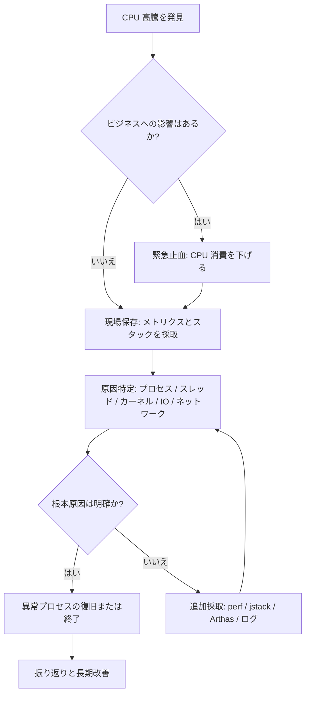

基本原則：

| 段階 | 目標 | 非推奨な対応 | 推奨アクション |
| -- | ----------- | ------------ | ---------------------- |
| 止血 | マシンを操作可能な状態に戻す | 直接 `kill -9` | `kill -STOP` で異常プロセスを一時停止 |
| 証拠保存 | 障害現場を残す | 再起動後に分析 | `top`、`ps`、スレッド、スタック、ログを保存 |
| 特定 | CPU 消費の発生源を見つける | プロセスレベルの CPU だけ見る | スレッド、関数、システムリソースまで掘り下げる |
| 復旧 | 影響範囲をコントロールする | 全トラフィックを盲目的に復旧 | 段階的復旧、カナリア検証 |
| 予防 | 再発を防止する | 「修正済み」とだけ書く | リソース制限、監視、負荷テスト、コード修正を追加 |

Java アプリケーションでは、Arthas の導入により「特定」段階を大幅に加速できます。まずはシステムレベルの止血と証拠保存方法を紹介し、その後 Arthas の実戦的な使い方に入っていきましょう。

---

## 二、迅速な止血と現場証拠の保存

### 2.1 システムがまだ操作可能か確認する

マシンでまだコマンドを入力できる場合、まず全体の負荷を確認します：

```bash
uptime
```

重点確認項目：

```text
load average: 12.34, 10.21, 8.90
```

4 コアマシンなら load が長期にわたり 4 を超えると警戒が必要です。8 コアマシンなら load が長期にわたり 8 を超えるとキューの滞留が顕著です。

CPU コア数の確認：

```bash
nproc
```

全体の CPU、メモリ、プロセス状態の確認：

```bash
top
```

`top` がすでに重い場合、スナップショット式コマンドを使用：

```bash
ps -eo pid,ppid,user,stat,cmd,%cpu,%mem --sort=-%cpu | head -n 15
```

出力例：

```text
  PID  PPID USER  STAT CMD                         %CPU %MEM
12345     1 app   Sl   java -jar order-service.jar 389  42.1
22331     1 root  R    nginx: worker process        78   1.2
```

ここで最も重要なのは以下を見つけること：

* どのプロセスの CPU が最も高いか
* 単一プロセスの高 CPU か、複数プロセスが同時に高いか
* ビジネスプロセスが高いか、システムプロセスが高いか

---

### 2.2 STOP でプロセスを一時停止、直接 KILL しない

あるビジネスプロセスが CPU を使い果たし、マシンが操作不能になった場合、まず一時停止します：

```bash
sudo kill -STOP <PID>
```

`SIGSTOP` の効果はプロセスの実行を一時停止することです。メモリは解放されず、プロセスのコンテキストも破棄されないため、「止血 + 現場保存」に適しています。

一般的なシグナルの比較：

| シグナル | コマンド | 作用 | 現場を保持 | 使用シーン |
| ---- | ------------------ | ---- | ------ | ----------- |
| STOP | `kill -STOP <PID>` | プロセスの一時停止 | はい | 高 CPU の緊急止血 |
| CONT | `kill -CONT <PID>` | プロセスの再開 | はい | 証拠保存後の復旧検証 |
| TERM | `kill -TERM <PID>` | グレースフル終了 | 部分的に保持 | 正常なサービス停止 |
| KILL | `kill -9 <PID>` | 強制終了 | いいえ | プロセスが正常終了できない場合の最終手段 |

> 本番環境では、`kill -9` は最後の手段であるべきで、最初の手段であってはなりません。

---

### 2.3 現場の証拠を保存する

CPU が下がった後、すぐにサービスを復旧させないでください。最も重要なのは現場を保存することです。

一つのディレクトリにまとめて保存することを推奨：

```bash
mkdir -p /tmp/cpu-debug-$(date +%F-%H%M%S)
cd /tmp/cpu-debug-*
```

システムスナップショットの採取：

```bash
date > date.txt
uptime > uptime.txt
nproc > cpu_count.txt
free -h > memory.txt
df -h > disk.txt
ps -eo pid,ppid,user,stat,cmd,%cpu,%mem --sort=-%cpu > ps_cpu.txt
top -b -n 1 > top.txt
```

`vmstat`、`pidstat`、`mpstat` がインストールされていれば、さらに採取：

```bash
vmstat 1 10 > vmstat.txt
mpstat -P ALL 1 5 > mpstat.txt
pidstat -u -p ALL 1 5 > pidstat.txt
```

---

### 2.4 CPU タイプの判定：user、system、iowait、softirq

`top` の CPU 行は通常次のようになります：

```text
%Cpu(s): 85.0 us,  8.0 sy,  0.0 ni,  5.0 id,  1.0 wa,  0.0 hi,  1.0 si,  0.0 st
```

各項目の意味：

| フィールド | 意味 | 一般的な原因 |
| -- | ------- | ------------------- |
| us | ユーザー空間 CPU | ビジネスコードの計算、無限ループ、シリアライズ、暗号化・圧縮 |
| sy | カーネル空間 CPU | システムコール頻発、ネットワークスタック、ファイルシステム操作 |
| wa | I/O ウェイト | ディスク遅延、データベース遅延、ログフラッシュ、スワップパーティション |
| hi | ハード割り込み | ハードウェア割り込み異常 |
| si | ソフト割り込み | ネットワークパケット過多、DDoS、スモールパケットストーム |
| st | 仮想化ストール時間 | クラウドインスタンスのリソース争い |
| id | アイドル | CPU のアイドル割合 |

判定方向：

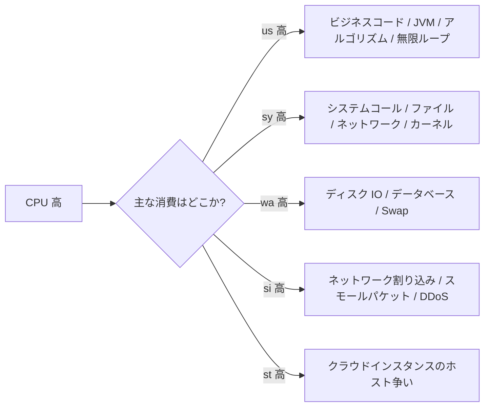

---

## 三、Arthas：Java 本番診断の利器

### 3.1 なぜ本番調査に Arthas が欠かせないのか？

従来の JVM ツールは強力だが、どちらかというと「事後分析」に偏っている。一方、Arthas の価値は：

**実行中の JVM に直接入り込み、メソッド呼び出し、引数、戻り値、例外、所要時間、クラスローディング、スレッド状態をリアルタイムに観測できること。**

一言でまとめると：

> Arthas は Java 本番問題調査の「顕微鏡 ＋ メス」である。

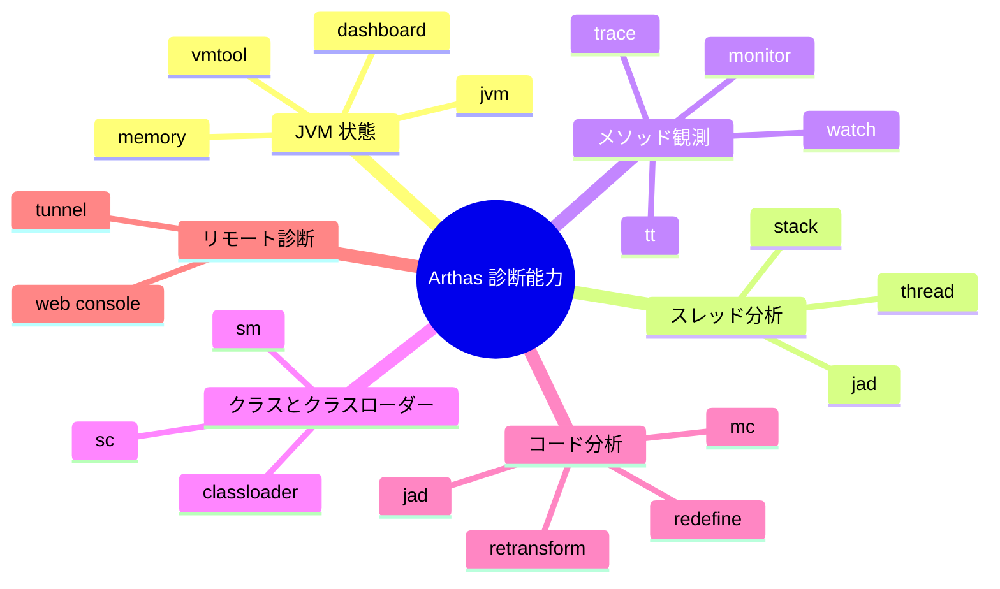

### 3.2 Arthas 主要コマンドクイックリファレンス

| コマンド            | 機能              | 典型的な用途            |
| ------------- | --------------- | --------------- |
| `dashboard`   | JVM リアルタイム状態確認     | CPU、メモリ、GC、スレッド概要  |
| `thread`      | スレッド状態確認          | CPU 急上昇、デッドロック、ブロッキングの調査 |
| `jad`         | 本番クラスの逆コンパイル          | 現在実行中のコード確認        |
| `sc`          | Search Class    | クラス情報、クラスローダーの検索      |
| `sm`          | Search Method   | メソッドシグネチャの検索          |
| `watch`       | メソッドの入力パラメータ、戻り値、例外の観察   | ビジネスデータ異常の調査        |
| `trace`       | メソッド内部呼び出しの所要時間追跡      | 遅い API の特定           |
| `stack`       | メソッド呼び出しスタック確認         | 誰がこのメソッドを呼び出したかを特定      |
| `monitor`     | メソッド呼び出し統計          | QPS、成功率、平均所要時間の統計 |
| `tt`          | Time Tunnel     | メソッド呼び出しの現場を記録、再生対応   |
| `classloader` | クラスローダー確認          | クラスローディング、コンパイル、ホットスワップ問題の解決  |
| `mc`          | Memory Compiler | オンラインで Java ファイルをコンパイル    |
| `retransform` | クラスバイトコードの再変換        | 本番ホットスワップ           |

### 3.3 Arthas 全体調査フロー

本番問題に直面したら、いきなり `watch` や `trace` を実行せず、「大枠から詳細へ」の順序で調査することを推奨する。

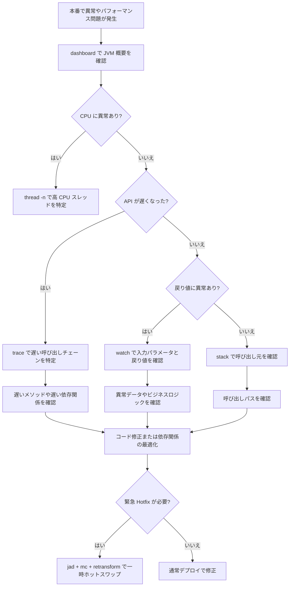

---

## 四、スレッドレベル特定：CPU 高騰シナリオの深層分析

### 4.1 最も CPU を消費しているプロセスの特定

```bash
ps -eo pid,ppid,user,stat,cmd,%cpu,%mem --sort=-%cpu | head -n 15
```

Java プロセスの CPU 使用率が高いことが判明したとします：

```text
12345 app java -jar order-service.jar 389% 42.1%
```

389% は約 4 つの CPU コアを使用していることを示します。

---

### 4.2 プロセス内で最も CPU を消費しているスレッドの特定

Java、C++、Go などのマルチスレッドプログラムでは、PID だけでは不十分で、さらにスレッドを特定する必要があります。

```bash
top -Hp <PID>
```

例：

```bash
top -Hp 12345
```

出力でスレッド ID を重点確認：

```text
PID     USER  PR NI VIRT RES SHR S %CPU COMMAND
12367   app   20  0  ... ... ... R 99.9 java
12368   app   20  0  ... ... ... R 98.7 java
```

ここで `12367`、`12368` がスレッド ID です。

Java スタックのスレッド ID は通常十六進数なので、変換が必要：

```bash
printf "%x\n" 12367
```

例えば出力：

```text
304f
```

次に `jstack` の結果内で検索：

```bash
jstack -l 12345 > jstack.txt
grep -n "304f" jstack.txt
```

---

### 4.3 Java 高 CPU の一般的な原因と調査パス

Java サービスの高 CPU で最も一般的な原因：

| タイプ | 典型的な現象 | 調査ツール | 一般的な根本原因 |
| ------ | ---------------------- | -------------------- | ------------------ |
| 無限ループ | 単一または少数のスレッドが 100% | `top -Hp` + `jstack` | while ループ、再帰、ステートマシンのバグ |
| GC ストーム | CPU 高、スループット低下、ログに GC 頻発 | `jstat` + GC ログ | メモリ不足、オブジェクト生成過多 |
| スレッドプール枯渇 | リクエスト積み上がり、キュー増大 | スレッドプール監視 + ダンプ | 下流の遅延、拒否ポリシーの不備 |
| シリアライズ/圧縮 | CPU 高だがスレッドは正常稼働 | フレームグラフ / async-profiler | JSON 過大、圧縮頻発 |
| ロック競合 | スレッドの BLOCKED / WAITING が多い | `jstack` | synchronized のロック範囲過大 |

Java スレッド特定フロー：

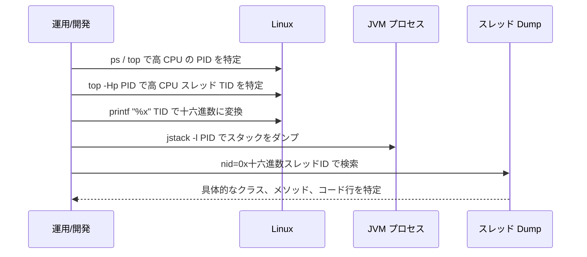

### 4.4 Arthas thread で加速する

従来の `top -Hp` + `jstack` の組み合わせに加え、Arthas はより直接的なスレッド分析機能を提供する：

```bash
# JVM 全体のスレッド概要を確認
dashboard

# CPU 消費が最も高い N 個のスレッドを一覧表示
thread -n 5

# 特定のスレッドのスタックを確認
thread <threadId>
```

`thread -n 5` は CPU 消費が最も高い 5 個のスレッドとそのスタックを直接出力でき、十六進数への変換と jstack の手動検索の手間を省く。

よく使う JVM 診断コマンド：

```bash
# JVM パラメータの確認
jcmd <PID> VM.flags

# JVM システムプロパティの確認
jcmd <PID> VM.system_properties

# スレッドスタックのダンプ
jstack -l <PID> > /tmp/jstack-$(date +%F-%H%M%S).txt

# GC 状況の確認
jstat -gcutil <PID> 1000 10

# ヒープ情報のダンプ
jmap -heap <PID>
```

CPU 高に頻繁な GC が伴う場合、GC ログの確認や一時的なオブジェクトヒストグラムの取得をさらに実施：

```bash
jmap -histo:live <PID> | head -n 30
```

> 注意：`jmap -histo:live` は Full GC を引き起こす可能性があるため、本番環境での使用には注意が必要。

---

### 4.5 フレームグラフでホットスポット関数を特定

`jstack` と Arthas `thread` ではスレッドが実行中であることしか分からず、真のホットスポットを判断できない場合、フレームグラフを使用する。

Java では async-profiler を推奨：

```bash
./profiler.sh -d 30 -e cpu -f /tmp/cpu-flame.html <PID>
```

| パラメータ | 意味 |
| -------- | --------- |
| `-d 30` | 30 秒間サンプリング |
| `-e cpu` | CPU イベントをサンプリング |
| `-f` | 出力ファイル |
| `<PID>` | 対象プロセス |

フレームグラフの読み方：

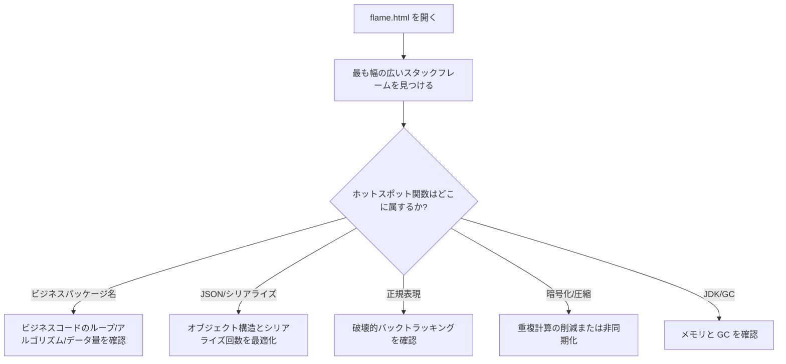

---

## 五、メソッド観測と例外キャプチャ：watch/trace/stack 実戦

スレッドレベルの特定後、通常はメソッドレベルにさらに深く入り込んで調査する。Arthas の `watch`、`trace`、`stack` はメソッドレベル観測の三つの主要コマンドである。

### 5.1 Watch：単なる「パラメータ確認」ではない

`watch` は Arthas で最もよく使われるコマンドの一つで、メソッドの入力パラメータ、戻り値、例外、現在のオブジェクト、メソッド所要時間を観察するのに適している。

#### 基本構文

```bash
watch クラス名 メソッド名 式 条件
```

例：

```bash
watch com.example.UserService getUser "{params, returnObj}" -x 2
```

* `params`：メソッドパラメータ；
* `returnObj`：メソッド戻り値；
* `-x 2`：オブジェクト展開深度を 2 に設定。

#### 入力パラメータと戻り値の観察

```bash
watch com.example.OrderService createOrder "{params, returnObj}" -x 3 -n 5
```

* `-x 3`：3 レベルまでオブジェクトを展開；
* `-n 5`：5 回だけ観察し、本番での出力過多を防ぐ。

#### 例外のみ観察

```bash
watch com.example.UserService getUser "{params, throwExp}" -e -x 2 -n 5
```

* `-e`：メソッドが例外をスローした時のみトリガー；
* `throwExp`：例外オブジェクト。

#### 所要時間によるフィルタリング

```bash
watch com.example.OrderService createOrder "{params, returnObj}" "#cost > 100" -x 2 -n 5
```

所要時間が `100ms` を超える呼び出しのみ観察する。

#### パラメータによるフィルタリング

```bash
watch com.example.UserService updateUser "{params, returnObj}" "params[0].id == 1001" -x 3 -n 5
```

`id = 1001` のリクエストのみ観察する。

#### オブジェクトフィールドへのアクセス

```bash
watch com.example.UserService getUser "target.userCache" -x 2 -n 5
```

* `target`：現在のインスタンスオブジェクト；
* `target.userCache`：インスタンスフィールドへのアクセス。

---

### 5.2 Trace：遅い API の真のボトルネックを特定する

`trace` はメソッド内部の呼び出しチェーンの所要時間を追跡するために使用する。API が遅いがログからは原因が分からない場合、`trace` が非常に役立つ。

#### 基本例

```bash
trace com.example.OrderController createOrder -n 5
```

出力は通常、次のようになる：

```text
`---ts=2026-02-25 10:00:00;thread_name=http-nio-8080-exec-1;id=25;is_daemon=true;priority=5;TCCL=...
    `---[320.112ms] com.example.OrderController:createOrder()
        +---[12.331ms] com.example.OrderService:checkParam()
        +---[250.442ms] com.example.OrderService:saveOrder()
        +---[45.221ms] com.example.PaymentClient:prePay()
```

結果から直ちに分かる：`OrderService.saveOrder()` の所要時間は 250ms、これが主要なボトルネックである。

#### 遅いリクエストのみ確認

```bash
trace com.example.OrderController createOrder '#cost > 200' -n 5
```

所要時間が `200ms` を超えるリクエストのみ追跡する。

#### JDK メソッドの追跡

デフォルトでは、Arthas は JDK メソッドをスキップする。JDK 内部の呼び出しを観察する必要がある場合：

```bash
trace com.example.OrderController createOrder '#cost > 200' --skipJDKMethod false -n 5
```

> 注意：本番環境では慎重に使用すること。JDK メソッドの呼び出しチェーンは非常に長くなる可能性がある。

---

### 5.3 Stack：誰がこのメソッドを呼び出したのか？

あるメソッドが呼び出されていることは分かっているが、誰が呼び出しているかが分からない場合がある。その時に `stack` が使える。

```bash
stack com.example.UserService getUser -n 5
```

次の調査に適している：

* あるメソッドがなぜ頻繁に呼び出されているのか；
* あるロジックがどのエントリポイントから入ってきたのか；
* 定期タスク、非同期スレッド、メッセージ消費が異常ロジックをトリガーしていないか。

---

### 5.4 Monitor：メソッド呼び出し状況の統計

`monitor` はあるメソッドの一定期間内の呼び出し統計を観察するのに適している。

```bash
monitor com.example.OrderService createOrder -c 5
```

5 秒ごとにメソッド呼び出し状況を統計する。典型的な出力には以下が含まれる：

| フィールド        | 意味   |
| --------- | ---- |
| timestamp | 統計時刻 |
| class     | クラス名   |
| method    | メソッド名  |
| total     | 呼び出し回数 |
| success   | 成功回数 |
| fail      | 失敗回数 |
| avg-rt    | 平均所要時間 |
| fail-rate | 失敗率  |

---

### 5.5 TT：現場を記録し、呼び出しを再生する

`tt` は Time Tunnel の略で、メソッド呼び出しの現場を記録できる。

```bash
# メソッド呼び出しの記録
tt -t com.example.UserService getUser -n 5

# 記録リストの確認
tt -l

# 特定の呼び出しの詳細確認
tt -i 1000

# 再度呼び出しを実行（本番環境では非常に慎重に！）
tt -i 1000 -p
```

> `tt -p` はメソッドを再実行するため、本番環境では非常に慎重に使うこと。メソッドが DB 書き込み、在庫引き当て、メッセージ送信、クーポン発行などの副作用を伴う場合、再生は推奨されない。

---

### 5.6 本番調査実戦：API 戻り値の異常

#### シナリオ

本番ユーザーからのフィードバック：ユーザー情報照会 API の戻り値でニックネームが空だが、データベースには確かにニックネームが存在する。

```text
GET /api/user/1001
```

対応メソッド：`com.example.UserService#getUser`

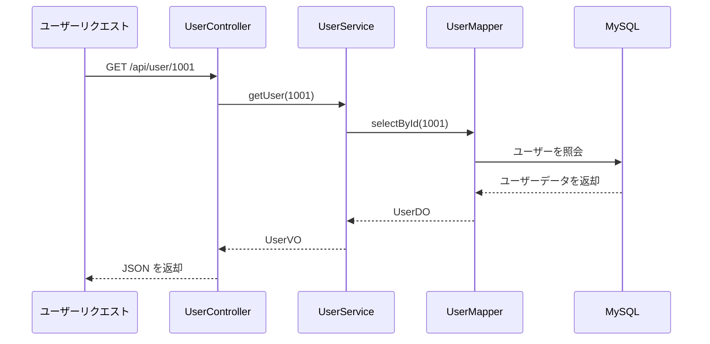

#### 調査手順

第一步、入力パラメータと戻り値の観察：

```bash
watch com.example.UserService getUser "{params, returnObj}" "params[0] == 1001" -x 3 -n 5
```

もし `returnObj.nickname = null` が確認された場合、問題は次のいずれかの可能性がある：データベースの照会結果が空、DO から VO への変換時にフィールドが欠落、ビジネスコードが意図的に空に設定、またはシリアライズ前にインターセプトや処理が行われた。

第二步、内部呼び出しの追跡：

```bash
trace com.example.UserService getUser '#cost > 0' -n 5
```

もし `UserConverter.toVO()` が短い時間で表示された場合、変換メソッドを観察する：

```bash
watch com.example.UserConverter toVO "{params, returnObj}" -x 3 -n 5
```

もし `params[0].nickname` には値があるが `returnObj.nickname` が空の場合、変換ロジックの問題とほぼ断定できる。


---

## 六、コードホットスワップ Hotfix

### 6.1 適用境界

Arthas の最も危険で、かつ最も強力な機能の一つが、オンラインでのコードホットスワップである。サービスを再起動せずに、修正後の `.class` を実行中の JVM にロードできる。

ただし、次の点を明確にしておく必要がある：

> Arthas Hotfix は一時的な応急処置に適しており、通常のデプロイフローの代わりになるものではない。

#### Hotfix に適したシナリオ

| シナリオ         | 適否 |
| ---------- | ---- |
| 単純な非 null チェックの追加   | 適合   |
| 単純な条件分岐の修正   | 適合   |
| 明らかに誤った定数の修正  | 適合   |
| 特定の例外分岐の一時的な無効化 | 慎重に適合 |
| メソッド内部の少量ロジックの修正 | 慎重に適合 |

#### Hotfix に不適切なシナリオ

| シナリオ        | 理由                |
| --------- | ----------------- |
| 新規フィールドの追加      | JVM に既にロードされたクラス構造は自由に変更できない |
| 新規メソッドの追加      | 失敗しやすい、または動作が予測不能        |
| メソッドシグネチャの変更    | 呼び出し元との不一致            |
| 継承関係の変更    | クラス構造変化のリスクが極めて高い         |
| 大規模なビジネスリファクタリング   | 制御不能               |
| トランザクション境界の変更を伴う  | データ不整合の可能性         |
| 複数サービス間のプロトコル変更を伴う | 上流下流との非互換            |

### 6.2 Hotfix フロー

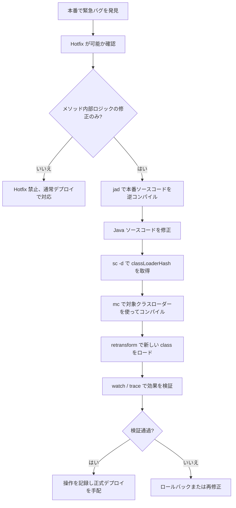

### 6.3 実戦：NullPointerException の修正

#### シナリオ

本番コードに null ポインタのリスクがある：

```java
public String getUserName(User user) {
    return user.getName().trim();
}
```

`user` または `user.getName()` が null の場合、`NullPointerException` がスローされる。目標：一時的に非 null チェックを追加する。

#### ステップ 1：本番コードの逆コンパイル

```bash
jad --source-only com.example.UserService > /tmp/UserService.java
```

本番 JVM で現在実行中のコードを基準にする必要があり、ローカルコードをそのまま使って修正してはならない。

#### ステップ 2：ソースコードの修正

`/tmp/UserService.java` を修正：

```java
public String getUserName(User user) {
    if (user == null || user.getName() == null) {
        return "";
    }
    return user.getName().trim();
}
```

#### ステップ 3：クラスローダーの検索

```bash
sc -d com.example.UserService | grep classLoaderHash
```

出力の `classLoaderHash` に注目。

#### ステップ 4：mc でコンパイル

```bash
mc -c <classLoaderHash> /tmp/UserService.java -d /tmp
```

#### ステップ 5：新しいバイトコードのロード

```bash
retransform /tmp/com/example/UserService.class
```

`retransform` が成功すると、新しいメソッドロジックが現在の JVM で有効になる。

#### ステップ 6：修正効果の検証

```bash
watch com.example.UserService getUserName "{params, returnObj, throwExp}" -x 2 -n 5
```

検証のポイント：`NullPointerException` がまだスローされていないか、戻り値が期待通りか、正常なユーザーリクエストに影響がないか。

### 6.4 Hotfix ロールバック案

#### 案 1：元の class で再度 retransform

元の `.class` を事前にバックアップしておいた場合：

```bash
retransform /tmp/backup/com/example/UserService.class
```

#### 案 2：再デプロイで上書き

最も確実な方法：

1. Hotfix の修正をコードリポジトリに同期；
2. 通常のテストフローを実施；
3. サービスを再デプロイ；
4. Arthas の一時変更を上書き。

#### 案 3：サービスの再起動

Arthas のホットスワップは現在の JVM メモリ内のクラスにのみ影響する。コードを永続的に修正していなければ、サービスの再起動後に元のバージョンに戻る。

### 6.5 retransform と redefine の比較

| 側面       | retransform | redefine |
| -------- | ----------- | -------- |
| 推奨度     | より推奨         | 使用頻度が低い     |
| 複数回修正の対応     | より対応している       | 制限を受けやすい    |
| 使用体験     | より安定         | リスクがより高い     |
| 適用シナリオ     | メソッド内部ロジックの修正    | 単純なクラスの再定義   |
| 本番での推奨     | 慎重に使用        | さらに慎重に使用    |

一般的な推奨：`retransform` を優先し、`redefine` の頻繁な使用は避ける。

---

## 七、システムレベルの高 CPU 特殊シナリオ

すべての高 CPU がビジネスプロセスに起因するわけではない。以下のシステムレベルのシナリオも非常に一般的である。

### 7.1 `kswapd0` 高 CPU：メモリ不足または Swap スラッシング

`kswapd0` が CPU を大量に占有している場合：

```bash
ps -eo pid,comm,%cpu,%mem --sort=-%cpu | head
```

システムメモリが逼迫し、カーネルが頻繁にメモリページを回収している可能性がある。

メモリの確認：

```bash
free -h
vmstat 1 10
```

`vmstat` の以下の項目を重点確認：

| フィールド | 意味 | 異常時の現象 |
| -- | -------- | -------------------- |
| si | swap in | 継続的に 0 より大きい場合、Swap からの頻繁な読み込み |
| so | swap out | 継続的に 0 より大きい場合、Swap への頻繁な書き込み |
| r | 実行キュー | 長期にわたり CPU コア数を超える場合、CPU キューの滞留 |
| wa | I/O ウェイト | 高い場合、ディスクまたはストレージが遅い |

対処の提案：

```bash
# メモリを最も消費しているプロセスの確認
ps -eo pid,user,cmd,%mem,%cpu --sort=-%mem | head -n 15
```

キャッシュが高すぎる場合、安易にクリアしないでください。非重要キャッシュと確認できた場合や一時的な止血が必要な場合のみ、慎重に実行：

```bash
sync
sudo sysctl vm.drop_caches=3
```

より長期的な対策：メモリリークの修正、JVM ヒープサイズの調整、マシンメモリの増設、サービスに `MemoryMax` / `MemoryLimit` の設定、過重タスクの分割。

---

### 7.2 softirq 高：ネットワーク割り込みまたはスモールパケットストーム

`top` で `si` が高い場合、通常、ネットワーク割り込みを疑う。

```bash
watch -n 1 "cat /proc/softirqs"
ss -antp | head
ss -ant state established | wc -l
sar -n DEV 1 5
```

考えられる原因：

| 現象 | 考えられる原因 | 対処の方向性 |
| -------------- | -------------- | ------------------------ |
| `si` 高 | スモールパケット過多 | イングレストラフィック、レート制限、ファイアウォールの確認 |
| 接続数の急増 | クローラ / 攻撃 / コネクションリーク | Nginx レート制限、コネクションプールの改善 |
| 単一コア CPU が特に高い | NIC 割り込みが単一コアに集中 | IRQ アフィニティ、RSS/RPS の調整 |
| Nginx worker 高 | リクエスト量過多またはリバースプロキシ異常 | access log、upstream レイテンシ分析 |

---

### 7.3 iowait 高：ディスクまたは下流ストレージの遅延

`wa` が高い場合、CPU が I/O を待機していることを示す。

ディスクの確認：

```bash
iostat -x 1 5
```

| フィールド | 意味 | 判断 |
| --------------- | ------ | ------------- |
| `%util` | デバイスのビジー度 | 100% に近いとディスクがビジー |
| `await` | 平均待機時間 | 高いと I/O レイテンシが大きい |
| `r/s`、`w/s` | 毎秒の読み書き回数 | 読み書き圧の判断 |

どのプロセスが大量に読み書きしているか特定：

```bash
iotop -oPa
```

一般的な原因：ログの狂ったフラッシュ、大容量ファイルのアップロードまたはダウンロード、データベースのスロークエリ、一時ファイルの過剰蓄積、コンテナログのローテーション未設定、ディスク容量不足によるシステム異常。

---

## 八、復旧判断と障害振り返りテンプレート

### 8.1 復旧判断

証拠採取完了後、どのように復旧するか判断する。

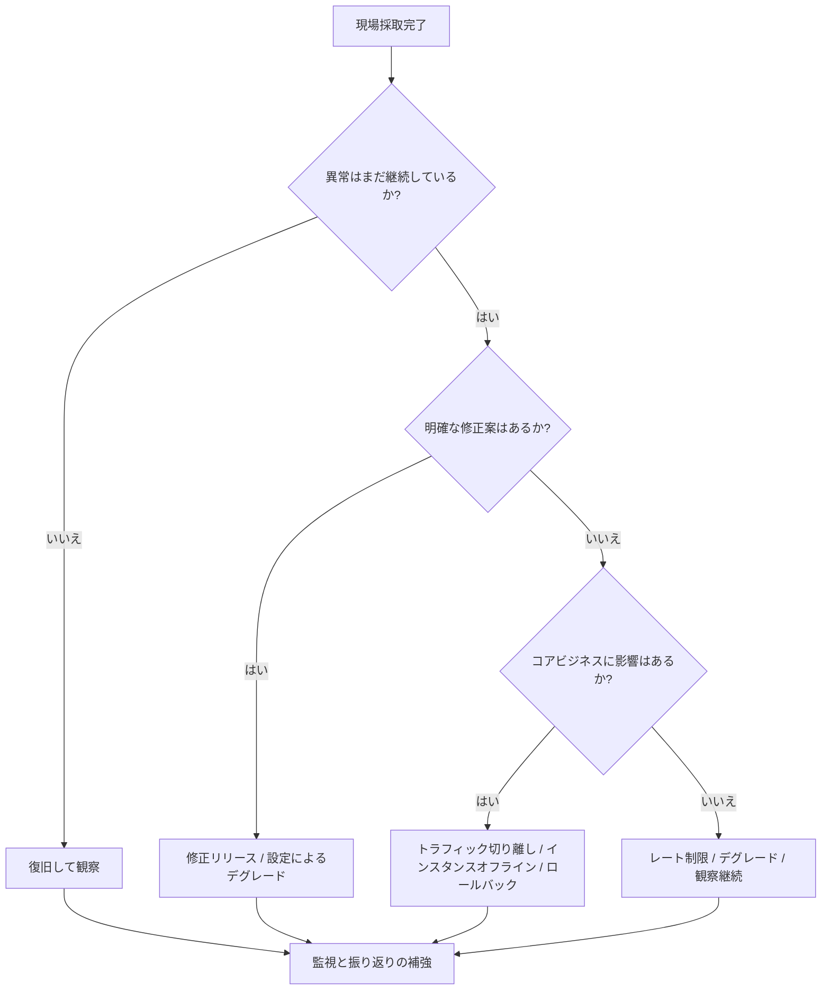

一般的な復旧アクション：

| アクション | コマンド / 方法 | 適用状況 |
| ------ | ------------------- | --------------- |
| 一時停止プロセスの再開 | `kill -CONT <PID>` | 証拠採取完了後、再発するか観察が必要 |
| グレースフル終了 | `kill -TERM <PID>` | サービスが再起動可能、正常終了を許容 |
| 強制終了 | `kill -9 <PID>` | プロセスが無応答、TERM が無効 |
| トラフィック切り離し | Nginx / ゲートウェイ / サービスレジストリから除外 | ユーザーへの影響を継続回避 |
| バージョンロールバック | デプロイプラットフォームでロールバック | 新バージョンが原因と明確な場合 |
| レート制限・デグレード | ゲートウェイ、設定センター | 下流遅延、突発トラフィック、ホットスポット API |

復旧後、少なくとも以下を観察：

```bash
top
uptime
free -h
ss -antp | wc -l
journalctl -u <service> -n 200 --no-pager
```

---

### 8.2 長期改善：単一サービスでマシン全体をダウンさせない

#### systemd で CPU とメモリを制限

```ini
[Unit]
Description=My Application
After=network.target

[Service]
User=app
WorkingDirectory=/opt/myapp
ExecStart=/usr/bin/java -jar /opt/myapp/app.jar
Restart=on-failure
RestartSec=5
CPUQuota=50%
MemoryMax=2G
LimitNOFILE=65535

[Install]
WantedBy=multi-user.target
```

#### コンテナ環境でのリソース制限

Docker の例：

```bash
docker run -d \
  --name myapp \
  --cpus="1.5" \
  --memory="2g" \
  --memory-swap="2g" \
  myapp:latest
```

Docker Compose の例：

```yaml
services:
  myapp:
    image: myapp:latest
    container_name: myapp
    deploy:
      resources:
        limits:
          cpus: "1.5"
          memory: 2G
    restart: unless-stopped
```

---

### 8.3 監視メトリクスの設計

少なくとも以下のメトリクスを監視することを推奨：

| メトリクス | 推奨しきい値 | 説明 |
| ------------ | ----------: | --------- |
| CPU 使用率 | 5 分間 > 85% | 全体的な負荷を判断 |
| Load Average | 持続的に CPU コア数を超過 | CPU キューの滞留を判断 |
| iowait | 5 分間 > 20% | ディスク/ストレージの遅延を判断 |
| softirq | 明らかな異常上昇 | ネットワーク割り込み問題を判断 |
| メモリ使用率 | > 90% | メモリ逼迫を判断 |
| Swap In/Out | 持続的に > 0 | メモリスラッシングを判断 |
| プロセス CPU | 単一プロセス > 300% | 特定サービスの異常を判断 |
| JVM GC 時間 | 持続的に上昇 | GC ストームを判断 |
| スレッド数 | ベースラインを超過 | スレッドリークを判断 |
| API P95/P99 | SLA を超過 | ビジネスへの影響を判断 |

Prometheus クエリの例：

```promql
# CPU 使用率
100 - (avg by(instance) (rate(node_cpu_seconds_total{mode="idle"}[5m])) * 100)
```

```promql
# iowait 割合
avg by(instance) (rate(node_cpu_seconds_total{mode="iowait"}[5m])) * 100
```

---

### 8.4 典型事例：Java サービス CPU 400% の調査

#### 現象

ある注文サービスの API が大量にタイムアウトし、監視では以下を表示：

| メトリクス | 数値 |
| ------------ | ---: |
| CPU 使用率 | 96% |
| Load Average | 18 |
| マシンコア数 | 4 コア |
| Java プロセス CPU | 390% |
| P99 レイテンシ | 8s |

#### 調査手順

第一歩、プロセスを特定 → `12345 app java -jar order-service.jar 390% 45%` を発見。

第二歩、一時停止して止血 → `sudo kill -STOP 12345`

第三歩、スレッドを採取 → `top -Hp 12345` → スレッド `12367` が持続的に 99%。

第四歩、十六進数に変換 → `printf "%x\n" 12367` → `304f`

第五歩、スタックをダンプして検索：

```bash
jstack -l 12345 > /tmp/jstack.txt
grep -n "304f" /tmp/jstack.txt
```

ある割引ルール計算メソッドが反復ループしていることを特定。

#### 根本原因

割引ルールの設定に循環依存が発生：ルール A → ルール B → ルール C → ルール A。コードに visited セットの判定がなく、無限ループに陥っていた。

#### 修正方針

```java
public Result calculateRule(Rule rule, Set<Long> visited) {
    if (visited.contains(rule.getId())) {
        throw new BizException("ルールに循環依存が存在: " + rule.getId());
    }
    visited.add(rule.getId());
    for (Rule dependency : rule.getDependencies()) {
        calculateRule(dependency, visited);
    }
    visited.remove(rule.getId());
    return doCalculate(rule);
}
```

---

### 8.5 障害振り返りテンプレート

```markdown
# CPU 高負荷障害振り返り

## 1. 基本情報
- 障害発生日時：
- 影響サービス：
- 影響範囲：
- 発見方法：監視 / ユーザーからの報告 / 巡視
- 対応者：

## 2. タイムライン
- 10:00 監視アラート CPU 90% 超過
- 10:03 マシンにログインしプロセスを確認
- 10:05 異常プロセスを一時停止しスタックを採取
- 10:10 異常スレッドを特定
- 10:20 暫定復旧完了
- 11:30 修正版リリース

## 3. 現場証拠
- top スナップショット：
- ps スナップショット：
- jstack ファイル：
- GC ログ：
- アプリケーションログ：
- 監視スクリーンショット：

## 4. 根本原因分析
- 直接原因：
- 深層原因：
- テスト環境で発見できなかった理由：
- 監視でより早く発見できなかった理由：

## 5. 修正措置
- コード修正：
- 設定修正：
- キャパシティ修正：
- 監視修正：

## 6. 今後のアクション
- [ ] ユニットテストの追加
- [ ] 負荷テストシナリオの追加
- [ ] CPU/スレッド/GC アラートの追加
- [ ] サービスリソース制限の追加
- [ ] ナレッジベースの蓄積完了
```

---

## 九、リモート診断 Tunnel と本番ベストプラクティス

### 9.1 Arthas Tunnel リモート診断

実際の企業環境では、多くのサーバーがイントラネットにあり、直接 SSH ログインできない。このような場合は Arthas Tunnel でリモート診断ができる。

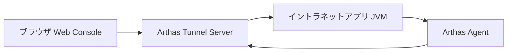

#### Tunnel Server の起動

パブリックネットワークからアクセス可能なマシンで起動：

```bash
java -jar arthas-tunnel-server.jar
```

デフォルトポートは通常 `7777`（WebSocket 通信）、`8080`（Web コンソール）。実際のポートは起動設定による。

#### クライアントから Tunnel Server への接続

```bash
java -jar arthas-boot.jar \
  --tunnel-server 'ws://public-ip:7777/ws' \
  --agent-id my-app-001
```

| パラメータ | 意味 |
| ----------------- | ---------------- |
| `--tunnel-server` | Tunnel Server のアドレス |
| `--agent-id` | 現在のアプリケーションインスタンス ID |

#### Web インターフェースで複数インスタンスを管理

適用シナリオ：複数サーバーの一括診断、コンテナ環境でのトラブルシューティング、イントラネットマシンに直接 SSH できない場合、運用チームによる Java プロセスの一元管理。

---

### 9.2 Arthas と一般的なモニタリングツールの比較

| 側面 | Arthas | SkyWalking | Prometheus + Grafana |
| ----------- | ----------- | ----------- | -------------------- |
| 中核的位置づけ | 単一 JVM の詳細診断 | 分散トレーシング | 指標モニタリングとアラート |
| 特定粒度 | メソッドレベル、オブジェクトレベル、スレッドレベル | サービスレベル、API レベル、チェーンレベル | 指標レベル、インスタンスレベル |
| 即時性 | リアルタイムインタラクティブ | 準リアルタイム | 準リアルタイム |
| 侵入性 | 低、必要に応じて強化 | 低、Agent が必要 | 中、Exporter または計装が必要 |
| 使用方法 | 一時的な調査 | 長期観測 | 長期モニタリング |
| Hotfix 対応 | 対応 | 非対応 | 非対応 |

3 種類のツールの連携方法：

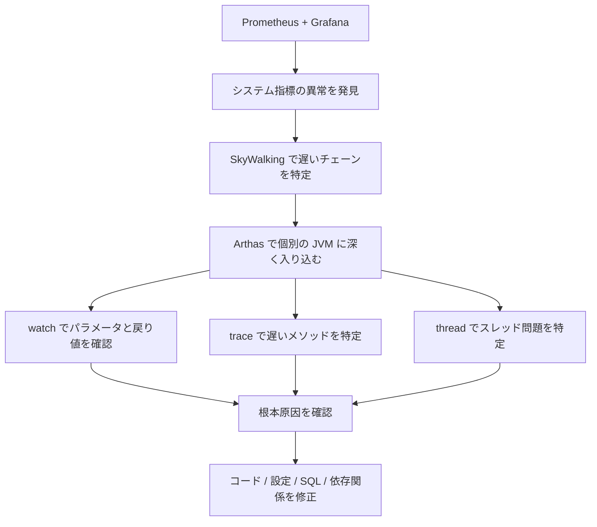

推奨組み合わせ：

```text
Prometheus + Grafana：問題の発見を担当
SkyWalking：チェーンの特定を担当
Arthas：JVM 内部に深く入り込んで根本原因を確認
```

---

### 9.3 本番環境のベストプラクティス

#### watch / trace には必ず回数制限を設定

本番環境では `-n` の指定を強く推奨：

```bash
watch com.example.OrderService createOrder "{params, returnObj}" -x 2 -n 5
```

#### オブジェクト展開深度の制御

| シナリオ | 推奨展開深度 |
| ------ | ------ |
| 単純なパラメータ | `-x 1` |
| 通常の DTO | `-x 2` |
| ネストされたオブジェクト | `-x 3` |
| 複雑なオブジェクトグラフ | 慎重に使用 |

#### OGNL 式はできるだけシンプルに

推奨：

```bash
watch com.example.Service method "{params[0].id, params[0].status}" -x 2 -n 5
```

原則：本番での観察は必要なフィールドのみ確認し、複雑な計算は行わない。

#### 診断終了後は速やかに reset

```bash
reset   # すべての強化クラスをリセット
stop    # Arthas Server をシャットダウンし、強化もリセット
```

#### ピーク時間帯の高コストコマンド実行を避ける

| コマンド | リスク |
| ------------- | ----------- |
| `trace` | 呼び出しチェーンが長い場合にオーバーヘッドが大きい |
| `watch -x 5` | オブジェクトの展開が深すぎる |
| `tt -t` | 呼び出し現場の記録によりメモリを消費 |
| `tt -p` | ビジネスロジックが重複実行される可能性 |
| `heapdump` | ディスクとメモリに圧力をかける可能性 |
| `retransform` | 本番コードを変更するためリスクが高い |

---

### 9.4 本番環境の禁止事項リスト

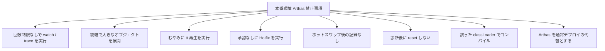

禁止事項のまとめ：

1. 本番のピーク時間帯に無計画な `trace` を実行しない。
2. 大きなオブジェクトに過度に深い `-x` を使用しない。
3. 副作用のあるメソッドに `tt -p` を実行しない。
4. バックアップなしで Hotfix を行わない。
5. ホットスワップで新規フィールド、メソッド、継承関係を追加しない。
6. `reset` または `stop` の実行を忘れない。
7. Arthas を長期的な修正案として扱わない。

---

## 十、本番調査コマンドクイックリファレンス

### 10.1 基本特定

```bash
uptime
nproc
top
ps -eo pid,ppid,user,stat,cmd,%cpu,%mem --sort=-%cpu | head -n 15
```

### 10.2 スレッド特定

```bash
top -Hp <PID>
printf "%x\n" <TID>
jstack -l <PID> > /tmp/jstack.txt
grep -n "<hex_tid>" /tmp/jstack.txt
```

### 10.3 Arthas 主要コマンド

```bash
dashboard
thread -n 5
thread <threadId>
watch com.example.Service method "{params, returnObj}" -x 2 -n 5
watch com.example.Service method "{params, throwExp}" -e -x 2 -n 5
trace com.example.Controller method '#cost > 200' -n 5
stack com.example.Service method -n 5
monitor com.example.Service method -c 5
jad com.example.Service
sc -d com.example.Service
reset
stop
```

### 10.4 メモリと Swap

```bash
free -h
vmstat 1 10
ps -eo pid,user,cmd,%mem,%cpu --sort=-%mem | head -n 15
```

### 10.5 ディスク I/O

```bash
df -h
iostat -x 1 5
iotop -oPa
pidstat -d 1 5
```

### 10.6 ネットワークと接続

```bash
ss -antp | head
ss -ant state established | wc -l
sar -n DEV 1 5
watch -n 1 "cat /proc/softirqs"
```

---

## 十一、まとめ

Java 本番パフォーマンス調査の鍵は「再起動できるか」ではなく、最短時間で以下を実現できるかである：

1. 迅速な止血でマシンを操作可能な状態に戻す；
2. 現場を保存し、根本原因の破壊を回避する；
3. `jstack`、Arthas、フレームグラフでスレッド、メソッド、システムリソースまたは外部トラフィックまで特定する；
4. `watch`/`trace`/`stack` でメソッドレベルの根本原因を確認する；
5. 必要に応じて Hotfix で一時止血し、最終的には通常デプロイで修正する；
6. レート制限、隔離、監視、負荷テスト、コード修正で再発を防止する。

最終的に身につけるべきエンジニアリング習慣：

> 障害現場は証拠であり、ゴミではない。再起動は復旧手段であり、根本原因分析ではない。

Arthas とシステムレベルの調査方法をマスターすることは、単にコマンドをいくつか覚えることではなく、「コードを書くだけ」から「問題を特定できる、インシデントに対応できる、本番の安定性を守れる」Java エンジニアへとステップアップすることである。

推奨される完全な調査クローズドループ：

```text
モニタリングで問題を発見 → 迅速な止血 → 現場保存 → OS レベルの診断 → Arthas で JVM 内部に深く入り込む → 根本原因を確認 → 一時 Hotfix → 正式デプロイで修正 → 振り返りと長期改善
```

「止血 → 証拠保存 → 特定 → 復旧 → 振り返り → 改善」というサイクルに沿って実行すれば、Java の本番パフォーマンス問題は「一時的な対処」にとどまらず、チームの安定性能力として真に蓄積されていく。
