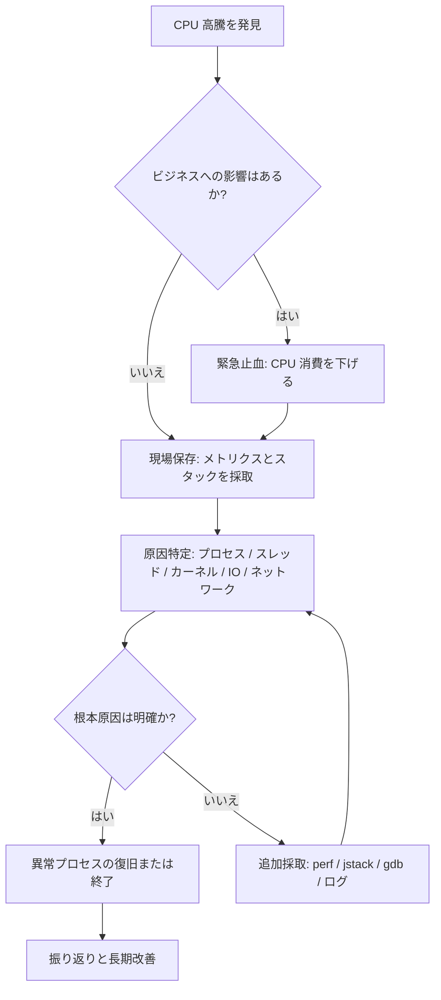
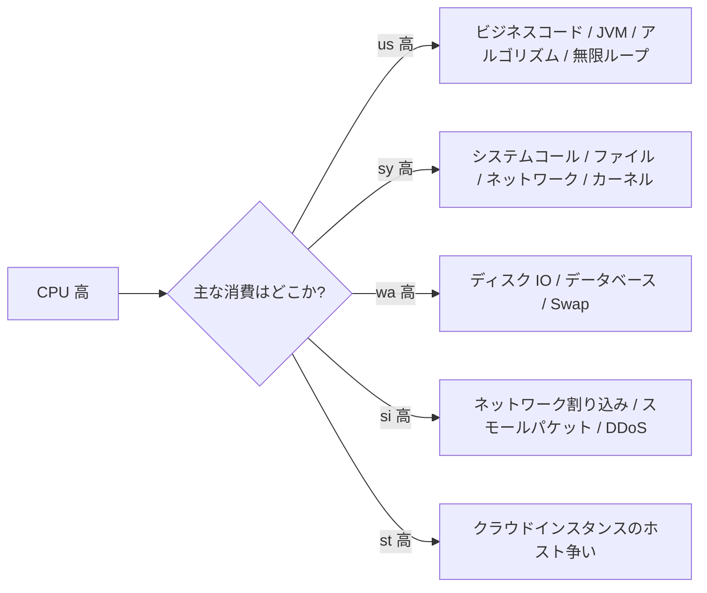
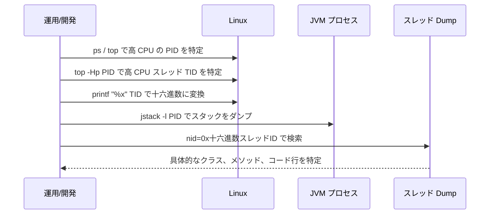
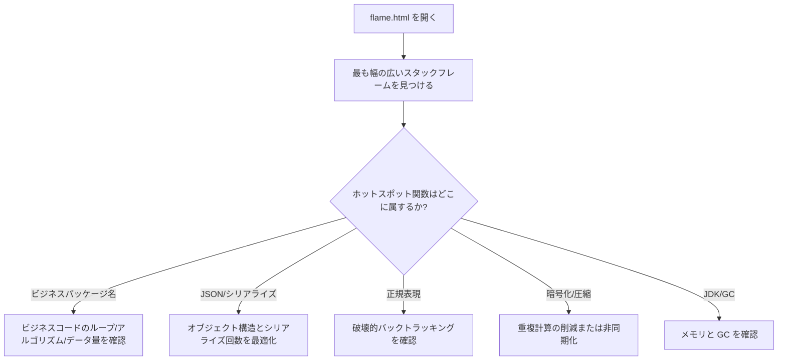
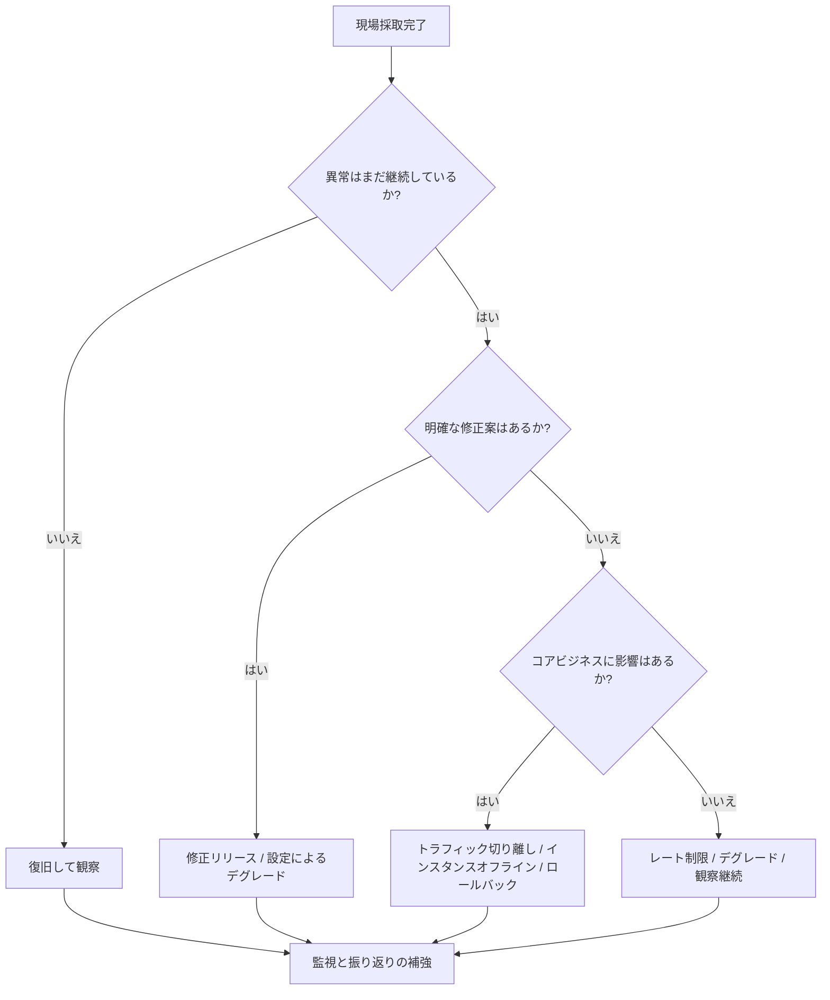

# Linux 高 CPU 緊急調査ガイド：迅速な応急処置から根本原因の振り返りまで

本番サーバーの CPU が突然 90% ないし 100% に急上昇すると、通常、API タイムアウト、SSH のもたつき、ログの大量出力、スレッドプールの積み上がり、サービス利用不可などの問題が同時に発生します。

多くの人が最初に取る対応は：

```bash
kill -9 <PID>
# または直接サービス再起動 / マシン再起動
```

しかしこれは最も危険な対応の一つです。現場を破壊してしまい、後からビジネスの無限ループなのか、GC ストームなのか、スレッドプールの枯渇なのか、システム割り込み異常なのか、メモリ不足による連鎖反応なのかを判断できなくなります。

本記事では、より安全な対応手法を提供します：

> まず止血し、次に証拠を保存する。まず特定し、次に復旧する。まず振り返り、次に予防する。

---

## 一、全体の調査方針

Linux 高 CPU の調査では、いきなり再起動するのではなく、以下の四つの段階で進めます。



基本原則：

| 段階 | 目標 | 非推奨な対応 | 推奨アクション |
| -- | ----------- | ------------ | ---------------------- |
| 止血 | マシンを操作可能な状態に戻す | 直接 `kill -9` | `kill -STOP` で異常プロセスを一時停止 |
| 証拠保存 | 障害現場を残す | 再起動後に分析 | `top`、`ps`、スレッド、スタック、ログを保存 |
| 特定 | CPU 消費の発生源を見つける | プロセスレベルの CPU だけ見る | スレッド、関数、システムリソースまで掘り下げる |
| 復旧 | 影響範囲をコントロールする | 全トラフィックを盲目的に復旧 | 段階的復旧、カナリア検証 |
| 予防 | 再発を防止する | 「修正済み」とだけ書く | リソース制限、監視、負荷テスト、コード修正を追加 |

---

## 二、第一段階：迅速な止血、現場を破壊しない

### 2.1 システムがまだ操作可能か確認する

マシンでまだコマンドを入力できる場合、まず全体の負荷を確認します：

```bash
uptime
```

重点確認項目：

```text
load average: 12.34, 10.21, 8.90
```

4 コアマシンなら load が長期にわたり 4 を超えると警戒が必要です。8 コアマシンなら load が長期にわたり 8 を超えるとキューの滞留が顕著です。

CPU コア数の確認：

```bash
nproc
```

全体の CPU、メモリ、プロセス状態の確認：

```bash
top
```

`top` がすでに重い場合、スナップショット式コマンドを使用：

```bash
ps -eo pid,ppid,user,stat,cmd,%cpu,%mem --sort=-%cpu | head -n 15
```

出力例：

```text
  PID  PPID USER  STAT CMD                         %CPU %MEM
12345     1 app   Sl   java -jar order-service.jar 389  42.1
22331     1 root  R    nginx: worker process        78   1.2
```

ここで最も重要なのは以下を見つけること：

* どのプロセスの CPU が最も高いか
* 単一プロセスの高 CPU か、複数プロセスが同時に高いか
* ビジネスプロセスが高いか、システムプロセスが高いか

---

### 2.2 STOP でプロセスを一時停止、直接 KILL しない

あるビジネスプロセスが CPU を使い果たし、マシンが操作不能になった場合、まず一時停止します：

```bash
sudo kill -STOP <PID>
```

例：

```bash
sudo kill -STOP 12345
```

`SIGSTOP` の効果はプロセスの実行を一時停止することです。メモリは解放されず、プロセスのコンテキストも破棄されないため、「止血 + 現場保存」に適しています。

一般的なシグナルの比較：

| シグナル | コマンド | 作用 | 現場を保持 | 使用シーン |
| ---- | ------------------ | ---- | ------ | ----------- |
| STOP | `kill -STOP <PID>` | プロセスの一時停止 | はい | 高 CPU の緊急止血 |
| CONT | `kill -CONT <PID>` | プロセスの再開 | はい | 証拠保存後の復旧検証 |
| TERM | `kill -TERM <PID>` | グレースフル終了 | 部分的に保持 | 正常なサービス停止 |
| KILL | `kill -9 <PID>` | 強制終了 | いいえ | プロセスが正常終了できない場合の最終手段 |

> 本番環境では、`kill -9` は最後の手段であるべきで、最初の手段であってはなりません。

---

## 三、第二段階：現場の証拠を保存する

CPU が下がった後、すぐにサービスを復旧させないでください。最も重要なのは現場を保存することです。

### 3.1 基本システム情報の保存

一つのディレクトリにまとめて保存することを推奨：

```bash
mkdir -p /tmp/cpu-debug-$(date +%F-%H%M%S)
cd /tmp/cpu-debug-*
```

システムスナップショットの採取：

```bash
date > date.txt
uptime > uptime.txt
nproc > cpu_count.txt
free -h > memory.txt
df -h > disk.txt
ps -eo pid,ppid,user,stat,cmd,%cpu,%mem --sort=-%cpu > ps_cpu.txt
top -b -n 1 > top.txt
```

`vmstat`、`pidstat`、`mpstat` がインストールされていれば、さらに採取：

```bash
vmstat 1 10 > vmstat.txt
mpstat -P ALL 1 5 > mpstat.txt
pidstat -u -p ALL 1 5 > pidstat.txt
```

---

### 3.2 CPU タイプの判定：user、system、iowait、softirq

`top` の CPU 行は通常次のようになります：

```text
%Cpu(s): 85.0 us,  8.0 sy,  0.0 ni,  5.0 id,  1.0 wa,  0.0 hi,  1.0 si,  0.0 st
```

各項目の意味：

| フィールド | 意味 | 一般的な原因 |
| -- | ------- | ------------------- |
| us | ユーザー空間 CPU | ビジネスコードの計算、無限ループ、シリアライズ、暗号化・圧縮 |
| sy | カーネル空間 CPU | システムコール頻発、ネットワークスタック、ファイルシステム操作 |
| wa | I/O ウェイト | ディスク遅延、データベース遅延、ログフラッシュ、スワップパーティション |
| hi | ハード割り込み | ハードウェア割り込み異常 |
| si | ソフト割り込み | ネットワークパケット過多、DDoS、スモールパケットストーム |
| st | 仮想化ストール時間 | クラウドインスタンスのリソース争い |
| id | アイドル | CPU のアイドル割合 |

判定方向：



---

## 四、第三段階：具体的なプロセスとスレッドの特定

### 4.1 最も CPU を消費しているプロセスの特定

```bash
ps -eo pid,ppid,user,stat,cmd,%cpu,%mem --sort=-%cpu | head -n 15
```

Java プロセスの CPU 使用率が高いことが判明したとします：

```text
12345 app java -jar order-service.jar 389% 42.1%
```

389% は約 4 つの CPU コアを使用していることを示します。

---

### 4.2 プロセス内で最も CPU を消費しているスレッドの特定

Java、C++、Go などのマルチスレッドプログラムでは、PID だけでは不十分で、さらにスレッドを特定する必要があります。

```bash
top -Hp <PID>
```

例：

```bash
top -Hp 12345
```

出力でスレッド ID を重点確認：

```text
PID     USER  PR NI VIRT RES SHR S %CPU COMMAND
12367   app   20  0  ... ... ... R 99.9 java
12368   app   20  0  ... ... ... R 98.7 java
```

ここで `12367`、`12368` がスレッド ID です。

Java スタックのスレッド ID は通常十六進数なので、変換が必要：

```bash
printf "%x\n" 12367
```

例えば出力：

```text
304f
```

次に `jstack` の結果内で検索：

```bash
jstack -l 12345 > jstack.txt
grep -n "304f" jstack.txt
```

---

### 4.3 Java 高 CPU 調査パス

Java サービスの高 CPU で最も一般的な原因：

| タイプ | 典型的な現象 | 調査ツール | 一般的な根本原因 |
| ------ | ---------------------- | -------------------- | ------------------ |
| 無限ループ | 単一または少数のスレッドが 100% | `top -Hp` + `jstack` | while ループ、再帰、ステートマシンのバグ |
| GC ストーム | CPU 高、スループット低下、ログに GC 頻発 | `jstat` + GC ログ | メモリ不足、オブジェクト生成過多 |
| スレッドプール枯渇 | リクエスト積み上がり、キュー増大 | スレッドプール監視 + ダンプ | 下流の遅延、拒否ポリシーの不備 |
| シリアライズ/圧縮 | CPU 高だがスレッドは正常稼働 | フレームグラフ / async-profiler | JSON 過大、圧縮頻発 |
| ロック競合 | スレッドの BLOCKED / WAITING が多い | `jstack` | synchronized のロック範囲過大 |

Java スレッド特定フロー：



よく使うコマンド：

```bash
# JVM パラメータの確認
jcmd <PID> VM.flags

# JVM システムプロパティの確認
jcmd <PID> VM.system_properties

# スレッドスタックのダンプ
jstack -l <PID> > /tmp/jstack-$(date +%F-%H%M%S).txt

# GC 状況の確認
jstat -gcutil <PID> 1000 10

# ヒープ情報のダンプ
jmap -heap <PID>
```

CPU 高に頻繁な GC が伴う場合、GC ログの確認や一時的なオブジェクトヒストグラムの取得をさらに実施：

```bash
jmap -histo:live <PID> | head -n 30
```

> 注意：`jmap -histo:live` は Full GC を引き起こす可能性があるため、本番環境での使用には注意が必要です。

---

## 五、第四段階：システムレベルの高 CPU 特殊シナリオ

すべての高 CPU がビジネスプロセスに起因するわけではありません。以下のシステムレベルのシナリオも非常に一般的です。

### 5.1 `kswapd0` 高 CPU：メモリ不足または Swap スラッシング

`kswapd0` が CPU を大量に占有している場合：

```bash
ps -eo pid,comm,%cpu,%mem --sort=-%cpu | head
```

システムメモリが逼迫し、カーネルが頻繁にメモリページを回収している可能性があります。

メモリの確認：

```bash
free -h
vmstat 1 10
```

`vmstat` の以下の項目を重点確認：

| フィールド | 意味 | 異常時の現象 |
| -- | -------- | -------------------- |
| si | swap in | 継続的に 0 より大きい場合、Swap からの頻繁な読み込み |
| so | swap out | 継続的に 0 より大きい場合、Swap への頻繁な書き込み |
| r | 実行キュー | 長期にわたり CPU コア数を超える場合、CPU キューの滞留 |
| wa | I/O ウェイト | 高い場合、ディスクまたはストレージが遅い |

対処の提案：

```bash
# メモリを最も消費しているプロセスの確認
ps -eo pid,user,cmd,%mem,%cpu --sort=-%mem | head -n 15
```

キャッシュが高すぎる場合、安易にクリアしないでください。非重要キャッシュと確認できた場合や一時的な止血が必要な場合のみ、慎重に実行：

```bash
sync
sudo sysctl vm.drop_caches=3
```

より長期的な対策：

* メモリリークの修正；
* JVM ヒープサイズの調整；
* マシンメモリの増設；
* サービスに `MemoryMax` / `MemoryLimit` を設定；
* 過重タスクの分割。

---

### 5.2 softirq 高：ネットワーク割り込みまたはスモールパケットストーム

`top` で `si` が高い場合、通常、ネットワーク割り込みを疑います。

ソフト割り込みの確認：

```bash
watch -n 1 "cat /proc/softirqs"
```

ハード割り込みの確認：

```bash
watch -n 1 "cat /proc/interrupts"
```

ネットワーク接続の確認：

```bash
ss -antp | head
ss -ant state established | wc -l
```

NIC トラフィックの確認：

```bash
sar -n DEV 1 5
```

考えられる原因：

| 現象 | 考えられる原因 | 対処の方向性 |
| -------------- | -------------- | ------------------------ |
| `si` 高 | スモールパケット過多 | イングレストラフィック、レート制限、ファイアウォールの確認 |
| 接続数の急増 | クローラ / 攻撃 / コネクションリーク | Nginx レート制限、コネクションプールの改善 |
| 単一コア CPU が特に高い | NIC 割り込みが単一コアに集中 | IRQ アフィニティ、RSS/RPS の調整 |
| Nginx worker 高 | リクエスト量過多またはリバースプロキシ異常 | access log、upstream レイテンシ分析 |

---

### 5.3 iowait 高：ディスクまたは下流ストレージの遅延

`wa` が高い場合、CPU が I/O を待機していることを示します。

ディスクの確認：

```bash
iostat -x 1 5
```

重点確認項目：

| フィールド | 意味 | 判断 |
| --------------- | ------ | ------------- |
| `%util` | デバイスのビジー度 | 100% に近いとディスクがビジー |
| `await` | 平均待機時間 | 高いと I/O レイテンシが大きい |
| `r/s`、`w/s` | 毎秒の読み書き回数 | 読み書き圧の判断 |
| `rkB/s`、`wkB/s` | 毎秒の読み書き量 | スループット圧の判断 |

どのプロセスが大量に読み書きしているか特定：

```bash
iotop -oPa
```

または：

```bash
pidstat -d 1 5
```

一般的な原因：

* ログの狂ったフラッシュ；
* 大容量ファイルのアップロードまたはダウンロード；
* データベースのスロークエリ；
* 一時ファイルの過剰蓄積；
* コンテナログのローテーション未設定；
* ディスク容量不足によるシステム異常。

---

## 六、第五段階：フレームグラフでホットスポット関数を特定

`jstack` ではスレッドが実行中であることしか分からず、真のホットスポットを判断できない場合、フレームグラフを使用します。

### 6.1 Java では async-profiler を推奨

例：

```bash
./profiler.sh -d 30 -e cpu -f /tmp/cpu-flame.html <PID>
```

パラメータの意味：

| パラメータ | 意味 |
| -------- | --------- |
| `-d 30` | 30 秒間サンプリング |
| `-e cpu` | CPU イベントをサンプリング |
| `-f` | 出力ファイル |
| `<PID>` | 対象プロセス |

フレームグラフの読み方：



---

## 七、復旧判断：継続、再起動、それともオフライン？

証拠採取完了後、どのように復旧するか判断します。



一般的な復旧アクション：

| アクション | コマンド / 方法 | 適用状況 |
| ------ | ------------------- | --------------- |
| 一時停止プロセスの再開 | `kill -CONT <PID>` | 証拠採取完了後、再発するか観察が必要 |
| グレースフル終了 | `kill -TERM <PID>` | サービスが再起動可能、正常終了を許容 |
| 強制終了 | `kill -9 <PID>` | プロセスが無応答、TERM が無効 |
| トラフィック切り離し | Nginx / ゲートウェイ / サービスレジストリから除外 | ユーザーへの影響を継続回避 |
| バージョンロールバック | デプロイプラットフォームでロールバック | 新バージョンが原因と明確な場合 |
| レート制限・デグレード | ゲートウェイ、設定センター | 下流遅延、突発トラフィック、ホットスポット API |

復旧後、少なくとも以下を観察：

```bash
top
uptime
free -h
ss -antp | wc -l
journalctl -u <service> -n 200 --no-pager
```

---

## 八、長期改善：単一サービスでマシン全体をダウンさせない

### 8.1 systemd で CPU とメモリを制限

本番環境では、非コアサービスが無制限に CPU を使い果たすことを許容すべきではありません。

サービスファイルの編集：

```bash
sudo vim /etc/systemd/system/myapp.service
```

例：

```ini
[Unit]
Description=My Application
After=network.target

[Service]
User=app
WorkingDirectory=/opt/myapp
ExecStart=/usr/bin/java -jar /opt/myapp/app.jar
Restart=on-failure
RestartSec=5

# 単コアの最大 50% まで使用。200% なら約 2 コアまでに相当
CPUQuota=50%

# 最大メモリを制限
MemoryMax=2G

# オープンファイル数を制限
LimitNOFILE=65535

[Install]
WantedBy=multi-user.target
```

再読み込み：

```bash
sudo systemctl daemon-reload
sudo systemctl restart myapp
```

制限が有効か確認：

```bash
systemctl show myapp | grep -E "CPUQuota|MemoryMax|LimitNOFILE"
```

---

### 8.2 コンテナ環境でのリソース制限

Docker の例：

```bash
docker run -d \
  --name myapp \
  --cpus="1.5" \
  --memory="2g" \
  --memory-swap="2g" \
  myapp:latest
```

Docker Compose の例：

```yaml
services:
  myapp:
    image: myapp:latest
    container_name: myapp
    deploy:
      resources:
        limits:
          cpus: "1.5"
          memory: 2G
    restart: unless-stopped
```

---

### 8.3 監視メトリクスの設計

少なくとも以下のメトリクスを監視することを推奨：

| メトリクス | 推奨しきい値 | 説明 |
| ------------ | ----------: | --------- |
| CPU 使用率 | 5 分間 > 85% | 全体的な負荷を判断 |
| Load Average | 持続的に CPU コア数を超過 | CPU キューの滞留を判断 |
| iowait | 5 分間 > 20% | ディスク/ストレージの遅延を判断 |
| softirq | 明らかな異常上昇 | ネットワーク割り込み問題を判断 |
| メモリ使用率 | > 90% | メモリ逼迫を判断 |
| Swap In/Out | 持続的に > 0 | メモリスラッシングを判断 |
| プロセス CPU | 単一プロセス > 300% | 特定サービスの異常を判断 |
| JVM GC 時間 | 持続的に上昇 | GC ストームを判断 |
| スレッド数 | ベースラインを超過 | スレッドリークを判断 |
| API P95/P99 | SLA を超過 | ビジネスへの影響を判断 |

Prometheus クエリの例：

```promql
# CPU 使用率
100 - (avg by(instance) (rate(node_cpu_seconds_total{mode="idle"}[5m])) * 100)
```

```promql
# iowait 割合
avg by(instance) (rate(node_cpu_seconds_total{mode="iowait"}[5m])) * 100
```

```promql
# 1 分間ロードアベレージ
node_load1
```

```promql
# 利用可能メモリ割合
node_memory_MemAvailable_bytes / node_memory_MemTotal_bytes * 100
```

---

## 九、本番調査コマンドクイックリファレンス

### 9.1 基本特定

```bash
uptime
nproc
top
ps -eo pid,ppid,user,stat,cmd,%cpu,%mem --sort=-%cpu | head -n 15
```

### 9.2 スレッド特定

```bash
top -Hp <PID>
printf "%x\n" <TID>
jstack -l <PID> > /tmp/jstack.txt
grep -n "<hex_tid>" /tmp/jstack.txt
```

### 9.3 メモリと Swap

```bash
free -h
vmstat 1 10
ps -eo pid,user,cmd,%mem,%cpu --sort=-%mem | head -n 15
```

### 9.4 ディスク I/O

```bash
df -h
iostat -x 1 5
iotop -oPa
pidstat -d 1 5
```

### 9.5 ネットワークと接続

```bash
ss -antp | head
ss -ant state established | wc -l
sar -n DEV 1 5
watch -n 1 "cat /proc/softirqs"
watch -n 1 "cat /proc/interrupts"
```

### 9.6 systemd サービス

```bash
systemctl status <service>
journalctl -u <service> -n 200 --no-pager
systemctl show <service> | grep -E "CPUQuota|MemoryMax|LimitNOFILE"
```

---

## 十、典型事例：Java サービス CPU 400% の調査

### 10.1 現象

ある注文サービスの API が大量にタイムアウトし、監視では以下を表示：

| メトリクス | 数値 |
| ------------ | ---: |
| CPU 使用率 | 96% |
| Load Average | 18 |
| マシンコア数 | 4 コア |
| Java プロセス CPU | 390% |
| P99 レイテンシ | 8s |

### 10.2 調査手順

第一歩、プロセスを特定：

```bash
ps -eo pid,ppid,user,cmd,%cpu,%mem --sort=-%cpu | head
```

発見：

```text
12345 app java -jar order-service.jar 390% 45%
```

第二歩、一時停止して止血：

```bash
sudo kill -STOP 12345
```

第三歩、スレッドを採取：

```bash
top -Hp 12345
```

スレッド `12367` が持続的に 99% であることを発見。

第四歩、十六進数に変換：

```bash
printf "%x\n" 12367
# 304f
```

第五歩、スタックをダンプして検索：

```bash
jstack -l 12345 > /tmp/jstack.txt
grep -n "304f" /tmp/jstack.txt
```

ある割引ルール計算メソッドが反復ループしていることを特定。

### 10.3 根本原因

割引ルールの設定に循環依存が発生：

```text
ルール A はルール B に依存
ルール B はルール C に依存
ルール C は再びルール A に依存
```

コードに visited セットの判定がなく、無限ループに陥っていた。

### 10.4 修正方針

* ルール依存グラフの循環検出を追加；
* ルール計算に最大再帰深度を追加；
* API にタイムアウトとデグレードを追加；
* 異常設定にリリース前バリデーションを追加；
* 循環依存シナリオをカバーするユニットテストを追加。

疑似コード例：

```java
public Result calculateRule(Rule rule, Set<Long> visited) {
    if (visited.contains(rule.getId())) {
        throw new BizException("ルールに循環依存が存在: " + rule.getId());
    }
    visited.add(rule.getId());

    for (Rule dependency : rule.getDependencies()) {
        calculateRule(dependency, visited);
    }

    visited.remove(rule.getId());
    return doCalculate(rule);
}
```

---

## 十一、障害振り返りテンプレート

高 CPU 障害の処理完了後、以下のテンプレートで振り返りを記録することを推奨します。

```markdown
# CPU 高負荷障害振り返り

## 1. 基本情報
- 障害発生日時：
- 影響サービス：
- 影響範囲：
- 発見方法：監視 / ユーザーからの報告 / 巡視
- 対応者：

## 2. タイムライン
- 10:00 監視アラート CPU 90% 超過
- 10:03 マシンにログインしプロセスを確認
- 10:05 異常プロセスを一時停止しスタックを採取
- 10:10 異常スレッドを特定
- 10:20 暫定復旧完了
- 11:30 修正版リリース

## 3. 現場証拠
- top スナップショット：
- ps スナップショット：
- jstack ファイル：
- GC ログ：
- アプリケーションログ：
- 監視スクリーンショット：

## 4. 根本原因分析
- 直接原因：
- 深層原因：
- テスト環境で発見できなかった理由：
- 監視でより早く発見できなかった理由：

## 5. 修正措置
- コード修正：
- 設定修正：
- キャパシティ修正：
- 監視修正：

## 6. 今後のアクション
- [ ] ユニットテストの追加
- [ ] 負荷テストシナリオの追加
- [ ] CPU/スレッド/GC アラートの追加
- [ ] サービスリソース制限の追加
- [ ] ナレッジベースの蓄積完了
```

---

## 十二、まとめ

Linux 高 CPU 問題の鍵は「再起動できるか」ではなく、最短時間で以下を実現できるかです：

1. 迅速な止血でマシンを操作可能な状態に戻す；
2. 現場を保存し、根本原因の破壊を回避する；
3. スレッド、関数、システムリソースまたは外部トラフィックまで特定する；
4. 盲目的な再起動ではなく、正しい復旧判断を下す；
5. レート制限、隔離、監視、負荷テスト、コード修正で再発を防止する。

最終的に身につけるべきエンジニアリング習慣：

> 障害現場は証拠であり、ゴミではない。再起動は復旧手段であり、根本原因分析ではない。

「止血 → 証拠保存 → 特定 → 復旧 → 振り返り → 改善」というサイクルに沿って実行すれば、高 CPU 問題は「一時的な対処」にとどまらず、チームの安定性能力として真に蓄積されていきます。