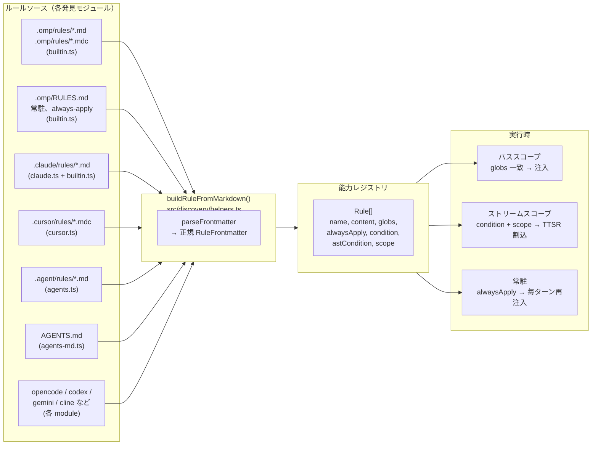
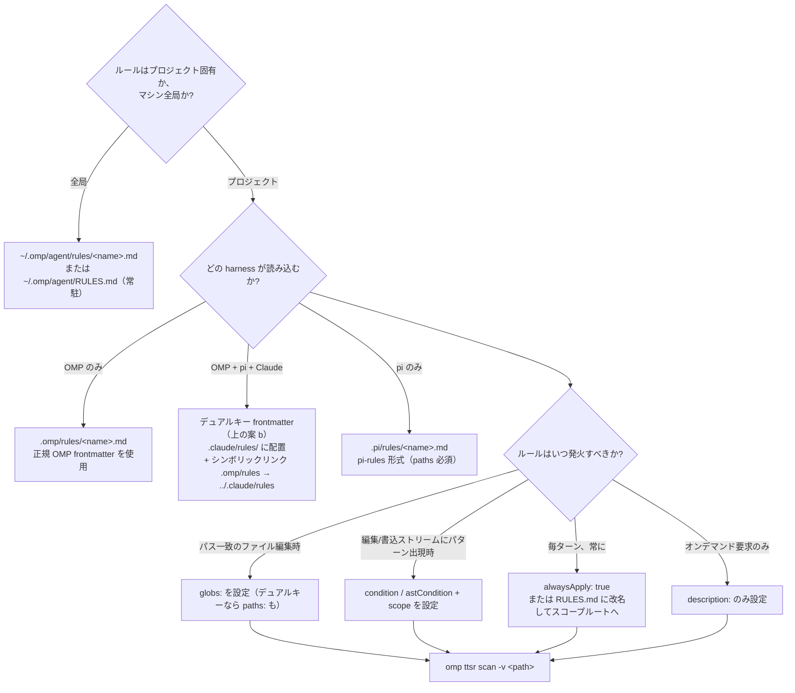

# OMP Agent ルールシステム解剖：多ソース発見・三つの注入・paths/globs のサイレント失敗

AI Agent フレームワークで実際のエンジニアリングを行うとき、「ルール」（rules）はチームの約束をコード層に落とし込むための鍵となる仕組みである。ある種類のファイルを編集するとき何を MUST し、どんな場面で何を MUST NOT するか、そしてどの制約を毎ターン繰り返し提醒すべきかを Agent に伝える。だがルールの難しさは「一条のルールを書くこと」にはない。「そのルールが本当に読み込まれるか、正しい瞬間に注入されるか」にある。

本記事は OMP Agent（`@oh-my-pi/pi-coding-agent`）のルール設定の全景——多ソース発見チェーン、統一された正規化パイプライン、三つの注入モード——を体系的に解剖し、さらにソースコードで検証済みのサイレント失敗の罠を掘り下げる。pi-rules や Claude Code からルールを移行するとき、`paths:` と `globs:` のキーが互いに通じない問題である。

> 読み順：まず全体アーキテクチャと三つの注入モードを把握し、次に発見チェーンと正規 frontmatter を読み、最後に paths/globs の罠と検証チェックリストを日常のリファレンスとして手元に置く。

---

## 一、背景：ルールとは設定である

Agent オーケストレーションフレームワークには「コンテキスト依存の制約層」が必要だ。同じ Agent でも Java バックエンドを編集するときはあるルール群に従い、フロントエンドを書くときは別のルール群に従う。ルールはその層の担い手である。

うまく設計されたルールシステムは、三つの問いに答える：

- **どこから来るか**：複数の harness（omp、Claude Code、Cursor、pi など）がそれぞれ独自のルールディレクトリを持つ——どう統一するか；
- **どう正規化するか**：由来ごとに frontmatter の形が異なる——どう一つの構造に畳み込むか；
- **いつ注入するか**：ルールをパス一致で注入するのか、編集ストリームのパターンで注入するのか、毎ターン注入するのか。

OMP のやり方：各ソースに発見モジュール（discovery module）があり、発見されたすべてのルールは単一の `buildRuleFromMarkdown()` に集まり、一つの正規形に強制され、frontmatter に従って三つの注入モードのいずれかに振り分けられる。

---

## 二、全体アーキテクチャ：多ソース発見から統一注入へ

OMP は多数のソースからルールを一つの能力レジストリ（capability registry）にマージする。各ソースには専用の発見モジュールがあるが、すべてのルールは `buildRuleFromMarkdown()` を経て単一の正規形に揃えられる。



### 三つのルール注入モード

読み込まれた各ルールは、frontmatter に基づいて次の三つの実行時モードのいずれかに正確に振り分けられる：

| モード | トリガ | 実際の挙動 |
| --- | --- | --- |
| **パススコープ** | `globs: [...]` が編集/読込中のファイルに一致 | 候補パスが一致したときのみルール本体をコンテキストに注入 |
| **ストリームスコープ（TTSR）** | `condition:` / `astCondition:` + `scope:`（例：`tool:edit(*.ts)`） | パターンが編集/書込/読込内容に一致したとき、**ストリーム割込**として発火 |
| **常駐（sticky / always-apply）** | `alwaysApply: true`、または最上位の `RULES.md` ファイル | 毎ターン、現在のターンの近傍で再注入——長い会話でも消えない |

これら三つのキーを**どれも持たない**ルールは、**オンデマンド要求（agent-requested）**ルールに退化する：`description:` でインデックスされオンデマンド検索されるが、自動注入はされない。

---

## 三、発見チェーン：どのパスが走査されるか

この部分は `src/discovery/index.ts`（モジュールレジストリ）と各モジュールの `loadRules` 等価物を読んで検証した。**どの発見モジュールが見つけたルールファイルも、最終的に `buildRuleFromMarkdown()` に到達する**。

### ネイティブ OMP パス（builtin.ts の `loadRules`）

| パス（cwd から上方へ走査） | スコープ | 挙動 |
| --- | --- | --- |
| `.omp/rules/*.md` と `*.mdc` | プロジェクト | 標準ルールファイル——frontmatter が注入モードを決める |
| `~/.omp/agent/rules/*.md` と `*.mdc` | ユーザ | 同上——このマシンの全プロジェクトに適用 |
| `.omp/RULES.md`（最寄り、repo root まで上方走査） | プロジェクト | **常駐 always-apply**——frontmatter に関わらず強制 |
| `~/.omp/agent/RULES.md` | ユーザ | **常駐 always-apply**——グローバル基準 |

上方走査は `os.homedir()` で止まる——`~/.omp/` はユーザレベルのルートであり、プロジェクトルートではない。最初に見つかった `.omp/` ディレクトリが勝つ。無ければ git ルートにフォールバックする。

### クロス harness パス（各モジュールが自己登録）

| モジュール | 走査パス | フォーマットの注意 |
| --- | --- | --- |
| `agents-md.ts` | `AGENTS.md`（最寄り、上方走査）+ ネストされたサブツリーの `AGENTS.md` | ドメインガイダンスであり、パススコープのルールではない |
| `claude.ts` | `~/.claude/` + `<cwd>/.claude/` | `rules/`、`commands/`、`tools/`、`skills/` 等を走査。ルールは同じ `buildRuleFromMarkdown` を通る |
| `cursor.ts` | `.cursor/rules/*.mdc` + 旧 `.cursorrules` | MDC frontmatter：`description`、`globs`、`alwaysApply` |
| `agents.ts` | `.agent/rules/`、`.agents/rules/`（上方走査 + ユーザホーム） | 汎用 agent エコシステムのディレクトリ慣習 |
| `codex.ts`、`gemini.ts`、`opencode.ts`、`cline.ts` 等 | 各 harness 固有のディレクトリ | 各自が自己登録し、最終的に同じ正規ルール形になる |

### 走査**されない**もの

| パス | 理由 |
| --- | --- |
| `.pi/rules/` | pi 専用慣習。OMP には `pi.ts` 発見モジュールがない——**だからシンボリックリンク橋接が存在する** |
| `mcp.json` の `rules:` キー | ノーオペレーション。`mcp-schema.json` が最上位で `additionalProperties: false` を宣言——未知キーは静かに捨てられる |
| `config.yml` の `rules:` ブロック | そもそもそんな設定キーは存在しない。OMP には `memory.*`、`advisor.*`、`modelRoles.*`、`retry.*` はあるが、`rules.*` だけはない |

---

## 四、正規 frontmatter：RuleFrontmatter

`src/capability/rule.ts`（`RuleFrontmatter`）と `src/discovery/helpers.ts`（`buildRuleFromMarkdown`）に照らして検証済み。

```yaml
---
# 正規 OMP frontmatter（任意の部分集合、すべて省略可）
description: オンデマンド検索用の一文。globs/condition がない場合は必須。
globs:
  - "backend-spring/src/**/*.java"
  - "docker/sandbox/harness/java/src/**/*.java"
alwaysApply: false        # true → 常駐、毎ターン再注入
condition:                # TTSR 割込を発火させる正則
  - "^import\s+java\.util\.Date$"
astCondition:             # ast-grep パターン、編集/書込ストリームのみ
  - "new $T($$$ARGS)"
scope:                    # TTSR ストリームスコープのトークン
  - "tool:edit(*.java)"
  - "tool:write(*.java)"
interruptMode: prose-only # never | prose-only | tool-only | always
---

# ルール本体 —— Markdown

- 具体かつ実行可能な制約。MUST / SHOULD / NEVER で表現する。
- 読み順：親はいつ入るか（WHEN）を記述し、子はどうするか（HOW）を記述する。
```

### frontmatter キーの権威リスト

| キー | OMP は読むか | 備考 |
| --- | --- | --- |
| `description` | ✅ | スコープが一致しないときオンデマンド検索に使われる |
| `globs` | ✅ | **OMP が唯一認めるパススコープキー** |
| `alwaysApply` | ✅ | `true` → 常駐 always-apply |
| `condition` / `ttsr_trigger` / `ttsrTrigger` | ✅ | 三つのエイリアスすべて受理 |
| `astCondition` | ✅ | ast-grep パターン、編集/書込ストリームのみ |
| `scope` | ✅ | ストリームトークン、例：`text`、`thinking`、`tool:edit(*.ts)` |
| `interruptMode` | ✅ | `ttsr.interruptMode` のルール単位上書き |
| **`paths`** | ❌ **読まない** | 後述の罠——pi-rules / Claude Code 形式 |
| **`kind`** | ❌ 無視 | pi-rules のマーカ（`kind: rules`）、OMP はこれで区別しない |
| **`summary`** | ❌ 無視 | pi-rules の要約、`[key: string]: unknown` に落ちる |
| **`triggers`** | ❌ 無視 | pi-rules のトリガ、同上 |

---

## 五、paths と globs の相互運用の罠（ソース検証済み）

**これは pi-rules や Claude Code から OMP へルールセットを移植するときの、最も一般的なサイレント失敗モードである。**

### 仕組み

`buildRuleFromMarkdown()` は `frontmatter.globs` だけを読む：

```ts
let globs: string[] | undefined;
if (Array.isArray(frontmatter.globs)) {
  globs = frontmatter.globs.filter((item): item is string => typeof item === "string");
} else if (typeof frontmatter.globs === "string") {
  globs = [frontmatter.globs];
}
```

どの発見モジュール（`builtin.ts`、`claude.ts`、`cursor.ts`、`agents.ts`……）も、frontmatter を後処理して `paths:` を `globs:` に翻訳することはない。`grep -rEn "paths.*globs|frontmatter\.paths" src/discovery/` で検証——ゼロヒット。

### 症状

次のように書かれたルール：

```yaml
---
paths:
  - "backend-spring/src/**/*.java"
---
```

は OMP に読み込まれるが、`globs` は `undefined` になる。するとルールは**オンデマンド要求**（description ベースの検索）に退化し——パス一致で**決して自動注入されない**。しかも**警告もログ行もエラーも一切ない**。`*.java` ファイルを編集してもルールは発火しない。

### 二つの修正（リポジトリごとに一つ選ぶ）

**(a) OMP 正規形式でルールを書く**——`paths:` の代わりに `globs:` を使う。pi（`paths:` を要求）以外ではどこでも動く。

```yaml
---
globs:
  - "backend-spring/src/**/*.java"
description: Java 17 バックエンドのソースルール。
---
```

**(b) frontmatter をデュアルキーにする**——両キーを残し、各 harness が自分の認める方を読む。わずかな重複だが、相互運用リスクはゼロ：

```yaml
---
kind: rules                 # pi-rules のマーカ（OMP は無視、pi は要求）
paths:                      # pi-rules / Claude Code のパススコープ
  - "backend-spring/src/**/*.java"
globs:                      # OMP 正規のパススコープ
  - "backend-spring/src/**/*.java"
summary: Java backend rules. # pi-rules の要約（OMP は無視）
description: Java backend rules. # OMP の検索キー（pi は無視）
---
```

> **共有ツリー（`.claude/rules/`、`.pi/rules/`）には (b) を推奨**。4 キーの重複は機械的で、どのような harness 交代にも耐える。

### 検証

```bash
# OMP が実際に読み込んだルール（ルール名 + ソース）
cd <repo> && omp ttsr list

# 候補ファイルに対して特定ルールをドライラン（プロジェクト読込をバイパス）
omp ttsr test --rule .omp/rules/no-any.md --source tool --path src/foo.ts 'const x: any = 1'

# アクティブなルールセットでディレクトリをスキャン
omp ttsr scan -r .omp/rules/no-any.md src/

# 発火したものだけでなく、評価された全ルールを表示
omp ttsr scan -v src/
```

`omp ttsr list` に現れるはずのルールがない場合、それは**TTSR メタデータを持たない**——純粋なパススコープルールでは期待通り。`ttsr scan` の verbose フラグでパススコープルールが付いているか確認する。

---

## 六、エンドツーエンドの導入フロー

新しい**ルール**を追加する際の決定木。各ステップに具体的なコマンドかファイル編集がある。



### pi-rules → OMP 橋接（リポジトリごとに一回）

あるリポジトリの正規ルールツリーが `.pi/rules/`（pi 慣習）で、OMP に同じファイルを読ませたいなら、ファイルごとのリンクではなく**ディレクトリ**シンボリックリンクを使う：

```bash
# リポジトリルートで
mkdir -p .omp
ln -s ../.pi/rules .omp/rules
```

ファイルごとのリンクは、新しいルールファイルを追加した瞬間に壊れる。ディレクトリシンボリックリンクは漸進的である。**注意**：橋接はファイルを OMP のスキャナに「見える」ようにするだけで、`paths:` を `globs:` に翻訳はしない。橋接と上記デュアルキー修正を組み合わせないと、ルールはサイレントに退化する。

---

## 七、ルール執筆の三原則

これらは harness に依存せず、どんなルール体系にも当てはまる。

1. **深さより広度。** 親ファイルは子に*いつ*入るかを記述する——そこで*どうするか*ではない。読み手が誤ったサブツリーに入っても、子を読み終えてからではなく、親の要約で気づけるようにする。
2. **重複なし。** ある事実が子ファイルにあるなら、親は繰り返さない。親にあるなら、子は再言しない。重複はドリフトし、ドリフトは信頼を壊す。
3. **説明は意思決定である。** すべての frontmatter の `description` / `summary` は答えねばならない：*Agent はいつここに入るべきか？* 「ここに何があるか」ではなく、*いつ関連するか*。「Java ルール」は弱い。「`backend-spring/` 配下の `.java` 編集時に进入する Java 17 バックエンドのソースルール」は強い。

### 具体的な表記ルール

- `MUST` / `SHOULD` / `NEVER`（RFC 2119）を使う——OMP のシステムプロンプトはこれらを尊重する。
- 一つの bullet に一つの制約。複数節の bullet は流し読みされる。
- 正規のパス/パターンを名前で示す（`backend-spring/src/**`）——「該当ディレクトリ」などと書かない。
- 否定制約（`NEVER`、`MUST NOT`）には**理由**を添える——`NEVER 平文の refresh token を保存する（HttpOnly cookie のみ、DB 側はハッシュのみ）`。

---

## 八、既知の罠と教訓

| 罠 | 症状 | 緩和策 |
| --- | --- | --- |
| **`paths:` と `globs:` の不一致** | ルールは読み込まれるがパス一致で発火しない、エラーlog なし | `globs:`（OMP）またはデュアルキー frontmatter（共有ツリー）を使う |
| **`mcp.json` の `rules:` キー** | 静かに捨てられ、ルールが現れない | `mcp-schema.json` が未知の最上位キーを禁止。`~/.omp/agent/rules/` か `.omp/rules/` のファイルを使う |
| **`.pi/rules/` が OMP に読まれない** | pi 専用慣習、OMP に `pi.ts` 発見モジュールがない | シンボリックリンク橋接：`.omp/rules → ../.pi/rules` |
| **最上位 `RULES.md` が深層で無視される** | 常駐ルールがネストされたサブツリーで効かない | `RULES.md` は cwd から repoRoot へ上方走査——サブディレクトリではなくリポジトリルートに置く |
| **`alwaysApply: true` がコンテキストを埋め尽くす** | 全ルールが毎ターン再注入され、コンテキストが膨張 | `alwaysApply` は真にグローバルな制約だけに残す。95% のケースはパススコープ（`globs:`）か TTSR（`condition:` + `scope:`）を優先 |
| **シンボリックリンクの `.omp/rules/` が古くなる** | ソースツリーに新規ファイルを追加しても現れない | ディレクトリシンボリックリンク（ファイルごとではなく）が新規ファイルを自動取り込み。追加後に `omp ttsr list` で検証 |
| **`AGENTS.md` と `rules/*.md` の重複** | 同じ制約が両方に書かれ、ドリフトは必然 | `AGENTS.md` は*境界とフロー*（アーキテクチャ層）、`rules/*.md` は*パススコープ制約*。一方を他方へそのまま持ち込まない |
| **一ファイルに複数 harness の frontmatter が混在** | 読み手がどの harness がどのキーを認めるか分からない | 各キーにコメントタグ：`# omp 正規`、`# pi-rules`、`# Claude Code`——または harness ごとにファイル分割 |

---

## 九、検証チェックリスト（再実行可能）

ルールファイル、シンボリックリンク、frontmatter の変更後、毎回確認：

- [ ] `cd <repo> && omp ttsr list` が期待どおりのルール数を表示（TTSR ルールのみ）
- [ ] `omp ttsr scan -v <候補パス>` がパススコープルールの付着を表示
- [ ] `omp ttsr test --rule <ルールファイル> --source tool --path <パス> <断片>` が正の断片で発火、負の断片で静默
- [ ] 共有ツリー：grep でデュアルキー frontmatter を確認——`paths:` が存在するとき `grep -L "globs:" <repo>/.omp/rules/*.md` が空を返す
- [ ] シンボリックリンク橋接：`readlink .omp/rules` が解決可能、`find -L .omp/rules -type f | wc -l` がソースと一致
- [ ] 最上位 `RULES.md`（あれば）が Markdown として解析可能、スコープごとに一条の常駐ルール
- [ ] `mcp.json` に `rules:` キーがない（静かに捨てられる、頼らない）

---

## 十、結び

ルールシステムの価値は、「書いた制約が正しい瞬間に本当に効くか」にかかっている。そして制約を*サイレントに*失效させる道のほうが、効かせる道よりはるかに多い：

- **統一**は単一の正規化ポイントに支えられる——すべてのソースが `buildRuleFromMarkdown` に集う；
- **ルーティング**は三つの注入モードがそれぞれ一役担う；
- **信頼**は `paths:`/`globs:` のようなサイレントな罠をチェックリストに結晶化することに支えられ、「前回たまたま動いた」に頼らない。

「統一正規化・モードの明確な分離・罠のチェックリスト化」の三本の線を守るだけで、ルールはファイルに書いたものの発火するか分からないブラックボックスではなく、検証可能で監査可能なエンジニアリング能力になる。

> 本記事は「フロー」と「教訓」に焦点を当てる。具体的なステップバイステップの操作（ディレクトリシンボリックリンク橋接、各 harness のモジュール自己登録、TS schema の読解）は、別途実行可能な SOP として整備し、本ハンドブックと補完し合うべきである。
