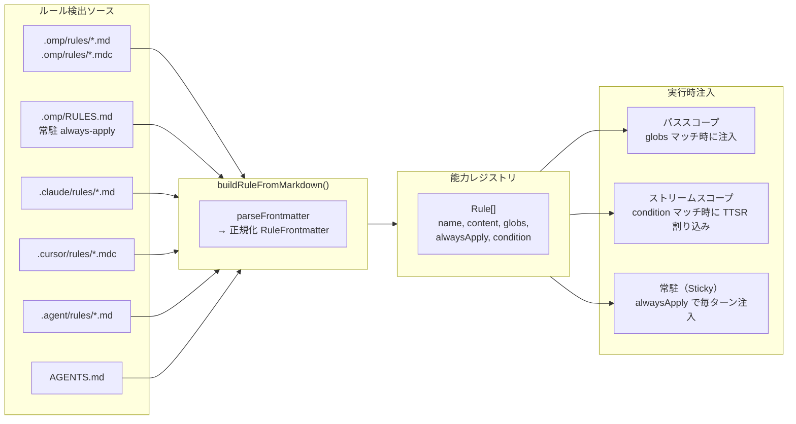

# OMP Agent ルールシステムの解説：マルチソース検出、3つの注入モード、paths/globs サイレント失敗の陥穽

AI Agent 開発において「ルール（Rules）」はチームの規約をコード層の制約へ落とし込むための核心的なメカニズムです。Agent が特定のファイルを編集する際に遵守すべき事柄や、特定のシナリオで禁止される動作を定義します。しかし、ルール設計の最大の難しさは「ルールを書くこと」ではなく、**「そのルールが意図したタイミングで正しく読み込まれ、注入されるか」** にあります。

本記事では、OMP Agent (`@oh-my-pi/pi-coding-agent`) のルール設定の全貌—マルチソース検出チェーン、正規化パイプライン、3つの注入モード、そして pi-rules や Claude Code からルールを移行した際に生じる `paths:` と `globs:` の互換性によるサイレント失敗の罠とその修正方法を解説します。

---

## 一、背景：設定としてのルール

Agent 構成フレームワークには「コンテキストに応じた制約層」が必要です。同一の Agent であっても、Java バックエンドを修正する際とフロントエンドを開発する際では異なる規約を適用しなければなりません。

ルールシステムが解決すべき 3 つの課題：
- **由来の統一**：複数のハーネス（omp, Claude Code, Cursor, pi など）に散在するルールディレクトリの統一。
- **フォーマットの正規化**：異なる Frontmatter 構造の統一。
- **注入タイミングの制御**：パス一致、編集ストリーム、常駐の各モードへの適切なルーティング。

---

## 二、全体アーキテクチャ：マルチソース検出から統一注入へ

OMP は各検出モジュールを通じてルールを単一の能力レジストリへ集約します：


```mermaid
flowchart LR
  subgraph Sources["ルール検出ソース"]
    B[".omp/rules/*.md<br/>.omp/rules/*.mdc"]
    R[".omp/RULES.md<br/>常駐 always-apply"]
    C[".claude/rules/*.md"]
    CU[".cursor/rules/*.mdc"]
    A[".agent/rules/*.md"]
    AG["AGENTS.md"]
  end
  subgraph Build["buildRuleFromMarkdown()"]
    P["parseFrontmatter<br/>→ 正規化 RuleFrontmatter"]
  end
  subgraph Reg["能力レジストリ"]
    R1["Rule[]<br/>name, content, globs,<br/>alwaysApply, condition"]
  end
  subgraph Inject["実行時注入"]
    CTX["パススコープ<br/>globs マッチ時に注入"]
    TTSR["ストリームスコープ<br/>condition マッチ時に TTSR 割り込み"]
    STICKY["常駐（Sticky）<br/>alwaysApply で毎ターン注入"]
  end
  B --> Build
  R --> Build
  C --> Build
  CU --> Build
  A --> Build
  AG --> Build
  Build --> Reg
  Reg --> CTX
  Reg --> TTSR
  Reg --> STICKY
```

### 3 つのルール注入モード

| モード | トリガー条件 | 実際の動作 |
| --- | --- | --- |
| **パススコープ（Path-Scoped）** | `globs: [...]` が対象ファイルに一致 | 編集・読み込み対象パスが一致した場合のみコンテキストへ注入。 |
| **ストリームスコープ（TTSR）** | `condition:` / `astCondition:` + `scope:` | ツール実行・書き込み・読み込みのパターン一致時に割り込みを発生。 |
| **常駐（Sticky / Always-Apply）** | `alwaysApply: true` または `RULES.md` | 会話の毎ターン付近で継続的に再注入。 |

これらのキーがいずれも存在しないルールは、**オンデマンド取得（Agent-Requested）** モードへ退化し、自動注入されなくなります。

---

## 三、検出チェーンとスキャンパス

OMP はプロジェクト階層およびユーザーホームディレクトリから複数の規約に従ってルールをスキャンします：

- `.omp/rules/*.md` および `*.mdc`：プロジェクト固有ルール
- `~/.omp/agent/rules/*.md`：ユーザー全体のグローバルルール
- `.omp/RULES.md`：リポジトリ常駐ルール
- `~/.omp/agent/RULES.md`：グローバル常駐ルール

---

## 四、Frontmatter 仕様と正規化

OMP は Frontmatter を以下のインターフェースへ正規化します：

```typescript
interface RuleFrontmatter {
  description?: string;
  globs?: string | string[];
  alwaysApply?: boolean;
  condition?: string;
  astCondition?: string;
  scope?: "read" | "write" | "edit";
}
```

---

## 五、サイレント失敗の罠：`paths` vs. `globs`

**Claude Code** や **pi-rules** から OMP へルールを移植する際、以下の仕様相違による問題が発生します：

- **Claude Code / pi-rules 仕様**：`paths: ["src/**/*.ts"]` を使用
- **OMP / Cursor 仕様**：`globs: ["src/**/*.ts"]` を要求

### 根因と動作
`buildRuleFromMarkdown()` は Frontmatter 解析時に `globs` キーのみを読み込みます。`paths:` のみが記述されている場合：
1. `parseFrontmatter` は `paths` を無視。
2. `globs` は `undefined` と評価。
3. `alwaysApply` も `undefined` と評価。
4. ルールは静かに **Agent-Requested** モードへ退化し、ファイル編集時に自動注入されなくなります！

### 二重キー記述による修正 SOP
ツールチェーン間の互換性を確保するため、Frontmatter に **両方のキー** を明記します：

```yaml
---
description: "TypeScript 型安全性の制約"
globs:
  - "src/**/*.ts"
paths:
  - "src/**/*.ts"
---

ルール本分...
```

---

## 六、検証チェックリスト

1. **登録ルールの確認**：OMP のルール点検機能を使用し、レジストリへの登録状態を確認。
2. **パス一致検証**：対象ファイルの編集時にコンテキストログへルールが正常に挿入されているか点検。
3. **二重キーの適用**：既存の `.claude/rules` 既存ファイルに対し `paths` と `globs` の両方が記載されているか監査。
