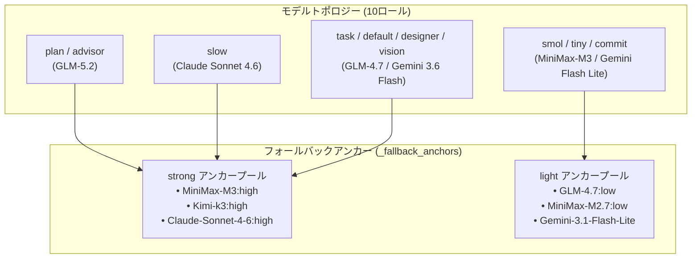
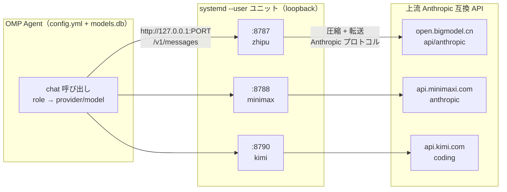
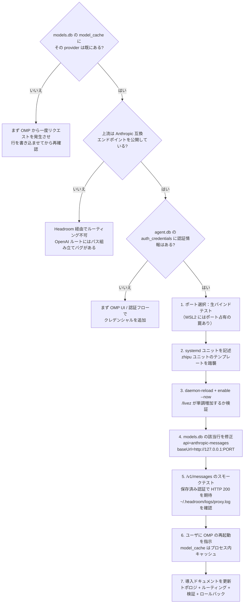
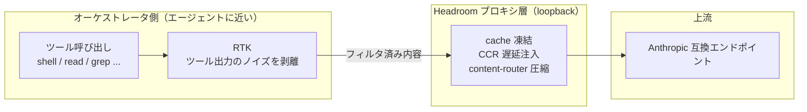
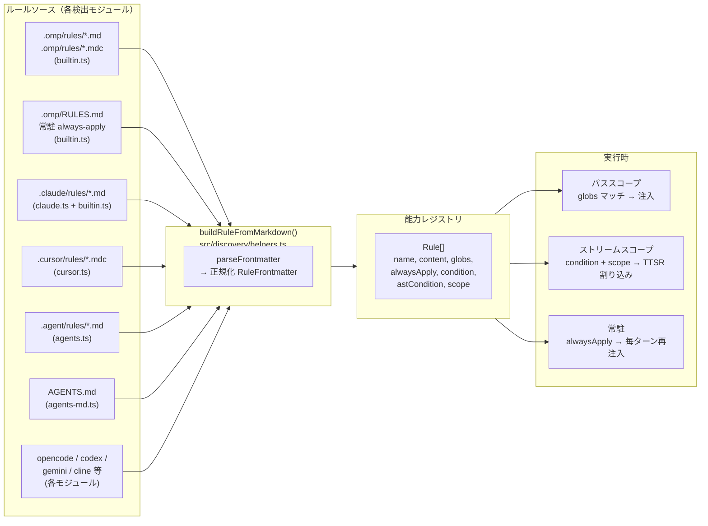
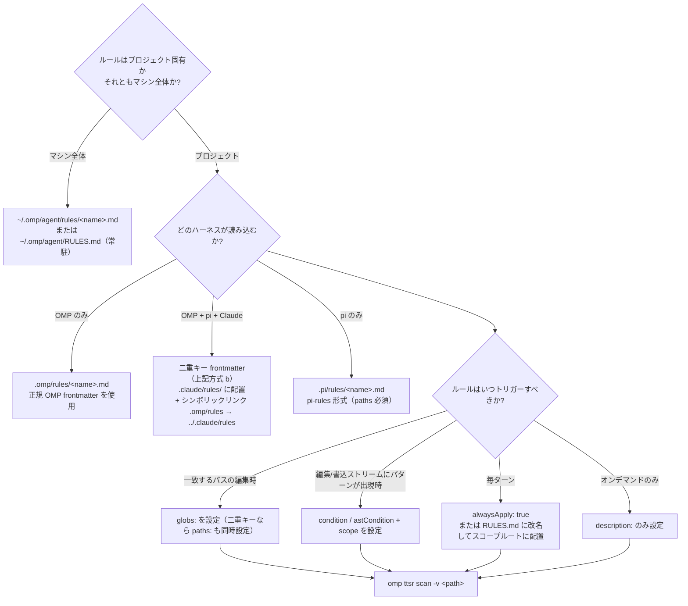

# OMP 設定・ルール体系マスターガイド：グローバル設定、Headroom プロキシ、Agent ルールシステム

OMP（Oh My Pi）は高度にカスタマイズ可能な AI Agent オーケストレーションフレームワークである。本番環境で安定稼働させるには、三つの次元を同時に掌握する必要がある：**グローバル設定**はモデルルーティングとフォールバック戦略を決定し、**プロキシ層**はトラフィック治理とコスト最適化を決定し、**ルールシステム**は Agent がどのような場面でどのような制約を守るかを決定する。

本記事は三本の OMP 特集記事を統合したもので、グローバル設定からプロキシ層、ルールシステムまで、OMP 設定体系の完全なナラティブを構築する。

---

## 一、OMP 設定体系の概要と設計哲学

OMP の設定体系は三つの中核関心事を中心に展開する：

1. **モデルルーティングとフォールバック**：`~/.omp/agent/config.yml` により、10のモデルロール、フォールバックアンカープール、全ロールフォールバックチェーンを定義し、能力とコストの精緻なバランスを実現する。
2. **トラフィックガバナンス**：Headroom 圧縮プロキシ層により、カスタムモデルプロバイダを OMP に統一的に統合し、通過するすべてのトラフィックに透過的な圧縮、キャッシュ、プロトコル正規化を適用する。
3. **制約注入**：ルールシステムのマルチソース検出、統一正規化、三つの注入モードにより、チームの規約をコードレベルの制約として落とし込む。

三者の関係：グローバル設定は「どのモデルを使うか」を決め、Headroom は「トラフィックをどう流すか」を決め、ルールシステムは「Agent をどう行動させるか」を決める。この三層を理解すれば、OMP のインストールから運用までの完全なライフサイクルを掌握できる。

---

## 二、グローバル設定の解析：モデルロール、フォールバックチェーン、実行制御

### 2.1 現在のグローバル設定スナップショット

以下は `~/.omp/agent/config.yml` で現在有効な完全な設定スナップショットである：

```yaml
setupVersion: 1
modelRoles: 
  plan: zhipu-coding-plan/glm-5.2:max
  advisor: zhipu-coding-plan/glm-5.2
  slow: google-antigravity/claude-sonnet-4-6:high
  task: zhipu-coding-plan/glm-4.7:high
  designer: google-antigravity/gemini-3.6-flash-high
  smol: minimax-code-cn/MiniMax-M3:low
  tiny: zhipu-coding-plan/glm-4.7:low
  commit: google-antigravity/gemini-3.1-flash-lite
  vision: google-antigravity/gemini-3.6-flash-high
  default: google-antigravity/gemini-3.6-flash:medium

_fallback_anchors: 
  strong: 
    - minimax-code-cn/MiniMax-M3:high
    - kimi-code/k3:high
    - google-antigravity/claude-sonnet-4-6:high
  light: 
    - zhipu-coding-plan/glm-4.7:low
    - minimax-code-cn/MiniMax-M2.7:low
    - google-antigravity/gemini-3.1-flash-lite

retry: 
  enabled: true
  maxRetries: 5
  baseDelayMs: 2000
  fallbackRevertPolicy: cooldown-expiry
  fallbackChains: 
    slow: 
      - kimi-code/k3:high
      - minimax-code-cn/MiniMax-M3:high
      - google-antigravity/claude-sonnet-4-6:high
    plan: 
      - minimax-code-cn/MiniMax-M3:high
      - kimi-code/k3:high
      - google-antigravity/claude-sonnet-4-6:high
    advisor: 
      - minimax-code-cn/MiniMax-M3:high
      - kimi-code/k3:high
      - google-antigravity/claude-sonnet-4-6:high
    default: 
      - kimi-code/kimi-for-coding:high
      - zhipu-coding-plan/glm-4.7:high
      - google-antigravity/gemini-3.6-flash-high
    task: 
      - zhipu-coding-plan/glm-4.7:high
      - kimi-code/kimi-for-coding:high
      - google-antigravity/gemini-3.6-flash-high
    designer: 
      - google-antigravity/gemini-3.6-flash-high
      - kimi-code/k3:high
      - minimax-code-cn/MiniMax-M3:high
    vision: 
      - kimi-code/k3:high
      - minimax-code-cn/MiniMax-M3:high
      - google-antigravity/gemini-3.6-flash-high
    smol: 
      - zhipu-coding-plan/glm-4.7:low
      - google-antigravity/gemini-3.1-flash-lite
    tiny: 
      - kimi-code/kimi-for-coding:low
      - google-antigravity/gemini-3.1-flash-lite
    commit: 
      - zhipu-coding-plan/glm-4.7:low
      - kimi-code/kimi-for-coding:low
  usageAwareFallback: true
  usageReservePolicy: auto
  usageReservePct: 10

advisor: 
  enabled: true
  subagents: true
symbolPreset: ascii
theme: 
  dark: dark-volcanic
  light: light
disabledExtensions: []
memory: 
  backend: hindsight
hindsight: 
  apiUrl: http://localhost:42888
autolearn: 
  enabled: true
  autoContinue: true
defaultThinkingLevel: auto
dev: 
  autoqaConsent: granted
prewalk: 
  enabled: true
display: 
  showTokenUsage: true
compaction: 
  idleEnabled: true
  idleThresholdTokens: 200000
task: 
  prewalk: true
  eager: preferred
goal: 
  continuationModes: 
    - interactive
branchSummary: 
  enabled: true
snapcompact: 
  systemPrompt: none
  toolResults: true
ttsr: 
  interruptMode: prose-only
checkpoint: 
  enabled: false
computer: 
  enabled: false
statusLine: 
  showHookStatus: false
```

### 2.2 モデルトポロジーとフォールバックアンカー

OMP は `modelRoles` を通じてワークロードを各専門モデルへ割り当て、`_fallback_anchors` により強モデルと軽量モデルのバックアッププールを構成する。



#### 10大モデルロールの役割

- **構成設計・アドバイス (`plan` / `advisor`)**：`zhipu-coding-plan/glm-5.2` により、全局的なアーキテクチャ設計と助言を担当。
- **深層推理 (`slow`)**：`google-antigravity/claude-sonnet-4-6:high` により、難解なバグ診断と重要なアーキテクチャリファクタリングを担当。
- **標準 Worker 群 (`task` / `default` / `designer` / `vision`)**：`GLM-4.7:high` と `Gemini 3.6 Flash` により、高スループットのコード作成、UI設計、マルチモーダル処理を提供。
- **高速低コストキュー (`smol` / `tiny` / `commit`)**：`MiniMax-M3:low` と `Gemini 3.1 Flash Lite` により、ミリ秒級の Git コミット生成と高速ファイルスキャンを実現。

#### アンカー分離メカニズム (`_fallback_anchors`)

`_fallback_anchors` は利用可能なモデルプールを `strong` と `light` の二つの階層に抽象化する：
- **`strong` 強アンカープール**：`MiniMax-M3:high`、`Kimi-k3:high`、`Claude-Sonnet-4-6:high` を含む。推理重視のロールを強力にバックアップ。
- **`light` 軽アンカープール**：`GLM-4.7:low`、`MiniMax-M2.7:low`、`Gemini-3.1-Flash-Lite` を含む。軽量タスクの低コストバックアップ。

### 2.3 全9ロールフォールバックチェーン (`fallbackChains`) と利用制限感知

API レート制限（RPM/TPM）や一時障害が発生した際、**全9つの核心ロール** に対する自動フォールバックが機能する：

1. **重厚推理・計画グループ (`slow`, `plan`, `advisor`)**：迂回ルート `Kimi-k3:high` → `MiniMax-M3:high` → `Claude-Sonnet-4-6:high`。
2. **標準 Worker・UI画像グループ (`default`, `task`, `designer`, `vision`)**：`Kimi-for-coding` / `GLM-4.7:high` / `Gemini 3.6 Flash High` を優先フォールバック。
3. **高速スキャングループ (`smol`, `tiny`, `commit`)**：軽量モデルから `GLM-4.7:low` / `Gemini 3.1 Flash Lite` / `Kimi-for-coding:low` へ退守。

#### クールダウン復帰と予約保護ポリシー

- **`fallbackRevertPolicy: cooldown-expiry`**：クールダウン終了後、自動的にプライマリモデルへ復帰。
- **`usageAwareFallback: true` & `usageReservePct: 10`**：利用上限を事前に感知し、10% のバッファ枠を維持して切り替えを実行。

### 2.4 詳細な実行制御フラグ

#### 思考と探査フラグ

- **`defaultThinkingLevel: auto`**：タスク難易度に応じて CoT（思考チェーン）の深さを自動調整。
- **`task.prewalk: true` & `prewalk.enabled: true`**：コード変更前に依存関係ファイルや影響範囲を強制探査。
- **`task.eager: preferred`**：サブタスク検知時に並列実行を優先。

#### 対話と割り込みモード

- **`goal.continuationModes: [interactive]`**：対話継続モードを有効化し、無応答による切断を防止。
- **`ttsr.interruptMode: prose-only`**：Turn-To-Speak 割り込みを自然言語のみに制限。
- **`branchSummary.enabled: true`**：Git ブランチの変更概要の自動生成を有効化。
- **`snapcompact.toolResults: true`**：200k トークンアイドル圧縮時にツール過去出力をスナップショット削除。

#### 開発者・実験的オプション

- **`dev.autoqaConsent: granted`**：開発環境における自動 QA テストの実行を許可。
- **`checkpoint.enabled: false` & `computer.enabled: false`**：実験的な Checkpoint スナップショットと Computer Use デスクトップ操作を明示的に無効化し、安定性を確保。

### 2.5 長期記憶とハードガードレール

1. **Hindsight 長期記憶 (`backend: hindsight`)**：ローカルの Hindsight デーモン（`http://localhost:42888`）に接続し、セッションを超えてプロジェクトの決定事項、教訓、ユーザー設定を永続化。
2. **Autolearn 自動スキル定着 (`autolearn.enabled: true`)**：再利用可能な教訓/スキルを自動抽出し、`~/.omp/agent/managed-skills/` に定着。
3. **Pre-tool-call ハードガードレール (GitHub Write Gate)**：`~/.omp/agent/hooks/pre/github-write-gate.ts` により、`git push`、`gh pr` などの書き込み操作をコマンド実行前に物理遮断。ユーザーの明示的な確認または `OMPGATE_OFF=1` が必要。

---

## 三、Headroom 圧縮プロキシ：カスタムプロバイダの導入

グローバル設定は「どのモデルを使うか」を決め、Headroom は「トラフィックをどう流すか」を解決する。

### 3.1 なぜ圧縮プロキシ層が必要なのか？

OMP はロールに基づいてリクエストを異なる provider/model にルーティングする。理想的には、すべてのプロバイダがプロンプトキャッシュ、コンテキスト圧縮、ツール結果キャッシュを備えているべきだ。しかし現実には、すべての上流がこれらをネイティブにサポートしているわけではない。Headroom はこの隙間を埋める：ローカルリバースプロキシとして、通過するすべてのトラフィックに対して透過的な圧縮、キャッシュ、プロトコル正規化を行う。

**プロキシカバレッジ原則：ガバナンスが必要なプロバイダだけをプロキシ経由にし、それ以外は直接接続する。** 本構成では三つの中国圏プロバイダだけが Headroom を経由し、それ以外（Vertex Claude、ローカル Ollama、LM Studio、llama.cpp など）はすべて直接接続。

#### 価値の全体像：主戦力は RTK

実行時計測による「節約トークン数」の分解：
- **RTK CLI フィルタリング**：節約の **約 86.7%** を貢献（ツール出力ノイズの剥離）；
- **プレフィックスキャッシュ安定化**：`--mode cache` で **約 100% のヒット率** を維持；
- **能動的圧縮**：節約の **1% 未満**（非 Read 本文の圧縮のみ）。

Headroom の役割は「キャッシュ安定化＋プロトコル正規化」に近く、真の節約を担っているのは RTK である。

### 3.2 全体アーキテクチャ：四層アーティファクトと責務の境界

OMP は三つの中国圏プロバイダをプロバイダごとの Headroom 圧縮プロキシ経由でルーティングする。それ以外のプロバイダはすべて直接接続。



このアーキテクチャを理解する鍵は、**四つのアーティファクトがそれぞれ何を担い、何を担わないか**を明確にすることだ：

| 層 | アーティファクト（ファイル/オブジェクト） | 担うもの | 担わないもの |
| --- | --- | --- | --- |
| **1. ロール→モデル束縛** | `config.yml`（`modelRoles`、`task.agentModelOverrides`、`retry.fallbackChains`） | 各 OMP ロールが使う provider/model；モデル障害時のフォールバックグラフ | ネットワークルーティング |
| **2. モデル→ルート束縛** | `models.db` テーブル `model_cache`（`provider_id`、`models[].api`、`models[].baseUrl`） | 各 provider のモデルのプロトコル（`anthropic-messages`）+ base URL | 認証、ロール割り当て |
| **3. プロキシプロセス** | systemd ユニット `headroom-proxy-*.service`（プロバイダごとに一つ） | 待受ポート、上流 URL、provider 名、再起動ポリシー | モデルの有無 |
| **4. 上流 API** | プロバイダの Anthropic 互換エンドポイント | 実際のモデル推論 | Headroom の存在を知っているか |

さらに二つの直交する関心事：
- **クレデンシャルストア**（`agent.db` テーブル `auth_credentials`）：Headroom は OMP が送る認証ヘッダを転送するだけで、自ら認証を注入することはない。
- **CLI プロファイル**（`~/.config/claude-profile/*.json`）：独立した `claude` CLI 専用であり、OMP 自身は読み込まない。

### 3.3 エンドツーエンドの導入フロー

新しいプロバイダの導入は、四層のアーティファクトを順に所定の位置に置くことである：



#### ポート選択：Python 生バインドテスト

WSL2 のミラードネットワークでは、「システムはポート空きと見なしているのに、実際にバインドすると `EADDRINUSE` が出る」現象が起きる。Python で検証する：

```python
import socket
s = socket.socket(socket.AF_INET, socket.SOCK_STREAM)
s.bind(("127.0.0.1", PORT))
s.close()
```

#### `models.db` の冪等パッチ

`models.db` の `model_cache` 行を修正する際、`authoritative` を `1` に設定する。`0` のままだと、OMP は同梱の静的レジストリからプロバイダを再取得し、`baseUrl` をこっそり元に戻し、トラフィックがプロキシを迂回する。

#### 変更後は必ず OMP を再起動

`model_cache` は OMP の**プロセス内キャッシュ**である。`models.db` を修正後は再起動が必須。

### 3.4 三階層のルーティング検証

トラフィックが本当にプロキシを経由しているかの検証は、三階層の証拠を順に積む必要がある：

| 階層 | 検証手段 | 証明できること | 証明できないこと |
| --- | --- | --- | --- |
| **L1 設定** | `models.db` の `baseUrl` が loopback を指す | オーケストレータがこのモデルを解決すれば必ずプロキシ経由 | 実行時にこのモデルを選ぶか |
| **L2 bare-proxy** | loopback ポートに直接 `/v1/messages` を送信 | プロキシ起動、プロトコル正常、認証パススルー成功 | オーケストレータのルーティングがここに送るか |
| **L3 オーケストレータ原生** | `proxy.log` の `PERF` 行＋`ss` でライブ接続確認 | オーケストレータが実際に原生トラフィックをプロキシへ送信 | — |

**L3 検証コマンド：**

```bash
# 1. 対象モデルの PERF 行を監視
tail -f ~/.headroom/logs/proxy.log | grep 'PERF model='

# 2. オーケストレータプロセスの出站接続を確認
ss -tnp state established | grep <OMP_PID>
```

接続先が `127.0.0.1:<PORT>` であり、上流 IP への直接接続でないことを確認する。

### 3.5 RTK と Headroom の組み合わせアーキテクチャ

RTK と Headroom は二つの独立したコンポーネントである：RTK は Agent 側近くで CLI/ツール出力のノイズをフィルタリングし、Headroom はネットワーク層でプレフィックスキャッシュとコンテキスト圧縮を維持する。



#### 拦截区別

- **インライン HTTP リダイレクト**（curl 等の拦截）：オーケストレータの `context-mode` プラグインが処理。
- **大コマンド出力リダイレクト**（ログ截断等）：**RTK** が処理。

### 3.6 日常運用とプローブツール

#### サービス制御

```bash
# 状態確認
systemctl --user status headroom-proxy-zhipu headroom-proxy-minimax headroom-proxy-kimi

# 再起動 / 停止
systemctl --user restart headroom-proxy-zhipu headroom-proxy-minimax headroom-proxy-kimi

# リアルタイムログ追跡
journalctl --user -u headroom-proxy-zhipu -f
```

#### CLI プローブ

```bash
# ヘルスチェック
headroom doctor --port 8787

# パフォーマンス・キャッシュ指標
headroom perf

# トークン節約統計
headroom savings
```

#### プローブ注意事項

- `/livez` はプロキシプロセスのリアルタイム状態を反映；
- `/readyz` はデフォルトの Anthropic URL を探査して unhealthy を返す——**これは正常現象**。`/livez` と実際のトラフィックログを基準にすること。

---

## 四、ルールシステム：マルチソース検出、三つの注入モード、paths/globs の罠

グローバル設定は「どのモデルを使うか」を決め、Headroom は「トラフィックをどう流すか」を決め、ルールシステムは「Agent をどう行動させるか」を決める。

### 4.1 背景：設定としてのルール

Agent オーケストレーションフレームワークには「コンテキストに応じた制約層」が必要だ。同一の Agent でも、Java バックエンドを修正する際とフロントエンドを開発する際では異なる規約を適用しなければならない。ルールはこのコンテキスト束縛された制約の担い手である。

ルールシステムが解決すべき三つの課題：

- **どこから来るか**：複数のハーネス（omp、Claude Code、Cursor、pi 等）がそれぞれのルールディレクトリを持つ——どう統一するか；
- **どう正規化するか**：異なる frontmatter フィールド——どう一つの構造に標準化するか；
- **いつ注入するか**：パス一致、編集ストリーム、毎ターン注入のいずれか。

OMP のアプローチ：各ソースに検出モジュールを置き、すべての検出ルールを単一の `buildRuleFromMarkdown()` に集約、強制的に一つの正規形状に归一し、frontmatter に基づいて三つの注入モードのいずれかにルーティングする。

### 4.2 全体アーキテクチャ：マルチソース検出から統一注入へ



#### 3つのルール注入モード

読み込まれた各ルールは、frontmatter に基づいて三つのランタイムモードのいずれかに正確にルーティングされる：

| モード | トリガー条件 | 実際の動作 |
| --- | --- | --- |
| **パススコープ（path-scoped）** | `globs: [...]` が編集中/読込中のファイルに一致 | 候補パスが一致した場合のみルール本文をコンテキストに注入 |
| **ストリームスコープ（TTSR）** | `condition:` / `astCondition:` + `scope:`（例：`tool:edit(*.ts)`） | パターンが編集/書込/読込内容に一致したときに**ストリーム割り込み**として発動 |
| **常駐（sticky / always-apply）** | `alwaysApply: true`、または最上位の `RULES.md` ファイル | 現在のターンの付近で毎ターン再注入——長い会話でも失われない |

三つのキーのいずれも持たないルールは、**オンデマンド取得（agent-requested）** モードに退化する：`description:` でインデックスされ、自動注入されない。

### 4.3 検出チェーン：どのパスがスキャンされるか

#### 原生 OMP パス（builtin.ts の `loadRules`）

| パス（cwd から上位遍历） | スコープ | 動作 |
| --- | --- | --- |
| `.omp/rules/*.md` および `*.mdc` | プロジェクト | 標準ルールファイル——frontmatter が注入モードを決定 |
| `~/.omp/agent/rules/*.md` および `*.mdc` | ユーザー | 同上——本機の全プロジェクトに有効 |
| `.omp/RULES.md`（最近のもの、上位遍历でリポジトリルートまで） | プロジェクト | **常駐 always-apply**——frontmatter を無視して強制有効 |
| `~/.omp/agent/RULES.md` | ユーザー | **常駐 always-apply**——グローバルベースライン |

上位遍历は `os.homedir()` で停止する。最初に見つかった `.omp/` ディレクトリが有効；なければ OMP は git ルートにフォールバック。

#### 跨ハーネスパス

| モジュール | スキャンパス | 形式説明 |
| --- | --- | --- |
| `agents-md.ts` | `AGENTS.md`（最近、上位遍历）+ ネストされたサブツリー | ドメイン指導。パススコープルールではない |
| `claude.ts` | `~/.claude/` + `<cwd>/.claude/` | `rules/`、`commands/`、`tools/`、`skills/` 等をスキャン |
| `cursor.ts` | `.cursor/rules/*.mdc` + 旧版 `.cursorrules` | MDC frontmatter：`description`、`globs`、`alwaysApply` |
| `agents.ts` | `.agent/rules/`、`.agents/rules/`（上位遍历 + ユーザーホーム） | 汎用 agent エコシステムディレクトリ規約 |
| `codex.ts`、`gemini.ts`、`opencode.ts`、`cline.ts` 等 | 各ハーネス独自のディレクトリ | 各自登録、最終的に同じ正規ルール形状に归一 |

#### スキャン**されない**パス

| パス | 理由 |
| --- | --- |
| `.pi/rules/` | pi 専用規約。OMP には `pi.ts` 検出モジュールがない——**これがシンボリックリンクブリッジが存在する理由** |
| `mcp.json` の `rules:` キー | 何もしない。`mcp-schema.json` がトップレベルで `additionalProperties: false` を宣言——未知のキーは静かに破棄 |
| `config.yml` の `rules:` ブロック | この設定キーは存在しない。OMP には `memory.*`、`advisor.*`、`modelRoles.*`、`retry.*` がある——`rules.*` だけはない |

### 4.4 正規 frontmatter：RuleFrontmatter

`src/capability/rule.ts`（`RuleFrontmatter`）と `src/discovery/helpers.ts`（`buildRuleFromMarkdown`）に基づいて確認。

```yaml
---
# 正規 OMP frontmatter（任意のサブセット、すべてオプション）
description: "オンデマンド検索用の一行説明。globs/condition がない場合は必須。"
globs:
  - "backend-spring/src/**/*.java"
  - "docker/sandbox/harness/java/src/**/*.java"
alwaysApply: false        # true → 常駐、毎ターン再注入
condition:                # TTSR 割り込みをトリガーする正規表現
  - "^import\\s+java\\.util\\.Date$"
astCondition:             # ast-grep パターン；編集/書込ストリームのみ
  - "new $T($$$ARGS)"
scope:                    # TTSR ストリームスコープトークン
  - "tool:edit(*.java)"
  - "tool:write(*.java)"
interruptMode: prose-only # never | prose-only | tool-only | always
---

# ルール本文 —— Markdown

- 具体的で実行可能な制約を MUST / SHOULD / NEVER で表述。
- 読順：親ファイルはいつ入るか（WHEN）を記述、子ファイルはどうするか（HOW）を記述。
```

#### frontmatter キーの权威一覧

| キー | OMP が読むか | 説明 |
| --- | --- | --- |
| `description` | ✅ | スコープ一致がない場合にオンデマンド検索で使用 |
| `globs` | ✅ | **OMP が唯一認識するパススコープキー** |
| `alwaysApply` | ✅ | `true` → 常駐 always-apply |
| `condition` / `ttsr_trigger` / `ttsrTrigger` | ✅ | 三つのエイリアスすべて受け付け |
| `astCondition` | ✅ | ast-grep パターン；編集/書込ストリームのみ |
| `scope` | ✅ | ストリームトークン（`text`、`thinking`、`tool:edit(*.ts)` 等） |
| `interruptMode` | ✅ | ルール単位の `ttsr.interruptMode` オーバーライド |
| **`paths`** | ❌ **読まない** | 下の罠を参照——pi-rules / Claude Code 形式 |
| **`kind`** | ❌ 無視 | pi-rules マーカー（`kind: rules`）、OMP はこのキーで区別しない |
| **`summary`** | ❌ 無視 | pi-rules 要約、`[key: string]: unknown` に落入 |
| **`triggers`** | ❌ 無視 | pi-rules トリガー、同上 |

### 4.5 paths と globs の相互運用罠（ソース検証済み）

**これは pi-rules や Claude Code から OMP へルールセットを移行する際、最も一般的なサイレント失敗モードである。**

#### 機構

`buildRuleFromMarkdown()` は `frontmatter.globs` のみを読み込む：

```ts
let globs: string[] | undefined;
if (Array.isArray(frontmatter.globs)) {
  globs = frontmatter.globs.filter((item): item is string => typeof item === "string");
} else if (typeof frontmatter.globs === "string") {
  globs = [frontmatter.globs];
}
```

どの検出モジュールも frontmatter を後処理して `paths:` を `globs:` に変換することはない。

#### 症状

`paths:` で書かれたルールは OMP に読み込まれるが、`globs` は `undefined` に解決される。ルールは**オンデマンド取得**モードに退化し、**パス一致時に自動注入されることはない**。しかも**警告もログもエラーもない**。`*.java` ファイルを編集してもルールがトリガーされない。

#### 二つの修正方法（リポジトリごとにいずれか一つ）

**(a) OMP 正規形式でルールを書く**——`paths:` を `globs:` に置き換える：

```yaml
---
globs:
  - "backend-spring/src/**/*.java"
description: "Java 17 バックエンドソースルール。"
---
```

**(b) frontmatter 二重キー**——両方のキーを保持し、各ハーネスが認識する方を読む：

```yaml
---
kind: rules                 # pi-rules マーカー（OMP は無視、pi は要求）
paths:                      # pi-rules / Claude Code パススコープ
  - "backend-spring/src/**/*.java"
globs:                      # OMP 正規パススコープ
  - "backend-spring/src/**/*.java"
summary: Java backend rules. # pi-rules 要約（OMP は無視）
description: "Java backend rules. # OMP 検索キー（pi は無視）"
---
```

> **共有ディレクトリ（`.claude/rules/`、`.pi/rules/`）は方式 (b) を推奨**。4 キーの冗長性は機械的で、あらゆるハーネス切替に耐える。

### 4.6 ルール導入決定ツリーとブリッジ



#### pi-rules → OMP ブリッジ（リポジトリごとに一度だけ）

リポジトリの正規ルールツリーが `.pi/rules/` の場合、**ディレクトリシンボリックリンク**でブリッジする：

```bash
# リポジトリルートで
mkdir -p .omp
ln -s ../.pi/rules .omp/rules
```

> **注意**：ブリッジは OMP のスキャナにファイルを「見える」ようにするだけで、`paths:` を `globs:` に変換するわけではない。上記の二重キー修正と組み合わせる必要がある。

### 4.7 ルール作成の三定律

1. **広さを先に、深さを後に。** 親ファイルは*いつ*子ファイルに入るかを記述——*どうするか*ではない。
2. **繰り返さない。** 子ファイルにある事実は、親ファイルで再述しない。繰り返しはドリフトし、ドリフトは信頼を崩壊させる。
3. **説明は意思決定。** 各 `description` は答えなければならない：*Agent はいつここに入るべきか？*「何があるか」ではなく、*いつ関連するか*。

#### 具体的な措辞ルール

- `MUST` / `SHOULD` / `NEVER`（RFC 2119）を使用。
- 1つの箇条書きに1つの制約。
- 正規のパス/パターンの具体的な名前を使用。
- 負の制約（`NEVER`、`MUST NOT`）には**理由**を添える。

---

## 五、エンドツーエンド検証チェックリスト

三つの記事の検証内容を統合し、統一検証マニュアルを形成する。

### グローバル設定の検証

- [ ] `config.yml` が YAML パーサーで正しく解析される
- [ ] `modelRoles` の各ロールに対応するモデル定義がある
- [ ] `fallbackChains` に無効化/利用不可モデルへの参照が含まれない
- [ ] `usageReservePct` が適切に設定されている（推奨：10%）

### Headroom プロキシの検証

- [ ] 各プロキシポートの `/livez` が正常ステータスを返す
- [ ] `models.db` の `baseUrl` が loopback アドレスを指す
- [ ] L3 検証：`proxy.log` に `PERF model=` 行が現れ、`ss` で接続先が `127.0.0.1:<PORT>` を確認
- [ ] `headroom doctor` と `headroom perf` の出力が正常

### ルールシステムの検証

- [ ] `cd <repo> && omp ttsr list` が期待されるルール数を表示（TTSR ルールのみ）
- [ ] `omp ttsr scan -v <候補パス>` でパススコープルールが掛かっていることを確認
- [ ] `omp ttsr test --rule <ルールファイル> --source tool --path <パス> <断片>` が正例でトリガー、負例で静か
- [ ] 共有ディレクトリ：二重キー frontmatter を grep で確認——`paths:` が存在する場合、`grep -L "globs:" <repo>/.omp/rules/*.md` は空を返す
- [ ] シンボリックリンクブリッジ：`readlink .omp/rules` が解決する；`find -L .omp/rules -type f | wc -l` がソースと一致
- [ ] 最上位 `RULES.md`（あれば）が Markdown として解析可能；スコープごとに常駐ルール一つ
- [ ] `mcp.json` に `rules:` キーがない（静かに破棄されるので依存しない）

---

## 六、既知の罠と教訓まとめ

三つの記事の踩坑記録を統合し、統一経験マニュアルを形成する。

### グローバル設定の罠

| 罠 | 症状 | 緩和策 |
| --- | --- | --- |
| **`fallbackChains` に無効モデルが残る** | 主モデルは正常だが、フォールバック時に無効モデルに_hit | 主ロール変更後、`fallbackChains` のモデル参照を grep で確認 |
| **`config.yml` 変更が即座に反映されない** | 現セッションの動作が変わらない | OMP はセッションごとに設定を読み込む。次セッションで自動反映、再起動不要 |

### Headroom プロキシの罠

| 罠 | 症状 | 緩和策 |
| --- | --- | --- |
| **WSL2 ミラードネットのポート幽霊占有** | `ss`/`/proc/net/tcp` は空きと表示するがバインドで `EADDRINUSE` | Python `socket.bind(("127.0.0.1", PORT))` で生バインドテスト。8789 は避け 8790+ を使用 |
| **Headroom OpenAI ルートパスバグ** | `/paas/v4` や `/coding/v1` の base が誤組み立て → 404 | 全プロバイダで `api: anthropic-messages` に統一。Anthropic エンドポイントがなければ Headroom 経由不可 |
| **`RestartSec=3` クラッシュループ** | stop/restart 後に 50 回以上の再起動ループ | `RestartSec=8` で TCP TIME_WAIT のクリア時間を確保 |
| **`authoritative=0` サイレントロールバック** | 一段时间后 `baseUrl` がデフォルトに戻る | `models.db` 修正時に `authoritative=1` を強制 |
| **OMP `model_cache` のメモリキャッシュ** | DB 変更後に設定が反映されない | `models.db` 修正後に OMP 再起動を指示 |
| **8789 上の幽霊 Windows プロキシ** | `/livez` は 200 を返すが実際のリクエストは 401 | `ss -tlnp` でバインド PID が自分の systemd ユニットの MainPID か確認 |
| **サブエージェントのモデルオーバーライドが無視される** | サブエージェントが親セッションのモデルを使用 | 検証は L3 まで到達させる（`proxy.log` + `ss`） |
| **context-mode と Headroom の二重圧縮** | モデル出力が過度に簡略化、コンテキスト欠落 | 一層ずつ無効化して切り分け：Headroom 停止または `context-mode` プラグイン無効化 |

### ルールシステムの罠

| 罠 | 症状 | 緩和策 |
| --- | --- | --- |
| **`paths:` と `globs:` の不整合** | ルールが読み込まれるがパス一致時にトリガーされない；エラーログなし | `globs:`（OMP）または二重キー frontmatter（共有ディレクトリ）を使用 |
| **`mcp.json` の `rules:` キー** | 静かに破棄；ルールが現れない | `mcp-schema.json` が未知のトップレベルキーを禁止。ルールファイルを使用 |
| **`.pi/rules/` が OMP に読み込まれない** | pi 専用規約；OMP に `pi.ts` 検出モジュールなし | シンボリックリンクブリッジ：`.omp/rules → ../.pi/rules` |
| **最上位 `RULES.md` が深層サブツリーで無視される** | 常駐ルールがネストされたサブツリーで効かない | `RULES.md` はリポジトリルートに配置、サブディレクトリ不可 |
| **`alwaysApply: true` がコンテキストを満たす** | 毎ルール毎ターン再注入でコンテキスト膨張 | `alwaysApply` は真のグローバル制約にreserved。95% の場合は `globs:` か TTSR を優先 |
| **シンボリックリンク `.omp/rules/` の陳旧化** | ソースツリーの新增ファイルが現れない | ディレクトリシンボリックリンクを使用（ファイルごとならず）。新增後に `omp ttsr list` で検証 |
| **`AGENTS.md` と `rules/*.md` の重複** | 同一制約が両側に書かれ、必ずドリフト | `AGENTS.md` は*境界とフロー*；`rules/*.md` は*パススコープ制約* |
| **1ファイルに複数ハーネスの frontmatter が混在** | どのハーネスがどのキーを認識するか不明 | キーごとにコメントラベルを付与、またはハーネス別にファイル分割 |

---

「グローバル設定の層を明確にし、三階層のルーティング検証を厳格にし、ルールの归一を統一し、ツールの組み合わせを維持する」ことで、本番環境において高効率で安定し、監査可能な OMP Agent ガバナンスアーキテクチャを構築できる。
