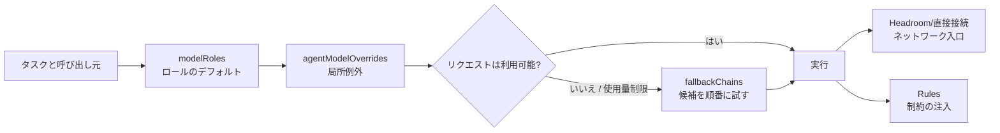

このページは、OMP にロールルーティング、サブ Agent のオーバーライド、フォールバック、プロキシ、ルールが同時に存在するとき、どの層が何を決めるのかを答える。基本の因果関係は、ロールのデフォルトを選び、明示された局所オーバーライドを適用し、障害または使用量ポリシーが必要としたときだけフォールバックチェーンへ進む、というものだ。ネットワーク入口と行動ルールは別の責務である。

## コアメカニズム

### 1. 設定階層と因果チェーン



| 層 | 解決する問題 | 明確に解決しない問題 |
| --- | --- | --- |
| `modelRoles` | `plan`、`task`、`slow` などのロールに対するデフォルト provider/model と能力帯 | リクエストがプロキシを通るか、資格情報をどう作るか |
| `task.agentModelOverrides` | ある Agent またはサブタスクだけのモデル例外 | ロールのデフォルトの代替、または障害復旧 |
| `retry.fallbackChains` | 障害、レート制限、使用量ポリシー発動後の候補順序 | provider 設定の修復、候補が利用可能であることの保証 |
| 実行制御（retry、usage-aware など） | retry、冷却、使用量予約、優先モデルへの復帰のタイミング | ロールの意味を再定義すること |
| Headroom / `models.db` | provider からネットワーク入口までのルートとプロキシのライフサイクル | OMP ロールの選択、Agent ルールの注入 |
| ルールの検出と注入 | `globs`、条件、`alwaysApply` による制約の適用 | モデルルーティングの変更、`paths` の `globs` への自動変換 |

### 2. 選択と復旧の境界

- 能力とコストの意図はロールのデフォルトに置く。一時的な上流 URL をロールの意味に埋め込まない。
- オーバーライドは本当に例外が必要なサブ Agent だけに使う。現行リリースがキーやスコープを認識しない場合、親ロールまたはデフォルトへ戻る可能性があるため、実行結果で確認する。
- フォールバックチェーンは順序付き候補グラフであり、ヘルスチェッカーではない。すべての候補が現在のモデルカタログに存在し、認証を通る必要がある。
- `fallbackRevertPolicy`、usage-aware fallback、retry 回数は復旧タイミングを変えるが、直接接続の provider を Headroom provider に変えるものではない。
- `globs`、条件、`alwaysApply` はルール注入の意味である。設定ファイルの `rules` スイッチがルール検出を置き換えるわけではない。

### 3. 設定、ルーティング、挙動の順に検証する

1. **構造層**：設定を parse し、キーの型、ロール名、override 先、fallback 参照を確認する。
2. **意思決定層**：新しいセッションで通常ロールとオーバーライド付きサブ Agent を一つずつ呼び、最終 selector を記録する。テキストだけを読まない。
3. **復旧層**：制御された利用不能または rate limit の候補で、fallback 順序、冷却後の復帰、使用量予約を確認し、元のエラーも残す。
4. **入口層**：Headroom を使う場合、`models.db`/明示 custom provider、リクエスト headers、active wrapped session を別々に確認する。200 や `/health` は到達性しか示さない。
5. **ルール層**：`omp ttsr list` と `omp ttsr scan -v <candidate>` で検出とパスへの適用を確認する。

## 適用条件

- 一つの OMP 環境で、計画、実装、デザイン、高速スキャンの負荷を調整したい。
- 全体設定を複製せず、単一のサブ Agent だけモデルを変更したい。
- API の rate limit、使用量枯渇、モデル選択の誤りを分離して診断したい。
- プロキシルートとルールファイルを運用しながら、各層の証拠を残したい。

## 非適用とリスク

| 症状 | 誘発されやすい誤診 | 境界と対応 |
| --- | --- | --- |
| サブ Agent が親モデルを使う | override キーは必ず効くと思う | フィールド名、スコープ、継承はリリースで異なる。新しいセッションの最終 selector を確認する |
| 主モデルは成功するが fallback が失敗する | fallback が新しいモデルを発見すると思う | fallback は宣言済み候補だけを歩く。無効、古い、未認証の候補を除く |
| 設定を変えても挙動が変わらない | hot reload だと思う | セッション単位のロードは新しいセッションで確認する。古いプロセスは証拠にならない |
| ルールはロードされるがパスに反応しない | `globs` なしで `paths` を使う | OMP が読むのは `globs`。共有ディレクトリで両方を持てても自動変換はない |
| loopback または HTTP 200 しか見えない | 到達性を経路全体とみなす | inbound/outbound ログと最終上流を確認する。ロール選択、入口、圧縮 savings は別の事実である |
| すべてを `alwaysApply` にする | 繰り返しが安全だと思う | sticky ルールは毎ターン文脈を膨らませる。多くの制約にはパスまたはストリーム条件が適する |

## 最小検証

```text
設定 parse → ロールのデフォルト → override 命中 → fallback 順序
          →（使用時）実際の入口/上流 → ルール検出/パス命中
```

最小の有効な証拠は、通常ロール一つの最終 selector、オーバーライド付きサブ Agent 一つの最終 selector、制御された fallback の候補順、そして scan が報告するルール項目である。静的 YAML だけから推測した結果は、実行時挙動の証明にならない。

## 証拠と不確実性

- **情報源の事実**：`legacy-omp-config-and-rules-guide` は `modelRoles`、`task.agentModelOverrides`、`retry.fallbackChains`、ルール正規化、`paths`/`globs` のサイレント失敗、ロール→モデル・モデル→入口・リクエストレベルの区別を記録する。
- **本ページの総合**：「デフォルト → 局所 override → 復旧 → ネットワーク入口 → ルール注入」の順序は、異なる層の症状を混同しないための整理である。
- **未確認**：ロール数、CLI 出力、override の正確な優先順位、使用量閾値、`models.db` のフィールドは OMP/Headroom のバージョンで変わり得る。古いマシンのスナップショットを現在のデフォルトとは扱わない。

## 関連ページ

- [Headroom 単一ポート移行](/ja/note/headroom-single-port-evolution)
- [Headroom ルート永続化](/ja/note/omp-headroom-persistence)
- [OMP Hook 拡張](/ja/note/omp-hook-extension-guide)
- [LLM wiki pattern](/ja/note/llm-wiki-pattern)
