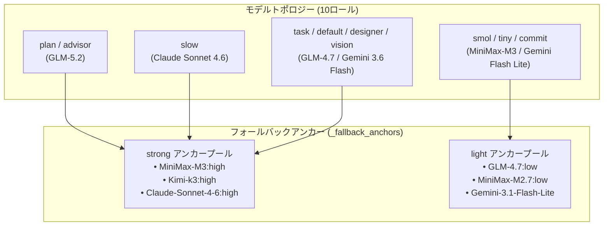

# グローバル OMP 設定の解説：モデルロール、自動フォールバック、ハードガードレール

大規模なソフトウェア開発や日常の AI 支援開発において、単一の AI モデルだけで**応答速度**、**高度な推理能力**、**API トークンコスト**のバランスをとることは困難です。OMP (`@oh-my-pi/pi-coding-agent`) は、`~/.omp/agent/config.yml` を通じて Agent の動作パターン、モデルルーティング、高利用性フォールバック、長期記憶、安全ガードレールをカスタマイズできる堅牢な設定管理システムを提供します。

本記事では、**現在有効な最新の** `config.yml` 設定に基づき、OMP の設定体系、フォールバックアンカーの構造、全ロールフォールバック、詳細な実行フラグ、運用ノウハウを詳しく解説します。

---

## 一、現在の設定スナップショット

以下は `~/.omp/agent/config.yml` で現在有効な完全な設定内容です：

```yaml
setupVersion: 1
modelRoles: 
  plan: zhipu-coding-plan/glm-5.2:max
  advisor: zhipu-coding-plan/glm-5.2
  slow: google-antigravity/claude-sonnet-4-6:high
  task: zhipu-coding-plan/glm-4.7:high
  designer: google-antigravity/gemini-3.6-flash-high
  smol: minimax-code-cn/MiniMax-M3:low
  tiny: zhipu-coding-plan/glm-4.7:low
  commit: google-antigravity/gemini-3.1-flash-lite
  vision: google-antigravity/gemini-3.6-flash-high
  default: google-antigravity/gemini-3.6-flash:medium

_fallback_anchors: 
  strong: 
    - minimax-code-cn/MiniMax-M3:high
    - kimi-code/k3:high
    - google-antigravity/claude-sonnet-4-6:high
  light: 
    - zhipu-coding-plan/glm-4.7:low
    - minimax-code-cn/MiniMax-M2.7:low
    - google-antigravity/gemini-3.1-flash-lite

retry: 
  enabled: true
  maxRetries: 5
  baseDelayMs: 2000
  fallbackRevertPolicy: cooldown-expiry
  fallbackChains: 
    slow: 
      - kimi-code/k3:high
      - minimax-code-cn/MiniMax-M3:high
      - google-antigravity/claude-sonnet-4-6:high
    plan: 
      - minimax-code-cn/MiniMax-M3:high
      - kimi-code/k3:high
      - google-antigravity/claude-sonnet-4-6:high
    advisor: 
      - minimax-code-cn/MiniMax-M3:high
      - kimi-code/k3:high
      - google-antigravity/claude-sonnet-4-6:high
    default: 
      - kimi-code/kimi-for-coding:high
      - zhipu-coding-plan/glm-4.7:high
      - google-antigravity/gemini-3.6-flash-high
    task: 
      - zhipu-coding-plan/glm-4.7:high
      - kimi-code/kimi-for-coding:high
      - google-antigravity/gemini-3.6-flash-high
    designer: 
      - google-antigravity/gemini-3.6-flash-high
      - kimi-code/k3:high
      - minimax-code-cn/MiniMax-M3:high
    vision: 
      - kimi-code/k3:high
      - minimax-code-cn/MiniMax-M3:high
      - google-antigravity/gemini-3.6-flash-high
    smol: 
      - zhipu-coding-plan/glm-4.7:low
      - google-antigravity/gemini-3.1-flash-lite
    tiny: 
      - kimi-code/kimi-for-coding:low
      - google-antigravity/gemini-3.1-flash-lite
    commit: 
      - zhipu-coding-plan/glm-4.7:low
      - kimi-code/kimi-for-coding:low
  usageAwareFallback: true
  usageReservePolicy: auto
  usageReservePct: 10

advisor: 
  enabled: true
  subagents: true
symbolPreset: ascii
theme: 
  dark: dark-volcanic
  light: light
disabledExtensions: []
memory: 
  backend: hindsight
hindsight: 
  apiUrl: http://localhost:42888
autolearn: 
  enabled: true
  autoContinue: true
defaultThinkingLevel: auto
dev: 
  autoqaConsent: granted
prewalk: 
  enabled: true
display: 
  showTokenUsage: true
compaction: 
  idleEnabled: true
  idleThresholdTokens: 200000
task: 
  prewalk: true
  eager: preferred
goal: 
  continuationModes: 
    - interactive
branchSummary: 
  enabled: true
snapcompact: 
  systemPrompt: none
  toolResults: true
ttsr: 
  interruptMode: prose-only
checkpoint: 
  enabled: false
computer: 
  enabled: false
statusLine: 
  showHookStatus: false
```

---

## 二、モデルトポロジーとフォールバックアンカー

OMP は `modelRoles` を通じてワークロードを各専門モデルへ割り当て、`_fallback_anchors` により強力モデルと軽量モデルのバックアッププールを構成します。



### 1. 10大モデルロールの役割：
- **構成設計・アドバイス (`plan` / `advisor`)**：論理構築に優れた `zhipu-coding-plan/glm-5.2` を採用。
- **深層推理 (`slow`)**：高度なバグ修正やリファクタリング用に `google-antigravity/claude-sonnet-4-6:high` を割り当て。
- **標準 Worker (`task` / `default` / `designer` / `vision`)**：`GLM-4.7:high` と `Gemini 3.6 Flash` により高速で正確なコード作成、UI設計、多模態処理を実施。
- **低遅延タスク (`smol` / `tiny` / `commit`)**：`MiniMax-M3:low` や `Gemini 3.1 Flash Lite` を使用し、Git コミット生成やスキャンを高速化。

### 2. アンカー分離メカニズム (`_fallback_anchors`)
設定ファイル内の `_fallback_anchors` はモデルを `strong` と `light` の2つの階層に抽象化します：
- **`strong` アンカープール**：`MiniMax-M3:high`、`Kimi-k3:high`、`Claude-Sonnet-4-6:high` を含み、推理重視のロールを強力にバックアップ。
- **`light` アンカープール**：`GLM-4.7:low`、`MiniMax-M2.7:low`、`Gemini-3.1-Flash-Lite` を含み、軽量タスクのコストを削減。

---

## 三、全9ロールフォールバックチェーン (`fallbackChains`) と利用制限感知

API レート制限や一時障害が発生した際、**全9つの核心ロール** に対する自動フォールバックが機能します：

1. **重厚推理・計画グループ (`slow`, `plan`, `advisor`)**：
   - 迂回ルート：`Kimi-k3:high` → `MiniMax-M3:high` → `Claude-Sonnet-4-6:high`。
2. **標準 Worker・UI画像グループ (`default`, `task`, `designer`, `vision`)**：
   - 迂回ルート：`Kimi-for-coding` / `GLM-4.7:high` / `Gemini 3.6 Flash High`。
3. **高速スキャングループ (`smol`, `tiny`, `commit`)**：
   - 迂回ルート：`GLM-4.7:low` / `Gemini 3.1 Flash Lite` / `Kimi-for-coding:low`。

### クールダウン復帰と予約保護ポリシー：
- **`fallbackRevertPolicy: cooldown-expiry`**：クールダウン終了後、自動的にプライマリモデルへ復帰。
- **`usageAwareFallback: true` & `usageReservePct: 10`**：利用上限を事前に感知し、10% のバッファ枠を維持して切り替えを実行。

---

## 四、詳細な実行制御フラグ

モデルルーティングに加え、以下の詳細な実行オプションが構成されています：

### 1. 思考と探査フラグ
- **`defaultThinkingLevel: auto`**：タスク難易度に応じて CoT（思考チェーン）の深さを自動調整。
- **`task.prewalk: true` & `prewalk.enabled: true`**：コード変更前に依存関係ファイルや影響範囲を強制探査。
- **`task.eager: preferred`**：サブタスク検知時に並列実行を優先。

### 2. 対話と割り込みモード
- **`goal.continuationModes: [interactive]`**：対話継続モードを有効化し、無応答による切断を防止。
- **`ttsr.interruptMode: prose-only`**：Turn-To-Speak 割り込みを自然言語のみに制限。
- **`branchSummary.enabled: true`**：Git ブランチの変更概要の自動生成を有効化。
- **`snapcompact.toolResults: true`**：200k トークン達成時のアイドル圧縮において、ツール過去出力をスナップショット削除。

### 3. 開発者・実験的オプション
- **`dev.autoqaConsent: granted`**：開発環境における自動 QA テストの実行を許可。
- **`checkpoint.enabled: false` & `computer.enabled: false`**：実験的な Checkpoint や Computer Use 機能を明確に無効化し、安定性を確保。

---

## 五、記憶とハードガードレール体系

1. **Hindsight 長期記憶 (`backend: hindsight`)**：ローカルの `http://localhost:42888` と連携し、セッションを超えてナレッジや過去の知見を蓄積。
2. **Autolearn (`autolearn.enabled: true`)**：実行パターンをレッスンとして自動抽出し、Managed Skills（`~/.omp/agent/managed-skills/`）として定着。
3. **Pre-Tool-Call ガードレール (GitHub Write Gate)**：`~/.omp/agent/hooks/pre/github-write-gate.ts` により、`git push` などの危険な変更コマンドを命令実行前に物理遮断。

---

## 六、まとめ

現在稼働中の OMP 設定は、高利用性・低コスト・安全性を兼ね備えた AI 開発環境を提供しています：
- **10のモデルロールと `_fallback_anchors`** により速度と思考の深さを最適化；
- **全9ロールのフォールバックチェーンと 10% 予約保護** により API 障害時でも運用を継続；
- **Hindsight 長期記憶とハードガードレール** により安全かつインテリジェントに Agent を運用。
