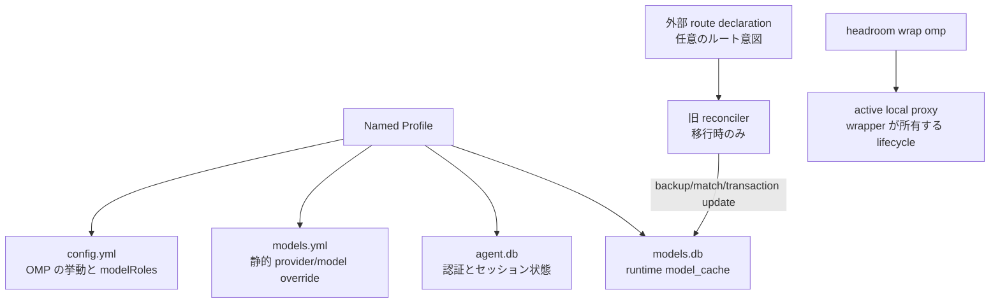

このページは、OMP 更新後にルート意図、ユーザー状態、runtime model cache が互いを汚染しないようにする方法と、壊れた過去のルートを安全に復旧する方法を答える。モデルは、Named Profile で設定と認証を分離し、必要なら OMP ディレクトリ外の宣言にルート意図を保存し、`models.db` の `model_cache` を再生成可能な派生状態とみなし、reconciler を通常の `headroom wrap omp` 起動手順にしない、というものだ。

## コアメカニズム

### 1. 意図、ユーザー状態、派生状態を分ける



| 成果物 | 役割 | 安全に導けること | 導いてはいけないこと |
| --- | --- | --- | --- |
| Named Profile | OMP の設定、資格情報、履歴、cache の一組を分離する | 一つの profile の更新が別 profile を汚染するとは限らない | profile がルートを自動修復したり資格情報を隠したりすること |
| `config.yml` | ユーザー挙動、`modelRoles`、retry、tools などの意図 | ロールと実行制御を選ぶ | 選ばれた provider が特定の base URL を必ず使うこと |
| `models.yml` | 静的 provider/model override 層 | override の意図を表せる | 既存の authoritative cache row が必ず引き継がれること |
| `models.db` / `model_cache` | discovery/merge 後の runtime 派生状態 | 再構築でき、実行中の状態で確認すべきこと | 長期的な手編集の契約として安全であること |
| 外部 route declaration | OMP ディレクトリ外の任意のルート意図 | 更新後の復旧入力になり得る | 資格情報を保存したり provider catalog を置き換えたりすること |
| reconciler | 旧移行時の制御された復旧ツール | backup、match、transaction update を実行できる | 通常の起動前に毎回実行すべきこと |

### 2. 旧 reconciler の安全な復旧チェーン

この過去のフローは隔離した移行環境にだけ残す。

1. token や API key を読み込んだりコピーしたりせず、対象 profile と外部宣言を検証する。
2. 現在の `models.db` を backup し、安定した provider identity と API で既存 cache row を match する。
3. match がなければ fail-loud で停止する。新しい provider/model を推測して INSERT したり、catalog 全体を再構築したりしない。
4. `baseUrl` や動的 headers など宣言されたルートフィールドだけを更新し、metadata、fingerprint、version、`authoritative=1` の意味を保持する。
5. 一つの transaction で commit し、失敗時は rollback する。`changed`、match 状態、cache version を出力する。
6. 新しいセッションで最終入口と上流を検証する。古いプロセスの in-memory 設定は復旧の証拠ではない。

### 3. 現在推奨されるライフサイクル

日常は公式の `headroom wrap omp` に active proxy を管理させる。セッション中は `headroom doctor`、`headroom perf`、`headroom dashboard` で観測できる。終了後は明示的に `headroom unwrap omp` を実行し、プロキシを意図的に残す場合だけ `--no-stop-proxy` を使う。旧 systemd unit、手動 proxy、reconciler は推奨起動チェーンではない。

## 適用条件

- OMP 更新で `model_cache` が再構築される一方、監査可能なルート意図を残したい。
- 複数の OMP profile で資格情報、セッション履歴、runtime model catalog を分離したい。
- catalog を手で再構築せず、backup から明示 custom provider を移行時に復旧したい。
- 設定の正しさ、cache の再構築、実際に動くプロキシを分けて診断したい。

## 非適用とリスク

| リスク | 誤診または症状 | 境界と対応 |
| --- | --- | --- |
| `models.yml` を強い override とみなす | base URL を書いても authoritative cache が古い入口を使う | リリースごとに live `model_cache` と最終上流を確認し、引き継ぎを保証しない |
| `models.db` を手編集する | プロセスが古いメモリを使い、再起動で変更が再生成される | backup と transaction 結果を残す隔離した移行証拠だけに限定する |
| reconciler を通常起動に入れる | 毎回 cache を書き換え、catalog や version の変化を隠す | 日常は wrapper、reconciler は旧移行復旧だけにする |
| `agent.db` を設定とみなす | 資格情報や session 状態が Git、ログ、外部宣言へ漏れる | profile 状態を非公開にし、ルート宣言から資格情報を除き、権限を監査する |
| match がないのに INSERT する | OMP が発見していない偽 provider が生成され、後の更新が予測不能になる | fail-loud で停止し、現行 catalog と release を先に確認する |
| loopback または 200 だけを確認する | 上流の証拠なしにルートと復旧を成功と報告する | proxy inbound/outbound、最終 URL/WebSocket、新しいセッションを組み合わせる |
| 通常終了で route state が消えると思う | 次のセッションが意図しない loopback や古い headers を継承する | プロキシを意図的に残さない限り `headroom unwrap omp` を明示する |
| 二重圧縮や旧 override を残す | savings/出力異常の原因を特定できない | context-mode、旧 override、proxy 層を一つずつ無効にして再測定する |

## 最小検証

現在のライフサイクルでの最小観測：

```text
新しいセッション：headroom wrap omp
  → doctor/perf（proxy 到達性）
  → L1 profile、models.yml、model_cache を確認
  → L2 明示ルートへ最小要求
  → L3 proxy ログと最終上流を確認
  → headroom unwrap omp
```

旧 reconciler を検証する必要がある場合は、一時的な database copy と本番でない資格情報を使う。制御された `baseUrl`/header/authoritative の不一致を作り、backup 作成、row 復元、保持された `cache_version`、失敗時の transaction rollback、二回目の `changed=false` を確認する。これは reconciler の冪等性を証明するが、現在の wrapper が自動実行することは証明しない。

## 証拠と不確実性

- **情報源の事実**：`legacy-omp-headroom-persistence` は Named Profile、`config.yml`/`models.yml`/`agent.db`/`models.db` の層、外部宣言、旧 reconciler の backup/match/transaction semantics、復旧出力を記録する。`legacy-headroom-single-port-evolution` は単一ポートとプロトコル検証を記録し、`legacy-omp-config-and-rules-guide` はロール選択、入口ルート、wrapper lifecycle を分離する。
- **本ページの総合**：ルート意図を `model_cache` から切り離し、現在の wrapper 検証と移行専用 reconciler 検証を分けることで、過去のスクリプトが製品の起動契約になるのを防ぐ。
- **未確認**：Named Profile の CLI、database schema、authoritative override 規則、wrapper が `models.yml` を書く／消す時機、プロセス終了時のメモリ挙動、provider のプロトコル挙動は OMP/Headroom のバージョンに依存する。バージョンをまたぐ互換性は主張しない。

## 関連ページ

- [Headroom 単一ポート総合](/ja/note/headroom-single-port-evolution)
- [OMP 設定の階層](/ja/note/omp-config-and-rules-guide)
- [OMP Hook 拡張](/ja/note/omp-hook-extension-guide)
- [LLM wiki pattern](/ja/note/llm-wiki-pattern)
