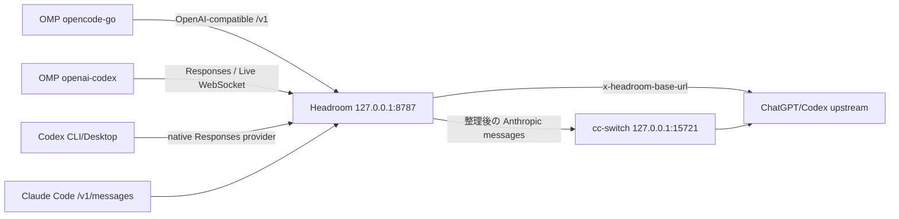

`omp-headroom-provider-proxy` は外部ルーティングコントローラと Headroom デプロイプロジェクトだ。OMP、Codex、クライアント認証の owner 境界を保持し、OMP/Headroom のソースを変更せず、credential や `models.db` をコピーせず、明示的な設定、systemd user service、状態検証、ロールバック可能な操作で複数のクライアントを同じ loopback Headroom 入口に接続する。本ページは現在の Headroom 0.34/OMP/Codex 環境向けの `provisional` entity ページであり、実装ソースとランタイム証拠は `sources` にある。

## 何を解決するか

このプロジェクトは、混同しやすい三つの問題を分ける：

1. **入口**：Headroom は `systemd --user` が管理し、`127.0.0.1:8787` だけを listen する。
2. **ルーティング**：OMP provider route と Codex ネイティブ Responses provider は、正確な prefix、API、header、upstream 制約で Headroom に入る。
3. **ライフサイクル**：`bin/omp-routes` と `bin/codex-routes` が apply/check/restore を明示的に担当する。サービス起動・停止が暗黙的にユーザールートを書き換えることはない。

Headroom が compression owner である。同じリクエストに二つ目の application-level compression bridge を重ねてはならない。Claude Code と共存する場合、cc-switch は Anthropic↔OpenAI プロトコル変換と資格情報注入だけを行い、圧縮は担当しない。

## ルーティングトポロジ



| 呼び出し元        | 入口と責務                                                                     | このパスから推測してはいけないこと                                     |
| ----------------- | ------------------------------------------------------------------------------ | ---------------------------------------------------------------------- |
| `opencode-go`     | OpenAI-compatible provider route で Headroom prefix に入る                     | 他の provider が自動的に引き継がれる                                   |
| `openai-codex`    | Responses/Live WebSocket で Headroom に入り、header で ChatGPT upstream を選ぶ | model discovery、ログイン、realtime voice が proxy を経由する          |
| Codex CLI/Desktop | ユーザー単位の `$CODEX_HOME/config.toml` を共有するネイティブ provider         | `HTTP_PROXY`/CONNECT が必須の手段である                                |
| Claude Code       | `HEADROOM_CC_SWITCH_RECONCILE=1` のとき Headroom を経て cc-switch が変換       | cc-switch が圧縮を担当する、または二つのプロトコルパスが状態を共有する |

## Codex ネイティブ provider

Codex CLI と Desktop は同じユーザー設定を使うため、このプロジェクトは別の proxy を立てず、システムレベルの HTTP proxy も装わない。`config/codex-headroom.toml` が宣言する provider の重要セマンティクスは次の通り：

- `model_provider = "headroom"`；
- `wire_api = "responses"`；
- `base_url` は既存の loopback Headroom prefix を使う；
- `requires_openai_auth = true` と `supports_websockets = true` で Codex の OAuth/Live WebSocket セマンティクスを保持する；
- `x-headroom-base-url = https://chatgpt.com/backend-api` を request 単位の upstream hint とする；
- auth ファイル、token、OMP 所有の database は各 owner のユーザーディレクトリに残り、プロジェクトに入らない。

`bin/codex-routes` は唯一の実ユーザー設定書き込み入口である。root-safe な TOML managed marker を維持し、apply 前後にターゲットの identity、mode、content hash、backup hash、state journal を検査する。`flock`、atomic write/exchange、prepared restore、mode drift と target drift の検査が一体となり、ユーザーの手編集、外部 writer、異常終了があっても、コントローラは推測して上書きするのではなく停止する。

## OMP ルーティングとプロジェクト永続化

`bin/omp-routes` は許可された `opencode-go` と `openai-codex` provider だけに明示的に apply/check/restore する。provider API、exact loopback prefix、upstream header、パスはすべて静的契約である。プロジェクト state、Headroom の workspace/log/savings など永続化ディレクトリはプロジェクト `var/` に置かれるが、OMP credential、`models.db`、ユーザーの route ownership はプロジェクトにコピーされない。

したがって、次の項目をそれぞれ別々に検証すべきだ：

- OMP 設定が正しいか；
- Headroom service が healthy/ready か；
- リクエストが本当に loopback proxy に届くか；
- proxy が最終的に期待する HTTP/WebSocket upstream に接続するか。

クライアントの成功、`/health`、HTTP 200 だけでは compression route が有効なことを証明できない。proxy の inbound/outbound ログとレスポンス完了イベントを組み合わせなければならない。

## 実検証

現在の納品証拠は次の通り：

```text
./bin/validate                  PASS
./bin/headroom-ponytail-check  PASS
./bin/omp-routes check          PASS
./bin/codex-routes check        PASS
systemctl --user ...            active
```

Codex CLI の fresh process は `CODEX_HEADROOM_CLI_SMOKE_OK` を返し、Desktop の fresh local-thread は `CODEX_HEADROOM_DESKTOP_SMOKE_OK_2` を返す。どちらの proxy ログにも loopback Responses リクエスト、ChatGPT OAuth Codex WebSocket、`response.completed` が見える。これは現在の環境の実 inference path を証明するもので、discovery、クラウドスレッド、voice への汎用互換宣言ではない。

## ロールバック

1. すべての Codex CLI/Desktop writer を停止する。
2. `./bin/codex-routes restore --force` を実行する。
3. `./bin/codex-routes check` で backup/state hash とターゲット mode を確認する。
4. 再び有効にする必要があるときは、明示的に `apply` し直す。コントローラを迂回してユーザー設定を直接編集しない。

OMP ルートは対応する `bin/omp-routes restore` を使う。Claude Code/cc-switch 共存のロールバックでは、さらに reconciler と `BindPaths=%h/.claude` を削除し、元の `ANTHROPIC_BASE_URL` を復元する必要がある。すべてのロールバックで実際の writer を先に停止し、backup を保持すること。

## バージョンと証拠の境界

- **情報源の事実**：固定プロジェクトコミット、プロジェクトドキュメント、controller contract、分離された lifecycle smoke、fresh CLI/Desktop の proxy 証拠。
- **本ページの総合**：「単一の compression owner、ネイティブ Codex provider、明示的なルートトランザクション、実 proxy 証拠」を再利用可能なプロジェクトモデルにまとめる。
- **不確実性**：provider schema、Desktop の設定読み込み、ログフィールド、WebSocket 挙動、Headroom/OMP のバージョン境界は変わり得る。現在の作業ツリーのルーティングコントローラはまだ新しい公開コミットを形成しておらず、リリース前にコミットを再固定して検証を再実行する必要がある。

## 関連ページ

- [Headroom 単一ポート総合](/ja/note/headroom-single-port-evolution)
- [Headroom ルート永続化の総合](/ja/note/omp-headroom-persistence)
- [Headroom と cc-switch / Claude Code の共存](/ja/note/headroom-cc-switch-coexistence)
- [Headroom 0.34 圧縮・取得契約](/ja/note/headroom-compress-retrieve-contract)
