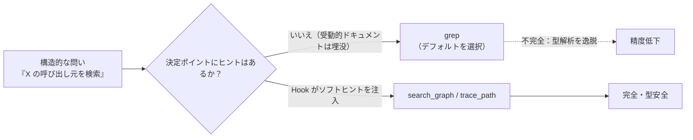
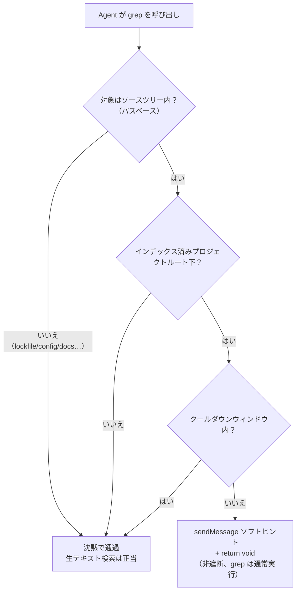

# OMP Hook 拡張実践：意思決定ポイントのソフトヒントからステータスライン統合まで

OMP（Oh My Pi）の Extension Hook 機構は強力な拡張仕組みを提供します：開発者はセッションライフサイクルの重要なノード（`session_start`、`tool_call` など）でカスタムロジックを注入し、`pi.sendMessage()` で LLM コンテキストに影響を与え、`ctx.ui.setStatus()` でステータステキストを発行できます。本記事では 2 つの実践ケースを通じて、Hook 拡張の診断・設計・検証手法を体系的に示します。

- **ケース 1**：新鮮で完全なコードナレッジグラフ（grep より構造探査に優れる）が 30 セッション中 4 回しか使われず、grep が 158 回呼び出されていました。問題はインデックスではなく「意思決定ポイントにヒントがなかった」こと——非遮断の `PreToolUse` Hook で grep 意思決定の瞬間にソフトヒントを注入。
- **ケース 2**：GitHub 書き込みゲートのステータスを OMP の statusline に表示。真の答えは 4 つの層に散在——見落とされていたレンダリングチャネル、ハードコードされた segment ユニオン、「偽ニーズ」の識別、そして上流への 5 ファイル Patch。

---

## 一、ケース 1：ナレッジグラフ優先——意思決定ポイントのソフトヒント Hook

### 1.1 謎：準備された機能と使われない現実

`codebase-memory-mcp` はプロジェクトをハイブリッド LSP ナレッジグラフとしてインデックス化します。構造的な問い——*定義の検索、X の呼び出し元、X の呼び先、死にコード、モジュール境界*——に対して、`grep` より高速かつ完全です。監査対象プロジェクトは完全にインデックス化されていましたが、30 セッションにおいて Agent はグラフが存在しないかのように振る舞いました：

| チェック項目 | 結果 |
| --- | --- |
| インデックス化済みか？ | はい — **34,361 ノード / 120,215 エッジ / 82 MB** |
| 新鮮か？ | はい — グラフの `head_sha` は `git HEAD` と完全一致、ステータス `ready` |
| 到達可能か？ | はい — `xd://mcp__codebase_memory_mcp_*` デバイスファミリとして露出 |

したがって、問題は「使えるか」ではなく**「なぜ使わないのか」**でした。



### 1.2 データ監査：grep とナレッジグラフの実際の利用状況

セッションログの分析により、明確な回答が得られました：

| 指標 | 件数 |
| --- | --- |
| `grep` 呼び出し回数 | **158** |
| `codebase-memory` 呼び出し回数 | **22** |
| うち **構造的** な grep（定義 / 呼び出し元の検索） | **約 80%（116–128 回）** |
| うち **生のテキスト** 検索（i18n, 設定, ログ） | 約 10–15% |
| グラフを利用したセッション数 | **4 / 30** |
| グラフ呼び出しの **単一アーキテクチャセッション** への集中度 | **18 回** |

**集中度が重要なシグナルです。** グラフ呼び出しの大部分は 1 回の意図的なアーキテクチャ整理に集中し、残りの 26 セッションでは完全に忘却されていました。

### 1.3 根本原因：受動的ドキュメントは学習済みの事前知識に勝てない

影響度順の根本原因：

1. **意思決定ポイントでの強制力の欠如（主因）。** 反 grep のルールは `AGENTS.md` 内の受動的な文章としてしか存在せず、プロジェクトレベルの `AGENTS.md` は codebase-memory について**言及すらしていません**でした。
2. **ツールの呼び出し摩擦（副因）。** `grep` は単一引数のシンプルな呼び出しですが、グラフ検索は JSON ペイロードの構築が必要でした。
3. **鮮度・インデックス未完了 — 排除済み**（上記表参照）。

### 1.4 なぜ「ルールの強化」では解決しないのか

- **ルールはターンごとまたはファイルパスごとに注入され、ツール呼び出しごとではない。** `alwaysApply` ルールは毎ターン再注入——まさにデータが示すモデルチューニングで無視される「受動的ドキュメントの繰り返し版」。
- **欠陥はツール選択を決める瞬間に発生する** ため、`PreToolUse` Hook のみがその位置で干渉できます。30 セッション中 26 が明示的な「禁止」を無視——「さらに散文を追加しても効果がない」ことの証拠。

正しい介入単位は：*「Agent がソースツリーに `grep` を呼び出そうとした瞬間、より良い選択肢を提示——ただし遮断しない」*。

### 1.5 解決策：ソフト PreToolUse Hook

#### 通路の選択：ハードではなくソフト

OMP の `tool_call` イベントは 2 種類のチャネルをサポートします：

| チャネル | メカニズム | 効果 |
| --- | --- | --- |
| **ハード**（戻り値） | `return { block, reason }` | 呼び出しを遮断。正規の `grep` を誤遮断するリスク。 |
| **ソフト**（副作用） | `pi.sendMessage({ customType, content, display, attribution })` **+ `return void`** | LLM コンテキストにメッセージを注入し、実行は継続。誤遮断リスクゼロ。 |

ソフトチャネルは非自明なものです。`ToolCallEventResult` は遮断向けですが、`pi.sendMessage()` は基本の `HookAPI` にぶら下がり、*あらゆる*イベントから呼び出し可能です。`void` を返すことは「遮断しない——続行」を意味します。

**ソフト**を選択：「提示而非遮断」の思想を尊重し、正規の生テキスト grep を決して中断しません。最悪でも静かなノップ。

#### パスベースの検出

第一版の述語は拡張子または非空パターンを要求。ユニットテストが即座に問題を捕捉：**59** 回の構造的 grep しか検出できず、**73 回のアンチパターンを見逃し**ていました。正しい検出は**パスベース**です——ソースツリーにスコープ限定された `grep` は、それ自体が構造的シグナル。

| 述語バージョン | 検出した構造的 grep | 判定 |
| --- | --- | --- |
| 拡張子またはパターン要求 | 59 / 158 | **不良**——ディレクトリ限定検索を見逃す |
| **パスがソースツリーを指し かつ生テキストでない** | **116 / 158** | 手動ベースライン（約 127）に合致 |

#### 許可リスト

| `grep` 対象 | 動作 |
| --- | --- |
| `backend-spring/src`、`console/src`、`management/src`、`shared/*/src` | **ヒント**（構造的） |
| `**/pnpm-lock.yaml`、`**/*.json/yaml/toml`、`**/*.md`、`migrations/`、`locales/`、`i18n/`、`wiki/`、`dist/build/target/`、`node_modules/`、`.omp/`、`*.log`、`*.css/scss`、`pom.xml`、`docker-compose*`、`tsconfig*`、`vite.config*` | **沈黙**（生テキスト検索が正当） |



### 1.6 実装：Hook コードと API 契約

Hook は `hooks/pre/graph-first-nudge.ts` に配置（OMP は**セッション開始時**に `hooks/pre/*.ts` を自動ロード——ホットリロードではないため、新規 Hook は実行中セッションに見えず、新セッションで検証必須）。

```ts
import type { HookAPI } from "@oh-my-pi/pi-coding-agent/extensibility/hooks";

const REMINDER =
  "codebase-memory nudge: this project is indexed in the code knowledge graph. " +
  "For STRUCTURAL lookups — find definition, callers, callees, references, type, " +
  "module/package boundary — use the graph FIRST, then grep only as a raw-text fallback:\n" +
  "  - xd://mcp__codebase_memory_mcp_search_graph    (query or name_pattern -> qualified_name)\n" +
  "  - xd://mcp__codebase_memory_mcp_trace_path       (function_name + direction inbound/outbound)\n" +
  "  - xd://mcp__codebase_memory_mcp_get_architecture (clusters / layers / packages)\n" +
  "Raw-text grep on lockfiles, config, docs, i18n, migrations, logs, or generated output is fine.";

const SOURCE_TREE_RE = /(backend-spring[\\/]src|console[\\/]src|management[\\/]src|shared[\\/].*?[\\/]src)/;
const RAW_TEXT_RE =
  /(lock|\.json|\.yaml|\.yml|\.toml|\.env|\.mdx?|migrations|locales|i18n|wiki|[\\/]dist[\\/]|[\\/]build[\\/]|[\\/]target[\\/]|node_modules|\.omp|sessions|\.log|\.css|\.scss|pom\.xml|docker-compose|tsconfig|vite\.config|\.sh$)/;

let indexedRoots: string[] = [];
let lastNudgeAt = 0;
const COOLDOWN_MS = 10 * 60 * 1000;

function norm(p: string) {
  return p.replace(/\\/g, "/").replace(/^~/, process.env.HOME ?? "~");
}
function isUnderIndexedRoot(cwd: string) {
  const c = norm(cwd);
  return indexedRoots.some(r => { const root = norm(r); return c === root || c.startsWith(root + "/"); });
}
function isStructuralGrep(input: Record<string, unknown>) {
  const path = norm(String(input.path ?? "")), pattern = String(input.pattern ?? "");
  if (!SOURCE_TREE_RE.test(path)) return false;
  if (RAW_TEXT_RE.test(path) || RAW_TEXT_RE.test(pattern)) return false;
  return true;
}

export default function graphFirstNudge(pi: HookAPI) {
  pi.on("session_start", async () => {
    try {
      const res = await pi.exec("codebase-memory-mcp", ["cli", "list_projects"]);
      const roots = [...String(res.stdout ?? "").matchAll(/"root_path"\s*:\s*"([^"]+)"/g)].map(m => m[1]);
      if (roots.length) indexedRoots = roots;
    } catch { /* 空リストを維持。Hook は非トリガーに縮退 */ }
  });

  pi.on("tool_call", async (event, ctx) => {
    try {
      if (event.toolName !== "grep") return;
      if (!isStructuralGrep(event.input)) return;
      if (!isUnderIndexedRoot(ctx.cwd)) return;
      if (Date.now() - lastNudgeAt < COOLDOWN_MS) return;
      lastNudgeAt = Date.now();
      pi.sendMessage({
        customType: "graph-first-nudge",
        content: REMINDER, display: true, attribution: "agent",
      });
    } catch { /* ヒントが grep を壊すことを決して許さない */ }
  });
}
```

#### Hook API 契約リファレンス

| シンボル | 形状 | 出典 |
| --- | --- | --- |
| `ToolCallEvent` | `{ type:"tool_call", toolName, toolCallId, input: Record<string,unknown> }` | `hooks/types.d.ts` |
| `HookContext.cwd` | `string`——プロジェクトルート | `hooks/types.d.ts` |
| `ToolCallEventResult` | `{ block?, reason? }`——**ハード**パス | `shared-events.d.ts` |
| `HookAPI.sendMessage` | **LLM コンテキストに参加する** `CustomMessageEntry` を注入。`triggerTurn` はデフォルト `false` | `hooks/types.d.ts` |
| Hook 位置 | `hooks/{pre,post}/*.ts`（グローバル）/ `.omp/hooks/{pre,post}/*.ts`（プロジェクト）。セッション開始時にロード | `hooks/loader.d.ts` |

### 1.7 検証：プローブからランタイムまで

修正は 3 層で証明必須、いずれも欠けません：

```bash
# 1. 前提証明：グラフが grep が見つけられない情報を即座に返すことを確認
codebase-memory-mcp cli search_graph '{"project":"PROJECT","query":"SomeMapper"}'

# 2. 論理証明：mock-pi セルフプローブで合成イベントを逐条アサーション
bun /tmp/graph-first-nudge.probe.mjs   # 期待値：6/6 PASS

# 3. ランタイム証明：新セッションでソースツリーに grep し、ソフトヒントが描画され grep が通常返ることを確認
```

1. **mock-pi セルフプローブ**——ファクトリ関数をインポートし、mock `pi` にハンドラを登録、6 つの合成 `tool_call` イベントを発火。結果：**6 / 6 パス**。
2. **前提証明**——Mapper シンボルで `search_graph` を呼び出すと、ファイルと行範囲付きの **106** 件の合格結果が即座に返る。
3. **ライブ実行テスト**——新セッションで `backend-spring/src` に `grep class.*Service` を実行。Hook がトリガーされ `graph-first-nudge` ブロックが描画、**かつ**完全な grep 結果がそのまま返る——非遮断がエンドツーエンドで確認。

---

## 二、ケース 2：Hook ステータスを OMP 上部バーへ

OMP の Extension Hook は `ctx.ui.setStatus(key, text)` でステータステキストを発行できます。私の `github-write-gate` Hook（`git push` や `gh pr create` などの書き込み操作を物理遮断するハードゲート）は `session_start` 時に `GH-gate armed · blocks git push / gh pr / API writes` を発行。要求は**これを statusline に表示**すること。

### 2.1 誤診：ステータスは元々表示されていた

最初の仮説は「`setStatus` が動作していない」。しかしソースコード追跡（`runner.ts` → `extension-ui-controller.ts` → `component.ts` の `#hookStatuses` map）でデータパスは正常。実際のレンダリング位置は**エディタ上部の独立行**で、`statusLine.showHookStatus`（デフォルト `true`）で制御——ユーザーが想定した最上部 border ではなかった。

#### 検証手法：手動スクリーンショットに代わる headless tmux

TUI 描画検証を自動化するため、スクリプト可能な headless tmux パイプラインを導入：

```bash
tmux new-session -d -s probe -x 220 -y 50 'omp' && sleep 25 \
  && tmux capture-pane -t probe -p | grep -n 'GH-gate'
tmux kill-session -t probe
```

- `-d`（detached）および 220×50 の固定サイズで再現可能な表示を確保。
- `capture-pane -p` でプレーンテキストを得て `grep -n` で行番号を特定。最上部 border 行か独立行かを判別。
- 環境変数プレフィックス（`OMPGATE_OFF=1`）で bypass 分岐をカバー。

### 2.2 設定の死角：最上部 border の segment ユニオンは閉じられている

`statusLine.leftSegments/rightSegments` は設定可能に見えますが、スキーマ層の `StatusLineSegmentId` は **24 項目の閉じた union 型**で `hook` 用の枠は存在しない。

**結論：純粋な設定操作だけでは最上部 border に hook ステータスを注入不可。** 死角の特定は損切り価値がある。

### 2.3 否決された回避策：`session_name` の流用

調査で Extension API に `setSessionName()` が存在し、デフォルト preset の `rightSegments` に `session_name` が含まれていることを発見。プローブ Hook で実証：セッション名にステータスを書くと最上部 border 右端に表示された。

しかし 3 つの理由で否決：

1. **セッション選択画面の汚染**——履歴選択にゲートステータスが溢れる。
2. **自動命名との競合**——`session_start` 時の書き込みがユーザー権限を上書き。
3. **冗長性**——独立行で既に表示されている。

教訓：**「できる」と実証した後に「やる価値があるか」も問う**。30 秒のプローブ実験で、誤った方向への全面投資を回避。

### 2.4 正しい解決策：上流への `hook` segment Patch

ユニオンが閉じているなら、開くのが正解。Patch は 10 ファイル（ソース 5 + テスト fixture 5）：

| ファイル | 変更内容 |
|---|---|
| `settings-schema.ts` | ユニオンに `"hook"` を追加 |
| `types.ts` | `SegmentContext` に `hookStatuses: ReadonlyMap<string, string>` を注入。`StatusLineSegmentOptions` に `hook.maxLength` を追加 |
| `component.ts` | `#buildSegmentContext` で既存 `#hookStatuses` map を無条件注入 |
| `segments.ts` | `hookSegment` を新規作成——キー順ソート、ドット連結、muted 着色、デフォルト 32 列切り捨て。空 map 時 `visible: false` |
| `presets.ts` | デフォルト preset の `rightSegments` 末尾に `"hook"` を追加 |

`setStatus` を書く Hook（ゲート、RTK、将来のもの）は Hook 側ゼロ変更で border 表示を自動取得。

#### 境界値の発見 1：border の表示予算が最初に自分を食い尽くす

日常ディレクトリ（長いブランチ名 + PR 番号を含む border）に切り替えると、新 segment が**消失**。border ビルダーはスペース不足時に右端から segment を省略——新追加の `hook` がまさに最右。

解決策：**segment を十分にコンパクトにする**——`segmentOptions.hook.maxLength`（デフォルト 32）。53 文字のゲートテキストを `GH-gate armed · blocks git push…` に切り詰め、220 列フル負荷 border で安定描画。完全テキストは独立行に保持——**短いテキストは border へ、長いテキストは独立行**、各々が役割を果たす。

#### 境界値の発見 2：2 チャネルのゲーティングは分離すべき

初版設計では border segment と独立行が同じ `showHookStatus` で制御。ユーザーが「独立行は不要」と提案し、結合の誤りを露呈。分離後：

- `showHookStatus: true`（デフォルト）：2 チャネル共存。
- `showHookStatus: false`：**border のみ**——目標形態。

#### 検証スタック

`biome check` ✅ → `tsgo --noEmit` ✅ → 55/55 ユニットテスト（新規 7 hookSegment ケース含む）✅ → tmux 四象限ランタイム検証 ✅ → `git fetch` で 0-behind 確認 ✅ → 清潔な worktree で `git am` 適用実証 ✅。

### 2.5 インストールとロールバックの隠れた罠

ローカルインストールは PATH 置換戦略を採用。ロールバックは一見 1 コマンドだが罠がある：border のみモードは `showHookStatus` を `false` に設定し、ストック OMP には border segment が存在しない——バイナリのみロールバックするとステータスが**全滅**。正確なロールバックは 2 コマンド：

```bash
mv -f ~/.local/bin/omp.stock ~/.local/bin/omp
omp config set statusLine.showHookStatus true
```

**設定変更は「可逆操作」の可逆性に条件を生む**——ロールバックチェックリストはファイル層だけでなく設定層もカバー必須。

---

## 三、Hook 開発方法論と経験の体系化

2 つのケースは異なる Hook イベントとチャネルに跨りますが、導出された方法論は高度に一貫しています。

### 3.1 介入単位：決定が起こる場所で介入

- **能力 ≠ 活性化。** より優れ、新鮮で、到達可能なツールも、意思決定の瞬間に手がかりがなければ無価値。*使用率*を測定し、*可用性*ではない。
- **意思決定ポイントの Hook は受動的ドキュメントに勝る。** モデルの事前知識が一方向を指す時、散文——「禁止」の散文でさえ——持ちこたえない（26 / 30 セッション）。手がかりを決定が起こる場所に置く。
- **「効いていない」を先に反証してから着手。** ケース 2 の半分の時間は「実は動いていた、ただ思った場所にないだけ」の確認に費やされた。

### 3.2 チャネル選択：ソフトを優先

- **歯が必要ない限りソフトチャネルを優先。** `sendMessage` + `return void` は誤遮断リスクなしに誘導。誤った呼び出しが真に回復不能な時だけ `{block, reason}` を使う。
- **Hook は fail-soft に。** 全 Hook コードは `try/catch` でラップ。最悪は静かな縮退で、通常のツールフローを決して遮断しない。

### 3.3 検出設計：安定したシグナルで判定

- **安定したシグナルで検出。** 「この `grep` が構造的か」の安定シグナルは *パススコープ*。パターンテキストや拡張子ではない。
- **プローブで実現可能性を検証、検討で実施を判断。** session_name 流用は 30 秒で真実を確認、3 分で否決。

### 3.4 検証戦略：多層証明、現実条件

- **まず実行で検証、次にランタイムで検証。** mock-pi プローブが論理を証明。実際のセッションだけがロードと配信を証明。
- **境界値の発見は現実条件から。** 予算切り捨てとゲーティング結合——両方の重要問題は「日常ディレクトリ + フル負荷 border + 実際のユーザー設定」でのみ浮上。
- **検証ツールの消費範囲変化後は再実行。** 「前回は緑だった」でスキップしない。

> このパターンは具体例に限定されない。「モデルがより強力なツールを持ちながら弱いデフォルトに戻ってしまう」あらゆる場面、「Hook ステータスの可視性が必要」あらゆる要求は、同じ OMP Hook 拡張フレームワークで解決できる。介入の単位は常に*決定が起こる瞬間*。可視性の鍵は常に*ユーザーが実際に見る行*。
