## 一、問題背景：なぜ端末プラグイン管理を単なる「タスク配信」としてはいけないのか

セキュリティ、監視、運用保守、データ収集などのシナリオでは、端末側で通常複数のプラグインが動作している。例えば：

- セキュリティスキャンプラグイン
- 挙動監視プラグイン
- ログ収集プラグイン
- ネットワーク検知プラグイン
- カーネルレベル防護プラグイン
- ルール実行プラグイン

これらのプラグインは一度インストールして終わりではなく、長期稼働、継続的なアップグレード、ルール更新、異常リカバリ、状態追跡が必要である。

端末規模が数千台から百万級、さらには千万級に成長すると、プラグインライフサイクル管理は典型的な分散制御面の問題となる。

その難しさは「インストールコマンドを送れるか」ではなく、以下にある：

1. 膨大な端末の高頻度ハートビートにどう耐えるか？
2. ネットワーク揺らぎによる重複インストール、重複アップグレードをどう防ぐか？
3. 誤ったプラグインが全量配信され、大規模な端末ダウンを引き起こすのをどう防ぐか？
4. コンテナ、カーネル権限なし、特殊OSなどの非互換環境をどう識別するか？
5. 状態、コマンド、レシートの結果整合性をどう保証するか？
6. システムの高同時実行下で低遅延と高信頼性をどう維持するか？

本稿では、百万/千万級端末向けプラグインライフサイクル管理システムを設計する。

---

## 二、コアビジネス目標

システムは分散端末上のプラグインライフサイクルを管理し、以下の能力をカバーする必要がある：

| ライフサイクル段階 | コア目標 | 典型的なアクション |
| :--- | :--- | :--- |
| キープアライブ | プラグインがオンラインかを判定 | ハートビート報告、状態リフレッシュ、タイムアウトオフライン |
| インストール | 端末に指定プラグインをインストール | グレースケール判定、環境フィルタリング、インストールコマンド配信 |
| アップグレード | プラグインをターゲットバージョンにアップグレード | バージョン比較、冪等スケジューリング、失敗時サーキットブレーカ |
| アンインストール | 端末からプラグインを削除 | アンインストールグレースケール、レシート確認、状態をオフラインに |
| ルールプッシュ | プラグインの実行ルールを更新 | ルール生成、チャネルプッシュ、結果確認 |
| レシートクロージャ | 実行結果を追跡 | 成功記録、失敗統計、ブロック戦略 |

全体目標は一言でまとめられる：

> 膨大な端末環境下で、安全かつ安定、低遅延にプラグイン状態感知、コマンド配信、結果クロージャを完了する。

---

## 三、システム設計原則

大規模端末制御システムでは、以下の設計原則を優先すべきである。

### 1. 防御線を先に構築し、ビジネスは後で書く

プラグインのインストール、アップグレード、アンインストールは通常のビジネス操作ではない。特にカーネルレベルプラグインは、互換性問題が発生すると端末のブルースクリーン、ダウン、通信断、業務中断を引き起こす可能性がある。

したがって、システムは優先的に以下を実装すべきである：

- グレースケールリリース
- 自動サーキットブレーカ
- 分散ロックによる重複防止
- OSブラックリスト
- 特殊環境フィルタリング
- 高リスクプラグインの二次検証

「全量配信」バージョンを先に作り、後から安定性機能を追加するアプローチは取ってはならない。

### 2. ハートビートとコマンドの分離

端末ハートビートは高頻度リンクであり、軽量、高速、破棄可能でなければならない。

ハートビート処理はインストール、アップグレード、アンインストールの結果を同期的に待機すべきではなく、以下のみを担当する：

- プラグイン状態の受信
- オンライン状態のリフレッシュ
- 実行待ちアクションの生成
- 非同期スケジューリングのトリガー

実際のコマンド配信、実行結果、失敗リトライは独立したリンクで処理すべきである。

### 3. 状態は結果整合性であり、強整合性ではない

端末のネットワーク環境は複雑で、以下が発生し得る：

- ネットワーク断絶
- 再起動
- プロキシ異常
- ハートビート遅延
- レシート紛失
- 重複報告
- バージョン状態の遅れ

システムは毎秒の強整合性を追求すべきではなく、ハートビート、レシート、定期補償、ステートマシン制約により結果整合性を実現すべきである。

### 4. 高頻度リンクはデグラード可能、危険リンクは遮断必須

ハートビートの一部損失は許容されるが、誤ったプラグインの全量配信は許容されない。

したがって：

- ハートビートリンクは流量制限、破棄、ダウンサンプリングが可能。
- インストール/アップグレードリンクはグレースケール、サーキットブレーカ、冪等、重複防止が必須。
- カーネルレベルプラグインは通常プラグインより厳格なリリース基準を持つ必要がある。

---

## 四、全体アーキテクチャ設計

システムは5層に分割できる：

1. 端末側エージェント
2. 接入・配信層
3. コアロジック・安定性防御線層
4. コマンド配信層
5. レシート・バックグラウンドガバナンス層

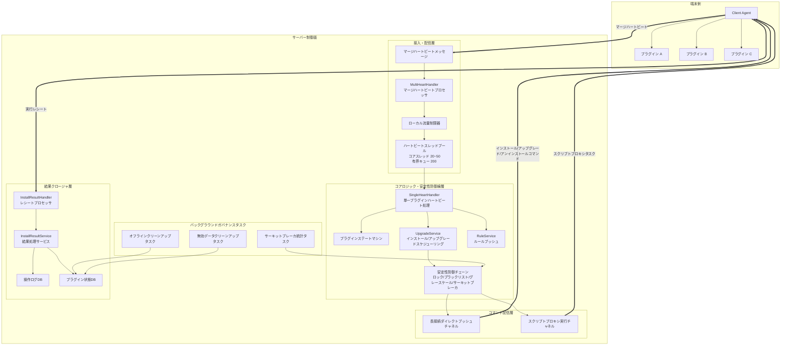

---

## 五、コアデータモデル設計

### 1. 端末テーブル

端末の基本情報を記録する。

| フィールド | 説明 |
| :--- | :--- |
| `uuid` | 端末一意識別子 |
| `ip` | 端末 IP |
| `hostname` | ホスト名 |
| `os_type` | OSタイプ |
| `os_version` | OSバージョン |
| `arch` | CPUアーキテクチャ |
| `env_type` | 環境タイプ（物理サーバー、仮想マシン、コンテナなど） |
| `last_heartbeat_time` | 最新ハートビート時刻 |
| `status` | 端末状態 |

### 2. プラグイン状態テーブル

ある端末のあるプラグインの稼働状態を記録する。

| フィールド | 説明 |
| :--- | :--- |
| `uuid` | 端末 UUID |
| `plugin_code` | プラグインコード |
| `plugin_version` | 現在バージョン |
| `target_version` | ターゲットバージョン |
| `status` | プラグイン状態 |
| `last_heartbeat_time` | 最新プラグインハートビート時刻 |
| `last_op_time` | 最新操作時刻 |
| `uninstall_flag` | アンインストールマーク |
| `fail_count` | 連続失敗回数 |
| `updated_at` | 更新時刻 |

### 3. 操作ログテーブル

インストール、アップグレード、アンインストール、ルールプッシュなどのアクションを記録する。

| フィールド | 説明 |
| :--- | :--- |
| `cmd_id` | コマンド ID |
| `uuid` | 端末 UUID |
| `plugin_code` | プラグインコード |
| `op_type` | 操作タイプ |
| `target_version` | ターゲットバージョン |
| `status` | 実行状態 |
| `error_code` | エラーコード |
| `error_msg` | エラーメッセージ |
| `created_at` | 作成時刻 |
| `finished_at` | 完了時刻 |

---

## 六、プラグインステートマシン設計

プラグインライフサイクルは単純な `Online/Offline` フィールドだけで表現すべきではない。そうしないと、その後のインストール、アップグレード、アンインストール、失敗リトライが混乱する。

明確なステートマシンの設計を推奨する。

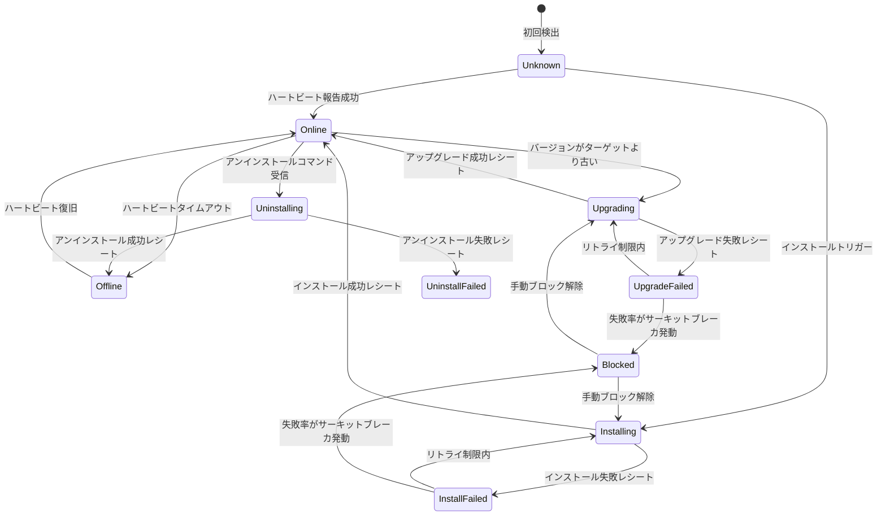

### 状態の説明

| 状態 | 意味 |
| :--- | :--- |
| `Unknown` | 初回検出、プラグインの実際の状態が未確認 |
| `Online` | プラグインがオンラインで正常にハートビート |
| `Offline` | タイムアウトでハートビートなし、論理オフライン |
| `Installing` | インストールコマンド配信済み、レシート待ち |
| `Upgrading` | アップグレードコマンド配信済み、レシート待ち |
| `Uninstalling` | アンインストールコマンド配信済み、レシート待ち |
| `InstallFailed` | インストール失敗 |
| `UpgradeFailed` | アップグレード失敗 |
| `UninstallFailed` | アンインストール失敗 |
| `Blocked` | サーキットブレーカまたは手動ブロック |

---

## 七、マージハートビート設計：パフォーマンスの第一の関門

### 1. なぜハートビートをマージするのか

ある端末に10個のプラグインがあり、各プラグインが個別にハートビートを報告する場合：

```text
100万端末 × 10プラグイン × 毎分1回 = 毎分1000万リクエスト
```

これは以下を著しく増加させる：

- ネットワーク IO
- サーバー接続圧力
- ゲートウェイ QPS
- データベース書き込み圧力
- ログ量
- スレッドコンテキストスイッチ

より合理的な方法は、端末エージェントが複数のプラグイン状態を集約し、一括で報告することである。

```json
{
  "uuid": "client-001",
  "ip": "10.1.2.3",
  "osType": "linux",
  "osVersion": "5.15.0",
  "envType": "host",
  "plugins": [
    {
      "pluginCode": "security-agent",
      "version": "1.2.0",
      "status": "running",
      "lastError": null
    },
    {
      "pluginCode": "log-agent",
      "version": "2.0.1",
      "status": "running",
      "lastError": null
    }
  ]
}
```

### 2. マージハートビート処理フロー

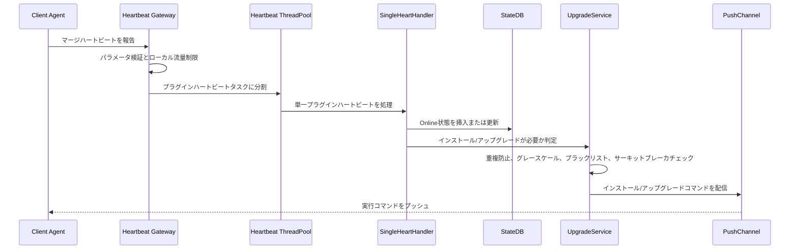

### 3. ハートビートスレッドプールの推奨

ハートビートは高頻度トラフィックであり、無限にスレッドを作成したり、無限にキューに蓄積したりしてはならない。

推奨：

| パラメータ | 推奨値 | 説明 |
| :--- | :--- | :--- |
| コアスレッド数 | 20~50 | CPUコア数、ビジネス処理時間、デプロイ規模に応じて調整 |
| 最大スレッド数 | 50~100 | 突発トラフィックによるノードダウンを防止 |
| キュー長 | 200~1000 | 有界が必須、メモリオーバーフローを防止 |
| 拒否ポリシー | 流量制限/破棄/デグレード | ハートビートは破棄可能、メインサービスをダウンさせない |
| タイムアウト時間 | 短いタイムアウト | 遅いタスクがスレッドプールを占拠するのを防止 |

疑似コード例：

```java
ThreadPoolExecutor heartbeatExecutor = new ThreadPoolExecutor(
    20,
    50,
    60,
    TimeUnit.SECONDS,
    new ArrayBlockingQueue<>(200),
    new ThreadPoolExecutor.DiscardPolicy()
);
```

ここで有界キューを使用することが重要である。ハートビートタスクが無限に蓄積されると、最終的にサービスノード全体をダウンさせる。

---

## 八、重複防止スケジューリング設計：重複インストールと並行コンフリクトの回避

実際のネットワーク環境では、端末は以下の理由でインストールが重複トリガーされる可能性がある：

- ハートビートの重複報告
- ネットワークリトライ
- サーバー側の重複消費
- 複数ノードが同一端末を並行処理
- レシート遅延による状態更新の遅れ
- ユーザーがアップグレードボタンを繰り返しクリック

したがって、インストール/アップグレードは冪等性と重複防止能力を持つ必要がある。

### 1. 重複防止キー設計

端末、プラグイン、操作タイプ、ターゲットバージョンを重複防止の次元とすることを推奨する。

```text
plugin:op:lock:{uuid}:{pluginCode}:{opType}:{targetVersion}
```

例：

```text
plugin:op:lock:client-001:security-agent:upgrade:1.3.0
```

### 2. 重複防止フロー

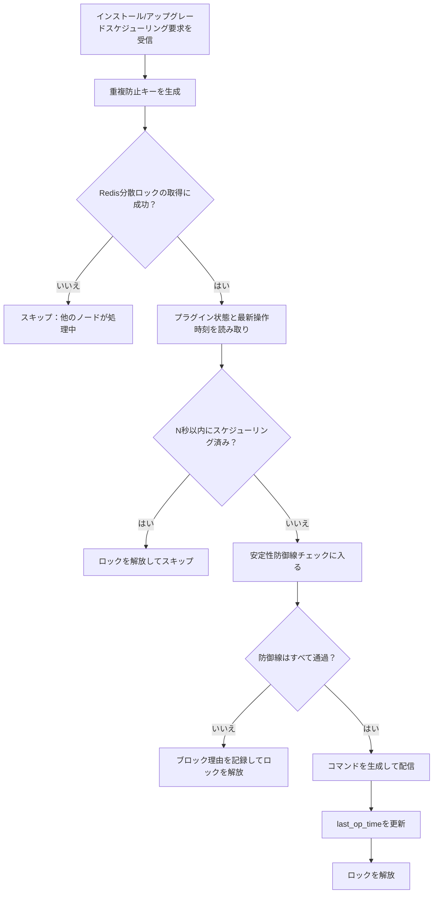

### 3. 二重防御

Redisロックのみに依存するのは不十分であり、二層の重複防止を推奨する：

1. Redis分散ロック：複数ノードの並行処理を防止。
2. データベースタイムスタンプ検証：ロック期限切れ、重複消費、異常リトライを防止。

疑似コード：

```java
String lockKey = buildLockKey(uuid, pluginCode, opType, targetVersion);

boolean locked = redis.tryLock(lockKey, 30, TimeUnit.SECONDS);
if (!locked) {
    return DispatchResult.skipped("duplicate operation");
}

try {
    PluginState state = pluginStateRepository.get(uuid, pluginCode);

    if (state.getLastOpTime() != null &&
        Duration.between(state.getLastOpTime(), now()).getSeconds() < 60) {
        return DispatchResult.skipped("operation too frequent");
    }

    DefenseResult defenseResult = defenseChain.check(context);
    if (!defenseResult.isAllowed()) {
        return DispatchResult.blocked(defenseResult.getReason());
    }

    pushCommand(context);
    pluginStateRepository.updateLastOpTime(uuid, pluginCode, now());

    return DispatchResult.success();
} finally {
    redis.unlock(lockKey);
}
```

---

## 九、安定性防御線設計

プラグイン配信は高リスクアクションである。すべての安定性チェックを防御チェーンとして抽象化することを推奨する。


### 1. 特殊環境フィルタリング

一部の端末環境は一部プラグインのインストールに適さない。例えば：

| 環境 | リスク |
| :--- | :--- |
| コンテナ環境 | 完全なsystemdがない、カーネルモジュール権限なし、ファイルシステムが制限 |
| root権限なし環境 | ドライバやシステムサービスのインストール不可 |
| 読み取り専用ファイルシステム | プラグインファイルの書き込み不可 |
| Serverless環境 | ライフサイクルが短く、常駐プラグインに不適 |
| セキュリティ強化環境 | スクリプト実行が遮断される可能性 |

プラグインホワイトリストの維持を推奨する。

```text
container_env_allowed_plugins = [
  "log-collector",
  "metrics-agent"
]
```

端末がコンテナ環境にある場合、ホワイトリスト外のプラグインはインストールとキープアライブロジックをスキップする。

### 2. OS非互換ブラックリスト

あるOSタイプが明らかにプラグインをサポートしない場合、毎回のハートビートでインストールを繰り返し試行すべきではない。

分散キャッシュブラックリストへの書き込みを推奨する。

```text
plugin:os:blacklist:{pluginCode}:{osType}:{osVersion}:{arch}
```

有効期限は7日以上に設定することを推奨する。

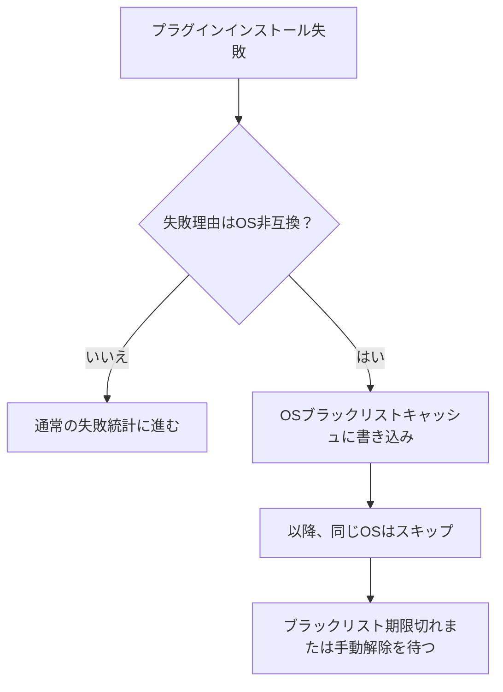

### 3. グレースケールリリース制御

グレースケールリリースはプラグインライフサイクル管理のコア能力である。

一般的なグレースケール次元には以下が含まれる：

| グレースケール次元 | 説明 |
| :--- | :--- |
| UUIDホワイトリスト | 指定端末を先行テスト |
| IPセグメント | ネットワークエリアごとのグレースケール |
| 地域 | データセンター、都市、エリアごとのグレースケール |
| 組織 | テナント、部門、ビジネスラインごとのグレースケール |
| パーセンテージ | ハッシュパーセンテージでリリース量を制御 |
| OSタイプ | 指定OSのみにリリース |
| プラグインバージョン | 指定バージョンからターゲットバージョンにアップグレード |

パーセンテージグレースケールでは安定ハッシュの使用を推奨し、同一端末の複数回の判定結果が一貫するようにする。

```java
int bucket = Math.abs(uuid.hashCode()) % 100;
boolean allowed = bucket < grayPercent;
```

### 4. カーネルレベルプラグイン高リスクグレースケール

カーネルレベルプラグイン、ドライバ系プラグイン、システムHook系プラグインは通常プラグインと区別して扱わなければならない。

通常プラグインの失敗は、機能が利用できなくなるだけかもしれない。

カーネルレベルプラグインの失敗は、以下を引き起こす可能性がある：

- システムクラッシュ
- ネットワーク断絶
- 起動不能
- 広範囲の端末通信断

したがって、カーネルレベルプラグインには個別のグレースケール戦略を追加すべきである。

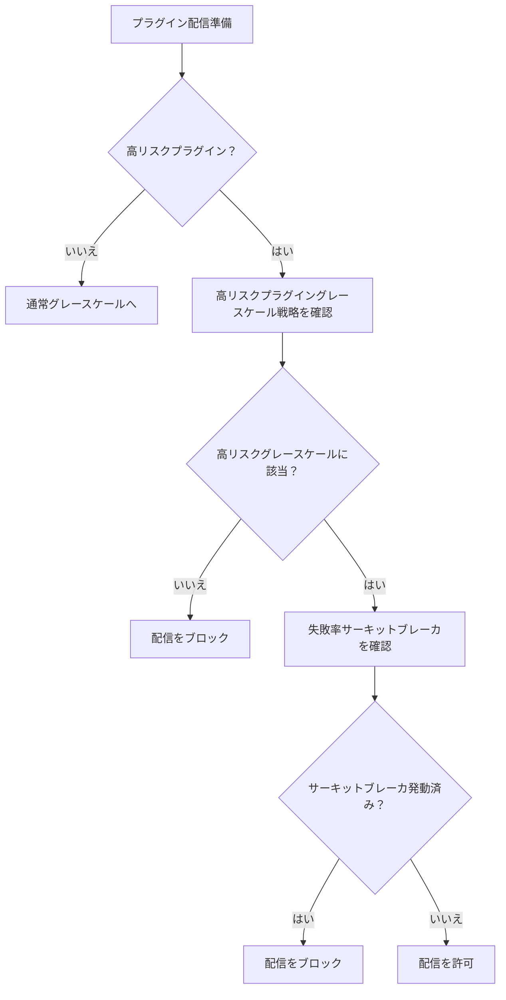

### 5. 自動サーキットブレーカ遮断

あるプラグインバージョンの短時間での失敗率が高すぎる場合、システムは後続の配信を自動的に停止しなければならない。

プラグイン、バージョン、操作タイプ、OS次元で失敗率を統計することを推奨する。

```text
plugin:breaker:{pluginCode}:{version}:{opType}:{osType}
```

サーキットブレーカルール例：

| 指標 | 閾値 |
| :--- | :--- |
| サンプル数 | 直近5分間のインストール数 >= 100 |
| 失敗率 | 失敗率 >= 20% |
| 連続失敗 | 連続失敗 >= 30 |
| 重大エラー | カーネルクラッシュ系エラーの検出で即時遮断 |

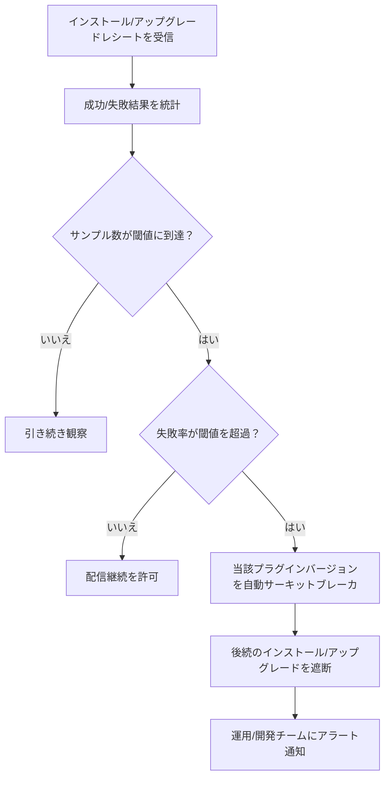

---

## 十、コマンド配信設計：デュアルチャネルプッシュ

異なるプラグインの実行方式は異なるため、デュアルチャネル配信を推奨する。

| チャネル | 適用シナリオ | 特徴 |
| :--- | :--- | :--- |
| 長接続ダイレクトプッシュ | 軽量コマンド、スクリプトプラグイン、ルール更新 | 低遅延、リアルタイムプッシュに適する |
| スクリプトプロキシ実行 | 重量級インストール、ハイブリッドクラウドプロキシ、複雑コマンド | 制御性が高く、複雑操作に適する |

### 1. 長接続ダイレクトプッシュ

適するケース：

- Pythonスクリプトプラグイン
- ルール更新
- 軽量リスタート
- 設定リフレッシュ
- 状態照会

長所：

- 低遅延
- リンクが短い
- リアルタイム性が良い

短所：

- 長接続の安定性に依存
- 複雑なインストールフローには不適

### 2. スクリプトプロキシ実行

適するケース：

- 大規模プラグインインストール
- マルチステップアップグレード
- ハイブリッドクラウド環境
- ファイルダウンロード、ハッシュ検証、スクリプト実行が必要なシナリオ

長所：

- 複雑フローをサポート
- 監査しやすい
- 実行環境を統一可能

短所：

- リンクが長い
- 遅延が高い
- 追加のプロキシ能力が必要

---

## 十一、レシートクロージャ設計

コマンド配信が終わりではなく、端末レシートを受信して初めて結果クロージャに入る。

### 1. レシートタイプ

| レシートタイプ | 説明 |
| :--- | :--- |
| インストール成功 | プラグインバージョンと状態を更新 |
| インストール失敗 | 失敗理由を記録、失敗統計に計上 |
| アップグレード成功 | 現在バージョンを更新 |
| アップグレード失敗 | 失敗理由を記録、サーキットブレーカ発動の可能性 |
| アンインストール成功 | 状態をOfflineまたはRemovedに |
| アンインストール失敗 | 失敗理由を記録、リトライまたは手動対応を待機 |
| ルールプッシュ成功 | ルールバージョンを更新 |
| ルールプッシュ失敗 | 失敗理由を記録、リトライを待機 |

### 2. レシート処理フロー

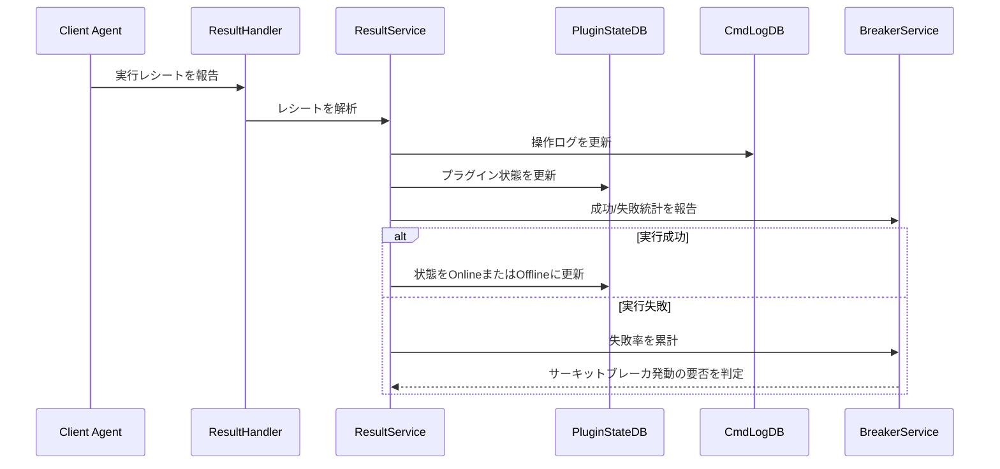

---

## 十二、オフラインクリーンアップ設計

端末プラグイン状態は無限に増大できないため、バックグラウンドタスクでガバナンスを行う必要がある。

二段階クリーンアップの採用を推奨する：

1. 論理オフライン：タイムアウトでハートビートがない場合、まず `Offline` としてマーク。
2. 物理削除：オフラインから保持期間を超過した後、無効レコードを削除。

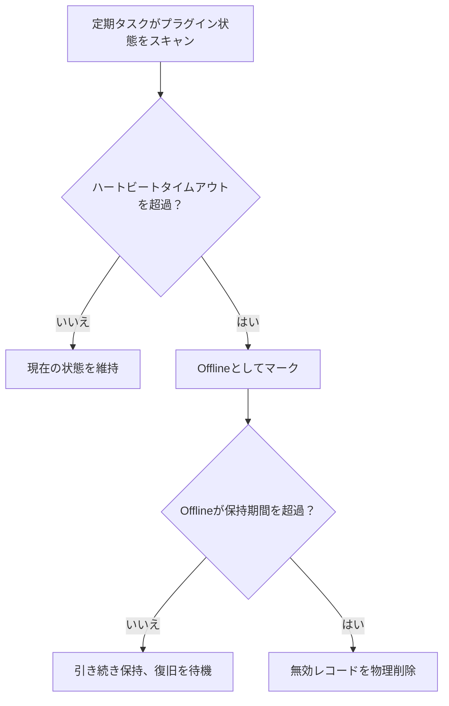

推奨設定：

| 項目 | 推奨値 |
| :--- | :--- |
| ハートビート周期 | 30秒 ~ 60秒 |
| オフライン判定 | 3ハートビート周期を超過 |
| 論理オフライン保持 | 7日間 |
| 物理削除周期 | 毎日閑散期に実行 |
| 削除方式 | バッチページング削除、大トランザクションを回避 |

---

## 十三、高同時実行とキャパシティ設計

### 1. QPS見積もり

前提：

- 端末数：100万
- 各端末のハートビート周期：60秒
- 各ハートビートで10プラグインの状態をマージ

ハートビートQPSは概ね：

```text
1,000,000 / 60 ≈ 16,667 QPS
```

マージハートビートを行わない場合：

```text
1,000,000 × 10 / 60 ≈ 166,667 QPS
```

マージハートビートによりリクエスト量を約10分の1に削減できる。

### 2. 書き込み圧力最適化

プラグイン状態更新は高頻度書き込み操作であり、毎回のハートビートでデータベースに全量書き込みすべきではない。

選択可能な最適化戦略：

| 戦略 | 説明 |
| :--- | :--- |
| Redisバッファ | ハートビートは先にキャッシュに書き込み、後にバッチでDBに永続化 |
| 状態変化時のみDB書き込み | 状態、バージョン、エラーコードが変化した時のみDB書き込み |
| 時間窓マージ | 同一プラグインはN秒内に1回だけDB更新 |
| シャーディング | UUIDハッシュでシャーディング |
| バッチ書き込み | バックグラウンドでバッチupsert |
| ホット/コールド分離 | オンライン状態はキャッシュ、履歴状態はDB |

### 3. 推奨リンク

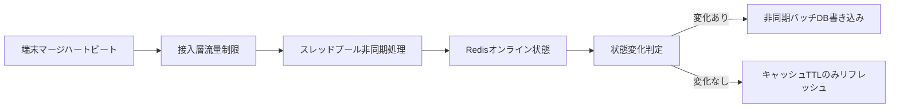

---

## 十四、ルールプッシュ設計

ルールプッシュはプラグインインストールとは異なる。

プラグインインストールは通常低頻度・高リスクのアクションだが、ルールプッシュは中頻度のアクションであり、これもビジネスの安定性に影響する可能性がある。

ルールプッシュには以下を備えることを推奨する：

- ルールバージョン番号
- ルールグレースケール
- ルールロールバック
- ルール署名検証
- ルール互換性検証
- ルールプッシュレシート
- ルール有効状態確認

ルールプッシュフロー：

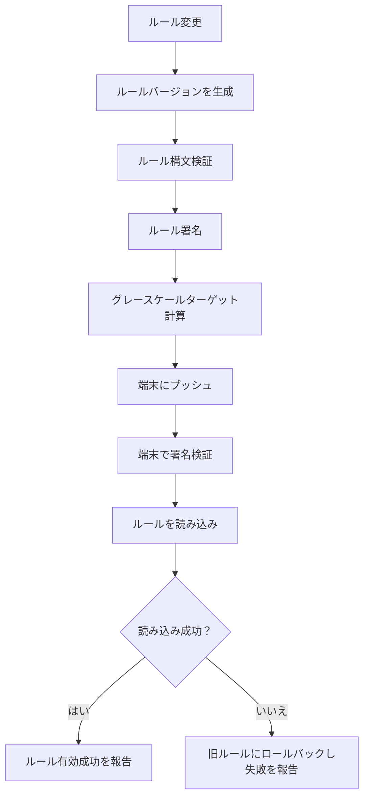

---

## 十五、異常シナリオと対応戦略

| 異常シナリオ | リスク | 対応戦略 |
| :--- | :--- | :--- |
| ハートビート急増 | サービスノードが飽和 | ローカル流量制限、有界キュー、破棄ポリシー |
| 重複ハートビート | 重複インストール/アップグレード | Redisロック + last_op_time |
| レシート紛失 | 状態不整合 | ハートビート補償 + 定期照合 |
| プラグインインストール失敗 | 機能利用不可 | 失敗リトライ + サーキットブレーカ |
| OS非互換 | 繰り返し失敗 | OSブラックリストキャッシュ |
| コンテナ環境未対応 | インストール異常 | 環境識別 + ホワイトリスト |
| グレースケール戦略エラー | 拡散範囲が過大 | パーセンテージ上限 + 手動承認 |
| カーネルプラグイン異常 | 端末ダウン | 高リスクグレースケール + 失敗率サーキットブレーカ |
| データベース書き込み過多 | DB圧力過大 | Redisバッファ + バッチDB永続化 |
| コマンド重複実行 | 端末状態混乱 | cmd_id冪等 + 操作ステートマシン |

---

## 十六、コアリンク疑似コード

### 1. マージハートビートエントリ

```java
public void handleMultiHeartbeat(MultiHeartbeatReq req) {
    if (!rateLimiter.tryAcquire()) {
        return;
    }

    validateClient(req);

    for (PluginHeartbeat plugin : req.getPlugins()) {
        HeartbeatTask task = new HeartbeatTask(req.getClientInfo(), plugin);

        try {
            heartbeatExecutor.execute(task);
        } catch (RejectedExecutionException ex) {
            log.warn("heartbeat task rejected, uuid={}, plugin={}",
                    req.getUuid(), plugin.getPluginCode());
        }
    }
}
```

### 2. 単一プラグインハートビート処理

```java
public void handleSingleHeartbeat(ClientInfo client, PluginHeartbeat plugin) {
    checkParam(client, plugin);

    if (checkUninstallMarked(client.getUuid(), plugin.getPluginCode())) {
        return;
    }

    pluginStateService.insertOrUpdateOnline(
        client.getUuid(),
        plugin.getPluginCode(),
        plugin.getVersion()
    );

    if (needUpgrade(client, plugin)) {
        upgradeService.dispatchUpgrade(client, plugin);
    }

    if (needPushRule(client, plugin)) {
        ruleService.pushRule(client, plugin);
    }
}
```

### 3. インストール/アップグレードスケジューリング

```java
public DispatchResult dispatchUpgrade(ClientInfo client, PluginHeartbeat plugin) {
    DispatchContext context = buildContext(client, plugin);

    String lockKey = buildLockKey(context);
    boolean locked = redisLock.tryLock(lockKey, 30, TimeUnit.SECONDS);

    if (!locked) {
        return DispatchResult.skipped("duplicate dispatch");
    }

    try {
        if (recentlyDispatched(context)) {
            return DispatchResult.skipped("dispatch too frequent");
        }

        DefenseResult defense = defenseChain.check(context);
        if (!defense.isAllowed()) {
            return DispatchResult.blocked(defense.getReason());
        }

        Command command = commandService.createInstallCommand(context);
        pushService.push(command);

        pluginStateService.updateLastOpTime(context);

        return DispatchResult.success();
    } finally {
        redisLock.unlock(lockKey);
    }
}
```

### 4. 安定性防御チェーン

```java
public DefenseResult check(DispatchContext context) {
    List<DefenseChecker> checkers = List.of(
        duplicateChecker,
        envWhiteListChecker,
        osBlackListChecker,
        grayReleaseChecker,
        kernelGrayChecker,
        autoBreakerChecker
    );

    for (DefenseChecker checker : checkers) {
        DefenseResult result = checker.check(context);
        if (!result.isAllowed()) {
            return result;
        }
    }

    return DefenseResult.allowed();
}
```

---

## 十七、オブザーバビリティ設計

大規模端末システムには完全なオブザーバビリティ能力が必須である。

### 1. コア指標

| 指標 | 説明 |
| :--- | :--- |
| ハートビート QPS | 接入層の圧力 |
| ハートビート拒否数 | 流量制限とキュー満杯の状況 |
| プラグインオンライン数 | プラグイン稼働規模 |
| プラグインオフライン数 | 異常傾向 |
| インストール成功率 | インストール品質 |
| アップグレード成功率 | アップグレード品質 |
| アンインストール成功率 | アンインストール品質 |
| コマンド配信遅延 | 制御面のリアルタイム性 |
| レシート遅延 | 端末実行所要時間 |
| サーキットブレーカ発動回数 | 安定性リスク |
| ブラックリストヒット数 | 互換性問題 |
| グレースケールヒット数 | リリース範囲 |

### 2. アラート推奨

| アラート項目 | 推奨ルール |
| :--- | :--- |
| ハートビート QPS 急増 | 5分間で100%以上の増加 |
| ハートビート拒否数過多 | 拒否率5%超過 |
| プラグイン失敗率過多 | 直近5分間の失敗率20%超過 |
| カーネルプラグイン失敗 | 重大エラー検出で即時アラート |
| レシート遅延過多 | P95が5分超過 |
| オフライン数急増 | 特定プラグインのオフライン数が急激に上昇 |
| サーキットブレーカ発動 | 任意のプラグインバージョンでサーキットブレーカ発動時に即時通知 |

---

## 十八、システム実装優先順位

ゼロから構築する場合、最初から完全なものを作るのではなく、優先順位に従って段階的に実装すべきである。

### 第1段階：コアクロージャ

まず実装必須：

1. マージハートビート
2. プラグイン状態テーブル
3. インストール/アップグレード/アンインストールコマンド
4. レシート処理
5. 基本ステートマシン
6. 操作ログ

目標：システムが完全なライフサイクルを通して動作すること。

### 第2段階：安定性防御線

早期に実装必須：

1. Redis分散ロック重複防止
2. last_op_timeタイムスタンプ重複防止
3. グレースケールリリース
4. OSブラックリスト
5. 自動サーキットブレーカ
6. 特殊環境フィルタリング

目標：誤ったコマンドによる大規模インシデントを防ぐこと。

### 第3段階：高同時実行最適化

継続的に強化：

1. ローカル流量制限
2. 有界スレッドプール
3. Redisオンライン状態キャッシュ
4. バッチDB永続化
5. シャーディング
6. 非同期キューによるピークカット

目標：百万/千万級端末規模をサポートすること。

### 第4段階：ガバナンスとオブザーバビリティ

最後に完成させる：

1. 指標モニタリング
2. アラート戦略
3. オフラインクリーンアップ
4. 失敗統計
5. グレースケールダッシュボード
6. プラグインバージョンダッシュボード
7. 手動ブロックと解除

目標：システムを運用可能、トラブルシューティング可能、持続的に進化可能にすること。

---

## 十九、完全リンクサマリー

最終的なシステムリンクは以下の通り：

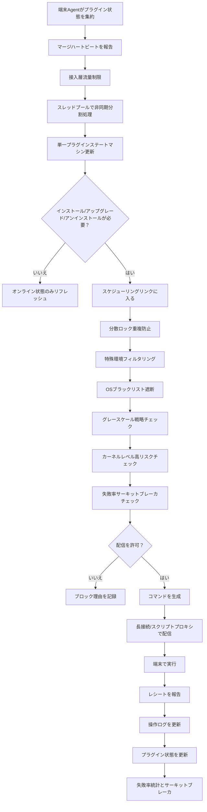

---

## 二十、まとめ

百万/千万級端末プラグインライフサイクル管理システムは、本質的に単純なタスク配信システムではなく、高同時実行、高信頼、強リスクコントロールの分散制御面システムである。

その主要な設計ポイントは以下の通り：

1. **マージハートビート**：リクエスト量を削減し、パフォーマンスの基盤となる。
2. **スレッドプールと流量制限**：サービスノードを保護し、突発トラフィックによるシステムダウンを防ぐ。
3. **ステートマシン**：プラグインライフサイクルを制御・追跡可能にする。
4. **重複防止スケジューリング**：ネットワーク揺らぎと並行処理による重複インストールを防止する。
5. **グレースケールリリース**：影響範囲を制御し、全量インシデントを防止する。
6. **カーネルレベル高リスク防御線**：高リスクプラグインにより厳格なリリース制約を適用する。
7. **自動サーキットブレーカ**：失敗率異常時に自動遮断し、カスケード障害を防止する。
8. **環境適応**：コンテナ、OS非互換、権限不足などの特殊環境を識別する。
9. **レシートクロージャ**：コマンド配信後に実行結果を追跡する。
10. **オフラインクリーンアップとオブザーバビリティ**：システムを長期安定稼働させる。

この種のシステムで最も重要なのは「配信できるか」ではなく：

> 誤ったプラグイン、異常環境、ネットワーク揺らぎ、トラフィック急増が発生した際、システムが自らを保護し、局所的な問題を全局的なインシデントに拡大させるのを防げるかどうか。

これこそが大規模端末制御システム設計における最も核心的なエンジニアリング価値である。
