# Enhanced UISA：ハイブリッドクラウドと異種ノード向け高信頼情報同期アーキテクチャ設計

## 概要

クラウドネイティブ、ハイブリッドクラウド、エッジコンピューティングが並行して発展する背景において、企業インフラにおけるノードタイプはますます複雑化している：クラウド上の ECS、IDC 物理サーバー、エッジゲートウェイ、コンテナホスト、プライベートクラウドノードが同時に存在することが常態化している。これらの異種ノードが資産情報、状態テレメトリ、設定指令、タスク結果を安定かつ低コストで監査可能に同期する方法は、インフラプラットフォームが解決すべき中核課題である。

従来の同期ソリューションにおける一般的な問題：

* ノードの身元が静的クレデンシャルに依存し、偽造と漏洩のリスクがある；
* 同期リンクに冪等性とバージョン管理が欠如し、重複書き込みやデータ上書きが発生しやすい；
* ノードオフライン後にタスクが消失し、復旧後の状態が追跡不可能；
* 大規模なハートビートと資産レポートがデータベースに負荷をかけ、システムのピークカット能力が不足；
* 監査ログが欠落し、障害発生後に遡及困難。

本稿では、拡張型汎用情報同期アーキテクチャ **Enhanced UISA（Enhanced Universal Information Sync Architecture）** を提案する。「身元の信頼性、リンクの安全性、タスクの復旧可能性、データの結果整合性、変更の監査可能性」を中核原則とし、クラウド仮想マシンの資産同期、物理サーバーの巡回検査、エッジデバイス管理、設定配信、状態テレメトリなど、多様なインフラシナリオに適用する。

---

## 1. 設計目標

Enhanced UISA は単一の業務システムではなく、多様なノード同期シナリオに再利用可能なアーキテクチャ基盤である。

| 目標  | 説明                    | 主要設計                        |
| :-- | :-------------------- | :-------------------------- |
| 高信頼 | ノードオフライン、ゲートウェイ異常、ネットワークジッター時にタスクを消失させない  | オフラインキュー、タスク状態マシン、リトライ機構             |
| 高セキュリティ | ノード偽造、Token 漏洩、データ改ざんを防止  | 双方向認証、短期トークン、Payload Hash、署名検証 |
| 高性能 | 大量ノードのハートビートと差分同期をサポート         | MQ ピークカット、バッチ消費、Hash 高速比較        |
| 拡張性 | ECS、物理サーバー、エッジノードなど異なる収集元をサポート | Agent プラグイン化、プロトコル変換、資産タイプ抽象       |
| 一貫性 | 並行上書き、重複書き込み、ダーティデータの流入を防止     | 冪等 Task ID、楽観ロック、バージョン番号          |
| 監査性 | すべての重要な変更を追跡・再生可能         | 監査ログ、スナップショット、変更 Diff             |

---

## 2. 全体アーキテクチャ

Enhanced UISA は責務に応じて4層に分割する：エッジ層、接入層、コア層、データ層。各層は自身の中核責務にのみ注力し、明確なプロトコルとイベントストリームで疎結合する。

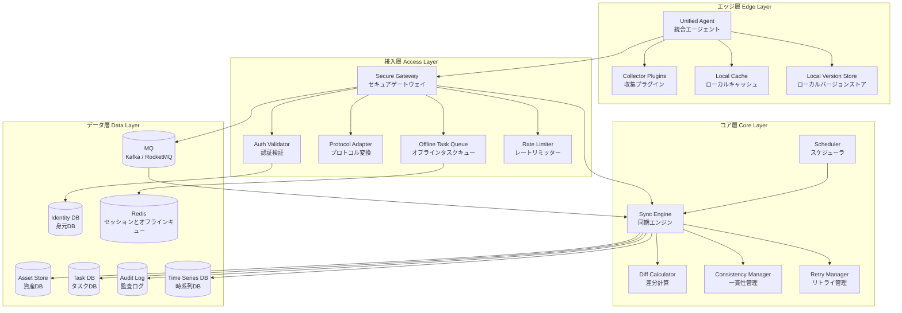

### 2.1 層別責務説明

| 層  | 中核コンポーネント                              | 主な責務                   | 設計重点            |
| :-- | :-------------------------------- | :--------------------- | :-------------- |
| エッジ層 | Unified Agent                     | 身元保持、データ収集、タスク実行、ローカルキャッシュ    | プラグイン化、再開再送、ローカルバージョン管理 |
| 接入層 | Secure Gateway                    | 認証、プロトコル変換、レート制限、タスク転送、オフラインキャッシュ   | セキュアエントリ、ピークカット、接続ガバナンス    |
| コア層 | Sync Engine                       | スケジューリング、Diff 計算、状態マシン推進、一貫性制御 | 冪等、リトライ、トランザクション制御      |
| データ層 | Asset Store / Task DB / Audit Log | 状態保存、資産スナップショット、タスク記録、監査遡及    | マルチテナント分離、バージョン遡及、ホット/コールド分離 |

---

## 3. 中核設計原則

### 3.1 単一入力を信用しない

Agent が報告するデータは、Token 検証、署名検証、タイムスタンプ検証、Payload Hash 検証を経てからでなければコア処理パイプラインに入らない。

これにより以下のリスクを防止する：

* 不正ノードが UUID を偽造してデータを報告；
* 中間者が資産内容を改ざん；
* 古いリクエストが再送されリプレイ攻撃を形成；
* Token 漏洩後の長期有効性。

### 3.2 タスクは先に永続化、後に実行

同期タスクはメモリ上にのみ存在すべきではない。ノードに配信する必要のあるタスクは、まず `task_id` を生成してタスクDBに書き込み、その後ゲートウェイまたはスケジューラが実行を推進する。

これにより以下を保証する：

* ゲートウェイ再起動後もタスクが消失しない；
* ノードオフライン後もタスクが復旧可能；
* 実行結果が監査可能；
* リトライ回数と失敗原因が追跡可能。

### 3.3 差分優先、全量は最小限

資産同期はバージョン番号と Hash による高速判定を優先し、必要な場合のみ Diff データを転送する。

全量同期は以下の場合にのみ使用すべきである：

* ノードの初回接入；
* Hash 検証失敗；
* 差分リトライの複数回失敗；
* バージョンチェーンの断絶；
* 管理者による手動修復トリガー。

### 3.4 結果整合性、強同期ブロックではなく

大量ノードシナリオでは、全ノードの状態を常に強一貫に保つことは不可能である。システムは「観測可能、復旧可能、収束可能」な結果整合性を追求すべきである。

中核アプローチ：

* 書き込みパスの冪等性；
* 状態マシンの再生可能性；
* 競合の検出可能性；
* 失敗のリトライ可能性；
* 結果の監査可能性。

---

## 4. 身元とセキュリティモデル

Enhanced UISA は「二重身元 + 短期トークン + 署名検証」のセキュリティモデルを採用する。

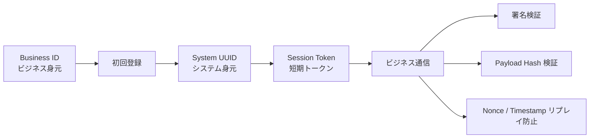

### 4.1 二重身元識別

| 身元タイプ        | 使用段階     | 長期使用の可否 | 説明                         |
| :---------- | :------- | :----- | :------------------------- |
| Business ID | 初回登録     | 否      | マシンコード、クラウドインスタンス ID、ユーザービジネス ID、事前設定クレデンシャルに由来 |
| System UUID | 登録後の全ライフサイクル | 是      | システム生成のグローバル一意身元、以降の全通信で使用      |

Business ID は「あなたが誰であるか」を証明するのみであり、System UUID こそがシステム内部で実際に使用されるノード身元である。

### 4.2 通信セキュリティスタック

| 段階       | セキュリティ機構              | 目的        |
| :------- | :---------------- | :-------- |
| 登録段階     | PSK / 非対称署名       | 偽造登録の防止    |
| Token 発行 | 短期 Session Token  | クレデンシャル漏洩リスクの低減  |
| 通常リクエスト     | Bearer Token + 署名 | リクエスト送信元の検証    |
| 重要ペイロード     | Payload Hash      | 内容改ざんの防止    |
| リプレイ防止      | Nonce + Timestamp | 古いリクエストの再送防止 |

### 4.3 推奨リクエストヘッダー

```http
Authorization: Bearer <session_token>
X-Node-UUID: <system_uuid>
X-Timestamp: 1711324800000
X-Nonce: 8f5a2b1c9d
X-Payload-Hash: sha256:<hash>
X-Signature: <signature>
```

---

## 5. セキュア登録フロー

登録フローの目標は、信頼できる身元を確立し、ビジネス身元をシステム身元にバインドすることである。

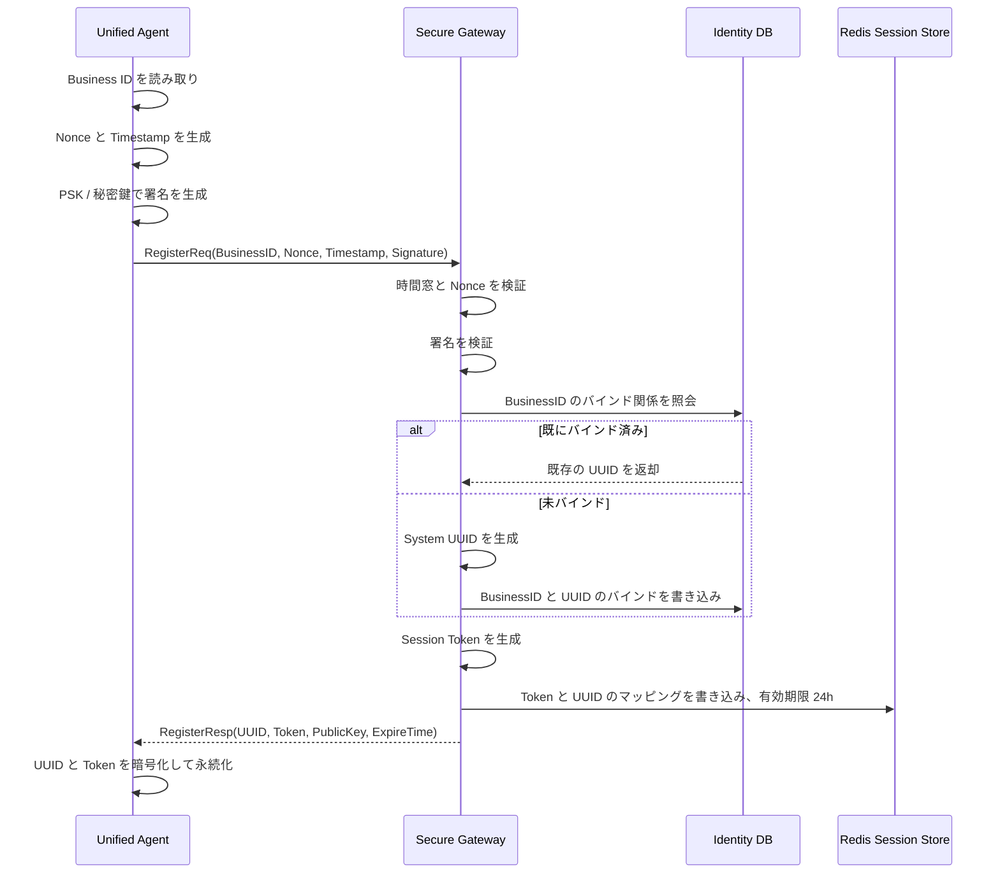

### 5.1 登録インターフェース案

```json
{
  "businessId": "ecs-i-xxxxxx",
  "nonce": "8f5a2b1c9d",
  "timestamp": 1711324800000,
  "signature": "base64-signature",
  "agentVersion": "1.3.0",
  "capabilities": ["asset", "heartbeat", "command"]
}
```

### 5.2 登録結果案

```json
{
  "uuid": "node-9d2e4b62-8f1a-4c92-a941-xxxxxx",
  "token": "eyJhbGciOi...",
  "expireAt": "2026-03-26T00:00:00Z",
  "serverPublicKey": "-----BEGIN PUBLIC KEY-----...",
  "heartbeatIntervalSeconds": 30
}
```

---

## 6. ハートビートと状態テレメトリ設計

ハートビートは単なる「オンライン検出」ではなく、システム全体のスケジューリング、オフライン復旧、タスクウェイクアップ、ヘルス評価のエントリポイントである。

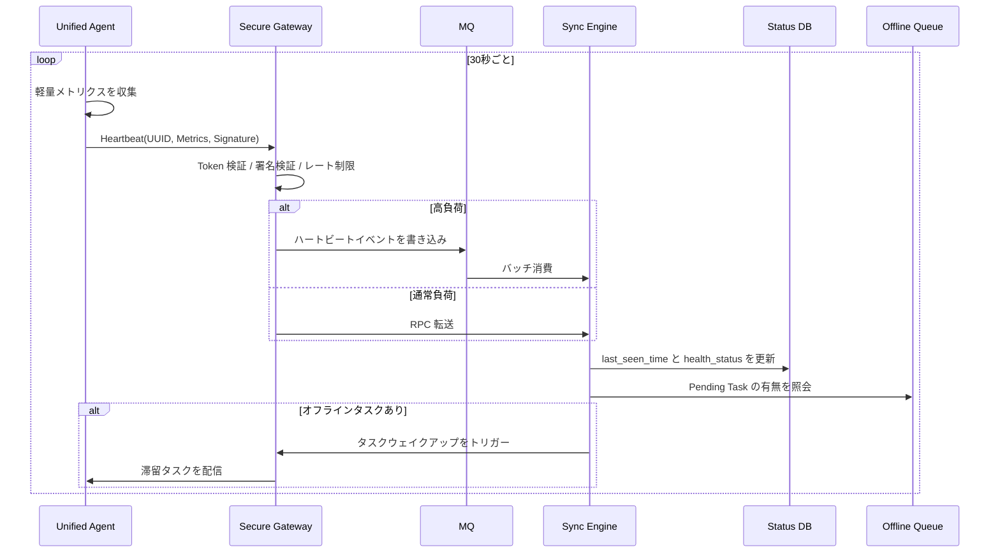

### 6.1 ハートビートデータ案

| フィールド               | タイプ     | 説明         |
| :--------------- | :----- | :--------- |
| uuid             | string | ノードシステム身元     |
| timestamp        | long   | Agent ローカル時刻 |
| cpu_usage        | double | CPU 使用率    |
| memory_usage     | double | メモリ使用率      |
| disk_usage       | double | ディスク使用率      |
| agent_version    | string | Agent バージョン   |
| network_status   | string | ネットワーク状態       |
| running_task_ids | array  | 現在実行中のタスク   |

### 6.2 オンライン状態判定

| 状態       | 判定条件            | システムアクション      |
| :------- | :-------------- | :-------- |
| Online   | 直近1ハートビート周期内に正常報告 | 通常スケジューリング    |
| Unstable | 2周期連続異常または遅延   | 配信頻度を低下    |
| Offline  | 3周期以上未報告     | タスクをオフラインキューに移行  |
| Disabled | 管理者による無効化またはセキュリティリスク      | タスクとデータ書き込みを拒否 |

---

## 7. 資産差分同期フロー

資産同期は UISA の中核機能である。「バージョン番号 + Hash + Diff + 楽観ロック」により、低コストかつ復旧可能な一貫性同期を実現する。

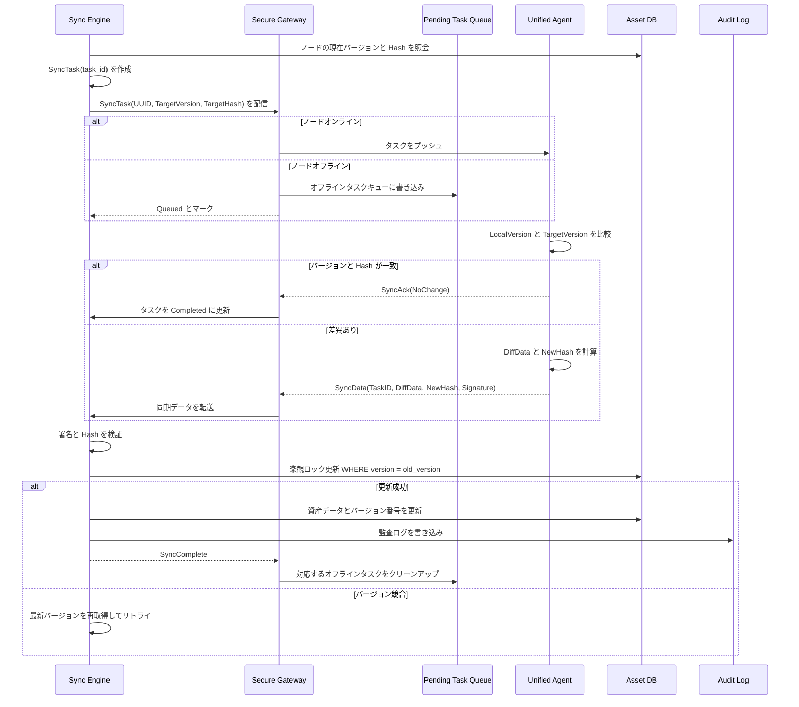

### 7.1 資産同期戦略比較

| 戦略         | 適用シナリオ              | メリット      | デメリット       |
| :--------- | :---------------- | :------ | :------- |
| 全量同期       | 初回接入、災害復旧、Hash エラー | シンプルで信頼性高い    | 転送コスト高    |
| 差分同期       | 通常の資産変更            | 転送量少、高速 | バージョン管理が必要   |
| Hash 高速比較  | 大フィールド、リスト型資産         | 判定高速、低コスト | 具体的な変更内容を表現不可 |
| Diff Patch | 設定、ソフトウェアパッケージ、ディスクリスト       | 精密同期    | 実装が複雑     |

### 7.2 Diff 計算案

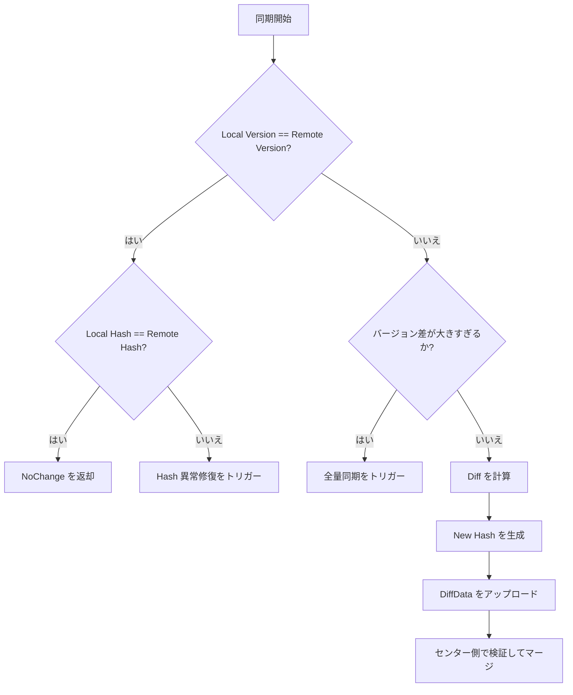

### 7.3 資産ユニークキー設計

資産データには安定したユニークキーが必須である。さもなくば UPSERT が重複挿入になる。

| 資産タイプ      | asset_key 推奨値         | 例                |
| :-------- | :-------------------- | :---------------- |
| CPU       | cpu_index または socket_id | cpu-0             |
| Disk      | ディスクシリアル番号 / デバイスパス          | /dev/sda          |
| NIC       | MAC アドレス                | 00:16:3e:xx:xx:xx |
| Software  | パッケージ名 + アーキテクチャ               | nginx:x86_64      |
| Process   | pid + start_time      | 1123:1711324800   |
| Container | container_id          | 1f2a3b4c          |

---

## 8. オフラインタスクキュー設計

オフラインノードはインフラ管理における常態であり、異常ではない。UISA はオフラインをタスクライフサイクルの一部として扱う。

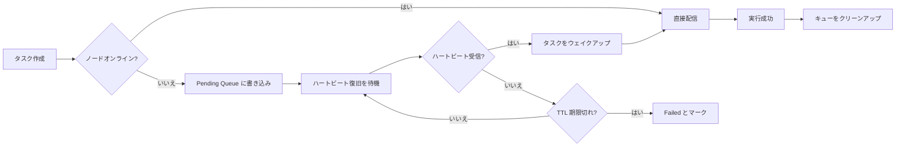

### 8.1 キュー構造案

Redis では以下の構造を使用可能：

```text
pending_task:{uuid} -> List<TaskID>
task_detail:{task_id} -> TaskPayload
task_lock:{task_id} -> distributed lock
task_retry:{task_id} -> retry count
task_deadline:{task_id} -> expire timestamp
```

### 8.2 オフラインタスク戦略

| 戦略     | 提案                              |
| :----- | :------------------------------ |
| TTL    | デフォルト7日、重要タスクは延長可能                  |
| 最大滞留数  | 単ノード1000件制限、超過時は同種タスクをマージ          |
| 同種タスクマージ | 複数の資産同期タスクは最新1件のみ保持                 |
| ウェイクアップ方式   | ハートビート返却時に Pending Task サマリーを含め、Agent が能動的に取得 |
| 実行順序   | 設定変更優先、資産収集次、通常巡回検査最後            |

---

## 9. タスク状態マシン

タスク状態マシンは、システムの復旧可能性、追跡可能性、監査可能性を保証する鍵である。

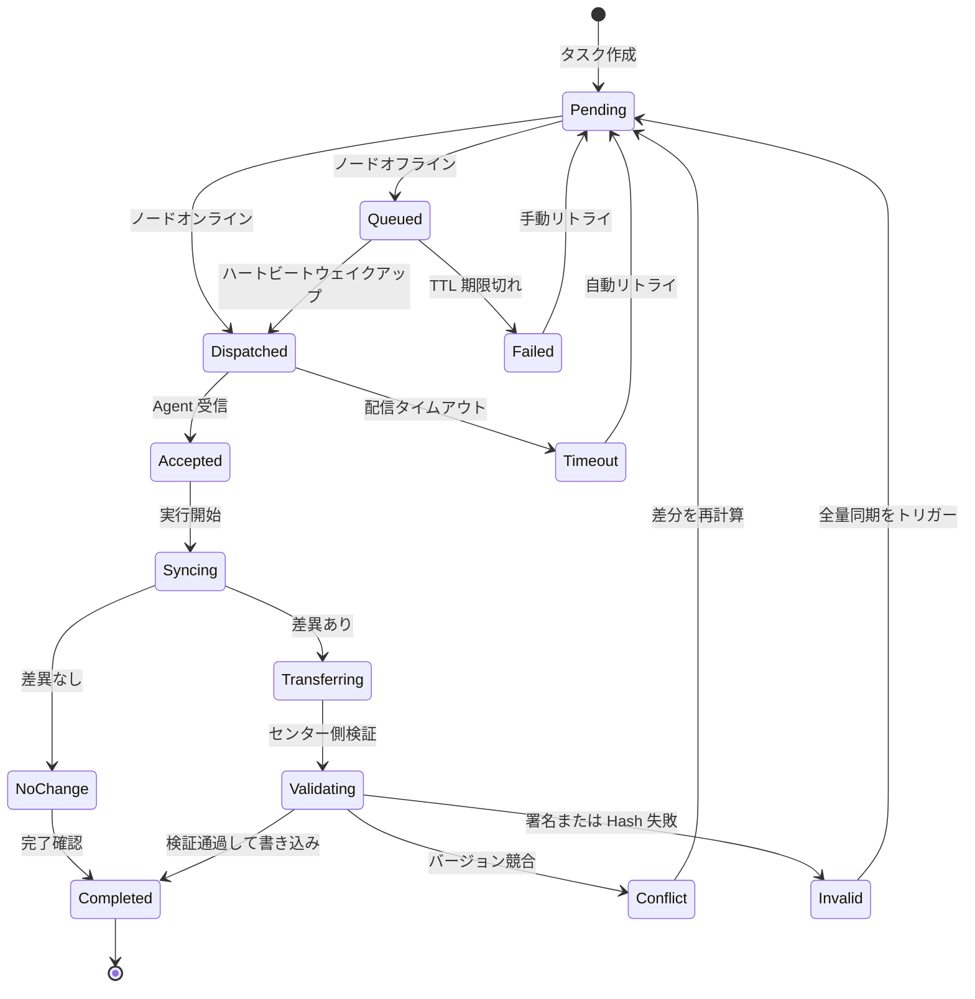

### 9.1 状態フィールド案

| フィールド          | 説明                              |
| :---------- | :------------------------------ |
| task_id     | グローバル一意タスク ID                       |
| uuid        | 対象ノード                            |
| task_type   | タスクタイプ、例：ASSET_SYNC / CONFIG_PUSH |
| status      | 現在の状態                            |
| retry_count | リトライ済み回数                           |
| max_retry   | 最大リトライ回数                          |
| last_error  | 直近の失敗原因                        |
| created_at  | 作成時刻                            |
| updated_at  | 更新時刻                            |
| expire_at   | 有効期限                            |

---

## 10. データ一貫性保障

Enhanced UISA の一貫性目標は、単一リクエストの強一貫性ではなく、多層保護による結果整合性である。

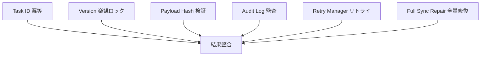

### 10.1 冪等制御

各タスクはグローバル一意の `task_id` を必ず携行する。センター側は処理前に当該タスクが既に処理済みかを確認する。

```sql
SELECT status FROM sync_task WHERE task_id = ?;
```

タスクが既に `Completed` の場合、重複リクエストは成功を返却し、資産テーブルに再度書き込まない。

### 10.2 楽観ロック制御

資産更新にはバージョン条件が必須である。

```sql
UPDATE asset_info
SET content = ?,
    version = version + 1,
    content_hash = ?,
    update_time = NOW()
WHERE uuid = ?
  AND asset_type = ?
  AND asset_key = ?
  AND version = ?;
```

影響行数が0の場合、並行競合が発生しており、最新バージョンを再取得して Diff を再計算する必要がある。

### 10.3 監査ログ

各変更は監査ログに書き込み、変更前、変更後、差分詳細を保持する。

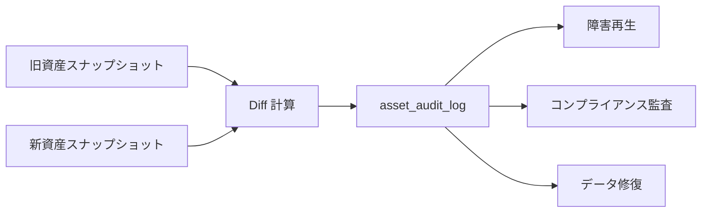

---

## 11. 中核データモデル

### 11.1 ノード身元テーブル：node_identity

| フィールド             | タイプ           | 説明                          |
| :------------- | :----------- | :-------------------------- |
| uuid           | varchar(64)  | システム一意身元、主キー                   |
| business_id    | varchar(128) | ビジネス身元                        |
| public_key     | text         | ノード公開鍵                        |
| status         | varchar(32)  | ONLINE / OFFLINE / DISABLED |
| last_seen_time | datetime     | 直近ハートビート時刻                      |
| agent_version  | varchar(64)  | Agent バージョン                    |
| created_at     | datetime     | 作成時刻                        |
| updated_at     | datetime     | 更新時刻                        |

### 11.2 資産情報テーブル：asset_info

| フィールド           | タイプ           | 説明      |
| :----------- | :----------- | :------ |
| id           | bigint       | 主キー      |
| uuid         | varchar(64)  | ノード UUID |
| asset_type   | varchar(64)  | 資産タイプ    |
| asset_key    | varchar(128) | 資産内部ユニークキー |
| content      | json         | 資産内容    |
| version      | bigint       | バージョン番号     |
| content_hash | varchar(128) | 内容 Hash |
| update_time  | datetime     | 更新時刻    |

推奨ユニークインデックス：

```sql
UNIQUE KEY uk_asset_node_type_key (uuid, asset_type, asset_key)
```

### 11.3 同期タスクテーブル：sync_task

| フィールド          | タイプ          | 説明       |
| :---------- | :---------- | :------- |
| task_id     | varchar(64) | タスク ID、主キー |
| uuid        | varchar(64) | 対象ノード     |
| task_type   | varchar(64) | タスクタイプ     |
| status      | varchar(32) | タスク状態     |
| payload     | json        | タスク内容     |
| retry_count | int         | リトライ回数     |
| max_retry   | int         | 最大リトライ回数   |
| last_error  | text        | 失敗原因     |
| expire_at   | datetime    | 有効期限     |
| created_at  | datetime    | 作成時刻     |
| updated_at  | datetime    | 更新時刻     |

### 11.4 監査ログテーブル：asset_audit_log

| フィールド              | タイプ           | 説明                       |
| :-------------- | :----------- | :----------------------- |
| log_id          | bigint       | 主キー                       |
| task_id         | varchar(64)  | 関連タスク                     |
| uuid            | varchar(64)  | ノード UUID                  |
| action          | varchar(32)  | CREATE / UPDATE / DELETE |
| asset_type      | varchar(64)  | 資産タイプ                     |
| asset_key       | varchar(128) | 資産キー                      |
| before_snapshot | json         | 変更前スナップショット                    |
| after_snapshot  | json         | 変更後スナップショット                    |
| diff_detail     | json         | 変更差分                     |
| operator        | varchar(64)  | 操作者                      |
| created_at      | datetime     | 作成時刻                     |

---

## 12. 異常処理と災害耐性戦略

| 異常シナリオ      | 検出方式             | 処理戦略                | 復旧方式                |
| :-------- | :--------------- | :------------------ | :------------------ |
| ネットワーク中断      | ハートビートタイムアウト、RPC 失敗      | Offline とマーク、タスクをオフラインキューに移行 | ハートビート復旧後に再配信           |
| Agent クラッシュ  | ハートビート消失             | タスクスケジューリングを一時停止              | Agent 再起動後に未完了タスクを能動的に取得  |
| ゲートウェイダウン      | ヘルスチェック失敗           | LB がバックアップゲートウェイに切り替え           | Token とキュー状態を Redis に配置  |
| MQ 蓄積     | 消費遅延監視           | コンシューマー拡張、非コアテレメトリのデグレード       | バッチ消費で追いつく              |
| Hash 検証失敗 | Payload Hash 不一致 | データを破棄、セキュリティログに記録         | 強制全量同期              |
| 楽観ロック競合     | UPDATE 影響行数が 0   | バージョンを再取得、Diff を再計算    | 自動リトライ                |
| データベース障害     | 書き込み失敗、接続異常        | タスクを Pending のまま保持        | DB 復旧後にリトライ            |
| Token 期限切れ  | 認証失敗             | Agent に Token 更新を要求   | 再登録または Refresh Token |

---

## 13. オブザーバビリティ設計

オブザーバビリティのない同期システムは、データ不整合が発生しても根本原因の特定が困難である。UISA はメトリクス、ログ、トレーシング、監査の4方向から観測能力を構築すべきである。

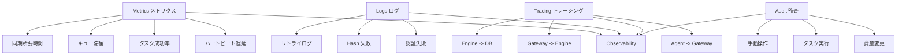

### 13.1 中核メトリクス

| メトリクス                             | 説明          | アラート提案           |
| :----------------------------- | :---------- | :------------- |
| heartbeat_delay_seconds        | ハートビート遅延        | P95 が 60s 超過でアラート  |
| node_offline_count             | オフラインノード数       | 急増でアラート           |
| sync_task_success_rate         | 同期タスク成功率     | 99% 未満でアラート      |
| pending_task_count             | 滞留タスク数       | 継続増加でアラート         |
| sync_duration_seconds          | 同期所要時間        | P95 / P99 異常でアラート |
| hash_validation_failed_total   | Hash 検証失敗回数 | 急増でアラート         |
| optimistic_lock_conflict_total | 楽観ロック競合回数     | 継続増加でアラート         |

---

## 14. パフォーマンス最適化提案

### 14.1 ハートビートリンクのピークカット

高頻度ハートビートを直接データベースに書き込まないこと。推奨パス：

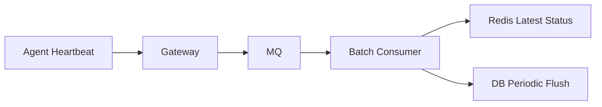

最適化提案：

* 最新オンライン状態は Redis に書き込み；
* データベースは周期的にのみフラッシュ；
* テレメトリメトリクスは時系列DBに投入；
* ハートビートイベントはバッチ消費；
* オフライン検出は定期タスクで Redis / DB をスキャン。

### 14.2 資産データのホット/コールド分離

| データタイプ   | ストレージ提案                                    |
| :----- | :-------------------------------------- |
| 現在資産状態 | MySQL / PostgreSQL                      |
| 履歴変更監査 | オブジェクトストレージ + インデックステーブル                              |
| 高頻度テレメトリメトリクス | Prometheus / VictoriaMetrics / InfluxDB |
| オフラインタスクキュー | Redis / MQ                              |
| 大規模資産スナップショット | オブジェクトストレージ                                    |

### 14.3 タスクマージ戦略

同一ノードで短時間に複数の資産同期タスクが発生した場合、マージ可能である。

| タスクタイプ         | マージルール           |
| :----------- | :------------- |
| ASSET_SYNC   | 最新1件のみ保持        |
| CONFIG_PUSH  | 安易にマージ不可、バージョン順に実行必須 |
| COMMAND_EXEC | 通常マージ不可         |
| HEARTBEAT    | 最新状態のみ保持        |
| TELEMETRY    | バッチ圧縮書き込み可能        |

---

## 15. エンジニアリング実装提案

### 15.1 推奨技術選定

| モジュール      | 推奨技術                                |
| :------ | :---------------------------------- |
| Agent   | Go / Rust / Java                    |
| Gateway | Spring Boot / Go Gateway / Envoy 拡張 |
| MQ      | Kafka / RocketMQ                    |
| キャッシュ      | Redis Cluster                       |
| 資産DB     | MySQL / PostgreSQL                  |
| 時系列データ    | Prometheus / VictoriaMetrics        |
| トレーシング    | OpenTelemetry                       |
| 設定センター    | Nacos / Apollo / Consul             |
| デプロイ      | Kubernetes / systemd / Ansible      |

### 15.2 推奨デプロイトポロジー

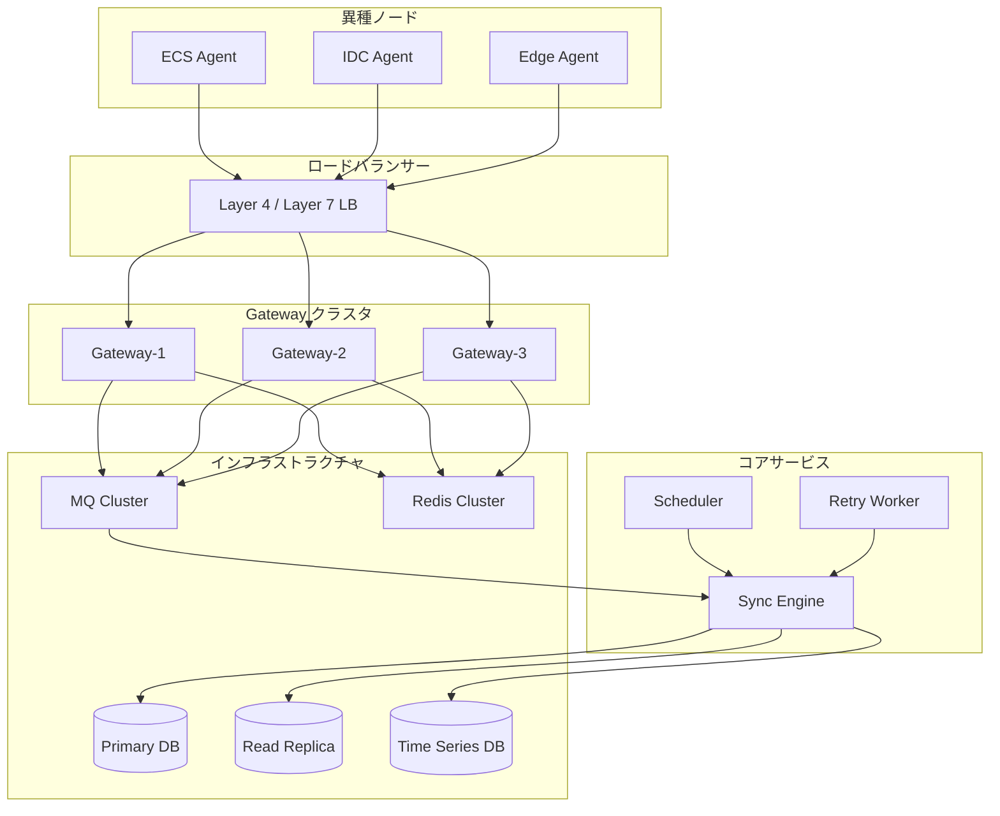

### 15.2 段階的構築ロードマップ

| フェーズ      | 構築重点               | 目標     |
| :------ | :----------------- | :----- |
| Phase 1 | Agent 登録、ハートビート、資産全量報告 | 最小クローズドループの完了 |
| Phase 2 | 差分同期、バージョン番号、Hash 検証   | 同期コストの低減 |
| Phase 3 | オフラインキュー、タスク状態マシン、リトライ      | 信頼性の向上  |
| Phase 4 | 監査ログ、オブザーバビリティ、アラート       | 本番障害対応の支援 |
| Phase 5 | マルチテナント、権限、セキュリティ強化        | エンタープライズ級実装  |
| Phase 6 | カナリアリリース、プラグインマーケット、クロスリージョン同期    | プラットフォーム化拡張  |

---

## 16. よくある設計の落とし穴

### 16.1 マシンコードを長期主キーとして使用

マシンコード、インスタンス ID、ホスト名はいずれも変化する可能性があり、システムの長期主キーとして不適切である。正しいアプローチは、初回登録時に System UUID を生成し、以降の全内部ロジックで UUID を使用することである。

### 16.2 ハートビートの直接データベース書き込み

大量ノードが30秒ごとにデータベースに書き込むと、高頻度の書き込み圧力が発生する。MQ、Redis、バッチフラッシュ、時系列DBによる段階的処理を行うべきである。

### 16.3 タスク状態マシンの欠落

タスクが success / failed の2状態しかない場合、オフライン、リトライ、競合、タイムアウトを表現できない。タスク状態マシンが明確であるほど、システムは復旧しやすい。

### 16.4 冪等設計の欠落

ネットワークリトライにより同一リクエストが複数回送信される。Task ID 冪等制御がなければ、重複書き込みやバージョン混乱が発生する可能性がある。

### 16.5 バージョン番号のみで Hash なし

バージョン番号は変更の有無を判定できるが、内容の完全性は保証できない。Hash はデータ破損、転送異常、異常上書きの検出を補助する。

---

## 17. まとめ

Enhanced UISA の中核思想は一言で要約できる：

> 異種ノード同期問題を、「単純なデータ報告」から「信頼できる身元、信頼できるタスク、差分データ、結果整合、全リンク監査可能」なインフラ能力へと昇華させる。

4層アーキテクチャで責務の疎結合を実現し、二重身元と署名機構でセキュリティを保障し、バージョン番号と Hash で同期コストを低減し、オフラインキューとタスク状態マシンでネットワーク不安定問題を解決し、冪等性と楽観ロックで一貫性を保障し、監査ログとオブザーバビリティで本番障害対応を支える。

大量の ECS、IDC 物理サーバー、エッジノード、またはハイブリッドクラウド資産を管理する必要のあるプラットフォームにとって、Enhanced UISA は安定した汎用同期基盤として機能する。資産情報同期に限らず、設定配信、コマンド実行、巡回検査タスク、パッチ管理、コンプライアンス収集など、さらに多くのシナリオへ拡張可能である。

---

## 付録：中核能力チェックリスト

| チェック項目          | 必須か否か | 説明              |
| :----------- | :--: | :-------------- |
| System UUID  |   是  | ビジネス身元の変化によるシステム混乱を回避  |
| 短期 Token     |   是  | クレデンシャル漏洩リスクの低減        |
| リクエスト署名         |   是  | 偽造リクエストの防止          |
| Payload Hash |   是  | データ改ざんと破損の防止       |
| Task ID 冪等   |   是  | 重複書き込みの防止          |
| 楽観ロック          |   是  | 並行上書きの防止          |
| オフラインキュー         |   是  | ノードオフライン時のタスク消失防止       |
| タスク状態マシン        |   是  | 復旧、リトライ、監査の支え      |
| 監査ログ         |   是  | 遡及とコンプライアンスの支え         |
| オブザーバビリティメトリクス       |   是  | 本番障害対応の支え          |
| MQ ピークカット        |  推奨  | 大規模ノードシナリオで必須     |
| 時系列DB          |  推奨  | 高頻度テレメトリデータの独立保存を推奨    |
| マルチテナント分離        |  推奨  | エンタープライズ級プラットフォームで必須         |
| カナリア機構         |  推奨  | Agent アップグレードと設定配信で必須 |
