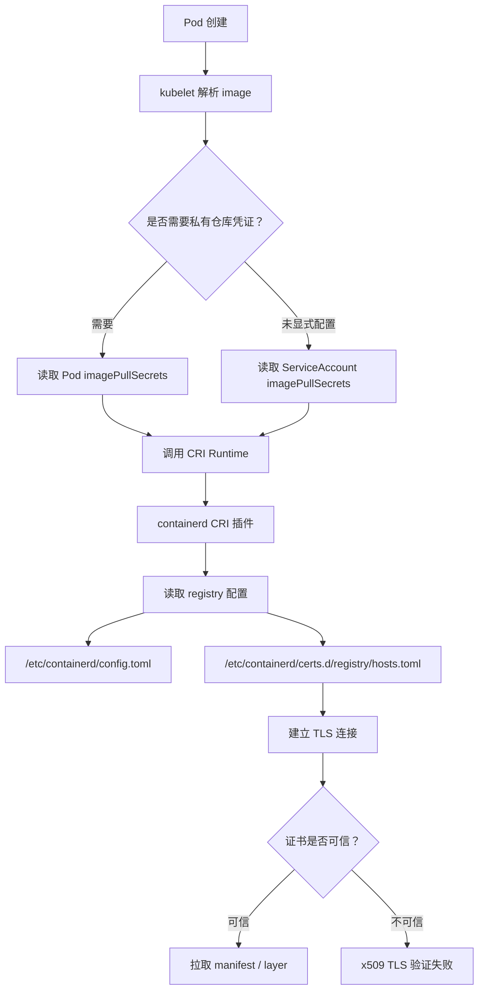
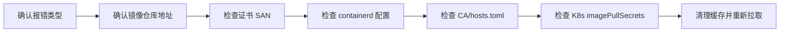
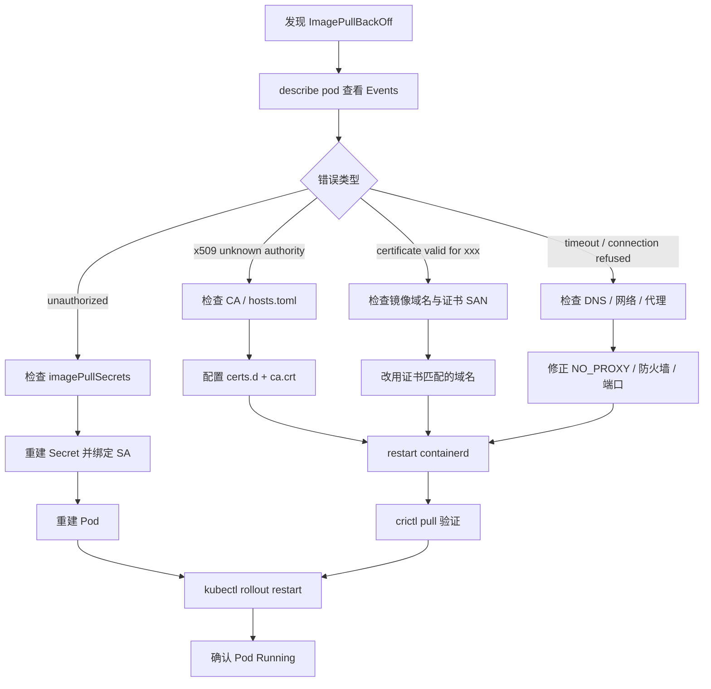

---

title: 解决 containerd TLS 证书验证问题：从跳过验证到受信配置
timestamp: 2026-02-25 00:00:00+08:00
tags: [Kubernetes, containerd, TLS, Harbor, 运维, 问题排查]
description: 深度解析 containerd 拉取私有镜像仓库时的 TLS 证书验证机制，提供从临时跳过验证到生产级 CA 信任配置的完整方案，并覆盖 Kubernetes 凭证清理、运行时缓存重置与排查闭环。
---

## 一、问题背景：为什么 containerd 会拉取镜像失败？

在 Kubernetes 集群中使用 Harbor、Nexus、Docker Registry 等私有镜像仓库时，经常会遇到类似错误：

```text
failed to pull image "harbor.example.com/project/app:v1":
rpc error: code = Unknown desc = failed to pull and unpack image:
failed to resolve reference:
failed to do request:
Head "https://harbor.example.com/v2/project/app/manifests/v1":
tls: failed to verify certificate: x509: certificate signed by unknown authority
```

这类问题表面上是“TLS 证书验证失败”，本质上通常来自下面几类原因：

| 问题类型     | 典型表现                                            | 根因                                           |
| -------- | ----------------------------------------------- | -------------------------------------------- |
| CA 不受信   | `x509: certificate signed by unknown authority` | 私有仓库使用自签名证书，节点不信任该 CA                        |
| 域名不匹配    | `certificate is valid for xxx, not yyy`         | 镜像地址与证书 SAN 不一致                              |
| 配置未生效    | 改了配置但仍然报错                                       | containerd 未读取到 `hosts.toml` 或 `config.toml` |
| 端口路径错误   | 带端口仓库配置无效                                       | `certs.d` 目录名缺少端口                            |
| K8s 凭证错误 | TLS 修好后仍 `unauthorized`                         | `imagePullSecrets` 或 ServiceAccount 绑定了旧凭证   |
| 节点缓存干扰   | 手动 pull 成功，Pod 仍失败                              | kubelet/containerd 缓存或旧镜像层残留                 |

---

## 二、先理解链路：Pod 拉取镜像经过了哪些层？



因此，解决问题不能只盯着 Kubernetes YAML，也不能只改 containerd。正确排查顺序应该是：



---

## 三、快速止血方案：临时跳过 TLS 验证

> 适用场景：测试环境、临时演示环境、内网临时仓库。
> 不建议用于生产环境，因为它会绕过证书校验，存在中间人攻击风险。

### 1. 判断 containerd 版本

```bash
containerd --version
```

常见输出：

```text
containerd github.com/containerd/containerd 1.7.x
```

也可以查看配置文件版本：

```bash
sudo head -n 20 /etc/containerd/config.toml
```

---

### 2. 推荐方式：使用 `certs.d + hosts.toml`

新版本 containerd 推荐通过 `config_path` 读取每个 registry 的独立配置。

#### containerd 1.x 配置

编辑 `/etc/containerd/config.toml`：

```toml
version = 2

[plugins."io.containerd.grpc.v1.cri".registry]
  config_path = "/etc/containerd/certs.d"
```

#### containerd 2.x 配置

containerd 2.x 的 CRI 插件路径不同：

```toml
version = 3

[plugins."io.containerd.cri.v1.images".registry]
  config_path = "/etc/containerd/certs.d"
```

---

### 3. 创建仓库配置目录

假设私有仓库地址是：

```text
harbor.example.com
```

创建目录：

```bash
sudo mkdir -p /etc/containerd/certs.d/harbor.example.com
```

如果仓库带端口，例如：

```text
harbor.example.com:8443
```

目录必须也带端口：

```bash
sudo mkdir -p /etc/containerd/certs.d/harbor.example.com:8443
```

---

### 4. 编写 `hosts.toml` 跳过验证

不带端口示例：

```toml
server = "https://harbor.example.com"

[host."https://harbor.example.com"]
  capabilities = ["pull", "resolve", "push"]
  skip_verify = true
```

带端口示例：

```toml
server = "https://harbor.example.com:8443"

[host."https://harbor.example.com:8443"]
  capabilities = ["pull", "resolve", "push"]
  skip_verify = true
```

完整命令：

```bash
sudo tee /etc/containerd/certs.d/harbor.example.com/hosts.toml > /dev/null <<'EOF'
server = "https://harbor.example.com"

[host."https://harbor.example.com"]
  capabilities = ["pull", "resolve", "push"]
  skip_verify = true
EOF
```

---

### 5. 重启 containerd

```bash
sudo systemctl daemon-reload
sudo systemctl restart containerd
sudo systemctl status containerd --no-pager
```

验证：

```bash
sudo crictl pull harbor.example.com/project/app:v1
```

实时查看日志：

```bash
sudo journalctl -u containerd -f -n 100
```

---

## 四、生产推荐方案：配置受信 CA 证书

跳过 TLS 验证只是临时手段，生产环境应该让节点信任私有仓库的 CA。

### 1. 获取仓库 CA 证书

通常从 Harbor/Nexus 管理端导出 CA 证书，命名为：

```text
ca.crt
```

也可以从服务端导出证书链：

```bash
openssl s_client -showcerts -connect harbor.example.com:443 < /dev/null
```

检查证书主题与 SAN：

```bash
openssl x509 -in ca.crt -noout -subject -issuer -dates
```

---

### 2. 放入 containerd 证书目录

```bash
sudo mkdir -p /etc/containerd/certs.d/harbor.example.com
sudo cp ca.crt /etc/containerd/certs.d/harbor.example.com/ca.crt
```

带端口的仓库：

```bash
sudo mkdir -p /etc/containerd/certs.d/harbor.example.com:8443
sudo cp ca.crt /etc/containerd/certs.d/harbor.example.com:8443/ca.crt
```

---

### 3. 编写生产级 `hosts.toml`

不跳过 TLS 验证：

```toml
server = "https://harbor.example.com"

[host."https://harbor.example.com"]
  capabilities = ["pull", "resolve", "push"]
  ca = "ca.crt"
```

完整命令：

```bash
sudo tee /etc/containerd/certs.d/harbor.example.com/hosts.toml > /dev/null <<'EOF'
server = "https://harbor.example.com"

[host."https://harbor.example.com"]
  capabilities = ["pull", "resolve", "push"]
  ca = "ca.crt"
EOF
```

目录结构应类似：

```text
/etc/containerd/certs.d/
└── harbor.example.com
    ├── ca.crt
    └── hosts.toml
```

---

### 4. 同步到系统信任链

这一步不是 containerd 必需，但强烈推荐，方便 `curl`、`openssl`、系统服务统一信任该 CA。

#### Debian / Ubuntu

```bash
sudo cp ca.crt /usr/local/share/ca-certificates/harbor.example.com.crt
sudo update-ca-certificates
```

#### RHEL / CentOS / Rocky Linux / AlmaLinux

```bash
sudo cp ca.crt /etc/pki/ca-trust/source/anchors/harbor.example.com.crt
sudo update-ca-trust
```

#### Arch Linux

```bash
sudo trust anchor --store ca.crt
sudo update-ca-trust
```

---

### 5. 重启并验证

```bash
sudo systemctl restart containerd
sudo crictl pull harbor.example.com/project/app:v1
```

如果成功，说明 containerd 已经正确读取 CA 配置。

---

## 五、旧配置方式：`registry.configs` 为什么不推荐？

很多老教程会直接修改 `/etc/containerd/config.toml`：

```toml
[plugins."io.containerd.grpc.v1.cri".registry.configs."harbor.example.com".tls]
  insecure_skip_verify = true
```

这种写法在旧版本中可用，但新版本更推荐使用：

```toml
[plugins."io.containerd.grpc.v1.cri".registry]
  config_path = "/etc/containerd/certs.d"
```

然后通过：

```text
/etc/containerd/certs.d/<registry>/hosts.toml
```

管理每个仓库的 TLS、CA、mirror、header、能力范围。

两种方式对比如下：

| 配置方式                 | 适用性   | 优点            | 缺点                   |
| -------------------- | ----- | ------------- | -------------------- |
| `registry.configs`   | 老版本兼容 | 简单直接          | 已不推荐，主配置膨胀           |
| `certs.d/hosts.toml` | 新版本推荐 | 每个仓库独立配置，结构清晰 | 初次配置稍复杂              |
| 系统 CA 信任             | 通用增强  | 系统工具也可验证      | 仍需 containerd 正确读取配置 |

---

## 六、Kubernetes 层：清理错误的 imagePullSecrets

TLS 问题解决后，如果仍然出现：

```text
unauthorized: authentication required
```

或：

```text
pull access denied
```

说明问题已经从“证书信任”转移到了“仓库认证”。

---

### 1. 查看 Pod 使用的 ServiceAccount

```bash
kubectl get pod <pod-name> -n <namespace> -o jsonpath='{.spec.serviceAccountName}'
```

如果没有显式指定，默认使用：

```text
default
```

---

### 2. 查看 ServiceAccount 是否绑定旧 Secret

```bash
kubectl get sa default -n <namespace> -o yaml
```

重点看：

```yaml
imagePullSecrets:
  - name: old-registry-secret
```

如果这里绑定了旧的 Secret，Pod 可能会持续使用错误凭证。

---

### 3. 清空 default ServiceAccount 的旧凭证

```bash
kubectl patch sa default -n <namespace> -p '{"imagePullSecrets": []}'
```

更推荐的方式是绑定正确的 Secret：

```bash
kubectl patch sa default -n <namespace> -p '{"imagePullSecrets": [{"name": "harbor-secret"}]}'
```

---

### 4. 重新创建正确的 docker-registry Secret

```bash
kubectl delete secret harbor-secret -n <namespace> --ignore-not-found
```

```bash
kubectl create secret docker-registry harbor-secret \
  --docker-server=harbor.example.com \
  --docker-username='<username>' \
  --docker-password='<password>' \
  --docker-email='admin@example.com' \
  -n <namespace>
```

在 Pod 中显式声明：

```yaml
apiVersion: v1
kind: Pod
metadata:
  name: test-private-image
spec:
  imagePullSecrets:
    - name: harbor-secret
  containers:
    - name: app
      image: harbor.example.com/project/app:v1
```

或者通过 ServiceAccount 统一继承：

```yaml
apiVersion: v1
kind: ServiceAccount
metadata:
  name: app-sa
imagePullSecrets:
  - name: harbor-secret
```

---

## 七、节点层：清理 containerd / kubelet 缓存

如果你已经修复了 TLS 与凭证，但 Pod 仍旧失败，建议清理节点侧缓存。

### 1. 删除失败镜像缓存

```bash
sudo crictl images | grep harbor.example.com
```

删除指定镜像：

```bash
sudo crictl rmi <IMAGE_ID>
```

或者删除指定镜像名：

```bash
sudo crictl rmi harbor.example.com/project/app:v1
```

---

### 2. 检查 containerd 是否能直接拉取

```bash
sudo crictl pull harbor.example.com/project/app:v1
```

如果 `crictl pull` 成功，但 Pod 失败，优先排查 Kubernetes 的 Secret、ServiceAccount、namespace、image 名称。

如果 `crictl pull` 失败，优先排查 containerd 的 TLS、CA、hosts.toml、代理、DNS。

---

### 3. 检查 kubelet 残留配置

部分环境可能存在 kubelet 或历史 Docker 残留配置：

```bash
sudo ls -al /var/lib/kubelet/
sudo ls -al /root/.docker/
```

常见残留文件：

```text
/root/.docker/config.json
/var/lib/kubelet/config.json
```

谨慎清理：

```bash
sudo rm -f /root/.docker/config.json
sudo rm -f /var/lib/kubelet/config.json
```

然后重启服务：

```bash
sudo systemctl restart containerd
sudo systemctl restart kubelet
```

---

## 八、代理问题：内网仓库被错误转发

如果节点配置了代理，containerd 访问内网 Harbor 时可能被转发到外网代理，导致证书或连接异常。

### 1. 检查 containerd 服务代理

```bash
systemctl show containerd --property=Environment
```

查看 systemd drop-in：

```bash
sudo systemctl cat containerd
```

可能存在：

```ini
Environment="HTTP_PROXY=http://proxy.example.com:7890"
Environment="HTTPS_PROXY=http://proxy.example.com:7890"
Environment="NO_PROXY=localhost,127.0.0.1"
```

---

### 2. 添加内网仓库到 NO_PROXY

```ini
[Service]
Environment="HTTP_PROXY=http://proxy.example.com:7890"
Environment="HTTPS_PROXY=http://proxy.example.com:7890"
Environment="NO_PROXY=localhost,127.0.0.1,10.0.0.0/8,192.168.0.0/16,harbor.example.com"
```

重载：

```bash
sudo systemctl daemon-reload
sudo systemctl restart containerd
```

---

## 九、完整排查命令清单

### 1. 基础信息

```bash
containerd --version
crictl version
kubectl version --client
```

```bash
systemctl status containerd --no-pager
systemctl status kubelet --no-pager
```

---

### 2. 查看 containerd 配置

```bash
sudo grep -n "config_path" /etc/containerd/config.toml
sudo grep -n "registry" /etc/containerd/config.toml
```

```bash
sudo tree /etc/containerd/certs.d
```

没有 `tree` 可以用：

```bash
sudo find /etc/containerd/certs.d -maxdepth 3 -type f -print
```

---

### 3. 查看证书

```bash
openssl s_client -showcerts -connect harbor.example.com:443 < /dev/null
```

```bash
openssl x509 -in /etc/containerd/certs.d/harbor.example.com/ca.crt -noout -subject -issuer -dates
```

---

### 4. 查看 Kubernetes 事件

```bash
kubectl describe pod <pod-name> -n <namespace>
```

```bash
kubectl get events -n <namespace> --sort-by=.lastTimestamp
```

---

### 5. 查看 Secret

```bash
kubectl get secret -n <namespace>
```

```bash
kubectl get secret harbor-secret -n <namespace> -o yaml
```

---

### 6. 查看 ServiceAccount

```bash
kubectl get sa default -n <namespace> -o yaml
```

```bash
kubectl get sa app-sa -n <namespace> -o yaml
```

---

### 7. 查看 containerd 日志

```bash
sudo journalctl -u containerd -n 200 --no-pager
```

实时查看：

```bash
sudo journalctl -u containerd -f -n 100
```

---

## 十、推荐修复流程



---

## 十一、生产落地建议

### 1. 不要在生产环境长期使用 `skip_verify`

`skip_verify = true` 的作用是跳过 TLS 验证。它虽然能快速解决拉取失败，但也意味着节点不会校验证书来源，存在安全风险。

生产环境建议使用：

```toml
ca = "ca.crt"
```

而不是：

```toml
skip_verify = true
```

---

### 2. 统一仓库域名，不要混用 IP 与域名

错误示例：

```yaml
image: 192.168.1.10/project/app:v1
```

但证书签发给：

```text
harbor.example.com
```

这会导致证书校验失败。

推荐统一使用：

```yaml
image: harbor.example.com/project/app:v1
```

---

### 3. 带端口仓库必须保持路径一致

如果镜像地址是：

```text
harbor.example.com:8443/project/app:v1
```

那么目录必须是：

```text
/etc/containerd/certs.d/harbor.example.com:8443/
```

而不是：

```text
/etc/containerd/certs.d/harbor.example.com/
```

---

### 4. 每个节点都要配置

containerd 是运行在每个 Worker 节点上的。只在 Master 节点配置 CA 没有意义，真正拉取镜像的节点都必须配置：

```text
/etc/containerd/config.toml
/etc/containerd/certs.d/<registry>/hosts.toml
/etc/containerd/certs.d/<registry>/ca.crt
```

建议使用 Ansible、SaltStack、Terraform、cloud-init 或 DaemonSet 自动分发。

---

## 十二、最终推荐目录结构

以 `harbor.example.com` 为例：

```text
/etc/containerd/
├── config.toml
└── certs.d
    └── harbor.example.com
        ├── ca.crt
        └── hosts.toml
```

`config.toml`：

```toml
version = 2

[plugins."io.containerd.grpc.v1.cri".registry]
  config_path = "/etc/containerd/certs.d"
```

`hosts.toml`：

```toml
server = "https://harbor.example.com"

[host."https://harbor.example.com"]
  capabilities = ["pull", "resolve", "push"]
  ca = "ca.crt"
```

---

## 十三、一键检查脚本

可以保存为：

```bash
check-containerd-registry.sh
```

内容如下：

```bash
#!/usr/bin/env bash
set -euo pipefail

REGISTRY="${1:-}"

if [[ -z "$REGISTRY" ]]; then
  echo "用法: $0 <registry-host[:port]>"
  echo "示例: $0 harbor.example.com"
  echo "示例: $0 harbor.example.com:8443"
  exit 1
fi

echo "========== containerd 版本 =========="
containerd --version || true

echo
echo "========== containerd 服务状态 =========="
systemctl status containerd --no-pager || true

echo
echo "========== config_path 配置 =========="
sudo grep -n "config_path" /etc/containerd/config.toml || echo "未找到 config_path"

echo
echo "========== registry 配置目录 =========="
CONF_DIR="/etc/containerd/certs.d/${REGISTRY}"
if [[ -d "$CONF_DIR" ]]; then
  sudo find "$CONF_DIR" -maxdepth 2 -type f -print
else
  echo "目录不存在: $CONF_DIR"
fi

echo
echo "========== hosts.toml =========="
if [[ -f "$CONF_DIR/hosts.toml" ]]; then
  sudo cat "$CONF_DIR/hosts.toml"
else
  echo "未找到 $CONF_DIR/hosts.toml"
fi

echo
echo "========== CA 证书 =========="
if [[ -f "$CONF_DIR/ca.crt" ]]; then
  openssl x509 -in "$CONF_DIR/ca.crt" -noout -subject -issuer -dates || true
else
  echo "未找到 $CONF_DIR/ca.crt"
fi

echo
echo "========== TLS 握手测试 =========="
HOST="${REGISTRY%%:*}"
PORT="443"
if [[ "$REGISTRY" == *:* ]]; then
  PORT="${REGISTRY##*:}"
fi

openssl s_client -connect "${HOST}:${PORT}" -servername "$HOST" < /dev/null 2>/dev/null | \
  openssl x509 -noout -subject -issuer -dates || true

echo
echo "========== 最近 containerd 日志 =========="
sudo journalctl -u containerd -n 50 --no-pager || true
```

执行：

```bash
chmod +x check-containerd-registry.sh
./check-containerd-registry.sh harbor.example.com
```

---

## 十四、避坑总结

| 坑点                    | 现象             | 解决方案                            |
| --------------------- | -------------- | ------------------------------- |
| 用 IP 拉取，但证书签给域名       | 证书域名不匹配        | 镜像地址改成证书中的域名                    |
| `certs.d` 目录少了端口      | 配置不生效          | 目录名必须与 registry host 完全一致       |
| 只改 Master，没有改 Worker  | Pod 仍然拉取失败     | 每个实际调度节点都要配置                    |
| 忘记重启 containerd       | 修改后无变化         | `systemctl restart containerd`  |
| Secret 在错误 namespace  | `unauthorized` | Secret 必须和 Pod 在同一 namespace    |
| default SA 绑定旧 Secret | 一直使用旧凭证        | patch ServiceAccount 或重建 Secret |
| 配了系统代理                | 连接超时或证书异常      | 配置 `NO_PROXY`                   |
| 旧镜像层残留                | 重试仍失败          | `crictl rmi` 清理镜像缓存             |

---

## 十五、结论

containerd TLS 证书验证问题不能简单地理解为“证书错误”。它通常横跨三层：

1. **运行时层**：containerd 是否读取了正确的 `config_path`、`hosts.toml`、`ca.crt`。
2. **系统层**：节点系统是否信任私有 CA，代理、DNS、端口是否正常。
3. **Kubernetes 层**：Pod、ServiceAccount、imagePullSecrets 是否使用了正确凭证。

测试环境可以使用：

```toml
skip_verify = true
```

快速止血。

生产环境应使用：

```toml
ca = "ca.crt"
```

建立完整信任链。

最终判断标准只有一个：

```bash
sudo crictl pull harbor.example.com/project/app:v1
```

如果 `crictl pull` 成功，说明 containerd 层已经打通；如果 Pod 仍失败，就继续检查 Kubernetes 的 Secret、ServiceAccount 与 namespace 绑定关系。

按照“证书 → containerd → 凭证 → 缓存 → Pod”的顺序排查，基本可以稳定解决私有镜像仓库拉取中的 TLS 与认证问题。
