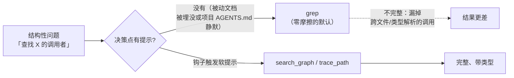
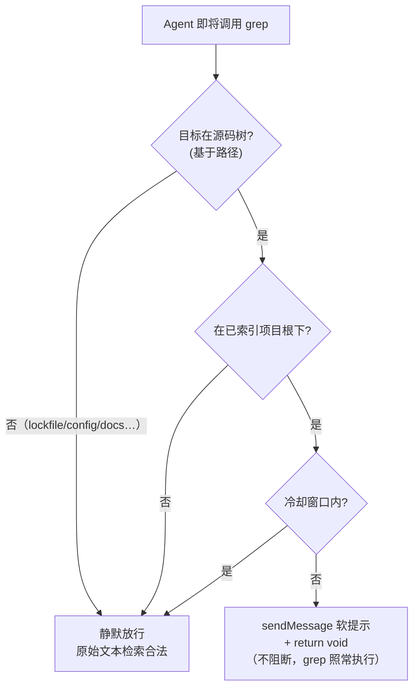

# 知识图谱优先于 grep：用决策点软提示钩子纠正工具选择

当我们给一个编码 Agent 配上结构化的代码知识图谱（codebase-memory-mcp，基于混合 LSP 构建，能解析函数、类、调用者、被调用者、路由与跨服务边）时，通常会默认一个问题：**Agent 会主动用它吗？** 答案出乎意料——不会。在一个完全索引、图谱新鲜且严格优于文本检索的项目里，Agent 跨 30 个会话只动用了 4 次图谱，却调用了 158 次 `grep`。

这不是索引出了问题。索引是新鲜的、完整的、可达的。真正的问题是：**在 Agent 决定"搜索"的那一刻，没有任何东西提示它存在一个更好的工具。** 被动文档（"请优先用图谱、禁止 grep"）撑不住——30 个会话里有 26 个对它视而不见。

本文记录一套在生产环境中落地的修复：**用一个不阻断的 `PreToolUse` 钩子，在 `grep` 决策点注入一行软提示**。文章不讲工具教程，而是聚焦"诊断与流程"——为什么能力不被激活、为什么加强规则是错的干预层、软提示如何设计、如何用路径而非模式来识别结构性检索，以及如何从探针到运行时层层验证。

> 阅读顺序建议：先理解谜题与数据，再进入根因与"规则为何失效"，最后把钩子设计、API 契约与验证作为可复用的工程模式。

---

## 一、谜题：能力齐备，却无人问津

`codebase-memory-mcp` 把一个项目索引成混合 LSP 知识图谱。对于结构性问题——*查找定义、谁调用了 X、X 调用了什么、死代码、模块边界*——它严格地比 `grep` 更快、更完整，因为它能解析文本搜索看不见的跨文件类型关系。

被审计的项目是完全索引的。然而跨 30 个会话，Agent 的行为就像图谱不存在一样。索引本身没有任何问题：

| 检查项 | 结果 |
| --- | --- |
| 是否已索引？ | 是——**34,361 个节点 / 120,215 条边 / 82 MB** |
| 是否新鲜？ | 是——图谱的 `head_sha` **精确等于** 实时 `git HEAD`，状态为 `ready` |
| 是否可达？ | 是——以 `xd://mcp__codebase_memory_mcp_*` 设备族形式暴露 |

所以问题从来不是"Agent 能用吗"，而是"**它为什么不用**"。



---

## 二、数据审计：grep 与知识图谱的真实用量

对会话转录文件做插桩（每次工具调用都记录为 `tool_execution_start` 事件，带 `toolName` 与参数），得到了一个没有歧义的答案：

| 指标 | 计数 |
| --- | --- |
| `grep` 调用次数 | **158** |
| `codebase-memory` 调用次数 | **22** |
| 其中**结构性**的 grep（查找定义/调用者/被调用者/用法） | **约 80%（116–128 次）** |
| 其中合理属于**原始文本**的 grep（lockfile、i18n、配置、文档、迁移） | 约 10–15% |
| 用过图谱的会话数 | **4 / 30** |
| 那 22 次图谱调用中，有多少集中在**单次**架构探索会话里 | **18 次** |

**集中度才是关键信号。** 图谱只在一次刻意的架构梳理中被触达，随后在 26 个会话里被彻底遗忘——包括每次跑 16–28 次 `grep` 的大重构，且几乎全是结构性的：*"查找某个 Mapper 的所有调用者"*、*"查找 buildErrorMessage 的定义"*、*"查找管理层里所有 Promise.all 的用法"*。每一项都是 `trace_path` / `search_graph` 本该做得更好的工作。

---

## 三、根因：被动文档对抗不了预训练先验

把根因按影响力排序：

1. **决策点没有强制（主因）。** 反 grep 的要求只以*被动散文*形式存在——写在全局 `AGENTS.md` 里，外加一个*按需加载*的托管技能，其 frontmatter 既没有 `globs` 也没有 `alwaysApply`（所以它从不自动触发，必须被点名调用）。更糟的是，项目级的 `AGENTS.md`——实际被查阅的那份——对 codebase-memory **只字未提**。所以在"查找调用者"的瞬间，唯一活跃的线索就是模型对 `grep` 的预训练先验。数据证明，被动散文压不住这个先验。
2. **工具表面摩擦（次因）。** `grep` 是一次一等调用、单参数 `pattern`。而一次图谱查询是*手工拼一个 JSON 对象 → 写到一个 `xd://` 设备*。更高的激活成本，稳定地输给了阻力最小的路径。
3. **陈旧/未索引——已排除**（见上表）。

---

## 四、为什么"写一条更好的规则"不奏效

直觉是加强 `AGENTS.md` 的措辞，或加一条 `alwaysApply` 的 TTSR 规则。对这个特定问题，两者都是错的层级：

- **规则按"每轮"或"按文件路径"注入，而非按工具调用。** 一条 `alwaysApply` 规则*每轮*重新注入提醒——正是数据表明会被调优掉的"被动文档重复版"。一条 `globs` 限定的规则在匹配文件被*编辑/读取*时触发，而不是在 `grep` 即将运行时触发。
- **缺陷发生在工具决策的瞬间**，而只有 `PreToolUse` 钩子坐在那个位置上。30 个会话里有 26 个对明确的"禁止"措辞视而不见，这就是"再加一段散文不是有效干预"的证据。

正确的干预单位是：*"当 Agent 即将对源码树调用 `grep` 时，浮出更好的选项——但不阻断。"*

---

## 五、解法：一个软性 PreToolUse 钩子

### 5.1 表面决策：软，而非硬

omp 的 `tool_call` 事件（`PreToolUse` 的等价物）支持**两条**通道，而它们很容易被混淆：

| 通道 | 机制 | 效果 |
| --- | --- | --- |
| **硬**（返回类型） | `return { block, reason }` | 阻断调用；Agent 必须绕过它重试。风险：对合法 `grep` 的误判阻断。 |
| **软**（副作用） | `pi.sendMessage({ customType, content, display, attribution })` **+ `return void`** | 注入一条**参与 LLM 上下文**的消息；调用照常进行。零误判风险。 |

软通道是非显然的那条。`ToolCallEventResult` 这个返回类型是面向阻断的，所以一次粗读会得出"`PreToolUse` 只能阻断"的结论。但 `pi.sendMessage()` 挂在基础的 `HookAPI` 上，可从*任何*事件（包括 `tool_call`）调用，且明确是*"当你想让 LLM 看到消息内容时"*用的。返回 `void` 意味着"不阻断——继续"。这个组合才是真正的非阻断提示。

我们选择**软**：它尊重"提醒而非阻断"，永远不会打断一次合法的原始文本 `grep`，最坏情况是一次静默空操作，绝不会卡住工具。

### 5.2 检测：基于路径，而非模式

第一版谓词草稿要求一个代码文件扩展名或非空 pattern。单元测试立刻抓到了问题：它只标出了 **59** 次结构性 grep，却*漏掉了 73 次恰恰是反模式*的检索——因为真正的反模式 grep 会把范围限定到一个**源码目录**（`backend-spring/src`），**没有文件扩展名**，而且常常**pattern 字段为空**。正确的检测是**基于路径**的：一次范围限定在源码树的 `grep`，*本身*就是结构性信号。

| 谓词版本 | 标出的结构性 grep | 判定 |
| --- | --- | --- |
| 要求扩展名或 pattern | 59 / 158 | **坏的**——漏掉目录限定的检索 |
| **路径指向源码树 且 非原始文本** | **116 / 158** | 吻合人工基线（约 127）；差距是保守的（整仓/模块根不带 `src` 的情形） |

### 5.3 白名单

| `grep` 目标 | 行为 |
| --- | --- |
| `backend-spring/src`、`console/src`、`management/src`、`shared/*/src` | **提示**（结构性） |
| `**/pnpm-lock.yaml`、`**/*.json/yaml/toml`、`**/*.md`、`migrations/`、`locales/`、`i18n/`、`wiki/`、`dist/build/target/`、`node_modules/`、`.omp/`、`*.log`、`*.css/scss`、`pom.xml`、`docker-compose*`、`tsconfig*`、`vite.config*` | **静默**（原始文本是合理的） |

原始文本检索即使*在*源码树内也胜出（例如 `management/src/i18n/locales` → 静默）。提示还带有 10 分钟冷却（防刷），且只在已索引的项目根下生效。



---

## 六、实现：钩子代码与 API 契约

钩子部署在 `hooks/pre/graph-first-nudge.ts`（omp 在**会话启动时**自动加载 `hooks/pre/*.ts`——不是热重载，新加的钩子对运行中的会话不可见，必须在新会话里验证）。下面是一份面向公众、已脱敏的实现：索引根在运行时从 CLI 发现，无需硬编码任何机器路径。

```ts
import type { HookAPI } from "@oh-my-pi/pi-coding-agent/extensibility/hooks";

// 一行提醒：在结构性检索时优先用图谱，grep 仅作原始文本兜底。
const REMINDER =
  "codebase-memory nudge: this project is indexed in the code knowledge graph. " +
  "For STRUCTURAL lookups — find definition, callers, callees, references, type, " +
  "module/package boundary — use the graph FIRST, then grep only as a raw-text fallback:\n" +
  "  - xd://mcp__codebase_memory_mcp_search_graph    (query or name_pattern -> qualified_name)\n" +
  "  - xd://mcp__codebase_memory_mcp_trace_path       (function_name + direction inbound/outbound)\n" +
  "  - xd://mcp__codebase_memory_mcp_get_architecture (clusters / layers / packages)\n" +
  "Raw-text grep on lockfiles, config, docs, i18n, migrations, logs, or generated output is fine.";

// 基于路径：一次范围限定在源码树的 grep 本身就是结构性信号。
// 这些源码树前缀按你的项目结构调整。
const SOURCE_TREE_RE = /(backend-spring[\\/]src|console[\\/]src|management[\\/]src|shared[\\/].*?[\\/]src)/;
const RAW_TEXT_RE =
  /(lock|\.json|\.yaml|\.yml|\.toml|\.env|\.mdx?|migrations|locales|i18n|wiki|[\\/]dist[\\/]|[\\/]build[\\/]|[\\/]target[\\/]|node_modules|\.omp|sessions|\.log|\.css|\.scss|pom\.xml|docker-compose|tsconfig|vite\.config|\.sh$)/;

let indexedRoots: string[] = [];   // 运行时从 cli list_projects 填充
let lastNudgeAt = 0;
const COOLDOWN_MS = 10 * 60 * 1000;

function norm(p: string) {
  return p.replace(/\\/g, "/").replace(/^~/, process.env.HOME ?? "~");
}
function isUnderIndexedRoot(cwd: string) {
  const c = norm(cwd);
  return indexedRoots.some(r => { const root = norm(r); return c === root || c.startsWith(root + "/"); });
}
function isStructuralGrep(input: Record<string, unknown>) {
  const path = norm(String(input.path ?? "")), pattern = String(input.pattern ?? "");
  if (!SOURCE_TREE_RE.test(path)) return false;
  if (RAW_TEXT_RE.test(path) || RAW_TEXT_RE.test(pattern)) return false;
  return true;
}

export default function graphFirstNudge(pi: HookAPI) {
  // 会话启动时刷新已索引根（无需硬编码机器路径）
  pi.on("session_start", async () => {
    try {
      const res = await pi.exec("codebase-memory-mcp", ["cli", "list_projects"]);
      const roots = [...String(res.stdout ?? "").matchAll(/"root_path"\s*:\s*"([^"]+)"/g)].map(m => m[1]);
      if (roots.length) indexedRoots = roots;
    } catch { /* 保留空列表；钩子退化为不触发 */ }
  });

  pi.on("tool_call", async (event, ctx) => {
    try {
      if (event.toolName !== "grep") return;
      if (!isStructuralGrep(event.input)) return;
      if (!isUnderIndexedRoot(ctx.cwd)) return;
      if (Date.now() - lastNudgeAt < COOLDOWN_MS) return;
      lastNudgeAt = Date.now();
      pi.sendMessage({                     // 软：参与 LLM 上下文，不阻断
        customType: "graph-first-nudge",
        content: REMINDER, display: true, attribution: "agent",
      });
      // return void → grep 照常执行
    } catch { /* 绝不让提示把 grep 搞挂 */ }
  });
}
```

### 6.1 钩子 API 契约（对照类型定义核实）

| 符号 | 形状 | 来源 |
| --- | --- | --- |
| `ToolCallEvent` | `{ type:"tool_call", toolName, toolCallId, input: Record<string,unknown> }` | `hooks/types.d.ts` |
| `HookContext.cwd` | `string`——项目根 | `hooks/types.d.ts` |
| `ToolCallEventResult` | `{ block?, reason? }`——**硬**路径 | `shared-events.d.ts` |
| `HookAPI.sendMessage` | 注入一条**参与 LLM 上下文**的 `CustomMessageEntry`；`triggerTurn` 默认 `false`（在循环中途安全） | `hooks/types.d.ts` |
| 钩子位置 | `hooks/{pre,post}/*.ts`（全局）/ `.omp/hooks/{pre,post}/*.ts`（项目）；会话启动时加载 | `hooks/loader.d.ts` |

两个容易搞错的点：(1) 从 `tool_call` 里调 `sendMessage` 是**软**通道——它在包里是规范用法，不是未经验验的写法；(2) 钩子在**启动时**加载，所以新加的钩子对运行中的会话不可见，必须在一个新会话里验证。

---

## 七、验证：从探针到运行时

修复必须分三层证明，缺一不可：

```bash
# 1. 前提证明：图谱确实能瞬间给出 grep 在苦找的信息
#    （示例：搜索一个 Mapper 符号，返回带文件与行号的合格结果）
codebase-memory-mcp cli search_graph '{"project":"PROJECT","query":"SomeMapper"}'

# 2. 逻辑证明：用 mock-pi 自探针，对合成事件逐条断言
bun /tmp/graph-first-nudge.probe.mjs   # 期望：6/6 PASS

# 3. 运行时证明：在全新会话里对源码树 grep，确认软提示渲染且 grep 照常返回
#    期望：[P] graph-first-nudge 块出现，下方紧跟完整 grep 结果（非阻断端到端确认）
```

1. **mock-pi 自探针**——导入工厂函数，向一个 mock `pi` 注册处理器，触发六个合成的 `tool_call` 事件。结果：**6 / 6 通过**（结构性 → 触发提示；lockfile / 源码树内 i18n / 非 grep / 未索引 cwd / 冷却重复 → 静默）。
2. **前提证明**——对某个 Mapper 符号调用 `search_graph`，瞬间返回 **106** 条带文件与行号范围的合格结果，正是历史上三次 `grep` 在苦找的信息。
3. **实时运行测试**——在一个全新的会话里，对 `backend-spring/src` 跑 `grep class.*Service`，钩子被触发：`graph-first-nudge` 块渲染出来（`[P] graph-first-nudge`），**并且**完整的 grep 结果在下方照常返回——非阻断得到端到端确认。

---

## 八、经验沉淀与结语

这次修复最难的部分不是写钩子，而是认清**能力不等于激活**。可沉淀、可复用的经验有五条：

- **能力 ≠ 激活。** 一个更优、新鲜、可达的工具，如果在决策瞬间没有任何线索去触发它，就一文不值。衡量*使用率*，而非*可用性*。
- **决策点钩子胜过被动文档。** 当模型的预训练先验指向一边时，散文——哪怕是"禁止"的散文——也撑不住（26 / 30 个会话）。把线索放到决策发生的地方。
- **除非需要牙齿，否则优先用软通道。** `sendMessage` + `return void` 在引导的同时永远不会冒误判阻断的风险。只有当一次错误的调用真的不可恢复时，才动用 `{block, reason}`。
- **在稳定的信号上做检测。** 对于"这次 `grep` 是不是结构性的"，稳定信号是*路径范围*，而不是 pattern 文本或文件扩展名——真正的反模式 grep 会点名一个目录、把 pattern 留空。
- **先靠执行验证，再靠运行时验证。** mock-pi 探针证明逻辑；只有真实会话才能证明加载与送达。让钩子 fail-soft，这样两层之间的缝隙是无害的。

> 这套模式不限于"图谱优先于 grep"。任何"模型有一个更强的工具却总退回更弱的默认"的场景——比如该用 LSP 跳转却用了文本搜索、该提交前跑测试却跳过——都能用同一个"决策点软提示"钩子来纠正。干预的单位，永远是*决策发生的那个瞬间*。
