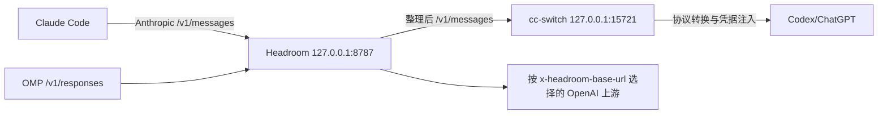

这页记录一个特定 Headroom provider proxy 部署的共存契约：Claude Code 不直接把请求交给 cc-switch，而是先经过 Headroom；OMP 的 Responses 路径仍由同一个 Headroom 入口按请求级上游路由。结论是 **一个请求只能有一个整理责任人**：Headroom 负责压缩与整理，cc-switch 只负责 Anthropic↔OpenAI 协议转换和凭据注入。本文是版本相关的 `provisional` 综合，不是所有 Headroom 或 cc-switch 版本的默认行为。

## 链路与责任边界



| 路径        | 协议与入口                                      | Headroom 的职责        | 后续环节                                         | 不应推断                           |
| ----------- | ----------------------------------------------- | ---------------------- | ------------------------------------------------ | ---------------------------------- |
| OMP         | OpenAI `/v1/responses`，入口 `127.0.0.1:8787`   | 按请求级信息整理并路由 | `x-headroom-base-url` 指定的 OpenAI 上游         | OMP discovery 一定由 Headroom 接管 |
| Claude Code | Anthropic `/v1/messages`，入口 `127.0.0.1:8787` | 整理请求内容           | cc-switch `127.0.0.1:15721` 做协议转换和凭据注入 | cc-switch 负责压缩                 |

因此，同一 provider 上不能再叠加另一个 application-level compression bridge。否则请求会被两个环节先后整理，savings、缓存前缀和失败原因都难以归属。

## cc-switch reconciler

cc-switch proxy 模式会把 `~/.claude/settings.json` 中的 `ANTHROPIC_BASE_URL` 写成 `http://127.0.0.1:15721`。Headroom 启用 `HEADROOM_CC_SWITCH_RECONCILE=1` 后，reconciler 建立如下恢复链：

1. 读取 cc-switch 写入的 `15721`，保存为 Headroom 当前 Anthropic 上游；该上游按请求读取，不需要重启 proxy。
2. 将 `ANTHROPIC_BASE_URL` 改回 `http://127.0.0.1:8787`，其它环境字段、hooks 和插件配置保留。
3. 已经是 8787 时跳过写入，避免 watcher 自我触发。
4. 切换到 Claude Official（`{"env":{}}`）时默认放行直连，以保护 OAuth；只有显式设置 `HEADROOM_CC_SWITCH_ROUTE_OFFICIAL=1` 才强制经 Headroom。

凭据由 Claude Code → Headroom → cc-switch 原样传递；Headroom 不读取或保存真实 Codex 凭据。OMP 的 `/v1/responses` 与 Claude Code 的 `/v1/messages` 使用不同协议路由，不共享 Anthropic 上游状态。

## systemd 安全取舍

原 unit 使用 `ProtectHome=tmpfs` 隐藏用户 home；为了让 reconciler 回写 `settings.json`，增加：

```ini
BindPaths=%h/.claude
```

`BindPaths` 默认是可写 bind，因此真实 `~/.claude` 被映射进服务 mount namespace。代价是 proxy 服务可以读取该目录中的会话历史、`.mcp.json` 等文件。服务仍以当前用户运行，且保留 `NoNewPrivileges`、`ProtectSystem=strict`、`PrivateDevices`、`UMask=0077` 等限制；这不是提权，但确实是相对于 `ProtectHome=tmpfs` 的防御纵深回退。

### 回滚

1. 停止 Claude Code 新请求，避免回滚时继续触发 reconciler。
2. 从配置中移除 `HEADROOM_CC_SWITCH_RECONCILE=1`。
3. 删除 unit 的 `BindPaths=%h/.claude`，重新安装/加载 user unit 并重启服务。
4. 用配置备份恢复 `~/.claude/settings.json` 的原始 `ANTHROPIC_BASE_URL`（`http://127.0.0.1:15721`）。

回滚前保留配置备份，不要用空对象覆盖用户的 hooks、插件或其它环境字段。

## 最小验证

验证必须同时覆盖运行时上游和真实请求链路：

```bash
curl --fail --silent http://127.0.0.1:8787/admin/upstream
```

预期核心结果是 `cc_switch_reconcile=true`，且 `anthropic`、`captured_upstream` 都指向 `http://127.0.0.1:15721`。然后在 `var/headroom/logs/proxy.log` 中确认同时存在：

```text
path=http://127.0.0.1:15721/v1/messages
path=/v1/messages status=200
```

只看到 `/health` 或一个 HTTP 200 不足以证明请求到达 cc-switch；只读 `settings.json` 也不能替代运行时上游证据。项目的 `./bin/validate` 还应以 `PASS validation` 结束。

## 证据与不确定性

- **来源事实**：固定项目提交与同日脱敏运行时观测确认了两条路径、reconciler 的回写方向、`BindPaths` 的安全代价，以及 `/v1/messages → 127.0.0.1:15721` 的成功请求链路。
- **本页综合**：将共存问题归纳为“Headroom 单一整理 + cc-switch 协议/凭据转换”，并把静态配置、运行时上游、实际请求和 systemd 隔离分开验证。
- **不确定性**：端口、环境变量、settings schema、日志字段和 Headroom/cc-switch 的重写时机都可能随版本变化；这页不声明跨版本兼容，也不把一次部署证据扩展成官方默认契约。

## 相关页面

- [Headroom 单端口路由综合](/note/headroom-single-port-evolution)
- [Headroom 路由持久化综合](/note/omp-headroom-persistence)
- [Headroom 0.34 压缩与检索契约](/note/headroom-compress-retrieve-contract)
