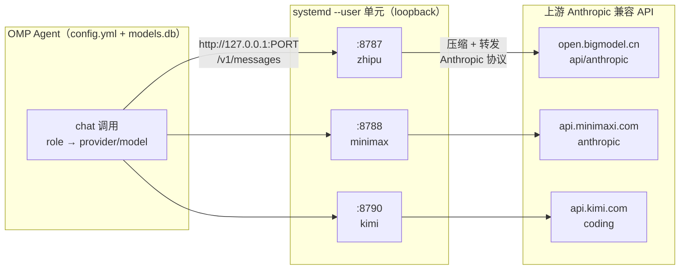
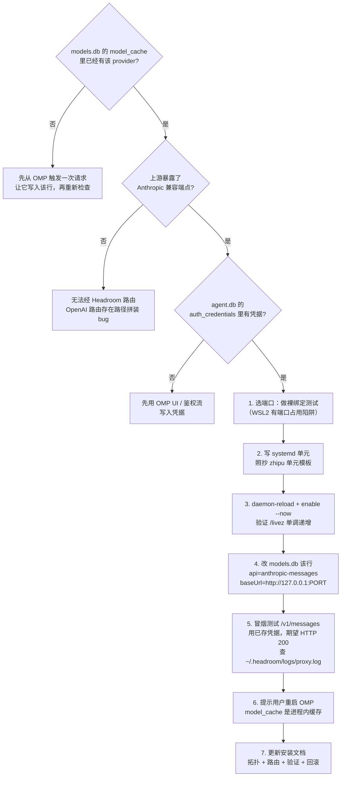

# Headroom × OMP：自定义模型供应商接入与治理全流程

当我们用 AI Agent 框架编排多个大模型供应商时，往往会遇到一个尴尬的现实：不同供应商的协议、鉴权、缓存能力参差不齐。国产供应商（如智谱、MiniMax、Kimi）大多提供了 Anthropic 兼容端点，但它们在 prompt 缓存、上下文压缩、工具结果缓存等能力上的表现并不统一；而直接把流量打到上游，又意味着丢失了一层可以做统一治理的中间层。

本文记录一套在生产环境中落地的方案：**通过 Headroom 压缩代理层，把自定义模型供应商统一接入 OMP（Oh My Pi）Agent 编排框架**。文章不讲安装细节，而是聚焦"流程"——如何接入、如何路由、如何施加约束、如何运维，以及踩过哪些坑。

> 阅读顺序建议：先理解整体架构与四层制品，再进入接入流程，最后把约束执行与运维陷阱作为日常手册。

---

## 一、背景：为什么需要一层压缩代理？

OMP 是一个 Agent 编排框架，它根据角色（role）把请求路由到不同的 provider/model。理想情况下，每个供应商都该具备：

- **Prompt 缓存**：重复的系统提示、工具定义不再重复计费；
- **上下文压缩**：超长对话自动压缩，保留关键信息；
- **工具结果缓存**：相同工具调用结果复用，降低延迟与成本。

但现实是，并非所有上游都原生支持这些能力。Headroom 的角色就是补齐这一层：它作为一个本地反向代理，对所有经过的流量做透明的压缩、缓存与协议归一，让 OMP 侧无需关心每个供应商的能力差异。

一个关键设计原则是：**只对需要治理的供应商走代理，其余直连**。在本方案中，只有三个国产供应商经过 Headroom，其他供应商（Vertex Claude、本地 Ollama、LM Studio、llama.cpp 等）全部直连，不做任何改动。这样既统一了能力，又把代理的复杂度和故障面限制在最小集合内。

---

## 二、整体架构：四层制品与职责边界

OMP 把请求路由到三个经过 Headroom 压缩代理的国产供应商，每个供应商对应一个独立的代理进程；其余供应商全部直连。



理解这套架构的关键，是搞清楚**四个制品各自负责什么、不负责什么**。一旦职责混淆，排查问题就会无从下手。

| 层 | 制品（文件/对象） | 负责什么 | 不负责什么 |
| --- | --- | --- | --- |
| **1. 角色→模型绑定** | `config.yml`（`modelRoles`、`task.agentModelOverrides`、`retry.fallbackChains`） | 每个 OMP 角色用哪个 provider/model；模型失败时的回退图 | 网络路由 |
| **2. 模型→路由绑定** | `models.db` 表 `model_cache`（`provider_id`、`models[].api`、`models[].baseUrl`） | 每个 provider 的模型：协议（`anthropic-messages` / `openai-completions`）+ base URL | 鉴权、角色分配 |
| **3. 代理进程** | systemd 单元 `headroom-proxy-*.service`（每个供应商一个） | 监听端口、上游 URL、provider 名、代理环境、重启策略 | 模型存在与否 |
| **4. 上游 API** | 供应商的 Anthropic 兼容端点 | 真正的模型推理 | 是否知道 Headroom 的存在 |

除了这四层，还有两个**正交的**关注点：

- **凭据存储**（`agent.db` 表 `auth_credentials`）：Headroom 只负责转发 OMP 发来的鉴权头（`x-api-key` 或 `Authorization: Bearer`），**从不自己注入鉴权**。OAuth 行存储 `{access, refresh, expires}`，api_key 行存储 `{"key":"..."}`。
- **CLI 配置**（`~/.config/claude-profile/*.json`）：仅给独立的 `claude` CLI 用，OMP 本身不读取。

> 排查任何路由问题的第一步，就是先定位症状属于哪一层：是绑定错了（层 1）、路由错了（层 2）、代理挂了（层 3），还是上游不可用（层 4）。

---

## 三、端到端接入流程：新增一个自定义供应商

接入一个新供应商，本质上是依次让四层制品各就各位。下面的决策树给出了完整流程，每一步都标注了它在解决哪一层的问题。



流程里有几个**容易出错但决策树没有展开**的点，单独说明：

### 3.1 端口选择：先做裸绑定测试

选端口不能只看 `ss` 或 `/proc/net/tcp` 报告端口空闲。在 WSL2 镜像网络模式下，会出现"系统认为端口空闲，但实际绑定时报 `EADDRINUSE`"的诡异现象。正确做法是用 Python 做一次裸绑定验证：

```python
import socket
s = socket.socket(socket.AF_INET, socket.SOCK_STREAM)
s.bind(("127.0.0.1", PORT))  # 不报错才算真正可用
s.close()
```

特别地，某些端口会被 Windows 侧的守护进程"幽灵占用"——它不在 WSL 的网络栈里可见，但真正发请求时鉴权会被剥掉。遇到这种情况，直接换到 8790 以上的端口。

### 3.2 models.db 补丁要幂等

改 `models.db` 的 `model_cache` 行时，一定要让补丁**幂等**（可重复执行而不产生副作用），并把 `authoritative` 字段设为 `1`。如果设成 `0`，OMP 会在合适的时机从它自带的静态注册表里重新拉取该 provider，**悄悄把 `baseUrl` 和 `api` 改回去**——这时 Headroom 收不到任何流量，也不会报错，是最难排查的静默故障。

### 3.3 改完必须重启 OMP

`model_cache` 是 OMP **进程内缓存**。改完 `models.db` 后，正在运行的 OMP 进程不会感知到变化，必须重启才生效。而 Agent 自身无法自重启——这一步只能交给用户。

---

## 四、模型约束的执行：让某个供应商"只能用特定模型"

这是整套方案里最容易被忽略、也最容易出问题的一环。当业务策略要求"某供应商只能使用特定模型"（例如策略规定：智谱供应商只能用 `glm-5.2`，MiniMax 供应商不受限），`config.yml` 里有**三个面**必须同时合规，而且**顺序很重要**。

### 4.1 三个模型引用面

| 面 | 作用 | 默认状态 |
| --- | --- | --- |
| `modelRoles` | 每个角色的主模型（default/slow/plan/smol/commit/vision/advisor/designer/tiny/task） | 通常已合规——主角色是显式选择 |
| `task.agentModelOverrides` | 子 Agent 级别的覆盖（scout/sonic/cavecrew/reviewer/architect/planner/task） | 通常已合规 |
| `retry.fallbackChains` | 按角色 **且** 按模型的回退列表 | **最常见的违规点**——会随时间累积被禁用的引用 |

前两面一般是显式配置，不会出问题。**真正的雷区是 `retry.fallbackChains`**：当你把主角色改到了允许的模型，对应的回退链里却可能还残留着旧的、被禁用的模型引用。这些引用平时不触发（只有主模型失败时才走回退），所以极其隐蔽。

### 4.2 改写规则：每条违规引用怎么替换

针对不同类型的"违规引用"，有对应的替换策略：

| 违规引用类型 | 替换为 |
| --- | --- |
| 同供应商的文本模型（如 `glm-5.1`、`glm-4.7`） | 同等或更高思考档位的允许模型（如 `glm-5.2:max`） |
| 同供应商的视觉模型（如 `glm-5v-turbo`） | **只能用辅助供应商**——绝不能塞回非视觉的允许主模型（`glm-5.2` 没有原生视觉能力） |
| 同供应商的小/快模型（如 `glm-4.5-air`） | 辅助供应商的快档（如 `minimax-code-cn/MiniMax-M2.5-highspeed:low`） |
| 已无角色引用的死链 key | 整个链块删除 |

两条额外规则：

- **循环回退规则**：如果一条链的 key 本身是 `provider/allowed-model:`，那它的回退列表里就**不能再出现** `provider/allowed-model:`，必须用辅助供应商。
- **通配链**（`provider/*:`）是回退**目标**而非模型引用，应作为安全网保留。

### 4.3 强制验证三元组

改完 `config.yml` 后，必须依次跑下面三个检查，缺一不可：

```bash
# 1. YAML 能正确解析
python3 -c "import yaml; yaml.safe_load(open('config.yml')); print('YAML OK')"

# 2. 零违规引用（模式按当前约束调整）
grep -nE "zhipu-coding-plan/(glm-5\.1|glm-5:|glm-4\.5-air|glm-4\.7|glm-5v-turbo|glm-5-turbo)" config.yml
# 必须返回空

# 3. 外科手术式 diff（理论上只有 retry.fallbackChains 应当变化）
diff config.yml.bak config.yml
```

> **生效时机**：OMP 按 session 加载 `config.yml`——改动会在**下一个 session 自动生效**，无需重启；当前 session 仍用旧配置。

---

## 五、日常运维：服务控制与健康探测

### 5.1 服务控制

三个代理单元都是 `systemd --user` 服务，操作方式一致：

```bash
# 查看状态
systemctl --user status  headroom-proxy-zhipu headroom-proxy-minimax headroom-proxy-kimi

# 重启 / 停止
systemctl --user restart headroom-proxy-zhipu headroom-proxy-minimax headroom-proxy-kimi
systemctl --user stop    headroom-proxy-zhipu headroom-proxy-minimax headroom-proxy-kimi

# 实时跟踪某个单元的日志
journalctl --user -u headroom-proxy-kimi -f
```

### 5.2 健康与统计探测

每个代理暴露两个关键端点：`/livez`（存活探针）和 `/stats`（压缩/成本/延迟统计）。

```bash
# 批量探活
for port in 8787 8788 8790; do
  echo "$port: $(curl -fsS http://127.0.0.1:$port/livez)"
done

# 单个代理的详细统计（用 jq 格式化 JSON）
curl -fsS http://127.0.0.1:8787/stats | jq .
# 顶层字段：summary, agent_usage, savings, requests, tokens, latency,
# overhead, ttfb, prefix_cache, cost, persistent_savings, display_session
```

也可以用 CLI 替代：`headroom doctor --port 8787`。

### 5.3 请求级日志链路

`~/.headroom/logs/proxy.log` 记录每一次请求。确认"路由正确 + 压缩生效"看两行：

```text
event=proxy_inbound_request path=/v1/messages   ← Headroom 收到了请求
[hr_…] PERF model=<model-id> total_ms=…         ← 已转发 + 已压缩
```

重复请求时如果看到 `transforms=none` + `cache_hit_pct=100`，说明缓存管线已经命中。

### 5.4 不要被 `/readyz` 骗了

`/readyz` 对 `upstream` 检查**永远报 unhealthy**，因为这个探针打的是默认 Anthropic URL，而不是配置的上游地址。**只信 `/livez` + 实际请求流量**，不要看 `/readyz`。

---

## 六、已知陷阱与经验沉淀

下面这张表浓缩了生产环境里真实踩过的坑。每一条都曾造成过难以排查的故障，建议作为上线前的检查清单。

| 陷阱 | 症状 | 缓解办法 |
| --- | --- | --- |
| **WSL2 镜像网络端口幽灵占用** | `ss`/`/proc/net/tcp` 显示端口空闲，但 Headroom 绑定时报 `EADDRINUSE` | 用 Python `socket.bind(("127.0.0.1", PORT))` 做裸绑定测试。8789 等特定端口被 Windows 侧守护进程占用，新代理用 8790+ |
| **Headroom 的 OpenAI 路由路径 bug** | `/paas/v4` 或 `/coding/v1` base 被错误拼装 → 404 | 所有供应商统一用 `api: anthropic-messages`。上游若无 Anthropic 端点，则无法经 Headroom 路由 |
| **`RestartSec=3` 导致崩溃循环** | stop/restart 后单元进入 50+ 次重启循环 | `RestartSec=8`，给 TCP TIME_WAIT 足够时间清退 |
| **OMP 进程内缓存 model_cache** | 改了路由补丁但运行中的 OMP 不生效 | 提示用户重启 OMP，Agent 无法自重启 |
| **`authoritative=0` 导致静默回滚** | OMP 从静态注册表重新拉取 provider，悄悄把 `baseUrl`+`api` 改回去，Headroom 收不到流量且不报错 | 补丁里把 `authoritative` 设为 `1` |
| **8789 上的幽灵 Windows 代理** | `/livez` 返回 200，但每个真实请求都 401（鉴权被剥） | 用 `ss -tlnp` 核对绑定的 PID 是不是你的 systemd 单元的 MainPID，别只信 `/livez` |
| **context-mode 与 Headroom 双重压缩** | 模型输出过度简短、上下文丢失 | 一次只关一层来隔离：停掉 Headroom 单元，或禁用 `context-mode` 插件 |
| **agent.db 里 OAuth 字段形状** | 代码按 `access_token`/`refresh_token` 取值取不到 | 行存的是 `{access, refresh, expires}`（无 `_token` 后缀）；api_key 行存 `{"key":"..."}` |

---

## 七、结语

把多个异构的大模型供应商统一纳管，难点从来不在"接通"，而在**治理**：

- **接入**靠的是清晰的四层职责划分——搞清每个制品归谁管，问题就定位了一半；
- **治理**靠的是模型约束的三个面同时合规，尤其是容易被遗忘的回退链；
- **稳定性**靠的是把陷阱沉淀成检查清单，而不是依赖某次"侥幸没出事"。

只要守住"分层归位、约束闭环、陷阱清单化"这三条线，自定义供应商的接入就不再是每次都要重新踩坑的黑魔法，而是一套可复用、可审计的工程能力。

> 本文聚焦的是"流程"与"经验"。具体的逐步命令（端口选择、systemd 模板、models.db 幂等补丁、端到端冒烟测试）应作为可执行的 SOP 单独维护，与这份流程手册互为补充。
