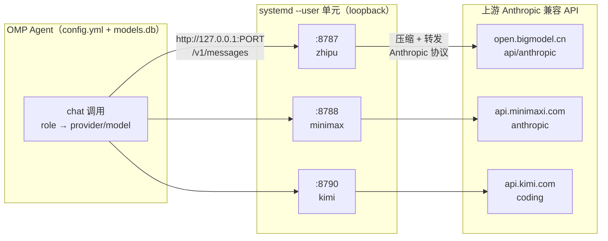
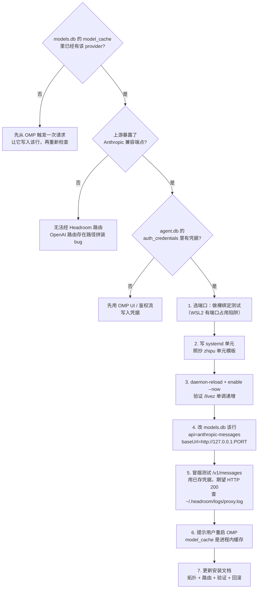
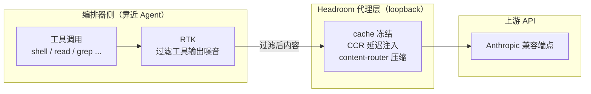

# Headroom × OMP：自定义模型供应商接入、治理与运行时实测全指南

当我们用 AI Agent 框架编排多个大模型供应商时，往往会遇到一个尴尬的现实：不同供应商的协议、鉴权、缓存能力参差不齐。国产供应商（如智谱、MiniMax、Kimi）大多提供了 Anthropic 兼容端点，但它们在 prompt 缓存、上下文压缩、工具结果缓存等能力上的表现并不统一；而直接把流量打到上游，又意味着丢失了一层可以做统一治理的中间层。

本文提供一套在生产环境中落地的完整方案：**通过 Headroom 压缩代理层，把自定义模型供应商统一接入 OMP（Oh My Pi）Agent 编排框架**。文章涵盖架构分层、接入流程、模型约束、RTK 与 Headroom 组合关系、三层路由验证以及深度运维手段。

---

## 一、背景与设计哲学：为什么需要一层压缩代理？

OMP 是一个 Agent 编排框架，它根据角色（role）把请求路由到不同的 provider/model。理想情况下，每个供应商都该具备 Prompt 缓存、上下文压缩与工具结果缓存。

但现实是，并非所有上游都原生支持这些能力。Headroom 的角色就是补齐这一层：它作为一个本地反向代理，对所有经过的流量做透明的压缩、缓存与协议归一，让 OMP 侧无需关心每个供应商的能力差异。

### 1.1 代理覆盖原则
**只对需要治理的供应商走代理，其余直连**。在本方案中，只有三个国产供应商经过 Headroom，其他供应商（Vertex Claude、本地 Ollama、LM Studio、llama.cpp 等）全部直连，不做任何改动。这样既统一了能力，又把代理的复杂度和故障面限制在最小集合内。

### 1.2 价值全貌：RTK 才是过滤主力
按“省了多少 token”拆开看运行时实测数据：
- **RTK CLI 过滤**：贡献约 86.7% 的节省（剥离工具结果里的噪音）；
- **前缀缓存稳定**：缓存命中率接近 100%（`--mode cache` 冻结历史轮次）；
- **主动压缩**：贡献不到 1%（针对正文的非 Read 压缩）。

Headroom 的角色不仅是“压缩”，更是“缓存稳定器 + 协议归一层”，而主动剥离工具噪音的主力是 RTK。

---

## 二、整体架构：四层制品与职责边界

OMP 把请求路由到三个经过 Headroom 压缩代理的国产供应商，每个供应商对应一个独立的代理进程；其余供应商全部直连。


```mermaid
flowchart LR
  subgraph OMP["OMP Agent（config.yml + models.db）"]
    A["chat 调用<br/>role → provider/model"]
  end
  subgraph Headroom["systemd --user 单元（loopback）"]
    Z[":8787<br/>zhipu"]
    M[":8788<br/>minimax"]
    K[":8790<br/>kimi"]
  end
  subgraph Upstream["上游 Anthropic 兼容 API"]
    U1["open.bigmodel.cn<br/>api/anthropic"]
    U2["api.minimaxi.com<br/>anthropic"]
    U3["api.kimi.com<br/>coding"]
  end
  A -->|"http://127.0.0.1:PORT<br/>/v1/messages"| Z
  A --> M
  A --> K
  Z -->|"压缩 + 转发<br/>Anthropic 协议"| U1
  M --> U2
  K --> U3
```

理解这套架构的关键，是搞清楚**四个制品各自负责什么、不负责什么**：

| 层 | 制品（文件/对象） | 负责什么 | 不负责什么 |
| --- | --- | --- | --- |
| **1. 角色→模型绑定** | `config.yml`（`modelRoles`、`task.agentModelOverrides`、`retry.fallbackChains`） | 每个 OMP 角色用哪个 provider/model；模型失败时的回退图 | 网络路由 |
| **2. 模型→路由绑定** | `models.db` 表 `model_cache`（`provider_id`、`models[].api`、`models[].baseUrl`） | 每个 provider 的模型：协议（`anthropic-messages`）+ base URL | 鉴权、角色分配 |
| **3. 代理进程** | systemd 单元 `headroom-proxy-*.service`（每个供应商一个） | 监听端口、上游 URL、provider 名、代理环境、重启策略 | 模型存在与否 |
| **4. 上游 API** | 供应商的 Anthropic 兼容端点 | 真正的模型推理 | 是否知道 Headroom 的存在 |

除了这四层，还有两个关注点：
- **凭据存储**（`agent.db` 表 `auth_credentials`）：Headroom 只转发 OMP 发来的鉴权头（`x-api-key` 或 `Authorization: Bearer`），从不自己注入凭据。
- **CLI 配置**（`~/.config/claude-profile/*.json`）：仅给独立的 `claude` CLI 使用，OMP 本身不读取。

---

## 三、端到端接入流程与注意事项

接入一个新的自定义供应商，需依次使四层制品就位：


```mermaid
flowchart TD
  Q1{"models.db 的 model_cache<br/>里已经有该 provider?"}
  Q1 -- 否 --> T1["先从 OMP 触发一次请求<br/>让它写入该行，再重新检查"]
  Q1 -- 是 --> Q2{"上游暴露了<br/>Anthropic 兼容端点?"}
  Q2 -- 否 --> STOP["无法经 Headroom 路由<br/>OpenAI 路由存在路径拼装 bug"]
  Q2 -- 是 --> Q3{"agent.db 的<br/>auth_credentials 里有凭据?"}
  Q3 -- 否 --> SEED["先用 OMP UI / 鉴权流<br/>写入凭据"]
  Q3 -- 是 --> P1["1. 选端口：做裸绑定测试<br/>（WSL2 有端口占用陷阱）"]
  P1 --> P2["2. 写 systemd 单元<br/>照抄 zhipu 单元模板"]
  P2 --> P3["3. daemon-reload + enable --now<br/>验证 /livez 单调递增"]
  P3 --> P4["4. 改 models.db 该行<br/>api=anthropic-messages<br/>baseUrl=http://127.0.0.1:PORT"]
  P4 --> P5["5. 冒烟测试 /v1/messages<br/>用已存凭据，期望 HTTP 200<br/>查 ~/.headroom/logs/proxy.log"]
  P5 --> P6["6. 提示用户重启 OMP<br/>model_cache 是进程内缓存"]
  P6 --> P7["7. 更新安装文档<br/>拓扑 + 路由 + 验证 + 回滚"]
```

### 3.1 端口选择：Python 裸绑定校验
 WSL2 环境下可能出现网络栈报告空闲但绑定报 `EADDRINUSE` 的现象，需用 Python 进行真实绑定探针：
```python
import socket
s = socket.socket(socket.AF_INET, socket.SOCK_STREAM)
s.bind(("127.0.0.1", PORT))
s.close()
```

### 3.2 `models.db` 幂等补丁
改 `models.db` 的 `model_cache` 时，务必将 `authoritative` 设为 `1`。若保持为 `0`，OMP 可能会重新从内置注册表拉取并覆盖 `baseUrl`，导致请求绕过代理。

### 3.3 重启 OMP 进程
`model_cache` 存在进程内缓存，修改 `models.db` 后必须重启 OMP 进程方可生效。

---

## 四、三层路由验证方法论

验证流量是否真正经过代理，切忌仅依赖二层冒烟测试，必须做到三层证据递进：

| 层级 | 验证手段 | 能证明什么 | 不能证明什么 |
| --- | --- | --- | --- |
| **L1 配置** | 查 `models.db` 的 `baseUrl` 指向 loopback | 编排器若解析该模型必走代理 | 编排器运行时是否真的选了该模型 |
| **L2 bare-proxy** | 直接向 loopback 端点发 `/v1/messages` | 代理可达、协议正常、凭据透传成功 | 编排器自身路由是否将流量发至此处 |
| **L3 编排器原生** | 查 `proxy.log` 的 `PERF` 行 + 实时连接（`ss`） | 编排器确实将原生流量发到了代理 | — |

**L3 验证命令：**
```bash
# 1. 监控日志中目标模型的 PERF 行
tail -f ~/.headroom/logs/proxy.log | grep 'PERF model='

# 2. 查看编排器进程建立的出站连接
ss -tnp state established | grep <OMP_PID>
```
确认连接目的地为 `127.0.0.1:<PORT>` 而非直连上游 IP。

---

## 五、RTK 与 Headroom 的组合架构

RTK 与 Headroom 是两个独立组件：RTK 负责在靠近 Agent 端过滤 CLI/工具输出中的日志噪音；Headroom 负责在网络层维持前缀缓存与上下文压缩。


```mermaid
flowchart LR
  subgraph Edge["编排器侧（靠近 Agent）"]
    T["工具调用<br/>shell / read / grep ..."]
    R["RTK<br/>过滤工具输出噪音"]
  end
  subgraph Proxy["Headroom 代理层（loopback）"]
    H["cache 冻结<br/>CCR 延迟注入<br/>content-router 压缩"]
  end
  subgraph Up["上游 API"]
    U["Anthropic 兼容端点"]
  end
  T --> R
  R -->|"过滤后内容"| H
  H --> U
```

### 拦截区分：
- **内联 HTTP 重定向**（如 `curl` 被拦截）：由编排器的 `context-mode` 插件处理。
- **大命令输出重定向**（如日志截断）：由 `RTK` 处理。

---

## 六、日常运维与探针工具

### 6.1 服务控制
```bash
# 查看状态
systemctl --user status headroom-proxy-zhipu headroom-proxy-minimax headroom-proxy-kimi

# 重启 / 停止
systemctl --user restart headroom-proxy-zhipu headroom-proxy-minimax headroom-proxy-kimi

# 查看实时日志
journalctl --user -u headroom-proxy-zhipu -f
```

### 6.2 CLI 探针
```bash
# 官方健康检查
headroom doctor --port 8787

# 查看性能与缓存指标
headroom perf

# 查看 Token 节省统计
headroom savings
```

### 6.3 探针注意事项
- `/livez` 实时反映代理进程状态；
- `/readyz` 会尝试探测默认 Anthropic 地址而报 unhealthy，**属于正常现象**，请以 `/livez` 和实际流量日志为准。

---

## 七、常见踩坑与经验总结

| 陷阱 | 现象 | 解决对策 |
| --- | --- | --- |
| **WSL2 端口幽灵占用** | 端口显示空闲但绑定 `EADDRINUSE` | 用 Python `socket.bind` 验证；避开 8789，选择 8790+ |
| **OpenAI 路由路径 Bug** | `/paas/v4` 或 `/coding/v1` 被误拼装导致 404 | 统一使用 `api: anthropic-messages` 协议端点 |
| **`RestartSec=3` 崩溃循环** | 重启时进入 50+ 次循环 | 将 `RestartSec` 设为 `8` 秒，确保 TCP TIME_WAIT 完全释放 |
| **`authoritative=0` 被静默重置** | 运行一段时间后 `baseUrl` 恢复默认 | 修改 `models.db` 时强制指定 `authoritative=1` |
| **OMP 内存缓存 `model_cache`** | 修改数据库后配置不生效 | 修改 `models.db` 后告知用户重启 OMP 进程 |

通过“明确四层分层、严格三层验证、保持工具组合”，即可在生产环境中构建高效、稳定的模型代理治理架构。
