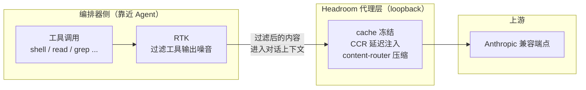

# Headroom 运行时实测：价值引擎、路由验证与 RTK 组合关系

当我们按《Headroom × OMP 接入与治理全流程》把压缩代理层部署上线后，很容易产生一个直觉：**既然叫"压缩代理"，那省 token 的活儿自然是它干**。但一次完整的运行时实测推翻了这个直觉——在一套真实生产部署上，主动压缩只贡献了不到 1% 的节省，真正的价值引擎是另一个常被忽略的组件。

本文是那套接入流程的**运行时实测同伴篇**：不重复接入流程，而是回答三个上线后才会浮现的问题——价值到底从哪来、怎么验证"流量真的走了代理"、以及 RTK 与 Headroom 到底是什么关系。

> 阅读建议：先读《接入与治理全流程》理解四层制品架构，再读本文看运行时实测如何修正设计直觉。

---

## 一、价值全貌：RTK 才是主力，不是压缩

把所有经过代理的流量按"省了多少 token"拆开看，会得到一张颠覆直觉的表：

| 价值向量 | 占比 | 机制 | 状态 |
| --- | --- | --- | --- |
| **RTK CLI 过滤** | **约 86.7% / 数千万 token** | 工具输出模式库识别并剥离工具结果里的噪音 | 真正的主力 |
| 前缀缓存稳定 | 缓存命中率 100% | cache 模式冻结历史轮次，CCR 延迟工具注入 | 设计目标达成 |
| 主动压缩 | 不到 1% | 非 Read 内容的正文压缩 | 刻意降级 |

换句话说：**重活是 RTK 干的，不是压缩干的**。`Headroom` 这个名字容易让人把功劳记在"压缩"上，但实测数据里主动压缩几乎不省 token——它的角色更接近"缓存稳定器 + 协议归一层"，而把工具输出里那几十万 token 的噪音剥掉的，是 RTK。

这个认知修正很关键：**如果你只盯着压缩率调参，会错过真正的价值杠杆**。该优化的是 RTK 的过滤模式库，而不是压缩的 keep-ratio。

---

## 二、压缩 vs 缓存的取舍：cache 模式的设计哲学

为什么主动压缩占比这么低？因为代理默认跑在 `--mode cache`（而非 `token`）：

- **`token` 模式**：优先压缩，为了最大节省会改写历史轮次——但会**破坏前缀缓存**，让 provider 侧的 prompt cache 命中率暴跌；
- **`cache` 模式**（默认）：**冻结历史轮次**，宁可放弃压缩也要保住前缀缓存命中。

实测中 cache 模式的缓存命中率接近 100%，且随对话推进缓存读取深度持续增长——这正是该模式的设计目标。代价是主动压缩让位，所以压缩占比低是**刻意取舍，不是故障**。

> 启示：调优时先想清楚你要的是"省 token"还是"省缓存命中的钱"。cache 模式适合长对话 + 支持 prompt 缓存的上游；token 模式适合一次性短请求或无缓存能力的上游。

---

## 三、路由验证的三层证据（别被冒烟测试骗了）

"代理配好了，流量应该走它了"——这个推断是整套部署里最危险的假设。实测发现，验证路由是否真的生效，需要**三层证据逐级递进**，缺一层都可能误判：

| 层级 | 验证手段 | 能证明什么 | 不能证明什么 |
| --- | --- | --- | --- |
| **L1 配置** | 读 `models.db` 的 `baseUrl` 指向 loopback | 编排器**若**解析该模型，**必**走代理 | 编排器运行时是否真的选了该模型 |
| **L2 bare-proxy** | 直接向 loopback 端点发 `/v1/messages` | 代理能起、协议通、凭据透传成功 | 编排器自身的路由逻辑是否把流量发到这里 |
| **L3 编排器原生** | 查 `proxy.log` 的 `PERF` 行 + 实时连接（`ss`） | 编排器确实把原生流量发到了代理 | （这是唯一能证明端到端路由的层） |

**最常见的误判**：只做了 L2（直连代理冒烟）就宣布"路由通过"。但 L2 是绕过编排器直接打代理，它证明的是"代理健康"，不是"编排器把流量发给了代理"。两者的差别，在排查时是致命的。

### 3.1 子代理模型覆盖可能不被尊重

实测中还观察到一个更隐蔽的现象：编排器的**子代理模型覆盖**（如配置 `scout → 某供应商模型`）在某些调用路径下**不会被尊重**——子代理继承了父会话的模型，而不是配置里指定的那个。表现是：子代理本该走供应商 A 的代理端口，`proxy.log` 里却只看到父会话模型的流量。

这意味着：**即便 L1 配置正确、L2 代理健康，L3 仍可能失败**，而且失败方式是静默的（编排器不报错，代理也收不到流量）。排查只能靠 L3 的 `proxy.log` + `ss -tnp` 实时连接——看编排器进程的出站连的是 loopback 代理端口，还是直连了外网上游。

### 3.2 一个干净的 L3 验证流程

```bash
# 1. 触发一次目标模型的请求（发一条消息）
# 2. 立刻在 proxy.log 里找对应的 PERF 行
tail -f ~/.headroom/logs/proxy.log | grep 'PERF model='

# 3. 同时看编排器进程的实时出站连接
ss -tnp state established | grep <编排器 pid>
# 关键判定：连的是 127.0.0.1:<代理端口> 还是直连外网 IP
```

只有当 `PERF model=<目标模型>` 出现，且 `ss` 显示编排器连的是 loopback 代理端口，L3 才算通过。任一缺失，路由就没真正生效。

---

## 四、RTK 与 Headroom：独立但组合

既然 RTK 是价值主力，那它和 Headroom 是什么关系？实测下来，准确的说法是**两个独立工具，由 Headroom 在运行时调用 RTK 作为其 context tool**，而不是"RTK 是 Headroom 的一个内置插件"。



关键认知（严格区分已验证与未证实）：

- **已观察事实**：代理启动日志明确写出当前激活的 context tool 是 RTK；RTK 有自己独立的配置目录（`~/.config/rtk/`，含 tracking / tee / filters / limits 等节）；编排器的插件清单里只有 context-mode，没有独立的 RTK 插件。
- **文档声明（未作为运行时集成得到证实）**：上游 README 说 Headroom 自带 RTK 二进制、会自动选择 RTK 作为 context tool——这属于文档声明，单凭启动日志不能反推出"自动选择"的机制细节。
- **未证实**：Headroom 调用 RTK 的具体注入钩子 / 进程间通信方式、关闭 RTK 的确切方法、`/stats` 里 RTK 统计字段的真实数据来源——这三项都标注为未知，不应在文档里写成确定结论。

### 4.1 两套不同的拦截，别混为一谈

实测中会撞上两种"输出被改写"的现象，它们是**不同组件干的**：

- **bash 内联 HTTP（curl/urllib/...）被重定向到沙箱工具** → 这是编排器的 **context-mode** 插件干的；
- **大命令输出被重定向到 tee 目录** → 这是 **RTK** 干的。

两者的职责不同。排查"我的命令输出怎么变了"时，先分清是哪一层，别一股脑怪到 Headroom 头上。

---

## 五、运维深化：超越 `/livez`

`/livez` 只能告诉你"代理进程活着"，但**活着 ≠ 在干活 ≠ 干得对**。Headroom 自带一组更深度的 CLI 探针，上线后值得熟悉：

```bash
# 官方健康检查（不只 /livez，还会报 claude/codex/shell 是否经代理、预算是否设置）
headroom doctor --port 8787

# 设计内部视图：压缩策略、缓存命中、transform 分解、TOIN 学习状态、可执行建议
headroom perf

# 持久节省的 30 天账本
headroom savings

# 审计 Read 工具流量的压缩机会（量化"还有多少 token 没省下来"）
headroom audit-reads
```

### 5.1 `/stats` 里被忽略的宝藏

`/stats` 返回的 JSON 里，除了 `summary`，还有几个字段值得常态化关注：

- **`cli_filtering`**：RTK 的贡献度（节省百分比、命令数）——这是真正的价值主力的实时数字；
- **`config`**：代理**运行时解析后**的压缩策略（如 `compress_user_messages=true`、`compress_system_messages=false`——保护系统提示词、只压用户轮）。这是单元文件里看不到的 headroom 内部默认；
- **`prefix_cache`**：缓存命中细节（读/写 token、bust 次数）——cache 模式是否真的在保缓存，看这里。

### 5.2 不要被 `/readyz` 骗了

`/readyz` 对上游检查**永远报 unhealthy**，因为它探的是默认 Anthropic URL 而非配置的上游。**只信 `/livez` + 实际请求流量**。

---

## 六、结语

把压缩代理层部署上线只是开始。运行时实测会修正三个上线前容易持有的直觉：

- **价值来源**：不是压缩，是 RTK。盯着压缩率调参是错的方向；
- **路由验证**：bare-proxy 冒烟通过 ≠ 编排器原生路由通过。必须落到 `proxy.log` + 实时连接这一层才算数，而且子代理模型覆盖可能静默失效；
- **组件关系**：RTK 与 Headroom 是独立工具的组合，不是包含。两套拦截（context-mode 与 RTK）职责不同，排查要先分清是哪一层。

守住这三条，"压缩代理层上线"才不会停留在"配好了以为就生效了"的错觉里，而是变成一套可观测、可验证、可优化的工程能力。

> 本文是《Headroom × OMP 接入与治理全流程》的运行时实测同伴篇。前者讲"怎么接"，本文讲"接完后实测在干什么、怎么验证它真的在干"。
