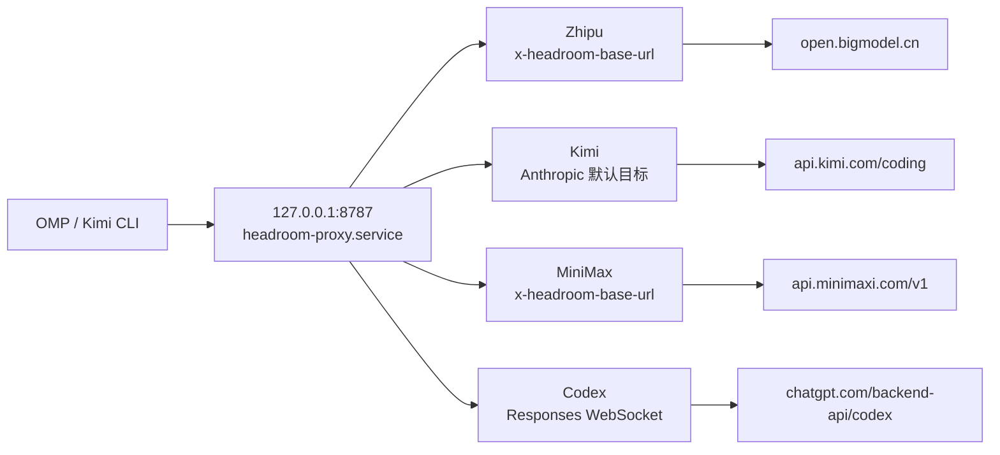

# Headroom 单端口演进：让 Zhipu、Kimi、MiniMax 与 Codex 共用 8787

这不是一次“把几个端口改成同一个数字”的配置调整，而是一次客户端路由模型的重构：**Headroom 只保留一个 loopback 代理进程，OMP 根据 provider 把上游目标写进请求，代理再按协议转发。**

本次最终收敛到以下拓扑：

```text
OMP / Kimi CLI
      │
      ▼
127.0.0.1:8787
headroom-proxy.service
      ├─ Zhipu    → https://open.bigmodel.cn/api/coding/paas/v4/chat/completions
      ├─ Kimi     → https://api.kimi.com/coding/v1/messages
      ├─ MiniMax  → https://api.minimaxi.com/v1/chat/completions
      └─ Codex WS → wss://chatgpt.com/backend-api/codex/responses
```

## 1. 为什么从多端口改成单端口

早期方案为不同 provider 启动不同的 Headroom systemd 服务。它的优点是每个进程可以设置固定的 `*_TARGET_API_URL`，缺点也很明显：

- systemd 单元、端口、日志文件和生命周期变多；
- OMP 与 Kimi CLI 需要记住不同的 loopback 地址；
- 一个 provider 的重启、代理环境或 SOCKS 配置容易和其他 provider 漂移；
- 端口本身表达了路由，而不是请求携带的 provider 事实。

单端口方案把职责重新分开：

1. **客户端**决定请求属于哪个 provider，并通过模型缓存或自定义 header 写入上游信息；
2. **Headroom**只负责协议识别、压缩、缓存和转发；
3. **systemd**只负责一个代理进程的生命周期。

这使得端口只表达“本机 Headroom 入口”，不再表达“某一个固定供应商”。

## 2. 最终的单端口架构



当前 OMP 的 provider 路由分为两类：

| Provider | 客户端路由方式 | Headroom 上游结果 |
| --- | --- | --- |
| Zhipu | `models.db` 的 `baseUrl` + `x-headroom-*` headers | `/v4/chat/completions` |
| Kimi | `models.db` / Kimi CLI 配置；无 header 的 Anthropic 请求使用默认目标 | `/coding/v1/messages` |
| MiniMax | `~/.omp/agent/models.yml` 覆盖内置 provider，并附带 `x-headroom-*` headers | `/v1/chat/completions` |
| Codex | `models.db` 指向 8787，Headroom 自动识别 ChatGPT subscription | Codex Responses WebSocket |

## 3. 统一 systemd 服务

当前磁盘上的统一服务如下。它不包含任何供应商 API key，也不设置 `OPENAI_TARGET_API_URL`，以免覆盖 Codex 的特殊 WebSocket 路由：

```ini
[Unit]
Description=Headroom Unified Context Optimization Proxy
After=network-online.target
Wants=network-online.target

[Service]
Type=simple
Environment=HOME=%h
Environment=HEADROOM_HOST=127.0.0.1
Environment=ANTHROPIC_TARGET_API_URL=https://api.kimi.com/coding
Environment=ALL_PROXY=
Environment=LITELLM_PROXY=
Environment=all_proxy=
Environment=SOCKS_PROXY=
Environment=socks_proxy=
ExecStart=/home/davidhlp/.local/bin/headroom proxy --port 8787
RestartSec=8
StandardOutput=append:%h/.headroom/logs/headroom-proxy.log
StandardError=append:%h/.headroom/logs/headroom-proxy.log

[Install]
WantedBy=default.target
```

这里的 `RestartSec=8` 不是装饰性参数。Headroom 重启后需要等待 TCP `TIME_WAIT` 释放，过短的重启间隔可能制造假性的端口占用或 crash loop。

## 4. MiniMax 内置 provider 的覆盖

MiniMax 是 OMP 内置 provider，不能只依赖 `models.db` 中不存在的动态缓存行。当前使用 OMP 支持的 `models.yml` provider override：

```yaml
# Managed local override: route the built-in MiniMax provider through Headroom.
providers:
  minimax-code-cn:
    baseUrl: http://127.0.0.1:8787/v1
    headers:
      x-headroom-base-url: https://api.minimaxi.com/v1
      x-headroom-original-path: /chat/completions
```

这两个 header 解决了两个不同问题：

- `x-headroom-base-url` 选择真实上游；
- `x-headroom-original-path` 保留 `/chat/completions`，避免把 `/v1` 重复拼接。

最终日志必须看到类似结果，而不是只看到 loopback 请求：

```text
event=outbound_request forwarder=streaming
path=https://api.minimaxi.com/v1/chat/completions

event=proxy_inbound_response ... status=200
```

## 5. Kimi 的双协议与默认目标边界

Kimi 同时存在两类请求：

- OMP/Kimi CLI 的 Anthropic Messages 请求：`/v1/messages`；
- 某些 OpenAI-compatible 客户端的 Chat Completions 请求：`/v1/chat/completions`。

Kimi CLI 的 provider 配置已经指向统一端口，并保留动态 header：

```toml
[providers."managed:kimi-code"]
type = "kimi"
api_key = ""
base_url = "http://127.0.0.1:8787/v1"
custom_headers = { "x-headroom-base-url" = "https://api.kimi.com/coding", "x-headroom-original-path" = "/v1/messages" }

[providers."managed:kimi-code".oauth]
storage = "file"
key = "oauth/kimi-code"
```

但是 OMP 的 `kimi-code` 路径有一个实际边界：某些请求会到达 8787，却不携带 `x-headroom-base-url`。因此统一服务设置了：

```ini
Environment=ANTHROPIC_TARGET_API_URL=https://api.kimi.com/coding
```

### 重要：这不是无副作用的透明默认值

任何**没有携带动态路由 header 的 Anthropic `/v1/messages` 请求**都会默认发送到 Kimi，而不是 Anthropic 官方端点。这样解决了 Kimi OMP/Kimi CLI 的单端口接入，但如果以后把普通 Claude 流量也直接发送到 8787，就必须：

- 为 Claude 使用独立入口；或
- 让客户端显式携带正确的 `x-headroom-base-url`；或
- 在代理层实现基于客户端身份的条件路由。

不能把这个默认值描述成“所有 Anthropic 流量都透明兼容”。

## 6. Codex 为什么不能使用普通 OpenAI target

Codex subscription 不是普通的 OpenAI Chat Completions 请求，而是 Responses API 的 WebSocket 流：

```text
/v1/responses
→ wss://chatgpt.com/backend-api/codex/responses
```

因此统一服务没有设置：

```ini
OPENAI_TARGET_API_URL=...
```

Headroom 会根据 ChatGPT OAuth 凭据识别 Codex，并使用内置的 `chatgpt_subscription` 路由。验证成功的关键日志是：

```text
WS /v1/responses connecting to wss://chatgpt.com/backend-api/codex/responses
WS /v1/responses completed
last_upstream_type=response.completed
```

## 7. 清理旧的 provider 服务

切换到单端口后，旧服务不能只停掉进程，还要清理 drop-in 配置和旧的 enable 状态：

```bash
systemctl --user disable --now \
  headroom-proxy-zhipu.service \
  headroom-proxy-kimi.service \
  headroom-proxy-minimax.service \
  headroom-proxy-codex.service \
  headroom-proxy-webui.service || true

rm -rf ~/.config/systemd/user/headroom-proxy-zhipu.service.d
rm -rf ~/.config/systemd/user/headroom-proxy-kimi.service.d
rm -rf ~/.config/systemd/user/headroom-proxy-minimax.service.d
rm -rf ~/.config/systemd/user/headroom-proxy-codex.service.d
rm -rf ~/.config/systemd/user/headroom-proxy-webui.service.d

systemctl --user daemon-reload
systemctl --user enable --now headroom-proxy.service
```

清理完成后，服务清单和端口都应该只有一个目标：

```bash
systemctl --user list-unit-files | grep '^headroom'
ss -tlnp | grep -E '127\.0\.0\.1:(8787|8788|8790|8791|8800)'
```

期望结果是只有：

```text
headroom-proxy.service enabled
127.0.0.1:8787 LISTEN
```

## 8. 三层验证：不要只看 HTTP 200

单端口切换至少需要三层证据。

### L1：配置层

确认 provider 的 `baseUrl` 指向 loopback：

```text
zhipu-coding-plan → http://127.0.0.1:8787/v1
kimi-code         → http://127.0.0.1:8787/v1
openai-codex      → http://127.0.0.1:8787/v1
minimax-code-cn   → ~/.omp/agent/models.yml → 127.0.0.1:8787/v1
```

### L2：协议层

用已保存凭据向 8787 发送各协议的最小请求，确认代理可以转发并返回上游结果。只验证 `/health` 或 HTTP 200 不足以证明路由目标正确。

### L3：编排器原生流量

使用真实 OMP selector：

```bash
for selector in \
  zhipu-coding-plan/glm-4.7 \
  kimi-code/k3 \
  minimax-code-cn/MiniMax-M3 \
  openai-codex/gpt-5.6-luna; do
  env -u ALL_PROXY -u all_proxy -u HTTP_PROXY -u HTTPS_PROXY \
    omp --no-session --no-tools --no-skills --no-rules --no-extensions \
      --mode=json --model "$selector" -p 'Reply with exactly PONG'
done
```

然后在 `~/.headroom/logs/proxy.log` 中确认真正的上游：

| Provider | 关键证据 | 结果 |
| --- | --- | --- |
| Zhipu | `path=https://open.bigmodel.cn/api/coding/paas/v4/chat/completions` | `status=200` |
| Kimi | `path=https://api.kimi.com/coding/v1/messages` | `status=200` |
| MiniMax | `path=https://api.minimaxi.com/v1/chat/completions` | `status=200` |
| Codex | `wss://chatgpt.com/backend-api/codex/responses` | `response.completed` |

## 9. 运行时检查与回滚

健康检查可以这样做：

```bash
systemctl --user is-active headroom-proxy.service
ss -tlnp | grep '127.0.0.1:8787'
headroom doctor --port 8787
headroom perf
headroom savings
```

`headroom doctor` 的 Claude、Codex、shell-env 或 budget warning 不等同于代理转发失败；最终判断应以真实 selector、上游 URL 和 `proxy.log` 为准。

修改 `models.db`、Kimi 配置或 systemd 单元前先保留副本：

```bash
cp ~/.omp/agent/models.db ~/.omp/agent/models.db.pre-unified-single-port-$(date +%Y%m%dT%H%M%S)
cp ~/.kimi-code/config.toml ~/.kimi-code/config.toml.pre-unified-single-port-$(date +%Y%m%dT%H%M%S)
cp ~/.config/systemd/user/headroom-proxy.service ~/.config/systemd/user/headroom-proxy.service.pre-unified-single-port-$(date +%Y%m%dT%H%M%S)
```

回滚时恢复文件、执行 `systemctl --user daemon-reload`，再重启唯一的 `headroom-proxy.service`。不要通过重新启用已废弃的 provider 单元来回滚拓扑。

## 10. 这次演进留下的原则

1. **一个入口不等于一个固定上游**：单端口依赖请求级路由信息。
2. **模型缓存和 provider override 是客户端契约的一部分**：只改 systemd 不会让 OMP 自动经过代理。
3. **Codex 是特殊协议**：不能用普通 OpenAI target 覆盖 Responses WebSocket。
4. **Kimi 默认目标必须显式记录边界**：未标记的 Anthropic 请求会去 Kimi。
5. **验证必须看上游 URL**：`127.0.0.1:8787` 的 200 只能证明代理收到请求，不能证明它转发到了正确供应商。
6. **清理服务也属于迁移的一部分**：旧 unit、drop-in、enable 状态和日志入口都要一起核对。
