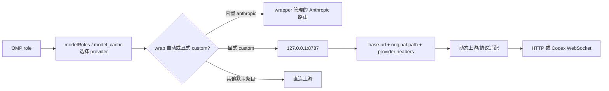

这页综合一个迁移结论：单端口不是“所有 provider 自动改到 8787”，而是让已显式配置的 custom provider 共用一个 loopback 入口，再由请求级信息选择真实上游。当前 `headroom wrap omp` 的自动范围、OMP 的模型选择、`models.db` 的派生状态和 Headroom 的生命周期必须分开看；旧路由不能直接当作当前默认值。

## 核心机制

### 1. 单端口路由因果链



| selector / 路由类型 | 默认或历史状态 | 单端口成立条件 | 关键边界 |
| --- | --- | --- | --- |
| 内置 `anthropic` | `headroom wrap omp` 可自动管理 | active wrapped session | 自动范围不等于所有 provider；默认目标仍是 Anthropic 上游 |
| `openai-codex`、`opencode-go` | 当前 `models.db` 条目通常直连 | 需要显式 custom provider 才进入 loopback | wrap 不会自动把普通条目改成 8787 |
| Zhipu / Kimi / MiniMax | 历史迁移中的 custom 路由 | provider 配置、loopback base URL、请求 header 均存在 | 旧 Kimi 目标覆盖可能把无 header 的 Anthropic 请求静默导向错误上游 |
| Codex Responses | 历史显式 custom 路由 | WebSocket 目标与协议保持一致 | 不能用普通 OpenAI Chat Completions 假设覆盖 Responses WebSocket |

### 2. 为什么从多端口收敛到一个入口

- **配置面**：OMP 只需要对需要治理的 provider 声明同一个 loopback base URL；上游 host、原始 path 和协议差异留在请求级路由。
- **运维面**：不再为每个 provider 维护独立代理进程和端口，减少端口冲突与 unit 漂移；代价是单端口故障会影响所有经过它的 provider。
- **协议面**：HTTP Chat Completions、Anthropic Messages 和 Codex Responses WebSocket 不能只靠端口区分，必须保留 provider、原始 path 和协议元数据。
- **生命周期面**：当前推荐由 `headroom wrap omp` 启动并管理 active 代理；旧的常驻服务和手工 `headroom proxy` 只属于迁移背景。

### 3. 三层路由证据

1. **L1 配置层**：区分 wrapper 自动的内置 `anthropic`、`models.db` 直连条目和显式 custom 条目。
2. **L2 协议层**：在 active wrapped session 中，对已声明的 selector 发最小协议请求，确认 loopback 可达、header 透传和协议响应正确。
3. **L3 上游层**：同时观察代理 inbound/outbound 日志、最终 HTTP URL 或 WebSocket `response.completed`；这才证明请求到达预期上游。

## 适用条件

- 多个已明确配置的 provider 需要共享本地代理能力，例如压缩、缓存、协议归一或统一观测。
- 迁移中需要把端口拓扑从 provider 数量解耦，同时保留每个 provider 的 path/协议差异。
- 需要比较“角色选了什么”“请求走了什么入口”“最终到哪台上游”这三种不同问题。
- 能接受 wrapper 会话级生命周期，并在结束后显式清理路由状态。

## 不适用与风险

| 误用 | 结果 | 边界与处理 |
| --- | --- | --- |
| 把 8787 当成全局默认入口 | 直连 role 仍绕过代理，排障结论错误 | 先核对 selector 的 model/cache 条目和是否有 custom 配置 |
| 只验证 `/health` 或 HTTP 200 | 只能证明 loopback 可达，不能证明上游正确 | 做 L2 协议和 L3 最终上游验证 |
| 把旧 provider unit 与 wrapper 同时启用 | 端口争用、旧 header 或旧日志污染 | 日常只使用 `headroom wrap omp`；旧服务只作迁移残留清理对象 |
| 用 HTTP 规则处理 Codex WebSocket | 握手或 Responses 事件失败 | 保留 WebSocket URL、path 和协议完成事件证据 |
| 依赖旧 Kimi/Anthropic 覆盖 | 无 header 请求静默发到错误上游 | 删除遗留覆盖，或使用显式 custom provider 路由 |
| 把代理经过等同于压缩收益 | 短请求显示零 savings 就误判未经过代理 | 分别观察 loopback、代理日志和压缩统计 |
| 把 `models.db` 手工改动当持久化契约 | 当前进程仍持有旧 cache，重启后又被重建 | 将 cache 当派生状态，使用新 wrapped session 验证 |

## 最小验证

```bash
# 当前推荐的会话入口；版本与安装方式以官方 Headroom 文档为准
headroom wrap omp
```

在 wrapped 会话运行期间，另一个终端执行 `headroom doctor` 与 `headroom perf`；随后按 L1 → L2 → L3 顺序检查。只有当 selector 有显式 custom provider 时，才对它做 loopback 和最终上游探测；默认直连 selector 应单独核对其直连上游。会话结束时显式执行 `headroom unwrap omp`，除非明确需要保留代理。

## 证据与不确定性

- **来源事实**：`legacy-headroom-single-port-evolution` 记录多端口到 127.0.0.1:8787 的历史收敛、动态 headers、MiniMax 覆盖、Kimi/Anthropic 目标陷阱和 Codex WebSocket；`legacy-omp-config-and-rules-guide` 区分角色→模型、模型→入口、请求级路由和 wrapper 生命周期；`legacy-omp-headroom-persistence` 说明 `models.db` 是派生 cache。
- **本页综合**：把单端口定义为“显式 custom 路由的共享入口”，并用 L1/L2/L3 分离配置、协议和最终上游证据。
- **未确认项**：wrapper 当前自动覆盖的 provider 集合、header 名称、日志字段、各 provider 的协议适配和 8787 默认值会随 Headroom/OMP 版本变化；历史 Zhipu、Kimi、MiniMax、Codex 路由不是默认承诺。

## 相关页面

- [OMP 配置分层](/note/omp-config-and-rules-guide)
- [Headroom 路由持久化](/note/omp-headroom-persistence)
- [OMP Hook 扩展](/note/omp-hook-extension-guide)
- [LLM wiki pattern](/note/llm-wiki-pattern)
