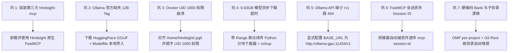

本篇系统归档 Vectorize Hindsight 记忆系统在 Linux 环境下的**运行时本地化部署**（日常推理与记忆存取全离线/本地模型支撑；首次部署与模型权重拉取需联网或提前缓存），以及为终端智能体 **OMP (Oh-My-Pi)** 与 **Codex CLI** 提供跨工具统一记忆支持的落地实践。重点记录环境配置、协议适配、调试过程及 7 大核心“踩坑”经验与预防措施。

---

## 一、系统架构与运行拓扑

整个本地记忆系统由计算底座、记忆中枢与 Agent 接入层三部分构成，所有端口与流量严格限定在本地回路（`127.0.0.1`）：

```mermaid
flowchart TD
  subgraph Agent_Layer["Agent 客户端接入层"]
    OMP["OMP (Oh-My-Pi)<br/>原生 memory.backend: hindsight<br/>+ FastMCP stdio 桥接"]
    Codex["Codex CLI<br/>FastMCP stdio 桥接器<br/>(hindsight-bridge.mjs)"]
  end

  subgraph Hindsight_Core["Hindsight 记忆中枢 (Docker)"]
    API["Hindsight Core (v0.9.1 固定版本)<br/>API: :8888 | UI: :9999<br/>数据持久化: $HOME/.hindsight/data"]
    FastMCP_EP["Streamable FastMCP 端点<br/>/mcp/{project_bank}/"]
    PG0["嵌入式 pg0 (PostgreSQL + pgvector)<br/>事实提取 / 实体图谱 / 向量索引"]
  end

  subgraph Local_Inference["本地推理引擎 (运行时本地)"]
    OLLAMA["GPU LLM: Ollama ROCm (:11434)<br/>模型: gemma4:12b (Q4_K_M GGUF)<br/>硬件: AMD Radeon RX 6800/6900 XT"]
    EMBED["CPU Embedding: Local Provider<br/>模型: BAAI/bge-m3<br/>硬件: Intel CPU (多线程推理)"]
  end

  OMP -->|自动 Recall / Retain / Reflect| API
  OMP -.->|MCP 工具调用| FastMCP_EP
  Codex -->|MCP JSON-RPC (stdio)| FastMCP_EP
  API --> FastMCP_EP
  API --> PG0
  API -->|LLM 事实提取与反思| OLLAMA
  API -->|向量嵌入与重排| EMBED
```

### 核心设计原则

1. **算力精准分工**：
   - **GPU 专注 LLM**：将 12B 参数的 `gemma4:12b`（Q4_K_M）加载到 AMD GPU 显存，专注负责对话中的事实提炼（Fact Extraction）与心智模型合成（Reflection）。
   - **CPU 专注 Embedding**：将 `BAAI/bge-m3` 强制运行在 CPU，避免占用宝贵的 GPU 显存，保障 LLM 上下文推理稳定性。
2. **多项目自适应隔离（Dynamic Workspace Routing）**：
   - 摒弃全局硬编码单一 Bank（如写死 `ulticode`），通过 Git 仓库根目录探测机制自动将不同项目路由至专属 Bank（如 `ulticode`、`resicache`），杜绝上下文污染。
3. **数据全生命周期本地化**：
   - 所有向量、实体关系、转录和模型缓存统一定位至 `$HOME/.hindsight/`。

---

## 二、部署与集成实施步骤

### 1. 持久化目录规划与权限管理

Hindsight 容器内部以非 root 用户 `hindsight`（UID 1000）运行，因此挂载的宿主机目录必须确保 UID 1000 具备写权限：

```bash
mkdir -p ~/.hindsight/data ~/.hindsight/models ~/.hindsight/ollama

# 推荐安全权限配置：将数据与模型目录所属权赋予容器 UID 1000（或设置容器用户组写权限）
sudo chown -R 1000:1000 ~/.hindsight/data ~/.hindsight/models
chmod -R u+rwX,g+rwX ~/.hindsight/data ~/.hindsight/models
```

### 2. Docker Compose 编排配置 (`~/.hindsight/docker-compose.yml`)

> **注意**：在 Compose 文件中，宿主机路径应使用 `${HOME}` 或绝对路径，避免在非交互环境中依赖 Shell 波浪号 `~` 展开。

```yaml
services:
  # GPU LLM 服务：通过 Ollama ROCm 加载模型
  ollama-gpu:
    image: ollama/ollama:rocm
    container_name: hindsight-ollama-gpu
    restart: unless-stopped
    ports:
      - "127.0.0.1:11434:11434"
    environment:
      - HSA_OVERRIDE_GFX_VERSION=10.3.0  # AMD RDNA2 (gfx1030)
      - ROCR_VISIBLE_DEVICES=0
      - OLLAMA_KEEP_ALIVE=-1
    devices:
      - "/dev/kfd:/dev/kfd"
      - "/dev/dri:/dev/dri"
    volumes:
      - ${HOME}/.hindsight/ollama:/root/.ollama
      - ${HOME}/.hindsight/models:/models:ro

  # Hindsight 核心服务端 (Vectorize.io 固定版本)
  hindsight:
    image: ghcr.io/vectorize-io/hindsight:v0.9.1
    container_name: hindsight-server
    restart: unless-stopped
    ports:
      - "127.0.0.1:8888:8888"   # API & MCP 端点
      - "127.0.0.1:9999:9999"   # Web UI 控制台
    environment:
      # --- LLM 驱动 (GPU) ---
      - HINDSIGHT_API_LLM_PROVIDER=ollama
      - HINDSIGHT_API_LLM_BASE_URL=http://ollama-gpu:11434/v1
      - HINDSIGHT_API_LLM_MODEL=gemma4:12b
      # --- Embedding 驱动 (CPU) ---
      - HINDSIGHT_API_EMBEDDINGS_PROVIDER=local
      - HINDSIGHT_API_EMBEDDINGS_LOCAL_MODEL=BAAI/bge-m3
      - HINDSIGHT_API_EMBEDDINGS_LOCAL_FORCE_CPU=true
      # --- 模型权重下载配置（首发拉取需连网，预缓存后可脱网） ---
      - HF_ENDPOINT=https://huggingface.co
      - HINDSIGHT_API_LOG_LEVEL=info
    volumes:
      - ${HOME}/.hindsight/data:/home/hindsight/.pg0
      - ${HOME}/.hindsight/models:/home/hindsight/.cache/huggingface
    depends_on:
      - ollama-gpu
```

### 3. GGUF 模型导入与别名注册

编写 `~/.hindsight/models/Modelfile`：
```dockerfile
FROM /models/gemma-4-12b-it-Q4_K_M.gguf
TEMPLATE """{{ if .System }}<start_of_turn>system
{{ .System }}<end_of_turn>
{{ end }}{{ if .Prompt }}<start_of_turn>user
{{ .Prompt }}<end_of_turn>
{{ end }}<start_of_turn>model
{{ .Response }}<end_of_turn>
"""
PARAMETER stop "<start_of_turn>"
PARAMETER stop "<end_of_turn>"
PARAMETER num_ctx 8192
```

导入并验证：
```bash
docker exec -i hindsight-ollama-gpu ollama create gemma4:12b -f /models/Modelfile
docker exec hindsight-ollama-gpu ollama list
```

### 4. 动态多项目 FastMCP 桥接器 (`~/.hindsight/hindsight-bridge.mjs`)

为解决 stdio 客户端（如 Codex CLI 与 OMP 子代理）连接 HTTP FastMCP，并根据当前 Git 仓库自动路由 Bank，编写通用桥接脚本：

```javascript
#!/usr/bin/env node
/**
 * Dynamic Multi-Project FastMCP Bridge for Hindsight
 * Resolves Git repository root to accurately derive project bank ID even from subdirectories.
 */
import readline from 'node:readline';
import path from 'node:path';
import { execSync } from 'node:child_process';
import fs from 'node:fs';

function findProjectRoot() {
  try {
    const gitRoot = execSync('git rev-parse --show-toplevel', {
      stdio: ['pipe', 'pipe', 'ignore'],
      encoding: 'utf-8',
    }).trim();
    if (gitRoot && fs.existsSync(gitRoot)) return gitRoot;
  } catch {}

  let curr = process.cwd();
  while (curr && curr !== path.dirname(curr)) {
    if (fs.existsSync(path.join(curr, '.git'))) return curr;
    curr = path.dirname(curr);
  }
  return process.cwd();
}

function getDynamicBankId() {
  if (process.env.HINDSIGHT_BANK_ID?.trim()) {
    return process.env.HINDSIGHT_BANK_ID.trim();
  }
  const root = findProjectRoot();
  const baseName = path.basename(root);
  if (!baseName || baseName === '/' || baseName === '.' || baseName === 'root') {
    return 'default';
  }
  return baseName.toLowerCase().replace(/[^a-z0-9_-]/g, '_');
}

const BANK_ID = getDynamicBankId();
const BASE_URL = process.env.HINDSIGHT_API_BASE_URL || 'http://127.0.0.1:8888';
const TARGET_URL = `${BASE_URL.replace(/\/+$/, '')}/mcp/${BANK_ID}/`;

let sessionId = null;

const rl = readline.createInterface({
  input: process.stdin,
  output: process.stdout,
  terminal: false,
});

rl.on('line', async (line) => {
  const trimmed = line.trim();
  if (!trimmed) return;

  try {
    const payload = JSON.parse(trimmed);
    const headers = {
      'Content-Type': 'application/json',
      'Accept': 'application/json, text/event-stream',
    };
    if (sessionId) headers['mcp-session-id'] = sessionId;

    const res = await fetch(TARGET_URL, {
      method: 'POST',
      headers,
      body: JSON.stringify(payload),
    });

    const returnedSessionId = res.headers.get('mcp-session-id');
    if (returnedSessionId) sessionId = returnedSessionId;

    const contentType = res.headers.get('content-type') || '';
    if (contentType.includes('text/event-stream')) {
      const text = await res.text();
      for (const l of text.split('\n')) {
        if (l.startsWith('data:')) {
          const data = l.slice(5).trim();
          if (data && data !== '[DONE]') process.stdout.write(data + '\n');
        }
      }
    } else {
      const json = await res.json();
      process.stdout.write(JSON.stringify(json) + '\n');
    }
  } catch (err) {
    try {
      const parsed = JSON.parse(trimmed);
      if (parsed.id !== undefined) {
        process.stdout.write(
          JSON.stringify({
            jsonrpc: '2.0',
            id: parsed.id,
            error: { code: -32603, message: `Hindsight Bridge Error: ${err.message}` },
          }) + '\n'
        );
      }
    } catch {}
  }
});
```

### 5. OMP 与 Codex 客户端接入配置

> **路径提示**：Node 进程和原生客户端在解析 `args` 路径时不会自动将波浪号 `~` 展开为 Home 目录。实际配置中应使用真实绝对路径（如 `/home/<username>/.hindsight/hindsight-bridge.mjs`）或环境特定变量。

#### OMP 配置 (`~/.omp/agent/config.yml` 与 `~/.omp/agent/mcp.json`)
```yaml
# config.yml
memory:
  backend: hindsight

hindsight:
  apiUrl: http://127.0.0.1:8888
  scoping: per-project                  # 按项目自动分配独立 Bank，与 Codex 镜像对齐
  autoRecall: true                      # 会话首轮自动查询并注入记忆
  autoRetain: true                      # 会话结束自动提炼沉淀
  mentalModelsEnabled: true             # 启用心智模型
  mentalModelAutoSeed: true             # 自动生成种子心智模型
  recallBudget: mid

autolearn:
  enabled: true
  autoContinue: true
```

```json
// mcp.json (请将 <USER_HOME> 替换为实际绝对路径，例如 /home/user)
{
  "mcpServers": {
    "hindsight": {
      "type": "stdio",
      "command": "node",
      "args": ["<USER_HOME>/.hindsight/hindsight-bridge.mjs"]
    }
  }
}
```

#### Codex 配置 (`~/.codex/config.toml`)
```toml
# config.toml (请将 <USER_HOME> 替换为实际绝对路径，例如 /home/user)
[mcp_servers.hindsight]
command = "node"
args = [
    "<USER_HOME>/.hindsight/hindsight-bridge.mjs",
]

[mcp_servers.hindsight.env]
HINDSIGHT_API_BASE_URL = "http://127.0.0.1:8888"
# 注：不硬编码 HINDSIGHT_BANK_ID，由 bridge 自动按 Git 根目录解析
```

---

## 三、深度踩坑记录与根因排查指南

在本次部署与调优过程中，共排查解决 7 项关键架构与配置缺陷：



### 踩坑 1：误装同名第三方 npm 包（`hindsight-mcp`）
- **错误现象**：使用 `npm install -g hindsight-mcp` 安装后，其 README 显示默认请求 `https://api.hindsight-ai.com`，要求 PAT Token 和 Agent UUID，工具定义为 `create_memory_block` 等，无法对接 Vectorize 开源版。
- **根本原因**：npm 仓库中存在同名第三方遗留包，并非 Vectorize 开源项目官方产物。Vectorize Hindsight 自身内嵌了 FastMCP 服务。
- **解决方案**：彻底卸载该 npm 包，直接利用 Hindsight 服务端内置的 `/mcp/{bank}/` 端点进行连接。
- **预防措施**：引入开源项目周边工具前，先查验官方源码仓库中的导出协议与集成目录（`hindsight-integrations/`）。

---

### 踩坑 2：Ollama 官方公有库不存在 `gemma4:12b` 标签
- **错误现象**：启动 Hindsight 时检查 LLM 连通性报错：
  `APIStatusError (ollama/gemma4:12b): HTTP 404: {"message": "model 'gemma4:12b' not found"}`。
- **根本原因**：Ollama 官方 Registry 当前仅收录了 `gemma4:31b`，12B 版本主要由开源社区（如 `unsloth`、`bartowski`）以 GGUF 格式托管在 HuggingFace 上。
- **解决方案**：从 HuggingFace 仓库（`unsloth/gemma-4-12b-it-GGUF`）拉取 `gemma-4-12b-it-Q4_K_M.gguf`，通过卷挂载与 `Modelfile` 执行 `ollama create gemma4:12b -f /models/Modelfile` 导入。
- **预防措施**：非标准/社区量化模型不要依赖 `ollama pull <tag>`，采用本地 GGUF + Modelfile 本地构建模式最可靠。

---

### 踩坑 3：Rootless Docker 容器挂载卷权限错误（UID 1000）
- **错误现象**：Hindsight 启动失败，容器日志输出：
  `❌ The embedded database directory /home/hindsight/.pg0 is not writable by this container (UID 1000).`
- **根本原因**：Hindsight 镜像出于安全考虑以非 root 用户 `hindsight`（UID 1000）运行，宿主机由 root 或当前用户新建的目录若权限受限，容器内 pg0 数据库进程无法初始化。
- **解决方案**：
  1. 挂载路径必须映射到容器用户的主目录：`${HOME}/.hindsight/data:/home/hindsight/.pg0` 与 `${HOME}/.hindsight/models:/home/hindsight/.cache/huggingface`。
  2. 宿主机将目录所有权配置给 UID 1000：`sudo chown -R 1000:1000 ~/.hindsight/data ~/.hindsight/models`。
- **预防措施**：所有基于非 root 运行的容器镜像，挂载 Host Path 时均须显式校验目标 UID 读写权限，避免盲目使用全局 777。

---

### 踩坑 4：超大模型文件（6.63GB）同步下载超时
- **错误现象**：在 Agent 工具中直接同步执行下载命令，导致 300 秒超时中断，生成孤儿临时文件。
- **根本原因**：大模型权重文件受跨国网络带宽限制耗时较长，同步阻塞式调用容易被进程管理器或 CLI 看门狗强制杀死。
- **解决方案**：编写专用 Python 下载脚本，使用 `urllib.request` 配合 HTTP `Range` 头实现**断点续传**，利用 `nohup python3 ... > download.log 2>&1 &` 后台常驻运行，并通过轮询日志确认完成。
- **预防措施**：超过 1GB 的模型文件拉取一律采用后台守护进程 + 断点续传机制。

---

### 踩坑 5：Ollama API 的 Base URL 路径缺少 `/v1`
- **错误现象**：Hindsight 配置 `HINDSIGHT_API_LLM_BASE_URL=http://ollama-gpu:11434` 时连通失败。
- **根本原因**：Hindsight 内部 `llm_wrapper.py` 对 `ollama` provider 的请求遵循 OpenAI 兼容标准，默认拼接端点基于 `/v1`（即 `http://localhost:11434/v1`）。当使用自定义容器域名时，若不带 `/v1`，会导致路径 404。
- **解决方案**：在 Docker Compose 环境变量中显式指定包含 `/v1` 的 URL：
  `HINDSIGHT_API_LLM_BASE_URL=http://ollama-gpu:11434/v1`。
- **预防措施**：所有通过 OpenAI 兼容协议对接 Ollama 的系统，URL 均显式补齐 `/v1`。

---

### 踩坑 6：FastMCP 协议缺少 Session ID 导致 `Bad Request (-32600)`
- **错误现象**：编写简易 stdio 桥接器时，首包 `initialize` 成功，后续 `tools/list` 或 `tools/call` 报 `Bad Request: Missing session ID`。
- **根本原因**：Hindsight 采用 Streamable FastMCP 架构，在首次 `initialize` 握手成功后，服务端会在响应头返回 `mcp-session-id`。后续的每个 JSON-RPC POST 请求都必须在 HTTP Header 中携带此 Session ID。
- **解决方案**：在 Node.js 桥接器中加入轻量级状态管理：
  ```javascript
  const returnedSessionId = res.headers.get('mcp-session-id');
  if (returnedSessionId) sessionId = returnedSessionId;
  if (sessionId) headers['mcp-session-id'] = sessionId;
  ```
- **预防措施**：实现 HTTP-to-stdio MCP 代理时，必须严格处理并透传握手 Session Header。

---

### 踩坑 7：全局硬编码 Bank 与子目录路由漂移（Subdirectory Drift）
- **错误现象**：
  1. 硬编码 `bank: ulticode` 导致在开发其他项目时产生跨项目事实污染。
  2. 仅依据 `process.cwd()` 提取项目名，当开发者进入项目子目录时，被误判为子目录名，导致记忆分散断裂。
- **根本原因**：单体/多模块（Monorepo）项目的工作目录（CWD）经常处于子模块层级，直接取当前路径名无法代表所属的 Git 仓库实体；且 OMP 的 `per-project-tagged` 模式与 Codex 独立 Bank 存在路由语义偏差。
- **解决方案**：
  1. OMP 配置 `hindsight.scoping: per-project`，使其原生逻辑也是以 Git 根目录为独立 Bank。
  2. 桥接脚本通过 `git rev-parse --show-toplevel` 向上追溯至仓库根目录，以根目录名为 Bank 唯一标识。
- **预防措施**：多项目动态记忆路由必须统一以 **Git 根路径** 为命名锚点，杜绝依赖相对 CWD。

---

## 四、验证结果与实测指标

在多模块子目录执行端到端实测：

```bash
# 1. 跨工具记忆写入 (Codex MCP Bridge -> GPU Fact Extraction)
# 写入: "Backend uses Java 17 and Spring Boot 3.2.5 with three owner services: auth 9101, admin 9102, app 9103."
# 提炼结果: 成功生成 3 条 Fact 实体并完成 BAAI/bge-m3 向量索引

# 2. 跨工具记忆召回 (OMP / Codex Recall)
# 查询: "What port does the auth service use?"
# 结果: 命中 "Backend has three owner services: auth (9101), admin (9102), and app (9103)"
# 指标: Reranker 得分 0.965，语义得分 0.668，检索响应耗时 0.059s
```

---

## 五、开发者速查清单

| 检查项 | 标准状态 | 异常排查命令 |
| :--- | :--- | :--- |
| **GPU 推理容器** | Up (:11434) | `docker logs hindsight-ollama-gpu` |
| **GPU 显存挂载** | `gemma4:12b` (7.1 GB) | `docker exec hindsight-ollama-gpu ollama list` |
| **Hindsight 服务** | Up (:8888, :9999) | `docker logs hindsight-server` |
| **持久化数据** | `$HOME/.hindsight/data` (pg0) | `ls -la ~/.hindsight/data` |
| **通用桥接器** | `node $HOME/.hindsight/hindsight-bridge.mjs` | `grep hindsight ~/.codex/config.toml` |
| **OMP 记忆配置** | `backend: hindsight`, `scoping: per-project` | `omp config get memory` |

---

## 六、会话全流程演进与技术决策链

| 阶段 | 核心任务 | 遇阻与排障细节 | 最终决策与产出 |
| :--- | :--- | :--- | :--- |
| **阶段 1：需求接收与架构设计** | 用户要求完全本地化部署 Hindsight，GPU 跑 Gemma-4 12B，CPU 跑 BGE-M3，为 OMP 与 Codex 统一集成。 | 初始曾尝试寻找是否有第三方 npm 包可直接桥接。 | 确立 Docker Compose 双容器架构：Ollama ROCm (GPU) + Hindsight Core (CPU pg0/BGE-M3)。 |
| **阶段 2：协议去伪存真** | 排查已安装的 `hindsight-mcp` npm 包。 | 发现该包指向 `api.hindsight-ai.com`，要求 PAT Token，是第三方遗留包。 | 果断卸载该包，采用 Vectorize Hindsight 原生 Streamable FastMCP `/mcp/{bank}/` 端点。 |
| **阶段 3：底层容器与模型准备** | 启动 Docker 容器并拉取模型。 | 1. 容器报 UID 1000 无写权限；2. Ollama 官方缺 `gemma4:12b` 标签；3. 6.63GB 模型同步下载超时。 | 1. 赋予目录 UID 1000 读写权限；2. 编写带 Range 断点续传的后台 Python 下载器；3. 通过 Modelfile 成功将 GGUF 导入 Ollama。 |
| **阶段 4：协议栈与通信修复** | 建立 Hindsight 与 Ollama 通信及 Codex 桥接。 | 1. Hindsight 校验 LLM 报 404；2. FastMCP 桥接在第二包报 `Missing session ID (-32600)`。 | 1. BASE_URL 显式补齐 `/v1`；2. 桥接器加入状态机，自动提取并透传 `mcp-session-id` Header。 |
| **阶段 5：记忆隔离与路由架构演进** | 处理 OMP 与 Codex 记忆共享与隔离。 | 发现硬编码 `ulticode` 会导致跨项目污染，而直接使用 `process.cwd()` 会在 `services/app/` 子目录下产生库名漂移。 | 1. OMP 设置 `scoping: per-project`；2. 桥接器优先使用 `git rev-parse --show-toplevel` 追溯根目录。 |
| **阶段 6：废弃临时空间清理与规范归档** | 清理测试残留 Bank，并进行全量沉淀。 | 清理 `codex` 与 `omp` 临时 Bank；按 KB 宪法补充 raw 快照、更新 Index/Log 并跑通所有静态检查。 | 知识库全量验证通过（`pnpm kb:lint`, `pnpm check`, `pnpm build` 全部通过）。 |
