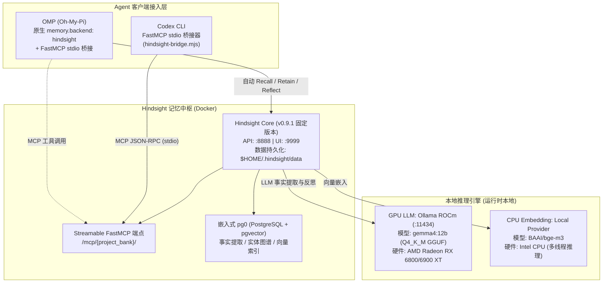

本篇记录 Vectorize Hindsight 记忆系统在 Linux 环境下的**算力分工架构与容器化部署方案**。来源报告日常推理与记忆存取在本地运行，重点解决异构算力协同（GPU LLM + CPU Embedding）、数据持久化权限以及服务生命周期编排；完整离线运行仍需确认所用模型均已缓存且 provider 配置没有外部依赖。

> **适用范围与核验（2026-09-08）**：本文保留 2026-08-17 raw 报告的 v0.9.1 部署。Compose、模型导入命令与健康检查本轮未执行；Ollama 镜像使用可变 `rocm` 标签，驱动、模型 revision/校验和及重排模型未完整固定，不能视为可直接复现的版本锁定方案。模型名与成功运行均为来源报告，当前可用性待核验。

---

## 一、系统架构与运行拓扑

整个本地记忆系统由计算底座、记忆中枢与 Agent 接入层构成。Compose 将宿主机发布端口绑定至 `127.0.0.1`；容器之间则通过 Compose 网络和 `ollama-gpu` 服务名通信，并非所有流量都经过宿主机回环接口。端口绑定本身也不禁止容器向外发起请求。



### 核心设计原则

1. **算力精准分工**：
    - **GPU 专注 LLM**：来源将本地别名 `gemma4:12b` 描述为 12B Q4_K_M 模型，用于事实提炼（Fact Extraction）与反思（Reflection）；模型身份与显存占用需单独确认。
    - **CPU 专注 Embedding**：来源配置 `BAAI/bge-m3` 使用 CPU，意图减少 GPU 显存竞争；这不保证 LLM 在任意上下文长度下稳定运行。
2. **数据全生命周期本地化**：
    - 示例将数据库、Hugging Face 缓存与 Ollama 数据挂载至 `$HOME/.hindsight/`；客户端转录、Docker 日志等不由这些挂载统一管理。重排模型与执行位置未由该 Compose 明确固定。

---

## 二、部署实施步骤

### 1. 持久化目录规划与权限管理

来源记录容器进程使用 UID 1000，挂载目录须对其可写。**容器内非 root 用户不等于 Docker Rootless 模式**；Rootless/user namespace 会改变宿主 UID 映射，见 [Docker Rootless 文档](https://docs.docker.com/engine/security/rootless/)。以下历史赋权命令仅适用于已确认无 UID 重映射、目录为本部署专用且容器 UID/GID 均匹配的情况，不应直接套用到已有共享数据。

```bash
mkdir -p ~/.hindsight/data ~/.hindsight/models ~/.hindsight/ollama

# 安全权限配置：将数据与模型目录所属权赋予容器 UID 1000
sudo chown -R 1000:1000 ~/.hindsight/data ~/.hindsight/models
chmod -R u+rwX,g+rwX ~/.hindsight/data ~/.hindsight/models
```

### 2. Docker Compose 编排配置 (`~/.hindsight/docker-compose.yml`)

宿主机路径使用 `${HOME}` 或绝对路径，避免在非交互环境中依赖 Shell 波浪号 `~` 展开：

```yaml
services:
    # GPU LLM 服务：通过 Ollama ROCm 加载模型
    ollama-gpu:
        image: ollama/ollama:rocm
        container_name: hindsight-ollama-gpu
        restart: unless-stopped
        ports:
            - "127.0.0.1:11434:11434"
        environment:
            - HSA_OVERRIDE_GFX_VERSION=10.3.0 # AMD RDNA2 (gfx1030)
            - ROCR_VISIBLE_DEVICES=0
            - OLLAMA_KEEP_ALIVE=-1
        devices:
            - "/dev/kfd:/dev/kfd"
            - "/dev/dri:/dev/dri"
        volumes:
            - ${HOME}/.hindsight/ollama:/root/.ollama
            - ${HOME}/.hindsight/models:/models:ro

    # Hindsight 核心服务端 (Vectorize.io 固定版本)
    hindsight:
        image: ghcr.io/vectorize-io/hindsight:v0.9.1
        container_name: hindsight-server
        restart: unless-stopped
        ports:
            - "127.0.0.1:8888:8888" # API & MCP 端点
            - "127.0.0.1:9999:9999" # Web UI 控制台
        environment:
            # --- LLM 驱动 (GPU) ---
            - HINDSIGHT_API_LLM_PROVIDER=ollama
            - HINDSIGHT_API_LLM_BASE_URL=http://ollama-gpu:11434/v1
            - HINDSIGHT_API_LLM_MODEL=gemma4:12b
            # --- Embedding 驱动 (CPU) ---
            - HINDSIGHT_API_EMBEDDINGS_PROVIDER=local
            - HINDSIGHT_API_EMBEDDINGS_LOCAL_MODEL=BAAI/bge-m3
            - HINDSIGHT_API_EMBEDDINGS_LOCAL_FORCE_CPU=true
            # --- 模型权重下载配置（首发拉取需连网，预缓存后可脱网） ---
            - HF_ENDPOINT=https://huggingface.co
            - HINDSIGHT_API_LOG_LEVEL=info
        volumes:
            - ${HOME}/.hindsight/data:/home/hindsight/.pg0
            - ${HOME}/.hindsight/models:/home/hindsight/.cache/huggingface
        depends_on:
            - ollama-gpu
```

### 3. GGUF 模型导入与别名注册

编写 `~/.hindsight/models/Modelfile`：

```dockerfile
FROM /models/gemma-4-12b-it-Q4_K_M.gguf
TEMPLATE """{{ if .System }}<start_of_turn>system
{{ .System }}<end_of_turn>
{{ end }}{{ if .Prompt }}<start_of_turn>user
{{ .Prompt }}<end_of_turn>
{{ end }}<start_of_turn>model
{{ .Response }}<end_of_turn>
"""
PARAMETER stop "<start_of_turn>"
PARAMETER stop "<end_of_turn>"
PARAMETER num_ctx 8192
```

导入并验证：

```bash
docker exec -i hindsight-ollama-gpu ollama create gemma4:12b -f /models/Modelfile
docker exec hindsight-ollama-gpu ollama list
```

---

## 三、适用条件与边界

- **硬件边界**：图中 GPU 与 16GB 显存是示例配置，不是通用最低要求或同代 GPU 兼容承诺。实际可用性取决于 GPU 型号、驱动、ROCm/Ollama 版本、量化与上下文长度；本轮未做硬件矩阵验证。
- **网络边界**：宿主机发布端口绑定 `127.0.0.1`，容器间使用内部网络；禁止将无认证的服务直接暴露至公共网络。
- **冷启动要求**：初始模型权重拉取需要外网连接或提前离线缓存至 `~/.hindsight/models`。

---

## 四、最小验证

1. **容器状态检查**：`docker ps` 确认 `hindsight-server` 与 `hindsight-ollama-gpu` 处于 Up 状态。
2. **GPU 显存验证**：`docker exec hindsight-ollama-gpu ollama ps` 确认 `gemma4:12b` 完整加载至 GPU VRAM。
3. **健康检查端点**：`curl -I http://127.0.0.1:8888/health` 返回 HTTP 200。

以上是待执行清单，不是本轮结果。`Up` 仅表示容器运行；`ollama list` 列出本地模型，`ollama ps` 才列出正在运行的模型（[Ollama CLI 文档](https://docs.ollama.com/cli)）。HTTP 健康响应也不能替代模型推理和记忆写入/召回验证。[Compose 启动顺序文档](https://docs.docker.com/compose/how-tos/startup-order/)说明短格式 `depends_on` 不等待服务 ready；须在模型注册及服务就绪后另做端到端验证。

---

## 五、证据与不确定性

- **来源报告**：`hindsight-local-deployment-and-agent-integration` 记录本地部署成功与一次检索；Compose 映射 `/dev/kfd` 与 `/dev/dri`，Hindsight 标签为 v0.9.1。本文未把历史报告升级为本轮运行验证。
- **本页归纳**：将算力切分、目录权限与 Compose 编排沉淀为独立 Concept 规范。
- **未确认项**：不同 Linux 发行版（如 Ubuntu vs Fedora/Arch）下 ROCm 内核驱动安装差异需依宿主机环境调整。

---

## 六、相关页面

- [Hindsight 统一记忆接入：FastMCP 桥接与多项目动态路由](/note/hindsight-omp-codex-integration)
- [Hindsight 记忆系统运行时排障矩阵与失效模式](/note/hindsight-troubleshooting)
- [MCP Codebase Memory 工作流](/note/mcp-codebase-memory-workflow)
