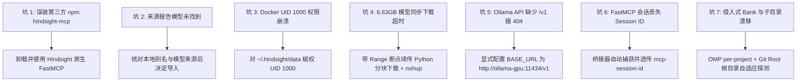

本篇归纳 Vectorize Hindsight 本地部署及 Agent 统一集成过程中的 **7 项历史故障、排查思路与处理记录**，供相近环境定位问题。

> **适用范围与核验（2026-09-08）**：事件来自 2026-08-17 捕获的 Hindsight v0.9.1 raw，实际事件时刻未单独记录。本轮核对原文与官方协议、Docker、Ollama 文档，未执行部署、下载、卸载或记忆写入。下文历史成功与失败属于来源报告，不能推导为当前版本通用规律或生产验证。

---

## 一、7 大典型失效模式与排查矩阵



### 1. 误装同名第三方 npm 包 (`hindsight-mcp`)

- **错误现象**：使用 `npm install -g hindsight-mcp` 安装后，其 README 显示默认请求 `https://api.hindsight-ai.com`、要求 PAT Token 和 Agent UUID，工具定义为 `create_memory_block` 等，无法对接 Vectorize 开源端点。
- **根本原因**：npm 仓库中存在同名第三方遗留包，并非 Vectorize Hindsight 官方产物。Vectorize Hindsight 自身内嵌了 FastMCP 服务。
- **解决方案**：彻底卸载 npm 包，直接利用 Hindsight 服务端内置的 `/mcp/{bank}/` 端点进行连接。
- **预防措施**：引入开源项目周边工具前，先核实官方代码仓库中的导出协议与集成目录（`hindsight-integrations/`）。

<span id="2-ollama-官方仓库不存在-gemma412b-标签"></span>

### 2. 历史请求提示 `gemma4:12b` 未找到

- **错误现象**：启动 Hindsight 检查 LLM 连通性时报错：`ApiStatusError(ollama/gemma4:12b): HTTP 404: {"message": "model 'gemma4:12b' not found"}`。
- **证据边界**：该错误只说明请求的 Ollama 实例找不到这个模型名。raw 报告当时缺少官方标签，但没有 Registry 快照，不能据此断言官方仅有某一规格，也不能推断今天的可用状态。
- **历史处理**：来源记录通过 GGUF 和 Modelfile 创建本地别名 `gemma4:12b`。本地别名可自定义，不证明模型真实架构、参数量或官方身份；原文的文件名与导入步骤保留在[部署页](/note/hindsight-local-deployment)。
- **复现前提**：核对模型卡、来源 revision、许可证、校验和与聊天模板后再选择导入方式。本轮未核实该权重的身份和当前下载地址，不提供新的下载指令。

<span id="3-rootless-docker-容器挂载宿主机卷权限崩溃-uid-1000"></span>

### 3. 非 root 容器进程的挂载卷权限错误 (UID 1000)

- **错误现象**：Hindsight 自动失败，容器日志输出：`[FAIL] The embedded database directory /home/hindsight/.pg0 is not writable by this container (UID 1000).`。
- **根本原因**：Hindsight 镜像出于安全考虑以非 root 用户 `hindsight` (UID 1000) 运行，宿主机自动创建或当前用户新建的目录若仅对容器外有效，容器内 pg0 数据库进程无法初始化。
- **解决方案**：先核对挂载目标、容器进程 UID/GID 和宿主映射，再对专用目录赋权；原文的 `chown 1000:1000` 仅适用于映射已确认的环境。容器以 UID 1000 运行不等于 Docker daemon 使用 Rootless；[Docker Rootless 文档](https://docs.docker.com/engine/security/rootless/)说明它还涉及 user namespace，不能假定宿主 UID 与容器 UID 相同。示例挂载与赋权条件统一见[部署页](/note/hindsight-local-deployment)。
- **预防措施**：所有基于非 root 运行的容器卷镜像，挂载 Host Path 时均须显式核验 UID 或赋予权限，避免盲目使用全局 777。

### 4. 超大型模型文件 (6.63GB) 同步下载超时

- **错误现象**：在 Agent 工具中直接同步执行下载命令，导致 300 秒超时中断，生成孤儿临时文件。
- **根本原因**：大模型权重文件受跨国网络带宽限制耗时较长，同步阻塞式请求极易触发进程管理器或 CLI 客户端超时杀死。
- **解决方案**：编写专用 Python 下载脚本，使用 `urllib.request` 配合 HTTP `Range` 请求头实现断点续传，利用 `nohup python3 ... > download.log 2>&1 &` 后台守护运行。
- **预防措施**：按文件大小、带宽和工具超时预算选择下载方式，1GB 不是通用阈值。历史 `nohup` 方案不等于进程监督服务；断点续传必须确认服务端接受 Range、校验最终文件，不能把错误响应直接追加到权重文件。

### 5. Ollama API 的 Base URL 路径缺少 `/v1`

- **错误现象**：Hindsight 配置 `HINDSIGHT_API_LLM_BASE_URL=http://ollama-gpu:11434` 时连通失败。
- **根本原因**：Hindsight 内部 `llm_wrapper.py` 对 `ollama` provider 的请求遵循 OpenAI 兼容标准，默认拼接端点基于 `/v1`（即 `http://localhost:11434/v1`）。当使用自定义容器域名时，若不带 `/v1`，会导致路径 404。
- **解决方案**：在 Docker Compose 环境变量中显式指定包含 `/v1` 的完整 URL：`HINDSIGHT_API_LLM_BASE_URL=http://ollama-gpu:11434/v1`。
- **预防措施**：按所用 provider/SDK 的 URL 拼接规则核对实际请求路径；本文 `/v1` 是来源环境的修复记录，不能给所有客户端盲目追加。

### 6. FastMCP 协议缺少 Session ID 导致 `Bad Request (-32600)`

- **错误现象**：编写简易 stdio 桥接器时，首包 `initialize` 成功，后续 `tools/list` 或 `tools/call` 报 `Bad Request: Missing session ID`。
- **根本原因**：Hindsight 采用 Streamable FastMCP 架构，在首次 `initialize` 握手成功后，服务端在响应头返回 `mcp-session-id`。后续每个 JSON-RPC POST 请求都必须在 HTTP Header 中透传此 Session ID。
- **解决方案**：在 Node.js 桥接器中加入轻量级状态管理：首次响应提取并保存 `mcp-session-id`，后续请求带入。
- **预防措施**：按 [MCP 2025-06-18 transport 规范](https://modelcontextprotocol.io/specification/2025-06-18/basic/transports)，服务端可以分配 Session ID，返回后客户端才必须在后续请求携带。透传 header 只是完整协议的一部分；历史桥接器的 SSE、通知与会话恢复缺口见[接入页](/note/hindsight-omp-codex-integration#示例的协议缺口)。

### 7. 全局硬编码 Bank 与子目录路由漂移 (Subdirectory Drift)

- **错误现象**：硬编码 `bank: ulticode` 导致在开发其他项目时产生跨项目事实污染；仅依据 `process.cwd()` 提取项目名，当开发者进入项目子目录时，被误判为子目录名，导致记忆分割断裂。
- **根本原因**：单体/多模块 (Monorepo) 项目的工作目录 (CWD) 经常处于子模块深层，直接取当前路径名无法代表所属的 Git 仓库实体；且 OMP 的 `per-project-tagged` 模式与 Codex 独立 Bank 存在路由语义偏差。
- **历史处理**：来源配置 OMP `hindsight.scoping: per-project`，桥接器取 Git 根目录 basename 生成 Bank。此做法解决同一 Git 仓库的子目录漂移，但同名仓库及字符归一化仍可撞名，不能称为唯一标识。
- **预防措施**：核对两客户端的实际 Bank，必要时显式分配不同 ID。非 Git 回退与逻辑隔离边界统一见[接入页](/note/hindsight-omp-codex-integration)。

---

## 二、快速健康检查 SOP

开发者排障时可依次执行以下命令排查基础设施与 Agent 状态：

```bash
# 1. 检查 GPU 推理容器状态
docker logs hindsight-ollama-gpu | tail -n 20

# 2. 列出运行中的模型与加载信息（模型须已加载）
docker exec hindsight-ollama-gpu ollama ps

# 3. 检查 Hindsight 核心服务端日志与健康状态
docker logs hindsight-server | tail -n 20
curl -I http://127.0.0.1:8888/health

# 4. 检查持久化数据目录 UID 归属
ls -la ~/.hindsight/data/

# 5. 仅检查桥接脚本语法，不启动或证明握手成功
node --check ~/.hindsight/hindsight-bridge.mjs
```

---

`ollama list` 仅列出本地模型，`ollama ps` 列出正在运行的模型，参见 [Ollama CLI 文档](https://docs.ollama.com/cli)。直接启动 stdio 脚本后等待输入并不代表通过验证；完整检查应包含 initialize、通知、tools/list 及目标 Bank 的受控写入/召回，本轮未执行。

## 三、6 阶段全流程演进与技术决策总结

以下表格保留来源叙事；其中模型标签缺失、下载成功、临时 Bank 清理与检查通过均为当时报告，未由本轮重新证实。

| 阶段 | 核心任务 | 遇到的违例与故障排查 | 最终解决与产出 |
| :--- | :--- | :--- | :--- |
| **阶段 1：需求接收与架构设计** | 用户要求完全本地化部署 Hindsight，GPU 跑 Gemma-4 12B，CPU 跑 BGE-M3，为 OMP 与 Codex 统一集成。 | 初始曾尝试寻找是否有第三方 npm 包可直接桥接。 | 确立 Docker Compose 双容器架构（Ollama ROCm (GPU) + Hindsight Core (CPU pg0/BGE-M3)）。 |
| **阶段 2：拨云去伪存真** | 排查已安装的 `hindsight-mcp` npm 包。 | 发现该包指向 `api.hindsight-ai.com`，要求 PAT Token，是第三方遗留包。 | 果断卸载该包，采用 Vectorize Hindsight 原生 Streamable FastMCP `/mcp/{bank}/` 端点。 |
| **阶段 3：底层容器与模型准备** | 启动 Docker 容器并拉取模型。 | 1. 容器因 UID 1000 无写权限崩溃；2. Ollama 官方缺 `gemma4:12b` 标签；3. 6.63GB 模型同步下载超时。 | 1. 赋予目录 UID 1000 读写权限；2. 编写带有 Range 断点续传的后台 Python 下载器；3. 通过 Modelfile 成功构建 GGUF 导入 Ollama。 |
| **阶段 4：通信信道统一** | 建立 Hindsight 与 Ollama 通信及 Codex 桥接。 | 1. Hindsight 检验 LLM 报 404；2. FastMCP 桥接在握手后报 `Missing session ID (-32600)`。 | 1. BASE_URL 参数补齐 `/v1`；2. 桥接器加入状态机，自动捕获并透传 `mcp-session-id` Header。 |
| **阶段 5：记忆隔离与路由演进** | 处理 OMP 与 Codex 记忆共享与隔离。 | 发现硬编码 `ulticode` 会导致跨项目污染，而直接使用 `process.cwd()` 会在 `/services/app/` 子目录下产生库名漂移。 | 1. OMP 设置 `scoping: per-project`；2. 桥接器统一使用 `git rev-parse --show-toplevel` 追溯根目录。 |
| **阶段 6：废弃临时空间清理与规范归档** | 清理测试残留 Bank，并进行全量验证。 | 清理 `codex` 与 `omp` 临时 Bank；按 KB 宪法补充 raw 快照、更新 Index/Log 并跑通所有静态检查。 | 知识库全量验证通过（`pnpm kb:lint`, `pnpm check`, `pnpm build` 全部通过）。 |

---

## 四、证据与不确定性

- **来源事实**：`hindsight-local-deployment-and-agent-integration` raw 记录了 7 项排障日志、Docker 状态、Session ID 握手特征与 Git toplevel 脚本验证。
- **本页归纳**：将排障日志与经验提炼为标准失效模式矩阵与决策演进表。
- **未确认项**：Streamable HTTP 已支持 SSE，并非等待未来升级才出现；历史桥接器是否能处理实际服务的长连接与完整事件格式尚未实测。模型 provenance、客户端版本与非默认部署环境亦需补证。

---

## 五、相关页面

- [Hindsight 本地算力分工与 Docker 容器化部署](/note/hindsight-local-deployment)
- [Hindsight 统一记忆接入：FastMCP 桥接与多项目动态路由](/note/hindsight-omp-codex-integration)
- [OMP Hook 扩展指南](/note/omp-hook-extension-guide)
