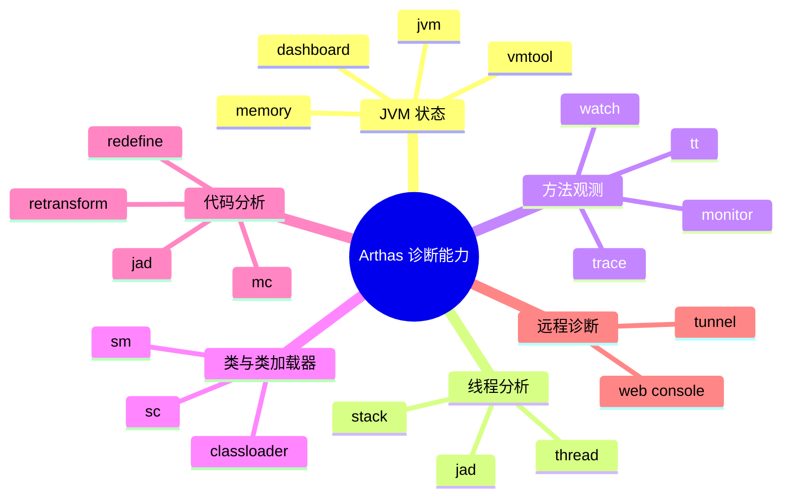
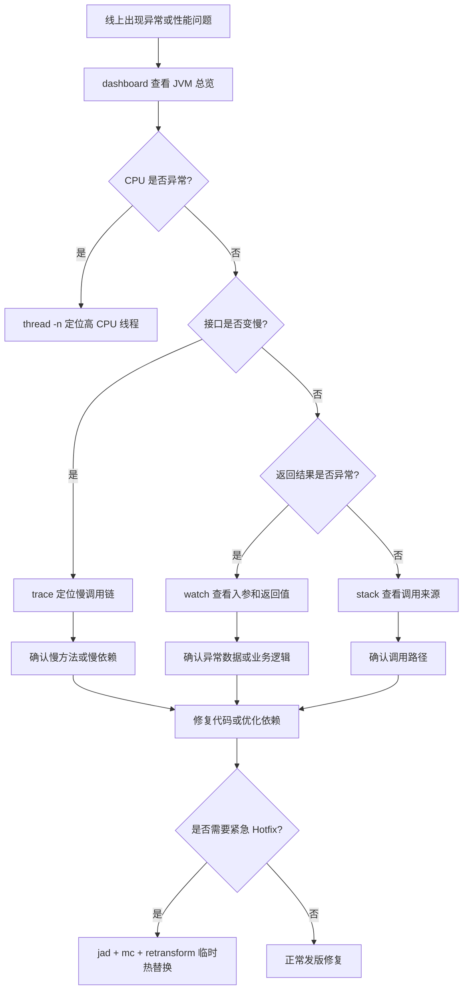
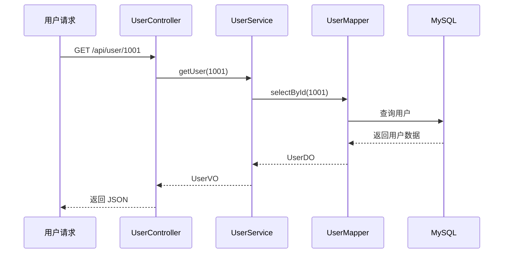
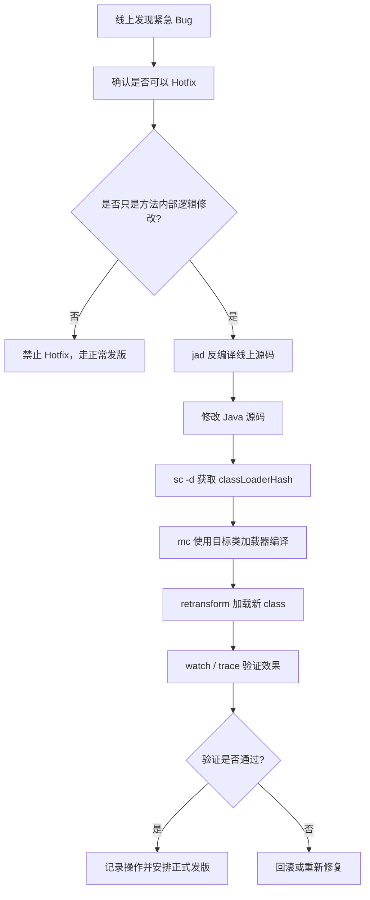
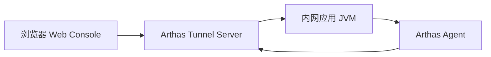
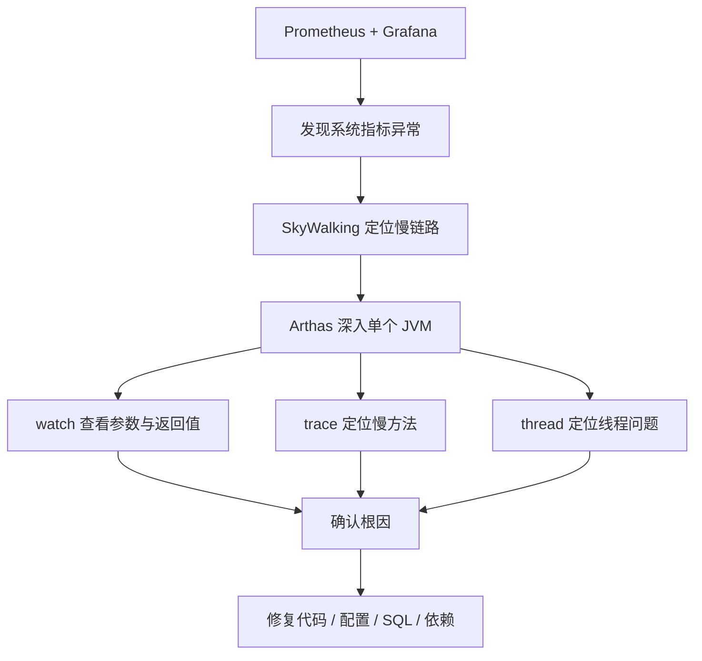
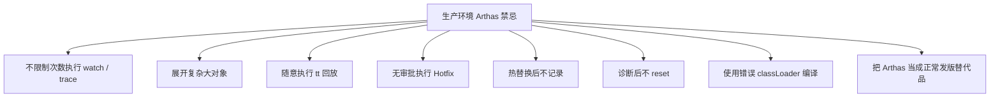
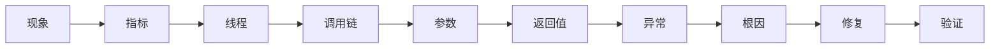

# Arthas 实战：从入门到线上代码热替换

## 一、引言：为什么 Java 线上排查离不开 Arthas？

在 Java 线上环境中，最痛苦的问题往往不是“代码写错了”，而是：

* 线上没有完整调试环境；
* 日志没有打到关键位置；
* 问题只在特定流量下偶现；
* 服务不能随便重启；
* `jstack`、`jmap` 只能提供静态快照，很难观察动态调用过程。

传统 JVM 工具虽然强大，但更偏向“事后分析”。而 Arthas 的价值在于：
**它可以直接进入正在运行的 JVM，对方法调用、参数、返回值、异常、耗时、类加载、线程状态进行实时观测。**

一句话概括：

> Arthas 是 Java 线上问题排查的“显微镜 + 手术刀”。

---

## 二、Arthas 能解决什么问题？

Arthas 不是单纯的 JVM 工具，它更像一个线上诊断平台。



### 常见适用场景

| 场景           | 传统排查方式               | Arthas 方式                      |
| ------------ | -------------------- | ------------------------------ |
| 接口突然变慢       | 查日志、看监控、猜测 SQL 或 RPC | `trace` 直接定位慢方法                |
| 参数异常         | 加日志、重新发版             | `watch` 实时观察入参                 |
| 返回值不符合预期     | Debug 或补日志           | `watch` 查看返回对象                 |
| 线上抛异常但日志不足   | 搜索异常堆栈               | `watch -e` 捕获异常                |
| CPU 飙高       | `top` + `jstack`     | `thread -n` 快速定位热点线程           |
| 线上代码逻辑有小 bug | 发版重启                 | `jad + mc + retransform` 临时热修复 |

---

## 三、Arthas 整体排查流程

线上问题不要一上来就 `watch` 或 `trace`，推荐按照“由粗到细”的顺序排查。



---

## 四、基础命令速查

Arthas 命令很多，但实战中最常用的是下面这一批。

| 命令            | 作用              | 典型用途            |
| ------------- | --------------- | --------------- |
| `dashboard`   | 查看 JVM 实时状态     | CPU、内存、GC、线程总览  |
| `thread`      | 查看线程状态          | 排查 CPU 飙高、死锁、阻塞 |
| `jad`         | 反编译线上类          | 查看当前运行代码        |
| `sc`          | Search Class    | 查找类信息、类加载器      |
| `sm`          | Search Method   | 查找方法签名          |
| `watch`       | 观察方法入参、返回值、异常   | 排查业务数据异常        |
| `trace`       | 追踪方法内部调用耗时      | 定位慢接口           |
| `stack`       | 查看方法调用栈         | 找到谁调用了这个方法      |
| `monitor`     | 方法调用统计          | 统计 QPS、成功率、平均耗时 |
| `tt`          | Time Tunnel     | 记录方法调用现场，支持回放   |
| `classloader` | 查看类加载器          | 解决类加载、编译、热替换问题  |
| `mc`          | Memory Compiler | 在线编译 Java 文件    |
| `retransform` | 重新转换类字节码        | 线上热替换           |

---

## 五、核心命令进阶：OGNL 的威力

Arthas 的强大很大程度来自 OGNL。

OGNL 全称是 **Object-Graph Navigation Language**，可以理解为：

> 一种能在运行时访问 Java 对象属性、方法、集合、数组的表达式语言。

在 Arthas 中，OGNL 常用于：

* 查看方法参数；
* 查看返回值；
* 查看异常对象；
* 过滤特定请求；
* 访问对象字段；
* 调用对象方法；
* 组合输出复杂结构。

---

## 六、Watch：不仅仅是“看参数”

`watch` 是 Arthas 中最常用的命令之一，适合观察方法的：

* 入参；
* 返回值；
* 异常；
* 当前对象；
* 方法耗时。

### 1. 基础语法

```bash
watch 类名 方法名 表达式 条件
```

示例：

```bash
watch com.example.UserService getUser "{params, returnObj}" -x 2
```

含义：

* `params`：方法参数；
* `returnObj`：方法返回值；
* `-x 2`：对象展开深度为 2。

---

### 2. 观察入参与返回值

```bash
watch com.example.OrderService createOrder "{params, returnObj}" -x 3 -n 5
```

说明：

* `-x 3`：展开 3 层对象；
* `-n 5`：只观察 5 次，避免线上刷屏。

---

### 3. 只观察异常

```bash
watch com.example.UserService getUser "{params, throwExp}" -e -x 2 -n 5
```

说明：

* `-e`：只在方法抛异常时触发；
* `throwExp`：异常对象。

---

### 4. 按耗时过滤

```bash
watch com.example.OrderService createOrder "{params, returnObj}" "#cost > 100" -x 2 -n 5
```

含义：
只观察耗时超过 `100ms` 的调用。

---

### 5. 按参数过滤

假设方法参数是一个对象，并且第一个参数有 `id` 字段：

```bash
watch com.example.UserService updateUser "{params, returnObj}" "params[0].id == 1001" -x 3 -n 5
```

含义：
只观察 `id = 1001` 的请求。

---

### 6. 访问对象字段

```bash
watch com.example.UserService getUser "target.userCache" -x 2 -n 5
```

说明：

* `target`：当前实例对象；
* `target.userCache`：访问实例字段。

---

## 七、Trace：定位慢接口的真正瓶颈

`trace` 用于追踪方法内部调用链耗时。
当接口慢但日志看不出原因时，`trace` 非常有用。

### 1. 基础示例

```bash
trace com.example.OrderController createOrder -n 5
```

输出通常类似：

```text
`---ts=2026-02-25 10:00:00;thread_name=http-nio-8080-exec-1;id=25;is_daemon=true;priority=5;TCCL=...
    `---[320.112ms] com.example.OrderController:createOrder()
        +---[12.331ms] com.example.OrderService:checkParam()
        +---[250.442ms] com.example.OrderService:saveOrder()
        +---[45.221ms] com.example.PaymentClient:prePay()
```

从结果可以快速看出：

```text
OrderService.saveOrder() 耗时 250ms，是主要瓶颈。
```

---

### 2. 只看慢请求

```bash
trace com.example.OrderController createOrder '#cost > 200' -n 5
```

含义：
只追踪耗时超过 `200ms` 的请求。

---

### 3. 追踪 JDK 方法

默认情况下，Arthas 会跳过 JDK 方法。
如果需要观察 JDK 内部调用，可以加：

```bash
trace com.example.OrderController createOrder '#cost > 200' --skipJDKMethod false -n 5
```

注意：
生产环境慎用，JDK 方法调用链可能非常长。

---

## 八、Stack：谁调用了这个方法？

有时候我们知道某个方法被调用了，但不知道是谁调用的。
这时可以使用 `stack`。

```bash
stack com.example.UserService getUser -n 5
```

适合排查：

* 某个方法为什么被频繁调用；
* 某段逻辑是从哪个入口进来的；
* 定时任务、异步线程、消息消费是否触发了异常逻辑。

---

## 九、Monitor：统计方法调用情况

`monitor` 适合观察某个方法在一段时间内的调用统计。

```bash
monitor com.example.OrderService createOrder -c 5
```

含义：
每 5 秒统计一次方法调用情况。

典型输出包含：

| 字段        | 含义   |
| --------- | ---- |
| timestamp | 统计时间 |
| class     | 类名   |
| method    | 方法名  |
| total     | 调用次数 |
| success   | 成功次数 |
| fail      | 失败次数 |
| avg-rt    | 平均耗时 |
| fail-rate | 失败率  |

适合判断：

* 某方法是否正在被大量调用；
* 失败率是否异常；
* 平均耗时是否突然升高。

---

## 十、TT：记录现场，回放调用

`tt` 是 Time Tunnel 的缩写，可以记录方法调用现场。

### 1. 记录方法调用

```bash
tt -t com.example.UserService getUser -n 5
```

### 2. 查看记录列表

```bash
tt -l
```

### 3. 查看某次调用详情

```bash
tt -i 1000
```

### 4. 重新调用一次

```bash
tt -i 1000 -p
```

注意：
`tt -p` 会重新执行方法，生产环境要非常谨慎。
如果方法涉及写库、扣库存、发消息、发券等副作用，不建议回放。

---

## 十一、线上排查实战：接口返回值异常

### 场景

线上用户反馈：

> 查询用户信息接口返回的昵称为空，但数据库中明明有昵称。

目标接口：

```text
GET /api/user/1001
```

对应方法：

```java
com.example.UserService#getUser
```

---

### 排查步骤



### 1. 观察入参和返回值

```bash
watch com.example.UserService getUser "{params, returnObj}" "params[0] == 1001" -x 3 -n 5
```

如果发现：

```text
params[0] = 1001
returnObj.nickname = null
```

说明问题可能出在：

* 数据库查询结果为空；
* DO 转 VO 时字段丢失；
* 业务代码主动置空；
* 序列化前被拦截或处理。

---

### 2. 追踪内部调用

```bash
trace com.example.UserService getUser '#cost > 0' -n 5
```

如果输出显示：

```text
+---[5ms] UserMapper.selectById()
+---[1ms] UserConverter.toVO()
```

下一步可以观察转换方法：

```bash
watch com.example.UserConverter toVO "{params, returnObj}" -x 3 -n 5
```

如果 `params[0].nickname` 有值，但 `returnObj.nickname` 为空，基本可以确认是转换逻辑问题。

---

## 十二、高级实战：线上代码热替换 Hotfix

Arthas 最危险、也最强大的能力之一，就是在线热替换代码。

它可以在不重启服务的情况下，将修改后的 `.class` 加载进正在运行的 JVM。

但必须明确：

> Arthas Hotfix 更适合临时止血，不应该替代正常发版流程。

---

## 十三、Hotfix 适用边界

### 适合使用 Hotfix 的场景

| 场景         | 是否适合 |
| ---------- | ---- |
| 增加简单非空判断   | 适合   |
| 修改简单条件判断   | 适合   |
| 修正明显写错的常量  | 适合   |
| 临时屏蔽某个异常分支 | 谨慎适合 |
| 修改方法内部少量逻辑 | 谨慎适合 |

### 不适合使用 Hotfix 的场景

| 场景        | 原因                |
| --------- | ----------------- |
| 新增字段      | JVM 已加载类结构不支持随意变更 |
| 新增方法      | 容易失败或行为不可控        |
| 修改方法签名    | 调用方不匹配            |
| 修改继承关系    | 类结构变化风险极高         |
| 大范围业务重构   | 不可控               |
| 涉及事务边界变化  | 可能造成数据不一致         |
| 涉及多服务协议变化 | 上下游不兼容            |

---

## 十四、Hotfix 流程图



---

## 十五、Hotfix 实战：修复 NullPointerException

### 场景

线上代码存在空指针风险：

```java
public String getUserName(User user) {
    return user.getName().trim();
}
```

当 `user` 或 `user.getName()` 为空时，会抛出 `NullPointerException`。

目标：
临时增加非空校验。

---

### 第一步：反编译线上代码

```bash
jad --source-only com.example.UserService > /tmp/UserService.java
```

说明：
必须以线上 JVM 当前运行的代码为准，不能直接拿本地代码盲改。

---

### 第二步：修改源码

修改 `/tmp/UserService.java`：

```java
public String getUserName(User user) {
    if (user == null || user.getName() == null) {
        return "";
    }
    return user.getName().trim();
}
```

---

### 第三步：查找类加载器

```bash
sc -d com.example.UserService
```

重点关注输出中的：

```text
classLoaderHash   xxxxxxxx
```

也可以使用：

```bash
sc -d com.example.UserService | grep classLoaderHash
```

---

### 第四步：使用 mc 编译

```bash
mc -c <classLoaderHash> /tmp/UserService.java -d /tmp
```

说明：

* `-c`：指定类加载器；
* `/tmp/UserService.java`：修改后的源码；
* `-d /tmp`：输出编译后的 `.class` 文件。

---

### 第五步：加载新字节码

```bash
retransform /tmp/com/example/UserService.class
```

`retransform` 成功后，新的方法逻辑会在当前 JVM 中生效。

---

### 第六步：验证修复效果

```bash
watch com.example.UserService getUserName "{params, returnObj, throwExp}" -x 2 -n 5
```

验证重点：

* 是否还抛出 `NullPointerException`；
* 返回值是否符合预期；
* 是否影响正常用户请求。

---

## 十六、Hotfix 回滚方案

线上热替换一定要准备回滚方案。

### 方案一：使用原始 class 重新 retransform

如果你提前备份了原始 `.class`：

```bash
retransform /tmp/backup/com/example/UserService.class
```

### 方案二：重新发版覆盖

最稳妥的方式是：

1. 将 Hotfix 修复同步到代码仓库；
2. 走正常测试流程；
3. 重新发布服务；
4. 覆盖 Arthas 临时变更。

### 方案三：重启服务

Arthas 热替换只影响当前 JVM 内存中的类。
如果没有持久修改代码，服务重启后会恢复到原始版本。

---

## 十七、retransform 与 redefine 对比

| 维度       | retransform | redefine |
| -------- | ----------- | -------- |
| 推荐程度     | 更推荐         | 较少使用     |
| 是否支持多次修改 | 支持度更好       | 容易受限制    |
| 使用体验     | 更稳定         | 风险更高     |
| 适用场景     | 方法内部逻辑修复    | 简单类重定义   |
| 生产建议     | 谨慎使用        | 更谨慎使用    |

一般建议：

```text
优先使用 retransform，避免频繁使用 redefine。
```

---

## 十八、远程诊断：Arthas Tunnel

在真实企业环境中，很多服务器处于内网，无法直接 SSH 登录。
这时可以使用 Arthas Tunnel 做远程诊断。



### 1. 启动 Tunnel Server

在公网可访问的机器上启动：

```bash
java -jar arthas-tunnel-server.jar
```

默认端口通常包括：

```text
7777: WebSocket 通信
8080: Web 控制台
```

实际端口以你的启动配置为准。

---

### 2. 客户端连接 Tunnel Server

在目标应用机器上执行：

```bash
java -jar arthas-boot.jar \
  --tunnel-server 'ws://public-ip:7777/ws' \
  --agent-id my-app-001
```

参数说明：

| 参数                | 含义               |
| ----------------- | ---------------- |
| `--tunnel-server` | Tunnel Server 地址 |
| `--agent-id`      | 当前应用实例 ID        |
| `my-app-001`      | 自定义实例标识          |

---

### 3. Web 界面管理多个实例

通过 Arthas Web Console，可以选择不同 `agent-id` 的应用实例进行诊断。

适合场景：

* 多台服务器统一诊断；
* 容器环境排查；
* 内网机器无法直接 SSH；
* 运维统一管理 Java 进程。

---

## 十九、Arthas 与常见监控工具对比

| 维度          | Arthas      | SkyWalking  | Prometheus + Grafana |
| ----------- | ----------- | ----------- | -------------------- |
| 核心定位        | 单 JVM 深度诊断  | 分布式链路追踪     | 指标监控与告警              |
| 定位粒度        | 方法级、对象级、线程级 | 服务级、接口级、链路级 | 指标级、实例级              |
| 时效性         | 实时交互        | 准实时         | 准实时                  |
| 侵入性         | 低，按需增强      | 低，需要 Agent  | 中，需要 Exporter 或埋点    |
| 使用方式        | 临时排查        | 长期观测        | 长期监控                 |
| 适合问题        | 线上疑难杂症      | 链路慢、服务依赖异常  | CPU、内存、QPS、错误率       |
| 是否适合 Hotfix | 支持          | 不支持         | 不支持                  |

---

## 二十、三类工具如何配合使用？



推荐组合：

```text
Prometheus + Grafana：负责发现问题
SkyWalking：负责定位链路
Arthas：负责深入 JVM 内部确认根因
```

---

## 二十一、生产环境最佳实践

### 1. watch / trace 必须限制次数

生产环境强烈建议带 `-n`：

```bash
watch com.example.OrderService createOrder "{params, returnObj}" -x 2 -n 5
```

不要直接执行：

```bash
watch com.example.OrderService createOrder "{params, returnObj}" -x 5
```

原因：

* 高并发下输出量巨大；
* 可能造成终端卡死；
* 可能带来额外 CPU 和 I/O 开销；
* 展开层级过深可能触发大量对象访问。

---

### 2. 控制对象展开深度

建议：

| 场景     | 推荐展开深度 |
| ------ | ------ |
| 简单参数   | `-x 1` |
| 普通 DTO | `-x 2` |
| 嵌套对象   | `-x 3` |
| 复杂对象图  | 谨慎使用   |

不要轻易使用过大的 `-x`。

---

### 3. OGNL 表达式尽量简单

不推荐：

```bash
watch com.example.Service method "params[0].getA().getB().getC().getD().calculate()" -x 5
```

推荐：

```bash
watch com.example.Service method "{params[0].id, params[0].status}" -x 2 -n 5
```

原则：

```text
线上观察只看必要字段，不做复杂计算。
```

---

### 4. 诊断结束后及时 reset

Arthas 的增强逻辑会停留在 JVM 中。
诊断结束后建议执行：

```bash
reset
```

或者退出时：

```bash
stop
```

区别：

| 命令      | 作用                     |
| ------- | ---------------------- |
| `reset` | 重置所有增强类                |
| `stop`  | 关闭 Arthas Server，并重置增强 |

---

### 5. 避免在高峰期执行高成本命令

以下命令在生产环境要谨慎：

| 命令            | 风险          |
| ------------- | ----------- |
| `trace`       | 调用链过长时开销较大  |
| `watch -x 5`  | 对象展开过深      |
| `tt -t`       | 记录调用现场，占用内存 |
| `tt -p`       | 可能重复执行业务逻辑  |
| `heapdump`    | 可能造成磁盘和内存压力 |
| `retransform` | 修改线上代码，风险高  |

---

## 二十二、生产环境禁忌清单



### 禁忌总结

1. 不要在生产高峰期无脑 `trace`。
2. 不要对大对象使用过深的 `-x`。
3. 不要对有副作用的方法执行 `tt -p`。
4. 不要在没有备份的情况下做 Hotfix。
5. 不要热替换新增字段、方法、继承关系。
6. 不要忘记执行 `reset` 或 `stop`。
7. 不要把 Arthas 当成长期修复方案。

---

## 二十三、常用命令模板

### 1. 查看 JVM 总览

```bash
dashboard
```

### 2. 查看高 CPU 线程

```bash
thread -n 5
```

### 3. 查看某线程堆栈

```bash
thread <threadId>
```

### 4. 反编译类

```bash
jad com.example.UserService
```

### 5. 查找类

```bash
sc -d com.example.UserService
```

### 6. 查找方法

```bash
sm -d com.example.UserService
```

### 7. 观察方法入参和返回值

```bash
watch com.example.UserService getUser "{params, returnObj}" -x 2 -n 5
```

### 8. 只观察异常

```bash
watch com.example.UserService getUser "{params, throwExp}" -e -x 2 -n 5
```

### 9. 按耗时过滤

```bash
watch com.example.UserService getUser "{params, returnObj}" "#cost > 100" -x 2 -n 5
```

### 10. 追踪慢方法

```bash
trace com.example.UserController getUser '#cost > 200' -n 5
```

### 11. 查看调用来源

```bash
stack com.example.UserService getUser -n 5
```

### 12. 方法调用统计

```bash
monitor com.example.UserService getUser -c 5
```

### 13. 重置增强

```bash
reset
```

### 14. 停止 Arthas

```bash
stop
```

---

## 二十四、Arthas 排查方法论

Arthas 不是让我们“乱试命令”，而是形成一套稳定的问题定位方法。



推荐排查顺序：

1. 先看现象：接口慢、报错、CPU 高、内存高。
2. 再看指标：`dashboard`、监控平台。
3. 再看线程：`thread -n`。
4. 再看调用链：`trace`。
5. 再看数据：`watch`。
6. 再看调用来源：`stack`。
7. 最后决定：正常发版、配置调整、SQL 优化、临时 Hotfix。

---

## 二十五、总结

Arthas 的价值不只是“能看线上参数”，而是帮助我们建立一种更强的线上排查能力。

它可以完成：

* 用 `dashboard` 查看 JVM 整体状态；
* 用 `thread` 定位高 CPU 线程；
* 用 `trace` 找到慢接口中的慢方法；
* 用 `watch` 查看入参、返回值和异常；
* 用 `stack` 找到方法调用来源；
* 用 `jad` 确认线上真实代码；
* 用 `mc + retransform` 完成紧急 Hotfix；
* 用 Tunnel 实现远程 JVM 诊断。

但同时也要记住：

> Arthas 是线上诊断工具，不是替代发版系统的万能补丁工具。

真正成熟的使用方式是：

```text
监控发现问题 → 链路定位范围 → Arthas 深入 JVM → 确认根因 → 临时止血 → 正式发版修复
```

掌握 Arthas，不只是多会几个命令，而是从“只能写代码”进阶为“能定位问题、能处理事故、能守住线上稳定性”的 Java 工程师。