# 从一面到二面：Java 后端实习面试复盘

> **一句话总结：** 一面验证“项目是不是你做的”，二面判断“你有没有把项目带到生产环境的意识”。

这篇文章基于两轮 Java 后端实习面试复盘整理而成。它不只是面试题清单，而是一次从“能跑项目”到“能讲工程化”的能力升级梳理。

如果你正在准备 Java 后端实习、校招，或者正在把自己的项目包装成简历亮点，这篇文章可以帮助你回答三个核心问题：

1. 面试官到底在追问什么？
2. 项目怎么讲才不像“堆技术栈”？
3. 如何把 Redis、Docker、Kafka、WebSocket、JVM 排障讲出工程化味道？

---

## 1. 面试全景：一面和二面的差异

两轮面试的差异非常明显：

- **一面更关注基础与真实性**：项目是不是自己写的？核心流程能不能讲清？Java 集合、缓存、Docker 是否真的理解？
- **二面更关注工程化与生产意识**：为什么这样设计？失败怎么办？线上怎么排查？有没有监控、告警、重试、降级？

| 维度 | 一面 | 二面 | 变化趋势 |
|---|---|---|---|
| 面试时长 | 约 30 分钟 | 约 45 分钟 | 二面追问更深 |
| 面试风格 | 验证项目真实性 | 考察工程化潜力 | 从“做过”到“负责过” |
| 技术重点 | Redis、Docker、Java 集合、接口排查 | Kafka、WebSocket、Docker 保活、JWT、JVM 排障 | 技术深度提升 |
| 问题类型 | “你怎么实现？” | “为什么这样设计？故障怎么办？” | 更偏真实生产环境 |
| 暴露短板 | Dubbo 不熟、集合细节需补强 | 线上排障经验不足、工程兜底不足 | 需要补工程化表达 |

### 面试问题升级路径

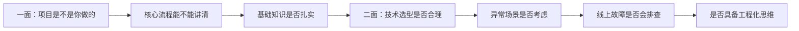

---

## 2. 能力雷达图：面试关注点如何升级

> 下面是根据两轮面试问题密度和追问深度整理出的主观复盘。

| 能力项 | 一面强度 | 二面强度 | 说明 |
|---|---:|---:|---|
| 项目深度 | 8 | 9 | 两轮都围绕项目不断追问 |
| Java 基础 | 7 | 5 | 一面更偏集合、字符串、Maven |
| 中间件理解 | 7 | 8 | Redis、Docker、Kafka 都被问到 |
| 架构设计 | 5 | 8 | 二面开始追问选型理由 |
| 排障能力 | 6 | 9 | 二面重点考 CPU 飙高定位 |
| 工程化思维 | 5 | 9 | 二面真正拉开差距的部分 |

## 3. 一面复盘：项目真实性与基础扎实度

一面整体难度适中，核心不是故意刁难，而是在确认四件事：

1. 项目是不是你真实做过；
2. 技术链路能不能从入口讲到出口；
3. Java 基础有没有明显漏洞；
4. 遇到日常问题有没有基本排查路径。

---

### 3.1 Spring Cache 二开：缓存三大问题怎么解决

面试官重点追问了 Spring Cache 二开工具如何解决缓存穿透、缓存击穿、缓存雪崩。

| 问题 | 典型风险 | 常见方案 | 高质量表达 |
|---|---|---|---|
| 缓存穿透 | 不存在的数据反复打到 DB | 布隆过滤器、空值缓存、参数校验 | “非法 Key 前置拦截 + 空结果短 TTL 兜底” |
| 缓存击穿 | 热点 Key 过期瞬间大量请求回源 | 分布式锁、本地锁、SingleFlight | “只允许一个线程回源，其余线程等待或返回旧值” |
| 缓存雪崩 | 大量 Key 同时过期导致 DB 压力暴增 | TTL 随机扰动、预热、限流降级 | “过期时间打散 + 热点 Key 异步续期 + 降级保护” |

#### 缓存保护链路图

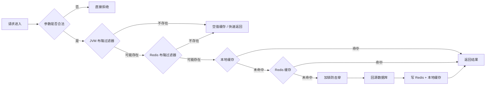

#### 推荐回答模板

> 我在缓存链路前面增加了布隆过滤器和参数校验，用来拦截明显不存在或非法的 Key。对于数据库确实不存在的数据，会写入短 TTL 的空值缓存，避免请求反复打到 DB。对于热点 Key 失效问题，我会使用本地锁或 Redis 分布式锁实现单飞机制，只允许一个线程回源，其他线程等待、重试或返回旧值。对于雪崩问题，会对 TTL 增加随机扰动，并配合热点 Key 预热、异步续期和限流降级。

---

### 3.2 OJ 代码沙箱：Docker 怎么运行用户代码

OJ 项目的核心问题是：**用户提交的代码不能直接在宿主机执行**。

如果直接执行用户代码，会带来几个风险：

- 恶意代码可能删除文件、读取敏感目录；
- 死循环可能打满 CPU；
- 大对象可能打爆内存；
- 多个提交同时执行时，资源不可控。

#### 代码沙箱执行流程

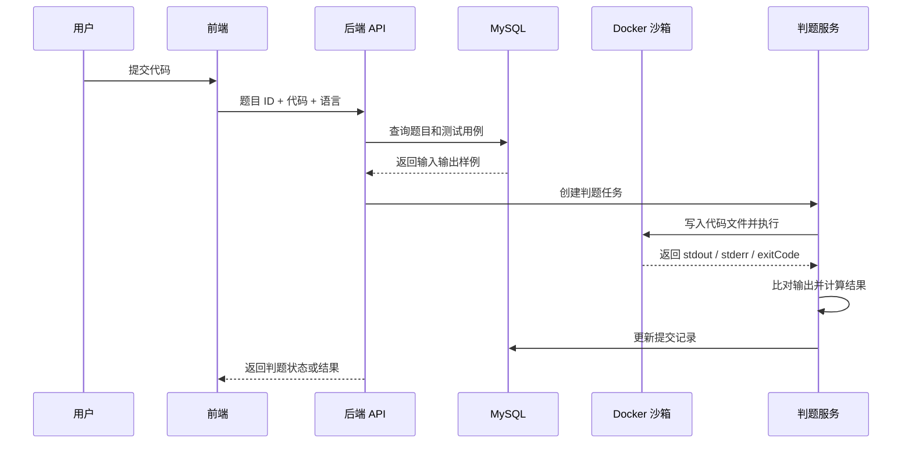

#### Docker 沙箱需要限制什么

| 限制项 | 目的 | 示例 |
|---|---|---|
| CPU | 防止死循环打满机器 | `--cpus=1` |
| 内存 | 防止 OOM 影响宿主机 | `--memory=256m` |
| 执行时间 | 防止任务永久运行 | 后端定时 kill 进程 |
| 文件系统 | 防止写入危险目录 | 只挂载临时目录 |
| 网络 | 防止访问外部网络 | `--network=none` |
| 进程数 | 防止 fork 炸弹 | 限制 pid 数 |

#### 推荐回答模板

> 我不会在宿主机直接执行用户代码，而是通过预构建语言镜像创建受限容器。后端会把用户代码和测试用例写入临时目录，再挂载到容器中执行脚本。容器侧限制 CPU、内存、执行时间、网络和文件访问范围。执行完成后，后端收集 stdout、stderr、exitCode，并和预期输出进行比对，最后更新提交结果。

---

### 3.3 前端按钮没反应：后端怎么排查

这个问题看起来简单，但非常实战。不要只回答“看日志”，而要分层排查。

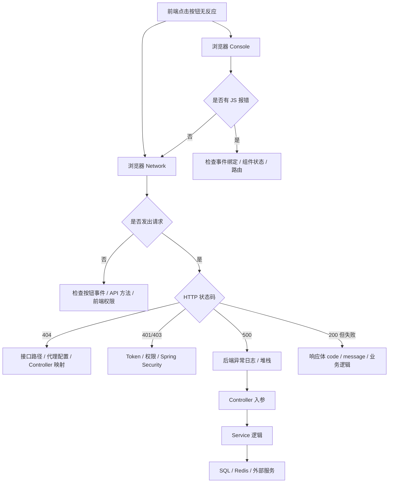

#### 推荐回答模板

> 我会先打开浏览器 Console 和 Network。先看前端有没有 JS 报错，再看请求有没有真正发出去。如果请求没发出去，优先排查按钮事件、接口封装、前端权限或路由。如果请求发出去了，就根据状态码判断：404 看路径和代理，401/403 看 Token 和权限，500 看后端日志和堆栈。如果是 200 但业务失败，就看响应体里的业务码和 message，再进入 Controller、Service、SQL 分层定位。

---

### 3.4 HashSet 自定义对象去重：为什么要同时重写 equals 和 hashCode

| 方法 | 作用 |
|---|---|
| `equals()` | 判断两个对象是否业务相等 |
| `hashCode()` | 决定对象在哈希表中的桶位置 |
| 只重写 `equals()` 的问题 | 两个业务相等对象可能进入不同桶，导致去重失败 |
| 正确做法 | `equals()` 和 `hashCode()` 必须保持一致 |

示例代码：

```java
import java.util.Objects;

public class User {
    private Long id;
    private String username;

    @Override
    public boolean equals(Object o) {
        if (this == o) return true;
        if (!(o instanceof User user)) return false;
        return Objects.equals(id, user.id);
    }

    @Override
    public int hashCode() {
        return Objects.hash(id);
    }
}
```

#### 面试表达重点

> HashSet 底层依赖 HashMap。添加元素时，会先根据 hashCode 定位桶，再通过 equals 判断是否相等。如果只重写 equals 而不重写 hashCode，两个业务上相等的对象可能 hashCode 不同，进入不同桶，最终导致 HashSet 去重失败。

---

## 4. 二面复盘：技术选型与工程化思维

二面的问题明显更接近真实生产环境。面试官不再满足于“你用了什么”，而是继续追问：

- 为什么用？
- 不用行不行？
- 有什么代价？
- 出故障怎么办？
- 是否有监控、告警、重试、降级？

---

### 4.1 WebSocket 为什么不能替代 HTTP

WebSocket 和 HTTP 不是替代关系，而是适用场景不同。

| 对比项 | HTTP | WebSocket |
|---|---|---|
| 通信模型 | 请求-响应 | 全双工长连接 |
| 服务端推送 | 不天然支持，通常轮询或 SSE | 原生支持服务端主动推送 |
| 连接成本 | 请求结束后资源释放较快 | 需要维护连接、心跳、重连 |
| 适合场景 | CRUD、查询、表单提交、文件上传 | 聊天、协同编辑、实时通知、判题结果推送 |
| 主要问题 | 实时性较弱 | 长连接占资源，治理复杂 |

#### WebSocket 通信状态图

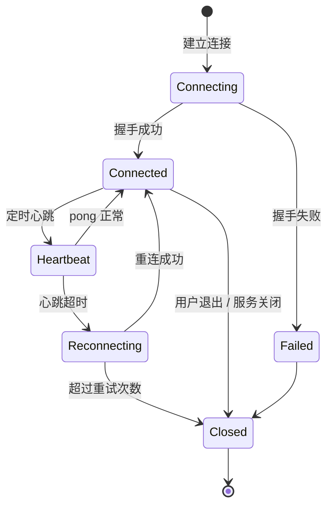

#### 推荐回答模板

> WebSocket 适合实时推送，但不适合替代所有 HTTP 请求。因为 WebSocket 是长连接，需要维护连接状态、心跳、断线重连、连接数上限和内存占用。大多数 CRUD 请求天然是一次请求一次响应，用 HTTP 更简单，也更适合网关、缓存、负载均衡和监控体系。我的项目里 WebSocket 只用于判题结果推送或聊天消息推送，普通接口仍然走 HTTP。

---

### 4.2 OJ 系统为什么引入 Kafka

OJ 判题是典型的耗时任务。如果用户提交代码后同步判题，高峰期很容易出现：

- API 线程被长时间占用；
- Docker 执行资源被打满；
- 用户请求超时；
- 判题服务和接口服务互相影响。

#### Kafka 异步判题架构

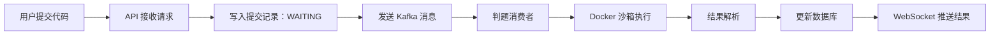

#### Kafka 在 OJ 中的价值

| 价值 | 说明 |
|---|---|
| 削峰 | 高峰期先把提交请求放入队列，消费者按能力消费 |
| 解耦 | API 服务只接收提交，判题服务独立处理执行任务 |
| 异步化 | 用户不用一直阻塞等待 Docker 执行完成 |
| 可恢复 | 消费失败可以重试，避免任务直接丢失 |
| 可扩展 | 多个判题消费者可以横向扩容 |

#### 推荐回答模板

> 我引入 Kafka 的原因不是为了追求技术栈丰富，而是因为判题是耗时任务。API 服务只负责接收提交、落库为 WAITING 状态，然后发送 Kafka 消息。判题消费者按自身处理能力消费任务，执行 Docker 沙箱，最后更新结果并通过 WebSocket 推送。这样可以削峰、解耦、异步化，也方便后续横向扩展判题消费者。

---

### 4.3 Docker 容器挂了怎么办

只回答 `restart: always` 不够。它是基础保活，但生产设计还要考虑健康检查、失败阈值、重建、告警和降级。

#### 容器保活与故障处理流程

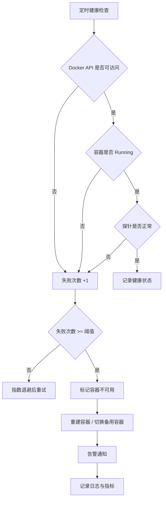

#### 工程化补充点

| 方向 | 说明 |
|---|---|
| 资源限制 | 限制 CPU、内存、进程数、执行时间 |
| 健康检查 | 定时检查容器状态和探针结果 |
| 失败重试 | 短暂失败先退避重试，不立即判死 |
| 容器重建 | 多次失败后销毁并重建容器 |
| 告警通知 | 记录失败率、异常退出码、stderr |
| 降级策略 | 容器池不可用时，提交状态设为 `JUDGE_DELAYED` |

#### 推荐回答模板

> `restart: always` 只能解决容器进程退出后的自动重启，但真实场景还需要健康检查。我会定时通过 Docker API 检查容器状态，并执行探针任务确认容器能否正常运行代码。如果连续失败达到阈值，就标记容器不可用，进行重建或切换备用容器，同时记录日志、指标并告警。如果整个容器池不可用，会把提交状态标记为延迟判题，避免任务直接失败。

---

### 4.4 责任链模式：如何避免为了设计模式而设计

二面问到缓存中间件使用责任链模式，重点不是背设计模式定义，而是说明它是否真的解决了问题。

#### 缓存责任链设计

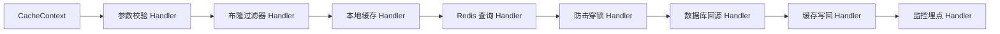

| 设计收益 | 具体体现 |
|---|---|
| 扩展性 | 后续可以插入限流、灰度、降级、监控节点 |
| 可观测性 | 每个 Handler 都能统计耗时、命中率、失败率 |
| 可替换性 | DB 回源、Redis 查询、本地缓存都可独立替换 |
| 低侵入 | 避免所有逻辑堆在一个超长 Service 方法里 |

#### 主动说明边界

> 如果链路只有两三个步骤，普通 Service 或模板方法就够了。责任链适合步骤多、可插拔、需要监控和扩展的场景。如果只是为了套设计模式，反而会增加理解成本。

这个回答会比单纯说“我用了责任链模式”成熟很多。

---

### 4.5 JWT 认证：不能只说无状态

JWT 是高频问题。只回答“JWT 无状态，Session 有状态”不够，还需要补充失效控制和安全问题。

| 对比项 | Session | JWT |
|---|---|---|
| 状态存储 | 服务端保存会话 | Token 自包含用户信息 |
| 分布式支持 | 需要共享 Session 或 Redis | 天然适合分布式 |
| 服务端控制 | 易于主动失效 | 主动失效较麻烦 |
| 安全风险 | Session ID 泄露 | Token 泄露后在有效期内可用 |
| 常见方案 | Redis Session | Access Token + Refresh Token + 黑名单 |

#### JWT 鉴权流程

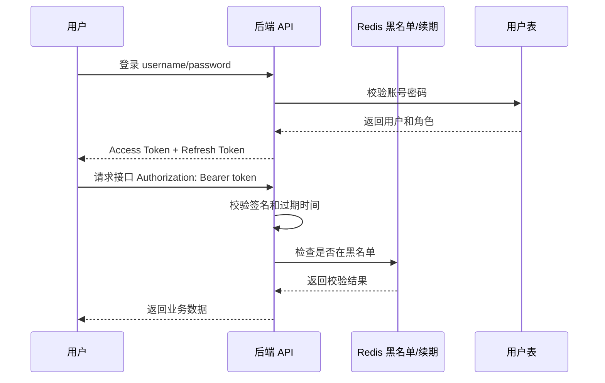

#### 推荐回答模板

> JWT 的优点是无状态，适合分布式系统，不需要服务端保存 Session。但它的问题是签发后在过期前不容易主动失效，所以生产中通常会设置较短的 Access Token 有效期，再配合 Refresh Token 续期。如果用户退出登录、修改密码或账号封禁，可以把 Token 的 jti 放入 Redis 黑名单，接口鉴权时额外检查黑名单。

---

## 5. 线上排障：CPU 飙高怎么定位

二面最关键的一问是：

> Linux 下某台机器负载极高，怎么排查是哪个进程导致的？拿到进程号之后，如何进一步定位？

当时如果回答“直接 `kill -9`”，在真实生产环境里是非常危险的。

---

### 5.1 为什么不能直接 kill -9

| 风险 | 说明 |
|---|---|
| 数据不一致 | 正在执行的事务、写文件、消息消费可能被强制中断 |
| 现场丢失 | 线程栈、堆信息、GC 状态还没采集就没了 |
| 故障扩大 | 杀掉核心服务可能导致大量请求失败 |
| 无法复盘 | 没有证据链，后续很难定位根因 |

正确思路是：**先保留现场，再定位问题，最后决定止血方式。**

---

### 5.2 CPU 飙高排查流程

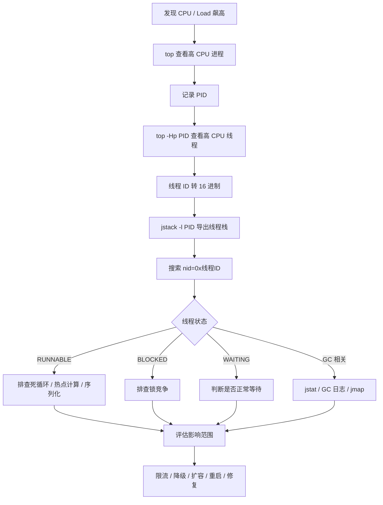

---

### 5.3 常用命令清单

```bash
# 1. 查看整体负载和高 CPU 进程
top

# 2. 查看某个 Java 进程内具体线程 CPU 占用
top -Hp <pid>

# 3. 将十进制线程 ID 转成十六进制
printf "%x\n" <tid>

# 4. 导出 Java 线程栈
jstack -l <pid> > jstack.log

# 5. 在 jstack 中查找对应线程
 grep -n "nid=0x<hex_tid>" jstack.log

# 6. 查看 GC 使用情况
jstat -gcutil <pid> 1000 10

# 7. 查看堆内存概要
jmap -heap <pid>

# 8. 查看进程打开的文件和端口
lsof -p <pid>

# 9. 查看系统调用情况
strace -p <pid>
```

---

### 5.4 面试回答模板

> 我不会第一时间 kill 进程，而是先保留现场。首先用 `top` 找到高 CPU 的 Java 进程，再用 `top -Hp <pid>` 找到具体高 CPU 线程，把线程 ID 转成 16 进制，然后用 `jstack` 导出线程栈，在栈文件里根据 `nid` 定位对应线程。接着看线程状态：如果是 `RUNNABLE`，重点排查死循环、复杂计算、频繁序列化等热点代码；如果是 `BLOCKED`，排查锁竞争；如果伴随频繁 GC，再结合 `jstat`、GC 日志和堆快照分析。确认原因后，再根据影响范围选择限流、降级、扩容、重启或代码修复。

---

## 6. 高频问题分类整理

### 6.1 项目类问题

| 问题 | 考察点 | 回答关键 |
|---|---|---|
| 你最有难度的项目是什么 | 项目深度 | 业务复杂度 + 技术难点 + 自己负责部分 |
| OJ 代码沙箱怎么实现 | Docker 实战 | 镜像、容器、脚本、资源限制、安全隔离 |
| Kafka 在项目里解决什么问题 | 异步架构 | 削峰、解耦、重试、消费者扩容 |
| WebSocket 为什么用 | 实时通信 | 判题结果推送、长连接成本、HTTP 对比 |
| 容器挂了怎么办 | 工程兜底 | 健康检查、指数退避、重建、告警 |

### 6.2 基础类问题

| 问题 | 标准回答方向 |
|---|---|
| ArrayList vs LinkedList | 动态数组 vs 双向链表；查询、插入、删除复杂度；实际 ArrayList 更常用 |
| HashSet 自定义对象去重 | 同时重写 equals 和 hashCode |
| 字符串反转 | 双指针、StringBuilder reverse、倒序遍历 |
| Maven 常用命令 | clean、compile、test、package、install、deploy |
| Dubbo vs Spring Cloud | RPC 框架 vs 微服务生态；通信协议、服务治理、使用场景 |

### 6.3 工程化类问题

| 问题 | 高质量回答关键词 |
|---|---|
| 前端按钮报错怎么排查 | Console、Network、状态码、日志、断点、链路追踪 |
| 线上 CPU 飙高怎么排查 | top、top -Hp、jstack、nid、线程状态、GC |
| JWT vs Session | 无状态、分布式、黑名单、续期、Token 失效控制 |
| Excel 导出性能优化 | 异步任务、流式写入、分页查询、限流、防重复提交 |
| 设计模式是否过度设计 | 场景边界、扩展性、可观测性、复杂度收益比 |

---

## 7. 项目表达升级：如何重新包装 OJ 项目

很多同学的项目其实不差，但面试表达容易变成：

> 我用了 Spring Boot、Redis、Docker、Kafka、WebSocket。

这句话的问题是：**只是在报技术栈，没有讲业务问题，也没有讲技术价值。**

更好的表达方式应该是：

> 我做的是一个类 LeetCode 的在线判题系统，核心难点是安全执行用户代码、高峰期异步判题、实时推送判题结果，以及保证判题容器的稳定性和可观测性。

---

### 7.1 项目架构图

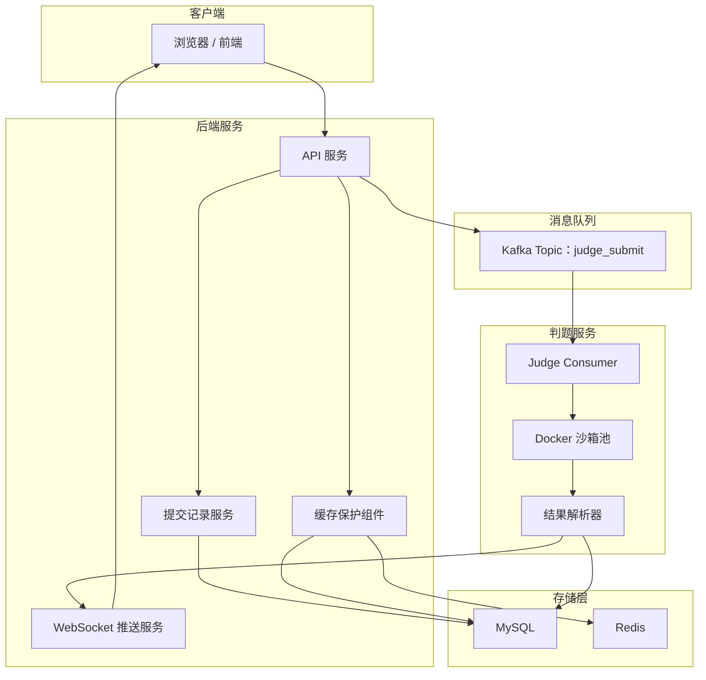

---

### 7.2 项目亮点表达表

| 亮点 | 不成熟表达 | 成熟表达 |
|---|---|---|
| Docker 沙箱 | 我用了 Docker 跑代码 | 我用 Docker 隔离用户代码执行环境，并限制 CPU、内存、时间、网络和文件系统权限 |
| Kafka | 我用了 Kafka | 我用 Kafka 解耦提交请求和判题执行，解决高峰期同步判题导致的线程阻塞问题 |
| WebSocket | 我用了 WebSocket | 我用 WebSocket 推送判题结果，避免前端频繁轮询，提高用户体验 |
| Redis | 我用了 Redis 缓存 | 我用 Redis + 本地缓存 + 布隆过滤器保护热点数据，并处理穿透、击穿、雪崩问题 |
| 监控兜底 | 我做了异常处理 | 我对容器执行耗时、失败率、退出码和 stderr 做记录，异常时重试、降级并告警 |

---

### 7.3 面试项目讲解结构

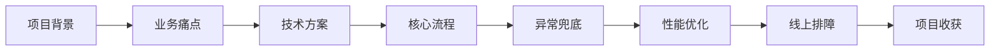

推荐按照这个顺序讲：

1. **项目背景**：这是一个什么系统，解决什么问题。
2. **业务痛点**：同步判题慢、用户代码不安全、高峰期请求多。
3. **技术方案**：Docker 沙箱、Kafka 异步、WebSocket 推送、Redis 缓存。
4. **核心流程**：用户提交代码到最终返回结果的完整链路。
5. **异常兜底**：超时、容器失败、消息消费失败、重复提交。
6. **性能优化**：缓存、异步、限流、容器池。
7. **线上排障**：日志、指标、线程栈、GC、容器状态。
8. **项目收获**：从能跑功能到考虑生产可用性。

---

## 8. 面试前补齐路线图

如果要从“学生项目”升级到“企业可用项目”，建议按下面顺序补齐。

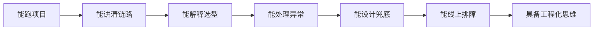

| 阶段 | 目标 | 推荐补齐内容 |
|---|---|---|
| 第 1 阶段 | 项目链路讲清楚 | 请求入口、核心流程、数据库表、关键接口 |
| 第 2 阶段 | 技术选型讲明白 | 为什么用 Redis、Docker、Kafka、WebSocket |
| 第 3 阶段 | 异常场景讲完整 | 超时、失败、重试、幂等、限流、降级 |
| 第 4 阶段 | 线上排障讲专业 | top、jstack、jmap、jstat、Arthas、日志定位 |
| 第 5 阶段 | 工程化表达成熟 | 监控、告警、灰度、容灾、容量评估、压测 |

---

## 9. 最终总结

这两轮面试最大的提醒是：

> 一面决定你有没有基础，二面决定你有没有工程化潜力。

一面中，只要项目真实、基础不虚、排查思路清楚，基本能聊下去。二面中，面试官会逐渐把问题推向真实生产环境：

- 容器挂了怎么办？
- Kafka 为什么要用？
- WebSocket 为什么不能滥用？
- 线上 CPU 飙高怎么定位？
- 设计模式是不是过度设计？

真正拉开差距的不是“知道多少技术名词”，而是下面五件事：

1. **能把项目链路讲成闭环**：从请求进入到结果返回，每一步谁负责、数据怎么流转。
2. **能说明技术选型理由**：为什么用这个组件，它解决什么问题，有什么代价。
3. **能考虑失败场景**：超时、异常、重试、幂等、资源耗尽、服务降级。
4. **能保留线上现场**：先定位、采集证据、评估影响，再决定是否重启或止血。
5. **能体现生产敬畏感**：生产环境不是个人服务器，不能凭感觉直接 `kill -9`。

最后送给准备 Java 后端实习的同学一句话：

> 项目不是堆技术栈，而是讲清楚业务问题、技术方案、异常兜底和线上排障。能把这四件事讲明白，你的面试竞争力会明显提升。

---

## 附录：面试前自查清单

| 自查项 | 是否能回答 |
|---|---|
| 能否用 1 分钟介绍项目背景和核心难点 | ☐ |
| 能否画出项目核心架构图 | ☐ |
| 能否讲清一次请求的完整链路 | ☐ |
| 能否说明 Redis 缓存穿透、击穿、雪崩的处理方案 | ☐ |
| 能否讲清 Docker 沙箱的安全限制 | ☐ |
| 能否说明 Kafka 的削峰、解耦、重试价值 | ☐ |
| 能否解释 WebSocket 和 HTTP 的适用边界 | ☐ |
| 能否回答 JWT 如何主动失效 | ☐ |
| 能否完整说出 CPU 飙高排查流程 | ☐ |
| 能否说明项目中有哪些异常兜底和监控点 | ☐ |