# Java 线上性能排查全指南：从 CPU 飙高到 Arthas 热替换

线上服务器 CPU 突然飙升到 90% 甚至 100%，通常会伴随接口超时、SSH 卡顿、日志刷屏、线程池堆积、服务不可用等问题。

很多人在第一反应中会选择：

```bash
kill -9 <PID>
# 或者直接重启服务 / 重启机器
```

但这往往是最危险的处理方式之一。因为它会直接破坏现场，导致后续无法判断到底是业务死循环、GC 风暴、线程池打满、系统中断异常，还是内存不足引起的连锁反应。

与此同时，Java 线上排查还面临另一个维度的挑战：

* 线上没有完整调试环境；
* 日志没有打到关键位置；
* 问题只在特定流量下偶现；
* `jstack`、`jmap` 只能提供静态快照，很难观察动态调用过程。

本文将以"止血 → 存证 → 定位 → 恢复 → 复盘"为主线，同时深入 Arthas 这一 Java 线上诊断利器，提供一套完整的排查方法论：

> 先止血，再存证；先定位，再恢复；先复盘，再预防。用 Arthas 做 JVM 的"显微镜 + 手术刀"。

---

## 一、整体排查思路：四阶段方法论

Linux 高 CPU 排查不要一上来就重启，而是按下面四个阶段推进。

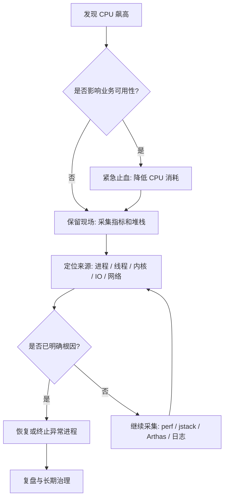

核心原则：

| 阶段 | 目标          | 不建议做的事       | 推荐动作                   |
| -- | ----------- | ------------ | ---------------------- |
| 止血 | 让机器恢复可操作状态  | 直接 `kill -9` | `kill -STOP` 暂停异常进程    |
| 存证 | 保留故障现场      | 重启后再分析       | 保存 `top`、`ps`、线程、堆栈、日志 |
| 定位 | 找到 CPU 消耗来源 | 只看进程级 CPU    | 继续定位到线程、函数、系统资源        |
| 恢复 | 控制影响面       | 盲目恢复全部流量     | 分批恢复、灰度验证              |
| 预防 | 避免再次发生      | 只写一句"已修复"    | 加资源限制、监控、压测、代码修复       |

对于 Java 应用，Arthas 的引入可以显著加速"定位"阶段。下面先介绍系统级的止血与存证方法，再逐步深入到 Arthas 的实战用法。

---

## 二、快速止血与现场存证

### 2.1 先看系统是否还能操作

如果机器还能正常输入命令，先查看整体负载：

```bash
uptime
```

重点关注：

```text
load average: 12.34, 10.21, 8.90
```

如果是 4 核机器，load 长期超过 4 就需要警惕；如果是 8 核机器，load 长期超过 8 也说明排队明显。

查看 CPU 核心数：

```bash
nproc
```

查看整体 CPU、内存、进程状态：

```bash
top
```

如果 `top` 已经卡顿，可以使用快照式命令：

```bash
ps -eo pid,ppid,user,stat,cmd,%cpu,%mem --sort=-%cpu | head -n 15
```

输出示例：

```text
  PID  PPID USER  STAT CMD                         %CPU %MEM
12345     1 app   Sl   java -jar order-service.jar 389  42.1
22331     1 root  R    nginx: worker process        78   1.2
```

这里最关键的是找到：

* 哪个进程 CPU 最高；
* 是单进程高 CPU，还是多个进程一起高；
* 是业务进程高，还是系统进程高。

---

### 2.2 用 STOP 暂停进程，而不是直接 KILL

如果某个业务进程已经把 CPU 打满，导致机器无法继续操作，可以先暂停它：

```bash
sudo kill -STOP <PID>
```

`SIGSTOP` 的效果是让进程暂停运行。它不会释放内存，也不会销毁进程上下文，适合用于"止血 + 保留现场"。

对比几种常见信号：

| 信号   | 命令                 | 作用   | 是否保留现场 | 使用场景        |
| ---- | ------------------ | ---- | ------ | ----------- |
| STOP | `kill -STOP <PID>` | 暂停进程 | 是      | 高 CPU 紧急止血  |
| CONT | `kill -CONT <PID>` | 恢复进程 | 是      | 存证后恢复验证     |
| TERM | `kill -TERM <PID>` | 优雅终止 | 部分保留   | 正常关闭服务      |
| KILL | `kill -9 <PID>`    | 强制杀死 | 否      | 进程无法正常退出时兜底 |

> 生产环境中，`kill -9` 应该是最后手段，不应该是第一手段。

---

### 2.3 保存现场证据

CPU 降下来之后，不要马上恢复服务。此时最重要的是保存现场。

建议统一保存到一个目录：

```bash
mkdir -p /tmp/cpu-debug-$(date +%F-%H%M%S)
cd /tmp/cpu-debug-*
```

采集系统快照：

```bash
date > date.txt
uptime > uptime.txt
nproc > cpu_count.txt
free -h > memory.txt
df -h > disk.txt
ps -eo pid,ppid,user,stat,cmd,%cpu,%mem --sort=-%cpu > ps_cpu.txt
top -b -n 1 > top.txt
```

如果安装了 `vmstat`、`pidstat`、`mpstat`，继续采集：

```bash
vmstat 1 10 > vmstat.txt
mpstat -P ALL 1 5 > mpstat.txt
pidstat -u -p -p ALL 1 5 > pidstat.txt
```

---

### 2.4 判断 CPU 类型：user、system、iowait、softirq

`top` 中的 CPU 行通常类似：

```text
%Cpu(s): 85.0 us,  8.0 sy,  0.0 ni,  5.0 id,  1.0 wa,  0.0 hi,  1.0 si,  0.0 st
```

含义如下：

| 字段 | 含义      | 常见原因                |
| -- | ------- | ------------------- |
| us | 用户态 CPU | 业务代码计算、死循环、序列化、加密压缩 |
| sy | 内核态 CPU | 系统调用频繁、网络栈、文件系统操作   |
| wa | I/O 等待  | 磁盘慢、数据库慢、日志刷盘、交换分区  |
| hi | 硬中断     | 硬件中断异常              |
| si | 软中断     | 网络包过多、DDoS、小包风暴     |
| st | 虚拟化偷取时间 | 云主机资源争抢             |
| id | 空闲      | CPU 空闲比例            |

判断方向：

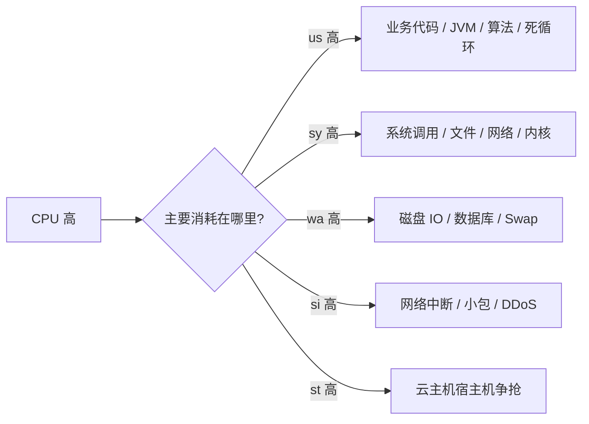

---

## 三、Arthas：Java 线上诊断利器

### 3.1 为什么线上排查离不开 Arthas？

传统 JVM 工具虽然强大，但更偏向"事后分析"。而 Arthas 的价值在于：

**它可以直接进入正在运行的 JVM，对方法调用、参数、返回值、异常、耗时、类加载、线程状态进行实时观测。**

一句话概括：

> Arthas 是 Java 线上问题排查的"显微镜 + 手术刀"。

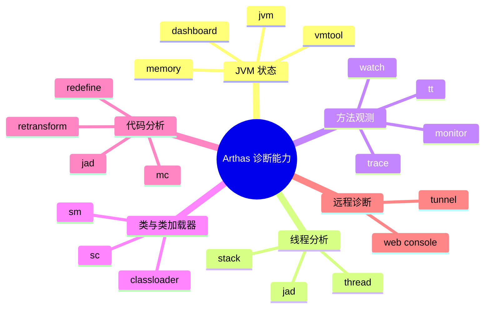

### 3.2 Arthas 核心命令速查

| 命令            | 作用              | 典型用途            |
| ------------- | --------------- | --------------- |
| `dashboard`   | 查看 JVM 实时状态     | CPU、内存、GC、线程总览  |
| `thread`      | 查看线程状态          | 排查 CPU 飙高、死锁、阻塞 |
| `jad`         | 反编译线上类          | 查看当前运行代码        |
| `sc`          | Search Class    | 查找类信息、类加载器      |
| `sm`          | Search Method   | 查找方法签名          |
| `watch`       | 观察方法入参、返回值、异常   | 排查业务数据异常        |
| `trace`       | 追踪方法内部调用耗时      | 定位慢接口           |
| `stack`       | 查看方法调用栈         | 找到谁调用了这个方法      |
| `monitor`     | 方法调用统计          | 统计 QPS、成功率、平均耗时 |
| `tt`          | Time Tunnel     | 记录方法调用现场，支持回放   |
| `classloader` | 查看类加载器          | 解决类加载、编译、热替换问题  |
| `mc`          | Memory Compiler | 在线编译 Java 文件    |
| `retransform` | 重新转换类字节码        | 线上热替换           |

### 3.3 Arthas 整体排查流程

线上问题不要一上来就 `watch` 或 `trace`，推荐按照"由粗到细"的顺序排查。

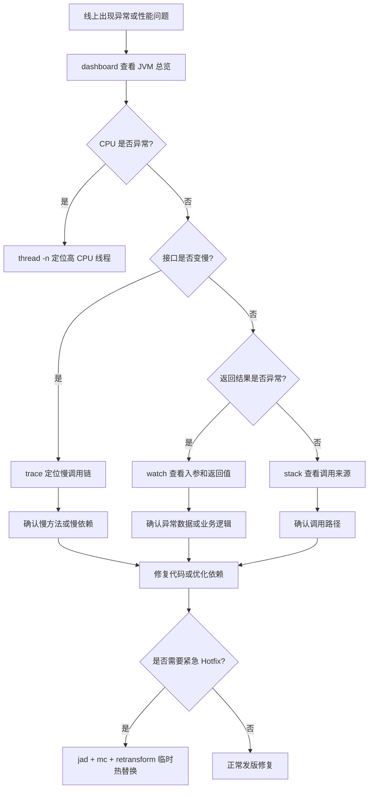

---

## 四、线程级定位：CPU 飙高场景深度剖析

### 4.1 定位最耗 CPU 的进程

```bash
ps -eo pid,ppid,user,stat,cmd,%cpu,%mem --sort=-%cpu | head -n 15
```

假设发现 Java 进程占用 CPU 很高：

```text
12345 app java -jar order-service.jar 389% 42.1%
```

389% 说明它大概使用了接近 4 个 CPU 核心。

---

### 4.2 定位进程内最耗 CPU 的线程

对多线程程序，例如 Java、C++、Go，仅知道 PID 不够，还要进一步找到线程。

```bash
top -Hp <PID>
```

示例：

```bash
top -Hp 12345
```

输出中重点看线程 ID：

```text
PID     USER  PR NI VIRT RES SHR S %CPU COMMAND
12367   app   20  0  ... ... ... R 99.9 java
12368   app   20  0  ... ... ... R 98.7 java
```

此时 `12367`、`12368` 是线程 ID。

Java 堆栈中的线程 ID 通常是十六进制，所以需要转换：

```bash
printf "%x\n" 12367
```

例如输出：

```text
304f
```

然后在 `jstack` 结果里搜索：

```bash
jstack -l 12345 > jstack.txt
grep -n "304f" jstack.txt
```

---

### 4.3 Java 高 CPU 常见原因与排查路径

Java 服务高 CPU 最常见的几类原因：

| 类型     | 典型表现                   | 排查工具                 | 常见根因               |
| ------ | ---------------------- | -------------------- | ------------------ |
| 死循环    | 单个或少量线程 100%           | `top -Hp` + `jstack` | while 循环、递归、状态机错误  |
| GC 风暴  | CPU 高、吞吐下降、日志频繁 GC     | `jstat` + GC 日志      | 内存不足、对象创建过快        |
| 线程池打满  | 请求堆积、队列增长              | 线程池监控 + dump         | 下游慢、拒绝策略不合理        |
| 序列化/压缩 | CPU 高但线程正常运行           | 火焰图 / async-profiler | JSON 过大、压缩频繁       |
| 锁竞争    | 线程 BLOCKED / WAITING 多 | `jstack`             | synchronized 锁范围过大 |

Java 线程定位流程：

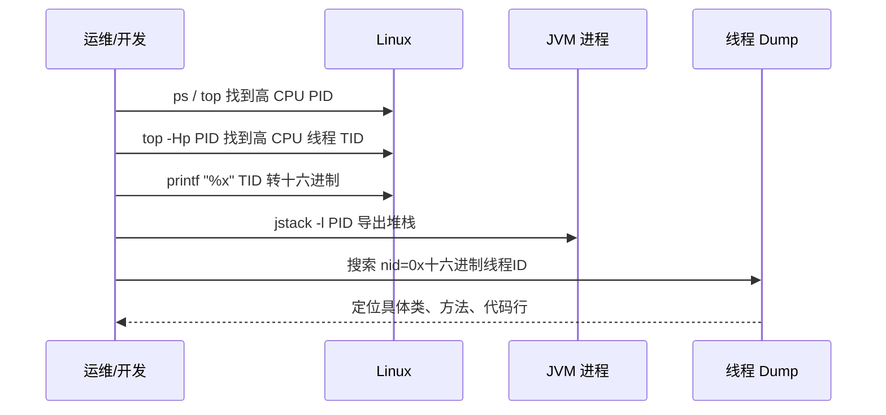

### 4.4 用 Arthas thread 加速定位

除了传统的 `top -Hp` + `jstack` 组合，Arthas 提供了更直接的线程分析能力：

```bash
# 查看 JVM 整体线程概览
dashboard

# 直接列出 CPU 消耗最高的 N 个线程
thread -n 5

# 查看某个具体线程的堆栈
thread <threadId>
```

`thread -n 5` 可以直接输出 CPU 消耗最高的 5 个线程及其堆栈，省去了手动转换十六进制再搜索 jstack 的步骤。

常用 JVM 诊断命令：

```bash
# 查看 JVM 参数
jcmd <PID> VM.flags

# 查看 JVM 系统属性
jcmd <PID> VM.system_properties

# 导出线程栈
jstack -l <PID> > /tmp/jstack-$(date +%F-%H%M%S).txt

# 查看 GC 情况
jstat -gcutil <PID> 1000 10

# 导出堆信息
jmap -heap <PID>
```

如果 CPU 高伴随频繁 GC，可以进一步查看 GC 日志或临时抓取对象直方图：

```bash
jmap -histo:live <PID> | head -n 30
```

> 注意：`jmap -histo:live` 可能触发 Full GC，生产环境要谨慎使用。

---

### 4.5 火焰图定位热点函数

当 `jstack` 和 Arthas `thread` 只能看到线程在运行，但无法判断真正热点时，可以使用火焰图。

Java 推荐使用 async-profiler：

```bash
./profiler.sh -d 30 -e cpu -f /tmp/cpu-flame.html <PID>
```

| 参数       | 含义        |
| -------- | --------- |
| `-d 30`  | 采样 30 秒   |
| `-e cpu` | 采样 CPU 事件 |
| `-f`     | 输出文件      |
| `<PID>`  | 目标进程      |

火焰图阅读方法：

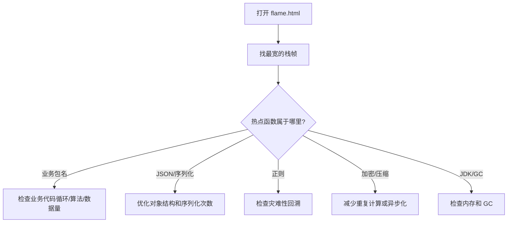

---

## 五、方法观测与异常捕获：watch/trace/stack 实战

当线程级定位完成后，通常需要进一步深入到方法级别来排查。Arthas 的 `watch`、`trace`、`stack` 是方法级观测的三大核心命令。

### 5.1 Watch：不仅仅是"看参数"

`watch` 是 Arthas 中最常用的命令之一，适合观察方法的入参、返回值、异常、当前对象、方法耗时。

#### 基础语法

```bash
watch 类名 方法名 表达式 条件
```

示例：

```bash
watch com.example.UserService getUser "{params, returnObj}" -x 2
```

* `params`：方法参数；
* `returnObj`：方法返回值；
* `-x 2`：对象展开深度为 2。

#### 观察入参与返回值

```bash
watch com.example.OrderService createOrder "{params, returnObj}" -x 3 -n 5
```

* `-x 3`：展开 3 层对象；
* `-n 5`：只观察 5 次，避免线上刷屏。

#### 只观察异常

```bash
watch com.example.UserService getUser "{params, throwExp}" -e -x 2 -n 5
```

* `-e`：只在方法抛异常时触发；
* `throwExp`：异常对象。

#### 按耗时过滤

```bash
watch com.example.OrderService createOrder "{params, returnObj}" "#cost > 100" -x 2 -n 5
```

只观察耗时超过 `100ms` 的调用。

#### 按参数过滤

```bash
watch com.example.UserService updateUser "{params, returnObj}" "params[0].id == 1001" -x 3 -n 5
```

只观察 `id = 1001` 的请求。

#### 访问对象字段

```bash
watch com.example.UserService getUser "target.userCache" -x 2 -n 5
```

* `target`：当前实例对象；
* `target.userCache`：访问实例字段。

---

### 5.2 Trace：定位慢接口的真正瓶颈

`trace` 用于追踪方法内部调用链耗时。当接口慢但日志看不出原因时，`trace` 非常有用。

#### 基础示例

```bash
trace com.example.OrderController createOrder -n 5
```

输出通常类似：

```text
`---ts=2026-02-25 10:00:00;thread_name=http-nio-8080-exec-1;id=25;is_daemon=true;priority=5;TCCL=...
    `---[320.112ms] com.example.OrderController:createOrder()
        +---[12.331ms] com.example.OrderService:checkParam()
        +---[250.442ms] com.example.OrderService:saveOrder()
        +---[45.221ms] com.example.PaymentClient:prePay()
```

从结果可以快速看出：`OrderService.saveOrder()` 耗时 250ms，是主要瓶颈。

#### 只看慢请求

```bash
trace com.example.OrderController createOrder '#cost > 200' -n 5
```

只追踪耗时超过 `200ms` 的请求。

#### 追踪 JDK 方法

默认情况下，Arthas 会跳过 JDK 方法。如果需要观察 JDK 内部调用：

```bash
trace com.example.OrderController createOrder '#cost > 200' --skipJDKMethod false -n 5
```

> 注意：生产环境慎用，JDK 方法调用链可能非常长。

---

### 5.3 Stack：谁调用了这个方法？

有时候我们知道某个方法被调用了，但不知道是谁调用的。这时可以使用 `stack`。

```bash
stack com.example.UserService getUser -n 5
```

适合排查：

* 某个方法为什么被频繁调用；
* 某段逻辑是从哪个入口进来的；
* 定时任务、异步线程、消息消费是否触发了异常逻辑。

---

### 5.4 Monitor：统计方法调用情况

`monitor` 适合观察某个方法在一段时间内的调用统计。

```bash
monitor com.example.OrderService createOrder -c 5
```

每 5 秒统计一次方法调用情况。典型输出包含：

| 字段        | 含义   |
| --------- | ---- |
| timestamp | 统计时间 |
| class     | 类名   |
| method    | 方法名  |
| total     | 调用次数 |
| success   | 成功次数 |
| fail      | 失败次数 |
| avg-rt    | 平均耗时 |
| fail-rate | 失败率  |

---

### 5.5 TT：记录现场，回放调用

`tt` 是 Time Tunnel 的缩写，可以记录方法调用现场。

```bash
# 记录方法调用
tt -t com.example.UserService getUser -n 5

# 查看记录列表
tt -l

# 查看某次调用详情
tt -i 1000

# 重新调用一次（生产环境慎用！）
tt -i 1000 -p
```

> `tt -p` 会重新执行方法，生产环境要非常谨慎。如果方法涉及写库、扣库存、发消息、发券等副作用，不建议回放。

---

### 5.6 线上实战：接口返回值异常

#### 场景

线上用户反馈：查询用户信息接口返回的昵称为空，但数据库中明明有昵称。

```text
GET /api/user/1001
```

对应方法：`com.example.UserService#getUser`

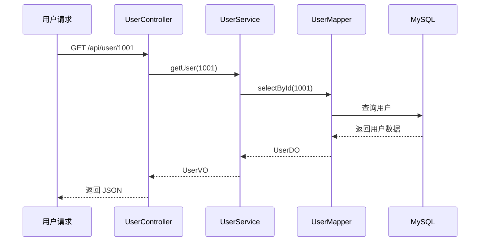

#### 排查步骤

第一步，观察入参和返回值：

```bash
watch com.example.UserService getUser "{params, returnObj}" "params[0] == 1001" -x 3 -n 5
```

如果发现 `returnObj.nickname = null`，说明问题可能出在：数据库查询结果为空、DO 转 VO 时字段丢失、业务代码主动置空、或序列化前被拦截。

第二步，追踪内部调用：

```bash
trace com.example.UserService getUser '#cost > 0' -n 5
```

如果输出显示 `UserConverter.toVO()` 耗时很短，可以进一步观察转换方法：

```bash
watch com.example.UserConverter toVO "{params, returnObj}" -x 3 -n 5
```

如果 `params[0].nickname` 有值，但 `returnObj.nickname` 为空，基本可以确认是转换逻辑问题。


---

## 六、代码热替换 Hotfix

### 6.1 适用边界

Arthas 最危险、也最强大的能力之一，就是在线热替换代码。它可以在不重启服务的情况下，将修改后的 `.class` 加载进正在运行的 JVM。

但必须明确：

> Arthas Hotfix 更适合临时止血，不应该替代正常发版流程。

#### 适合使用 Hotfix 的场景

| 场景         | 是否适合 |
| ---------- | ---- |
| 增加简单非空判断   | 适合   |
| 修改简单条件判断   | 适合   |
| 修正明显写错的常量  | 适合   |
| 临时屏蔽某个异常分支 | 谨慎适合 |
| 修改方法内部少量逻辑 | 谨慎适合 |

#### 不适合使用 Hotfix 的场景

| 场景        | 原因                |
| --------- | ----------------- |
| 新增字段      | JVM 已加载类结构不支持随意变更 |
| 新增方法      | 容易失败或行为不可控        |
| 修改方法签名    | 调用方不匹配            |
| 修改继承关系    | 类结构变化风险极高         |
| 大范围业务重构   | 不可控               |
| 涉及事务边界变化  | 可能造成数据不一致         |
| 涉及多服务协议变化 | 上下游不兼容            |

### 6.2 Hotfix 流程

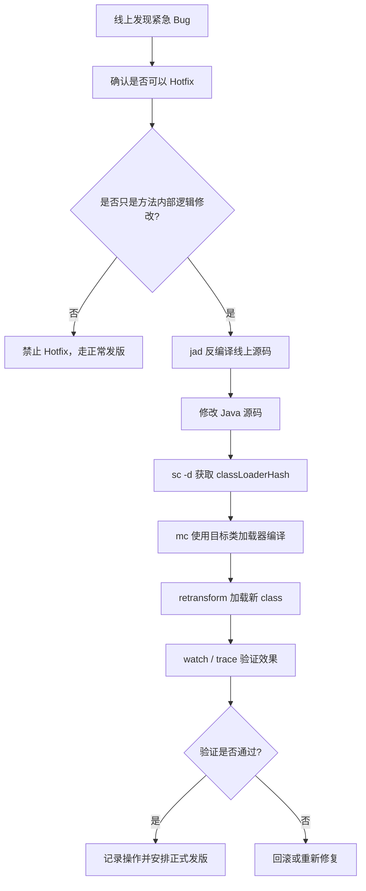

### 6.3 实战：修复 NullPointerException

#### 场景

线上代码存在空指针风险：

```java
public String getUserName(User user) {
    return user.getName().trim();
}
```

当 `user` 或 `user.getName()` 为空时，会抛出 `NullPointerException`。目标：临时增加非空校验。

#### 第一步：反编译线上代码

```bash
jad --source-only com.example.UserService > /tmp/UserService.java
```

必须以线上 JVM 当前运行的代码为准，不能直接拿本地代码盲改。

#### 第二步：修改源码

修改 `/tmp/UserService.java`：

```java
public String getUserName(User user) {
    if (user == null || user.getName() == null) {
        return "";
    }
    return user.getName().trim();
}
```

#### 第三步：查找类加载器

```bash
sc -d com.example.UserService | grep classLoaderHash
```

重点关注输出中的 `classLoaderHash`。

#### 第四步：使用 mc 编译

```bash
mc -c <classLoaderHash> /tmp/UserService.java -d /tmp
```

* `-c`：指定类加载器；
* `-d /tmp`：输出编译后的 `.class` 文件。

#### 第五步：加载新字节码

```bash
retransform /tmp/com/example/UserService.class
```

`retransform` 成功后，新的方法逻辑会在当前 JVM 中生效。

#### 第六步：验证修复效果

```bash
watch com.example.UserService getUserName "{params, returnObj, throwExp}" -x 2 -n 5
```

验证重点：是否还抛出 `NullPointerException`；返回值是否符合预期；是否影响正常用户请求。

### 6.4 Hotfix 回滚方案

#### 方案一：使用原始 class 重新 retransform

如果你提前备份了原始 `.class`：

```bash
retransform /tmp/backup/com/example/UserService.class
```

#### 方案二：重新发版覆盖

最稳妥的方式是：

1. 将 Hotfix 修复同步到代码仓库；
2. 走正常测试流程；
3. 重新发布服务；
4. 覆盖 Arthas 临时变更。

#### 方案三：重启服务

Arthas 热替换只影响当前 JVM 内存中的类。如果没有持久修改代码，服务重启后会恢复到原始版本。

### 6.5 retransform 与 redefine 对比

| 维度       | retransform | redefine |
| -------- | ----------- | -------- |
| 推荐程度     | 更推荐         | 较少使用     |
| 是否支持多次修改 | 支持度更好       | 容易受限制    |
| 使用体验     | 更稳定         | 风险更高     |
| 适用场景     | 方法内部逻辑修复    | 简单类重定义   |
| 生产建议     | 谨慎使用        | 更谨慎使用    |

一般建议：优先使用 `retransform`，避免频繁使用 `redefine`。

---

## 七、系统级高 CPU 特殊场景

并不是所有高 CPU 都来自业务进程。下面这些系统级场景也非常常见。

### 7.1 `kswapd0` 高 CPU：内存不足或 Swap 抖动

如果看到 `kswapd0` 占用 CPU 很高：

```bash
ps -eo pid,comm,%cpu,%mem --sort=-%cpu | head
```

可能说明系统内存紧张，内核正在频繁回收内存页面。

检查内存：

```bash
free -h
vmstat 1 10
```

重点看 `vmstat` 中的：

| 字段 | 含义       | 异常表现                 |
| -- | -------- | -------------------- |
| si | swap in  | 持续大于 0 说明频繁从 Swap 读入 |
| so | swap out | 持续大于 0 说明频繁写入 Swap   |
| r  | 运行队列     | 长期大于 CPU 核数说明 CPU 排队 |
| wa | I/O 等待   | 高说明磁盘或存储慢            |

处理建议：

```bash
# 查看占用内存最多的进程
ps -eo pid,user,cmd,%mem,%cpu --sort=-%mem | head -n 15
```

如果是缓存过高，不要随意清理；如果确认是非关键缓存或临时止血，可以谨慎执行：

```bash
sync
sudo sysctl vm.drop_caches=3
```

更长期的方案是：

* 修复内存泄漏；
* 调整 JVM 堆大小；
* 增加机器内存；
* 对服务配置 `MemoryMax` / `MemoryLimit`；
* 拆分过重任务。

---

### 7.2 softirq 高：网络中断或小包风暴

如果 `top` 中 `si` 很高，通常要怀疑网络中断。

查看软中断：

```bash
watch -n 1 "cat /proc/softirqs"
```

查看网络连接：

```bash
ss -antp | head
ss -ant state established | wc -l
```

查看网卡流量：

```bash
sar -n DEV 1 5
```

可能原因：

| 现象             | 可能原因           | 处理方向                     |
| -------------- | -------------- | ------------------------ |
| `si` 高         | 小包过多           | 检查入口流量、限流、防火墙            |
| 连接数暴涨          | 爬虫 / 攻击 / 连接泄漏 | Nginx 限流、连接池治理           |
| 单核 CPU 特别高     | 网卡中断集中在单核      | IRQ 亲和性、RSS/RPS 调整       |
| Nginx worker 高 | 请求量过大或反向代理异常   | access log、upstream 延迟分析 |

---

### 7.3 iowait 高：磁盘或下游存储慢

如果 `wa` 高，说明 CPU 在等 I/O。

检查磁盘：

```bash
iostat -x 1 5
```

重点看：

| 字段              | 含义     | 判断            |
| --------------- | ------ | ------------- |
| `%util`         | 设备繁忙程度 | 接近 100% 表示磁盘忙 |
| `await`         | 平均等待时间 | 高说明 I/O 延迟大   |
| `r/s`、`w/s`     | 每秒读写次数 | 判断读写压力        |
| `rkB/s`、`wkB/s` | 每秒读写量  | 判断吞吐压力        |

找出哪个进程在大量读写：

```bash
iotop -oPa
```

常见原因：

* 日志疯狂刷盘；
* 大文件上传或下载；
* 数据库慢查询；
* 临时文件过多；
* 容器日志没有轮转；
* 磁盘空间不足导致系统异常。

---

## 八、恢复决策与复盘模板

### 8.1 恢复决策

采集完证据后，需要决定怎么恢复。

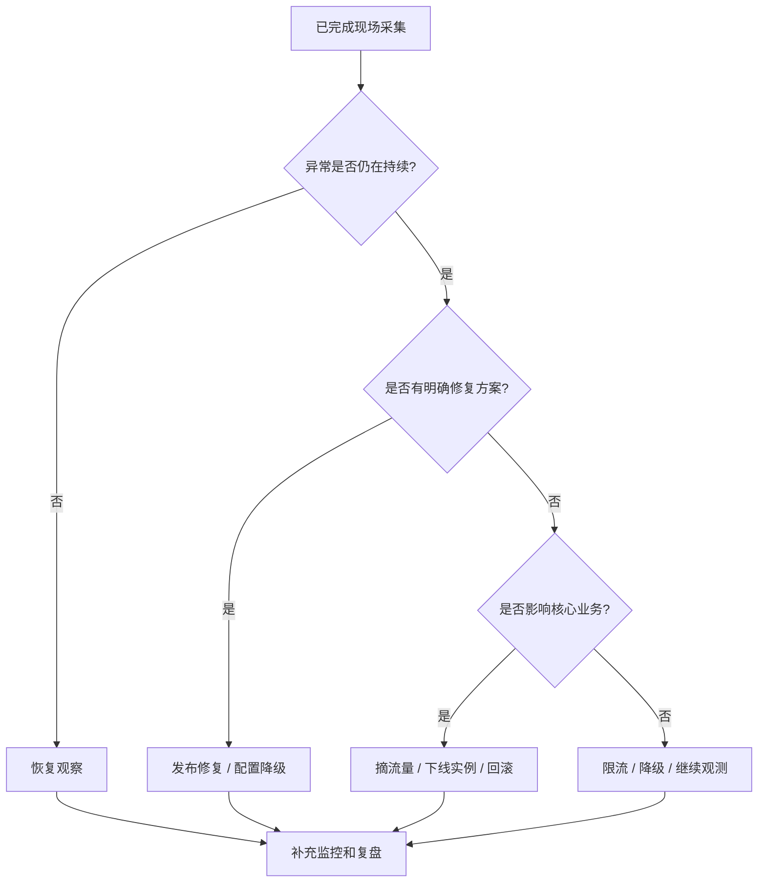

常见恢复动作：

| 动作     | 命令 / 方法             | 适用情况            |
| ------ | ------------------- | --------------- |
| 恢复暂停进程 | `kill -CONT <PID>`  | 已采集完证据，需要观察是否复现 |
| 优雅终止   | `kill -TERM <PID>`  | 服务可被拉起，允许正常退出   |
| 强制终止   | `kill -9 <PID>`     | 进程无响应，TERM 无效   |
| 摘除流量   | Nginx / 网关 / 注册中心下线 | 避免继续影响用户        |
| 回滚版本   | 发布平台回滚              | 明确由新版本引起        |
| 限流降级   | 网关、配置中心             | 下游慢、突发流量、热点接口   |

恢复后至少观察：

```bash
top
uptime
free -h
ss -antp | wc -l
journalctl -u <service> -n 200 --no-pager
```

---

### 8.2 长期治理：让单个服务不能拖垮整台机器

#### 使用 systemd 限制 CPU 和内存

```ini
[Unit]
Description=My Application
After=network.target

[Service]
User=app
WorkingDirectory=/opt/myapp
ExecStart=/usr/bin/java -jar /opt/myapp/app.jar
Restart=on-failure
RestartSec=5

# 最多使用 50% 单核 CPU；如果是 200%，约等于最多使用 2 核
CPUQuota=50%

# 限制最大内存
MemoryMax=2G

# 限制打开文件数
LimitNOFILE=65535

[Install]
WantedBy=multi-user.target
```

#### 容器环境限制资源

Docker 示例：

```bash
docker run -d \
  --name myapp \
  --cpus="1.5" \
  --memory="2g" \
  --memory-swap="2g" \
  myapp:latest
```

Docker Compose 示例：

```yaml
services:
  myapp:
    image: myapp:latest
    container_name: myapp
    deploy:
      resources:
        limits:
          cpus: "1.5"
          memory: 2G
    restart: unless-stopped
```

---

### 8.3 监控指标设计

建议至少监控以下指标：

| 指标           |        推荐阈值 | 说明        |
| ------------ | ----------: | --------- |
| CPU 使用率      |  5 分钟 > 85% | 判断整体压力    |
| Load Average | 持续 > CPU 核数 | 判断 CPU 排队 |
| iowait       |  5 分钟 > 20% | 判断磁盘/存储慢  |
| softirq      |      明显异常升高 | 判断网络中断问题  |
| 内存使用率        |       > 90% | 判断内存紧张    |
| Swap In/Out  |      持续 > 0 | 判断内存抖动    |
| 进程 CPU       |  单进程 > 300% | 判断某服务异常   |
| JVM GC 时间    |        持续升高 | 判断 GC 风暴  |
| 线程数          |        超过基线 | 判断线程泄漏    |
| 接口 P95/P99   |      超过 SLA | 判断业务影响    |

Prometheus 查询示例：

```promql
# CPU 使用率
100 - (avg by(instance) (rate(node_cpu_seconds_total{mode="idle"}[5m])) * 100)
```

```promql
# iowait 占比
avg by(instance) (rate(node_cpu_seconds_total{mode="iowait"}[5m])) * 100
```

---

### 8.4 典型案例：Java 服务 CPU 400% 排查

#### 现象

某订单服务接口大量超时，监控显示：

| 指标           |   数值 |
| ------------ | ---: |
| CPU 使用率      |  96% |
| Load Average |   18 |
| 机器核心数        |  4 核 |
| Java 进程 CPU  | 390% |
| P99 延迟       |   8s |

#### 排查步骤

第一步，找到进程：

```bash
ps -eo pid,ppid,user,cmd,%cpu,%mem --sort=-%cpu | head
```

发现 `12345 app java -jar order-service.jar 390% 45%`。

第二步，暂停止血：`sudo kill -STOP 12345`

第三步，采集线程：`top -Hp 12345`，发现线程 `12367` 持续 99%。

第四步，转换十六进制：`printf "%x\n" 12367` → `304f`

第五步，导出堆栈并搜索：

```bash
jstack -l 12345 > /tmp/jstack.txt
grep -n "304f" /tmp/jstack.txt
```

定位到某个优惠规则计算方法反复循环。

#### 根因

优惠规则配置中出现了环形依赖：规则 A → 规则 B → 规则 C → 规则 A。代码中没有做 visited 集合判断，导致死循环。

#### 修复方案

* 增加规则依赖图的环检测；
* 对规则计算增加最大递归深度；
* 对接口增加超时和降级；
* 对异常配置增加发布前校验。

示例伪代码：

```java
public Result calculateRule(Rule rule, Set<Long> visited) {
    if (visited.contains(rule.getId())) {
        throw new BizException("规则存在环形依赖: " + rule.getId());
    }
    visited.add(rule.getId());

    for (Rule dependency : rule.getDependencies()) {
        calculateRule(dependency, visited);
    }

    visited.remove(rule.getId());
    return doCalculate(rule);
}
```

---

### 8.5 事故复盘模板

高 CPU 故障处理完成后，建议按下面模板沉淀复盘。

```markdown
# CPU 高负载事故复盘

## 1. 基本信息
- 事故时间：
- 影响服务：
- 影响范围：
- 发现方式：监控 / 用户反馈 / 巡检
- 处理人：

## 2. 时间线
- 10:00 监控报警 CPU 超过 90%
- 10:03 登录机器查看进程
- 10:05 暂停异常进程并采集堆栈
- 10:10 定位到异常线程
- 10:20 完成临时恢复
- 11:30 发布修复版本

## 3. 现场证据
- top 快照：
- ps 快照：
- jstack 文件：
- GC 日志：
- 应用日志：
- 监控截图：

## 4. 根因分析
- 直接原因：
- 深层原因：
- 为什么测试环境没有发现：
- 为什么监控没有更早发现：

## 5. 修复措施
- 代码修复：
- 配置修复：
- 容量修复：
- 监控修复：

## 6. 后续行动
- [ ] 增加单元测试
- [ ] 增加压测场景
- [ ] 增加 CPU/线程/GC 告警
- [ ] 增加服务资源限制
- [ ] 完成知识库沉淀
```

---

## 九、远程诊断 Tunnel 与生产最佳实践

### 9.1 Arthas Tunnel 远程诊断

在真实企业环境中，很多服务器处于内网，无法直接 SSH 登录。这时可以使用 Arthas Tunnel 做远程诊断。

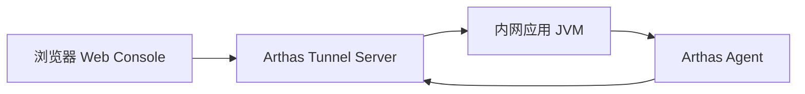

#### 启动 Tunnel Server

在公网可访问的机器上启动：

```bash
java -jar arthas-tunnel-server.jar
```

默认端口通常包括：`7777`（WebSocket 通信）、`8080`（Web 控制台）。实际端口以你的启动配置为准。

#### 客户端连接 Tunnel Server

在目标应用机器上执行：

```bash
java -jar arthas-boot.jar \
  --tunnel-server 'ws://public-ip:7777/ws' \
  --agent-id my-app-001
```

| 参数                | 含义               |
| ----------------- | ---------------- |
| `--tunnel-server` | Tunnel Server 地址 |
| `--agent-id`      | 当前应用实例 ID        |
| `my-app-001`      | 自定义实例标识          |

#### Web 界面管理多个实例

通过 Arthas Web Console，可以选择不同 `agent-id` 的应用实例进行诊断。适合场景：

* 多台服务器统一诊断；
* 容器环境排查；
* 内网机器无法直接 SSH；
* 运维统一管理 Java 进程。

---

### 9.2 Arthas 与常见监控工具对比

| 维度          | Arthas      | SkyWalking  | Prometheus + Grafana |
| ----------- | ----------- | ----------- | -------------------- |
| 核心定位        | 单 JVM 深度诊断  | 分布式链路追踪     | 指标监控与告警              |
| 定位粒度        | 方法级、对象级、线程级 | 服务级、接口级、链路级 | 指标级、实例级              |
| 时效性         | 实时交互        | 准实时         | 准实时                  |
| 侵入性         | 低，按需增强      | 低，需要 Agent  | 中，需要 Exporter 或埋点    |
| 使用方式        | 临时排查        | 长期观测        | 长期监控                 |
| 适合问题        | 线上疑难杂症      | 链路慢、服务依赖异常  | CPU、内存、QPS、错误率       |
| 是否适合 Hotfix | 支持          | 不支持         | 不支持                  |

三类工具配合使用：

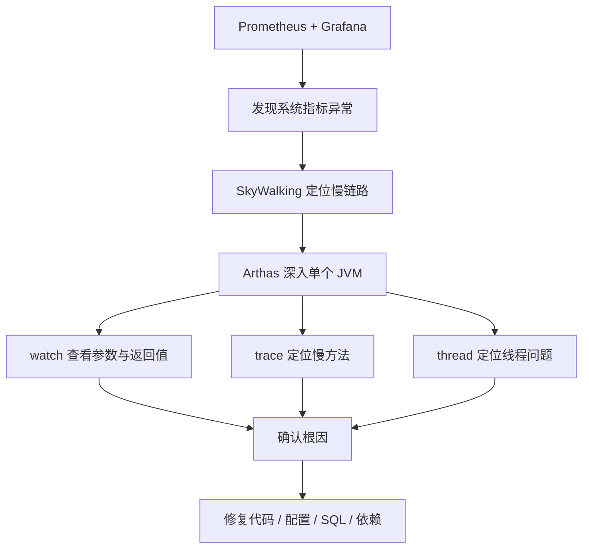

推荐组合：

```text
Prometheus + Grafana：负责发现问题
SkyWalking：负责定位链路
Arthas：负责深入 JVM 内部确认根因
```

---

### 9.3 生产环境最佳实践

#### watch / trace 必须限制次数

生产环境强烈建议带 `-n`：

```bash
watch com.example.OrderService createOrder "{params, returnObj}" -x 2 -n 5
```

不要直接执行不带 `-n` 的 watch，原因：

* 高并发下输出量巨大；
* 可能造成终端卡死；
* 可能带来额外 CPU 和 I/O 开销。

#### 控制对象展开深度

| 场景     | 推荐展开深度 |
| ------ | ------ |
| 简单参数   | `-x 1` |
| 普通 DTO | `-x 2` |
| 嵌套对象   | `-x 3` |
| 复杂对象图  | 谨慎使用   |

#### OGNL 表达式尽量简单

不推荐：

```bash
watch com.example.Service method "params[0].getA().getB().getC().getD().calculate()" -x 5
```

推荐：

```bash
watch com.example.Service method "{params[0].id, params[0].status}" -x 2 -n 5
```

原则：线上观察只看必要字段，不做复杂计算。

#### 诊断结束后及时 reset

```bash
reset   # 重置所有增强类
stop    # 关闭 Arthas Server，并重置增强
```

#### 避免在高峰期执行高成本命令

| 命令            | 风险          |
| ------------- | ----------- |
| `trace`       | 调用链过长时开销较大  |
| `watch -x 5`  | 对象展开过深      |
| `tt -t`       | 记录调用现场，占用内存 |
| `tt -p`       | 可能重复执行业务逻辑  |
| `heapdump`    | 可能造成磁盘和内存压力 |
| `retransform` | 修改线上代码，风险高  |

---

### 9.4 生产环境禁忌清单

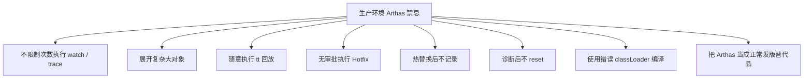

禁忌总结：

1. 不要在生产高峰期无脑 `trace`。
2. 不要对大对象使用过深的 `-x`。
3. 不要对有副作用的方法执行 `tt -p`。
4. 不要在没有备份的情况下做 Hotfix。
5. 不要热替换新增字段、方法、继承关系。
6. 不要忘记执行 `reset` 或 `stop`。
7. 不要把 Arthas 当成长期修复方案。

---

## 十、生产排查命令速查表

### 10.1 基础定位

```bash
uptime
nproc
top
ps -eo pid,ppid,user,stat,cmd,%cpu,%mem --sort=-%cpu | head -n 15
```

### 10.2 线程定位

```bash
top -Hp <PID>
printf "%x\n" <TID>
jstack -l <PID> > /tmp/jstack.txt
grep -n "<hex_tid>" /tmp/jstack.txt
```

### 10.3 Arthas 常用

```bash
dashboard
thread -n 5
thread <threadId>
watch com.example.Service method "{params, returnObj}" -x 2 -n 5
watch com.example.Service method "{params, throwExp}" -e -x 2 -n 5
trace com.example.Controller method '#cost > 200' -n 5
stack com.example.Service method -n 5
monitor com.example.Service method -c 5
jad com.example.Service
sc -d com.example.Service
reset
stop
```

### 10.4 内存与 Swap

```bash
free -h
vmstat 1 10
ps -eo pid,user,cmd,%mem,%cpu --sort=-%mem | head -n 15
```

### 10.5 磁盘 I/O

```bash
df -h
iostat -x 1 5
iotop -oPa
pidstat -d 1 5
```

### 10.6 网络与连接

```bash
ss -antp | head
ss -ant state established | wc -l
sar -n DEV 1 5
watch -n 1 "cat /proc/softirqs"
```

---

## 十一、总结

Java 线上性能排查的关键不是"会不会重启"，而是能不能在最短时间内做到：

1. 快速止血，让机器恢复可操作状态；
2. 保留现场，避免根因被破坏；
3. 用 `jstack`、Arthas、火焰图定位线程、方法、系统资源或外部流量；
4. 用 `watch`/`trace`/`stack` 深入方法级别确认根因；
5. 必要时用 Hotfix 临时止血，但最终通过正常发版修复；
6. 通过限流、隔离、监控、压测和代码修复避免再次发生。

最终要形成一种工程习惯：

> 故障现场是证据，不是垃圾；重启是恢复手段，不是根因分析。

掌握 Arthas 和系统级排查方法，不只是多会几个命令，而是从"只能写代码"进阶为"能定位问题、能处理事故、能守住线上稳定性"的 Java 工程师。

推荐的完整排查闭环：

```text
监控发现问题 → 快速止血 → 保留现场 → OS 级定位 → Arthas 深入 JVM → 确认根因 → 临时 Hotfix → 正式发版修复 → 复盘与长期治理
```

只要按"止血 → 存证 → 定位 → 恢复 → 复盘 → 治理"这个闭环执行，Java 线上性能问题就不会只停留在"临时处理"，而是能真正沉淀为团队的稳定性能力。
