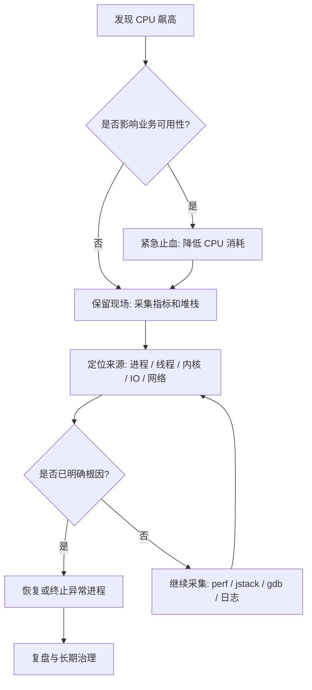
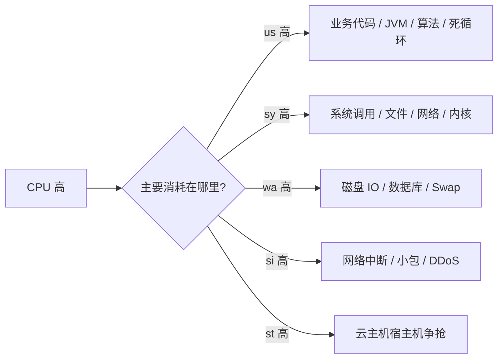
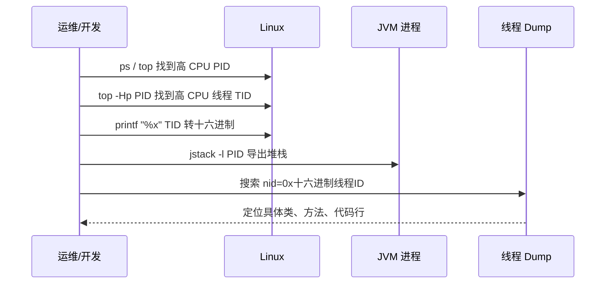
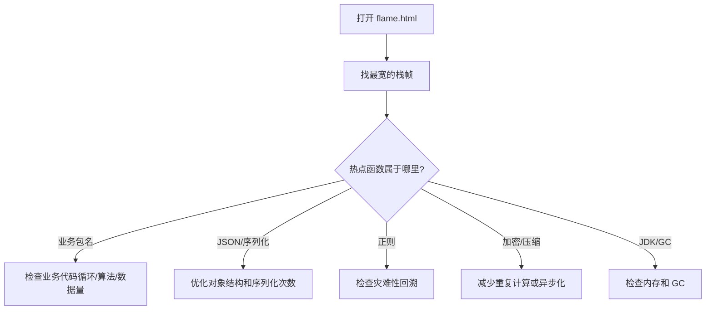
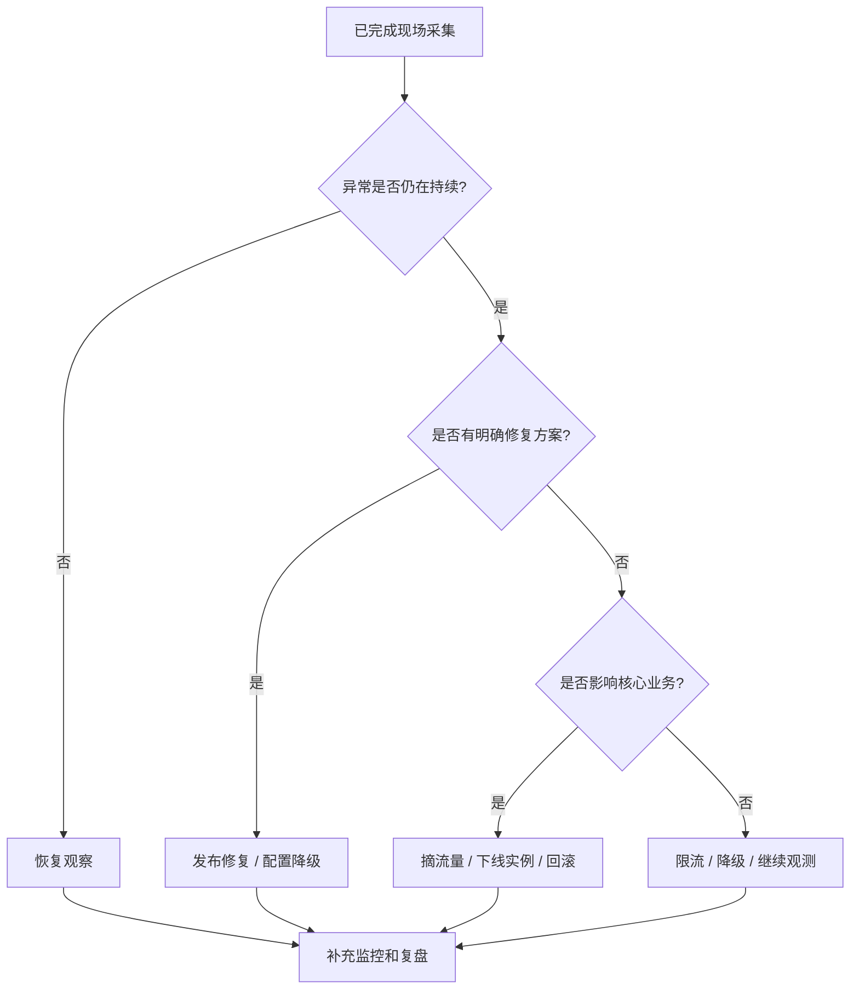

# Linux 高 CPU 应急排查指南：从快速止血到根因复盘

线上服务器 CPU 突然飙升到 90% 甚至 100%，通常会伴随接口超时、SSH 卡顿、日志刷屏、线程池堆积、服务不可用等问题。

很多人在第一反应中会选择：

```bash
kill -9 <PID>
# 或者直接重启服务 / 重启机器
```

但这往往是最危险的处理方式之一。因为它会直接破坏现场，导致后续无法判断到底是业务死循环、GC 风暴、线程池打满、系统中断异常，还是内存不足引起的连锁反应。

本文提供一套更稳妥的处理方法：

> 先止血，再存证；先定位，再恢复；先复盘，再预防。

---

## 一、整体排查思路

Linux 高 CPU 排查不要一上来就重启，而是按下面四个阶段推进。



核心原则：

| 阶段 | 目标          | 不建议做的事       | 推荐动作                   |
| -- | ----------- | ------------ | ---------------------- |
| 止血 | 让机器恢复可操作状态  | 直接 `kill -9` | `kill -STOP` 暂停异常进程    |
| 存证 | 保留故障现场      | 重启后再分析       | 保存 `top`、`ps`、线程、堆栈、日志 |
| 定位 | 找到 CPU 消耗来源 | 只看进程级 CPU    | 继续定位到线程、函数、系统资源        |
| 恢复 | 控制影响面       | 盲目恢复全部流量     | 分批恢复、灰度验证              |
| 预防 | 避免再次发生      | 只写一句“已修复”    | 加资源限制、监控、压测、代码修复       |

---

## 二、第一阶段：快速止血，不要破坏现场

### 2.1 先看系统是否还能操作

如果机器还能正常输入命令，先查看整体负载：

```bash
uptime
```

重点关注：

```text
load average: 12.34, 10.21, 8.90
```

如果是 4 核机器，load 长期超过 4 就需要警惕；如果是 8 核机器，load 长期超过 8 也说明排队明显。

查看 CPU 核心数：

```bash
nproc
```

查看整体 CPU、内存、进程状态：

```bash
top
```

如果 `top` 已经卡顿，可以使用快照式命令：

```bash
ps -eo pid,ppid,user,stat,cmd,%cpu,%mem --sort=-%cpu | head -n 15
```

输出示例：

```text
  PID  PPID USER  STAT CMD                         %CPU %MEM
12345     1 app   Sl   java -jar order-service.jar 389  42.1
22331     1 root  R    nginx: worker process        78   1.2
```

这里最关键的是找到：

* 哪个进程 CPU 最高；
* 是单进程高 CPU，还是多个进程一起高；
* 是业务进程高，还是系统进程高。

---

### 2.2 用 STOP 暂停进程，而不是直接 KILL

如果某个业务进程已经把 CPU 打满，导致机器无法继续操作，可以先暂停它：

```bash
sudo kill -STOP <PID>
```

例如：

```bash
sudo kill -STOP 12345
```

`SIGSTOP` 的效果是让进程暂停运行。它不会释放内存，也不会销毁进程上下文，适合用于“止血 + 保留现场”。

对比几种常见信号：

| 信号   | 命令                 | 作用   | 是否保留现场 | 使用场景        |
| ---- | ------------------ | ---- | ------ | ----------- |
| STOP | `kill -STOP <PID>` | 暂停进程 | 是      | 高 CPU 紧急止血  |
| CONT | `kill -CONT <PID>` | 恢复进程 | 是      | 存证后恢复验证     |
| TERM | `kill -TERM <PID>` | 优雅终止 | 部分保留   | 正常关闭服务      |
| KILL | `kill -9 <PID>`    | 强制杀死 | 否      | 进程无法正常退出时兜底 |

> 生产环境中，`kill -9` 应该是最后手段，不应该是第一手段。

---

## 三、第二阶段：保留现场证据

CPU 降下来之后，不要马上恢复服务。此时最重要的是保存现场。

### 3.1 保存基础系统信息

建议统一保存到一个目录：

```bash
mkdir -p /tmp/cpu-debug-$(date +%F-%H%M%S)
cd /tmp/cpu-debug-*
```

采集系统快照：

```bash
date > date.txt
uptime > uptime.txt
nproc > cpu_count.txt
free -h > memory.txt
df -h > disk.txt
ps -eo pid,ppid,user,stat,cmd,%cpu,%mem --sort=-%cpu > ps_cpu.txt
top -b -n 1 > top.txt
```

如果安装了 `vmstat`、`pidstat`、`mpstat`，继续采集：

```bash
vmstat 1 10 > vmstat.txt
mpstat -P ALL 1 5 > mpstat.txt
pidstat -u -p ALL 1 5 > pidstat.txt
```

---

### 3.2 判断 CPU 类型：user、system、iowait、softirq

`top` 中的 CPU 行通常类似：

```text
%Cpu(s): 85.0 us,  8.0 sy,  0.0 ni,  5.0 id,  1.0 wa,  0.0 hi,  1.0 si,  0.0 st
```

含义如下：

| 字段 | 含义      | 常见原因                |
| -- | ------- | ------------------- |
| us | 用户态 CPU | 业务代码计算、死循环、序列化、加密压缩 |
| sy | 内核态 CPU | 系统调用频繁、网络栈、文件系统操作   |
| wa | I/O 等待  | 磁盘慢、数据库慢、日志刷盘、交换分区  |
| hi | 硬中断     | 硬件中断异常              |
| si | 软中断     | 网络包过多、DDoS、小包风暴     |
| st | 虚拟化偷取时间 | 云主机资源争抢             |
| id | 空闲      | CPU 空闲比例            |

判断方向：



---

## 四、第三阶段：定位到具体进程和线程

### 4.1 定位最耗 CPU 的进程

```bash
ps -eo pid,ppid,user,stat,cmd,%cpu,%mem --sort=-%cpu | head -n 15
```

假设发现 Java 进程占用 CPU 很高：

```text
12345 app java -jar order-service.jar 389% 42.1%
```

389% 说明它大概使用了接近 4 个 CPU 核心。

---

### 4.2 定位进程内最耗 CPU 的线程

对多线程程序，例如 Java、C++、Go，仅知道 PID 不够，还要进一步找到线程。

```bash
top -Hp <PID>
```

示例：

```bash
top -Hp 12345
```

输出中重点看线程 ID：

```text
PID     USER  PR NI VIRT RES SHR S %CPU COMMAND
12367   app   20  0  ... ... ... R 99.9 java
12368   app   20  0  ... ... ... R 98.7 java
```

此时 `12367`、`12368` 是线程 ID。

Java 堆栈中的线程 ID 通常是十六进制，所以需要转换：

```bash
printf "%x\n" 12367
```

例如输出：

```text
304f
```

然后在 `jstack` 结果里搜索：

```bash
jstack -l 12345 > jstack.txt
grep -n "304f" jstack.txt
```

---

### 4.3 Java 高 CPU 排查路径

Java 服务高 CPU 最常见的几类原因：

| 类型     | 典型表现                   | 排查工具                 | 常见根因               |
| ------ | ---------------------- | -------------------- | ------------------ |
| 死循环    | 单个或少量线程 100%           | `top -Hp` + `jstack` | while 循环、递归、状态机错误  |
| GC 风暴  | CPU 高、吞吐下降、日志频繁 GC     | `jstat` + GC 日志      | 内存不足、对象创建过快        |
| 线程池打满  | 请求堆积、队列增长              | 线程池监控 + dump         | 下游慢、拒绝策略不合理        |
| 序列化/压缩 | CPU 高但线程正常运行           | 火焰图 / async-profiler | JSON 过大、压缩频繁       |
| 锁竞争    | 线程 BLOCKED / WAITING 多 | `jstack`             | synchronized 锁范围过大 |

Java 线程定位流程：



常用命令：

```bash
# 查看 JVM 参数
jcmd <PID> VM.flags

# 查看 JVM 系统属性
jcmd <PID> VM.system_properties

# 导出线程栈
jstack -l <PID> > /tmp/jstack-$(date +%F-%H%M%S).txt

# 查看 GC 情况
jstat -gcutil <PID> 1000 10

# 导出堆信息
jmap -heap <PID>
```

如果 CPU 高伴随频繁 GC，可以进一步查看 GC 日志或临时抓取对象直方图：

```bash
jmap -histo:live <PID> | head -n 30
```

> 注意：`jmap -histo:live` 可能触发 Full GC，生产环境要谨慎使用。

---

## 五、第四阶段：系统级高 CPU 特殊场景

并不是所有高 CPU 都来自业务进程。下面这些系统级场景也非常常见。

### 5.1 `kswapd0` 高 CPU：内存不足或 Swap 抖动

如果看到 `kswapd0` 占用 CPU 很高：

```bash
ps -eo pid,comm,%cpu,%mem --sort=-%cpu | head
```

可能说明系统内存紧张，内核正在频繁回收内存页面。

检查内存：

```bash
free -h
vmstat 1 10
```

重点看 `vmstat` 中的：

| 字段 | 含义       | 异常表现                 |
| -- | -------- | -------------------- |
| si | swap in  | 持续大于 0 说明频繁从 Swap 读入 |
| so | swap out | 持续大于 0 说明频繁写入 Swap   |
| r  | 运行队列     | 长期大于 CPU 核数说明 CPU 排队 |
| wa | I/O 等待   | 高说明磁盘或存储慢            |

处理建议：

```bash
# 查看占用内存最多的进程
ps -eo pid,user,cmd,%mem,%cpu --sort=-%mem | head -n 15
```

如果是缓存过高，不要随意清理；如果确认是非关键缓存或临时止血，可以谨慎执行：

```bash
sync
sudo sysctl vm.drop_caches=3
```

更长期的方案是：

* 修复内存泄漏；
* 调整 JVM 堆大小；
* 增加机器内存；
* 对服务配置 `MemoryMax` / `MemoryLimit`；
* 拆分过重任务。

---

### 5.2 softirq 高：网络中断或小包风暴

如果 `top` 中 `si` 很高，通常要怀疑网络中断。

查看软中断：

```bash
watch -n 1 "cat /proc/softirqs"
```

查看硬中断：

```bash
watch -n 1 "cat /proc/interrupts"
```

查看网络连接：

```bash
ss -antp | head
ss -ant state established | wc -l
```

查看网卡流量：

```bash
sar -n DEV 1 5
```

可能原因：

| 现象             | 可能原因           | 处理方向                     |
| -------------- | -------------- | ------------------------ |
| `si` 高         | 小包过多           | 检查入口流量、限流、防火墙            |
| 连接数暴涨          | 爬虫 / 攻击 / 连接泄漏 | Nginx 限流、连接池治理           |
| 单核 CPU 特别高     | 网卡中断集中在单核      | IRQ 亲和性、RSS/RPS 调整       |
| Nginx worker 高 | 请求量过大或反向代理异常   | access log、upstream 延迟分析 |

---

### 5.3 iowait 高：磁盘或下游存储慢

如果 `wa` 高，说明 CPU 在等 I/O。

检查磁盘：

```bash
iostat -x 1 5
```

重点看：

| 字段              | 含义     | 判断            |
| --------------- | ------ | ------------- |
| `%util`         | 设备繁忙程度 | 接近 100% 表示磁盘忙 |
| `await`         | 平均等待时间 | 高说明 I/O 延迟大   |
| `r/s`、`w/s`     | 每秒读写次数 | 判断读写压力        |
| `rkB/s`、`wkB/s` | 每秒读写量  | 判断吞吐压力        |

找出哪个进程在大量读写：

```bash
iotop -oPa
```

或者：

```bash
pidstat -d 1 5
```

常见原因：

* 日志疯狂刷盘；
* 大文件上传或下载；
* 数据库慢查询；
* 临时文件过多；
* 容器日志没有轮转；
* 磁盘空间不足导致系统异常。

---

## 六、第五阶段：火焰图定位热点函数

当 `jstack` 只能看到线程在运行，但无法判断真正热点时，可以使用火焰图。

### 6.1 Java 推荐 async-profiler

示例：

```bash
./profiler.sh -d 30 -e cpu -f /tmp/cpu-flame.html <PID>
```

含义：

| 参数       | 含义        |
| -------- | --------- |
| `-d 30`  | 采样 30 秒   |
| `-e cpu` | 采样 CPU 事件 |
| `-f`     | 输出文件      |
| `<PID>`  | 目标进程      |

火焰图阅读方法：



---

## 七、恢复决策：继续、重启还是下线？

采集完证据后，需要决定怎么恢复。



常见恢复动作：

| 动作     | 命令 / 方法             | 适用情况            |
| ------ | ------------------- | --------------- |
| 恢复暂停进程 | `kill -CONT <PID>`  | 已采集完证据，需要观察是否复现 |
| 优雅终止   | `kill -TERM <PID>`  | 服务可被拉起，允许正常退出   |
| 强制终止   | `kill -9 <PID>`     | 进程无响应，TERM 无效   |
| 摘除流量   | Nginx / 网关 / 注册中心下线 | 避免继续影响用户        |
| 回滚版本   | 发布平台回滚              | 明确由新版本引起        |
| 限流降级   | 网关、配置中心             | 下游慢、突发流量、热点接口   |

恢复后至少观察：

```bash
top
uptime
free -h
ss -antp | wc -l
journalctl -u <service> -n 200 --no-pager
```

---

## 八、长期治理：让单个服务不能拖垮整台机器

### 8.1 使用 systemd 限制 CPU 和内存

生产环境中，不应该允许一个非核心服务无限制占满 CPU。

编辑服务文件：

```bash
sudo vim /etc/systemd/system/myapp.service
```

示例：

```ini
[Unit]
Description=My Application
After=network.target

[Service]
User=app
WorkingDirectory=/opt/myapp
ExecStart=/usr/bin/java -jar /opt/myapp/app.jar
Restart=on-failure
RestartSec=5

# 最多使用 50% 单核 CPU；如果是 200%，约等于最多使用 2 核
CPUQuota=50%

# 限制最大内存
MemoryMax=2G

# 限制打开文件数
LimitNOFILE=65535

[Install]
WantedBy=multi-user.target
```

重新加载：

```bash
sudo systemctl daemon-reload
sudo systemctl restart myapp
```

查看限制是否生效：

```bash
systemctl show myapp | grep -E "CPUQuota|MemoryMax|LimitNOFILE"
```

---

### 8.2 容器环境限制资源

Docker 示例：

```bash
docker run -d \
  --name myapp \
  --cpus="1.5" \
  --memory="2g" \
  --memory-swap="2g" \
  myapp:latest
```

Docker Compose 示例：

```yaml
services:
  myapp:
    image: myapp:latest
    container_name: myapp
    deploy:
      resources:
        limits:
          cpus: "1.5"
          memory: 2G
    restart: unless-stopped
```

---

### 8.3 监控指标设计

建议至少监控以下指标：

| 指标           |        推荐阈值 | 说明        |
| ------------ | ----------: | --------- |
| CPU 使用率      |  5 分钟 > 85% | 判断整体压力    |
| Load Average | 持续 > CPU 核数 | 判断 CPU 排队 |
| iowait       |  5 分钟 > 20% | 判断磁盘/存储慢  |
| softirq      |      明显异常升高 | 判断网络中断问题  |
| 内存使用率        |       > 90% | 判断内存紧张    |
| Swap In/Out  |      持续 > 0 | 判断内存抖动    |
| 进程 CPU       |  单进程 > 300% | 判断某服务异常   |
| JVM GC 时间    |        持续升高 | 判断 GC 风暴  |
| 线程数          |        超过基线 | 判断线程泄漏    |
| 接口 P95/P99   |      超过 SLA | 判断业务影响    |

Prometheus 查询示例：

```promql
# CPU 使用率
100 - (avg by(instance) (rate(node_cpu_seconds_total{mode="idle"}[5m])) * 100)
```

```promql
# iowait 占比
avg by(instance) (rate(node_cpu_seconds_total{mode="iowait"}[5m])) * 100
```

```promql
# 1 分钟负载
node_load1
```

```promql
# 可用内存比例
node_memory_MemAvailable_bytes / node_memory_MemTotal_bytes * 100
```

---

## 九、生产排查命令速查表

### 9.1 基础定位

```bash
uptime
nproc
top
ps -eo pid,ppid,user,stat,cmd,%cpu,%mem --sort=-%cpu | head -n 15
```

### 9.2 线程定位

```bash
top -Hp <PID>
printf "%x\n" <TID>
jstack -l <PID> > /tmp/jstack.txt
grep -n "<hex_tid>" /tmp/jstack.txt
```

### 9.3 内存与 Swap

```bash
free -h
vmstat 1 10
ps -eo pid,user,cmd,%mem,%cpu --sort=-%mem | head -n 15
```

### 9.4 磁盘 I/O

```bash
df -h
iostat -x 1 5
iotop -oPa
pidstat -d 1 5
```

### 9.5 网络与连接

```bash
ss -antp | head
ss -ant state established | wc -l
sar -n DEV 1 5
watch -n 1 "cat /proc/softirqs"
watch -n 1 "cat /proc/interrupts"
```

### 9.6 systemd 服务

```bash
systemctl status <service>
journalctl -u <service> -n 200 --no-pager
systemctl show <service> | grep -E "CPUQuota|MemoryMax|LimitNOFILE"
```

---

## 十、典型案例：Java 服务 CPU 400% 排查

### 10.1 现象

某订单服务接口大量超时，监控显示：

| 指标           |   数值 |
| ------------ | ---: |
| CPU 使用率      |  96% |
| Load Average |   18 |
| 机器核心数        |  4 核 |
| Java 进程 CPU  | 390% |
| P99 延迟       |   8s |

### 10.2 排查步骤

第一步，找到进程：

```bash
ps -eo pid,ppid,user,cmd,%cpu,%mem --sort=-%cpu | head
```

发现：

```text
12345 app java -jar order-service.jar 390% 45%
```

第二步，暂停止血：

```bash
sudo kill -STOP 12345
```

第三步，采集线程：

```bash
top -Hp 12345
```

发现线程 `12367` 持续 99%。

第四步，转换十六进制：

```bash
printf "%x\n" 12367
# 304f
```

第五步，导出堆栈并搜索：

```bash
jstack -l 12345 > /tmp/jstack.txt
grep -n "304f" /tmp/jstack.txt
```

定位到某个优惠规则计算方法反复循环。

### 10.3 根因

优惠规则配置中出现了环形依赖：

```text
规则 A 依赖规则 B
规则 B 依赖规则 C
规则 C 又依赖规则 A
```

代码中没有做 visited 集合判断，导致死循环。

### 10.4 修复方案

* 增加规则依赖图的环检测；
* 对规则计算增加最大递归深度；
* 对接口增加超时和降级；
* 对异常配置增加发布前校验；
* 增加单元测试覆盖环形依赖场景。

示例伪代码：

```java
public Result calculateRule(Rule rule, Set<Long> visited) {
    if (visited.contains(rule.getId())) {
        throw new BizException("规则存在环形依赖: " + rule.getId());
    }
    visited.add(rule.getId());

    for (Rule dependency : rule.getDependencies()) {
        calculateRule(dependency, visited);
    }

    visited.remove(rule.getId());
    return doCalculate(rule);
}
```

---

## 十一、事故复盘模板

高 CPU 故障处理完成后，建议按下面模板沉淀复盘。

```markdown
# CPU 高负载事故复盘

## 1. 基本信息
- 事故时间：
- 影响服务：
- 影响范围：
- 发现方式：监控 / 用户反馈 / 巡检
- 处理人：

## 2. 时间线
- 10:00 监控报警 CPU 超过 90%
- 10:03 登录机器查看进程
- 10:05 暂停异常进程并采集堆栈
- 10:10 定位到异常线程
- 10:20 完成临时恢复
- 11:30 发布修复版本

## 3. 现场证据
- top 快照：
- ps 快照：
- jstack 文件：
- GC 日志：
- 应用日志：
- 监控截图：

## 4. 根因分析
- 直接原因：
- 深层原因：
- 为什么测试环境没有发现：
- 为什么监控没有更早发现：

## 5. 修复措施
- 代码修复：
- 配置修复：
- 容量修复：
- 监控修复：

## 6. 后续行动
- [ ] 增加单元测试
- [ ] 增加压测场景
- [ ] 增加 CPU/线程/GC 告警
- [ ] 增加服务资源限制
- [ ] 完成知识库沉淀
```

---

## 十二、总结

Linux 高 CPU 问题的关键不是“会不会重启”，而是能不能在最短时间内做到：

1. 快速止血，让机器恢复可操作状态；
2. 保留现场，避免根因被破坏；
3. 定位线程、函数、系统资源或外部流量；
4. 做出正确恢复决策，而不是盲目重启；
5. 通过限流、隔离、监控、压测和代码修复避免再次发生。

最终要形成一种工程习惯：

> 故障现场是证据，不是垃圾；重启是恢复手段，不是根因分析。

只要按“止血 → 存证 → 定位 → 恢复 → 复盘 → 治理”这个闭环执行，高 CPU 问题就不会只停留在“临时处理”，而是能真正沉淀为团队的稳定性能力。