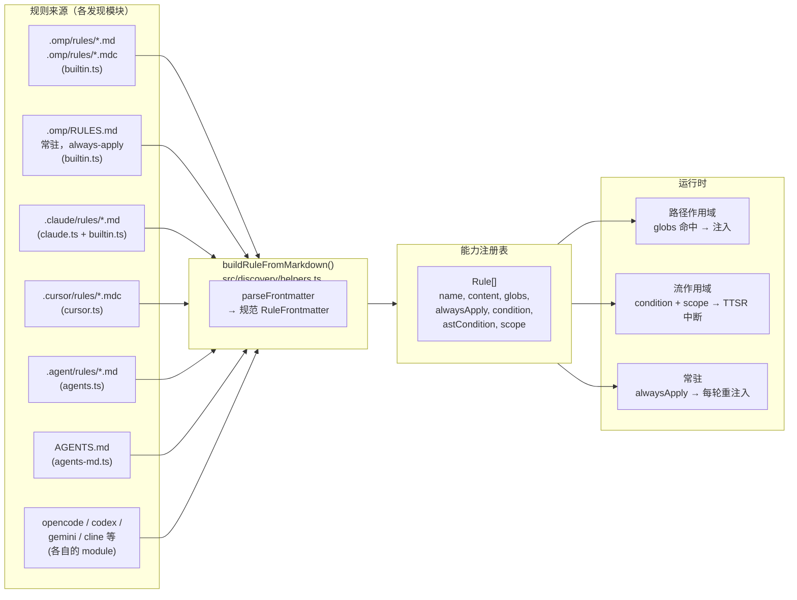
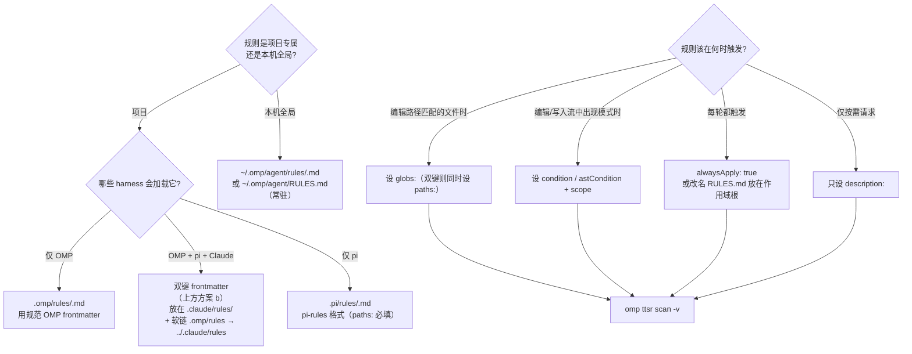

# OMP Agent 规则系统剖析：多源发现、三种注入与 paths/globs 静默失效陷阱

当我们用 AI Agent 框架做实际工程时，"规则"（rules）是把团队约定落到代码层的关键机制：它告诉 Agent 在编辑某类文件时必须遵守什么、在什么场景下绝不能做什么、以及哪些约束需要每轮对话都反复提醒。但规则的难点从来不在"写一条规则"，而在"这条规则到底会不会被加载、会不会在正确的时机注入"。

本文系统剖析 OMP Agent（`@oh-my-pi/pi-coding-agent`）的规则配置全景——多源发现链、统一的规范化管线、三种注入模式，并重点拆解一个源码验证过的静默失效陷阱：从 pi-rules 或 Claude Code 迁移规则时，`paths:` 与 `globs:` 键的不互通。

> 阅读顺序：先理解整体架构与三种注入模式，再看发现链与规范 frontmatter，最后把 paths/globs 陷阱和验证清单当作日常手册。

---

## 一、背景：规则即配置

Agent 编排框架需要一个"上下文相关的约束层"：同一个 Agent，编辑 Java 后端时要遵守一套规则，写前端时又要遵守另一套。规则就是这个约束层的载体。

理想情况下，规则系统要解决三件事：

- **从哪里来**：多个 harness（omp、Claude Code、Cursor、pi 等）各有各的规则目录，如何统一收口；
- **怎么规范化**：不同来源的 frontmatter 字段各异，如何归一成一种结构；
- **何时注入**：一条规则是按路径匹配注入、按编辑流模式注入，还是每轮都注入。

OMP 的做法是：每个来源各有一个发现模块（discovery module），所有被发现的规则最终都汇入同一个 `buildRuleFromMarkdown()`，强制归一成单一的规范结构，再按 frontmatter 路由到三种注入模式之一。

---

## 二、整体架构：多源发现到统一注入

OMP 从多个来源把规则合并进一个能力注册表（capability registry）。每个来源有自己的发现模块，但所有规则都经过 `buildRuleFromMarkdown()` 强制成单一规范形状。



### 三种规则注入模式

每条被加载的规则，依据其 frontmatter 精确路由到下面三种运行时模式之一：

| 模式 | 触发条件 | 实际行为 |
| --- | --- | --- |
| **路径作用域（path-scoped）** | `globs: [...]` 命中正在编辑/读取的文件 | 仅当候选路径匹配时，才把规则正文注入上下文 |
| **流作用域（TTSR）** | `condition:` / `astCondition:` + `scope:`（如 `tool:edit(*.ts)`） | 当模式命中编辑/写入/读取内容时，作为**流中断**触发 |
| **常驻（sticky / always-apply）** | `alwaysApply: true`，或顶层的 `RULES.md` 文件 | 每轮在当前回合附近重新注入——长对话中也不会丢失 |

一条规则如果**这三种键都没有**，会退化为**按需请求（agent-requested）**规则：靠 `description:` 建立索引供按需检索，不会自动注入。

---

## 三、发现链：哪些路径会被扫描

这部分通过阅读 `src/discovery/index.ts`（发现模块注册表）和各模块的 `loadRules` 等价方法核实。**无论哪个发现模块找到的规则文件，最终都汇入 `buildRuleFromMarkdown()`**。

### 原生 OMP 路径（builtin.ts 的 `loadRules`）

| 路径（从 cwd 向上遍历） | 作用域 | 行为 |
| --- | --- | --- |
| `.omp/rules/*.md` 和 `*.mdc` | 项目 | 标准规则文件——frontmatter 决定注入模式 |
| `~/.omp/agent/rules/*.md` 和 `*.mdc` | 用户 | 同上——对本机所有项目生效 |
| `.omp/RULES.md`（最近的一个，向上遍历到仓库根） | 项目 | **常驻 always-apply**——无视 frontmatter 强制生效 |
| `~/.omp/agent/RULES.md` | 用户 | **常驻 always-apply**——全局基线 |

向上遍历在 `os.homedir()` 处停止——`~/.omp/` 是用户级根，不是项目根。第一个找到的 `.omp/` 目录生效；若都没有，OMP 回退到 git 根目录。

### 跨 harness 路径（每个模块自注册）

| 模块 | 扫描路径 | 格式说明 |
| --- | --- | --- |
| `agents-md.ts` | `AGENTS.md`（最近，向上遍历）+ 嵌套子树的 `AGENTS.md` | 领域指导，不是路径作用域规则 |
| `claude.ts` | `~/.claude/` + `<cwd>/.claude/` | 扫描 `rules/`、`commands/`、`tools/`、`skills/` 等。规则走同一个 `buildRuleFromMarkdown` |
| `cursor.ts` | `.cursor/rules/*.mdc` + 旧版 `.cursorrules` | MDC frontmatter：`description`、`globs`、`alwaysApply` |
| `agents.ts` | `.agent/rules/`、`.agents/rules/`（向上遍历 + 用户主目录） | 通用 agent 生态目录约定 |
| `codex.ts`、`gemini.ts`、`opencode.ts`、`cline.ts` 等 | 各 harness 自己的目录 | 各自注册，最终都归一成同一种规范规则形状 |

### 哪些路径**不会**被扫描

| 路径 | 原因 |
| --- | --- |
| `.pi/rules/` | pi 专属约定。OMP 没有 `pi.ts` 发现模块——**这正是符号链接桥接存在的理由** |
| `mcp.json` 里的 `rules:` 键 | 空操作。`mcp-schema.json` 在顶层声明 `additionalProperties: false`——未知键被静默丢弃 |
| `config.yml` 里的 `rules:` 块 | 根本没有这个配置键。OMP 有 `memory.*`、`advisor.*`、`modelRoles.*`、`retry.*`——唯独没有 `rules.*` |

---

## 四、规范 frontmatter：RuleFrontmatter

对照 `src/capability/rule.ts`（`RuleFrontmatter`）与 `src/discovery/helpers.ts`（`buildRuleFromMarkdown`）核实。

```yaml
---
# 规范 OMP frontmatter（任意子集，全部可选）
description: 一句话，供按需检索。无 globs/condition 时必填。
globs:
  - "backend-spring/src/**/*.java"
  - "docker/sandbox/harness/java/src/**/*.java"
alwaysApply: false        # true → 常驻，每轮重注入
condition:                # 触发 TTSR 中断的正则
  - "^import\s+java\.util\.Date$"
astCondition:             # ast-grep 模式；仅编辑/写入流
  - "new $T($$$ARGS)"
scope:                    # TTSR 流作用域 token
  - "tool:edit(*.java)"
  - "tool:write(*.java)"
interruptMode: prose-only # never | prose-only | tool-only | always
---

# 规则正文 —— Markdown

- 具体、可执行的约束，用 MUST / SHOULD / NEVER 表述。
- 阅读顺序：父文件描述何时进入（WHEN），子文件描述怎么做（HOW）。
```

### frontmatter 键的权威清单

| 键 | OMP 是否读取 | 说明 |
| --- | --- | --- |
| `description` | ✅ | 无作用域匹配时用于按需检索 |
| `globs` | ✅ | **OMP 唯一认的路径作用域键** |
| `alwaysApply` | ✅ | `true` → 常驻 always-apply |
| `condition` / `ttsr_trigger` / `ttsrTrigger` | ✅ | 三种别名都接受 |
| `astCondition` | ✅ | ast-grep 模式；仅编辑/写入流 |
| `scope` | ✅ | 流 token，如 `text`、`thinking`、`tool:edit(*.ts)` |
| `interruptMode` | ✅ | 单规则覆盖 `ttsr.interruptMode` |
| **`paths`** | ❌ **不读** | 见下方陷阱——pi-rules / Claude Code 格式 |
| **`kind`** | ❌ 忽略 | pi-rules 标记（`kind: rules`），OMP 不以此键区分 |
| **`summary`** | ❌ 忽略 | pi-rules 摘要，落入 `[key: string]: unknown` |
| **`triggers`** | ❌ 忽略 | pi-rules 触发器，同上 |

---

## 五、paths 与 globs 的互通陷阱（源码验证）

**这是把规则集从 pi-rules 或 Claude Code 迁移到 OMP 时，最常见的静默失效模式。**

### 机理

`buildRuleFromMarkdown()` 只读取 `frontmatter.globs`：

```ts
let globs: string[] | undefined;
if (Array.isArray(frontmatter.globs)) {
  globs = frontmatter.globs.filter((item): item is string => typeof item === "string");
} else if (typeof frontmatter.globs === "string") {
  globs = [frontmatter.globs];
}
```

没有任何发现模块（`builtin.ts`、`claude.ts`、`cursor.ts`、`agents.ts`……）会对 frontmatter 做后处理，把 `paths:` 翻译成 `globs:`。用 `grep -rEn "paths.*globs|frontmatter\.paths" src/discovery/` 核实——零命中。

### 症状

一条写成这样的规则：

```yaml
---
paths:
  - "backend-spring/src/**/*.java"
---
```

会被 OMP 加载，但 `globs` 解析为 `undefined`。于是规则退化为**按需请求**（基于 description 的检索）——**永远不会在路径匹配时自动注入**。而且**没有任何警告、没有日志、没有报错**。规则就是不会在你编辑 `*.java` 文件时触发。

### 两种修复（每个仓库任选其一）

**(a) 用 OMP 规范格式写规则**——用 `globs:` 取代 `paths:`。除了 pi（要求 `paths:`）外到处可用。

```yaml
---
globs:
  - "backend-spring/src/**/*.java"
description: Java 17 后端源码规则。
---
```

**(b) frontmatter 双键**——两个键都保留，每个 harness 读自己认的那个。略有冗余，但零互通风险：

```yaml
---
kind: rules                 # pi-rules 标记（OMP 忽略，pi 要求）
paths:                      # pi-rules / Claude Code 路径作用域
  - "backend-spring/src/**/*.java"
globs:                      # OMP 规范路径作用域
  - "backend-spring/src/**/*.java"
summary: Java backend rules. # pi-rules 摘要（OMP 忽略）
description: Java backend rules. # OMP 检索键（pi 忽略）
---
```

> **共享目录（`.claude/rules/`、`.pi/rules/`）推荐方案 (b)**。4 个键的冗余是机械的，且能扛任何 harness 切换。

### 验证

```bash
# OMP 实际加载了哪些规则（规则名 + 来源）
cd <repo> && omp ttsr list

# 对某个候选文件干跑一条规则（绕过项目加载）
omp ttsr test --rule .omp/rules/no-any.md --source tool --path src/foo.ts 'const x: any = 1'

# 用活跃规则集扫描一个目录
omp ttsr scan -r .omp/rules/no-any.md src/

# 显示所有被求值的规则，而不只是触发的
omp ttsr scan -v src/
```

如果你期望出现的规则不在 `omp ttsr list` 里，说明它**没有 TTSR 元数据**——纯路径作用域规则就是如此。用 `ttsr scan` 的 verbose 标志确认路径作用域规则是否已挂上。

---

## 六、端到端接入流程

新增一条**规则**的决策树。每一步都有具体命令或文件改动。



### pi-rules → OMP 桥接（每个仓库一次性）

如果仓库的规范规则树是 `.pi/rules/`（pi 约定），而你想让 OMP 加载同一批文件，用**目录符号链接**，而不是逐文件链接：

```bash
# 在仓库根
mkdir -p .omp
ln -s ../.pi/rules .omp/rules
```

逐文件链接一旦新增规则文件就会失效。目录符号链接是渐进式的。**注意**：桥接只是让文件对 OMP 的扫描器"可见"，并**不会**把 `paths:` 翻译成 `globs:`。必须把桥接和上面的双键修复组合使用，否则规则会静默退化。

---

## 七、规则写作三定律

这三条与 harness 无关，适用于任何规则体系。

1. **广度先于深度。** 父文件描述*何时*进入子文件——而不是在那里*怎么做*。读者如果走错了子树，应该从父文件的摘要就能看出来，而不是读完子文件才发现。
2. **不重复。** 一个事实若在子文件里，父文件就不要复述；若在父文件里，子文件就不要重申。重复会漂移，漂移会瓦解信任。
3. **描述即决策。** 每个 frontmatter 的 `description` / `summary` 都必须回答：*Agent 该在何时进入这里？* 不只是"这里有什么"，而是*它何时相关*。一句"Java 规则"很弱；一句"Java 17 后端源码规则——在 `backend-spring/` 下编辑 `.java` 时进入"就很强。

### 具体措辞规则

- 用 `MUST` / `SHOULD` / `NEVER`（RFC 2119）——OMP 的系统提示词会尊重它们。
- 一条 bullet 一个约束。多从句的 bullet 会被略读。
- 用规范路径/模式的具体名字（`backend-spring/src/**`）——绝不要写"相关目录"。
- 负向约束（`NEVER`、`MUST NOT`）要配**原因**——`NEVER 存储明文 refresh token（只用 HttpOnly cookie；数据库侧只存哈希）`。

---

## 八、已知陷阱与经验

| 陷阱 | 症状 | 缓解办法 |
| --- | --- | --- |
| **`paths:` 与 `globs:` 不匹配** | 规则被加载但路径匹配时从不触发；无报错日志 | 用 `globs:`（OMP）或双键 frontmatter（共享目录） |
| **`mcp.json` 里的 `rules:` 键** | 被静默丢弃；规则从不出现 | `mcp-schema.json` 禁止未知顶层键。改用 `~/.omp/agent/rules/` 或 `.omp/rules/` 文件 |
| **`.pi/rules/` 不被 OMP 加载** | pi 专属约定；OMP 无 `pi.ts` 发现模块 | 符号链接桥接：`.omp/rules → ../.pi/rules` |
| **顶层 `RULES.md` 在深层被忽略** | 常驻规则在嵌套子树不生效 | `RULES.md` 从 cwd 向上遍历到 repoRoot——放在仓库根，别放子目录 |
| **`alwaysApply: true` 灌满上下文** | 每条规则每轮重注入，上下文膨胀 | 把 `alwaysApply` 留给真正的全局约束。95% 的场景优先用路径作用域（`globs:`）或 TTSR（`condition:` + `scope:`） |
| **符号链接的 `.omp/rules/` 变陈旧** | 源树新增文件后不出现 | 用目录符号链接（而非逐文件），自动纳入新文件。新增后用 `omp ttsr list` 验证 |
| **`AGENTS.md` 与 `rules/*.md` 重复** | 同一约束两边都写，必然漂移 | `AGENTS.md` 写*边界与流程*（架构层）；`rules/*.md` 写*路径作用域约束*。不要把一边原样搬到另一边 |
| **一个文件里混了多 harness 的 frontmatter** | 读者搞不清哪个 harness 认哪个键 | 给每个键加注释标签：`# omp 规范`、`# pi-rules`、`# Claude Code`——或按 harness 拆成独立文件 |

---

## 九、验证清单（可重复执行）

每次改动规则文件、符号链接或 frontmatter 后逐项核对：

- [ ] `cd <repo> && omp ttsr list` 显示预期的规则数（仅 TTSR 规则）
- [ ] `omp ttsr scan -v <候选路径>` 显示路径作用域规则已挂上
- [ ] `omp ttsr test --rule <规则文件> --source tool --path <路径> <片段>` 对正向片段触发、对负向片段静默
- [ ] 共享目录：grep 确认双键 frontmatter——当存在 `paths:` 时，`grep -L "globs:" <repo>/.omp/rules/*.md` 应返回空
- [ ] 符号链接桥接：`readlink .omp/rules` 能解析；`find -L .omp/rules -type f | wc -l` 与源一致
- [ ] 顶层 `RULES.md`（若有）能作为 Markdown 解析；每个作用域一条常驻规则
- [ ] `mcp.json` 里没有 `rules:` 键（会被静默丢弃，别依赖它）

---

## 十、结语

规则系统的价值，取决于"写下的约束是否真的在正确的时机生效"。而让约束静默失效的方式，远比让它生效的方式多：

- **收口**靠的是统一规范化——所有来源汇入同一个 `buildRuleFromMarkdown`；
- **路由**靠的是 frontmatter 的三种注入模式各司其职；
- **可信**靠的是把 `paths:`/`globs:` 这类静默陷阱沉淀成清单，而不是依赖"上次没出事"。

只要守住"统一归一、模式分明、陷阱清单化"，规则就不再是写在文件里却没人知道是否生效的黑盒，而是一套可验证、可审计的工程能力。

> 本文聚焦"流程"与"经验"。具体的逐步操作（目录符号链接桥接、各 harness 发现模块自注册、TS schema 读取）应作为可执行的 SOP 单独维护，与这份流程手册互为补充。
