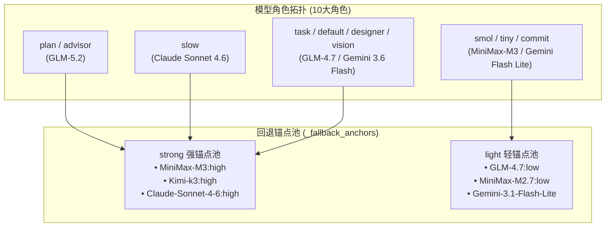
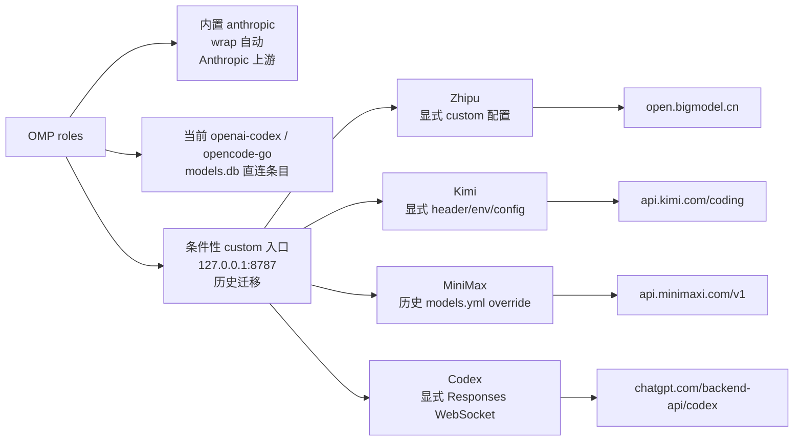
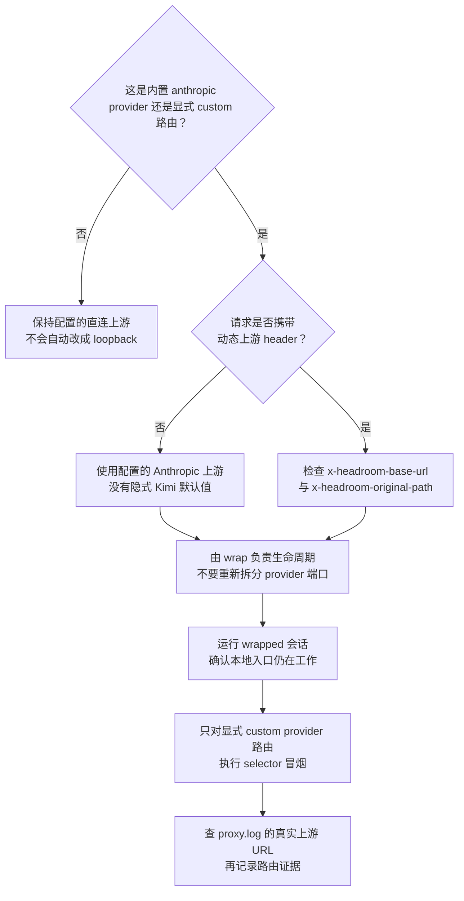
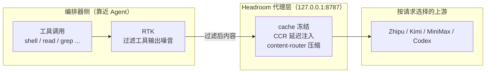
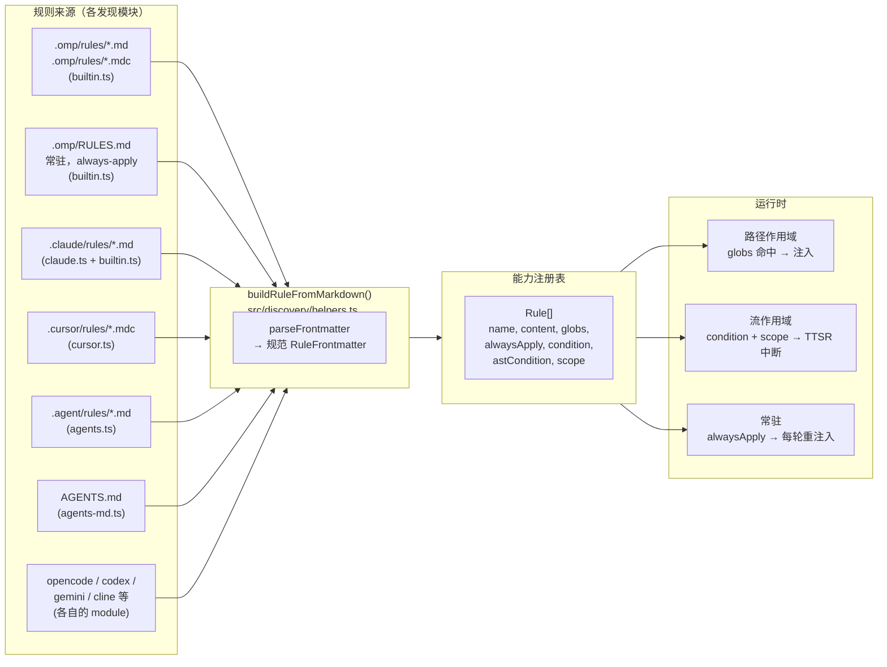
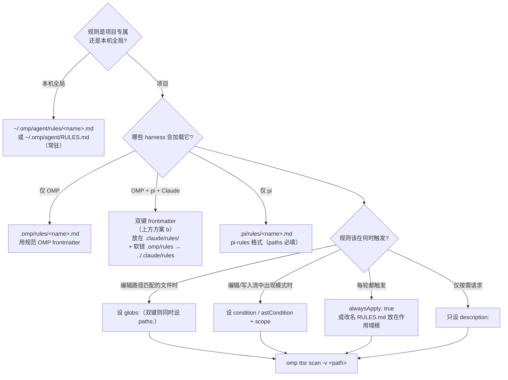

# OMP 配置与规则体系全指南：全局配置、Headroom 代理与 Agent 规则系统

OMP（Oh My Pi）是一个高度可定制的 AI Agent 编排框架。要让它在生产环境中稳定运行，需要同时驾驭三个维度：**全局配置**决定模型路由与容错策略，**代理层**决定流量治理与成本优化，**规则系统**决定 Agent 在什么场景下遵守什么约束。

本文是三篇 OMP 专题文章的合并版，从全局配置到代理层再到规则系统，构建一套完整的 OMP 配置体系叙事。

---

## 一、OMP 配置体系概览与设计哲学

OMP 的配置体系围绕三个核心关注点展开：

1. **模型路由与容错**：通过 `~/.omp/agent/config.yml` 定义 10 大模型角色、回退锚点池与全角色降级链，实现能力与成本的精细化平衡。
2. **流量治理**：通过 Headroom 压缩代理层，把自定义模型供应商统一接入 OMP，对经过的流量做透明压缩、缓存与协议归一。
3. **约束注入**：通过规则系统（Rules）的多源发现、统一规范化与三种注入模式，把团队约定落到代码层面。

三者之间的关系：全局配置决定"用哪个模型"，Headroom 决定"流量怎么走"，规则系统决定"Agent 怎么做"。理解这三层，就能驾驭 OMP 从安装到运维的完整生命周期。

---

## 二、全局配置解析：模型角色、降级链与运行控制

### 2.1 当前全局配置全览

以下为 `~/.omp/agent/config.yml` 当前生效的完整配置快照：

```yaml
setupVersion: 1
modelRoles: 
  plan: zhipu-coding-plan/glm-5.2:max
  advisor: zhipu-coding-plan/glm-5.2
  slow: google-antigravity/claude-sonnet-4-6:high
  task: zhipu-coding-plan/glm-4.7:high
  designer: google-antigravity/gemini-3.6-flash-high
  smol: minimax-code-cn/MiniMax-M3:low
  tiny: zhipu-coding-plan/glm-4.7:low
  commit: google-antigravity/gemini-3.1-flash-lite
  vision: google-antigravity/gemini-3.6-flash-high
  default: google-antigravity/gemini-3.6-flash:medium

_fallback_anchors: 
  strong: 
    - minimax-code-cn/MiniMax-M3:high
    - kimi-code/k3:high
    - google-antigravity/claude-sonnet-4-6:high
  light: 
    - zhipu-coding-plan/glm-4.7:low
    - minimax-code-cn/MiniMax-M2.7:low
    - google-antigravity/gemini-3.1-flash-lite

retry: 
  enabled: true
  maxRetries: 5
  baseDelayMs: 2000
  fallbackRevertPolicy: cooldown-expiry
  fallbackChains: 
    slow: 
      - kimi-code/k3:high
      - minimax-code-cn/MiniMax-M3:high
      - google-antigravity/claude-sonnet-4-6:high
    plan: 
      - minimax-code-cn/MiniMax-M3:high
      - kimi-code/k3:high
      - google-antigravity/claude-sonnet-4-6:high
    advisor: 
      - minimax-code-cn/MiniMax-M3:high
      - kimi-code/k3:high
      - google-antigravity/claude-sonnet-4-6:high
    default: 
      - kimi-code/kimi-for-coding:high
      - zhipu-coding-plan/glm-4.7:high
      - google-antigravity/gemini-3.6-flash-high
    task: 
      - zhipu-coding-plan/glm-4.7:high
      - kimi-code/kimi-for-coding:high
      - google-antigravity/gemini-3.6-flash-high
    designer: 
      - google-antigravity/gemini-3.6-flash-high
      - kimi-code/k3:high
      - minimax-code-cn/MiniMax-M3:high
    vision: 
      - kimi-code/k3:high
      - minimax-code-cn/MiniMax-M3:high
      - google-antigravity/gemini-3.6-flash-high
    smol: 
      - zhipu-coding-plan/glm-4.7:low
      - google-antigravity/gemini-3.1-flash-lite
    tiny: 
      - kimi-code/kimi-for-coding:low
      - google-antigravity/gemini-3.1-flash-lite
    commit: 
      - zhipu-coding-plan/glm-4.7:low
      - kimi-code/kimi-for-coding:low
  usageAwareFallback: true
  usageReservePolicy: auto
  usageReservePct: 10

advisor: 
  enabled: true
  subagents: true
symbolPreset: ascii
theme: 
  dark: dark-volcanic
  light: light
disabledExtensions: []
memory: 
  backend: hindsight
hindsight: 
  apiUrl: http://localhost:42888
autolearn: 
  enabled: true
  autoContinue: true
defaultThinkingLevel: auto
dev: 
  autoqaConsent: granted
prewalk: 
  enabled: true
display: 
  showTokenUsage: true
compaction: 
  idleEnabled: true
  idleThresholdTokens: 200000
task: 
  prewalk: true
  eager: preferred
goal: 
  continuationModes: 
    - interactive
branchSummary: 
  enabled: true
snapcompact: 
  systemPrompt: none
  toolResults: true
ttsr: 
  interruptMode: prose-only
checkpoint: 
  enabled: false
computer: 
  enabled: false
statusLine: 
  showHookStatus: false
```

### 2.2 模型角色拓扑与回退锚点机制

OMP 通过 `modelRoles` 将不同的 Agent 工作荷载精确分派给专长模型，并通过 `_fallback_anchors` 建立了强能力与轻量能力的全局降级水坝。



#### 10 大模型角色分工

- **高阶规划与架构 (`plan` / `advisor`)**：采用 `zhipu-coding-plan/glm-5.2`，负责全局架构设计与建议。
- **深度推理 (`slow`)**：采用 `google-antigravity/claude-sonnet-4-6:high`，专门攻坚疑难 Bug 诊断与关键架构重构。
- **标准 Worker 矩阵 (`task` / `default` / `designer` / `vision`)**：由 `GLM-4.7:high` 与 `Gemini 3.6 Flash` 担当，提供高吞吐的代码编写、UI 设计与多模态解析能力。
- **极速低耗队列 (`smol` / `tiny` / `commit`)**：由 `MiniMax-M3:low` 与 `Gemini 3.1 Flash Lite` 承载，实现毫秒级的 Git Commit 生成与快速文件扫查。

#### 回退锚点解耦机制 (`_fallback_anchors`)

配置文件中引入了 `_fallback_anchors` 预设，将底层的可用模型池抽象为 `strong` 与 `light` 两个质量梯队：
- **`strong` 强锚点池**：包含 `MiniMax-M3:high`、`Kimi-k3:high` 和 `Claude-Sonnet-4-6:high`。专为推理密集型角色提供强力托底。
- **`light` 轻锚点池**：包含 `GLM-4.7:low`、`MiniMax-M2.7:low` 和 `Gemini-3.1-Flash-Lite`。专门为轻量级任务提供低成本备选。

### 2.3 全角色降级链 (`fallbackChains`) 与额度感知

在线 API 经常面临速率限制（RPM/TPM）或临时故障。配置中为 **全部 9 个核心角色** 均定义了精细的 Fallback 路线：

1. **重型推理与规划组 (`slow`, `plan`, `advisor`)**：降级路线 `Kimi-k3:high` → `MiniMax-M3:high` → `Claude-Sonnet-4-6:high`。
2. **标准 Worker 与 UI 视觉组 (`default`, `task`, `designer`, `vision`)**：优先降级至 `Kimi-for-coding` / `GLM-4.7:high` / `Gemini 3.6 Flash High`。
3. **轻量快扫组 (`smol`, `tiny`, `commit`)**：从轻量模型退守至 `GLM-4.7:low` / `Gemini 3.1 Flash Lite` / `Kimi-for-coding:low`。

#### 自动冷却与额度预留策略

- **`fallbackRevertPolicy: cooldown-expiry`**：当主模型故障冷却期结束后，系统自动切回首选模型。
- **`usageAwareFallback: true` & `usageReservePct: 10`**：自动拦截即将超限的 API 请求并提前触发链条切换，保留 10% 的缓冲额度用于紧急交互。

### 2.4 细粒度运行控制与执行开关

#### 思考与感知开关

- **`defaultThinkingLevel: auto`**：根据任务难度动态开启/缩放 Chain-of-Thought (CoT) 思维链深度。
- **`task.prewalk: true` & `prewalk.enabled: true`**：在 Worker 正式修改代码前，强制预探索依赖图谱与关联文件。
- **`task.eager: preferred`**：积极调度模式，遇到独立子任务时优先并行调度子 Agent 执行。

#### 交互与中断模式

- **`goal.continuationModes: [interactive]`**：在目标导向模式下采用交互式延续，防止 Agent 脱机挂起。
- **`ttsr.interruptMode: prose-only`**：Turn-To-Speak 模式下，仅允许自然语言中断。
- **`branchSummary.enabled: true`**：自动对 Git 分支上的改动生成结构化变更摘要。
- **`snapcompact.toolResults: true`**：在触发 200k Token 空闲压缩时，自动对历史工具返回结果进行 Snapshot 抹除。

#### 调试与实验室选项

- **`dev.autoqaConsent: granted`**：授权开发环境下的自动 QA 测试感知与反馈。
- **`checkpoint.enabled: false` & `computer.enabled: false`**：显式关闭尚处于实验阶段的全局 Checkpoint 快照与 Computer Use 桌面操控功能。

### 2.5 长期记忆与安全硬护栏

1. **Hindsight 长期记忆体系 (`backend: hindsight`)**：挂载本地 Hindsight 守护进程（`http://localhost:42888`），跨会话持久化存储项目决策、踩坑记录与用户偏好。
2. **Autolearn 自动技能沉淀 (`autolearn.enabled: true`)**：自动提取可复用 Lesson / Skill，沉淀到 `~/.omp/agent/managed-skills/`。
3. **Pre-tool-call 硬护栏 (GitHub Write Gate)**：配合 `~/.omp/agent/hooks/pre/github-write-gate.ts`，在命令执行前物理拦截 `git push`、`gh pr` 等写操作，必须经由用户显式确认或 `OMPGATE_OFF=1` 放行。

---

## 三、Headroom 压缩代理：单端口动态路由

全局配置决定了"用哪个模型"，而 Headroom 解决的是"流量怎么走"的问题。

日常 OMP 生命周期现在遵循[官方 Headroom README](https://github.com/headroomlabs-ai/headroom/blob/main/README.md)，而不是常驻 systemd 服务：

```bash
# 只需安装一次官方 CLI（Python 3.13+）
uv tool install --python 3.13 "headroom-ai[all]"

# OMP 唯一推荐的启动入口
headroom wrap omp

# wrapped 会话运行期间，在另一个终端验证
headroom doctor
headroom perf
headroom dashboard
```

`headroom wrap omp` 会启动 OMP，并管理当前会话所需的本地代理。通常不要创建或维护旧的 `~/.config/systemd/user/headroom-proxy.service`，不要启用 provider 专用 systemd unit，也不要手工运行 `headroom proxy --port 8787`。这些是已废弃的手工/迁移路径，不是推荐的 OMP 生命周期。

> **2026-08-01 演进说明**：本文早期版本按 provider 划分多个 Headroom 端口；旧拓扑及其常驻 service unit 已废弃且不推荐。官方 wrap-only 路径只自动覆盖 OMP 内置的 `anthropic` provider，并保持其配置的 Anthropic 上游。当前 `openai-codex` 与 `opencode-go` role 仍直连；Zhipu、Kimi、MiniMax 与 Codex 的 loopback 路由只是历史/有条件的 custom provider 证据。

### 3.1 为什么需要一层压缩代理？

OMP 根据角色把请求路由到不同的 provider/model。理想情况下，每个供应商都该具备 Prompt 缓存、上下文压缩与工具结果缓存。但现实是，并非所有上游都原生支持这些能力。Headroom 的角色就是补齐这一层：它作为本地反向代理，对经过的流量做透明的压缩、缓存与协议归一。

**代理覆盖原则：只对需要治理的供应商走代理，其余直连。** 在当前 wrap-only 路径中，内置 `anthropic` provider 使用配置的 Anthropic 上游，当前 `openai-codex`/`opencode-go` role 保持直连。Zhipu、Kimi、MiniMax 与 Codex 只有在显式 custom provider 配置以及相应路由 header/环境变量存在时才进入 127.0.0.1:8787；这些是迁移证据，不是默认结果。

#### 价值全貌：RTK 才是过滤主力

按"省了多少 token"拆开看运行时实测数据：
- **RTK CLI 过滤**：贡献约 86.7% 的节省（剥离工具结果里的噪音）；
- **前缀缓存稳定**：缓存命中率接近 100%（`--mode cache` 冻结历史轮次）；
- **主动压缩**：贡献不到 1%（针对正文的非 Read 压缩）。

Headroom 的角色不仅是"压缩"，更是"缓存稳定器 + 协议归一层"，而主动剥离工具噪音的主力是 RTK。

### 3.2 整体架构：单端口入口与请求级上游

代理只在显式 custom 路由使用时读取 `x-headroom-base-url`、`x-headroom-original-path` 等请求信息。内置 `anthropic` provider 保持配置的 Anthropic 上游；`headroom wrap omp` 不会设置 `ANTHROPIC_TARGET_API_URL`，未标记的 Anthropic 请求也不会隐式发送到 Kimi。


provider 路由应分为三类，而不是四条自动路由：

| Provider | 客户端路由方式 | Headroom 上游 |
| --- | --- | --- |
| 内置 `anthropic` | wrapper 自动管理的路由；没有隐式 Kimi 目标 | 配置的 Anthropic 上游 |
| `openai-codex` / `opencode-go` | 当前 `models.db` 直连条目；不会自动改成 loopback | 各自配置的直连上游 |
| Zhipu | 历史/有条件的 custom 路由；必须显式配置 `x-headroom-*` | `https://open.bigmodel.cn/api/coding/paas/v4/chat/completions` |
| Kimi | 历史/有条件的 custom 路由；必须显式配置 header、环境变量或 provider | `https://api.kimi.com/coding/v1/messages` |
| MiniMax | 历史 `models.yml` override/custom 路由；wrap 不需要 | `https://api.minimaxi.com/v1/chat/completions` |
| Codex | 历史/有条件的 custom 路由；必须显式配置 Responses WebSocket | `wss://chatgpt.com/backend-api/codex/responses` |

非 OMP Anthropic 客户端如需保持真实 Anthropic 路由，应使用其配置的直连端点，或在 custom 路由中显式附加 `x-headroom-base-url=https://api.anthropic.com`。不要用常驻手工服务替代 wrapper。Kimi 目标是显式 custom 路由选择，不是安全兜底。
理解这套架构的关键，是搞清楚四个制品各自负责什么、不负责什么：

| 层 | 制品（文件/对象） | 负责什么 | 不负责什么 |
| --- | --- | --- | --- |
| **1. 角色→模型绑定** | `config.yml`（`modelRoles`、`task.agentModelOverrides`、`retry.fallbackChains`） | 每个 OMP 角色用哪个 provider/model；模型失败时的回退图 | 网络路由 |
| **2. 模型→入口绑定** | 当前 `models.db`/`model_cache` 状态 | 配置的直连条目或显式配置的 custom 条目 | 自动改写非 Anthropic 条目，或会话停止后保留 loopback 路由 |
| **3. 请求级路由** | `x-headroom-base-url`、`x-headroom-original-path` 与历史 `models.yml` override | 将显式配置的 custom 入口映射到真实上游并保留原始 path | 角色分配与凭据生成 |
| **4. Wrap 管理的代理生命周期** | `headroom wrap omp` | 启动并管理当前会话的本地代理，负责压缩、缓存、协议归一与转发 | 哪个 OMP role 选择了请求 |

除了这四层，还有两个关注点：
- **凭据存储**（`agent.db` 表 `auth_credentials`）：Headroom 只转发 OMP 发来的鉴权头，从不自己注入凭据。
- **CLI 配置**（`~/.kimi-code/config.toml` 等）：给独立 CLI 提供 provider、OAuth 和 header 语义，不能假设 OMP 会读取每一个 CLI 配置。

### 3.3 单端口接入流程

单端口方案的重点不是为每个 provider 再创建一个 unit，而是让模型路由、请求 header 与 `headroom wrap omp` 启动的代理形成闭环：




#### 官方 wrap 启动

正常 OMP 会话使用以下代码块：

```bash
uv tool install --python 3.13 "headroom-ai[all]"
headroom wrap omp
```

wrapped 会话运行期间，在另一个终端验证：

```bash
headroom doctor
headroom perf
headroom dashboard
```

wrapper 管理会话级本地代理；不要用常驻服务或手工直接代理替代它。


#### MiniMax 内置 provider override（历史迁移证据）

早期迁移曾用 `models.yml` 覆盖内置 provider。下面代码块只保留为历史证据：当前 `headroom wrap omp` 不要求它。进程退出不会恢复 `models.yml`；wrapped 会话结束后必须显式执行 `headroom unwrap omp`（默认会停止本地代理），只有明确要保留代理时才使用 `--no-stop-proxy`。不要把这个 override 加入日常启动步骤：

```yaml
# 仅作历史迁移证据；当前 wrap 生命周期不要求。
providers:
  minimax-code-cn:
    baseUrl: http://127.0.0.1:8787/v1
    headers:
      x-headroom-base-url: https://api.minimaxi.com/v1
      x-headroom-original-path: /chat/completions
```

这段历史 override 使用 `x-headroom-base-url` 选择真实上游，用 `x-headroom-original-path` 保留 `/chat/completions`；它不是当前日常启动要求。

#### Kimi 默认目标边界

Kimi CLI 的 Anthropic 请求可以通过 `x-headroom-base-url=https://api.kimi.com/coding` 明确选择 Kimi。下面的环境变量只属于旧的 custom 路由配置：

```text
# 旧的显式覆盖；headroom wrap omp 不会设置它。
ANTHROPIC_TARGET_API_URL=https://api.kimi.com/coding
```

纯 `headroom wrap omp` 会保持配置的 Anthropic 上游。只有显式设置这个变量，或显式配置等价的 custom header/provider 路由时，未标记请求才会发送到 Kimi。若普通 Claude 流量也要使用 8787，应使用独立入口、显式 header 或基于客户端身份的条件路由。

#### Codex 特殊路由

Codex subscription 在历史/custom 路由中使用 Responses WebSocket：

```text
/v1/responses
→ wss://chatgpt.com/backend-api/codex/responses
```

当前 `openai-codex` role 默认保持直连，除非显式另行配置。custom 路由不要设置 `OPENAI_TARGET_API_URL`；日志必须看到 Responses WebSocket 与 `response.completed`，不能只看到普通 `/v1/chat/completions` 请求成功。

#### 旧服务与手工缓存编辑：仅限迁移，不推荐

旧 provider unit、drop-in、常驻 `headroom-proxy.service` 以及直接运行 `headroom proxy --port 8787` 的命令都已废弃。这里只保留迁移背景；正常 OMP 会话不要创建、启用、重启或维护它们。`headroom wrap omp` 是唯一推荐的生命周期入口。

`models.db` 与 `models.yml` 是运行时/覆盖层制品，不是日常启动契约。不要手工编辑 `models.db`、运行 reconciler，也不要在停止 wrapped 会话后仍让 OMP 指向 loopback；重新用 `headroom wrap omp` 启动新会话。

#### `models.db` 与进程缓存

进程缓存属于派生状态。历史迁移若需要检查 `authoritative=1` 或 provider override，应记录为迁移证据；不要把数据库编辑或常驻服务变成日常运维。wrapper 会建立会话级本地代理和客户端连接。


### 3.4 三层路由验证方法论

验证流量是否真正经过代理，切忌仅依赖健康端点或 HTTP 200；应在 wrapped 会话运行期间形成三层证据：

| 层级 | 验证手段 | 能证明什么 | 不能证明什么 |
| --- | --- | --- | --- |
| **L1 配置** | 查看内置 `anthropic` 自动路由、当前直连 `models.db` 条目及显式 custom 条目 | 哪些路由是自动、直连或有条件的 | 历史 loopback 路由当前仍然有效 |
| **L2 协议** | 仅对已配置的路由，通过 active wrapped session 发送协议最小请求 | 代理可达、协议正常、凭据透传成功 | 所有 provider 都经过 loopback |
| **L3 编排器原生** | 只对显式 custom 路由运行 selector，并查 `proxy.log` 的最终上游 URL/`PERF`；直连 role 另查其直连上游 | 选定路由确实到达目标上游 | — |


**L3 验证命令（仅作有条件的 custom provider 证据；已运行 wrapped 会话时从另一个终端执行）：**

下面的 native `omp --no-session ...` 不是独立的 `omp` 启动入口。必须先用 `headroom wrap omp` 启动会话，且只有每个 selector 都有显式 custom provider 配置时才运行循环。当前 `openai-codex` 与 `opencode-go` role 默认直连。

```bash
# 历史/有条件的 custom provider 冒烟；不是默认 wrap 拓扑。
for selector in \
  zhipu-coding-plan/glm-4.7 \
  kimi-code/k3 \
  minimax-code-cn/MiniMax-M3 \
  openai-codex/gpt-5.6-luna; do
  env -u ALL_PROXY -u all_proxy -u HTTP_PROXY -u HTTPS_PROXY \
    omp --no-session --no-tools --no-skills --no-rules --no-extensions \
      --mode=json --model "$selector" -p 'Reply with exactly PONG'
done
```

然后检查 `~/.headroom/logs/proxy.log`：

| Provider | 关键上游证据 | 期望结果 |
| --- | --- | --- |
| Zhipu | `path=https://open.bigmodel.cn/api/coding/paas/v4/chat/completions` | `status=200` |
| Kimi | `path=https://api.kimi.com/coding/v1/messages` | `status=200` |
| MiniMax | `path=https://api.minimaxi.com/v1/chat/completions` | `status=200` |
| Codex | `wss://chatgpt.com/backend-api/codex/responses` | `response.completed` |

### 3.5 RTK 与 Headroom 的组合架构

RTK 与 Headroom 是两个独立组件：RTK 负责在靠近 Agent 端过滤 CLI/工具输出中的日志噪音；Headroom 负责在网络层维持前缀缓存与上下文压缩。单端口只改变 Headroom 的网络入口，不改变两者的职责边界。



#### 拦截区分

- **内联 HTTP 重定向**（如 `curl` 被拦截）：由编排器的 `context-mode` 插件处理。
- **大命令输出重定向**（如日志截断）：由 `RTK` 处理。

### 3.6 日常运维与探针工具

#### Wrap 生命周期

wrapper 负责当前 OMP 会话的本地代理生命周期。不要使用 service-control 命令，也不要在会话停止后继续保留指向 loopback 的 OMP 路由。

```bash
# 正常启动
uv tool install --python 3.13 "headroom-ai[all]"
headroom wrap omp
```

wrapped 会话运行期间，在另一个终端执行：

```bash
headroom doctor
headroom perf
headroom dashboard
```
会话结束后必须显式执行 `headroom unwrap omp`；默认会移除 wrapper 管理的路由状态并停止本地代理。只有明确要保留代理时才使用 `headroom unwrap omp --no-stop-proxy`，否则 loopback 状态可能残留。

```bash
headroom unwrap omp
```

#### 探针注意事项

- `/livez` 和 dashboard 反映 active wrapped session 的代理状态；
- `headroom doctor` 的 Claude、Codex、shell-env 或 budget warning 不能替代真实 selector 和上游 URL 证据；
- 最终判断以 `~/.headroom/logs/proxy.log` 或最终上游 URL/WebSocket 为准，不能只看 loopback HTTP 200。
---

## 四、规则系统：多源发现、三种注入与 paths/globs 陷阱

全局配置决定了"用哪个模型"，Headroom 决定了"流量怎么走"，而规则系统决定了"Agent 怎么做"。

### 4.1 背景：规则即配置

Agent 编排框架需要一个"上下文相关的约束层"：同一个 Agent，编辑 Java 后端时要遵守一套规则，写前端时又要遵守另一套。规则就是这个约束层的载体。

理想情况下，规则系统要解决三件事：

- **从哪里来**：多个 harness（omp、Claude Code、Cursor、pi 等）各有各的规则目录，如何统一收口；
- **怎么规范化**：不同来源的 frontmatter 字段各异，如何归一成一种结构；
- **何时注入**：一条规则是按路径匹配注入、按编辑流模式注入，还是每轮都注入。

OMP 的做法是：每个来源各有一个发现模块（discovery module），所有被发现的规则最终都汇入同一个 `buildRuleFromMarkdown()`，强制归一成单一的规范结构，再按 frontmatter 路由到三种注入模式之一。

### 4.2 整体架构：多源发现到统一注入



#### 三种规则注入模式

每条被加载的规则，依据其 frontmatter 精确路由到下面三种运行时模式之一：

| 模式 | 触发条件 | 实际行为 |
| --- | --- | --- |
| **路径作用域（path-scoped）** | `globs: [...]` 命中正在编辑/读取的文件 | 仅当候选路径匹配时，才把规则正文注入上下文 |
| **流作用域（TTSR）** | `condition:` / `astCondition:` + `scope:`（如 `tool:edit(*.ts)`） | 当模式命中编辑/写入/读取内容时，作为**流中断**触发 |
| **常驻（sticky / always-apply）** | `alwaysApply: true`，或顶层的 `RULES.md` 文件 | 每轮在当前回合附近重新注入——长对话中也不会丢失 |

一条规则如果**这三种键都没有**，会退化为**按需请求（agent-requested）**规则：靠 `description:` 建立索引供按需检索，不会自动注入。

### 4.3 发现链：哪些路径会被扫描

#### 原生 OMP 路径（builtin.ts 的 `loadRules`）

| 路径（从 cwd 向上遍历） | 作用域 | 行为 |
| --- | --- | --- |
| `.omp/rules/*.md` 和 `*.mdc` | 项目 | 标准规则文件——frontmatter 决定注入模式 |
| `~/.omp/agent/rules/*.md` 和 `*.mdc` | 用户 | 同上——对本机所有项目生效 |
| `.omp/RULES.md`（最近的一个，向上遍历到仓库根） | 项目 | **常驻 always-apply**——无视 frontmatter 强制生效 |
| `~/.omp/agent/RULES.md` | 用户 | **常驻 always-apply**——全局基线 |

向上遍历在 `os.homedir()` 处停止。第一个找到的 `.omp/` 目录生效；若都没有，OMP 回退到 git 根目录。

#### 跨 harness 路径

| 模块 | 扫描路径 | 格式说明 |
| --- | --- | --- |
| `agents-md.ts` | `AGENTS.md`（最近，向上遍历）+ 嵌套子树 | 领域指导，不是路径作用域规则 |
| `claude.ts` | `~/.claude/` + `<cwd>/.claude/` | 扫描 `rules/`、`commands/`、`tools/`、`skills/` 等 |
| `cursor.ts` | `.cursor/rules/*.mdc` + 旧版 `.cursorrules` | MDC frontmatter：`description`、`globs`、`alwaysApply` |
| `agents.ts` | `.agent/rules/`、`.agents/rules/`（向上遍历 + 用户主目录） | 通用 agent 生态目录约定 |
| `codex.ts`、`gemini.ts`、`opencode.ts`、`cline.ts` 等 | 各 harness 自己的目录 | 各自注册，最终都归一成同一种规范规则形状 |

#### 哪些路径**不会**被扫描

| 路径 | 原因 |
| --- | --- |
| `.pi/rules/` | pi 专属约定。OMP 没有 `pi.ts` 发现模块——**这正是符号链接桥接存在的理由** |
| `mcp.json` 里的 `rules:` 键 | 空操作。`mcp-schema.json` 在顶层声明 `additionalProperties: false`——未知键被静默丢弃 |
| `config.yml` 里的 `rules:` 块 | 根本没有这个配置键。OMP 有 `memory.*`、`advisor.*`、`modelRoles.*`、`retry.*`——唯独没有 `rules.*` |

### 4.4 规范 frontmatter：RuleFrontmatter

对照 `src/capability/rule.ts`（`RuleFrontmatter`）与 `src/discovery/helpers.ts`（`buildRuleFromMarkdown`）核实。

```yaml
---
# 规范 OMP frontmatter（任意子集，全部可选）
description: "一句话，供按需检索。无 globs/condition 时必填。"
globs:
  - "backend-spring/src/**/*.java"
  - "docker/sandbox/harness/java/src/**/*.java"
alwaysApply: false        # true → 常驻，每轮重注入
condition:                # 触发 TTSR 中断的正则
  - "^import\\s+java\\.util\\.Date$"
astCondition:             # ast-grep 模式；仅编辑/写入流
  - "new $T($$$ARGS)"
scope:                    # TTSR 流作用域 token
  - "tool:edit(*.java)"
  - "tool:write(*.java)"
interruptMode: prose-only # never | prose-only | tool-only | always
---

# 规则正文 —— Markdown

- 具体、可执行的约束，用 MUST / SHOULD / NEVER 表述。
- 阅读顺序：父文件描述何时进入（WHEN），子文件描述怎么做（HOW）。
```

#### frontmatter 键的权威清单

| 键 | OMP 是否读取 | 说明 |
| --- | --- | --- |
| `description` | ✅ | 无作用域匹配时用于按需检索 |
| `globs` | ✅ | **OMP 唯一认的路径作用域键** |
| `alwaysApply` | ✅ | `true` → 常驻 always-apply |
| `condition` / `ttsr_trigger` / `ttsrTrigger` | ✅ | 三种别名都接受 |
| `astCondition` | ✅ | ast-grep 模式；仅编辑/写入流 |
| `scope` | ✅ | 流 token，如 `text`、`thinking`、`tool:edit(*.ts)` |
| `interruptMode` | ✅ | 单规则覆盖 `ttsr.interruptMode` |
| **`paths`** | ❌ **不读** | 见下方陷阱——pi-rules / Claude Code 格式 |
| **`kind`** | ❌ 忽略 | pi-rules 标记（`kind: rules`），OMP 不以此键区分 |
| **`summary`** | ❌ 忽略 | pi-rules 摘要，落入 `[key: string]: unknown` |
| **`triggers`** | ❌ 忽略 | pi-rules 触发器，同上 |

### 4.5 paths 与 globs 的互通陷阱（源码验证）

**这是把规则集从 pi-rules 或 Claude Code 迁移到 OMP 时，最常见的静默失效模式。**

#### 机理

`buildRuleFromMarkdown()` 只读取 `frontmatter.globs`：

```ts
let globs: string[] | undefined;
if (Array.isArray(frontmatter.globs)) {
  globs = frontmatter.globs.filter((item): item is string => typeof item === "string");
} else if (typeof frontmatter.globs === "string") {
  globs = [frontmatter.globs];
}
```

没有任何发现模块会对 frontmatter 做后处理，把 `paths:` 翻译成 `globs:`。

#### 症状

一条写成 `paths:` 的规则会被 OMP 加载，但 `globs` 解析为 `undefined`。于是规则退化为**按需请求**——**永远不会在路径匹配时自动注入**。而且**没有任何警告、没有日志、没有报错**。

#### 两种修复（每个仓库任选其一）

**(a) 用 OMP 规范格式写规则**——用 `globs:` 取代 `paths:`：

```yaml
---
globs:
  - "backend-spring/src/**/*.java"
description: "Java 17 后端源码规则。"
---
```

**(b) frontmatter 双键**——两个键都保留，每个 harness 读自己认的那个：

```yaml
---
kind: rules                 # pi-rules 标记（OMP 忽略，pi 要求）
paths:                      # pi-rules / Claude Code 路径作用域
  - "backend-spring/src/**/*.java"
globs:                      # OMP 规范路径作用域
  - "backend-spring/src/**/*.java"
summary: Java backend rules. # pi-rules 摘要（OMP 忽略）
description: "Java backend rules. # OMP 检索键（pi 忽略）"
---
```

> **共享目录（`.claude/rules/`、`.pi/rules/`）推荐方案 (b)**。4 个键的冗余是机械的，且能扛任何 harness 切换。

### 4.6 规则接入决策树与桥接



#### pi-rules → OMP 桥接（每个仓库一次性）

如果仓库的规范规则树是 `.pi/rules/`，用**目录符号链接**桥接：

```bash
# 在仓库根
mkdir -p .omp
ln -s ../.pi/rules .omp/rules
```

> **注意**：桥接只是让文件对 OMP 的扫描器"可见"，并**不会**把 `paths:` 翻译成 `globs:`。必须与双键修复组合使用。

### 4.7 规则写作三定律

1. **广度先于深度。** 父文件描述*何时*进入子文件——而不是在那里*怎么做*。
2. **不重复。** 一个事实若在子文件里，父文件就不要复述。重复会漂移，漂移会瓦解信任。
3. **描述即决策。** 每个 `description` 都必须回答：*Agent 该在何时进入这里？* 不只是"这里有什么"，而是*它何时相关*。

#### 具体措辞规则

- 用 `MUST` / `SHOULD` / `NEVER`（RFC 2119）。
- 一条 bullet 一个约束。
- 用规范路径/模式的具体名字。
- 负向约束（`NEVER`、`MUST NOT`）要配**原因**。

---

## 五、端到端验证清单

整合三篇文章的验证内容，形成统一的验证手册。

### 全局配置验证

- [ ] `config.yml` 能被 YAML 解析器正确解析
- [ ] `modelRoles` 中的每个角色都有对应的模型定义
- [ ] `fallbackChains` 中不包含已禁用或不可用的模型引用
- [ ] `usageReservePct` 设置合理（建议 10%）

### Headroom 代理验证

- [ ] 阅读[官方 Headroom README](https://github.com/headroomlabs-ai/headroom/blob/main/README.md)，并用 `uv tool install --python 3.13 "headroom-ai[all]"` 安装 CLI
- [ ] OMP 只使用 `headroom wrap omp` 启动；wrapper 管理 active 会话的本地代理
- [ ] wrapped 会话运行期间，`headroom doctor`、`headroom perf` 和 `headroom dashboard` 均能完成
- [ ] L1/L2/L3 证据区分内置 `anthropic` 自动路由、当前直连 role 以及任何显式配置的 custom 路由
- [ ] 不把 loopback HTTP 200、已停止的会话、手工编辑的 `models.db` 或 reconciler 输出当成当前路由证明


### 规则系统验证

- [ ] `cd <repo> && omp ttsr list` 显示预期的规则数（仅 TTSR 规则）
- [ ] `omp ttsr scan -v <候选路径>` 显示路径作用域规则已挂上
- [ ] `omp ttsr test --rule <规则文件> --source tool --path <路径> <片段>` 对正向片段触发、对负向片段静默
- [ ] 共享目录：grep 确认双键 frontmatter——当存在 `paths:` 时，`grep -L "globs:" <repo>/.omp/rules/*.md` 应返回空
- [ ] 符号链接桥接：`readlink .omp/rules` 能解析；`find -L .omp/rules -type f | wc -l` 与源一致
- [ ] 顶层 `RULES.md`（若有）能作为 Markdown 解析；每个作用域一条常驻规则
- [ ] `mcp.json` 里没有 `rules:` 键（会被静默丢弃，别依赖它）

---

## 六、已知陷阱与经验总结

整合三篇文章的踩坑记录，形成统一的经验手册。

### 全局配置陷阱

| 陷阱 | 现象 | 解决对策 |
| --- | --- | --- |
| **`fallbackChains` 残留禁用模型** | 主模型正常，但降级时打到被禁模型 | 修改主角色后，必须 grep 检查 `fallbackChains` 中的模型引用 |
| **`config.yml` 修改不即时生效** | 当前会话行为不变 | OMP 按会话加载配置，下个会话自动生效，无需重启 |

### Headroom 代理陷阱

| 陷阱 | 现象 | 解决对策 |
| --- | --- | --- |
| **WSL2 端口幽灵占用** | 手工选择的端口显示空闲但绑定 `EADDRINUSE` | 用 `headroom wrap omp` 启动；wrapper/proxy 日志和 `ss` 只能作为辅助证据 |
| **Headroom 请求级 path 路由错误** | `/paas/v4`、`/coding/v1` 或 `/chat/completions` 被重复拼接导致 404 | 只在显式 custom 路由中保留 `x-headroom-base-url` 与 `x-headroom-original-path`；Codex 不要设置 `OPENAI_TARGET_API_URL` |
| **旧 `RestartSec` 崩溃循环** | 已废弃的 systemd unit 进入重启循环 | 不要调参或复活旧 unit，改用 `headroom wrap omp` |
| **手工 `authoritative=0` 回滚** | 手工改过的 `baseUrl` 恢复或被忽略 | 把 `models.db` 当派生状态；不要为日常启动 patch 它，重新启动 wrapped session |
| **OMP 缓存派生状态** | 手工 DB 修改不影响当前进程 | 不依赖 DB 编辑，启动新的 `headroom wrap omp` 会话并验证真实上游 |
| **旧 Kimi 默认目标** | 只有配置旧 env/header 覆盖后，无 header 的 Anthropic 请求才会静默发到 Kimi | 纯 wrap 保持 Anthropic 上游；删除旧覆盖，或使用显式 Kimi header/provider 路由 |
| **旧 provider unit 残留** | 旧进程仍抢占路由或写旧日志 | 视为旧迁移残留；不要启用 `headroom-proxy.service`，正常启动只用 `headroom wrap omp` |
| **子代理模型覆盖被静默忽略** | 子代理使用父会话模型而非配置模型 | 在 wrapped session 中验证必须到达 L3（`proxy.log` + 最终上游 URL） |
| **context-mode 与 Headroom 双重压缩** | 模型输出过于简短，丢失上下文 | 逐层关闭以隔离：结束 wrapped session 或禁用 `context-mode` 插件 |

### 规则系统陷阱

| 陷阱 | 症状 | 缓解办法 |
| --- | --- | --- |
| **`paths:` 与 `globs:` 不匹配** | 规则被加载但路径匹配时从不触发；无报错日志 | 用 `globs:`（OMP）或双键 frontmatter（共享目录） |
| **`mcp.json` 里的 `rules:` 键** | 被静默丢弃；规则从不出现 | `mcp-schema.json` 禁止未知顶层键。改用规则文件 |
| **`.pi/rules/` 不被 OMP 加载** | pi 专属约定；OMP 无 `pi.ts` 发现模块 | 符号链接桥接：`.omp/rules → ../.pi/rules` |
| **顶层 `RULES.md` 在深层被忽略** | 常驻规则在嵌套子树不生效 | `RULES.md` 放在仓库根，别放子目录 |
| **`alwaysApply: true` 灌满上下文** | 每条规则每轮重注入，上下文膨胀 | 把 `alwaysApply` 留给真正的全局约束，95% 场景用 `globs:` 或 TTSR |
| **符号链接的 `.omp/rules/` 变陈旧** | 源树新增文件后不出现 | 用目录符号链接（而非逐文件），新增后用 `omp ttsr list` 验证 |
| **`AGENTS.md` 与 `rules/*.md` 重复** | 同一约束两边都写，必然漂移 | `AGENTS.md` 写*边界与流程*；`rules/*.md` 写*路径作用域约束* |
| **一个文件里混了多 harness 的 frontmatter** | 读者搞不清哪个 harness 认哪个键 | 给每个键加注释标签，或按 harness 拆成独立文件 |

---

通过"明确全局配置分层、严格三层路由验证、统一规则归一、保持工具组合"，即可在生产环境中构建高效、稳定、可审计的 OMP Agent 治理架构。
