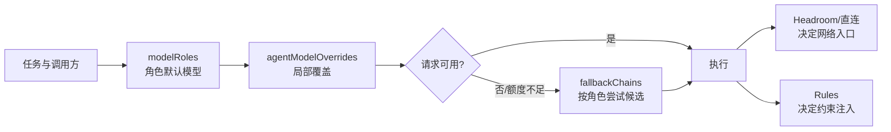

这页回答一个配置问题：当 OMP 同时有角色路由、子 Agent 覆盖、降级策略、代理和规则时，哪一层决定什么？结论是：先选角色默认模型，再应用明确的局部覆盖，只有请求失败或额度策略触发时才走降级链；网络入口和行为规则不是这三个键的职责。

## 核心机制

### 1. 配置分层与因果链



| 层 | 解决的问题 | 明确不解决的问题 |
| --- | --- | --- |
| `modelRoles` | `plan`、`task`、`slow` 等角色的默认 provider/model 与能力档位 | 不证明请求一定经过代理，也不创建凭据 |
| `task.agentModelOverrides` | 某个 Agent 或子任务的例外模型选择 | 不替代角色默认值，也不等于故障恢复 |
| `retry.fallbackChains` | 主模型失败、限流或额度策略触发后的候选顺序 | 不修复错误的 provider 配置，不保证候选可用 |
| 运行控制（retry、usage-aware 等） | 决定何时重试、冷却、预留额度或回到首选 | 不重新定义角色语义 |
| Headroom / `models.db` | provider 到网络入口的实际路由与代理生命周期 | 不选择 OMP role，也不注入 Agent 规则 |
| Rules 发现与注入 | 将约束按 `globs`、条件或 `alwaysApply` 注入上下文 | 不改变模型路由，不把 `paths` 自动翻译成 `globs` |

### 2. 选择与恢复的边界

- 把能力档位和成本意图写在角色默认值中；不要把某个临时上游 URL 写进角色语义。
- 仅对确实需要例外的子 Agent 使用覆盖；覆盖项缺失或键名不被当前版本识别时，行为会退回父角色或默认值，必须以运行时证据确认。
- 降级链是有序候选图，不是健康检查器。链中的模型仍需存在于当前模型目录并能通过认证。
- `fallbackRevertPolicy`、额度感知和重试次数改变恢复时机；它们不会把直连 provider 变成 Headroom provider。
- `globs`、条件和 `alwaysApply` 属于规则注入语义；配置文件里不存在一个可替代规则发现的 `rules` 总开关。

### 3. OMP 17.2.15 的 compaction、snapcompact 与 TTSR 边界

以下是官方 `17.2.15` schema 的键级事实；它们定义压缩与规则运行控制，不决定角色选模、provider 注册或网络入口，也不代表任何用户环境已启用这些键或采用某个取值。

| 命名空间 | 官方键 | 边界 |
| --- | --- | --- |
| `compaction` | `enabled`、`midTurnEnabled`、`strategy`、`thresholdPercent`、`thresholdTokens`、`handoffSaveToDisk`、`remoteEnabled`、`remoteStreamingV2Enabled`、`reserveTokens`、`keepRecentTokens`、`autoContinue`、`remoteEndpoint`、`v2RetainedMessageBudget`、`idleEnabled`、`idleThresholdTokens`、`idleTimeoutSeconds`、`supersedeReads`、`dropUseless` | 控制何时、如何及保留多少上下文；不是 fallback、模型目录或路由配置。 |
| `snapcompact` | `systemPrompt`、`toolResults`、`shape` | 只调节 snapcompact 策略的输入/形状；它不是通用 provider 或 Hook 配置。 |
| `ttsr` | `enabled`、`contextMode`、`interruptMode`、`repeatMode`、`repeatGap`、`builtinRules`、`disabledRules` | 控制 TTSR 规则的启用、注入与重复/中断行为；不证明某条规则已被发现或路径已命中。 |

自动压缩事件的 `reason` 只定义为 `threshold`、`overflow`、`idle`、`incomplete`；对应 `action` 只定义为 `context-full`、`handoff`、`shake`、`snapcompact`。诊断时应记录实际 reason/action，再回看同命名空间的键；不要从“发生了压缩”反推某个策略、阈值或规则配置。

`CompactionEntry` 是带摘要与保留边界的一等会话条目，`BranchSummaryEntry` 用于 `/tree` 导航的废弃分支上下文；这解释压缩产物的会话语义，但不构成持久化、代理或 provider 行为的证据。

### 4. 先配置、后路由、再行为的验证顺序

1. **结构层**：解析配置，确认键类型、角色名、覆盖目标和降级引用均合法。
2. **决策层**：启动新会话，分别触发一个普通 role 与一个有覆盖的子 Agent，记录最终 selector；不要只看配置文本。
3. **恢复层**：用受控的限流/不可用候选验证 fallback 顺序、冷却后回切和额度预留；失败时保留原始错误。
4. **压缩层**：在隔离会话中观察一次自动压缩，记录实际 `reason`/`action`；键存在或摘要出现都不能替代该事件证据。
5. **入口层**：若启用 Headroom，再分别核对 `models.db`/显式 custom provider、请求级 headers 与 active wrapped session；200 或 `/health` 只能证明可达。
6. **规则层**：用 `omp ttsr list`、`omp ttsr scan -v <candidate>` 检查规则是否被发现和按路径挂载。

## 适用条件

- 需要在同一 OMP 安装中平衡规划、执行、设计和快速扫描等不同工作负载。
- 需要给单个子 Agent 临时换模型，但不想复制一整套全局配置。
- 需要把 API 限流、额度耗尽与模型选择问题分开诊断。
- 需要同时运维代理路由和规则文件，并希望每层都有独立证据。

## 不适用与风险

| 症状 | 常见误判 | 边界与处理 |
| --- | --- | --- |
| 子 Agent 仍使用父模型 | 认为覆盖键必然生效 | 当前版本的字段名、作用域和继承关系未在所有版本确认；在新会话中以最终 selector 验证 |
| 主模型成功但降级失败 | 认为 fallback 会发现新模型 | fallback 只遍历声明候选；清理禁用、过期或无凭据的条目 |
| 配置改了但会话不变 | 认为文件热加载 | 按会话加载的行为必须在新会话验证；不要用旧进程的内存状态作证据 |
| 规则加载但从不按路径触发 | 使用了 `paths:` 但没有 `globs:` | OMP 读取 `globs`；共享目录可同时保留两种键，但不能假定自动转换 |
| 只看到 loopback 或 HTTP 200 | 把网络可达当成完整链路 | 再看 inbound/outbound 日志和最终上游；角色选择、代理入口和压缩收益是不同事实 |
| 把全局规则写成 `alwaysApply` | 以为更可靠就每轮注入 | 常驻规则会膨胀上下文；路径规则或流条件更适合大多数约束 |

## 最小验证

```text
配置解析 → role 默认值 → override 命中 → fallback 顺序 → 自动压缩 reason/action
       →（若启用）实际入口/上游 → 规则发现与路径命中
```

最小可观察结果应包含：一个默认 role 的最终 selector、一个覆盖子 Agent 的最终 selector、一次受控 fallback 的候选顺序、一次自动压缩的 reason/action，以及规则扫描显示的命中条目。任何一项只从静态 YAML 推断，都不能证明运行时行为。

## 证据与不确定性

- **来源事实**：`legacy-omp-config-and-rules-guide` 记录 `modelRoles`、`task.agentModelOverrides`、`retry.fallbackChains`、规则归一化以及 `paths`/`globs` 的静默失效；`omp-17-2-15-runtime-contract` 保存最初的官方 tag 快照，`omp-17-2-15-runtime-contract-correction` 以同一 commit 补充并收窄 `compaction`、`snapcompact`、`ttsr` 键集和自动压缩 reason/action 闭集。
- **本页综合**：用“默认 → 局部覆盖 → 故障恢复 → 压缩/规则控制 → 网络入口 → 规则命中”的顺序组织验证，是为了避免把不同层的症状混在一起。
- **版本与未确认项**：compaction、snapcompact、TTSR 的键集与事件枚举仅适用于 OMP `17.2.15`；角色数量、CLI 查询输出、覆盖优先级细节、fallback 的额度阈值和 `models.db` 字段均可能随 OMP/Headroom 版本变化。本页不把旧机器快照或用户配置值当作当前默认值。

## 相关页面

- [Headroom 单端口演进](/note/headroom-single-port-evolution)
- [Headroom 路由持久化](/note/omp-headroom-persistence)
- [OMP Hook 扩展](/note/omp-hook-extension-guide)
- [LLM wiki pattern](/note/llm-wiki-pattern)
