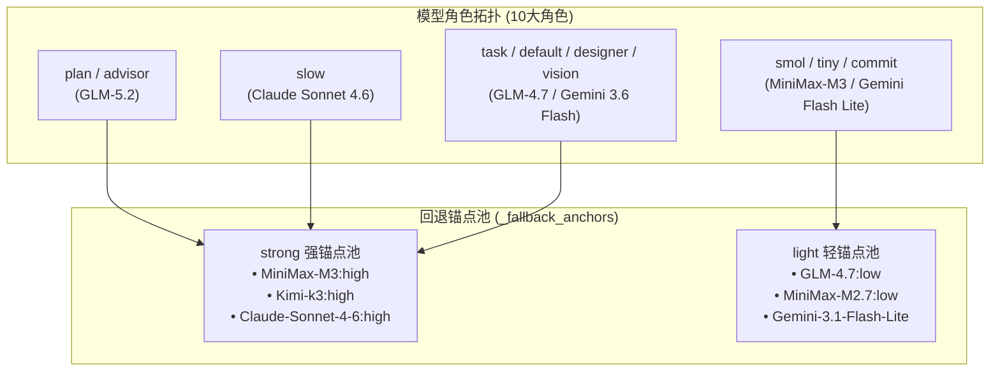

# 全局 OMP 配置解析：分层模型路由、智能降级链与硬护栏实践

在大型工程与日常 AI 辅助开发中，单一的 AI 模型往往难以兼顾**响应速度**、**高阶推理能力**与** API 消费成本**。OMP (`@oh-my-pi/pi-coding-agent`) 提供了高度可定制的全局配置系统，通过 `~/.omp/agent/config.yml` 对 Agent 的行为模式、模型路由、容错回退、长期记忆以及安全护栏进行精细化治理。

本文基于**当前最新生效**的全局 `config.yml` 配置，全面拆解 OMP 配置全景、底层回退锚点逻辑、全角色降级链、细粒度执行开关与运维最佳实践。

---

## 一、当前全局配置全览

以下为 `~/.omp/agent/config.yml` 当前生效的完整配置快照：

```yaml
setupVersion: 1
modelRoles: 
  plan: zhipu-coding-plan/glm-5.2:max
  advisor: zhipu-coding-plan/glm-5.2
  slow: google-antigravity/claude-sonnet-4-6:high
  task: zhipu-coding-plan/glm-4.7:high
  designer: google-antigravity/gemini-3.6-flash-high
  smol: minimax-code-cn/MiniMax-M3:low
  tiny: zhipu-coding-plan/glm-4.7:low
  commit: google-antigravity/gemini-3.1-flash-lite
  vision: google-antigravity/gemini-3.6-flash-high
  default: google-antigravity/gemini-3.6-flash:medium

_fallback_anchors: 
  strong: 
    - minimax-code-cn/MiniMax-M3:high
    - kimi-code/k3:high
    - google-antigravity/claude-sonnet-4-6:high
  light: 
    - zhipu-coding-plan/glm-4.7:low
    - minimax-code-cn/MiniMax-M2.7:low
    - google-antigravity/gemini-3.1-flash-lite

retry: 
  enabled: true
  maxRetries: 5
  baseDelayMs: 2000
  fallbackRevertPolicy: cooldown-expiry
  fallbackChains: 
    slow: 
      - kimi-code/k3:high
      - minimax-code-cn/MiniMax-M3:high
      - google-antigravity/claude-sonnet-4-6:high
    plan: 
      - minimax-code-cn/MiniMax-M3:high
      - kimi-code/k3:high
      - google-antigravity/claude-sonnet-4-6:high
    advisor: 
      - minimax-code-cn/MiniMax-M3:high
      - kimi-code/k3:high
      - google-antigravity/claude-sonnet-4-6:high
    default: 
      - kimi-code/kimi-for-coding:high
      - zhipu-coding-plan/glm-4.7:high
      - google-antigravity/gemini-3.6-flash-high
    task: 
      - zhipu-coding-plan/glm-4.7:high
      - kimi-code/kimi-for-coding:high
      - google-antigravity/gemini-3.6-flash-high
    designer: 
      - google-antigravity/gemini-3.6-flash-high
      - kimi-code/k3:high
      - minimax-code-cn/MiniMax-M3:high
    vision: 
      - kimi-code/k3:high
      - minimax-code-cn/MiniMax-M3:high
      - google-antigravity/gemini-3.6-flash-high
    smol: 
      - zhipu-coding-plan/glm-4.7:low
      - google-antigravity/gemini-3.1-flash-lite
    tiny: 
      - kimi-code/kimi-for-coding:low
      - google-antigravity/gemini-3.1-flash-lite
    commit: 
      - zhipu-coding-plan/glm-4.7:low
      - kimi-code/kimi-for-coding:low
  usageAwareFallback: true
  usageReservePolicy: auto
  usageReservePct: 10

advisor: 
  enabled: true
  subagents: true
symbolPreset: ascii
theme: 
  dark: dark-volcanic
  light: light
disabledExtensions: []
memory: 
  backend: hindsight
hindsight: 
  apiUrl: http://localhost:42888
autolearn: 
  enabled: true
  autoContinue: true
defaultThinkingLevel: auto
dev: 
  autoqaConsent: granted
prewalk: 
  enabled: true
display: 
  showTokenUsage: true
compaction: 
  idleEnabled: true
  idleThresholdTokens: 200000
task: 
  prewalk: true
  eager: preferred
goal: 
  continuationModes: 
    - interactive
branchSummary: 
  enabled: true
snapcompact: 
  systemPrompt: none
  toolResults: true
ttsr: 
  interruptMode: prose-only
checkpoint: 
  enabled: false
computer: 
  enabled: false
statusLine: 
  showHookStatus: false
```

---

## 二、模型角色拓扑与回退锚点机制

OMP 通过 `modelRoles` 将不同的 Agent 工作荷载精确分派给专长模型，并通过 `_fallback_anchors` 建立了强能力与轻量能力的全局降级水坝。



### 1. 10 大模型角色分工
- **高阶规划与架构 (`plan` / `advisor`)**：采用 `zhipu-coding-plan/glm-5.2`，负责全局架构设计与建议，具备极强的逻辑图谱建构能力。
- **深度推理 (`slow`)**：采用 `google-antigravity/claude-sonnet-4-6:high`，专门攻坚疑难 Bug 诊断与关键架构重构。
- **标准 Worker 矩阵 (`task` / `default` / `designer` / `vision`)**：由 `GLM-4.7:high` 与 `Gemini 3.6 Flash` 担当，提供高吞吐的代码编写、UI 设计与多模态解析能力。
- **极速低耗队列 (`smol` / `tiny` / `commit`)**：由 `MiniMax-M3:low` 与 `Gemini 3.1 Flash Lite` 承载，实现毫秒级的 Git Commit 生成与快速文件扫查。

### 2. 回退锚点解耦机制 (`_fallback_anchors`)
配置文件中引入了 `_fallback_anchors` 预设，将底层的可用模型池抽象为 `strong` 与 `light` 两个质量梯队：
- **`strong` 强锚点池**：包含 `MiniMax-M3:high`、`Kimi-k3:high` 和 `Claude-Sonnet-4-6:high`。专为推理密集型角色（如 slow, plan, advisor）提供强力托底。
- **`light` 轻锚点池**：包含 `GLM-4.7:low`、`MiniMax-M2.7:low` 和 `Gemini-3.1-Flash-Lite`。专门为轻量级任务提供低成本备选。

---

## 三、全角色降级链 (`fallbackChains`) 与额度感知

在线 API 经常面临速率限制（RPM/TPM）或临时故障。配置中为 **全部 9 个核心角色** 均定义了精细的 Fallback 路线：

1. **重型推理与规划组 (`slow`, `plan`, `advisor`)**：
   - 降级路线：`Kimi-k3:high` → `MiniMax-M3:high` → `Claude-Sonnet-4-6:high`。
   - 确保主渠道故障时，仍能维持最高水平的分析推理能力。
2. **标准 Worker 与 UI 视觉组 (`default`, `task`, `designer`, `vision`)**：
   - 降级路线：优先降级至 `Kimi-for-coding` / `GLM-4.7:high` / `Gemini 3.6 Flash High`。
   - 保障代码编写和设计流程不被打断。
3. **轻量快扫组 (`smol`, `tiny`, `commit`)**：
   - 降级路线：从轻量模型退守至 `GLM-4.7:low` / `Gemini 3.1 Flash Lite` / `Kimi-for-coding:low`。
   - 极大地降低备份阶段的额度消耗。

### 自动冷却与额度预留策略：
- **`fallbackRevertPolicy: cooldown-expiry`**：当主模型故障冷却期结束后，系统自动切回首选模型。
- **`usageAwareFallback: true` & `usageReservePct: 10`**：自动拦截即将超限的 API 请求并提前触发链条切换，保留 10% 的缓冲额度用于紧急交互。

---

## 四、细粒度运行控制与执行开关

除了模型路由外，全局配置还包含多个驱动 Agent 行为的具体控制选项：

### 1. 思考与感知开关
- **`defaultThinkingLevel: auto`**：根据任务难度动态开启/缩放 Chain-of-Thought (CoT) 思维链深度，平衡推理质量与 Token 消耗。
- **`task.prewalk: true` & `prewalk.enabled: true`**：在 Worker 正式修改代码前，强制预探索依赖图谱与关联文件，大幅降低盲改率。
- **`task.eager: preferred`**：积极调度模式，遇到独立子任务时优先并行调度子 Agent 执行。

### 2. 交互与中断模式
- **`goal.continuationModes: [interactive]`**：在目标导向模式下采用交互式延续，防止 Agent 脱机挂起。
- **`ttsr.interruptMode: prose-only`**：Turn-To-Speak 模式下，仅允许自然语言中断，阻止非预期的代码片段中断推理。
- **`branchSummary.enabled: true`**：自动对 Git 分支上的改动生成结构化变更摘要。
- **`snapcompact.toolResults: true`**：在触发 200k Token 空闲压缩时，自动对历史工具返回结果进行 Snapshot 抹除。

### 3. 调试与实验室选项
- **`dev.autoqaConsent: granted`**：授权开发环境下的自动 QA 测试感知与反馈。
- **`checkpoint.enabled: false` & `computer.enabled: false`**：显式关闭尚处于实验阶段的全局 Checkpoint 快照与 Computer Use 桌面操控功能，提升系统稳定性。

---

## 五、长期记忆与安全硬护栏

1. **Hindsight 长期记忆体系 (`backend: hindsight`)**：
   - 挂载本地 Hindsight 守护进程（`http://localhost:42888`），跨会话持久化存储项目决策、踩坑记录与用户偏好。
2. **Autolearn 自动技能沉淀 (`autolearn.enabled: true`)**：
   - 自动提取可复用 Lesson / Skill，沉淀到 `~/.omp/agent/managed-skills/`。
3. **Pre-tool-call 硬护栏 (GitHub Write Gate)**：
   - 配合 `~/.omp/agent/hooks/pre/github-write-gate.ts`，在命令执行前物理拦截 `git push`、`gh pr` 等写操作，必须经由用户显式确认或 `OMPGATE_OFF=1` 放行。

---

## 六、总结

当前生效的全局 OMP 配置展现了一套极具代表性的现代化 Agent 治理体系：
- 通过 **10 大模型角色** 与 **`_fallback_anchors` 回退锚点池** 实现了能力与成本的精细化平衡；
- 覆盖 **全 9 角色的降级链** 与 **10% 额度预留** 构建了高可用容灾防御；
- 配合 **Hindsight 长期记忆** 与 **Pre-tool-call 硬护栏**，保障了 Agent 的聪明与安全。
