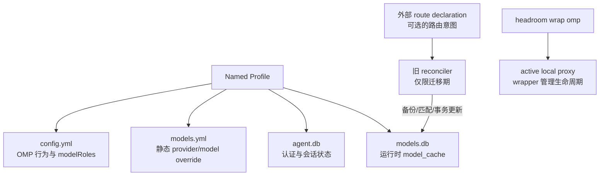

这页回答“OMP 更新后，路由意图、用户状态和运行时模型缓存如何不互相污染，以及旧配置损坏时怎样安全恢复”。结论是：Named Profile 隔离配置与认证，外部声明（若确有需要）保存路由意图，`models.db` 的 `model_cache` 视为可重建派生状态；reconciler 是旧迁移证据，不是日常 `headroom wrap omp` 启动步骤。

## 核心机制

### 1. 意图、用户状态、派生状态分层



| 制品 | 角色 | 可安全推断的事实 | 不应推断 |
| --- | --- | --- | --- |
| Named Profile | 隔离一组 OMP 配置、认证、历史与 cache | 更新一个 profile 不必污染另一个 profile | profile 会自动修复路由或隐藏凭据 |
| `config.yml` | 用户行为、`modelRoles`、retry、tools 等意图 | 决定角色与运行控制 | provider 当前一定采用某个 base URL |
| `models.yml` | 静态 provider/model 覆盖层 | 可表达配置覆盖意图 | 已存在 authoritative cache 行必然被接管 |
| `models.db` / `model_cache` | discovery/merge 后的运行时派生状态 | 可被重建、需从真实运行时验证 | 适合作为手工编辑的长期契约 |
| 外部 route declaration | OMP 目录之外的路由意图（可选） | 可在更新后作为恢复输入 | 可保存凭据或代替 provider catalog |
| reconciler | 旧迁移中的受控恢复工具 | 可备份、按 provider/api 匹配并事务更新 | 应在每次正常启动前运行 |

### 2. 旧 reconciler 的安全恢复链

只有在隔离的迁移环境中才保留这条历史流程：

1. 校验目标 profile 与外部声明，不读取或复制 token、API key。
2. 备份当前 `models.db`，再按稳定的 provider 标识与 API 匹配已有 cache 行。
3. 缺少匹配行时 fail-loud；不猜测插入新的 provider/model，也不重建整个 catalog。
4. 只更新声明的 `baseUrl`、动态 headers 等路由字段，保留 metadata、fingerprint、version，并维持 `authoritative=1` 语义。
5. 在同一事务中提交；失败回滚，输出 `changed`、匹配状态和 cache version。
6. 用新会话验证最终入口和上游，不把旧进程持有的内存配置当作恢复成功。

### 3. 当前推荐生命周期

日常启动用官方 `headroom wrap omp` 管理 active proxy；在会话期间可用 `headroom doctor`、`headroom perf`、`headroom dashboard` 观察。会话结束后显式执行 `headroom unwrap omp`；只有明确要保留代理时才使用 `--no-stop-proxy`。旧 systemd unit、手工 proxy 和 reconciler 不属于推荐启动链。

## 适用条件

- OMP 更新会重建 `model_cache`，而团队仍需保存可审计的路由意图。
- 多个 OMP profile 需要隔离认证、会话历史和运行时模型目录。
- 迁移期必须从备份恢复显式 custom provider，同时避免手工重建 OMP catalog。
- 需要分清配置是否正确、cache 是否重建、代理是否实际工作这三个问题。

## 不适用与风险

| 风险 | 误判或症状 | 边界与处理 |
| --- | --- | --- |
| 把 `models.yml` 当强覆盖 | 写入 base URL 但 authoritative cache 仍走旧入口 | 当前版本先核对实际 `model_cache` 和最终上游；不要保证 override 接管 |
| 手工编辑 `models.db` | 当前 OMP 进程继续使用旧内存，重启后改动消失 | 只在隔离迁移证据中操作，并保留备份与事务结果 |
| 把 reconciler 放进正常启动 | 每次启动都写 cache，掩盖版本或 catalog 变化 | 日常只用 wrapper；reconciler 限定为旧迁移恢复 |
| 把 `agent.db` 当配置 | 认证/会话状态被复制进 Git、日志或外部声明 | profile 私有保存，路由声明不含凭据，迁移前做权限审计 |
| 缺少匹配 row 仍强行 INSERT | 生成 OMP 未发现的假 provider，后续更新不可预测 | fail-loud 停止，先确认当前 catalog 与版本 |
| 只看到 loopback 或 200 | 误以为路由和恢复都成功 | 结合 proxy inbound/outbound、最终 URL/WebSocket 与新会话验证 |
| 正常退出不清理 route state | 下一会话继承意外 loopback 或旧 headers | 结束时显式 `headroom unwrap omp`，除非有意保留代理 |
| 双重压缩或旧覆盖残留 | savings/输出异常，原因无法归属 | 分层关闭 context-mode、旧 override 和代理后重新测量 |

## 最小验证

当前生命周期的最小观察步骤：

```text
新会话：headroom wrap omp
  → doctor/perf（代理可用性）
  → L1 检查 profile、models.yml、model_cache
  → L2 发显式路由的最小请求
  → L3 看代理日志与最终上游
  → headroom unwrap omp
```

若必须验证旧 reconciler，只用临时复制的数据库和非生产凭据：先制造 `baseUrl`/headers/authoritative 的可控偏差，确认备份创建、匹配行恢复、`cache_version` 保留、事务失败可回滚和第二次运行 `changed=false`。这组结果证明恢复算法的幂等性，不证明当前 wrapper 会自动执行它。

## 证据与不确定性

- **来源事实**：`legacy-omp-headroom-persistence` 记录 Named Profile、`config.yml`/`models.yml`/`agent.db`/`models.db` 分层、外部声明、旧 reconciler 的备份/匹配/事务语义和恢复输出；`legacy-headroom-single-port-evolution` 记录单端口与协议验证；`legacy-omp-config-and-rules-guide` 区分角色选择、入口路由和 wrapper 生命周期。
- **本页综合**：把 route intent 与 `model_cache` 解耦，再将恢复分为当前 wrapper 验证和迁移期 reconciler 验证，避免把历史脚本误当产品启动契约。
- **未确认项**：Named Profile 的具体 CLI、数据库 schema、authoritative 覆盖规则、wrapper 写入/清理 `models.yml` 的时机、进程退出后的内存状态和各 provider 的协议行为都依赖 OMP/Headroom 版本；本文不声称跨版本兼容。

## 相关页面

- [Headroom 单端口路由综合](/note/headroom-single-port-evolution)
- [OMP 配置分层](/note/omp-config-and-rules-guide)
- [OMP Hook 扩展](/note/omp-hook-extension-guide)
- [LLM wiki pattern](/note/llm-wiki-pattern)
