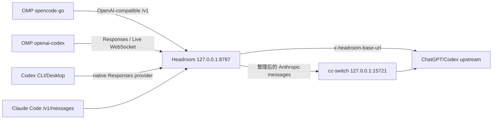

`omp-headroom-provider-proxy` 是一个外部路由控制器与 Headroom 部署项目：它保留 OMP、Codex 和客户端认证的 owner 边界，不修改 OMP/Headroom 源码，不复制 credential 或 `models.db`，通过显式配置、systemd user service、状态校验和可回滚操作把多个客户端接到同一个 loopback Headroom 入口。本文是当前 Headroom 0.34/OMP/Codex 环境的 `provisional` entity 页面；实现来源和运行时证据见 `sources`。

## 它解决什么问题

项目把三个容易混淆的问题分开：

1. **入口**：Headroom 由 `systemd --user` 管理，只监听 `127.0.0.1:8787`。
2. **路由**：OMP provider route 和 Codex 原生 Responses provider 通过精确 prefix、API、header 与 upstream 约束进入 Headroom。
3. **生命周期**：`bin/omp-routes` 与 `bin/codex-routes` 显式负责 apply/check/restore；服务启停不隐式改写用户路由。

Headroom 是 compression owner；同一请求不能再叠加第二个 application-level compression bridge。Claude Code 共存时，cc-switch 只做 Anthropic↔OpenAI 协议转换与凭据注入，不负责压缩。

## 路由拓扑



| 调用方 | 入口与责任 | 不能从该路径推断的事实 |
| --- | --- | --- |
| `opencode-go` | OpenAI-compatible provider route 进入 Headroom prefix | 其它 provider 自动被接管 |
| `openai-codex` | Responses/Live WebSocket 进入 Headroom，header 选择 ChatGPT upstream | model discovery、登录或 realtime voice 经过 proxy |
| Codex CLI/Desktop | 共享用户级 `$CODEX_HOME/config.toml` 的 native provider | `HTTP_PROXY`/CONNECT 是必要方案 |
| Claude Code | `HEADROOM_CC_SWITCH_RECONCILE=1` 时先经 Headroom，再由 cc-switch 转换 | cc-switch 负责压缩或两条协议路径共享状态 |

## Codex 原生 provider

Codex CLI 与 Desktop 使用同一用户配置，因此项目不另起代理，也不伪装系统级 HTTP proxy。`config/codex-headroom.toml` 声明的 provider 关键语义是：

- `model_provider = "headroom"`；
- `wire_api = "responses"`；
- `base_url` 使用现有 loopback Headroom prefix；
- `requires_openai_auth = true` 与 `supports_websockets = true` 保留 Codex 的 OAuth/Live WebSocket 语义；
- `x-headroom-base-url = https://chatgpt.com/backend-api` 作为请求级 upstream hint；
- auth 文件、token、OMP-owned database 留在各自 owner 的用户目录，不进入项目。

`bin/codex-routes` 是唯一真实 user config 写入口。它维护 root-safe TOML managed marker，并在 apply 前后检查目标身份、mode、内容 hash、backup hash 和 state journal。`flock`、atomic write/exchange、prepared restore、mode drift 和目标漂移检查共同保证：用户手改配置、外部 writer 或异常退出时，控制器宁可停止也不猜测覆盖。

## OMP 路由与项目持久化

`bin/omp-routes` 只对允许的 `opencode-go` 和 `openai-codex` provider 进行显式 apply/check/restore；provider API、exact loopback prefix、upstream header 和路径都是静态契约。项目 state、Headroom workspace/log/savings 等持久化目录落在项目 `var/`，但 OMP credential、`models.db` 和用户 route ownership 不复制到项目。

因此应分别验证：

- OMP 配置是否正确；
- Headroom service 是否 healthy/ready；
- 请求是否真的到达 loopback proxy；
- proxy 最终是否连接预期 HTTP/WebSocket upstream。

只看客户端成功、`/health` 或 HTTP 200 不足以证明 compression route 生效；必须结合 proxy inbound/outbound 日志和响应完成事件。

## 真实验证

当前交付证据包括：

```text
./bin/validate                  PASS
./bin/headroom-ponytail-check  PASS
./bin/omp-routes check          PASS
./bin/codex-routes check        PASS
systemctl --user ...            active
```

Codex CLI fresh process 返回 `CODEX_HEADROOM_CLI_SMOKE_OK`；Desktop fresh local-thread 返回 `CODEX_HEADROOM_DESKTOP_SMOKE_OK_2`。两者的 proxy 日志均能看到 loopback Responses 请求、ChatGPT OAuth Codex WebSocket 与 `response.completed`。这证明当前环境的真实 inference path，不扩展为 discovery、云端线程或 voice 的通用兼容声明。

## 回滚

1. 停止所有 Codex CLI/Desktop writer。
2. 执行 `./bin/codex-routes restore --force`。
3. 用 `./bin/codex-routes check` 确认 backup/state hash 与目标 mode。
4. 需要重新启用时，再显式 `apply`，不要直接编辑用户配置绕过 controller。

OMP 路由使用对应的 `bin/omp-routes restore`；Claude Code/cc-switch 共存回滚还需要移除 reconciler 与 `BindPaths=%h/.claude`，并恢复原始 `ANTHROPIC_BASE_URL`。所有回滚都应先停止实际 writer，并保留 backup。

## 版本与证据边界

- **来源事实**：固定项目提交、项目文档、controller contract、隔离 lifecycle smoke 和 fresh CLI/Desktop proxy evidence。
- **本页综合**：把“单一压缩 owner、原生 Codex provider、显式路由事务、真实 proxy evidence”组合成可复用的项目模型。
- **不确定性**：provider schema、Desktop 配置读取、日志字段、WebSocket 行为和 Headroom/OMP 版本边界可能变化；当前工作树的路由控制器尚未形成新的公开 commit，发布前需要重新绑定 commit 并复跑验证。

## 相关页面

- [Headroom 单端口路由综合](/note/headroom-single-port-evolution)
- [Headroom 路由持久化综合](/note/omp-headroom-persistence)
- [Headroom 与 cc-switch / Claude Code 共存](/note/headroom-cc-switch-coexistence)
- [Headroom 0.34 压缩与检索契约](/note/headroom-compress-retrieve-contract)
