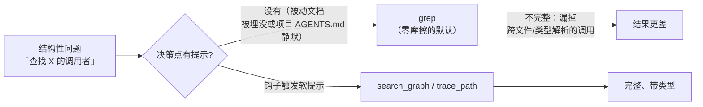
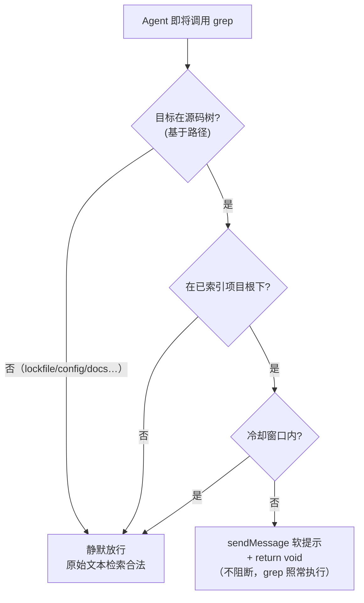

# OMP Hook 扩展实战：从决策点软提示到状态栏集成

OMP（Oh My Pi）的 Extension Hook 体系提供了一套强大的扩展机制：开发者可以在会话生命周期的关键节点（`session_start`、`tool_call` 等）注入自定义逻辑，通过 `pi.sendMessage()` 影响 LLM 上下文，或通过 `ctx.ui.setStatus()` 发布状态文本。本文以两个真实案例为主线，系统展示 Hook 扩展的诊断、设计与验证方法。

- **案例一**：一个新鲜、完整、严格优于 grep 的代码知识图谱，在 30 个会话里只被用了 4 次，而 grep 被调用了 158 次。问题不在索引，而在"决策点没有提示"——用一个不阻断的 `PreToolUse` 钩子在 grep 决策瞬间注入软提示。
- **案例二**：让 GitHub 写门禁的状态显示在 OMP 的 statusline 上。真实答案散落在四个层面：一个被看漏的渲染通道、一条写死的 segment 白名单、一次"伪需求"的识别，以及一个提交给上游的五文件 patch。

---

## 一、案例一：知识图谱优先于 grep——决策点软提示钩子

### 1.1 谜题：能力齐备，却无人问津

`codebase-memory-mcp` 把一个项目索引成混合 LSP 知识图谱。对于结构性问题——*查找定义、谁调用了 X、X 调用了什么、死代码、模块边界*——它严格地比 `grep` 更快、更完整。被审计的项目是完全索引的，然而跨 30 个会话，Agent 的行为就像图谱不存在一样：

| 检查项 | 结果 |
| --- | --- |
| 是否已索引？ | 是——**34,361 个节点 / 120,215 条边 / 82 MB** |
| 是否新鲜？ | 是——图谱的 `head_sha` **精确等于** 实时 `git HEAD`，状态为 `ready` |
| 是否可达？ | 是——以 `xd://mcp__codebase_memory_mcp_*` 设备族形式暴露 |

所以问题从来不是"Agent 能用吗"，而是"**它为什么不用**"。



### 1.2 数据审计：grep 与知识图谱的真实用量

对会话转录文件做插桩，得到了一个没有歧义的答案：

| 指标 | 计数 |
| --- | --- |
| `grep` 调用次数 | **158** |
| `codebase-memory` 调用次数 | **22** |
| 其中**结构性**的 grep（查找定义/调用者/被调用者/用法） | **约 80%（116–128 次）** |
| 其中合理属于**原始文本**的 grep（lockfile、i18n、配置、文档、迁移） | 约 10–15% |
| 用过图谱的会话数 | **4 / 30** |
| 那 22 次图谱调用中，有多少集中在**单次**架构探索会话里 | **18 次** |

**集中度才是关键信号。** 图谱只在一次刻意的架构梳理中被触达，随后在 26 个会话里被彻底遗忘——包括每次跑 16–28 次 `grep` 的大重构，且几乎全是结构性的。

### 1.3 根因：被动文档对抗不了预训练先验

把根因按影响力排序：

1. **决策点没有强制（主因）。** 反 grep 的要求只以*被动散文*形式存在——写在全局 `AGENTS.md` 里，外加一个*按需加载*的托管技能，其 frontmatter 既没有 `globs` 也没有 `alwaysApply`。更糟的是，项目级的 `AGENTS.md` 对 codebase-memory **只字未提**。
2. **工具表面摩擦（次因）。** `grep` 是一次一等调用、单参数 `pattern`。而一次图谱查询是*手工拼一个 JSON 对象 → 写到一个 `xd://` 设备*。更高的激活成本，稳定地输给了阻力最小的路径。
3. **陈旧/未索引——已排除**（见上表）。

### 1.4 为什么"写一条更好的规则"不奏效

- **规则按"每轮"或"按文件路径"注入，而非按工具调用。** 一条 `alwaysApply` 规则*每轮*重新注入提醒——正是数据表明会被调优掉的"被动文档重复版"。
- **缺陷发生在工具决策的瞬间**，而只有 `PreToolUse` 钩子坐在那个位置上。30 个会话里有 26 个对明确的"禁止"措辞视而不见，这就是"再加一段散文不是有效干预"的证据。

正确的干预单位是：*"当 Agent 即将对源码树调用 `grep` 时，浮出更好的选项——但不阻断。"*

### 1.5 解法：一个软性 PreToolUse 钩子

#### 表面决策：软，而非硬

omp 的 `tool_call` 事件支持**两条**通道：

| 通道 | 机制 | 效果 |
| --- | --- | --- |
| **硬**（返回类型） | `return { block, reason }` | 阻断调用；Agent 必须绕过它重试。风险：对合法 `grep` 的误判阻断。 |
| **软**（副作用） | `pi.sendMessage({ customType, content, display, attribution })` **+ `return void`** | 注入一条**参与 LLM 上下文**的消息；调用照常进行。零误判风险。 |

软通道是非显然的那条。`ToolCallEventResult` 返回类型是面向阻断的，但 `pi.sendMessage()` 挂在基础的 `HookAPI` 上，可从*任何*事件调用。返回 `void` 意味着"不阻断——继续"。

我们选择**软**：它尊重"提醒而非阻断"，永远不会打断一次合法的原始文本 `grep`，最坏情况是一次静默空操作。

#### 检测：基于路径，而非模式

第一版谓词要求一个代码文件扩展名或非空 pattern。单元测试立刻抓到了问题：它只标出了 **59** 次结构性 grep，却*漏掉了 73 次恰恰是反模式*的检索。正确的检测是**基于路径**的：一次范围限定在源码树的 `grep`，*本身*就是结构性信号。

| 谓词版本 | 标出的结构性 grep | 判定 |
| --- | --- | --- |
| 要求扩展名或 pattern | 59 / 158 | **坏的**——漏掉目录限定的检索 |
| **路径指向源码树 且 非原始文本** | **116 / 158** | 吻合人工基线（约 127） |

#### 白名单

| `grep` 目标 | 行为 |
| --- | --- |
| `backend-spring/src`、`console/src`、`management/src`、`shared/*/src` | **提示**（结构性） |
| `**/pnpm-lock.yaml`、`**/*.json/yaml/toml`、`**/*.md`、`migrations/`、`locales/`、`i18n/`、`wiki/`、`dist/build/target/`、`node_modules/`、`.omp/`、`*.log`、`*.css/scss`、`pom.xml`、`docker-compose*`、`tsconfig*`、`vite.config*` | **静默**（原始文本是合理的） |



### 1.6 实现：钩子代码与 API 契约

钩子部署在 `hooks/pre/graph-first-nudge.ts`（omp 在**会话启动时**自动加载 `hooks/pre/*.ts`——不是热重载，新加的钩子对运行中的会话不可见，必须在新会话里验证）。

```ts
import type { HookAPI } from "@oh-my-pi/pi-coding-agent/extensibility/hooks";

const REMINDER =
  "codebase-memory nudge: this project is indexed in the code knowledge graph. " +
  "For STRUCTURAL lookups — find definition, callers, callees, references, type, " +
  "module/package boundary — use the graph FIRST, then grep only as a raw-text fallback:\n" +
  "  - xd://mcp__codebase_memory_mcp_search_graph    (query or name_pattern -> qualified_name)\n" +
  "  - xd://mcp__codebase_memory_mcp_trace_path       (function_name + direction inbound/outbound)\n" +
  "  - xd://mcp__codebase_memory_mcp_get_architecture (clusters / layers / packages)\n" +
  "Raw-text grep on lockfiles, config, docs, i18n, migrations, logs, or generated output is fine.";

const SOURCE_TREE_RE = /(backend-spring[\\/]src|console[\\/]src|management[\\/]src|shared[\\/].*?[\\/]src)/;
const RAW_TEXT_RE =
  /(lock|\.json|\.yaml|\.yml|\.toml|\.env|\.mdx?|migrations|locales|i18n|wiki|[\\/]dist[\\/]|[\\/]build[\\/]|[\\/]target[\\/]|node_modules|\.omp|sessions|\.log|\.css|\.scss|pom\.xml|docker-compose|tsconfig|vite\.config|\.sh$)/;

let indexedRoots: string[] = [];
let lastNudgeAt = 0;
const COOLDOWN_MS = 10 * 60 * 1000;

function norm(p: string) {
  return p.replace(/\\/g, "/").replace(/^~/, process.env.HOME ?? "~");
}
function isUnderIndexedRoot(cwd: string) {
  const c = norm(cwd);
  return indexedRoots.some(r => { const root = norm(r); return c === root || c.startsWith(root + "/"); });
}
function isStructuralGrep(input: Record<string, unknown>) {
  const path = norm(String(input.path ?? "")), pattern = String(input.pattern ?? "");
  if (!SOURCE_TREE_RE.test(path)) return false;
  if (RAW_TEXT_RE.test(path) || RAW_TEXT_RE.test(pattern)) return false;
  return true;
}

export default function graphFirstNudge(pi: HookAPI) {
  pi.on("session_start", async () => {
    try {
      const res = await pi.exec("codebase-memory-mcp", ["cli", "list_projects"]);
      const roots = [...String(res.stdout ?? "").matchAll(/"root_path"\s*:\s*"([^"]+)"/g)].map(m => m[1]);
      if (roots.length) indexedRoots = roots;
    } catch { /* 保留空列表；钩子退化为不触发 */ }
  });

  pi.on("tool_call", async (event, ctx) => {
    try {
      if (event.toolName !== "grep") return;
      if (!isStructuralGrep(event.input)) return;
      if (!isUnderIndexedRoot(ctx.cwd)) return;
      if (Date.now() - lastNudgeAt < COOLDOWN_MS) return;
      lastNudgeAt = Date.now();
      pi.sendMessage({
        customType: "graph-first-nudge",
        content: REMINDER, display: true, attribution: "agent",
      });
    } catch { /* 绝不让提示把 grep 搞挂 */ }
  });
}
```

#### Hook API 契约对照

| 符号 | 形状 | 来源 |
| --- | --- | --- |
| `ToolCallEvent` | `{ type:"tool_call", toolName, toolCallId, input: Record<string,unknown> }` | `hooks/types.d.ts` |
| `HookContext.cwd` | `string`——项目根 | `hooks/types.d.ts` |
| `ToolCallEventResult` | `{ block?, reason? }`——**硬**路径 | `shared-events.d.ts` |
| `HookAPI.sendMessage` | 注入一条**参与 LLM 上下文**的 `CustomMessageEntry`；`triggerTurn` 默认 `false` | `hooks/types.d.ts` |
| 钩子位置 | `hooks/{pre,post}/*.ts`（全局）/ `.omp/hooks/{pre,post}/*.ts`（项目）；会话启动时加载 | `hooks/loader.d.ts` |

### 1.7 验证：从探针到运行时

修复必须分三层证明，缺一不可：

```bash
# 1. 前提证明：图谱确实能瞬间给出 grep 在苦找的信息
codebase-memory-mcp cli search_graph '{"project":"PROJECT","query":"SomeMapper"}'

# 2. 逻辑证明：用 mock-pi 自探针，对合成事件逐条断言
bun /tmp/graph-first-nudge.probe.mjs   # 期望：6/6 PASS

# 3. 运行时证明：在全新会话里对源码树 grep，确认软提示渲染且 grep 照常返回
```

1. **mock-pi 自探针**——导入工厂函数，向一个 mock `pi` 注册处理器，触发六个合成的 `tool_call` 事件。结果：**6 / 6 通过**。
2. **前提证明**——对某个 Mapper 符号调用 `search_graph`，瞬间返回 **106** 条带文件与行号范围的合格结果。
3. **实时运行测试**——在一个全新的会话里，对 `backend-spring/src` 跑 `grep class.*Service`，钩子被触发：`graph-first-nudge` 块渲染出来，**并且**完整的 grep 结果在下方照常返回——非阻断得到端到端确认。

---

## 二、案例二：把 Hook 状态送进 OMP 顶栏

OMP 的 extension hook 可以通过 `ctx.ui.setStatus(key, text)` 发布状态文本。我的 `github-write-gate` hook（拦截 `git push`、`gh pr create` 等 GitHub 写操作的硬门禁）早就在 `session_start` 时发布了 `GH-gate armed · blocks git push / gh pr / API writes`。需求是：**让它显示在 statusline 上**。

### 2.1 误诊：状态其实一直在显示

最初的假设是"setStatus 没生效"。但源码追踪（`runner.ts` → `extension-ui-controller.ts` → `component.ts` 的 `#hookStatuses` map）表明数据通路完整。真正的渲染位置是：**编辑器上方的一条独立行**，由 `statusLine.showHookStatus`（默认 `true`）门控——而不是用户以为的顶部 border。

#### 方法论：tmux 伪终端代替"请用户截图"

TUI 程序的渲染验证传统上依赖人工截图。这次全程用了一个可脚本化的替代方案：

```bash
tmux new-session -d -s probe -x 220 -y 50 'omp' && sleep 25 \
  && tmux capture-pane -t probe -p | grep -n 'GH-gate'
tmux kill-session -t probe
```

- `-d` detached、固定 220×50 几何尺寸，渲染结果可复现；
- `capture-pane -p` 拿到的是纯文本帧，`grep -n` 直接给出行号——既能确认**存在性**，也能定位**渲染在第几行**；
- 带环境变量前缀（`OMPGATE_OFF=1`）即可覆盖 bypass 分支。

### 2.2 死胡同：top border 的 segment 白名单是写死的

Settings 面板里 `statusLine.leftSegments/rightSegments` 看起来是可配置的，但 schema 层的 `StatusLineSegmentId` 是一个 **24 项的封闭 union**，没有 `hook`。

**结论：纯 config 路径在 top border 上不存在。** 识别死胡同的价值在于止损。

### 2.3 被否决的歪招：session_name 搭车

侦察中发现 extension API 暴露了 `setSessionName()`，而 default preset 的 `rightSegments` 恰好包含 `session_name`。探针 hook 实证：写入的 session 名确实渲染在 border 最右端。

但这个方案被三个理由否决：

1. **污染 resume picker**——每个会话的名字都变成门禁状态或带前缀的变体；
2. **与自动命名竞争**——`session_start` 时写入会抢占"user" provenance；
3. **冗余**——独立行已经在显示同样的信息。

教训：**实证"能做到"之后，还要问"值不值得"**。

### 2.4 正解：给上游写一个 `hook` segment

既然 union 是封闭的，正解就是打开它。patch 共 10 个文件（5 源文件 + 5 个测试 fixture）：

| 文件 | 改动 |
|---|---|
| `settings-schema.ts` | union 增加 `"hook"` |
| `types.ts` | `SegmentContext` 增加 `hookStatuses: ReadonlyMap<string, string>`；`StatusLineSegmentOptions` 增加 `hook.maxLength` |
| `component.ts` | `#buildSegmentContext` 无条件注入现有 `#hookStatuses` map |
| `segments.ts` | 新增 `hookSegment`：按 key 排序、dot 连接、muted 着色、默认 32 列截断；空 map 时 `visible: false` |
| `presets.ts` | default preset 的 `rightSegments` 末尾加 `"hook"` |

任何写 `setStatus` 的 hook（门禁、RTK、未来的）自动获得 border 显示，hook 侧零改动。

#### 边界发现 1：border 溢出预算会第一个吃掉你

切到日常目录（border 含长分支名 + PR 号）后，新 segment **消失了**。原因：border 构建器在空间不足时从最右侧开始省略 segment。

解法：**让 segment 足够紧凑**——`segmentOptions.hook.maxLength`（默认 32）。53 字符的门禁文本截断为 `GH-gate armed · blocks git push…` 后，在 220 列满负载 border 下稳定渲染。完整文本仍由独立行保留——**短文本进 border，长文本看独立行**，各司其职。

#### 边界发现 2：两个通道的门控应该解耦

初版设计里 border segment 与独立行同受 `showHookStatus` 门控。用户提出"不需要独立行"暴露了耦合的错误。解耦后：

- `showHookStatus: true`（默认）：双通道并存；
- `showHookStatus: false`：**border 独占**——目标形态。

#### 验证栈

`biome check` ✅ → `tsgo --noEmit` ✅ → 55/55 单测（含新增 7 个 hookSegment 用例）✅ → tmux 四象限运行时验证 ✅ → `git fetch` 确认 0-behind ✅ → 干净 worktree 上 `git am` 实证可应用 ✅。

### 2.5 安装与回滚的隐蔽陷阱

本地安装采用 PATH 替换策略。回滚看似一条命令，但有个陷阱：border 独占模式把 `showHookStatus` 设为了 `false`，stock omp 没有 border segment——只回滚二进制会导致状态**全灭**。正确的回滚是两条：

```bash
mv -f ~/.local/bin/omp.stock ~/.local/bin/omp
omp config set statusLine.showHookStatus true
```

**配置变更会让"可逆操作"的可逆性产生条件**——回滚清单必须覆盖配置层，不能只覆盖文件层。

---

## 三、Hook 开发方法论与经验沉淀

两个案例横跨不同的 Hook 事件与通道，但沉淀出的方法论高度一致。

### 3.1 干预单位：在决策发生的地方介入

- **能力 ≠ 激活。** 一个更优、新鲜、可达的工具，如果在决策瞬间没有任何线索去触发它，就一文不值。衡量*使用率*，而非*可用性*。
- **决策点钩子胜过被动文档。** 当模型的预训练先验指向一边时，散文——哪怕是"禁止"的散文——也撑不住（26 / 30 个会话）。把线索放到决策发生的地方。
- **先证伪"没生效"，再动工。** 案例二一半时间花在确认"它其实一直在工作，只是不在你以为的位置"。

### 3.2 通道选择：优先软通道

- **除非需要牙齿，否则优先用软通道。** `sendMessage` + `return void` 在引导的同时永远不会冒误判阻断的风险。只有当一次错误的调用真的不可恢复时，才动用 `{block, reason}`。
- **让钩子 fail-soft。** 所有钩子代码都用 `try/catch` 包裹，最坏情况是静默退化，绝不阻断正常工具流。

### 3.3 检测设计：在稳定信号上做判断

- **在稳定的信号上做检测。** 对于"这次 `grep` 是不是结构性的"，稳定信号是*路径范围*，而不是 pattern 文本或文件扩展名。
- **探针验证可行性，权衡决定做不做。** session_name 搭车 30 秒证真，三分钟否决。

### 3.4 验证策略：多层证明，真实条件

- **先靠执行验证，再靠运行时验证。** mock-pi 探针证明逻辑；只有真实会话才能证明加载与送达。
- **边界发现来自真实条件，不是理想条件。** 溢出省略和门控耦合这两个关键问题，都只在"日常目录 + 满负载 border + 用户真实偏好"下才浮现。
- **每类验证工具的消费范围变化后都要复跑。** 不能因为"上次是绿的"就跳过。

> 这套模式不限于具体案例。任何"模型有一个更强的工具却总退回更弱的默认"的场景，任何"Hook 状态需要可见性"的需求，都能用同一个 OMP Hook 扩展框架来解决。干预的单位，永远是*决策发生的那个瞬间*；可见性的关键，永远是*用户真正看的那一行*。
