## 一、问题背景：为什么终端插件管理不能简单做成“下发任务”？

在安全、监控、运维、数据采集等场景中，终端侧通常运行着多个插件。例如：

- 安全扫描插件
- 行为监控插件
- 日志采集插件
- 网络探测插件
- 内核级防护插件
- 规则执行插件

这些插件不是一次性安装完成就结束，而是需要长期运行、持续升级、规则更新、异常恢复和状态追踪。

当终端规模从几千台增长到百万级甚至千万级后，插件生命周期管理会变成一个典型的分布式控制面问题。

它的难点不在于“能不能发一条安装命令”，而在于：

1. 如何承受海量终端的高频心跳？
2. 如何避免网络抖动导致重复安装、重复升级？
3. 如何防止错误插件被全量下发，引发大规模终端宕机？
4. 如何识别容器、无内核权限、特殊 OS 等不兼容环境？
5. 如何保证状态、指令、回执最终一致？
6. 如何在系统高并发下保持低延迟和高可靠？

本文将设计一个面向百万级/千万级终端的插件生命周期管理系统。

---

## 二、核心业务目标

系统需要管理分布式终端上的插件生命周期，覆盖以下能力：

| 生命周期阶段 | 核心目标 | 典型动作 |
| :--- | :--- | :--- |
| 保活 | 判断插件是否在线 | 心跳上报、状态刷新、超时离线 |
| 安装 | 给终端安装指定插件 | 灰度判断、环境过滤、下发安装指令 |
| 升级 | 将插件升级到目标版本 | 版本对比、幂等调度、失败熔断 |
| 卸载 | 从终端移除插件 | 卸载灰度、回执确认、状态置离线 |
| 规则推送 | 更新插件运行规则 | 规则生成、通道推送、结果确认 |
| 回执闭环 | 追踪执行结果 | 成功记录、失败统计、阻断策略 |

整体目标可以概括为一句话：

> 在海量终端环境下，安全、稳定、低延迟地完成插件状态感知、指令下发和结果闭环。

---

## 三、系统设计原则

在大规模终端控制系统中，应优先遵循以下设计原则。

### 1. 先建防线，后写业务

插件安装、升级、卸载不是普通业务操作。尤其是内核级插件，一旦出现兼容性问题，可能导致终端蓝屏、宕机、失联或业务中断。

因此系统应优先实现：

- 灰度发布
- 自动熔断
- 分布式锁防重
- OS 黑名单
- 特殊环境过滤
- 高危插件二次校验

不能先做一个“全量下发”版本，再以后补稳定性能力。

### 2. 心跳与指令解耦

终端心跳是高频链路，必须轻量、快速、可丢弃。

心跳处理不应该同步等待安装、升级或卸载结果，而是只负责：

- 接收插件状态
- 刷新在线状态
- 生成待执行动作
- 触发异步调度

真正的指令下发、执行结果、失败重试，应走独立链路。

### 3. 状态最终一致，而不是强一致

终端网络环境复杂，可能存在：

- 断网
- 重启
- 代理异常
- 心跳延迟
- 回执丢失
- 重复上报
- 版本状态滞后

系统不应追求每一秒都强一致，而应通过心跳、回执、定时补偿、状态机约束实现最终一致。

### 4. 高频链路可降级，危险链路必须阻断

心跳丢一部分可以接受，但错误插件全量下发不可接受。

因此：

- 心跳链路可以限流、丢弃、降采样。
- 安装/升级链路必须灰度、熔断、幂等、防重。
- 内核级插件必须比普通插件拥有更严格的发布门槛。

---

## 四、总体架构设计

系统可以分为五层：

1. 终端侧 Agent
2. 接入与分发层
3. 核心逻辑与稳定性防线层
4. 指令下发层
5. 回执与后台治理层

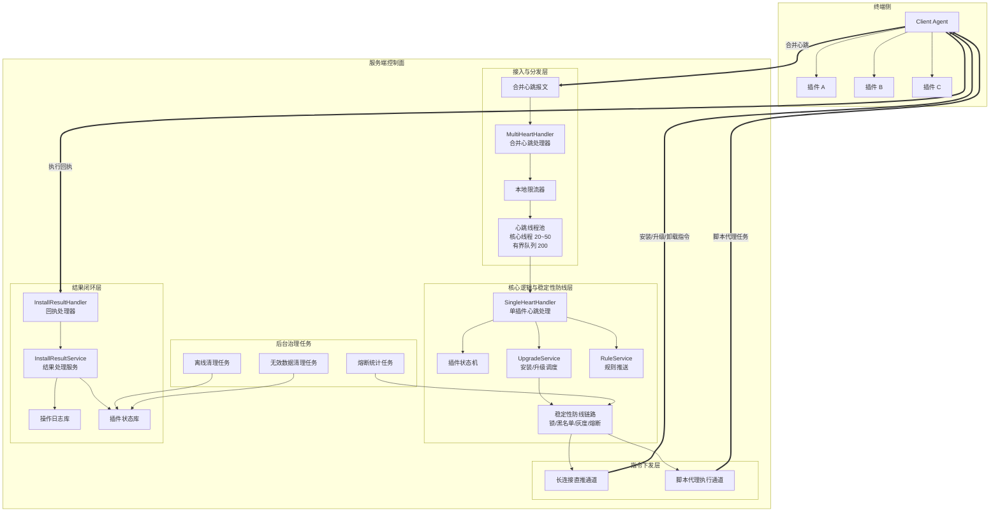

---

## 五、核心数据模型设计

### 1. 终端表

记录终端的基础信息。

| 字段 | 说明 |
| :--- | :--- |
| `uuid` | 终端唯一标识 |
| `ip` | 终端 IP |
| `hostname` | 主机名 |
| `os_type` | 操作系统类型 |
| `os_version` | 操作系统版本 |
| `arch` | CPU 架构 |
| `env_type` | 环境类型，如物理机、虚拟机、容器 |
| `last_heartbeat_time` | 最近心跳时间 |
| `status` | 终端状态 |

### 2. 插件状态表

记录某个终端上某个插件的运行状态。

| 字段 | 说明 |
| :--- | :--- |
| `uuid` | 终端 UUID |
| `plugin_code` | 插件编码 |
| `plugin_version` | 当前版本 |
| `target_version` | 目标版本 |
| `status` | 插件状态 |
| `last_heartbeat_time` | 最近插件心跳时间 |
| `last_op_time` | 最近操作时间 |
| `uninstall_flag` | 是否标记卸载 |
| `fail_count` | 连续失败次数 |
| `updated_at` | 更新时间 |

### 3. 操作日志表

记录安装、升级、卸载、规则推送等动作。

| 字段 | 说明 |
| :--- | :--- |
| `cmd_id` | 指令 ID |
| `uuid` | 终端 UUID |
| `plugin_code` | 插件编码 |
| `op_type` | 操作类型 |
| `target_version` | 目标版本 |
| `status` | 执行状态 |
| `error_code` | 错误码 |
| `error_msg` | 错误信息 |
| `created_at` | 创建时间 |
| `finished_at` | 完成时间 |

---

## 六、插件状态机设计

插件生命周期不应只用一个简单的 `Online/Offline` 字段表达，否则后续安装、升级、卸载、失败重试会变得混乱。

建议设计明确的状态机。

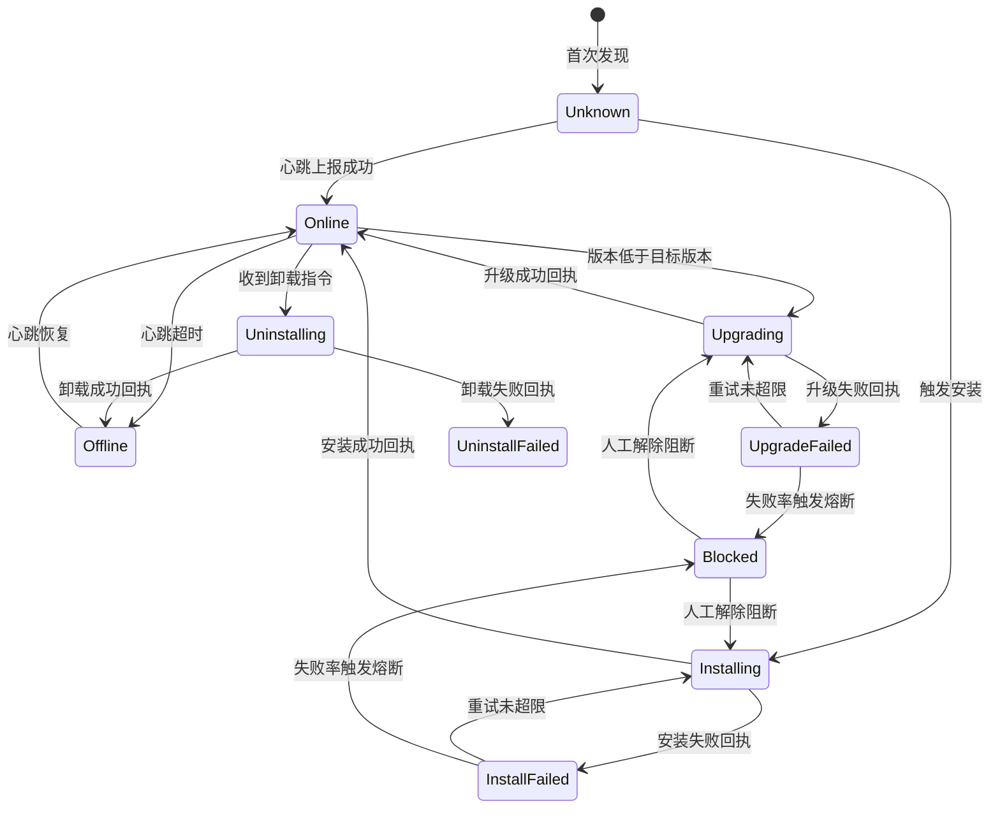

### 状态说明

| 状态 | 含义 |
| :--- | :--- |
| `Unknown` | 首次发现，还未确认插件真实状态 |
| `Online` | 插件在线且正常心跳 |
| `Offline` | 超时无心跳，逻辑离线 |
| `Installing` | 安装指令已下发，等待回执 |
| `Upgrading` | 升级指令已下发，等待回执 |
| `Uninstalling` | 卸载指令已下发，等待回执 |
| `InstallFailed` | 安装失败 |
| `UpgradeFailed` | 升级失败 |
| `UninstallFailed` | 卸载失败 |
| `Blocked` | 被熔断或人工阻断 |

---

## 七、合并心跳设计：性能的第一道关口

### 1. 为什么要合并心跳？

如果一个终端有 10 个插件，每个插件都单独上报心跳，那么：

```text
100 万终端 × 10 个插件 × 每分钟 1 次 = 每分钟 1000 万次请求
```

这会显著增加：

- 网络 IO
- 服务端连接压力
- 网关 QPS
- 数据库写入压力
- 日志量
- 线程上下文切换

更合理的方式是：终端 Agent 聚合多个插件状态，一次性上报。

```json
{
  "uuid": "client-001",
  "ip": "10.1.2.3",
  "osType": "linux",
  "osVersion": "5.15.0",
  "envType": "host",
  "plugins": [
    {
      "pluginCode": "security-agent",
      "version": "1.2.0",
      "status": "running",
      "lastError": null
    },
    {
      "pluginCode": "log-agent",
      "version": "2.0.1",
      "status": "running",
      "lastError": null
    }
  ]
}
```

### 2. 合并心跳处理流程

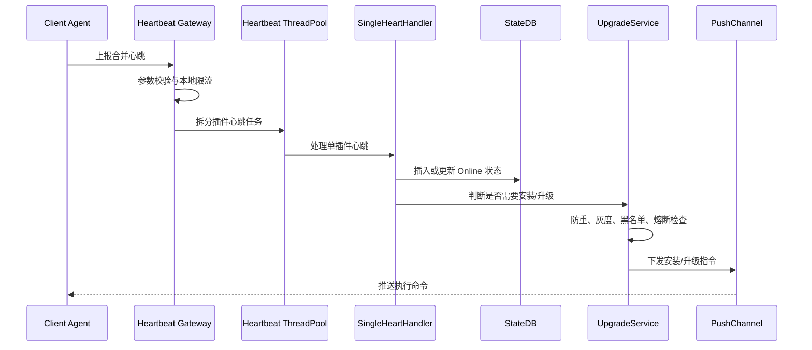

### 3. 心跳线程池建议

心跳是高频流量，不能无限创建线程，也不能无限堆积队列。

建议：

| 参数 | 建议值 | 说明 |
| :--- | :--- | :--- |
| 核心线程数 | 20~50 | 根据 CPU 核数、业务耗时、部署规模调整 |
| 最大线程数 | 50~100 | 防止突发流量拖垮节点 |
| 队列长度 | 200~1000 | 必须有界，防止内存溢出 |
| 拒绝策略 | 限流/丢弃/降级 | 心跳可丢弃，不能拖垮主服务 |
| 超时时间 | 短超时 | 防止慢任务占满线程池 |

示例伪代码：

```java
ThreadPoolExecutor heartbeatExecutor = new ThreadPoolExecutor(
    20,
    50,
    60,
    TimeUnit.SECONDS,
    new ArrayBlockingQueue<>(200),
    new ThreadPoolExecutor.DiscardPolicy()
);
```

这里使用有界队列是关键。心跳任务如果无限堆积，最终会拖垮整个服务节点。

---

## 八、防重调度设计：避免重复安装与并发冲突

在真实网络环境中，终端可能因为以下原因重复触发安装：

- 心跳重复上报
- 网络重试
- 服务端重复消费
- 多个节点并发处理同一终端
- 回执延迟导致状态未及时更新
- 用户重复点击升级按钮

因此，安装/升级必须具备幂等与防重能力。

### 1. 防重 Key 设计

建议以终端、插件、操作类型、目标版本作为防重维度。

```text
plugin:op:lock:{uuid}:{pluginCode}:{opType}:{targetVersion}
```

示例：

```text
plugin:op:lock:client-001:security-agent:upgrade:1.3.0
```

### 2. 防重流程

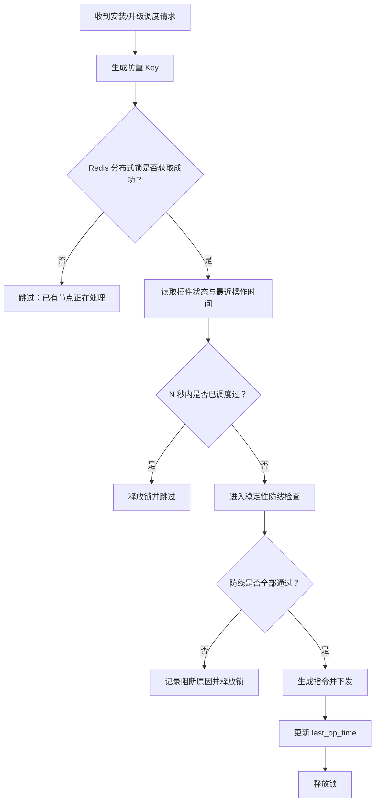

### 3. 双重防护

只依赖 Redis 锁还不够，建议使用两层防重：

1. Redis 分布式锁：防止多节点并发处理。
2. 数据库时间戳校验：防止锁过期、重复消费、异常重试。

伪代码：

```java
String lockKey = buildLockKey(uuid, pluginCode, opType, targetVersion);

boolean locked = redis.tryLock(lockKey, 30, TimeUnit.SECONDS);
if (!locked) {
    return DispatchResult.skipped("duplicate operation");
}

try {
    PluginState state = pluginStateRepository.get(uuid, pluginCode);

    if (state.getLastOpTime() != null &&
        Duration.between(state.getLastOpTime(), now()).getSeconds() < 60) {
        return DispatchResult.skipped("operation too frequent");
    }

    DefenseResult defenseResult = defenseChain.check(context);
    if (!defenseResult.isAllowed()) {
        return DispatchResult.blocked(defenseResult.getReason());
    }

    pushCommand(context);
    pluginStateRepository.updateLastOpTime(uuid, pluginCode, now());

    return DispatchResult.success();
} finally {
    redis.unlock(lockKey);
}
```

---

## 九、稳定性防线设计

插件下发是高危动作。建议将所有稳定性检查抽象成一条防线链路。


### 1. 特殊环境过滤

有些终端环境天然不适合安装部分插件，例如：

| 环境 | 风险 |
| :--- | :--- |
| 容器环境 | 无完整 systemd、无内核模块权限、文件系统受限 |
| 无 root 权限环境 | 无法安装驱动或系统服务 |
| 只读文件系统 | 无法写入插件文件 |
| Serverless 环境 | 生命周期短，不适合常驻插件 |
| 安全加固环境 | 执行脚本可能被拦截 |

建议维护插件白名单。

```text
container_env_allowed_plugins = [
  "log-collector",
  "metrics-agent"
]
```

如果终端处于容器环境，非白名单插件直接跳过安装与保活逻辑。

### 2. OS 不兼容黑名单

当某类 OS 明确不支持某个插件时，不应每次心跳都重复尝试安装。

建议写入分布式缓存黑名单。

```text
plugin:os:blacklist:{pluginCode}:{osType}:{osVersion}:{arch}
```

过期时间建议设置为 7 天或更长。

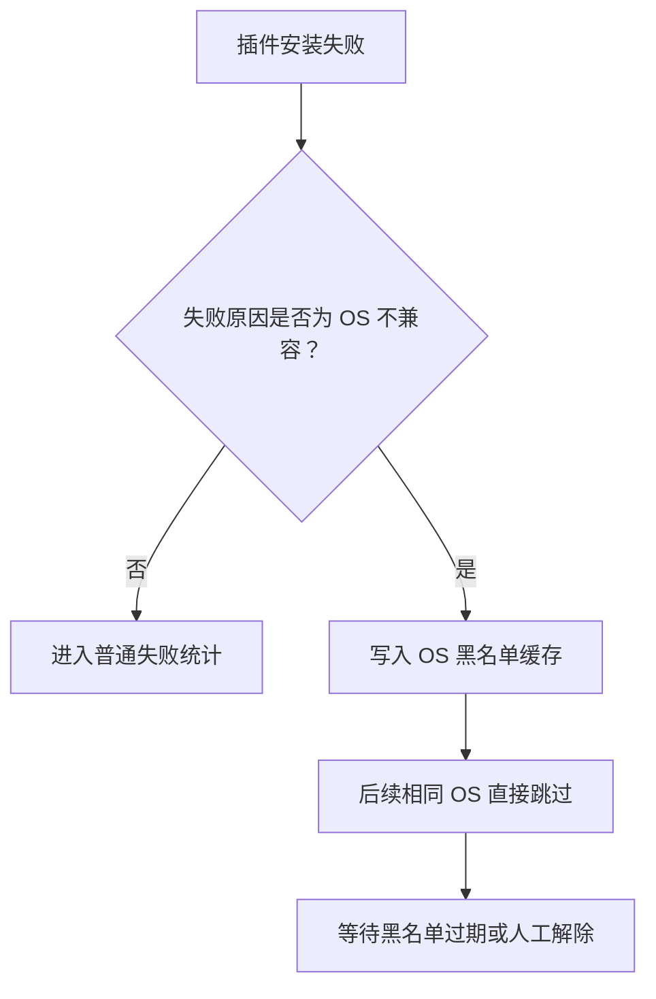

### 3. 灰度发布控制

灰度发布是插件生命周期管理的核心能力。

常见灰度维度包括：

| 灰度维度 | 说明 |
| :--- | :--- |
| UUID 白名单 | 指定终端先行测试 |
| IP 段 | 按网络区域灰度 |
| 地域 | 按机房、城市、区域灰度 |
| 组织 | 按租户、部门、业务线灰度 |
| 百分比 | 按 hash 百分比放量 |
| OS 类型 | 仅对指定 OS 发布 |
| 插件版本 | 从指定版本升级到目标版本 |

百分比灰度建议使用稳定 Hash，保证同一终端多次判断结果一致。

```java
int bucket = Math.abs(uuid.hashCode()) % 100;
boolean allowed = bucket < grayPercent;
```

### 4. 内核级插件高危灰度

内核级插件、驱动类插件、系统 Hook 类插件必须与普通插件区别对待。

普通插件失败，可能只是功能不可用。

内核级插件失败，可能导致：

- 系统崩溃
- 网络断连
- 无法开机
- 大面积终端失联

因此内核级插件应增加单独灰度策略。

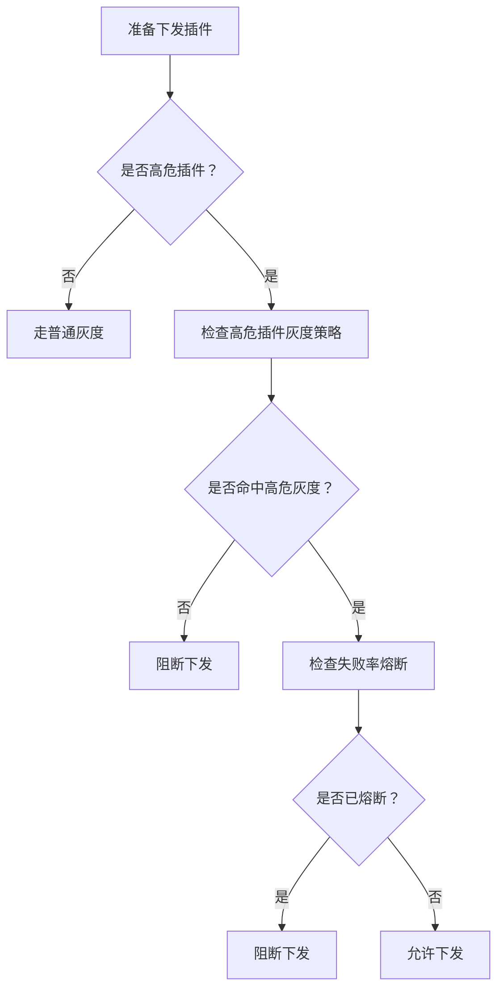

### 5. 自动熔断阻断

如果某个插件版本在短时间内失败率过高，系统必须自动停止后续下发。

建议以插件、版本、操作类型、OS 维度统计失败率。

```text
plugin:breaker:{pluginCode}:{version}:{opType}:{osType}
```

熔断规则示例：

| 指标 | 阈值 |
| :--- | :--- |
| 样本数 | 最近 5 分钟安装数 >= 100 |
| 失败率 | 失败率 >= 20% |
| 连续失败 | 连续失败 >= 30 |
| 严重错误 | 出现内核崩溃类错误立即阻断 |

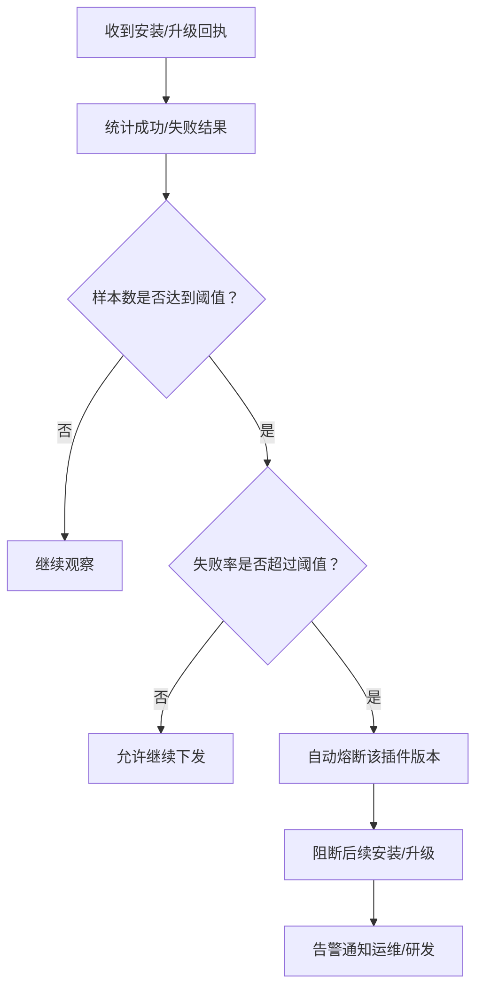

---

## 十、指令下发设计：双通道推送

不同插件的执行方式不同，建议使用双通道下发。

| 通道 | 适合场景 | 特点 |
| :--- | :--- | :--- |
| 长连接直推 | 轻量指令、脚本插件、规则更新 | 延迟低，适合实时推送 |
| 脚本代理执行 | 重量级安装、混合云代理、复杂命令 | 可控性强，适合复杂操作 |

### 1. 长连接直推

适合：

- Python 脚本插件
- 规则更新
- 轻量重启
- 配置刷新
- 状态查询

优点：

- 延迟低
- 链路短
- 实时性好

缺点：

- 依赖长连接稳定性
- 不适合复杂安装流程

### 2. 脚本代理执行

适合：

- 大插件安装
- 多步骤升级
- 混合云环境
- 需要下载文件、校验 hash、执行脚本的场景

优点：

- 支持复杂流程
- 便于审计
- 可统一执行环境

缺点：

- 链路更长
- 延迟更高
- 需要额外代理能力

---

## 十一、回执闭环设计

指令下发不是结束，收到终端回执才算进入结果闭环。

### 1. 回执类型

| 回执类型 | 说明 |
| :--- | :--- |
| 安装成功 | 更新插件版本和状态 |
| 安装失败 | 记录失败原因，进入失败统计 |
| 升级成功 | 更新当前版本 |
| 升级失败 | 记录失败原因，可能触发熔断 |
| 卸载成功 | 状态置为 Offline 或 Removed |
| 卸载失败 | 记录失败原因，等待重试或人工处理 |
| 规则推送成功 | 更新规则版本 |
| 规则推送失败 | 记录失败原因，等待重试 |

### 2. 回执处理流程

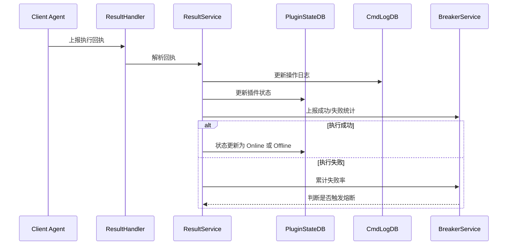

---

## 十二、离线清理设计

终端插件状态不能无限增长，需要后台任务做治理。

建议采用双步清理：

1. 逻辑离线：超时无心跳，先标记为 `Offline`。
2. 物理删除：离线超过保留周期后，删除无效记录。

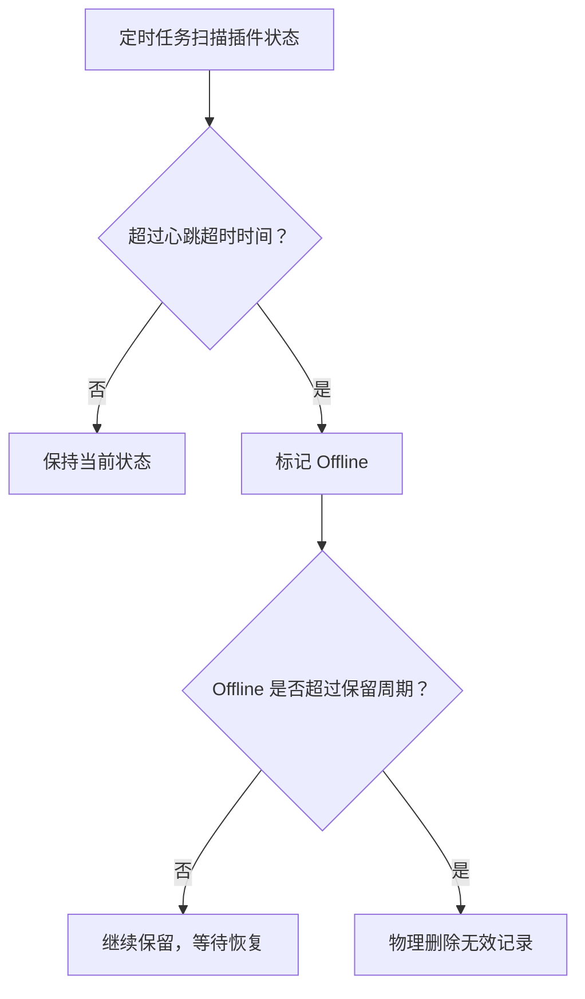

建议配置：

| 项目 | 建议值 |
| :--- | :--- |
| 心跳周期 | 30 秒 ~ 60 秒 |
| 离线判定 | 超过 3 个心跳周期 |
| 逻辑离线保留 | 7 天 |
| 物理删除周期 | 每日低峰执行 |
| 删除方式 | 分批分页删除，避免大事务 |

---

## 十三、高并发与容量设计

### 1. QPS 估算

假设：

- 终端数量：100 万
- 每台终端心跳周期：60 秒
- 每次心跳合并 10 个插件状态

则心跳 QPS 约为：

```text
1,000,000 / 60 ≈ 16,667 QPS
```

如果不做合并心跳：

```text
1,000,000 × 10 / 60 ≈ 166,667 QPS
```

合并心跳可以将请求量降低约 10 倍。

### 2. 写入压力优化

插件状态更新是高频写操作，应避免每次心跳都全量写数据库。

可选优化策略：

| 策略 | 说明 |
| :--- | :--- |
| Redis 缓冲 | 心跳先写缓存，再批量落库 |
| 状态变更写库 | 只有状态、版本、错误码变化时写库 |
| 时间窗口合并 | 同一插件 N 秒内只更新一次 DB |
| 分库分表 | 按 UUID hash 分片 |
| 批量写入 | 后台批量 upsert |
| 冷热分离 | 在线状态走缓存，历史状态进数据库 |

### 3. 推荐链路

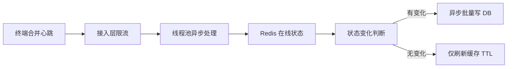

---

## 十四、规则推送设计

规则推送与插件安装不同。

插件安装通常是低频高风险动作，规则推送通常是中频动作，但也可能影响业务稳定性。

规则推送建议具备：

- 规则版本号
- 规则灰度
- 规则回滚
- 规则签名校验
- 规则兼容性校验
- 规则推送回执
- 规则生效状态确认

规则推送流程：

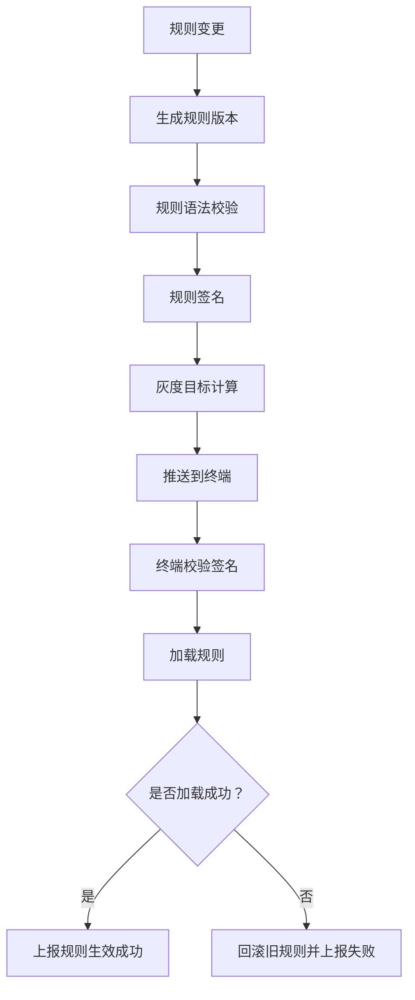

---

## 十五、异常场景与应对策略

| 异常场景 | 风险 | 应对策略 |
| :--- | :--- | :--- |
| 心跳突增 | 服务节点被打满 | 本地限流、有界队列、丢弃策略 |
| 重复心跳 | 重复安装/升级 | Redis 锁 + last_op_time |
| 回执丢失 | 状态不一致 | 心跳补偿 + 定时对账 |
| 插件安装失败 | 功能不可用 | 失败重试 + 熔断 |
| OS 不兼容 | 重复失败 | OS 黑名单缓存 |
| 容器环境不支持 | 安装异常 | 环境识别 + 白名单 |
| 灰度策略错误 | 扩散范围过大 | 百分比上限 + 人工审批 |
| 内核插件异常 | 终端宕机 | 高危灰度 + 失败率熔断 |
| 数据库写入过高 | DB 压力过大 | Redis 缓冲 + 批量落库 |
| 指令重复执行 | 终端状态混乱 | cmd_id 幂等 + 操作状态机 |

---

## 十六、核心链路伪代码

### 1. 合并心跳入口

```java
public void handleMultiHeartbeat(MultiHeartbeatReq req) {
    if (!rateLimiter.tryAcquire()) {
        return;
    }

    validateClient(req);

    for (PluginHeartbeat plugin : req.getPlugins()) {
        HeartbeatTask task = new HeartbeatTask(req.getClientInfo(), plugin);

        try {
            heartbeatExecutor.execute(task);
        } catch (RejectedExecutionException ex) {
            log.warn("heartbeat task rejected, uuid={}, plugin={}",
                    req.getUuid(), plugin.getPluginCode());
        }
    }
}
```

### 2. 单插件心跳处理

```java
public void handleSingleHeartbeat(ClientInfo client, PluginHeartbeat plugin) {
    checkParam(client, plugin);

    if (checkUninstallMarked(client.getUuid(), plugin.getPluginCode())) {
        return;
    }

    pluginStateService.insertOrUpdateOnline(
        client.getUuid(),
        plugin.getPluginCode(),
        plugin.getVersion()
    );

    if (needUpgrade(client, plugin)) {
        upgradeService.dispatchUpgrade(client, plugin);
    }

    if (needPushRule(client, plugin)) {
        ruleService.pushRule(client, plugin);
    }
}
```

### 3. 安装/升级调度

```java
public DispatchResult dispatchUpgrade(ClientInfo client, PluginHeartbeat plugin) {
    DispatchContext context = buildContext(client, plugin);

    String lockKey = buildLockKey(context);
    boolean locked = redisLock.tryLock(lockKey, 30, TimeUnit.SECONDS);

    if (!locked) {
        return DispatchResult.skipped("duplicate dispatch");
    }

    try {
        if (recentlyDispatched(context)) {
            return DispatchResult.skipped("dispatch too frequent");
        }

        DefenseResult defense = defenseChain.check(context);
        if (!defense.isAllowed()) {
            return DispatchResult.blocked(defense.getReason());
        }

        Command command = commandService.createInstallCommand(context);
        pushService.push(command);

        pluginStateService.updateLastOpTime(context);

        return DispatchResult.success();
    } finally {
        redisLock.unlock(lockKey);
    }
}
```

### 4. 稳定性防线链

```java
public DefenseResult check(DispatchContext context) {
    List<DefenseChecker> checkers = List.of(
        duplicateChecker,
        envWhiteListChecker,
        osBlackListChecker,
        grayReleaseChecker,
        kernelGrayChecker,
        autoBreakerChecker
    );

    for (DefenseChecker checker : checkers) {
        DefenseResult result = checker.check(context);
        if (!result.isAllowed()) {
            return result;
        }
    }

    return DefenseResult.allowed();
}
```

---

## 十七、可观测性设计

大规模终端系统必须具备完善的可观测能力。

### 1. 核心指标

| 指标 | 说明 |
| :--- | :--- |
| 心跳 QPS | 接入层压力 |
| 心跳拒绝数 | 限流与队列满情况 |
| 插件在线数 | 插件运行规模 |
| 插件离线数 | 异常趋势 |
| 安装成功率 | 安装质量 |
| 升级成功率 | 升级质量 |
| 卸载成功率 | 卸载质量 |
| 指令下发延迟 | 控制面实时性 |
| 回执延迟 | 终端执行耗时 |
| 熔断次数 | 稳定性风险 |
| 黑名单命中数 | 兼容性问题 |
| 灰度命中数 | 发布范围 |

### 2. 告警建议

| 告警项 | 建议规则 |
| :--- | :--- |
| 心跳 QPS 突增 | 5 分钟内增长超过 100% |
| 心跳拒绝数过高 | 拒绝率超过 5% |
| 插件失败率过高 | 最近 5 分钟失败率超过 20% |
| 内核插件失败 | 出现严重错误立即告警 |
| 回执延迟过高 | P95 超过 5 分钟 |
| 离线数突增 | 某插件离线数突然升高 |
| 熔断触发 | 任意插件版本触发熔断立即通知 |

---

## 十八、系统落地优先级

如果从零开始建设，不建议一开始就做大而全，而应按优先级逐步落地。

### 第一阶段：核心闭环

必须先实现：

1. 合并心跳
2. 插件状态表
3. 安装/升级/卸载指令
4. 回执处理
5. 基础状态机
6. 操作日志

目标：系统能跑通完整生命周期。

### 第二阶段：稳定性防线

必须尽早补齐：

1. Redis 分布式锁防重
2. last_op_time 时间戳防重
3. 灰度发布
4. OS 黑名单
5. 自动熔断
6. 特殊环境过滤

目标：系统不会因为错误指令造成大面积事故。

### 第三阶段：高并发优化

继续增强：

1. 本地限流
2. 有界线程池
3. Redis 在线状态缓存
4. 批量落库
5. 分库分表
6. 异步队列削峰

目标：支撑百万级/千万级终端规模。

### 第四阶段：治理与可观测

最后完善：

1. 指标监控
2. 告警策略
3. 离线清理
4. 失败统计
5. 灰度看板
6. 插件版本看板
7. 人工阻断与解除

目标：让系统可运营、可排障、可持续演进。

---

## 十九、完整链路总结

最终系统链路如下：

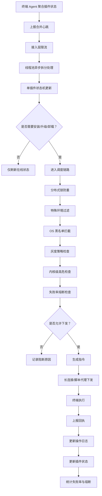

---

## 二十、总结

百万级/千万级终端插件生命周期管理系统，本质上不是一个简单的任务下发系统，而是一个高并发、高可靠、强风控的分布式控制面系统。

它的关键设计点包括：

1. **合并心跳**：降低请求量，是性能基石。
2. **线程池与限流**：保护服务节点，避免突发流量拖垮系统。
3. **状态机**：让插件生命周期可控、可追踪。
4. **防重调度**：避免网络抖动和并发处理导致重复安装。
5. **灰度发布**：控制影响范围，避免全量事故。
6. **内核级高危防线**：对高风险插件做更严格的发布约束。
7. **自动熔断**：失败率异常时自动阻断，防止雪崩。
8. **环境自适应**：识别容器、OS 不兼容、权限不足等特殊环境。
9. **回执闭环**：指令下发后必须追踪执行结果。
10. **离线清理与可观测性**：让系统长期稳定运行。

对于这类系统，最重要的不是“能不能下发”，而是：

> 在出现错误插件、异常环境、网络抖动、流量突增时，系统能否自动保护自己，避免把局部问题放大成全局事故。

这也是大规模终端控制系统设计中最核心的工程价值。
