# Enhanced UISA：面向混合云与异构节点的高可靠信息同步架构设计

## 摘要

在云原生、混合云、边缘计算并行发展的背景下，企业基础设施中的节点类型越来越复杂：云上 ECS、IDC 物理机、边缘网关、容器宿主机、专有云节点往往同时存在。如何让这些异构节点稳定、低成本、可审计地完成资产信息、状态遥测、配置指令与任务结果同步，是基础设施平台必须解决的核心问题。

传统同步方案常见问题包括：

* 节点身份依赖静态凭证，存在伪造与泄露风险；
* 同步链路缺少幂等与版本控制，容易产生重复写入和数据覆盖；
* 节点离线后任务丢失，恢复上线后状态不可追踪；
* 大规模心跳与资产上报冲击数据库，系统削峰能力不足；
* 审计日志缺失，故障发生后难以回溯。

本文提出一套增强型通用信息同步架构：**Enhanced UISA（Enhanced Universal Information Sync Architecture）**。它以“身份可信、链路安全、任务可恢复、数据最终一致、变更可审计”为核心原则，适用于云主机资产同步、物理机巡检、边缘设备管理、配置分发、状态遥测等多种基础设施场景。

---

## 1. 设计目标

Enhanced UISA 不是单一业务系统，而是一套可以复用到多种节点同步场景的架构底座。

| 目标  | 说明                    | 关键设计                        |
| :-- | :-------------------- | :-------------------------- |
| 高可靠 | 节点离线、网关异常、网络抖动时任务不丢失  | 离线队列、任务状态机、重试机制             |
| 高安全 | 防止节点伪造、Token 泄露、数据篡改  | 双向认证、短期令牌、Payload Hash、签名校验 |
| 高性能 | 支持海量节点心跳与增量同步         | MQ 削峰、批量消费、Hash 快速比对        |
| 可扩展 | 支持 ECS、物理机、边缘节点等不同采集源 | Agent 插件化、协议转换、资产类型抽象       |
| 一致性 | 避免并发覆盖、重复写入、脏数据入库     | 幂等 Task ID、乐观锁、版本号          |
| 可审计 | 所有关键变更可以追踪和回放         | 审计日志、快照、变更 Diff             |

---

## 2. 总体架构

Enhanced UISA 按职责拆分为四层：边缘层、接入层、核心层、数据层。每一层只关注自己的核心职责，通过明确协议与事件流解耦。

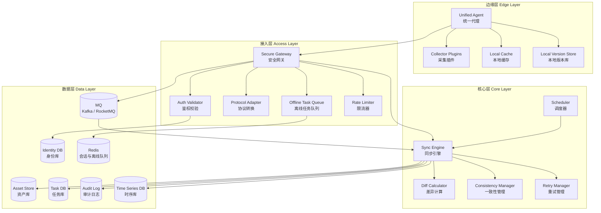

### 2.1 分层职责说明

| 层级  | 核心组件                              | 主要职责                   | 设计重点            |
| :-- | :-------------------------------- | :--------------------- | :-------------- |
| 边缘层 | Unified Agent                     | 身份持有、数据采集、任务执行、本地缓存    | 插件化、断点续传、本地版本管理 |
| 接入层 | Secure Gateway                    | 鉴权、协议转换、限流、任务转发、离线缓存   | 安全入口、削峰、连接治理    |
| 核心层 | Sync Engine                       | 调度、Diff 计算、状态机推进、一致性控制 | 幂等、重试、事务控制      |
| 数据层 | Asset Store / Task DB / Audit Log | 状态存储、资产快照、任务记录、审计回溯    | 多租户隔离、版本回溯、冷热分离 |

---

## 3. 核心设计原则

### 3.1 不信任任何单点输入

Agent 上报的数据必须经过 Token 校验、签名校验、时间戳校验、Payload Hash 校验后才能进入核心处理链路。

这可以防止以下风险：

* 非法节点伪造 UUID 上报数据；
* 中间人篡改资产内容；
* 旧请求被重复提交形成重放攻击；
* Token 泄露后长期可用。

### 3.2 任务先落库，再执行

同步任务不应只存在于内存中。任何需要下发给节点的任务，都应该先生成 `task_id` 并写入任务库，然后再由网关或调度器推动执行。

这样可以保证：

* 网关重启后任务不会丢失；
* 节点离线后任务可以恢复；
* 执行结果可以审计；
* 重试次数和失败原因可以追踪。

### 3.3 能增量，不全量

资产同步必须优先使用版本号与 Hash 进行快速判断，只在必要时传输 Diff 数据。

全量同步只应该出现在以下情况：

* 节点首次接入；
* Hash 校验失败；
* 多次增量重试失败；
* 版本链断裂；
* 管理员手动触发修复。

### 3.4 最终一致，而不是强同步阻塞

在海量节点场景下，所有节点状态不可能始终强一致。系统应该追求“可观测、可恢复、可收敛”的最终一致。

核心思路是：

* 写入路径幂等；
* 状态机可重放；
* 冲突可检测；
* 失败可重试；
* 结果可审计。

---

## 4. 身份与安全模型

Enhanced UISA 使用“双重身份 + 短期令牌 + 签名校验”的安全模型。

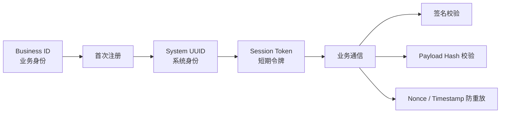

### 4.1 双重身份标识

| 身份类型        | 使用阶段     | 是否长期使用 | 说明                         |
| :---------- | :------- | :----- | :------------------------- |
| Business ID | 首次注册     | 否      | 可来自机器码、云实例 ID、用户业务 ID、预置凭证 |
| System UUID | 注册后全生命周期 | 是      | 系统生成的全局唯一身份，后续所有通信使用它      |

Business ID 只负责证明“你是谁”，System UUID 才是系统内部真正使用的节点身份。

### 4.2 通信安全栈

| 阶段       | 安全机制              | 目的        |
| :------- | :---------------- | :-------- |
| 注册阶段     | PSK / 非对称签名       | 防止伪造注册    |
| Token 下发 | 短期 Session Token  | 降低凭证泄露风险  |
| 普通请求     | Bearer Token + 签名 | 验证请求来源    |
| 关键载荷     | Payload Hash      | 防止内容篡改    |
| 防重放      | Nonce + Timestamp | 防止旧请求重复提交 |

### 4.3 推荐请求头

```http
Authorization: Bearer <session_token>
X-Node-UUID: <system_uuid>
X-Timestamp: 1711324800000
X-Nonce: 8f5a2b1c9d
X-Payload-Hash: sha256:<hash>
X-Signature: <signature>
```

---

## 5. 安全注册流程

注册流程的目标是建立可信身份，并将业务身份绑定为系统身份。

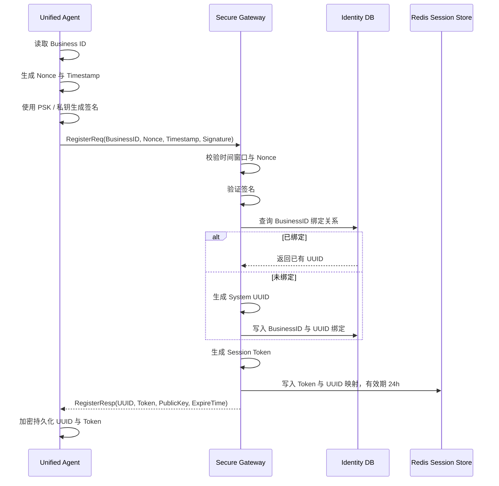

### 5.1 注册接口建议

```json
{
  "businessId": "ecs-i-xxxxxx",
  "nonce": "8f5a2b1c9d",
  "timestamp": 1711324800000,
  "signature": "base64-signature",
  "agentVersion": "1.3.0",
  "capabilities": ["asset", "heartbeat", "command"]
}
```

### 5.2 注册结果建议

```json
{
  "uuid": "node-9d2e4b62-8f1a-4c92-a941-xxxxxx",
  "token": "eyJhbGciOi...",
  "expireAt": "2026-03-26T00:00:00Z",
  "serverPublicKey": "-----BEGIN PUBLIC KEY-----...",
  "heartbeatIntervalSeconds": 30
}
```

---

## 6. 心跳与状态遥测设计

心跳不是简单的“在线检测”，而是整个系统调度、离线恢复、任务唤醒、健康评估的入口。

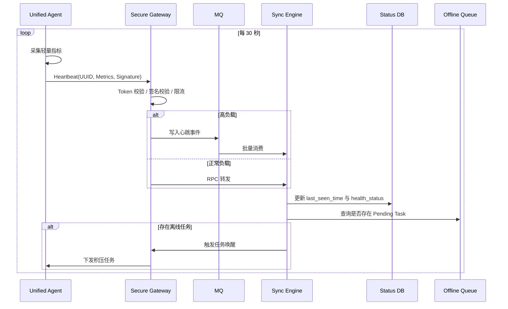

### 6.1 心跳数据建议

| 字段               | 类型     | 说明         |
| :--------------- | :----- | :--------- |
| uuid             | string | 节点系统身份     |
| timestamp        | long   | Agent 本地时间 |
| cpu_usage        | double | CPU 使用率    |
| memory_usage     | double | 内存使用率      |
| disk_usage       | double | 磁盘使用率      |
| agent_version    | string | Agent 版本   |
| network_status   | string | 网络状态       |
| running_task_ids | array  | 当前执行中的任务   |

### 6.2 在线状态判断

| 状态       | 判断条件            | 系统动作      |
| :------- | :-------------- | :-------- |
| Online   | 最近 1 个心跳周期内正常上报 | 正常调度任务    |
| Unstable | 连续 2 个周期异常或延迟   | 降低下发频率    |
| Offline  | 超过 3 个周期未上报     | 任务进入离线队列  |
| Disabled | 管理员禁用或安全风险      | 拒绝任务与数据写入 |

---

## 7. 资产增量同步流程

资产同步是 UISA 的核心能力。它通过“版本号 + Hash + Diff + 乐观锁”实现低成本、可恢复的一致性同步。

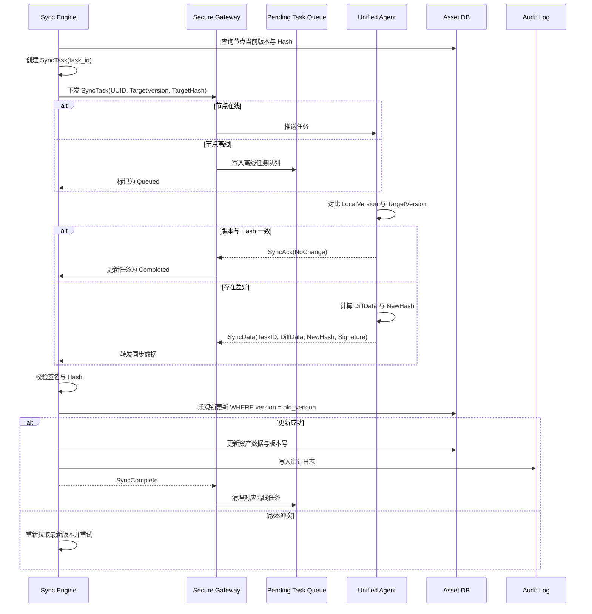

### 7.1 资产同步策略对比

| 策略         | 适用场景              | 优点      | 缺点       |
| :--------- | :---------------- | :------ | :------- |
| 全量同步       | 首次接入、灾难恢复、Hash 错误 | 简单可靠    | 传输成本高    |
| 增量同步       | 常规资产变更            | 传输少、速度快 | 需要版本管理   |
| Hash 快速比对  | 大字段、列表类资产         | 判断快、成本低 | 无法表达具体变更 |
| Diff Patch | 配置、软件包、磁盘列表       | 精准同步    | 实现复杂     |

### 7.2 Diff 计算建议

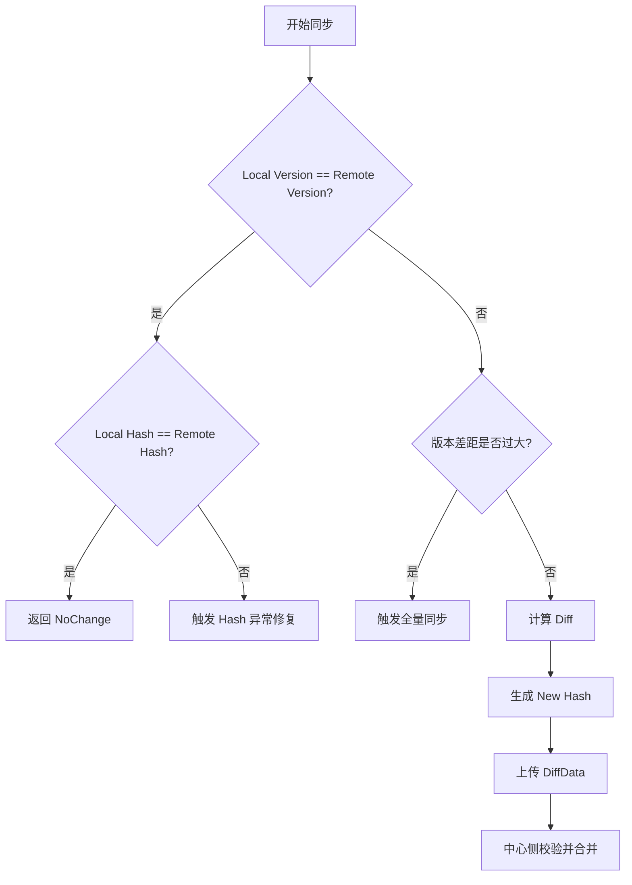

### 7.3 资产唯一键设计

资产数据必须有稳定唯一键，否则 UPSERT 会变成重复插入。

| 资产类型      | asset_key 推荐值         | 示例                |
| :-------- | :-------------------- | :---------------- |
| CPU       | cpu_index 或 socket_id | cpu-0             |
| Disk      | 磁盘序列号 / 设备路径          | /dev/sda          |
| NIC       | MAC 地址                | 00:16:3e:xx:xx:xx |
| Software  | 包名 + 架构               | nginx:x86_64      |
| Process   | pid + start_time      | 1123:1711324800   |
| Container | container_id          | 1f2a3b4c          |

---

## 8. 离线任务队列设计

离线节点是基础设施管理中的常态，而不是异常。UISA 将离线视为任务生命周期的一部分。

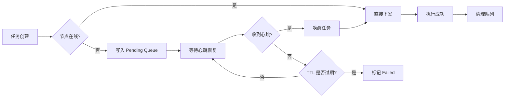

### 8.1 队列结构建议

Redis 中可以使用如下结构：

```text
pending_task:{uuid} -> List<TaskID>
task_detail:{task_id} -> TaskPayload
task_lock:{task_id} -> distributed lock
task_retry:{task_id} -> retry count
task_deadline:{task_id} -> expire timestamp
```

### 8.2 离线任务策略

| 策略     | 建议                              |
| :----- | :------------------------------ |
| TTL    | 默认 7 天，关键任务可延长                  |
| 最大积压数  | 单节点限制 1000 条，超过后合并同类任务          |
| 同类任务合并 | 多次资产同步任务只保留最新一条                 |
| 唤醒方式   | 心跳返回 Pending Task 摘要，Agent 主动拉取 |
| 执行顺序   | 配置变更优先，资产采集其次，普通巡检最后            |

---

## 9. 任务状态机

任务状态机是保证系统可恢复、可追踪、可审计的关键。

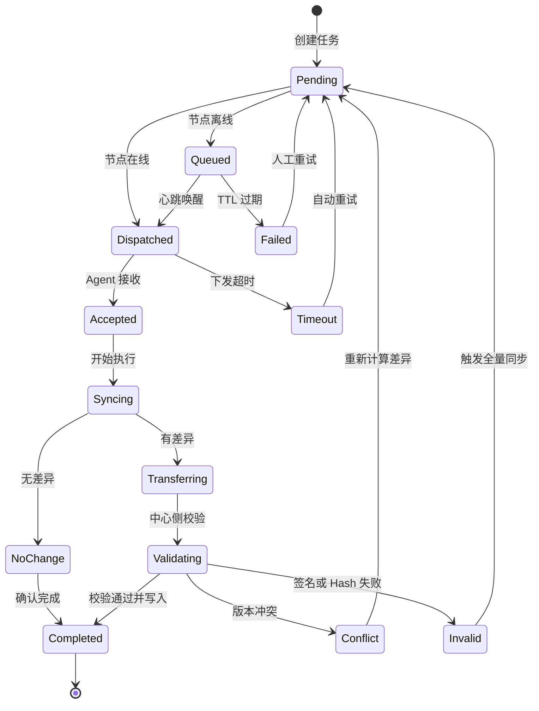

### 9.1 状态字段建议

| 字段          | 说明                              |
| :---------- | :------------------------------ |
| task_id     | 全局唯一任务 ID                       |
| uuid        | 目标节点                            |
| task_type   | 任务类型，如 ASSET_SYNC / CONFIG_PUSH |
| status      | 当前状态                            |
| retry_count | 已重试次数                           |
| max_retry   | 最大重试次数                          |
| last_error  | 最近一次失败原因                        |
| created_at  | 创建时间                            |
| updated_at  | 更新时间                            |
| expire_at   | 过期时间                            |

---

## 10. 数据一致性保障

Enhanced UISA 的一致性目标不是单次请求强一致，而是通过多层保护确保最终一致。

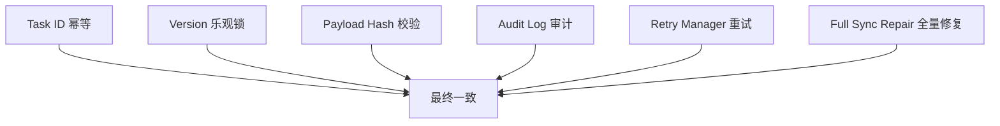

### 10.1 幂等控制

每个任务必须携带全局唯一 `task_id`。中心侧在处理前先检查该任务是否已经处理。

```sql
SELECT status FROM sync_task WHERE task_id = ?;
```

如果任务已经是 `Completed`，重复请求直接返回成功，不能再次写入资产表。

### 10.2 乐观锁控制

资产更新必须带版本条件。

```sql
UPDATE asset_info
SET content = ?,
    version = version + 1,
    content_hash = ?,
    update_time = NOW()
WHERE uuid = ?
  AND asset_type = ?
  AND asset_key = ?
  AND version = ?;
```

如果影响行数为 0，说明出现并发冲突，需要重新拉取最新版本并重新计算 Diff。

### 10.3 审计日志

每次变更都写入审计日志，保留变更前、变更后和差异详情。

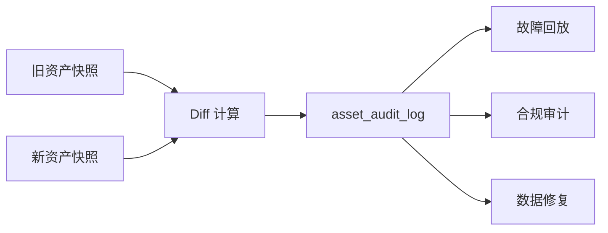

---

## 11. 核心数据模型

### 11.1 节点身份表：node_identity

| 字段             | 类型           | 说明                          |
| :------------- | :----------- | :-------------------------- |
| uuid           | varchar(64)  | 系统唯一身份，主键                   |
| business_id    | varchar(128) | 业务身份                        |
| public_key     | text         | 节点公钥                        |
| status         | varchar(32)  | ONLINE / OFFLINE / DISABLED |
| last_seen_time | datetime     | 最近心跳时间                      |
| agent_version  | varchar(64)  | Agent 版本                    |
| created_at     | datetime     | 创建时间                        |
| updated_at     | datetime     | 更新时间                        |

### 11.2 资产信息表：asset_info

| 字段           | 类型           | 说明      |
| :----------- | :----------- | :------ |
| id           | bigint       | 主键      |
| uuid         | varchar(64)  | 节点 UUID |
| asset_type   | varchar(64)  | 资产类型    |
| asset_key    | varchar(128) | 资产内部唯一键 |
| content      | json         | 资产内容    |
| version      | bigint       | 版本号     |
| content_hash | varchar(128) | 内容 Hash |
| update_time  | datetime     | 更新时间    |

推荐唯一索引：

```sql
UNIQUE KEY uk_asset_node_type_key (uuid, asset_type, asset_key)
```

### 11.3 同步任务表：sync_task

| 字段          | 类型          | 说明       |
| :---------- | :---------- | :------- |
| task_id     | varchar(64) | 任务 ID，主键 |
| uuid        | varchar(64) | 目标节点     |
| task_type   | varchar(64) | 任务类型     |
| status      | varchar(32) | 任务状态     |
| payload     | json        | 任务内容     |
| retry_count | int         | 重试次数     |
| max_retry   | int         | 最大重试次数   |
| last_error  | text        | 失败原因     |
| expire_at   | datetime    | 过期时间     |
| created_at  | datetime    | 创建时间     |
| updated_at  | datetime    | 更新时间     |

### 11.4 审计日志表：asset_audit_log

| 字段              | 类型           | 说明                       |
| :-------------- | :----------- | :----------------------- |
| log_id          | bigint       | 主键                       |
| task_id         | varchar(64)  | 关联任务                     |
| uuid            | varchar(64)  | 节点 UUID                  |
| action          | varchar(32)  | CREATE / UPDATE / DELETE |
| asset_type      | varchar(64)  | 资产类型                     |
| asset_key       | varchar(128) | 资产键                      |
| before_snapshot | json         | 变更前快照                    |
| after_snapshot  | json         | 变更后快照                    |
| diff_detail     | json         | 变更差异                     |
| operator        | varchar(64)  | 操作者                      |
| created_at      | datetime     | 创建时间                     |

---

## 12. 异常处理与容灾策略

| 异常场景      | 检测方式             | 处理策略                | 恢复方式                |
| :-------- | :--------------- | :------------------ | :------------------ |
| 网络中断      | 心跳超时、RPC 失败      | 标记 Offline，任务进入离线队列 | 心跳恢复后重新下发           |
| Agent 崩溃  | 心跳丢失             | 暂停任务调度              | Agent 重启后主动拉取未完成任务  |
| 网关宕机      | 健康检查失败           | LB 切换备用网关           | Token 与队列状态放 Redis  |
| MQ 堆积     | 消费延迟监控           | 扩容消费者、降级非核心遥测       | 批量消费追平              |
| Hash 校验失败 | Payload Hash 不一致 | 丢弃数据，记录安全日志         | 强制全量同步              |
| 乐观锁冲突     | UPDATE 影响行数为 0   | 重新拉取版本，重新计算 Diff    | 自动重试                |
| 数据库故障     | 写入失败、连接异常        | 任务保持 Pending        | DB 恢复后重试            |
| Token 过期  | 鉴权失败             | 要求 Agent 刷新 Token   | 重新注册或 Refresh Token |

---

## 13. 可观测性设计

没有可观测性的同步系统，一旦出现数据不一致，很难定位根因。UISA 应从指标、日志、链路追踪、审计四个方向建设观测能力。

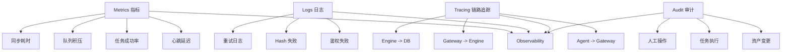

### 13.1 核心指标

| 指标                             | 说明          | 告警建议           |
| :----------------------------- | :---------- | :------------- |
| heartbeat_delay_seconds        | 心跳延迟        | P95 超过 60s 告警  |
| node_offline_count             | 离线节点数       | 突增告警           |
| sync_task_success_rate         | 同步任务成功率     | 低于 99% 告警      |
| pending_task_count             | 积压任务数       | 持续增长告警         |
| sync_duration_seconds          | 同步耗时        | P95 / P99 异常告警 |
| hash_validation_failed_total   | Hash 校验失败次数 | 任意突增告警         |
| optimistic_lock_conflict_total | 乐观锁冲突次数     | 持续增长告警         |

---

## 14. 性能优化建议

### 14.1 心跳链路削峰

高频心跳不要直接写数据库。推荐路径：

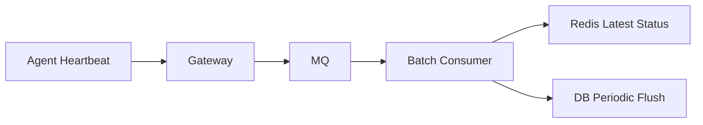

优化建议：

* 最新在线状态写 Redis；
* 数据库只周期性落盘；
* 遥测指标进入时序库；
* 心跳事件批量消费；
* 离线检测由定时任务扫描 Redis / DB。

### 14.2 资产数据冷热分离

| 数据类型   | 存储建议                                    |
| :----- | :-------------------------------------- |
| 当前资产状态 | MySQL / PostgreSQL                      |
| 历史变更审计 | 对象存储 + 索引表                              |
| 高频遥测指标 | Prometheus / VictoriaMetrics / InfluxDB |
| 离线任务队列 | Redis / MQ                              |
| 大型资产快照 | 对象存储                                    |

### 14.3 任务合并策略

如果同一节点短时间内产生多个资产同步任务，可以进行合并。

| 任务类型         | 合并规则           |
| :----------- | :------------- |
| ASSET_SYNC   | 只保留最新一次        |
| CONFIG_PUSH  | 不可随意合并，必须按版本执行 |
| COMMAND_EXEC | 通常不可合并         |
| HEARTBEAT    | 只保留最新状态        |
| TELEMETRY    | 可批量压缩写入        |

---

## 15. 工程落地建议

### 15.1 推荐技术选型

| 模块      | 推荐技术                                |
| :------ | :---------------------------------- |
| Agent   | Go / Rust / Java                    |
| Gateway | Spring Boot / Go Gateway / Envoy 扩展 |
| MQ      | Kafka / RocketMQ                    |
| 缓存      | Redis Cluster                       |
| 资产库     | MySQL / PostgreSQL                  |
| 时序数据    | Prometheus / VictoriaMetrics        |
| 链路追踪    | OpenTelemetry                       |
| 配置中心    | Nacos / Apollo / Consul             |
| 部署      | Kubernetes / systemd / Ansible      |

### 15.2 推荐部署拓扑

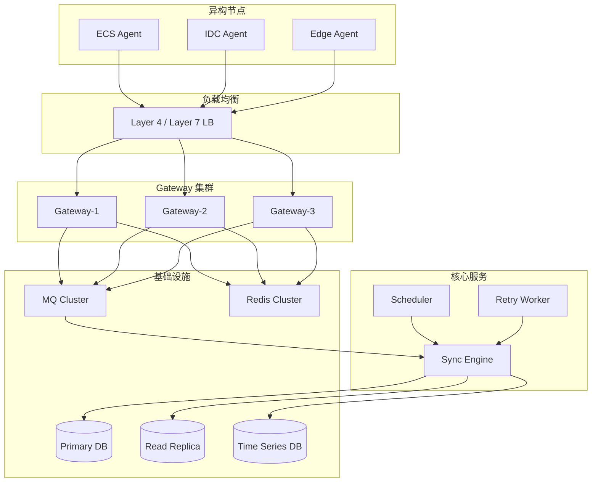

### 15.3 分阶段建设路线

| 阶段      | 建设重点               | 目标     |
| :------ | :----------------- | :----- |
| Phase 1 | Agent 注册、心跳、资产全量上报 | 跑通最小闭环 |
| Phase 2 | 增量同步、版本号、Hash 校验   | 降低同步成本 |
| Phase 3 | 离线队列、任务状态机、重试      | 提升可靠性  |
| Phase 4 | 审计日志、可观测性、告警       | 支持生产排障 |
| Phase 5 | 多租户、权限、安全加固        | 企业级落地  |
| Phase 6 | 灰度发布、插件市场、跨地域同步    | 平台化扩展  |

---

## 16. 常见设计陷阱

### 16.1 使用机器码作为长期主键

机器码、实例 ID、主机名都可能变化，不适合作为系统长期主键。正确做法是首次注册时生成 System UUID，后续所有内部逻辑使用 UUID。

### 16.2 心跳直接写数据库

海量节点每 30 秒写一次数据库，会造成高频写压力。应通过 MQ、Redis、批量落库、时序库进行分层处理。

### 16.3 缺少任务状态机

如果任务只有 success / failed 两种状态，离线、重试、冲突、超时都难以表达。任务状态机越清晰，系统越容易恢复。

### 16.4 缺少幂等设计

网络重试会导致同一个请求被多次提交。如果没有 Task ID 幂等控制，就可能产生重复写入和版本错乱。

### 16.5 只做版本号，不做 Hash

版本号可以判断是否发生变更，但无法保证内容完整性。Hash 可以辅助检测数据损坏、传输异常和异常覆盖。

---

## 17. 总结

Enhanced UISA 的核心思想可以概括为一句话：

> 把异构节点同步问题，从“简单上报数据”升级为“可信身份、可靠任务、增量数据、最终一致、全链路可审计”的基础设施能力。

它通过四层架构实现职责解耦，通过双重身份和签名机制保障安全，通过版本号与 Hash 降低同步成本，通过离线队列与任务状态机解决网络不稳定问题，通过幂等与乐观锁保障一致性，通过审计日志和可观测性支撑生产排障。

对于需要管理大量 ECS、IDC 物理机、边缘节点或混合云资产的平台来说，Enhanced UISA 可以作为一套稳定的通用同步底座。它不仅适用于资产信息同步，也可以进一步扩展到配置分发、命令执行、巡检任务、补丁管理、合规采集等场景。

---

## 附录：核心能力检查清单

| 检查项          | 是否必须 | 说明              |
| :----------- | :--: | :-------------- |
| System UUID  |   是  | 避免业务身份变化导致系统错乱  |
| 短期 Token     |   是  | 降低凭证泄露风险        |
| 请求签名         |   是  | 防止伪造请求          |
| Payload Hash |   是  | 防止数据篡改与损坏       |
| Task ID 幂等   |   是  | 防止重复写入          |
| 乐观锁          |   是  | 防止并发覆盖          |
| 离线队列         |   是  | 节点离线任务不丢失       |
| 任务状态机        |   是  | 支撑恢复、重试与审计      |
| 审计日志         |   是  | 支撑回溯与合规         |
| 可观测性指标       |   是  | 支撑生产排障          |
| MQ 削峰        |  推荐  | 大规模节点场景必须具备     |
| 时序库          |  推荐  | 高频遥测数据建议独立存储    |
| 多租户隔离        |  推荐  | 企业级平台必备         |
| 灰度机制         |  推荐  | Agent 升级与配置下发必备 |
