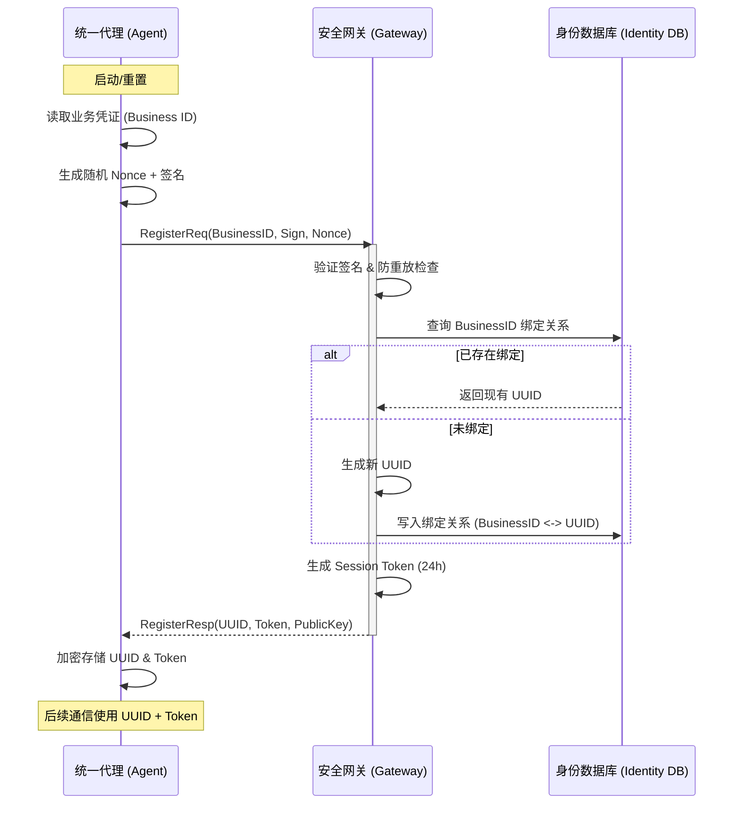
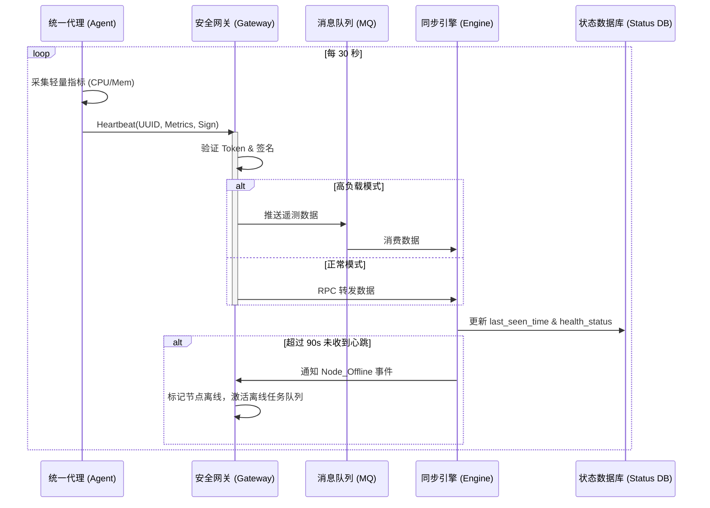
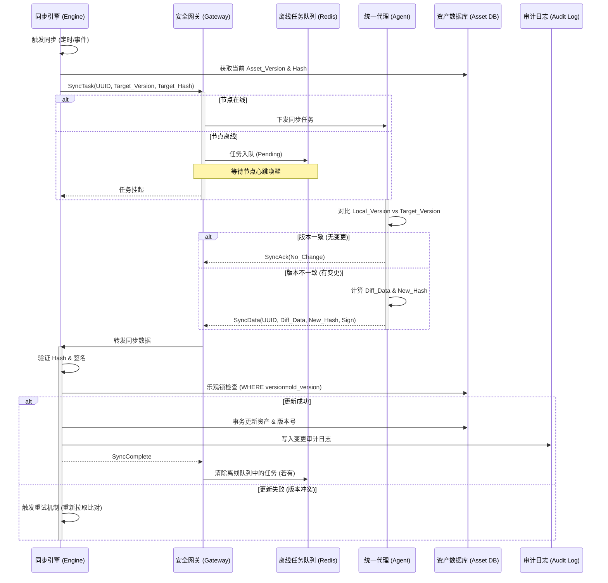
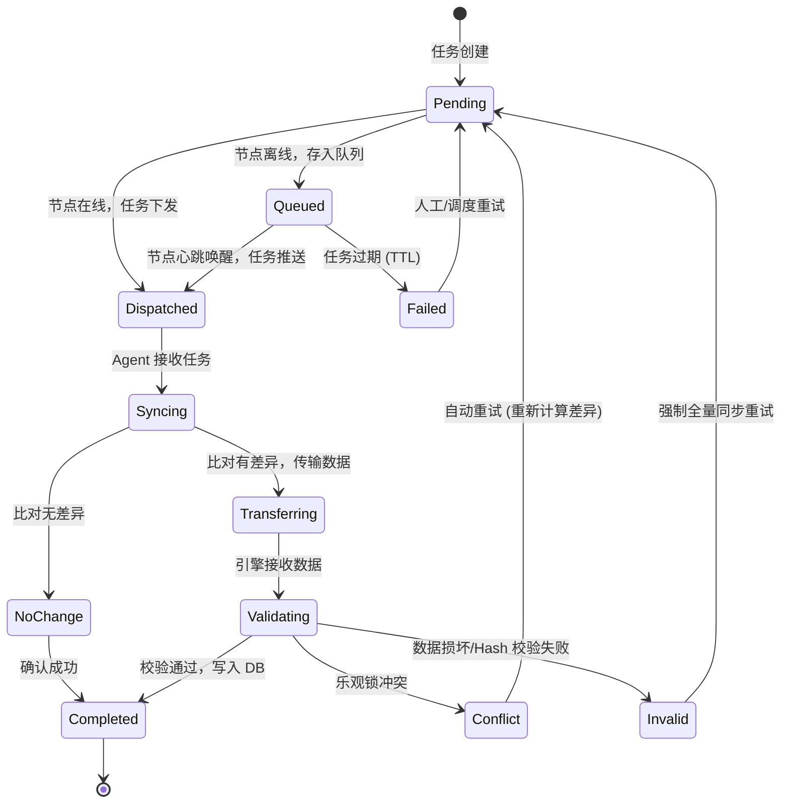

在云原生与混合云架构并行的今天，如何实现海量异构节点（如 ECS 实例、IDC 物理机）的高可靠信息同步，始终是基础设施管理中的核心挑战。传统的同步方案往往在安全性、数据一致性以及处理大规模节点离线场景时显得捉襟见肘。

本方案提出了一套名为 **Enhanced UISA (Enhanced Universal Information Sync Architecture)** 的架构设计。该架构基于 ECS 与物理机同步场景的共性，结合安全性增强、增量同步算法、离线处理逻辑及分布式事务一致性优化点，旨在构建一套高可靠、可扩展的通用信息同步系统底座。

---

## 1. 架构分层视图 (Tiered Architecture)

架构通过分为四层进行解耦，确保了系统的关注点分离与横向扩展能力。

| 层级 | 组件名称 | 核心职责 | 架构优化点体现 |
| :--- | :--- | :--- | :--- |
| **边缘层** | 统一代理 (Unified Agent) | 身份持有、数据采集、指令执行、本地缓存 | 插件化采集、本地版本管理、断点缓存 |
| **接入层** | 安全网关 (Secure Gateway) | 鉴权认证、连接维持、任务队列、协议转换 | 离线任务存储、流量控制、签名验证 |
| **核心层** | 同步引擎 (Sync Engine) | 调度策略、数据比对、差异计算、事务管理 | 增量 Diff 算法、幂等控制、异步解耦 |
| **数据层** | 资产存储 (Asset Store) | 状态存储、资产快照、审计日志、版本库 | 多租户隔离、时序数据分离、版本回溯 |

---

## 2. 核心身份与安全模型

为解决身份伪造与通信安全问题，UISA 彻底废弃了基于静态凭证的明文通信，采用了 **双向认证 + 动态令牌** 机制。

* **双重身份标识**：
    * **业务身份 (Business ID)**：初始凭证（如 User ID 或机器识别码），仅用于首次注册。
    * **系统身份 (System UUID)**：由系统生成的全局唯一标识，注册后生成，用于后续所有业务逻辑与通信。
* **通信安全栈**：
    * **注册阶段**：使用非对称加密或预共享密钥 (PSK) 对业务身份签名校验。
    * **通信阶段**：基于 UUID 分发短期有效 (如 24h) 的 Session Token。所有请求头需携带 `Authorization: Bearer <Token>`。
    * **数据完整性**：关键数据载荷（如资产信息）附加 Payload Hash，配合签名防止中间人篡改。

---

## 3. 核心流程深度解析

### 3.1 安全注册与身份绑定流程 (Secure Registration)
**目标**：建立可信连接，固化系统身份。

1.  **发起请求**：Agent 读取本地业务凭证 (Business ID)，生成随机 Nonce，签名后发送 `RegisterReq` 给网关。
2.  **身份核验**：网关验证签名，并查询业务身份的合法性与绑定关系。
3.  **UUID 分配**：
    * *已存在*：若该业务身份已绑定，复用旧 UUID。
    * *未绑定*：生成新 UUID，写入 `Identity_Map` 表建立绑定关系。
4.  **令牌下发**：网关生成有效期为 24 小时的 Session Token，返回 `RegisterResp(UUID, Token, PublicKey)`。
5.  **本地持久化**：Agent 将 UUID 和 Token 加密存储至本地安全区，后续通信不再使用原始业务身份。

### 3.2 心跳与状态遥测流程 (Heartbeat & Telemetry)
**目标**：实时监控节点存活，实现高频低负载的数据推送。

1.  **数据采集**：Agent 按周期（如 30 秒）采集轻量指标（CPU、内存、网络状态等）。
2.  **签名上报**：Agent 发送携带时间戳、指标和签名的 `Heartbeat` 给网关。
3.  **网关缓冲与转发**：网关验证 Token 与签名。正常模式下通过 RPC 转发至引擎；高负载模式下写入 MQ (如 Kafka/RocketMQ) 削峰填谷。
4.  **状态更新**：同步引擎消费数据，更新数据库中的 `last_seen_time` 和健康状态。
5.  **离线检测**：若超过阈值（如 90 秒）未收到心跳，引擎触发 `Node_Offline` 事件，通知网关将该节点任务挂起并激活离线队列。

### 3.3 资产增量同步流程 (Asset Incremental Sync)
**目标**：确保资产详情一致，最小化数据传输，支持断点续传。

1.  **同步触发**：由引擎调度器发起（定时全量/增量检查）或由事件/用户手动触发。引擎获取当前 `Asset_Version` 与 `Asset_Hash` 并下发任务。
2.  **离线处理**：若节点离线，网关将任务存入 `Pending_Task_Queue`，等待心跳唤醒。
3.  **本地比对 (Agent 侧)**：Agent 对比 `Local_Version` 与 `Target_Version`。
    * *无变更*：返回 `SyncAck(No_Change)`。
    * *有变更*：计算差异数据 `Diff_Data` 和 `New_Hash`，回传给网关。
4.  **差异合并 (Engine 侧)**：引擎验证 Hash 与签名，进行乐观锁预检查（确保版本未被并发修改）。
5.  **事务写入**：开启事务 -> 更新资产及版本号 -> 写入审计日志 -> 提交事务 -> 确认完成。若冲突则触发重试。

---

## 4. 关键机制设计

### 4.1 增量比对算法 (Diff Algorithm)
为实现毫秒级的响应与最小化传输，UISA 采用**“版本号 + 指纹哈希”**双重校验机制：
* **数据模型**：每个资产对象包含 `version` (整数) 和 `content_hash` (MD5/SHA256)。
* **快速比对**：Agent 侧若发现 `Agent_Version == DB_Version`，则直接判定无变更；若大于，则计算变更集合。
* **大字段优化**：对于大容量资产（如软件包列表），仅比对 `List_Hash`。即便版本号不同，若 Hash 一致也不传输具体数据内容。
* **合并策略**：中心侧采用 UPSERT 策略，基于唯一键（UUID + 资产类型 + 资产内部 ID）进行数据的更新或插入。

### 4.2 离线任务队列 (Offline Task Queue)
针对网络波动导致的“短暂失联”，网关内存或 Redis 中维护了映射结构 `Map<UUID, List<Task>>`。
* **入队与出队**：下发任务遇节点离线时入队。节点心跳恢复时，网关检查队列，通过“心跳带回”或新建连接即时下发，执行成功后移除。
* **过期策略**：任务带有 TTL（如 7 天），过期未执行标记为失败，交由中心决定重试或放弃。

### 4.3 数据一致性保障 (Consistency Guarantee)
确保数据库与真实资产状态的最终一致性：
* **幂等设计**：每个任务携带全局唯一的 `Task_ID`。数据库记录 `Processed_Task_IDs`，重复收到同一任务直接返回成功，不重复写入。
* **乐观锁**：利用数据库资产表的 `version` 字段。更新语句如：`UPDATE assets SET data=?, version=version+1 WHERE uuid=? AND version=old_version`。若影响行数为 0，说明发生并发修改，触发重试。
* **审计日志**：所有变更（UPDATE/CREATE/DELETE）写入 `Asset_Audit_Log` 表，保留变更前后的全量快照，支持故障回溯与任意时间点数据修复。

---

## 5. 任务状态流转图 (State Machine)

同步任务在系统中并非简单的成功或失败，而是经历了一系列精密的状态迁转：

---

## 6. 核心数据模型定义 (Core Data Models)

为支撑上述高可靠流程，底层数据库需包含以下核心表结构定义（简化版）：

* **节点身份表 (`node_identity`)**
    * `uuid` (PK): 系统唯一标识
    * `business_id`: 业务身份 (UserID/识别码)
    * `public_key`: 用于验证签名
    * `status`: 在线/离线/禁用
* **资产信息表 (`asset_info`)**
    * `uuid` (FK): 关联节点
    * `asset_type`: 类型 (CPU/Disk/Software...)
    * `asset_key`: 资产内部唯一键 (如磁盘序列号)
    * `content`: JSON 存储详细数据
    * `version`: 版本号 (用于增量控制)
    * `content_hash`: 内容指纹 (用于快速比对)
    * `update_time`: 最后更新时间
* **同步任务表 (`sync_task`)**
    * `task_id` (PK): 任务唯一标识
    * `uuid`: 目标节点
    * `type`: 全量/增量
    * `status`: pending/success/failed
    * `retry_count`: 重试次数
* **审计日志表 (`asset_audit_log`)**
    * `log_id` (PK)
    * `uuid`: 关联节点
    * `action`: UPDATE/CREATE/DELETE
    * `diff_detail`: 变更详情快照
    * `operator`: 触发者 (System/User)

---

## 7. 异常处理与容灾 (Disaster Recovery & Exceptions)

| 异常场景 | 检测机制 | 处理策略 |
| :--- | :--- | :--- |
| **网络中断** | 心跳超时 / RPC 失败 | 网关启用离线队列；引擎侧任务标记为 Pending 等待重试。 |
| **数据冲突** | 数据库乐观锁失败 | 引擎自动重新拉取最新数据，重新计算差异，发起二次同步。 |
| **Agent 崩溃** | 心跳丢失 | 标记节点离线；待恢复后，Agent 主动请求“未完成任务列表”。 |
| **网关宕机** | 健康检查失败 | 负载均衡切换至备用网关；UUID 会话状态需共享存储 (如 Redis) 以支持漂移。 |
| **数据损坏** | Hash 校验失败 | 丢弃该包，记录安全日志，强制触发一次全量同步请求。 |

---

### 结语

Enhanced UISA 架构的设计哲学在于**“假设失败”**。通过引入版本控制、离线队列、幂等事务及安全认证机制，它不仅解决了异构场景下的资产同步难题、数据一致性风险及离线同步丢失问题，更为基础设施管理的标准化提供了坚实的底座。本架构已在多个生产级混合云环境中得到验证，对于追求极致一致性与海量接入能力的团队具有极高的参考价值。