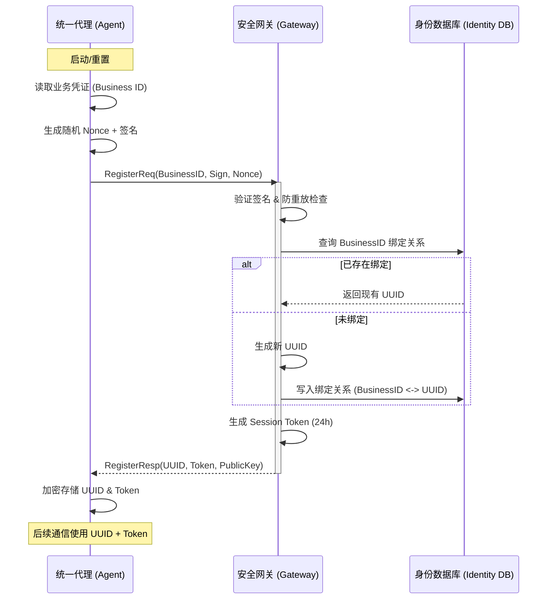
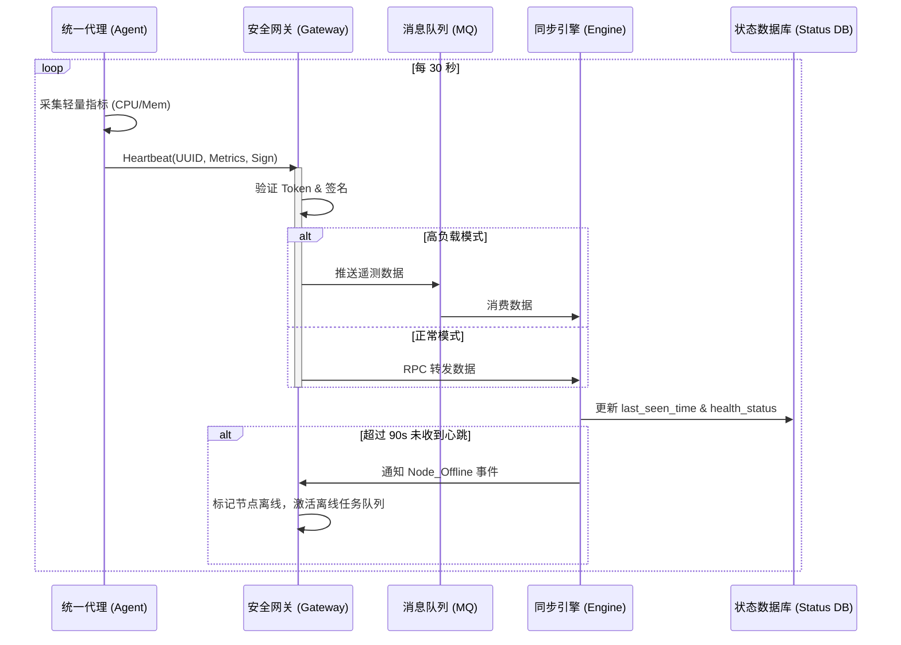
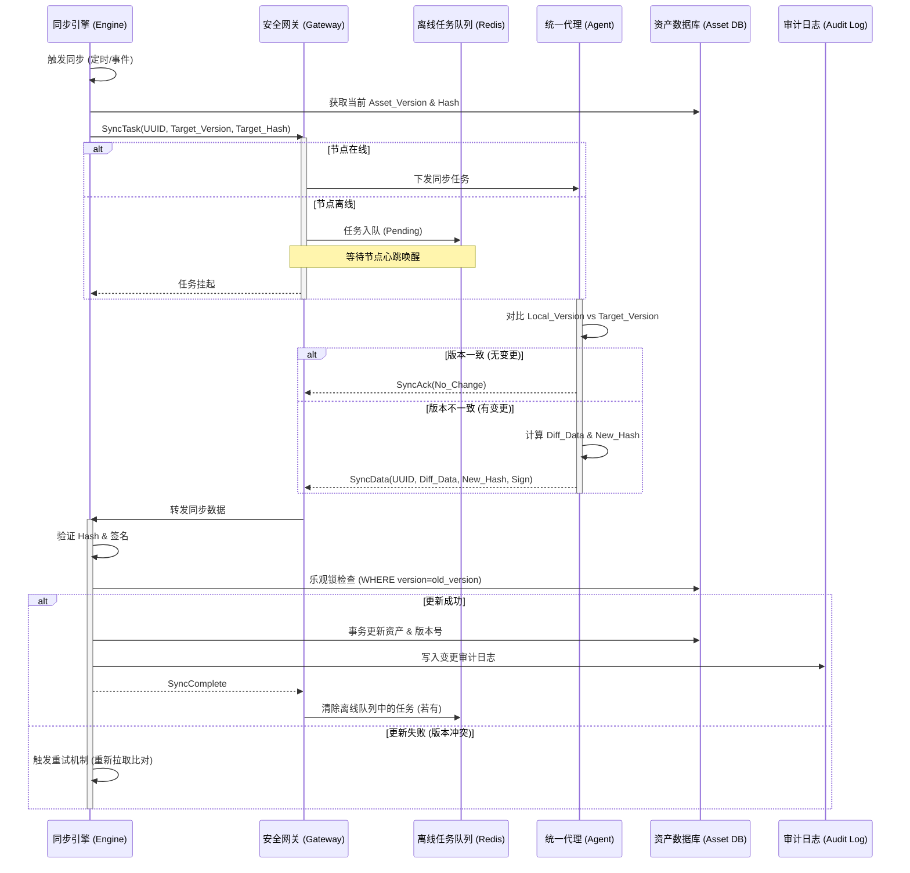
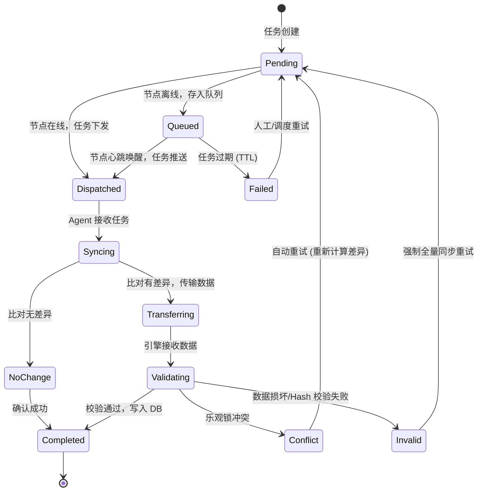

在云原生与混合云架构并行的今天，如何实现海量异构节点（如 ECS 实例、IDC 物理机）的高可靠信息同步，始终是基础设施管理中的核心挑战。传统的同步方案往往在安全性、数据一致性以及处理大规模节点离线场景时显得捉襟见肘。

本方案提出了一套名为 **Enhanced UISA (Enhanced Universal Information Sync Architecture)** 的架构设计。该架构基于 ECS 与物理机同步场景的共性，结合安全性增强、增量同步算法、离线处理逻辑及分布式事务一致性，旨在构建一套高可靠、可扩展的通用信息同步系统。

## 1. 架构分层视图 (Tiered Architecture)

架构通过分层解耦，确保了系统的横向扩展能力与关注点分离。

| 层级 | 组件名称 | 核心职责 | 架构优化点 |
| :--- | :--- | :--- | :--- |
| **边缘层** | 统一代理 (Agent) | 身份持有、数据采集、指令执行、本地缓存 | 插件化采集、本地版本管理、断点缓存 |
| **接入层** | 安全网关 (Gateway) | 鉴权认证、连接维持、任务队列、协议转换 | 离线任务存储、流量控制、签名验证 |
| **核心层** | 同步引擎 (Engine) | 调度策略、数据比对、差异计算、事务管理 | 增量 Diff 算法、幂等控制、异步解耦 |
| **数据层** | 资产存储 (Store) | 状态存储、资产快照、审计日志、版本库 | 多租户隔离、时序数据分离、版本回溯 |

## 2. 核心身份与安全模型

为解决身份伪造与通信安全问题，UISA 采用了 **双向认证 + 动态令牌** 机制，彻底废弃了基于静态凭证的明文通信。

*   **双重身份标识**：
    *   **业务身份 (Business ID)**：初始凭证（如 User ID 或机器识别码），仅用于首次注册。
    *   **系统身份 (System UUID)**：由系统生成的全局唯一标识，用于后续所有业务逻辑。
*   **通信安全栈**：
    *   **注册阶段**：使用非对称加密对业务身份签名校验。
    *   **通信阶段**：分发短期 Session Token (Bearer)，配合 Payload Hash 防止中间人篡改。

## 3. 核心流程深度解析

### 3.1 安全注册与身份绑定

建立可信连接的第一步是固化系统身份。Agent 在启动时通过非对称加密算法证明其业务身份的合法性，并获取长期的 UUID。

### 3.2 心跳与状态遥测

高频、低负载的状态监测是感知系统健康度的关键。网关通过异步化处理（如引入 MQ）来支撑海量连接。

### 3.3 资产增量同步 (Core Logic)

这是整个架构中最具技术含量的部分。通过“版本号 + 指纹哈希”双重校验，实现了数据传输的最小化。

## 4. 关键机制设计

### 4.1 增量比对算法 (Diff Algorithm)
为实现毫秒级的同步响应，UISA 采用两段式校验：
1.  **版本校验**：快速排除无变更的节点。
2.  **指纹校验 (Content Hash)**：对于大容量资产（如软件包列表），仅比对内容指纹，只有指纹不匹配时才传输具体数据。

### 4.2 离线任务队列 (Offline Queue)
针对网络波动导致的“短暂失联”，网关层维护了一个带 TTL 的任务队列。当节点心跳恢复时，网关通过“心跳带回”或“即时下发”方式优先清除积压任务。

### 4.3 数据一致性保证
*   **幂等设计**：每个任务携带全局唯一的 `Task_ID`。
*   **乐观锁**：利用数据库版本号（Version）确保在并发更新时不会发生数据覆盖。
*   **审计日志**：保留变更前后的全量快照，支持任意时间点的资产回溯。

## 5. 任务状态流转图 (State Machine)

同步任务在系统中并非简单的成功或失败，而是经历了一系列精密的状态迁转：

## 结语

Enhanced UISA 架构的设计哲学在于“假设失败”。通过引入中间层的异步队列与严格的数据校验，它不仅解决了异构场景下的资产同步难题，更为基础设施管理的标准化提供了坚实的底座。

---
**作者注**：本架构设计已在多个生产级混合云环境中得到验证。对于追求极致一致性与海量接入能力的团队，UISA 提供了一个极具参考价值的基准模型。
