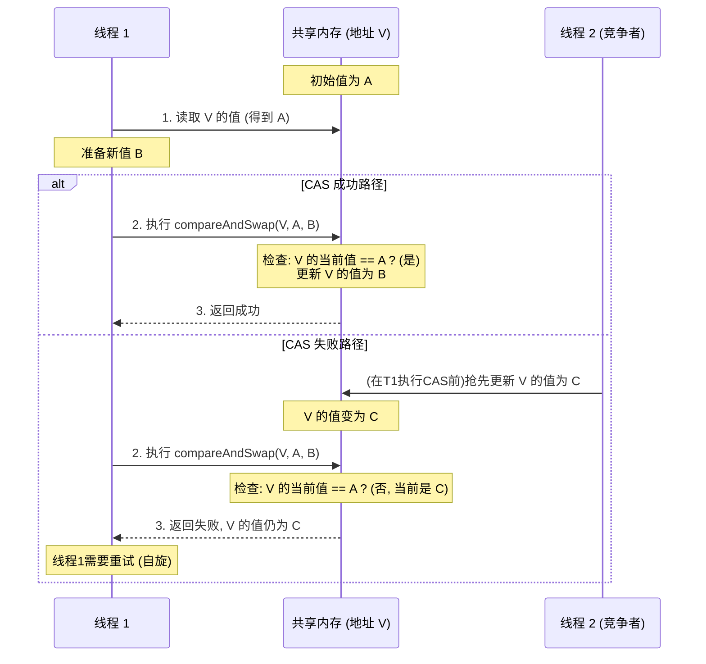
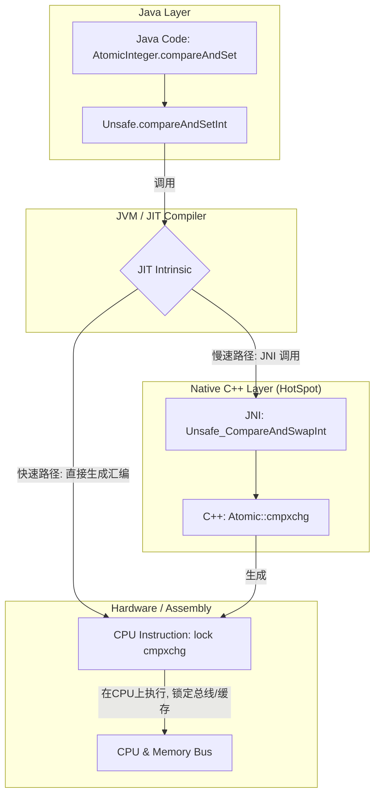
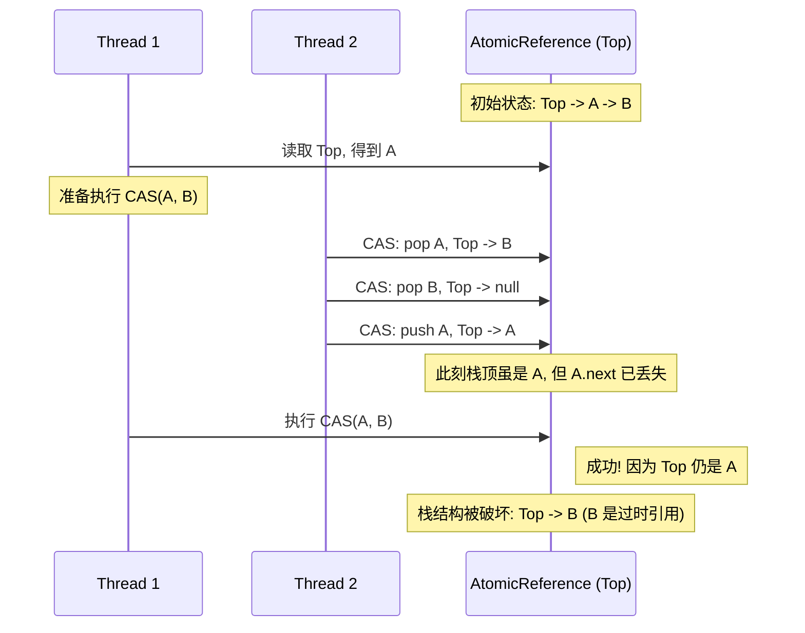
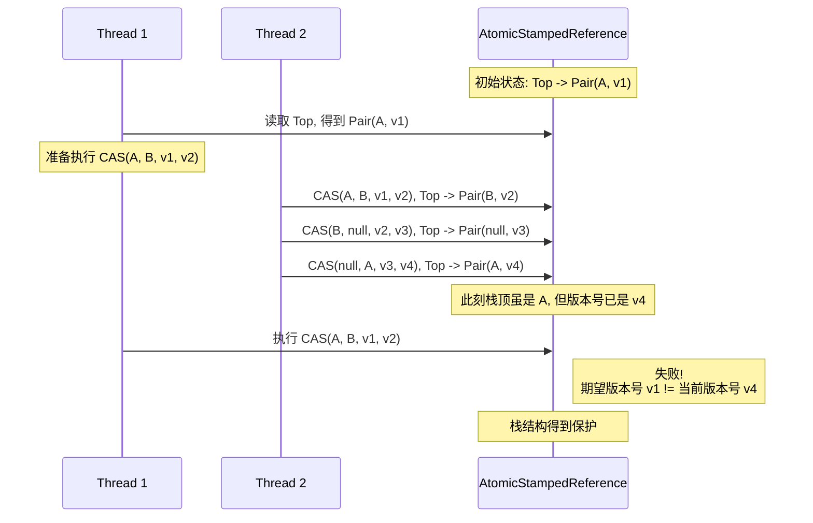

在并发编程中，确保数据一致性是一项关键挑战。虽然传统的锁机制（如 `synchronized` 或 `Lock`）提供了一种直接的解决方案，但它们本质上是悲观的，在高并发场景下，因线程阻塞和上下文切换而导致的性能开销不容忽视。

本文将深入探讨"比较并交换"（Compare-And-Swap, CAS），这是一种乐观的、非阻塞的算法，它构成了 Java `java.util.concurrent.atomic` 包中许多类的核心基础。

## 1. CAS 原理介绍

CAS（Compare-And-Swap）是一条 CPU 并发原语，其操作过程是原子的。它的功能是：检查内存中某个位置的值是否与预期值相等，如果相等，则将其更新为新值。

该操作涉及三个核心操作数：

1.  **V**：要更新的变量的内存地址。
2.  **A**：预期的旧值 (Expected Value)。
3.  **B**：计划更新的新值 (New Value)。

CAS 的执行逻辑可以概括为：仅当内存地址 V 处的值等于预期值 A 时，才将该位置的值更新为 B。否则，不执行任何操作。无论更新成功与否，操作都会返回 V 位置的当前值。这个"比较并更新"的过程由硬件直接支持（例如 x86 架构的 `cmpxchg` 指令），确保了其在多处理器环境下的原子性。

以下伪代码可以帮助理解其逻辑：

```java
// V: 内存值, A: 预期值, B: 新值
public boolean compareAndSwap(V, A, B) {
    // 这是一个原子操作
    if (V == A) {
        V = B;
        return true;
    } else {
        return false;
    }
}
```

作为一种乐观的非阻塞算法，CAS 允许线程在操作共享变量时无需挂起。如果操作失败，线程会收到通知，并可以基于此决定后续策略，通常是采用自旋（循环重试）方式，直至成功。



## 2. Unsafe 类详解

要理解 Java 中的 CAS，就必须分析 `sun.misc.Unsafe` 这个类。尽管它不属于标准的 Java API，但它是许多高性能并发框架（包括 JUC 原子类）的基石。

`Unsafe` 提供了硬件级别的原子操作，允许 Java 代码直接对内存进行操作。正是由于其"不安全"的特性，JDK 并不建议开发者直接使用。

### 获取 `Unsafe` 实例

`Unsafe` 的构造函数是私有的，且 `getUnsafe()` 方法会对调用者的类加载器进行检查，因此无法直接实例化。然而，可以通过反射机制获取其实例：

```java
import sun.misc.Unsafe;
import java.lang.reflect.Field;

public class UnsafeAccessor {

    private static final Unsafe unsafe;

    static {
        try {
            Field theUnsafe = Unsafe.class.getDeclaredField("theUnsafe");
            theUnsafe.setAccessible(true);
            unsafe = (Unsafe) theUnsafe.get(null);
        } catch (NoSuchFieldException | IllegalAccessException e) {
            throw new Error("Failed to get unsafe instance", e);
        }
    }

    public static Unsafe getUnsafe() {
        return unsafe;
    }
}
```

### `Unsafe` 中的 CAS 方法

`Unsafe` 提供了针对不同数据类型的 `compareAndSwap*` 方法：

- `compareAndSwapObject(Object o, long offset, Object expected, Object x)`: 针对对象引用的 CAS。
- `compareAndSwapInt(Object o, long offset, int expected, int x)`: 针对 `int` 类型字段的 CAS。
- `compareAndSwapLong(Object o, long offset, long expected, long x)`: 针对 `long` 类型字段的 CAS。

参数 `offset` 指的是字段在对象内存布局中的偏移量，可以通过 `objectFieldOffset(Field f)` 方法获得。

### Unsafe CAS 的三层实现深度剖析

Java 中的一个 CAS 操作，看似简单，实则经历了从 Java 层到 JVM C++ 层，最终到硬件汇编指令的层层递进。下面我们就来逐层拆解这个过程。

#### 第一层：Java - `AtomicInteger` 的视角

我们常用的 `AtomicInteger` 类是理解 CAS 应用的最佳入口。它的核心方法 `compareAndSet` 就是对 `Unsafe` 的一层薄封装。

```java
// AtomicInteger.java (JDK 源码)
public class AtomicInteger extends Number implements java.io.Serializable {
    private static final Unsafe unsafe = Unsafe.getUnsafe();
    private static final long valueOffset;

    static {
        try {
            // 获取'value'字段在AtomicInteger对象内存布局中的偏移量
            valueOffset = unsafe.objectFieldOffset
                (AtomicInteger.class.getDeclaredField("value"));
        } catch (Exception ex) { throw new Error(ex); }
    }

    private volatile int value;

    public final boolean compareAndSet(int expect, int update) {
        // 直接调用Unsafe的CAS原生方法
        return unsafe.compareAndSetInt(this, valueOffset, expect, update);
    }
    // ... 其他方法
}
```

- `valueOffset`: 这是一个关键的静态常量。它通过 `unsafe.objectFieldOffset` 在类加载时被计算出来，代表 `value` 字段相对于 `AtomicInteger` 对象起始地址的内存偏移量。有了这个偏移量，`Unsafe` 就可以像 C/C++ 中的指针一样，精确定位到要操作的内存位置。
- `compareAndSet`: 此方法直接将参数透传给 `unsafe.compareAndSetInt`。`this` 参数告诉 Unsafe 要操作哪个对象，`valueOffset` 提供了字段的精确地址，`expect` 和 `update` 则是 CAS 的核心参数。

#### 第二层：C++ (HotSpot JVM) - JNI 与 Intrinsic

`Unsafe` 的方法大多是 `native` 的，这意味着它们的实现不在 Java 层，而在 JVM 的 C++ 源码中。这里存在两条路径：

1.  **JNI 调用 (慢速路径)**: 在解释执行模式或 JIT 未优化的场景下，Java 调用会通过 Java Native Interface (JNI) 进入到 HotSpot 的 C++ 世界。其调用链大致为：`Java_sun_misc_Unsafe_compareAndSwapInt` (位于 `hotspot/src/share/vm/prims/unsafe.cpp`) -> `Atomic::cmpxchg` (位于 `hotspot/src/share/vm/runtime/atomic.hpp`)。

2.  **JIT Intrinsic (快速路径)**: 这是性能的关键。对于 `Unsafe` 的 CAS 方法这类高频、关键的操作，HotSpot 的 JIT 编译器（特别是 C2）会将其识别为"内在函数 (Intrinsic)"。JIT 不会生成 JNI 调用代码，而是直接在编译后的代码中嵌入与平台相关的、高效的汇编指令。这完全消除了 JNI 的开销。相关定义可以在 `hotspot/src/share/vm/opto/library_call.cpp` 中找到。

下面这张图清晰地展示了这两条路径的分野：



#### 第三层：汇编 - `lock cmpxchg` 原子指令

无论走哪条路径，最终在 x86/x64 架构的 CPU 上执行的都是一条核心汇编指令：`lock cmpxchg`。

- **`cmpxchg destination, source`**: 这条指令是"比较并交换"的核心。它隐式地使用 `EAX` 寄存器（或 `AX`/`AL`/`RAX`）作为"期望值"的载体。

  - **工作流程**: 1. 比较 `EAX` 寄存器中的值与 `destination` 内存地址中的值。 2. 如果相等（比较成功），则将 `source` 寄存器中的值写入 `destination` 内存地址，并设置 CPU 的零标志位（ZF=1）。 3. 如果不相等（比较失败），则将 `destination` 内存地址中的值加载到 `EAX` 寄存器，并清除零标志位（ZF=0）。
  - 这套机制与 Java CAS 的 `(V, A, B)` 三元组完美对应：`destination` 是 `V`，`EAX` 里的初始值是 `A`，`source` 是 `B`。

- **`lock` 前缀**: 这不是一条独立的指令，而是加在 `cmpxchg` 前面的一个前缀，用于保证操作的原子性。在多核时代，它的作用至关重要：
  - **保证原子性**: 它确保 `cmpxchg` 在执行期间，其他处理器不能访问这块内存。
  - **缓存锁定 (Cache Locking)**: 在现代 CPU 中，`lock` 通常不会锁定整个系统总线，而是实现更高效的"缓存锁定"。它会锁定包含目标内存地址的缓存行，在指令执行期间，其他核心可以继续访问其他内存地址，但不能访问被锁定的缓存行。只有当操作的内存跨越多个缓存行，或者该内存区域不支持缓存锁定时，才会降级为成本更高的总线锁定。
  - **内存屏障**: `lock` 前缀本身就是一个 full memory barrier（全功能内存屏障），它会清空和刷新处理器的写缓冲，并确保其后的读写操作不会被重排到 `lock` 操作之前，这保证了 `volatile` 语义的实现。

因此，Java 中一行简单的 `compareAndSet` 调用，其背后是 JIT 编译器、JVM C++ 实现和 CPU 硬件指令集层层协作的结果，最终由一条 `lock`-前缀的汇编指令，以极高的效率和安全性完成了这个原子操作。

**示例：**

下面是一个使用 `Unsafe` 实现原子计数器的例子：

```java
public class UnsafeCounter {
    private volatile int value = 0;
    private static final Unsafe unsafe = UnsafeAccessor.getUnsafe();
    private static final long valueOffset;

    static {
        try {
            valueOffset = unsafe.objectFieldOffset(UnsafeCounter.class.getDeclaredField("value"));
        } catch (NoSuchFieldException e) {
            throw new Error(e);
        }
    }

    public void increment() {
        int current;
        do {
            current = unsafe.getIntVolatile(this, valueOffset); // 获取当前值
        } while (!unsafe.compareAndSwapInt(this, valueOffset, current, current + 1)); // CAS更新
    }

    public int get() {
        return value;
    }
}
```

`increment` 方法通过一个 `do-while` 循环持续尝试更新 `value`。它首先获取当前值，然后通过 CAS 尝试将其加一。如果更新失败（意味着 `value` 已被其他线程修改），循环将继续，重新获取最新值并再次尝试，这便是典型的 CAS 自旋。

## 3. CAS 之 AtomicReference 深度剖析

直接使用 `Unsafe` 功能强大但过于底层且缺乏类型安全。为此，JDK 在 `java.util.concurrent.atomic` 包中提供了一系列高级抽象，其中 `AtomicReference` 是用于对引用类型进行原子操作的核心工具。

### 内部实现揭秘

与 `AtomicInteger` 类似，`AtomicReference` 本质上也是对 `Unsafe` 的一层安全、带泛型的封装。

```java
// AtomicReference.java (JDK 源码)
public class AtomicReference<V> implements java.io.Serializable {
    private static final Unsafe unsafe = Unsafe.getUnsafe();
    private static final long valueOffset;

    static {
        try {
            // 获取 'value' 字段在 AtomicReference 对象内存布局中的偏移量
            valueOffset = unsafe.objectFieldOffset
                (AtomicReference.class.getDeclaredField("value"));
        } catch (Exception ex) { throw new Error(ex); }
    }

    // 注意这里的 'volatile' 关键字！
    private volatile V value;

    public AtomicReference(V initialValue) {
        value = initialValue;
    }

    public final boolean compareAndSet(V expect, V update) {
        // 调用 Unsafe 的 compareAndSwapObject 方法
        return unsafe.compareAndSwapObject(this, valueOffset, expect, update);
    }
    // ...
}
```

从源码中，我们可以看到两个关键点：

1.  **`Unsafe.compareAndSwapObject`**: 所有的原子性保证都来自于底层 `Unsafe` 的 `compareAndSwapObject` (在 JDK 9 以后更名为 `compareAndSetObject`)。这与 `compareAndSetInt` 类似，最终都依赖于硬件的 `lock cmpxchg` 指令。
2.  **`volatile V value`**: 这是保证 **可见性** 的关键。`volatile` 关键字确保了对 `value` 字段的任何写操作都会立即被刷新到主内存，并且任何读操作都会从主内存中读取。这遵循 Java 内存模型（JMM）的 happens-before 原则，保证了一个线程对 `AtomicReference` 的修改对其他线程立即可见。**`volatile` 保证可见性，`Unsafe` (CAS) 保证原子性**，两者结合，才构成了 `AtomicReference` 完整的线程安全性。

### 核心用途：线程安全的延迟初始化

`AtomicReference` 的一个经典应用场景是实现线程安全的单例或昂贵资源的延迟初始化。相比于使用 `synchronized` 的双重检查锁定（DCL），使用 `AtomicReference` 的代码更简洁且优雅。

```java
public class ExpensiveResource {
    private ExpensiveResource() {
        // 模拟资源初始化耗时
        System.out.println("ExpensiveResource is being created...");
        try { Thread.sleep(1000); } catch (InterruptedException e) {}
    }

    // 使用 AtomicReference 来持有单例实例
    private static final AtomicReference<ExpensiveResource> instanceRef = new AtomicReference<>();

    public static ExpensiveResource getInstance() {
        // 先检查实例是否存在，大多数情况下这里的读操作无竞争，性能很高
        ExpensiveResource instance = instanceRef.get();
        if (instance == null) {
            // 实例不存在，才尝试创建并设置
            // 创建一个新的实例（这步操作在临界区之外，不影响其他线程）
            ExpensiveResource newInstance = new ExpensiveResource();
            // 使用 CAS 原子地设置引用，只有一个线程会成功
            if (instanceRef.compareAndSet(null, newInstance)) {
                // CAS 成功的线程，使用它自己创建的实例
                instance = newInstance;
            } else {
                // CAS 失败的线程，说明有其他线程已经抢先设置成功
                // 直接获取已设置好的实例即可
                instance = instanceRef.get();
            }
        }
        return instance;
    }
}
```

这个模式的优点在于，只有在实例未被创建时（`instance == null`）才会有多个线程进入同步逻辑，并且同步是通过无锁的 CAS 操作完成的，避免了 `synchronized` 可能带来的线程阻塞和上下文切换。一旦实例被创建，后续所有对 `getInstance()` 的调用都只会执行一次 `instanceRef.get()`，这是一个无锁、高性能的 `volatile` 读操作。

### 高级方法解析

除了 `compareAndSet`，`AtomicReference` 还提供了一些其他有用的原子方法：

- **`getAndSet(V newValue)`**: 原子地将引用设置为 `newValue`，并返回旧的值。这个操作可以看作一个 "先 get 再 set" 的原子捆绑。
- **`lazySet(V newValue)`**: 这是一个为极致性能优化而生的方法。它最终会将值设置为 `newValue`，但不保证该变更对其他线程的立即可见性。`lazySet` 只保证在本线程内，后续的读写操作不会被重排序到它前面，但它省略了昂贵的内存屏障指令，因此无法保证其他线程能多快看到这个更新。它适用于对数据可见性要求不那么严格，可以容忍短暂延迟的场景，例如更新统计数据、调试信息等，通过牺牲部分可见性来换取更高的吞吐量。

## 4. CAS 之手写自旋锁与深度解析

掌握了 CAS 的原理，我们便可以构建更复杂的同步原语，例如自旋锁。自旋锁是一种非阻塞锁，线程在获取锁失败时不会被挂起，而是在循环中持续尝试获取锁，即"自旋"。

该方法适用于锁占用时间短、竞争不激烈的场景，因为它避免了线程上下文切换的开销。

### 基础自旋锁实现

以下是一个基于 `AtomicReference` 实现的简单自旋锁：

```java
import java.util.concurrent.atomic.AtomicReference;

public class SpinLock {
    private final AtomicReference<Thread> owner = new AtomicReference<>();

    public void lock() {
        Thread currentThread = Thread.currentThread();
        // 当锁未被持有时（owner为null），尝试将owner设为当前线程
        // 若设置失败，则表示锁已被其他线程持有，继续自旋
        while (!owner.compareAndSet(null, currentThread)) {
            // 自旋等待
        }
    }

    public void unlock() {
        Thread currentThread = Thread.currentThread();
        // 仅持有锁的线程能够释放锁
        // 此处无需CAS，因为正常情况下只有持有者线程会调用unlock
        // 但为了严谨，防止非持有者错误调用，CAS会更安全
        owner.compareAndSet(currentThread, null);
    }
}
```

### 深度解析与改进

上面的基础实现虽然简洁，但在实际应用中存在一些关键问题：

1.  **不可重入 (Non-Reentrant)**: 这是最严重的问题。如果一个已经持有锁的线程再次尝试调用 `lock()` 方法，它会发现 `owner` 已经被设置为自己，`compareAndSet(null, currentThread)` 会永远失败，导致线程无限自旋，形成死锁。

2.  **CPU 消耗过高**: 在高竞争下，失败的线程会进入一个空的 `while` 循环（忙等待），这会持续占用 CPU 核心，造成性能浪费，甚至影响其他线程的执行。在 Java 9 之后，可以调用 `Thread.onSpinWait()` 来提示 JVM 该线程正在自旋，JVM 可能会进行一些优化（例如在 x86 平台上插入 `PAUSE` 指令）来降低功耗和提高性能。

3.  **公平性问题**: 这是一个非公平锁。等待锁的线程们相互竞争，任何线程都有可能在下一次循环中获得锁，这可能导致某些线程长时间等待，即"线程饥饿"。实现公平的自旋锁需要更复杂的机制（如排队）。

### 实现可重入的自旋锁

为了解决不可重入的问题，我们需要在锁中记录持有锁的线程以及该线程重入的次数。

```java
import java.util.concurrent.atomic.AtomicReference;

public class ReentrantSpinLock {
    private final AtomicReference<Thread> owner = new AtomicReference<>();
    private int recursionCount = 0;

    public void lock() {
        Thread currentThread = Thread.currentThread();
        // 如果锁的持有者是当前线程，则增加重入计数，然后直接返回
        if (owner.get() == currentThread) {
            recursionCount++;
            return;
        }

        // 循环尝试获取锁
        while (!owner.compareAndSet(null, currentThread)) {
            // 提示JVM，当前线程正在自旋等待，可能会有性能优化
            Thread.onSpinWait();
        }
        // 第一次获取锁，设置重入计数为1
        recursionCount = 1;
    }

    public void unlock() {
        Thread currentThread = Thread.currentThread();
        // 检查当前线程是否为锁的持有者
        if (owner.get() == currentThread) {
            recursionCount--;
            // 如果重入计数归零，则表示锁已完全释放，此时可以清空owner
            if (recursionCount == 0) {
                // 此处无需CAS，因为这是在锁的临界区内，只有持有者线程能访问
                owner.set(null);
            }
        } else {
            // 如果一个非持有者线程尝试解锁，可以考虑抛出异常，如IllegalMonitorStateException
            // throw new IllegalMonitorStateException("Calling thread is not the lock owner");
        }
    }
}
```

在这个改进版本中：

- `lock()` 方法首先检查当前线程是否已经是锁的持有者。如果是，则简单地增加 `recursionCount` 并返回，实现了锁的重入。
- `unlock()` 方法会递减计数器。只有当计数器减到 0 时，才表示最外层的锁被释放，此时才会真正将 `owner` 设置为 `null`，让其他线程有机会获取锁。
- 值得注意的是，对 `recursionCount` 的访问不需要额外的同步措施，因为对它的所有修改都发生在成功获取锁之后和释放锁之前的代码路径中，这块区域本身就是线程安全的临界区。

这个 `ReentrantSpinLock` 为我们展示了如何基于简单的 CAS 构建更复杂的并发原语，是深入理解并发控制的绝佳案例。

### 实现公平的自旋锁：Ticket Lock

前面提到的自旋锁都是非公平的，这意味着后来的线程有可能"插队"，先于等待已久的线程获得锁。为了实现公平性，我们可以借鉴银行排队叫号的思路，实现一种名为"Ticket Lock"的公平自旋锁。

**工作原理**：

1.  锁内部维护两个原子整型变量：`ticketNum` (票号分发器) 和 `serviceNum` (服务叫号器)。
2.  **获取锁 (lock)**：线程到来时，原子地将 `ticketNum` 加一，获得一个唯一的、递增的票号 (myTicket)。然后，它开始自旋，不断检查 `serviceNum` 的当前值是否等于自己的票号 `myTicket`。只有当轮到自己时，循环才会结束，表示获取锁成功。
3.  **释放锁 (unlock)**：持有锁的线程完成工作后，原子地将 `serviceNum` 加一。这相当于叫下一个号，从而唤醒正在等待那个票号的线程。

```java
import java.util.concurrent.atomic.AtomicInteger;

public class TicketLock {
    // 票号分发器
    private final AtomicInteger ticketNum = new AtomicInteger(0);
    // 服务叫号器
    private final AtomicInteger serviceNum = new AtomicInteger(0);

    public int lock() {
        // 原子地获取一个唯一的票号
        final int myTicket = ticketNum.getAndIncrement();

        // 当服务号不等于我的票号时，自旋等待
        while (serviceNum.get() != myTicket) {
            // 提示JVM，当前线程正在自旋
            Thread.onSpinWait();
        }

        // 返回我的票号，可以用于调试或记录
        return myTicket;
    }

    public void unlock(int myTicket) {
        // 只有当前持有锁的线程（即 serviceNum == myTicket 的线程）
        // 才能成功释放锁。这里简单地将服务号+1，让下一个线程获得锁。
        // 在更严格的实现中，可以要求传入票号进行验证。
        serviceNum.compareAndSet(myTicket, myTicket + 1);
    }
}
```

**公平性保证**：由于 `ticketNum` 是通过 `getAndIncrement` 原子递增的，每个线程都会获得一个唯一的、严格按到达顺序分配的票号。而 `serviceNum` 也是严格递增的，确保了服务（即锁的授予）是按照票号顺序进行的。这种先进先出 (FIFO) 的机制，从根本上保证了锁的公平性，杜绝了线程饥饿现象。

## 5. CAS 缺点深度剖析

尽管 CAS 功能强大且是无锁编程的基石，但它并非银弹。开发者必须深刻理解其固有的三大缺点，才能在实践中扬长避短。

### 1. ABA 问题：值的"貌合神离"

这是 CAS 最经典的问题。如果一个变量的值从 A 变为 B，再变回 A，CAS 在检查时会误认为该值没有发生变化，但实际上它已经被修改过。在多数情况下这无伤大雅，但在某些场景下，这会导致致命的错误。

**一个危险的实例：无锁栈**

想象一个无锁栈，其 `top` 节点通过 `AtomicReference` 维护。

1.  线程 T1 准备出栈。它读取当前 `top` 指向节点 A，并准备通过 CAS 将 `top` 指向 A 的下一个节点 `next(A)`。
2.  此时，线程 T2 介入。它连续执行了三次操作：
    a. 出栈，弹出节点 A。
    b. 出栈，弹出节点 `next(A)`。
    c. 入栈，将之前弹出的节点 A 重新入栈。
3.  现在，`top` 指针虽然再次指向了节点 A，但此 A 非彼 A。原来的栈结构是 `top -> A -> next(A) -> ...`，而现在的栈结构是 `top -> A -> (其他节点)`。`A` 的 `next` 指针已经丢失或改变。
4.  线程 T1 此时恢复执行。它的 CAS 操作 `compareAndSet(A, next(A))` 检查发现 `top` 仍然是 A，于是操作成功。但它设置的新 `top` 值 `next(A)` 已经是一个过时的、不再属于当前栈的"幽灵节点"，导致栈的链表结构被破坏。



**解决方案**：`AtomicStampedReference`，通过版本号来确保引用的"新鲜度"。

### 2. 自旋开销：CPU 的空转地狱

如果 CAS 操作长时间不成功，自旋的线程会持续处于"忙等待"状态，这会给 CPU 带来巨大的执行开销。

- **机制**：一个在 `while(!cas(...))` 中空转的线程，会一直占用一个 CPU 核心的时间片，满负荷运转，执行无用的重复比较。这不像 `synchronized` 那样会让线程进入阻塞状态并让出 CPU。
- **影响**：在高竞争下，大量线程空转会急剧消耗 CPU 资源，导致系统整体性能下降，甚至"饿死"其他需要 CPU 的工作线程。

**缓解策略**:

- **自适应自旋 (JVM 优化)**：HotSpot JVM 足够智能，它会根据历史信息动态调整自旋。如果一个锁上的自旋经常成功，JVM 会认为它值得等待，并允许更长时间的自旋。反之，如果自旋经常失败，JVM 会缩短自旋时间甚至直接进入阻塞。
- **自旋等待提示 (`Thread.onSpinWait`)**: Java 9 引入的这个方法，底层会调用 CPU 的 `PAUSE` 指令（在 x86/x64 上）。`PAUSE` 指令不会让出 CPU，但它会告诉 CPU 这是一个自旋循环，CPU 会优化功耗，并避免因推测执行失败而带来的性能惩罚，这反而能让线程更快地检测到锁的释放。
- **有限次自旋与挂起**: 在自定义的锁实现中，可以设置一个自旋次数阈值，超过该阈值后就不再自旋，而是通过 `LockSupport.park()` 将线程挂起，等待被持有者 `unpark` 唤醒。`ReentrantLock` 的公平锁实现就采用了类似的策略。

### 3. 原子性粒度：仅限单一变量

CAS 操作的原子性保证仅限于**单个共享变量**。如果你需要原子地修改多个变量，一次 CAS 是无能为力的。

**例如**: 你想原子地更新一个表示用户状态的两个字段：`level` 和 `score`。

```java
// 错误示例：这不是原子操作
if (user.level == 10 && user.score == 1000) {
    user.level = 11;
    user.score = 1200;
}
```

在多线程环境下，检查和更新之间可能被其他线程打断。

**解决方案**:
将多个变量封装到一个不可变的对象中，然后使用 `AtomicReference` 来对这个对象的引用进行 CAS 操作。

```java
class UserState {
    final int level;
    final int score;
    // constructor...
}

AtomicReference<UserState> stateRef = new AtomicReference<>(new UserState(10, 1000));

// 循环尝试更新
while(true) {
    UserState oldState = stateRef.get();
    if (canUpdate(oldState)) {
        UserState newState = new UserState(oldState.level + 1, oldState.score + 200);
        if (stateRef.compareAndSet(oldState, newState)) {
            // 更新成功，退出循环
            break;
        }
    } else {
        // 无需更新，退出循环
        break;
    }
    // CAS 失败，循环会继续，使用最新的 state 重试
}
```

通过这种方式，我们将对多个字段的修改，转化为了对**单一引用**的原子性修改，从而保证了复合操作的原子性。

## 6. CAS 之 AtomicStampedReference 深度剖析

为了解决棘手的 ABA 问题，JDK 的创造者们为我们提供了 `AtomicStampedReference` 这个强大的工具。它通过引入一个"版本号"（stamp），为共享引用加上了时间的戳印，确保了操作的"新鲜度"。

### 内部结构：不变的 `Pair`

`AtomicStampedReference` 的魔法藏于其内部。它并不直接持有引用和版本号，而是将它们封装在一个私有的、不可变的静态内部类 `Pair` 中。

```java
// AtomicStampedReference.java (部分源码)
public class AtomicStampedReference<V> {

    private static class Pair<T> {
        final T reference;
        final int stamp;
        private Pair(T reference, int stamp) {
            this.reference = reference;
            this.stamp = stamp;
        }
        static <T> Pair<T> of(T reference, int stamp) {
            return new Pair<T>(reference, stamp);
        }
    }

    // ASR 持有的其实是一个对 Pair 对象的 volatile 引用
    private volatile Pair<V> pair;

    public boolean compareAndSet(V   expectedReference,
                                 V   newReference,
                                 int expectedStamp,
                                 int newStamp) {
        Pair<V> current = pair; // 读取当前的 Pair
        return
            expectedReference == current.reference && // 检查引用是否相等
            expectedStamp == current.stamp &&         // 检查版本号是否相等
            // 只有在引用和版本号都匹配的情况下，才尝试创建一个新的 Pair 对象去替换旧的
            ((newReference == current.reference &&
              newStamp == current.stamp) ||
             // 底层仍然是 Unsafe.compareAndSwapObject
             cas(current, Pair.of(newReference, newStamp)));
    }
    // ...
}
```

`AtomicStampedReference` 的所有操作，实际上都是围绕着这个 `Pair` 对象进行的。`compareAndSet` 方法会原子地读取当前的 `pair`，检查其内部的引用和版本号是否都符合预期，只有两者都匹配时，才会创建一个全新的 `Pair` 对象，并通过底层的 CAS 操作替换掉旧的 `Pair` 对象。

### 核心原理：修复无锁栈

现在我们回头看之前那个因 ABA 问题而损坏的无锁栈。如果使用 `AtomicStampedReference<Node>` 来维护栈顶，情况将大不相同。

1.  **初始状态**: `top` 指向 `Pair(A, v1)`。
2.  **T1 准备出栈**: 它读取到当前的 `top` 是 `Pair(A, v1)`。它准备执行 `compareAndSet(A, B, v1, v2)`。
3.  **T2 介入**: 它执行了一系列操作，`top` 的状态变化如下：
    - `pop A`: `top` 变为 `Pair(B, v2)`。
    - `pop B`: `top` 变为 `Pair(null, v3)`。
    - `push A`: `top` 变为 `Pair(A, v4)`。
4.  **T1 恢复执行**: 它执行 `compareAndSet` 时，期望的引用 A 与当前的引用 A 相符，但期望的版本号 `v1` 与当前的版本号 `v4` **不相符**。因此，CAS 操作失败！栈结构得以保护，免于损坏。



### 编码实战：简单 ABA 问题修复

下面这个简单的例子直观地展示了 `AtomicStampedReference` 如何阻止基于过时状态的更新。

```java
import java.util.concurrent.atomic.AtomicStampedReference;
import java.util.concurrent.TimeUnit;

public class ABAFix {
    // 初始值为 100, 初始版本号为 1
    static AtomicStampedReference<Integer> stampedRef = new AtomicStampedReference<>(100, 1);

    public static void main(String[] args) throws InterruptedException {
        new Thread(() -> {
            int stamp = stampedRef.getStamp(); // 获取当前版本号: 1
            System.out.println(Thread.currentThread().getName() + " 第一次获取版本号: " + stamp);

            try {
                // 等待T2也拿到初始版本号
                TimeUnit.SECONDS.sleep(1);
            } catch (InterruptedException e) { e.printStackTrace(); }

            // ABA 操作
            stampedRef.compareAndSet(100, 101, stamp, stamp + 1);
            System.out.println(Thread.currentThread().getName() + " 第二次获取版本号: " + stampedRef.getStamp());

            stampedRef.compareAndSet(101, 100, stampedRef.getStamp(), stampedRef.getStamp() + 1);
            System.out.println(Thread.currentThread().getName() + " 第三次获取版本号: " + stampedRef.getStamp());
        }, "T1").start();

        new Thread(() -> {
            int stamp = stampedRef.getStamp(); // T2获取初始版本号: 1
            System.out.println(Thread.currentThread().getName() + " 第一次获取版本号: " + stamp);

            try {
                // 等待 T1 完成 ABA 操作
                TimeUnit.SECONDS.sleep(3);
            } catch (InterruptedException e) { e.printStackTrace(); }

            // T2 尝试用旧的版本号去更新
            boolean success = stampedRef.compareAndSet(100, 2024, stamp, stamp + 1);
            System.out.println(Thread.currentThread().getName()
                + " CAS操作是否成功: " + success
                + ", 当前最新值: " + stampedRef.getReference()
                + ", 当前最新版本号: " + stampedRef.getStamp());

        }, "T2").start();
    }
}
// 输出:
// T1 第一次获取版本号: 1
// T2 第一次获取版本号: 1
// T1 第二次获取版本号: 2
// T1 第三次获取版本号: 3
// T2 CAS操作是否成功: false, 当前最新值: 100, 当前最新版本号: 3
```

`T2` 的更新失败了，因为它期望的版本号是 `1`，而此时的实际版本号已变为 `3`。`compareAndSet` 因版本号不匹配而返回 `false`，从而有效解决了 ABA 问题。

## 7. 高级实战：修复无锁栈的 ABA 风险

前面的例子直观但略显平淡。现在，我们将进入一个更真实、也更危险的场景：实现一个无锁栈，并亲手触发和修复其中由 ABA 问题导致的致命 Bug。

### 7.1. 风险复现：一个有问题的无锁栈

我们首先使用 `AtomicReference` 来实现一个看似正确的无锁栈。

```java
import java.util.concurrent.atomic.AtomicReference;

// 一个有ABA问题的无锁栈
public class UnsafeLockFreeStack<E> {
    private static class Node<E> {
        final E item;
        Node<E> next;
        Node(E item) { this.item = item; }
    }

    private final AtomicReference<Node<E>> top = new AtomicReference<>();

    public void push(E item) {
        Node<E> newNode = new Node<>(item);
        Node<E> oldTop;
        do {
            oldTop = top.get();
            newNode.next = oldTop;
        } while (!top.compareAndSet(oldTop, newNode));
    }

    public E pop() {
        Node<E> oldTop;
        Node<E> newTop;
        do {
            oldTop = top.get();
            if (oldTop == null) return null; // 栈为空
            newTop = oldTop.next;
        } while (!top.compareAndSet(oldTop, newTop));
        return oldTop.item;
    }
}
```

现在，让我们设计一个场景来摧毁它。我们将使用 `CountDownLatch` 来精确控制线程的执行顺序，稳定地复现 ABA 问题。

```java
import java.util.concurrent.CountDownLatch;
import java.util.concurrent.TimeUnit;

public class UnsafeStackTest {
    public static void main(String[] args) throws InterruptedException {
        UnsafeLockFreeStack<Integer> stack = new UnsafeLockFreeStack<>();
        stack.push(1);
        stack.push(2); // 栈顶 -> 2 -> 1

        CountDownLatch t1Latch = new CountDownLatch(1);

        // 线程1：准备 pop，但在 CAS 前暂停
        new Thread(() -> {
            // T1 读取 top 为 2，next 为 1
            // 此时 T1 认为只要 top 还是 2，就可以安全地把它更新为 1
            stack.pop();
            // 实际上，这里的 pop 分为两步: 1. get (top=2) 2. cas(2, 1)
            // 我们通过下面的线程操作，让它在 cas 前暂停
        }, "T1").start(); // 这个线程只是为了模拟第一次pop，让ABA的线程更容易观察

        // 线程2：模拟ABA操作
        new Thread(() -> {
            stack.pop(); // pop 2, 栈顶 -> 1
            stack.push(2); // push 2, 栈顶 -> 2 -> 1
            System.out.println("T2: ABA 操作完成");
            t1Latch.countDown();
        }, "T2").start();

        t1Latch.await(1, TimeUnit.SECONDS);

        // 线程3：在ABA操作后执行pop
        Integer val = stack.pop();
        System.out.println("T3 pop 的值: " + val);
        // 按理说，T3 pop 之后，栈应该剩下 1，但实际上...
        Integer remaining = stack.pop();
        System.out.println("栈中剩余的值: " + remaining); // 结果会是 null！数据丢失
    }
}
// 理想输出:
// T2: ABA 操作完成
// T3 pop 的值: 2
// 栈中剩余的值: 1

// 实际输出 (可能):
// T2: ABA 操作完成
// T3 pop 的值: 2
// 栈中剩余的值: null
```

上述代码虽然不能 100% 稳定复现（真实的复现需要更精密的线程控制或调试器），但它清晰地暴露了风险：在 `pop` 操作的 `get` 和 `compareAndSet` 之间，栈的状态可能经历了 `A->B->A` 的变化，导致最终的 CAS 基于一个"貌合神离"的旧状态，破坏了数据结构。

### 7.2. 风险修复：使用 AtomicStampedReference

现在，我们用 `AtomicStampedReference` 来加固我们的无锁栈。

```java
import java.util.concurrent.atomic.AtomicStampedReference;

public class SafeLockFreeStack<E> {
    private static class Node<E> {
        final E item;
        Node<E> next;
        Node(E item) { this.item = item; }
    }

    private final AtomicStampedReference<Node<E>> top = new AtomicStampedReference<>(null, 0);

    public void push(E item) {
        Node<E> newNode = new Node<>(item);
        int[] stampHolder = new int[1];
        Node<E> oldTop;
        do {
            oldTop = top.get(stampHolder); // 获取当前 top 和 stamp
            newNode.next = oldTop;
        } while (!top.compareAndSet(oldTop, newNode, stampHolder[0], stampHolder[0] + 1));
    }

    public E pop() {
        int[] stampHolder = new int[1];
        Node<E> oldTop;
        Node<E> newTop;
        do {
            oldTop = top.get(stampHolder); // 获取当前 top 和 stamp
            if (oldTop == null) {
                return null;
            }
            newTop = oldTop.next;
            // 关键：CAS 时必须传入获取到的 stamp
        } while (!top.compareAndSet(oldTop, newTop, stampHolder[0], stampHolder[0] + 1));
        return oldTop.item;
    }
}
```

**修复原理**：在 `SafeLockFreeStack` 中，每次 `push` 或 `pop` 操作成功，都会使版本号 `stamp` 加一。当线程 T1 在 `pop` 操作中途暂停时，它记录了旧的 `top` 引用和旧的版本号 `v1`。当 T2 完成 ABA 操作后，虽然 `top` 引用变回了原来的值，但版本号已经变成了 `v3`。T1 恢复执行时，它的 `compareAndSet` 会因为 `期望版本号 v1 != 当前版本号 v3` 而失败。它必须重新循环，获取最新的 `top` 和最新的版本号 `v3`，并在此基础上重新计算，从而保证了操作的正确性。
