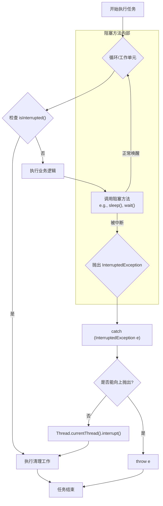

# Java 中断机制深度解析与最佳实践

> 在复杂的 Java 并发系统中，如何优雅地终止或取消一个正在执行的任务，是一个衡量开发者并发编程水平的重要标尺。Java 的中断机制（Interrupt Mechanism）为此提供了一套精巧的、协作式的解决方案。本文旨在为资深开发者提供一份关于中断机制的深度剖含，阐明其设计哲学、工作原理以及在实战中必须遵循的最佳实践。

---

## 1. 中断的设计哲学：一种协作式信令

首先必须明确，Java 的中断**不是一个强迫性的线程终止命令**，而是**一个协作式的信令（Signal）**。调用`thread.interrupt()`方法，并不会直接中止目标线程的执行，而是仅仅在目标线程内部设置了一个"中断标志位"。

目标线程如何响应这个信号，完全取决于其自身的代码逻辑。这种设计避免了早期`Thread.stop()`等废弃方法因强制释放锁而导致数据不一致的严重问题，将控制权交还给了开发者，使其能够以安全、可控的方式响应外部的取消请求。

---

## 2. 核心 API 剖析

中断机制主要围绕`Thread`类的三个核心方法构建：

1.  `public void interrupt()`

    - **作用**：设置目标线程的中断标志位为`true`。
    - **特性**：这是一个非阻塞方法，调用会立即返回。它仅仅是发出信号，不关心目标线程的状态。

2.  `public boolean isInterrupted()`

    - **作用**：检查目标线程的中断标志位。
    - **特性**：这是一个实例方法，它**不会改变**中断标志位的状态。

3.  `public static boolean interrupted()`
    - **作用**：检查**当前线程**的中断标志位。
    - **特性**：这是一个静态方法。最关键的是，它在返回中断状态后，会**清除**中断标志位（即将其重置为`false`）。这是一个具有副作用的操作，极易被误用。

---

## 3. 中断响应的核心场景与处理范式

线程对于中断信号的响应，主要分为两种场景。

### 场景一：处理处于`RUNNABLE`状态的线程

对于正在执行计算密集型任务的线程，它需要在一个循环中周期性地通过`isInterrupted()`检查中断状态，以决定是否终止执行。

```java
public class RunnableInterruptExample implements Runnable {
    @Override
    public void run() {
        // 通过检查中断状态来控制循环
        while (!Thread.currentThread().isInterrupted()) {
            // 执行核心计算任务...
            System.out.println("核心任务执行中...");
        }
        System.out.println("检测到中断信号，线程优雅退出。");
    }

    public static void main(String[] args) throws InterruptedException {
        Thread t = new Thread(new RunnableInterruptExample());
        t.start();

        // 让子线程运行2秒
        Thread.sleep(2000);

        System.out.println("主线程发出中断信号...");
        t.interrupt();
    }
}
```

### 场景二：处理处于阻塞状态的线程

这是中断机制中最关键、也最容易出错的部分。如果线程正阻塞在`Object.wait()`, `Thread.sleep()`, `Thread.join()`等方法上，此时对它调用`interrupt()`，会发生以下情况：

1.  阻塞方法会立即被唤醒。
2.  方法不会正常返回，而是抛出`InterruptedException`。
3.  在抛出`InterruptedException`的同时，JVM 会**清除线程的中断标志位**。

因此，对`InterruptedException`的正确处理至关重要。

#### `InterruptedException` 的最佳实践

**错误示范：吞掉中断**

```java
// 反面教材：吞掉中断信号，导致上层代码无法感知
try {
    Thread.sleep(5000);
} catch (InterruptedException e) {
    // 什么都不做，或者只打印日志
    e.printStackTrace();
}
```

这种做法使得中断信号丢失，调用栈上层的代码将永远无法得知该线程曾被中断过。

**正确实践 1：在方法签名中声明并传递异常**
如果当前方法没有能力处理中断，最简单、最负责任的做法是继续向外抛出`InterruptedException`。

```java
public void myTask() throws InterruptedException {
    // ...
    Thread.sleep(5000);
    // ...
}
```

**正确实践 2：无法传递时，恢复中断状态**
如果因为方法签名限制（如`Runnable.run()`）而无法向上抛出异常，则必须在`catch`块中通过重新调用`interrupt()`来恢复中断状态。

```java
public class BlockedInterruptExample implements Runnable {
    @Override
    public void run() {
        try {
            while (true) {
                System.out.println("等待中断...");
                Thread.sleep(10000); // 阻塞点
            }
        } catch (InterruptedException e) {
            // 因为run()方法签名不允许抛出InterruptedException
            // 所以在此处恢复中断状态
            Thread.currentThread().interrupt();
            System.out.println("捕获到InterruptedException，恢复中断状态并退出。");
        }
    }
}
```

恢复中断状态后，上层调用者依然可以通过`isInterrupted()`来判断该任务是否已被中断。

---

## 4. 中断处理流程图

下图清晰地展示了中断处理的完整决策流程。



---

## 5. 不可中断的阻塞

需要特别注意的是，并非所有阻塞都能响应中断。例如，传统的`java.io`包中的同步 Socket I/O 和流 I/O 操作就是不可中断的。如果一个线程在这些操作上发生阻塞，那么`interrupt()`调用将对其完全无效。

对于这类场景，现代 Java（NIO）提供了`java.nio.channels.InterruptibleChannel`，其 I/O 操作可以响应中断。在进行技术选型时，应充分考虑这一点。

---

## 6. 自定义中断信令：`volatile` 与 `AtomicBoolean`

尽管Java内置的中断机制功能强大且是标准范式，但在某些特定场景下，资深开发者也会采用更轻量级的自定义信令来实现任务的取消。最常见的便是使用`volatile boolean`或`AtomicBoolean`作为协作标志。

### 6.1 `volatile boolean`：轻量级的可见性保证

`volatile`关键字能确保一个变量的修改对所有线程立即可见，这使其成为实现简单取消策略的理想选择。

**工作原理**:
一个`volatile`布尔标志位被所有相关线程共享。一个线程（通常是任务提交者）通过修改该标志位来发出取消信号，而工作线程则在其主循环中不断检查该标志位，以决定是否继续执行。

**案例分析**:
```java
class VolatileCancelTask implements Runnable {
    private volatile boolean cancelled = false;

    @Override
    public void run() {
        while (!cancelled) {
            // 执行任务...
            System.out.println("通过 volatile 标志位，任务执行中...");
        }
        System.out.println("检测到 volatile 标志位变动，任务取消。");
    }

    public void cancel() {
        this.cancelled = true;
    }
}
```

> **核心局限**：这种方式的最大缺点是**无法中断任何可响应`InterruptedException`的阻塞调用**（如`Thread.sleep()`, `BlockingQueue.take()`）。如果线程在这些方法上阻塞，它将无法检查`cancelled`标志，也就无法响应取消请求。因此，它仅适用于计算密集型循环或不涉及深度阻塞的场景。

### 6.2 `AtomicBoolean`：更具原子性的选择

`AtomicBoolean`提供了与`volatile boolean`相同的内存可见性保证，但将其封装在一个提供了原子操作（如`compareAndSet()`）的类中。虽然在简单的标志位检查场景下，其表现与`volatile`无异，但它通常被认为是更佳的工程实践，因为它更清晰地表达了"这是一个可能被多线程原子性操作的状态"的意图。

**案例分析**:
```java
import java.util.concurrent.atomic.AtomicBoolean;

class AtomicCancelTask implements Runnable {
    private final AtomicBoolean running = new AtomicBoolean(true);

    @Override
    public void run() {
        while (running.get()) {
            // 执行任务...
             System.out.println("通过 AtomicBoolean 标志位，任务执行中...");
        }
        System.out.println("检测到 AtomicBoolean 标志位变动，任务取消。");
    }

    public void cancel() {
        running.set(false);
    }
}
```

### 6.3 对比与选型考量

| 机制             | 优点                                       | 缺点                                           | 适用场景                               |
| :--------------- | :----------------------------------------- | :--------------------------------------------- | :------------------------------------- |
| **内置中断机制** | **标准范式**，能中断阻塞方法，生态整合度高 | 概念稍复杂，`InterruptedException`易被误处理 | **所有场景**，尤其是涉及阻塞操作的任务   |
| **自定义标志**   | 逻辑简单直观                               | **无法中断阻塞方法**，适用范围受限             | 计算密集型循环，或需要管理多个取消条件的复杂逻辑 |

**结论**：作为首选，应当始终使用Java的内置中断机制。它是一个经过深思熟虑的、通用的取消框架。只有在你完全清楚任务不会陷入深度阻塞，或者需要一个不依赖`InterruptedException`的简单取消标志时，才考虑使用`volatile`或`AtomicBoolean`作为补充。

## 总结

- Java 中断是一种**协作式**的线程间通信机制，而非强制命令。
- `interrupt()`仅设置标志位；响应中断是线程自身的责任。
- 在`RUNNABLE`状态下，需**轮询检查**`isInterrupted()`。
- 阻塞方法通过抛出`InterruptedException`来响应中断，并**清除中断状态**。
- 捕获`InterruptedException`后，要么**向上抛出**，要么**恢复中断状态** (`Thread.currentThread().interrupt()`)，绝不能"吞掉"它。
- 警惕无法响应中断的 I/O 等阻塞操作。

深刻理解并严格遵循这些原则，是构建健壮、可控、易于维护的并发系统的关键。
