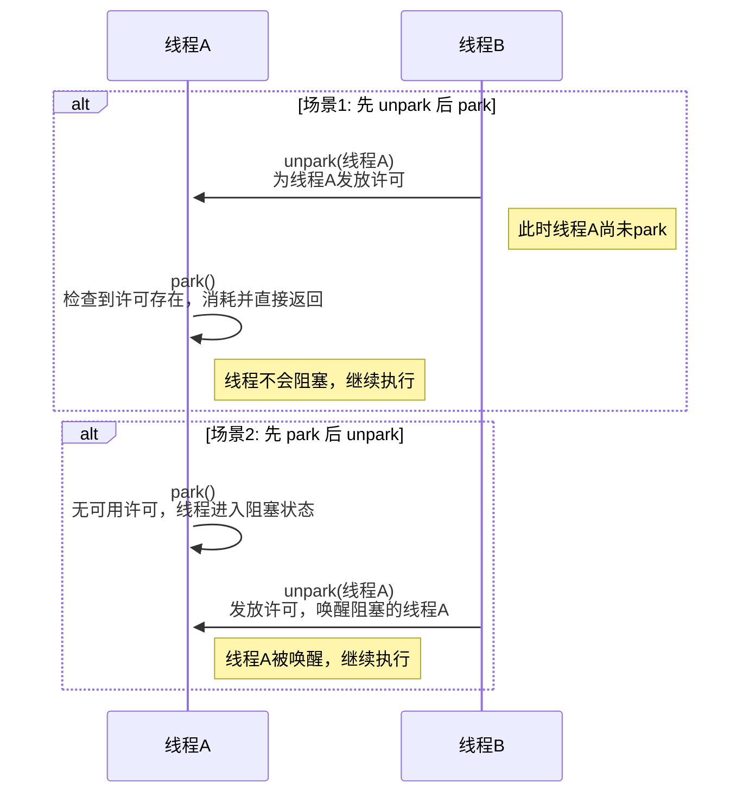

# Java LockSupport 深度解析

`LockSupport` 是 `java.util.concurrent.locks` 包下的一个底层工具类，用于提供基础的线程阻塞和唤醒功能。它是构建`java.util.concurrent` (JUC) 中众多同步组件（如 `ReentrantLock`）的核心基石。与 `Object` 的 `wait/notify` 机制相比，`LockSupport` 提供了更为灵活和精准的线程调度能力。

## LockSupport 核心 API: `park` 与 `unpark`

`LockSupport` 的核心功能由两个静态方法提供：`park()` 和 `unpark(Thread thread)`。它们实现了一种基于"许可（Permit）"的线程阻塞和唤醒机制。

- `park()`: 此方法用于阻塞当前线程。当一个线程调用 `park()` 时，它会检查其是否拥有一个"许可"。如果许可存在，该方法会消耗许可并立即返回。如果许可不存在，线程将进入阻塞状态，直到有其他线程为其发放许可。
- `unpark(Thread thread)`: 此方法用于向指定的目标线程 `thread` 发放一个"许可"。如果目标线程当前正因 `park()` 而阻塞，`unpark()` 会立即唤醒它。如果目标线程尚未阻塞，那么这个许可会被暂存，当该线程下一次调用 `park()` 时，会直接消耗许可并继续执行，而不会阻塞。

值得注意的是，每个线程最多只能持有一个许可，许可不会累积。连续多次调用 `unpark` 与调用一次的效果是完全相同的。

### 核心优势：解除时序耦合

`park/unpark` 模型最大的优势在于 `unpark` 可以先于 `park` 执行。这解决了 `wait/notify` 机制中必须先 `wait` 再 `notify` 的时序约束问题。如果 `notify` 先于 `wait` 执行，该通知信号将会丢失，导致线程无限等待。`LockSupport` 则通过许可机制避免了此问题。

以下序列图展示了 `park/unpark` 的两种典型交互场景：



## `LockSupport` 与 `wait/notify` 的对比

| 特性         | LockSupport (`park`/`unpark`)          | Object (`wait`/`notify`)                            |
| :----------- | :------------------------------------- | :-------------------------------------------------- |
| **锁定要求** | 无需获取任何对象锁                     | 必须在 `synchronized` 代码块中调用                  |
| **目标性**   | `unpark` 可以精准唤醒**指定线程**      | `notify` 随机唤醒一个等待线程，`notifyAll` 唤醒所有 |
| **时序依赖** | 无时序要求，`unpark` **可先于** `park` | `notify` **必须后于** `wait` 调用，否则信号丢失     |
| **底层实现** | 基于 `sun.misc.Unsafe` 中的本地方法    | JVM 内置实现，与对象监视器（Monitor）紧密耦合       |

`LockSupport` 的设计使其在实现线程同步时更加灵活，因为它不与任何锁进行绑定。然而，`wait/notify` 结合 `synchronized` 能够确保条件检查与线程等待/唤醒操作的原子性，这在某些并发场景下是必要的。

### `wait/notify` 编码实践

`wait()` 和 `notify()` 是 `Object` 类的基础方法，必须在 `synchronized` 块中与对象监视器锁（monitor lock）一同使用。

下面的例子模拟了一个简单的生产者-消费者场景，通过一个共享的`message`变量进行通信。

```java
public class WaitNotifyExample {

    private final Object lock = new Object();
    private String message;
    private boolean hasMessage = false;

    public void produce(String message) {
        synchronized (lock) {
            // 如果已有消息，则等待消费者消费
            while (hasMessage) {
                try {
                    System.out.println("生产者等待中...");
                    lock.wait();
                } catch (InterruptedException e) {
                    Thread.currentThread().interrupt();
                    e.printStackTrace();
                }
            }
            // 生产消息
            this.message = message;
            this.hasMessage = true;
            System.out.println("生产了消息: " + message);
            // 通知一个等待的消费者
            lock.notify();
        }
    }

    public String consume() {
        synchronized (lock) {
            // 如果没有消息，则等待生产者生产
            while (!hasMessage) {
                try {
                    System.out.println("消费者等待中...");
                    lock.wait();
                } catch (InterruptedException e) {
                    Thread.currentThread().interrupt();
                    e.printStackTrace();
                }
            }
            // 消费消息
            String consumedMessage = this.message;
            System.out.println("消费了消息: " + consumedMessage);
            this.hasMessage = false;
            // 通知一个等待的生产者
            lock.notify();
            return consumedMessage;
        }
    }

    public static void main(String[] args) {
        WaitNotifyExample example = new WaitNotifyExample();

        Thread producer = new Thread(() -> {
            for (int i = 0; i < 5; i++) {
                example.produce("Message " + i);
                try {
                    Thread.sleep(1000); // 模拟生产耗时
                } catch (InterruptedException e) {
                    e.printStackTrace();
                }
            }
        }, "Producer");

        Thread consumer = new Thread(() -> {
            for (int i = 0; i < 5; i++) {
                example.consume();
                 try {
                    Thread.sleep(1500); // 模拟消费耗时
                } catch (InterruptedException e) {
                    e.printStackTrace();
                }
            }
        }, "Consumer");

        producer.start();
        consumer.start();
    }
}
```

## `LockSupport` 与 `await/signal` 的对比

`await/signal` 是 `Condition` 接口的核心方法，通常与 `ReentrantLock` 配合使用，可视为 `wait/notify` 的增强版。

| 特性         | LockSupport (`park`/`unpark`)                      | Condition (`await`/`signal`)                                |
| :----------- | :------------------------------------------------- | :---------------------------------------------------------- |
| **锁定要求** | 无需获取任何锁                                     | 必须在 `Lock` 接口实现的锁保护下调用                        |
| **抽象层次** | **更底层**的线程原语，是 `await/signal` 的实现基础 | **更高层**的抽象，提供了更丰富的等待/唤醒模式               |
| **功能性**   | 仅提供单一的"许可"机制                             | 支持创建多个 `Condition` 对象，实现多路条件等待和选择性唤醒 |

可以认为，`LockSupport` 是构成 JUC 同步框架的原子构建块。在 `AbstractQueuedSynchronizer` (AQS) 的实现中，当需要将线程置于等待队列并阻塞时，其底层调用的正是 `LockSupport.park()`。

### `await/signal` 编码实践

`await()` 和 `signal()` 是 `Condition` 接口的方法，它与 `Lock` （通常是 `ReentrantLock`）配合使用，提供了比 `wait/notify` 更强大和灵活的线程协作能力。一个 `Lock` 可以关联多个 `Condition` 对象，实现更精细的线程等待与唤醒控制。

下面的例子使用 `ReentrantLock` 和 `Condition` 重写了上面的生产者-消费者场景。

```java
import java.util.concurrent.locks.Condition;
import java.util.concurrent.locks.Lock;
import java.util.concurrent.locks.ReentrantLock;

public class AwaitSignalExample {

    private final Lock lock = new ReentrantLock();
    private final Condition condition = lock.newCondition();
    private String message;
    private boolean hasMessage = false;

    public void produce(String message) {
        lock.lock();
        try {
            // 如果已有消息，则等待消费者消费
            while (hasMessage) {
                try {
                    System.out.println("生产者等待中...");
                    condition.await();
                } catch (InterruptedException e) {
                    Thread.currentThread().interrupt();
                    e.printStackTrace();
                }
            }
            // 生产消息
            this.message = message;
            this.hasMessage = true;
            System.out.println("生产了消息: " + message);
            // 通知一个等待的消费者
            condition.signal();
        } finally {
            lock.unlock();
        }
    }

    public String consume() {
        lock.lock();
        try {
            // 如果没有消息，则等待生产者生产
            while (!hasMessage) {
                try {
                    System.out.println("消费者等待中...");
                    condition.await();
                } catch (InterruptedException e) {
                    Thread.currentThread().interrupt();
                    e.printStackTrace();
                }
            }
            // 消费消息
            String consumedMessage = this.message;
            System.out.println("消费了消息: " + consumedMessage);
            this.hasMessage = false;
            // 通知一个等待的生产者
            condition.signal();
            return consumedMessage;
        } finally {
            lock.unlock();
        }
    }

    public static void main(String[] args) {
        AwaitSignalExample example = new AwaitSignalExample();

        Thread producer = new Thread(() -> {
            for (int i = 0; i < 5; i++) {
                example.produce("Message " + i);
                try {
                    Thread.sleep(1000); // 模拟生产耗时
                } catch (InterruptedException e) {
                    e.printStackTrace();
                }
            }
        }, "Producer");

        Thread consumer = new Thread(() -> {
            for (int i = 0; i < 5; i++) {
                example.consume();
                 try {
                    Thread.sleep(1500); // 模拟消费耗时
                } catch (InterruptedException e) {
                    e.printStackTrace();
                }
            }
        }, "Consumer");

        producer.start();
        consumer.start();
    }
}
```

## `LockSupport` 编码实践

### 场景一：先 `park`，后 `unpark`

该示例演示了主线程在 2 秒后唤醒一个已阻塞的子线程。

```java
import java.util.concurrent.locks.LockSupport;

public class LockSupportExample {

    public static void main(String[] args) {
        Thread targetThread = new Thread(() -> {
            System.out.println(Thread.currentThread().getName() + " - is ready to park.");
            // 调用park()，线程将在此处阻塞
            LockSupport.park();
            System.out.println(Thread.currentThread().getName() + " - has been unparked.");
        }, "TargetThread");

        targetThread.start();

        try {
            // 确保子线程先执行并进入park状态
            Thread.sleep(2000);
        } catch (InterruptedException e) {
            Thread.currentThread().interrupt();
            e.printStackTrace();
        }

        System.out.println("Main thread is about to unpark TargetThread...");
        // 主线程调用unpark唤醒目标线程
        LockSupport.unpark(targetThread);
    }
}
```

**预期输出:**

```
TargetThread - is ready to park.
Main thread is about to unpark TargetThread...
TargetThread - has been unparked.
```

### 场景二：先 `unpark`，后 `park`

此示例展示 `unpark` 先于 `park` 执行，线程不会阻塞的场景。

```java
import java.util.concurrent.locks.LockSupport;

public class LockSupportUnparkFirst {
    public static void main(String[] args) {
        Thread targetThread = new Thread(() -> {
            try {
                // 等待3秒，确保主线程的unpark先执行
                Thread.sleep(3000);
            } catch (InterruptedException e) {
                Thread.currentThread().interrupt();
                e.printStackTrace();
            }
            System.out.println(Thread.currentThread().getName() + " - is ready to park.");
            // 由于许可已提前发放，此处的park()将直接返回，不会阻塞
            LockSupport.park();
            System.out.println(Thread.currentThread().getName() + " - park finished without blocking.");
        }, "TargetThread");

        targetThread.start();

        System.out.println("Main thread grants a permit to TargetThread in advance...");
        // 提前为目标线程发放许可
        LockSupport.unpark(targetThread);
    }
}
```

**预期输出:**

```
Main thread grants a permit to TargetThread in advance...
TargetThread - is ready to park.
TargetThread - park finished without blocking.
```

以上实践清晰地展示了 `LockSupport` 的核心行为和相较于传统线程协作机制的优势。在构建自定义同步器或需要对线程进行精细化控制时，`LockSupport` 是一个强大而高效的工具。
