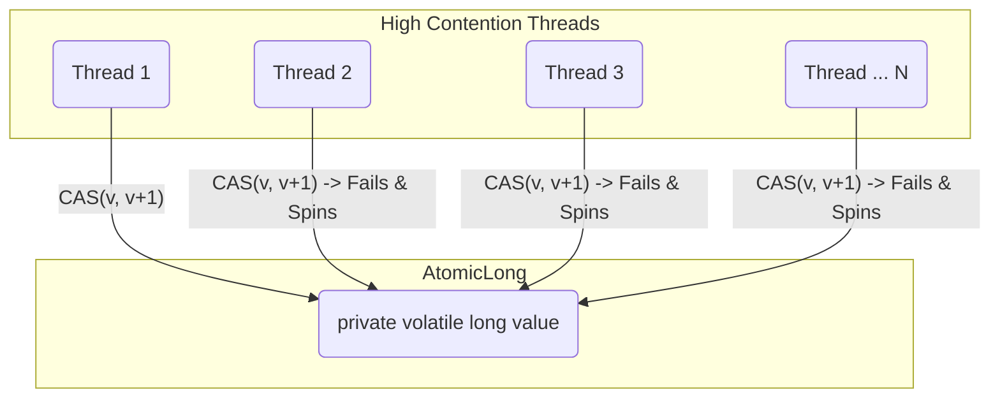
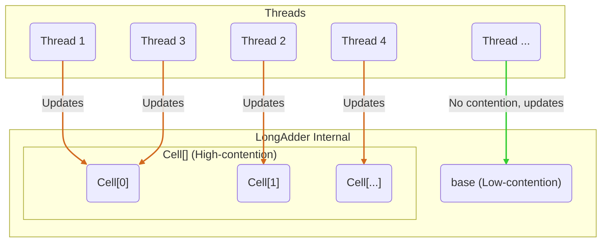

## 1. `AtomicLong`的“独木桥”困境：热点竞争的根源

在 Java 5 引入`java.util.concurrent.atomic`包后，`AtomicLong`迅速成为实现线程安全计数器的标准方案。它基于现代处理器提供的 CAS（Compare-and-Swap）原子指令，实现了一种无锁的、比`synchronized`更为轻量级的并发更新机制。

`AtomicLong`的内部设计极其简洁：一个核心的`volatile long value`字段。所有操作，如`incrementAndGet()`，都围绕这个单一的共享变量展开。

```java
// AtomicLong.incrementAndGet() 的简化逻辑
public final long incrementAndGet() {
    while (true) { // 无限循环，即“自旋”
        long current = get(); // 读取当前值
        long next = current + 1; // 计算期望值
        if (compareAndSet(current, next)) // CAS尝试更新
            return next; // 成功则返回
    }
}
```

在低到中等并发场景下，这种模式高效且优雅。然而，当成百上千的线程同时涌入，试图更新**这同一个`value`**时，灾难便发生了。这就像千军万马试图通过一座独木桥：



在高并发下，只有一个线程的 CAS 操作能够侥幸成功。其余所有线程的`compareAndSet`都会因值已被修改而失败，进而被迫进入下一次自旋，重新读取、计算、尝试。这引发了剧烈的**热点竞争（Hotspot Contention）**。CPU 的大量时钟周期被浪费在这些无效的自旋重试上，导致`AtomicLong`的吞吐量随着线程数的增加不升反降，成为系统的性能瓶颈。

## 2. `LongAdder`的破局之道：“分而治之”的设计哲学

为了解决`AtomicLong`的扩展性问题，J.U.C.大师 Doug Lea 在 Java 8 中引入了`LongAdder`。它并非对`AtomicLong`的小修小补，而是一次彻头彻尾的设计思想变革，其核心是：**分散热点，空间换时间**。

`LongAdder`放弃了对单一共享变量的执着，转而采用一种更为复杂的内部结构：

- **`base`**：一个`volatile long`类型的字段。在无竞争或低竞争时，它扮演着`AtomicLong`的角色，线程会优先尝试直接 CAS 更新它。
- **`Cell[] cells`**：一个`Cell`对象的数组，同样是`volatile`的。当`base`的竞争变得激烈时，这里便是主战场。

<!-- end list -->



#### 关键细节：`Cell`与伪共享（False Sharing）

`Cell`并非简单的`long`包装类。它是`Striped64`（`LongAdder`的父类）中的一个静态内部类，其设计精髓在于**避免伪共享**。

> **伪共享（False Sharing）**：现代 CPU 的缓存系统以缓存行（Cache Line，通常为 64 字节）为单位加载数据。如果多个线程操作的独立变量恰好位于同一个缓存行中，那么一个线程对其中一个变量的修改会导致整个缓存行失效，从而强制其他线程重新从主内存加载数据，即使它们关心的是该缓存行中的其他变量。这种因缓存行而非数据本身的竞争，就是伪共享，它会严重拖累性能。

`Cell`通过`@sun.misc.Contended`注解（或在旧版 JDK 中手动进行字节填充）来确保每个`Cell`对象都占据独立的缓存行。这样，不同线程对不同`Cell`的更新就不会产生缓存一致性流量的互相干扰，真正做到了物理隔离。

## 3. `add()` 与 `sum()` 的非对称之旅

`LongAdder`的核心逻辑体现在其`add()`和`sum()`方法的截然不同的实现上。

### `add(long x)`: 一次智能的更新分发

当一个线程调用`add()`时，它会经历一个精心设计的流程：

1.  **快速通道（Fast Path）**：首先，检查`cells`数组是否存在。如果为`null`（意味着尚无竞争或竞争刚开始），则直接尝试 CAS 更新`base`字段。如果成功，操作结束。这是为低并发场景优化的路径，开销极小。
2.  **竞争出现（Contention Path）**：如果`base`的 CAS 失败，或者`cells`数组已经存在，说明竞争已经发生。此时，系统进入分流逻辑。
3.  **定位`Cell`**：线程会根据自身的`ThreadLocalRandom`探针值（probe）进行哈希计算，映射到`cells`数组的一个槽位（slot）上。
4.  **更新`Cell`**：
    - 如果槽位不为`null`，则直接 CAS 更新这个`Cell`的值。由于不同线程的探针值不同，它们大概率会命中不同的`Cell`，从而将竞争分散。
    - 如果槽位为`null`，则需要初始化一个新的`Cell`放入该槽位。
    - 如果对`Cell`的 CAS 也失败了（意味着多个线程哈希到同一个`Cell`），或者需要初始化`Cell`，系统会进入一个更复杂的`longAccumulate`方法。
5.  **动态扩容与重试**：在`longAccumulate`方法中，`LongAdder`会尝试重新哈希（改变线程的探针值）来寻找一个空闲的`Cell`。如果所有`Cell`都处于竞争状态，并且数组尚未达到 CPU 核心数的限制，它会**对`cells`数组进行双倍扩容**，以容纳更多的并发，进一步降低单个`Cell`的冲突概率。

### `sum()`: 延迟的全局求和

与`add()`的复杂分流相比，`sum()`的逻辑很直接但代价更高：

```java
public long sum() {
    long sum = base;
    Cell[] as = cells;
    if (as != null) {
        for (Cell cell : as) {
            if (cell != null) {
                sum += cell.value;
            }
        }
    }
    return sum;
}
```

它需要遍历`base`和`cells`数组中的每一个`Cell`，并将它们的值累加起来，最终返回全局总和。

**重要的一致性说明**：`sum()`在执行期间，其他线程可能仍在并发地更新`base`或`Cell`。因此，`sum()`返回的是一个**非原子快照（Non-atomic Snapshot）**的最终一致性结果。它不保证是调用瞬间的精确值，但在没有并发更新的静止状态下，其结果是准确的。对于绝大多数统计场景（如 QPS、交易量），这种弱一致性是完全可以接受的。

## 4. 资深开发者的决策矩阵：何时用，为何用？

| 特性 / 场景         | `AtomicLong`                                                          | `LongAdder`                                                               |
| :------------------ | :-------------------------------------------------------------------- | :------------------------------------------------------------------------ |
| **核心哲学**        | **集中式乐观锁**：简单、直接，依赖 CAS。                              | **分段锁思想**：空间换时间，分散竞争。                                    |
| **高并发写入**      | **性能瓶颈**：竞争加剧，吞吐量下降。                                  | **性能卓越**：吞吐量随线程数线性扩展。                                    |
| **读取性能/一致性** | **极快且强一致**：`get()`是单次 volatile 读，返回精确快照。           | **较慢且弱一致**：`sum()`需遍历求和，非精确快照。                         |
| **内存占用**        | **极低**：仅一个`long`的开销。                                        | **较高**：一个`base` + 一个`Cell`数组（及缓存行填充）。                   |
| **依赖关系**        | **独立原子值**：适用于需要`getAndIncrement`等操作返回更新后值的场景。 | **纯粹累加器**：设计上只关注`add`和最终的`sum`，没有`getAndAdd`这类操作。 |

**实战场景抉择：**

- **选择 `LongAdder` 的场景：**

  - **高并发统计指标**：这是`LongAdder`的“主场”。例如，记录 Web 服务器的 QPS、RPC 框架的调用次数、应用的请求处理数等。这类场景的特点是**极高的写入频率，而读取频率远低于写入**（例如，监控系统每隔几秒才读取一次总和）。
  - **对瞬时值的精确性要求不高**：只需要一个最终一致的统计总数。

- **坚持 `AtomicLong` 的场景：**

  - **需要依赖原子更新后的返回值做业务逻辑**：例如，生成全局唯一的序列号（`incrementAndGet()`）。`LongAdder`没有提供类似的方法，因为它无法在分散更新后原子性地返回准确的总和。
  - **低并发或竞争不激烈的环境**：如果你的并发线程数可预见地很低（例如，几个到十几个），`AtomicLong`的性能完全足够，且更简单、内存占用更低。避免过度设计。
  - **需要强一致性的读操作**：当计数器的值需要被频繁地、准确地读取并用于判断逻辑时，例如用作一个资源池的可用数量判断，`AtomicLong.get()`的低延迟和强一致性是必需的。

## 5. 结论：工具之别，亦是哲学之别

`AtomicLong`和`LongAdder`的对决，与其说是 API 的选择，不如说是并发设计哲学的碰撞。

- `AtomicLong`是**通用、简单、直接**的方案，它忠实于 CAS 的乐观锁思想，在广阔的非极端并发场景下表现良好。
- `LongAdder`则是**特化、极致、精妙**的方案，它深刻理解了硬件层面的瓶颈（热点竞争、伪共享），并创造性地通过分而治之的思想，用内存空间和读取一致性的微小妥协，换来了无与伦比的写入吞吐量。它是对“机械共鸣（Mechanical Sympathy）”理念的完美诠释。

作为开发者，理解它们背后的设计哲学，能让我们在面对具体问题时，做出更深刻、更合理的选择。在 J.U.C 的世界里，没有绝对的“银弹”，只有最适合当前场景的“利器”。而`LongAdder`及其家族成员（如`DoubleAdder`, `LongAccumulator`）无疑是处理高并发累加场景下最锋利的那一把。
