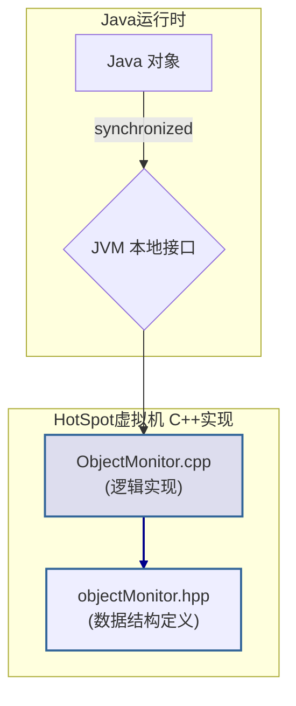
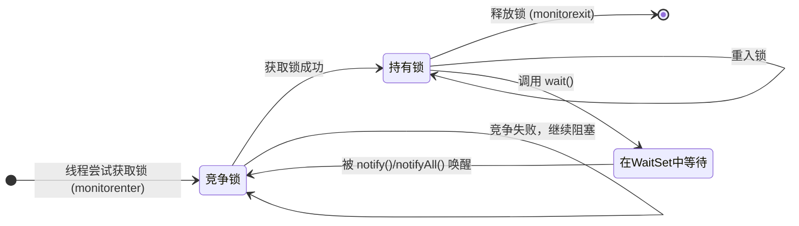
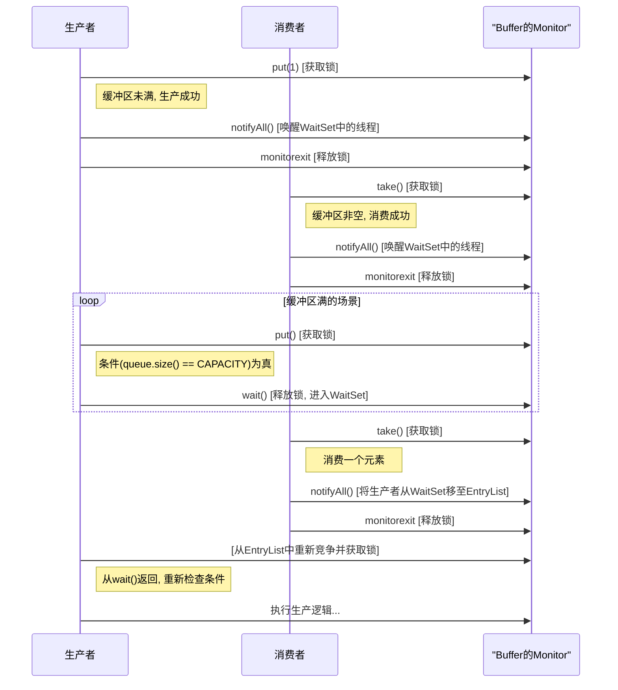

# 深入剖析 Java 管程（Monitor）

> 本文旨在深入剖析 Java 并发编程的核心基石——管程（Monitor）。对于任何期望精通 Java 并发、进行性能调优或解决复杂并发问题的资深开发者而言，透彻理解管程的底层实现机制至关重要。本文将从 HotSpot 虚拟机的`ObjectMonitor`源码实现出发，层层递进，揭示`synchronized`关键字背后的完整工作流。

---

## 1. 管程的本质

管程并非 Java 独创，它是一种经典的并发编程原语，其设计目标在于简化并发控制，将共享资源的**互斥（Mutual Exclusion）**和线程间的**协作（Cooperation）**进行统一封装。

- **互斥**：确保临界区（Critical Section）代码在同一时刻只被一个线程执行。
- **协作**：提供条件变量（Condition Variables），允许线程在特定条件不满足时挂起等待（`wait`），并在条件满足后被其他线程唤醒（`notify`/`notifyAll`）。

Java 将这一模型深度集成到语言中，每个 Java 对象实例都内建一个监视器（Monitor）。这一设计使得任何对象都能天然地充当锁的角色，而`synchronized`关键字，正是激活和使用管程最直接的手段。

---

## 2. HotSpot 虚拟机中的管程实现：`ObjectMonitor`

当`synchronized`作用于一个对象时，JVM 内部会将其与一个`ObjectMonitor`实例关联。这一过程涉及从 Java 代码到 JVM 本地接口，最终到 HotSpot C++源码的调用链路。



> **架构须知**：JVM 为优化性能，引入了锁升级（Lock Escalation）机制。一个对象锁会经历 **偏向锁 -> 轻量级锁 -> 重量级锁** 的状态流转。`ObjectMonitor`正是重量级锁的实现，仅在多线程竞争加剧、锁“膨胀”后才会被实例化。此时，对象头（Mark Word）的数据将转变为一个指向`ObjectMonitor`实例的指针。

`objectMonitor.hpp`中定义了其关键数据结构（已简化）：

```cpp
class ObjectMonitor {
volatile void* _owner;     // 指向当前持有锁的线程
volatile jint  _count;     // 锁的重入计数
Object*        _object;     // 关联的Java对象实例
WaitSet*       _WaitSet;    // 条件等待队列 (调用wait()的线程宿主)
cxq*           _EntryList;  // 互斥竞争队列 (阻塞等待锁的线程宿主)
...
};
```

---

## 3. `ObjectMonitor`核心工作流剖析

`ObjectMonitor`的并发调度核心在于其内部的两个队列：`_EntryList` 和 `_WaitSet`。前者负责管理因竞争锁而阻塞的线程，后者负责管理调用了`Object.wait()`的线程。

下图展示了一个线程在`ObjectMonitor`中完整的生命周期状态转换：



- **获取锁 (`monitorenter`)**:

  1.  线程尝试通过原子 CAS（Compare-and-Swap）操作将`_owner`字段更新为自身指针。
  2.  若更新成功，则获得锁。若对象锁是重入的，则递增`_count`计数器。
  3.  若 CAS 失败，表明锁已被其他线程持有。当前线程将被封装成`ObjectWaiter`节点，加入到`_EntryList`中，并调用底层`park()`原语挂起自身，等待唤醒。

- **释放锁 (`monitorexit`)**:

  1.  持有者线程递减`_count`。若`_count`归零，则退出临界区。
  2.  将`_owner`字段置为`null`。
  3.  根据特定的唤醒策略（JVM 实现相关），从`_EntryList`中唤醒一个等待的线程（`unpark`），使其重新参与锁竞争。

- **条件等待 (`wait`/`notify`)**:
  1.  **`wait()`**: 线程必须先持有锁。调用后，线程会释放锁（`_owner`置`null`），并被封装后加入`_WaitSet`队列挂起。
  2.  **`notify()`/`notifyAll()`**: 线程必须持有锁。调用后，JVM 会从`_WaitSet`中移动一个或所有线程节点到`_EntryList`中，使其状态从条件等待转为锁竞争。这些被唤醒的线程并不会直接获得锁，而是需要重新竞争。

---

## 4. 经典用例：生产者-消费者模型

该模型是展示管程互斥与协作能力的绝佳范例。

```java
// Buffer.java - A thread-safe buffer using intrinsic locks
import java.util.LinkedList;
import java.util.Queue;

class Buffer {
    private final Queue<Integer> queue = new LinkedList<>();
    private final int CAPACITY = 5;

    public synchronized void put(int val) throws InterruptedException {
        while (queue.size() == CAPACITY) {
            // Condition not met, release lock and wait
            wait();
        }
        queue.offer(val);
        // Notify waiting consumers that state has changed
        notifyAll();
    }

    public synchronized int take() throws InterruptedException {
        while (queue.isEmpty()) {
            // Condition not met, release lock and wait
            wait();
        }
        int v = queue.poll();
        // Notify waiting producers that state has changed
        notifyAll();
        return v;
    }
}
```

### 执行流程分析



---

## 5. `synchronized` vs. `ReentrantLock`：架构选型考量

虽然内置管程(`synchronized`)简洁高效，但`java.util.concurrent`框架提供了`ReentrantLock`作为其替代。二者的选型需基于具体业务场景的复杂度、性能需求和功能要求进行权衡。

| 特性           | `synchronized` / 内置管程                   | `ReentrantLock` + `Condition`                        |
| :------------- | :------------------------------------------ | :--------------------------------------------------- |
| **API 层面**   | 语言关键字，由 JVM 隐式管理锁的获取与释放   | 需要在`finally`块中显式调用`unlock()`，易出错        |
| **公平性策略** | **非公平锁**，无法更改                      | 可在构造时选择**公平**或**非公平**（默认）           |
| **中断与超时** | 等待锁时**不可中断**，无超时机制            | `lockInterruptibly()`和`tryLock()`提供中断和超时能力 |
| **条件队列**   | **单一**条件队列 (`WaitSet`)                | 可通过`newCondition()`创建**多个**独立的条件队列     |
| **性能**       | Java 1.6 后，经锁膨胀、自旋等优化，性能很高 | 在高竞争下，配合特定功能（如公平性）时，展现优势     |

---

## 总结

- `synchronized`是 Java 语言层面的管程语法糖，其实现由 JVM 在底层完成，为开发者提供了便捷的并发控制手段。
- 每个 Java 对象都可以作为管程，其核心是与一个`ObjectMonitor`实例的绑定。
- HotSpot 中的`ObjectMonitor`通过`_EntryList`（竞争队列）和`_WaitSet`（条件等待队列）这两个关键数据结构，高效地管理线程的阻塞与唤醒，实现了互斥与协作。
- 深入理解`ObjectMonitor`的工作原理、锁升级机制以及与`ReentrantLock`的差异，是 Java 资深开发者进行并发编程、性能调优和疑难问题排查的必备知识。
