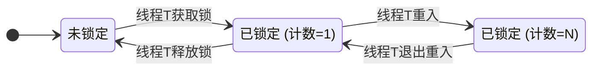

# 深入解析 Java 可重入锁 (Reentrancy)

> 在 Java 并发编程领域，锁的可重入性（Reentrancy）是一个基础且至关重要的特性。它不仅是`synchronized`关键字和`ReentrantLock`实现的核心性质，更是编写健壮、无死锁并发代码的基石。本文旨在为资深开发者提供一个关于 Java 可重入锁的深度剖析，阐明其工作原理、实现方式及在复杂场景下的应用价值。

---

## 1. 什么是锁的可重入性？

**可重入性**，又称递归性（Recursion），指的是**同一个线程在已经持有某个锁的情况下，能够再次成功获取该锁而不会被阻塞（即不会发生死锁）**。

从更高维度看，可重入锁允许线程在持有锁的同步代码块中，自由调用其他需要同一把锁的同步方法。如果锁不具备可重入性，那么这种调用就会导致线程尝试获取自己已经持有的锁，从而引发死锁。

---

## 2. 可重入锁的实现原理

可重入锁的实现核心在于两个关键要素：

1.  **锁的持有者（Owner）**：一个用于记录当前是哪个线程持有该锁的标识。
2.  **持有计数器（Hold Count）**：一个整数，用于记录当前线程持有该锁的次数。

其工作流如下：

- **获取锁 (Acquisition)**:

  1.  当一个线程尝试获取锁时，系统首先检查锁的持有者。
  2.  如果锁未被任何线程持有，则将持有者设为当前线程，并将计数器置为 1。
  3.  如果锁已被**当前线程**持有，则简单地将计数器加 1。
  4.  如果锁已被**其他线程**持有，则当前线程被阻塞，进入等待状态。

- **释放锁 (Release)**:
  1.  当持有锁的线程请求释放锁时，它必须是当前的锁持有者。
  2.  线程将持有计数器减 1。
  3.  只有当计数器**归零**时，该线程才真正释放锁，将持有者置为`null`，并唤醒其他等待该锁的线程。



---

## 3. Java 中的可重入锁实现

Java 平台主要提供了两种内置的可重入锁实现。

### 3.1 `synchronized`：隐式的可重入锁

`synchronized`是 Java 语言层面的关键字，其可重入性是由 JVM 在底层隐式保证的，开发者无需介入。每个对象监视器（Monitor）内部都维护着类似于持有者和计数器的机制。

#### 底层原理：`monitorenter`/`monitorexit`

`synchronized`同步代码块在编译后会生成`monitorenter`和`monitorexit`两条字节码指令。JVM 通过这两条指令来执行加锁与解锁操作，其内部的可重入逻辑遵循以下规则：

- **执行 `monitorenter` 时**:

  1.  每个锁对象都关联一个锁计数器和一个指向持有者线程的指针。
  2.  如果锁计数器为零，代表该锁未被持有。JVM 会将其持有者设置为当前线程，并将计数器加 1。
  3.  如果锁计数器不为零，JVM 会检查其持有者是否为当前线程。如果是，则简单地将计数器加 1（实现重入）；如果不是，则当前线程必须阻塞等待，直到持有者释放该锁。

- **执行 `monitorexit` 时**:
  1.  JVM 会将锁计数器减 1。
  2.  当计数器归零时，锁被完全释放，持有者被清空。

这种基于计数器的机制，确保了线程可以安全地多次进入由同一把锁保护的同步代码块。

**案例分析**:

```java
public class SynchronizedReentrancyDemo {

    public synchronized void outerMethod() {
        System.out.println(Thread.currentThread().getName() + ": 进入 outerMethod");
        // 调用另一个需要相同锁的方法
        innerMethod();
        System.out.println(Thread.currentThread().getName() + ": 即将离开 outerMethod");
    }

    public synchronized void innerMethod() {
        System.out.println(Thread.currentThread().getName() + ": 进入 innerMethod");
        // ...
        System.out.println(Thread.currentThread().getName() + ": 即将离开 innerMethod");
    }

    public static void main(String[] args) {
        SynchronizedReentrancyDemo demo = new SynchronizedReentrancyDemo();
        new Thread(demo::outerMethod, "T1").start();
    }
}
```

在上述代码中，`outerMethod`和`innerMethod`都由`this`对象锁保护。当线程 T1 调用`outerMethod`时，它获取了`demo`对象的锁。在`outerMethod`内部，它接着调用`innerMethod`。由于`synchronized`是可重入的，T1 能够再次成功获取`demo`对象的锁，而不会阻塞。如果`synchronized`不具备可重入性，T1 在调用`innerMethod`时会永久等待自己释放锁，从而导致死锁。

### 3.2 `ReentrantLock`：显式的可重入锁

`ReentrantLock`是 J.U.C 包提供的`Lock`实现，它明确地以"Reentrant"（可重入）命名，并提供了比`synchronized`更强大的功能。其内部同步机制基于 AQS，通过维护`state`（持有计数）和`exclusiveOwnerThread`（持有者）来实现可重入。

**案例分析**:

```java
import java.util.concurrent.locks.ReentrantLock;

public class ReentrantLockDemo {
    private final ReentrantLock lock = new ReentrantLock();

    public void outerMethod() {
        lock.lock(); // 获取锁
        try {
            System.out.println(Thread.currentThread().getName() + ": 进入 outerMethod");
            innerMethod();
            System.out.println(Thread.currentThread().getName() + ": 即将离开 outerMethod");
        } finally {
            lock.unlock(); // 释放锁
        }
    }

    public void innerMethod() {
        lock.lock(); // 重入
        try {
            System.out.println(Thread.currentThread().getName() + ": 进入 innerMethod");
        } finally {
            lock.unlock(); // 对应重入的释放
        }
    }

    public static void main(String[] args) {
        ReentrantLockDemo demo = new ReentrantLockDemo();
        new Thread(demo::outerMethod, "T1").start();
    }
}
```

此处的行为与`synchronized`版本完全一致。`lock.lock()`和`lock.unlock()`的调用必须严格成对出现。每次`lock()`调用（无论是初次获取还是重入）都应在`finally`块中对应一次`unlock()`调用，以确保锁的最终释放。

---

## 4. 可重入性的实践意义

- **防止死锁**：这是可重入性最直接的价值。它允许在一个同步方法中安全地调用另一个使用相同锁的同步方法或代码块，这在复杂的面向对象设计（如继承、组合）中非常常见。
- **代码封装与复用**：开发者可以放心地将一些通用的同步逻辑封装在独立的方法中，然后在其他同步方法中调用，而无需担心锁的问题。
- **提升代码可读性**：无需在代码中绕过或规避因重入可能导致的死锁问题，使并发代码的逻辑更加直观和易于维护。

## 总结

可重入性是 Java 并发锁模型中的一个基础而关键的设计。它通过"锁持有者"和"持有计数"的机制，优雅地解决了线程在自身执行流中重复获取同一把锁时可能导致的死锁问题。无论是隐式的`synchronized`还是显式的`ReentrantLock`，都内建了这一重要特性。对于 Java 开发者而言，深刻理解并善用锁的可重入性，是编写高效、安全、可维护的并发程序的必备技能。
