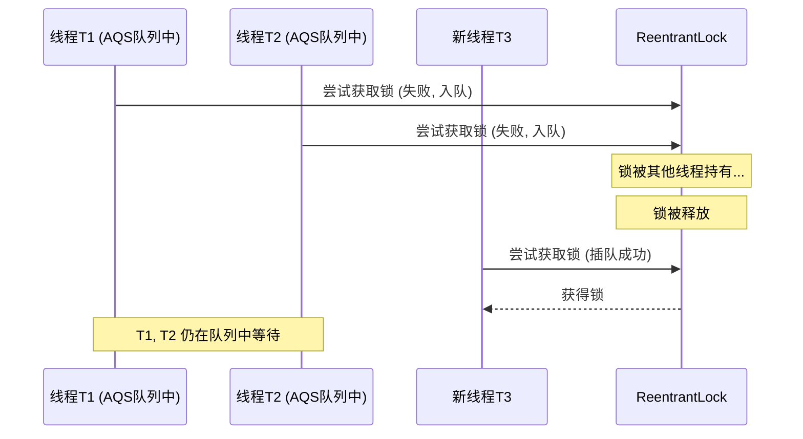
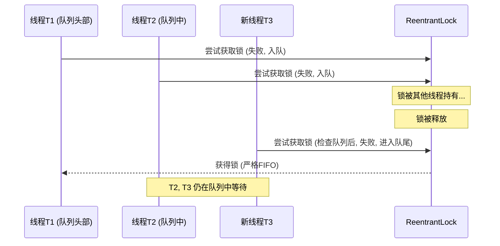

# ReentrantLock 深度解析：公平性与性能的权衡

> 本文旨在为资读者提供一份关于`ReentrantLock`的深度解析，重点探讨其公平性策略（Fairness Policy）对并发行为及系统性能的影响。理解这两种策略的底层机制是进行高性能并发库选型与调优的关键。

---

## 1. `ReentrantLock` 核心特性

`ReentrantLock`是 J.U.C（`java.util.concurrent`）包中提供的`Lock`接口的一个强大实现，相较于内置锁`synchronized`，它提供了更丰富的控制能力和扩展性：

- **可中断的锁获取** (`lockInterruptibly()`): 允许等待锁的线程响应中断。
- **带超时的锁获取** (`tryLock(long, TimeUnit)`): 避免线程无限期等待，有效防止死锁。
- **可选择的公平策略**: 构造时可指定锁是公平的还是非公平的，这是`ReentrantLock`的核心设计之一。
- **条件变量支持** (`newCondition()`): 可关联多个`Condition`对象，实现复杂的线程间协作。

本文将聚焦于其**公平性策略**。

---

## 2. 公平与非公平策略的底层 AQS 实现

`ReentrantLock`的同步机制基于`AbstractQueuedSynchronizer`（AQS）。其公平与否，本质上是线程获取锁时，是否严格遵守 AQS 同步队列的 FIFO（先进先出）原则。我们可以通过一个"售票窗口"的业务模型来理解这两种策略。

- **Lock**: 单一的售票窗口（同步资源）。
- **AQS 同步队列**: 窗口前的排队队列。
- **线程**: 等待买票的乘客。

### 2.1 非公平锁 (`new ReentrantLock(false)`)

非公平锁是`ReentrantLock`的**默认选项**，也是`synchronized`所采用的策略，通常具备更高的吞吐量。

**工作模式**:
当一个线程释放锁时，AQS 队列的头部线程会被唤醒。但与此同时，如果一个新线程恰好在此时请求锁，它会直接尝试通过 CAS 操作获取锁。这种行为被称为"Barging"（闯入/插队）。如果这个新线程"插队"成功，那么刚刚被唤醒的头部线程会发现锁又被占用了，只能再次挂起。

- **优势**: 减少了线程上下文切换的开销。因为"闯入"的线程无需经历入队、挂起、唤醒的完整流程，从而提高了整体的吞吐量。
- **劣势**: 可能导致队列中的某些线程长时间无法获取锁，即"**饥饿**"（Starvation）。

### 2.2 公平锁 (`new ReentrantLock(true)`)

公平锁严格遵循 AQS 队列的 FIFO 原则。

**工作模式**:
新线程在请求锁时，会首先检查 AQS 队列中是否存在等待的线程。如果存在，它会放弃竞争，自觉地加入队列末尾。只有当队列为空时，它才会尝试获取锁。锁的释放者会直接将锁的所有权移交给队列的头部节点。

- **优势**: 保证了所有线程获取锁机会的公平性，避免了饥饿现象。
- **劣势**: 频繁的线程挂起与唤醒导致了大量的上下文切换，使得其吞吐量通常低于非公平锁。

---

## 3. 代码实现与行为观察

以下代码模拟了售票过程，通过切换`ReentrantLock`的构造参数，可以直观地观察两种策略的行为差异。

```java
import java.util.concurrent.locks.ReentrantLock;

class TicketSeller {
    private int tickets = 100;
    // 切换公平(true)与非公平(false/default)模式
    private final ReentrantLock lock = new ReentrantLock(); // 非公平锁
    // private final ReentrantLock lock = new ReentrantLock(true); // 公平锁

    public void sellTicket() {
        lock.lock();
        try {
            if (tickets > 0) {
                tickets--;
                System.out.println(Thread.currentThread().getName() + " 售出一张票, 剩余: " + tickets);
            }
        } finally {
            lock.unlock();
        }
    }
}

public class FairLockAnalysis {
    public static void main(String[] args) {
        TicketSeller seller = new TicketSeller();
        // 创建多个线程模拟并发售票
        for (int i = 1; i <= 10; i++) {
            new Thread(() -> {
                while (seller.tickets > 0) {
                    seller.sellTicket();
                }
            }, "窗口-" + i).start();
        }
    }
}
```

> **执行观察**：在非公平模式下，控制台输出可能显示某个"幸运"的线程连续多次获得锁。而在公平模式下，各个线程的输出则会呈现出更加规律、交替的模式。

---

## 4. 锁获取流程图解

### 非公平锁 (Barging/插队)



### 公平锁 (严格 FIFO)



---

## 总结与选型建议

| 特性     | 非公平锁 (默认)                                      | 公平锁                         |
| :------- | :--------------------------------------------------- | :----------------------------- |
| **策略** | 允许新到线程与队列头部线程竞争（Barging）            | 严格的先来后到（FIFO）         |
| **性能** | 吞吐量高，因减少了上下文切换                         | 吞吐量相对较低，因线程调度开销 |
| **饥饿** | 理论上可能导致线程饥饿                               | 杜绝饥饿现象                   |
| **适用** | 绝大多数追求高吞吐量的场景，也是`synchronized`的选择 | 业务逻辑强依赖锁获取的公平性时 |

在没有特殊业务需求强制要求公平性的情况下，**非公平锁通常是更优的选择**，因为它能带来更高的系统整体性能。
