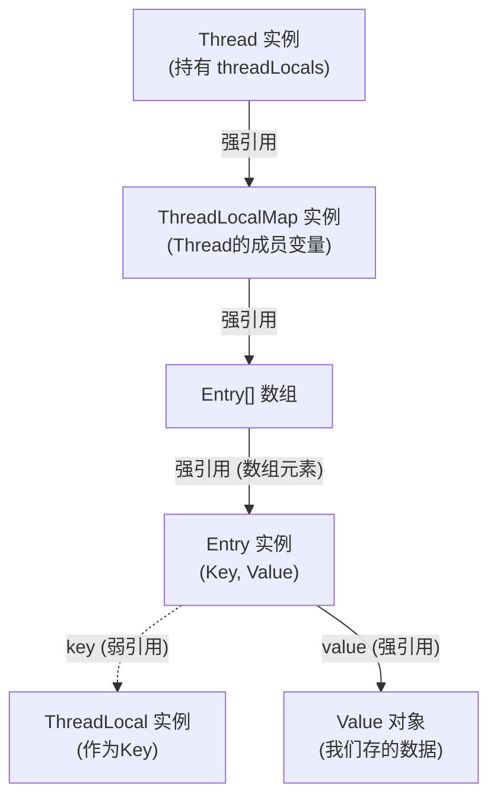

## **面试**

- **为什么用弱引用？**
  - 为了在外部强引用消失后，`ThreadLocal` 对象本身能够被 GC 回收，打破 `Thread -> ThreadLocalMap -> Entry -> key(ThreadLocal)` 这条强引用链，防止 `key` 的内存泄漏。
- **如何清除脏 Entry？**
  - 弱引用导致了 `key` 为 `null` 而 `value` 存在的“脏条目”，可能导致 `value` 的内存泄漏。
  - `ThreadLocalMap` 在 `get()`, `set()`, `remove()` 操作时，会“顺便”触发清理机制。
  - 核心清理方法是 `expungeStaleEntry`，它不仅会删除脏条目，还会对后续元素进行 `rehash`，以保持哈希表的正确性。
  - 尽管有自动清理机制，但最保险的做法是养成好习惯：总是在 `finally` 块中调用 `remove()` 方法。

## `ThreadLocal`：为何它不可或缺？

在多线程编程中，我们的首要敌人是**共享可变状态 (Shared Mutable State)**。为了保护这种状态，我们最先想到的就是**加锁** (`synchronized`, `Lock`)。

锁的哲学是 **“时间换安全”**：通过序列化线程对资源的访问，强行将并行操作转为串行，以此保证数据一致性。但其代价是显著的：

- **性能损耗**：锁竞争导致线程阻塞、上下文切换，在高并发下是主要的性能瓶 gill。
- **死锁风险**：复杂的业务逻辑中，锁的获取顺序稍有不慎，便会引发死锁，难以排查。

`ThreadLocal` 提供了另一种截然不同的解决思路，它的哲学是 **“空间换时间”**。它不解决“如何安全地共享”，而是直接 **“杜绝共享”**。

`ThreadLocal` 为每个线程都维护一个独立的变量副本。每个线程都只读写自己的副本，线程之间的数据天然隔离，互不影响。既然没有共享，自然也就不存在线程安全问题，从而避免了锁带来的性能开销和复杂性。

因此，`ThreadLocal` 的核心价值体现在两个方面：

1.  **根本性地规避线程安全问题**：通过线程级别的状态隔离，提供了一种无锁的线程安全方案。
2.  **实现全链路的“隐式”上下文传递**：在一个线程的完整生命周期中（例如一次 Web 请求），需要在不同层级（Controller, Service, DAO）之间传递上下文信息（如用户信息、事务 ID、数据库连接等）。如果通过方法参数显式传递 (`doSomething(conn, user, ...)`), 将导致代码严重耦合且极为冗长。`ThreadLocal` 允许我们将这些信息绑定到当前线程，任何需要的地方都可以直接获取，实现了完美的解耦和代码简化。

**经典场景：数据库连接管理**

在一个典型的 Web 应用中，一个请求从头到尾由同一个线程处理。

- **传统方案**：`Connection conn` 参数必须贯穿整个调用链：`controller(conn)` -\> `service(conn)` -\> `dao(conn)`。这是一种设计上的灾难。
- **`ThreadLocal` 方案**：在请求开始时（如在 Filter 或 Interceptor 中），从连接池获取一个连接，存入 `ThreadLocal<Connection>`。在 DAO 层，直接从`ThreadLocal`中获取连接。在请求结束时，同样在 Filter 或 Interceptor 的`finally`块中，从`ThreadLocal`取出连接并关闭。整个流程清晰、优雅、高内聚低耦合。

## `ThreadLocal` 核心 API 详解

`ThreadLocal` 的 API 极为简洁，掌握以下四个方法即可。

1.  **`set(T value)`**

    - 为当前线程设置一个独有的值。
    - `userContext.set("User-A");`

2.  **`get()`**

    - 获取当前线程绑定的值。
    - 如果在调用 `get()` 之前，当前线程没有调用过 `set()`，`get()`会返回一个初始值。这个初始值由 `initialValue()` 方法决定。
    - `String currentUser = userContext.get();`

3.  **`remove()`**

    - 移除当前线程绑定的值。
    - **这是 `ThreadLocal` 最重要也最容易被忽略的方法。** 在线程池等线程被复用的场景下，**必须、一定、务必** 在业务逻辑执行完毕后调用 `remove()`，否则将导致严重的**内存泄漏**和**数据污染**。我们稍后会从源码层面解释原因。

4.  **`initialValue()` (受保护方法) / `withInitial()` (静态工厂)**

    - `initialValue()` 是一个 `protected` 方法，用于返回线程局部变量的初始值。当线程首次调用 `get()` 时，若无值，此方法会被调用。
    - 从 Java 8 开始，推荐使用更简洁的静态工厂方法 `ThreadLocal.withInitial(Supplier<S> supplier)`。

**代码示例：**

```java
// 推荐 (Java 8+)：使用静态工厂方法，简洁且清晰
ThreadLocal<SimpleDateFormat> dateFormatHolder = ThreadLocal.withInitial(
    () -> new SimpleDateFormat("yyyy-MM-dd HH:mm:ss")
);

// 老式 (Java 8 之前)：使用匿名内部类
ThreadLocal<Long> transactionId = new ThreadLocal<Long>() {
    @Override
    protected Long initialValue() {
        // 通常用于生成一个唯一的、与线程相关的ID
        return System.nanoTime();
    }
};

// 使用
String formattedDate = dateFormatHolder.get().format(new Date());
Long txId = transactionId.get();
```

## 实践案例与最佳实践

下面的代码演示了在线程池场景下 `ThreadLocal` 的正确用法。

```java
import java.util.ArrayList;
import java.util.List;
import java.util.concurrent.CompletableFuture;
import java.util.concurrent.ExecutorService;
import java.util.concurrent.Executors;
import java.util.concurrent.ThreadLocalRandom;

public class Main {

    // 销售业绩统计类
    static class SalesPerformance {
        private int orderCount = 0;
        private double totalSales = 0.0;

        public void recordOrder(int count, double sales) {
            this.orderCount += count;
            this.totalSales += sales;
        }

        @Override
        public String toString() {
            return " [总订单数=" + orderCount + ", 总销售额=" + String.format("%.2f", totalSales) + "]";
        }
    }

    // 1. 最佳实践：将ThreadLocal声明为 private static final，确保其实例的唯一性。
    // 2. 最佳实践：使用 withInitial 提供初始值，避免在get()后进行null判断。
    private static final ThreadLocal<SalesPerformance> performanceTracker = ThreadLocal
            .withInitial(SalesPerformance::new);

    // 模拟处理单个销售员的销售任务
    private static void processSalesTask(String salesman) {
        String originalThreadName = Thread.currentThread().getName();
        // 方便日志观察，将销售员名字附加到线程名
        Thread.currentThread().setName(originalThreadName + " [" + salesman + "]");

        try {
            // 3. get()方法获取当前线程的副本，如果不存在，则通过withInitial创建。
            SalesPerformance performance = performanceTracker.get();

            // 模拟该销售员产生随机数量的订单
            int salesCount = ThreadLocalRandom.current().nextInt(1, 11);
            for (int i = 0; i < salesCount; i++) {
                performance.recordOrder(1, ThreadLocalRandom.current().nextDouble() * 1000);
            }

            System.out.println(Thread.currentThread().getName() + " -> 完成了当日业绩统计:" + performance);

        } finally {
            // 4. 核心最佳实践：必须在 finally 块中调用 remove()！
            //    这可以防止线程池中的线程复用时，下一个任务拿到上一个任务的脏数据。
            //    同时，这也是防止内存泄漏的关键。
            performanceTracker.remove();

            // 恢复原始线程名
            Thread.currentThread().setName(originalThreadName);
        }
    }

    public static void main(String[] args) {
        // 使用固定大小的线程池模拟Web服务器处理并发请求
        ExecutorService pool = Executors.newFixedThreadPool(3);

        try {
            String[] salesmen = {"张三", "李四", "王五", "赵六", "孙七", "周八"};
            List<CompletableFuture<Void>> allTasks = new ArrayList<>();

            System.out.println("系统启动，开始为销售员分配异步任务到线程池...");

            for (String salesman : salesmen) {
                CompletableFuture<Void> task = CompletableFuture.runAsync(
                        () -> processSalesTask(salesman),
                        pool);
                allTasks.add(task);
            }

            // 等待所有异步任务执行完成
            CompletableFuture.allOf(allTasks.toArray(new CompletableFuture[0])).join();

            System.out.println("\n所有任务已成功执行完毕。线程池中的线程可以被后续任务安全复用。");

        } finally {
            // 确保线程池被最终关闭
            pool.shutdown();
        }
    }
}
```

## `Thread`, `ThreadLocal`, 和 `ThreadLocalMap`

### 一、一切的起点：`java.lang.Thread` 类

让我们首先打开 `Thread` 类的源码。在其中，你会找到两个非常关键的成员变量：

```java
// openjdk.java.base/java/lang/Thread.java

/* ThreadLocal values pertaining to this thread. This map is maintained
 * by the ThreadLocal class. */
ThreadLocal.ThreadLocalMap threadLocals = null;

/*
 * InheritableThreadLocal values pertaining to this thread. This map is
 * maintained by the InheritableThreadLocal class.
 */
ThreadLocal.ThreadLocalMap inheritableThreadLocals = null;
```

从这段源码我们可以得出第一个决定性的信息：

1.  **每个线程 (`Thread` 实例) 都拥有一个名为 `threadLocals` 的成员变量**，它的类型是 `ThreadLocal.ThreadLocalMap`。
2.  这个变量是**包级私有**的，意味着只有 `java.lang` 包内的类可以直接访问它，这其中就包括 `ThreadLocal`。
3.  这个 `threadLocals` 变量**默认是 `null`**。它只在线程第一次需要存储 `ThreadLocal` 变量时才会被创建，这是一种延迟初始化（Lazy Initialization）策略。

**结论**：`Thread` 是 `ThreadLocal` 数据的实际“拥有者”和“载体”。它随线程的创建而生，随线程的销毁而亡。

### 二、核心的访问入口：`java.lang.ThreadLocal` 类

`ThreadLocal` 是我们日常使用的 API 入口。我们通过它的 `set()`、`get()` 和 `remove()` 方法来操作线程局部变量。现在我们深入这些方法，看看它们是如何与 `Thread` 的 `threadLocals` 交互的。

#### 1. `set(T value)` 方法

```java
// openjdk.java.base/java/lang/ThreadLocal.java

public void set(T value) {
    // 1. 获取当前正在执行此代码的线程
    Thread t = Thread.currentThread();

    // 2. 从当前线程中获取其内部的 threadLocals 这个 Map
    ThreadLocalMap map = getMap(t);

    if (map != null) {
        // 3a. 如果Map已经存在，就以 this (即当前的ThreadLocal实例) 为key，存入value
        map.set(this, value);
    } else {
        // 3b. 如果Map不存在(首次调用)，则为该线程创建Map
        createMap(t, value);
    }
}

// getMap(t) 的实现非常直接：
ThreadLocalMap getMap(Thread t) {
    return t.threadLocals; // 直接返回线程的成员变量
}

// createMap(t, value) 的实现：
void createMap(Thread t, T firstValue) {
    // 创建一个新的ThreadLocalMap，并将其设置到当前线程的threadLocals变量上
    t.threadLocals = new ThreadLocalMap(this, firstValue);
}
```

**`set` 方法的源码揭示了：**

- 它不持有任何数据。
- 它的工作流程是：获取当前线程 `t` -\> 获取 `t.threadLocals` 这个 `Map` -\> 把 `value` 存入这个 `Map` 中，而存入的 **Key 正是 `ThreadLocal` 实例本身 (`this`)**。

#### 2. `get()` 方法

```java
// openjdk.java.base/java/lang/ThreadLocal.java

public T get() {
    // 1. 获取当前线程
    Thread t = Thread.currentThread();
    // 2. 获取该线程的 threadLocals Map
    ThreadLocalMap map = getMap(t);

    if (map != null) {
        // 3a. 如果Map存在，以 this (ThreadLocal实例) 为key，查找对应的Entry
        ThreadLocalMap.Entry e = map.getEntry(this);
        if (e != null) {
            @SuppressWarnings("unchecked")
            T result = (T)e.value;
            return result;
        }
    }

    // 3b. 如果Map不存在，或Map中没有对应的Entry，则初始化
    return setInitialValue();
}

// setInitialValue() 内部会调用我们重写的 initialValue() 方法，
// 获取初始值，然后像 set() 方法一样，将其存入Map中并返回。
```

**`get` 方法的源码再次确认了：**

- 它同样是先获取当前线程的 `threadLocals` Map，然后用自身作为 `key` 在这个 `Map` 中查找值。

### 三、真正的存储结构：`ThreadLocal.ThreadLocalMap` 类

`ThreadLocalMap` 是 `ThreadLocal` 的一个**静态内部类**。它是一个定制化的哈希表，并非 `java.util.HashMap`。它的设计充满了针对性优化。

其最核心的设计在于它的条目——`Entry`。

```java
// openjdk.java.base/java/lang/ThreadLocal.java

static class ThreadLocalMap {

    /**
     * Entry是WeakReference的子类，它对key (ThreadLocal实例) 是弱引用。
     */
    static class Entry extends WeakReference<ThreadLocal<?>> {
        /** 与此ThreadLocal关联的值 */
        Object value; // 对value是强引用

        Entry(ThreadLocal<?> k, Object v) {
            super(k); // 调用父类WeakReference的构造器
            value = v;
        }
    }

    // ... Map的内部实现，如Entry[] table, set(), getEntry()等 ...
}
```

**`ThreadLocalMap` 和 `Entry` 的源码是理解内存泄漏的关键：**

1.  **Key 是弱引用 (Weak Reference)**：`Entry` 的 `key` （即 `ThreadLocal` 实例）被一个 `WeakReference` 包裹。这意味着，如果一个 `ThreadLocal` 实例在外部没有被任何强引用指向（比如一个方法内局部变量定义的 `ThreadLocal`），那么在下一次 GC 发生时，这个 `ThreadLocal` 实例就会被回收。此时，`Entry` 中的 `key` 会自动变为 `null`。
2.  **Value 是强引用 (Strong Reference)**：然而，`Entry` 中的 `value` 是一个普通的 `Object` 类型的强引用。

这就构成了潜在的内存泄漏链条：只要线程不死，线程 `Thread` 实例就一直强引用着 `ThreadLocalMap` 实例，而 `ThreadLocalMap` 实例又强引用着 `Entry` 实例，`Entry` 实例又强引用着 `value`。如果 `key` (ThreadLocal) 被回收了，但我们没有手动调用 `remove()` 方法，那么这个 `value` 将永远无法被访问到，也永远无法被回收，从而造成内存泄漏。

### 关系梳理与图解

现在，我们可以清晰地画出它们三者之间的关系图：



**总结与回顾:**

1.  **`Thread` 是“大地”**：它提供了 `ThreadLocal` 数据赖以生存的土壤（`threadLocals` 成员变量）。
2.  **`ThreadLocalMap` 是“房子”**：它是在这片土地上建立起来的、用于存放具体物品的建筑。每个线程最多只有一个这样的房子。
3.  **`ThreadLocal` 是“钥匙”**：我们使用这把钥匙 (`ThreadLocal` 实例) 去打开这栋房子 (`ThreadLocalMap`)，然后存取属于这把钥匙的物品 (`value`)。一把钥匙对应一个储物格(`Entry`)。
4.  **`Entry` 是“储物格”**：它把钥匙（弱引用）和物品（强引用）配对存放。

这个设计精妙地实现了线程间数据的隔离，同时也通过弱引用 `key` 的设计，试图在一定程度上避免内存泄漏，但这并不能完全取代开发者**显式调用 `remove()` 方法**的责任。

## 四、`ThreadLocal` 之为什么源码用弱引用

要理解为什么 `ThreadLocalMap` 中的 `Entry` 对 `ThreadLocal` 本身（也就是 `key`）使用弱引用（`WeakReference`），我们首先要明白 `ThreadLocal` 的核心工作机制，然后通过一个“反证法”来思考：如果用强引用会发生什么？

### **1. ThreadLocal 的核心工作链**

`ThreadLocal` 的数据存储链条如下：

- 一个 `Thread` 对象内部有一个成员变量 `threadLocals`，它的类型是 `ThreadLocal.ThreadLocalMap`。
- `ThreadLocalMap` 是 `ThreadLocal` 的一个静态内部类，其内部维护了一个 `Entry` 数组。
- 这个 `Entry` 对象的 `key` 是 `ThreadLocal` 实例本身，`value` 则是我们想要存储的线程局部变量。

这条关系链可以简化为：`Thread` -\> `ThreadLocalMap` -\> `Entry[]` -\> `(key, value)`。

关键在于 `Entry` 的源码定义（以 JDK 8/11 为例）：

```java
static class Entry extends WeakReference<ThreadLocal<?>> {
    /** The value associated with this ThreadLocal. */
    Object value;

    Entry(ThreadLocal<?> k, Object v) {
        super(k); // 调用 WeakReference 的构造函数，将 key 包装成弱引用
        value = v; // value 是一个强引用
    }
}
```

从源码可以看出：

- `Entry` 继承了 `WeakReference<ThreadLocal<?>>`。
- `key` (即 `ThreadLocal` 实例) 是通过 `super(k)` 传递给 `WeakReference` 构造函数的，因此 `Entry` 对 `key` 的引用是 **弱引用**。
- `value` (我们设置的值) 是一个普通的 `Object` 成员变量，因此 `Entry` 对 `value` 的引用是 **强引用**。

### **2. 反证法：如果 Key 使用强引用会发生什么？**

假设 `Entry` 的定义如下（**注意：这是错误假设**）：

```java
// 错误假设
static class Entry {
    ThreadLocal<?> key; // 强引用
    Object value;

    Entry(ThreadLocal<?> k, Object v) {
        key = k;
        value = v;
    }
}
```

现在我们考虑一个常见的场景：**线程池**。线程池中的线程生命周期非常长，它们执行完一个任务后不会被销毁，而是等待下一个任务。

设想以下代码在一个由线程池分配的线程中执行：

```java
public void someMethod() {
    ThreadLocal<MyObject> local = new ThreadLocal<>();
    local.set(new MyObject());
    // ... 方法执行 ...
    // 方法结束，local 这个栈变量被销毁
}
```

当 `someMethod` 执行完毕后，栈上的 `local` 引用被弹出，从我们代码的角度看，已经没有任何强引用指向这个 `ThreadLocal` 实例了。我们期望它能被垃圾回收器（GC）回收。

但是，如果 `Entry` 的 `key` 是强引用，会发生以下情况：

1.  **`Thread` 活得很好**：线程池里的这个线程还在运行，所以 `Thread` 对象本身是 GC Root，不会被回收。
2.  **`ThreadLocalMap` 活得很好**：`Thread` 对象强引用着它的 `ThreadLocalMap`。
3.  **`Entry` 活得很好**：`ThreadLocalMap` 强引用着它的 `Entry` 数组，所以 `Entry` 对象也不会被回收。
4.  **`ThreadLocal` 实例无法被回收**：因为 `Entry` 对象强引用着 `key`（那个 `ThreadLocal` 实例），导致即使我们代码中对它的引用 (`local`) 已经消失，它也因为这条引用链 (`Thread` -\> `ThreadLocalMap` -\> `Entry` -\> `key`) 的存在而无法被 GC 回收。
5.  **`value` 也无法被回收**：`Entry` 同样强引用着 `value`，`key` 回收不了，`Entry` 回收不了，`value` 自然也回收不了。

**结论：** 如果使用强引用，只要线程不销毁，那么这个线程曾经关联过的所有 `ThreadLocal` 对象及其对应的 `value` 都无法被回收，即使这些 `ThreadLocal` 对象在业务代码中早已不再使用。这将导致 **严重的内存泄漏**。

### **3. 弱引用的巧妙之处**

现在我们回到真实的源码实现，`key` 是弱引用。

> **弱引用（WeakReference）** 的特点是：当一个对象只被弱引用指向时，下一次垃圾回收发生时，这个对象一定会被回收，无论当前内存是否充足。

我们再来分析一下 `someMethod` 执行完后的情况：

1.  `someMethod` 结束，栈上的 `local` 引用消失。现在，指向 `ThreadLocal` 实例的只剩下 `Entry` 中的那个 **弱引用** 了。
2.  当 GC 发生时，垃圾回收器发现这个 `ThreadLocal` 实例只被一个弱引用指向。
3.  根据弱引用的规则，GC 会 **回收这个 `ThreadLocal` 实例**。
4.  `ThreadLocal` 实例被回收后，`Entry` 中那个 `WeakReference` 对象所指向的内存地址就变成了 `null`。此时，`entry.get()` 的返回值就是 `null`。

**这种 `key` 变为 `null`，但 `value` 仍然存在的 `Entry`，我们称之为“脏条目”（Stale Entry）。**

通过使用弱引用，`ThreadLocal` 的设计者巧妙地打破了前面描述的强引用链，使得 `ThreadLocal` 对象本身可以像普通对象一样被 GC 正常回收，避免了因线程生命周期过长而导致的 `key` 的内存泄漏。

但是，这也引出了一个新的问题：`key` 被回收了，变成了 `null`，但 `value` 还是被 `Entry` **强引用** 着，`Entry` 又被 `ThreadLocalMap` 强引用着，`ThreadLocalMap` 又被 `Thread` 强引用着。如果不做任何处理，`value` 将永远无法被回收，内存泄漏依然存在。

这就引出了第五部分的内容：`ThreadLocal` 必须有一套机制来清理这些“脏条目”。

---

## 五、`ThreadLocal` 之清除脏 `Entry`

`ThreadLocal` 的设计者预见到了弱引用会产生“脏条目”的问题，因此在 `ThreadLocalMap` 的 `get()`, `set()`, `remove()` 等方法中都包含了清除逻辑。这种清理不是实时的，而是“启发式”或“懒惰式”的，在每次操作 `ThreadLocalMap` 时顺便进行。

### **1. 清理时机**

清理操作主要发生在以下三个时刻：

1.  **`set()` 时**：当给 `ThreadLocal` 设置值时。
2.  **`get()` 时**：当获取 `ThreadLocal` 的值，并且发生哈希碰撞或者找到了一个脏条目时。
3.  **`remove()` 时**：当显式调用 `remove()` 方法时（这是最直接的清理方式）。

### **2. 源码分析：核心清理方法 `expungeStaleEntry`**

`ThreadLocalMap` 的清理工作主要由 `expungeStaleEntry(int staleSlot)` 方法完成。这个方法是整个清理机制的核心。它的作用是：

- 从传入的 `staleSlot`（一个已知是脏条目的索引）开始。
- 清除 `staleSlot` 位置的 `Entry`（将其 `value` 和 `Entry` 自身都设为 `null`，以便 GC 回收）。
- **线性探测**（向后遍历）整个哈希表，处理后续可能因为哈希冲突而放在错误位置的元素，以及遇到的其他脏条目。

它的基本逻辑如下：

```java
private int expungeStaleEntry(int staleSlot) {
    Entry[] tab = table;
    int len = tab.length;

    // 1. 清理传入的 staleSlot
    tab[staleSlot].value = null;
    tab[staleSlot] = null;
    size--;

    // 2. 向后线性探测，直到遇到 null 的槽位
    Entry e;
    int i;
    for (i = nextIndex(staleSlot, len); (e = tab[i]) != null; i = nextIndex(i, len)) {
        ThreadLocal<?> k = e.get();

        // 2.1 如果又发现了一个脏条目
        if (k == null) {
            e.value = null;
            tab[i] = null;
            size--;
        } else {
            // 2.2 如果是一个正常的 Entry，需要重新计算它的哈希位置 (rehash)
            // 因为前面的 staleSlot 被清除了，可能会导致这个 Entry 的正确位置发生变化
            int h = k.threadLocalHashCode & (len - 1);
            if (h != i) {
                // 如果当前位置不是它的理想位置，就把它挪过去
                tab[i] = null; // 先从当前位置移除
                // 从理想位置 h 开始向后找一个空位安放
                while (tab[h] != null) {
                    h = nextIndex(h, len);
                }
                tab[h] = e;
            }
        }
    }
    return i; // 返回探测结束的槽位索引
}
```

这个方法做了两件大事：

1.  **清理（Expunge）**：遇到 `key` 为 `null` 的脏条目，就将其 `value` 和 `Entry` 都置为 `null`。
2.  **重哈希（Rehash）**：遇到正常的 `Entry`，检查它是否在正确的位置上。如果不在（因为它可能因为之前哈希冲突被放到了后面），就将它移动到正确的位置上。这一步至关重要，它保证了 `ThreadLocalMap` 在清除了部分数据后，其哈希表的探测链依然是连续和正确的。

### **3. `set()` 方法中的清理逻辑**

`set()` 方法在插入或替换值时，会在线性探测的过程中检查遇到的 `Entry`。

```java
private void set(ThreadLocal<?> key, Object value) {
    // ...
    Entry[] tab = table;
    int len = tab.length;
    int i = key.threadLocalHashCode & (len - 1);

    for (Entry e = tab[i]; e != null; e = tab[i = nextIndex(i, len)]) {
        ThreadLocal<?> k = e.get();

        if (k == key) { // key 相同，直接替换 value
            e.value = value;
            return;
        }

        if (k == null) { // 发现了脏条目！
            // 调用 replaceStaleEntry，这是一个更复杂的清理和插入方法
            replaceStaleEntry(key, value, i);
            return;
        }
    }

    // ... 正常插入 ...

    // 在扩容之前，可能会进行一次扫描清理
    if (!cleanSomeSlots(i, sz) && sz >= threshold)
        rehash(); // rehash 内部会进行一次全表扫描清理
}
```

`set` 方法在探测过程中一旦遇到脏条目 (`k == null`)，就会调用 `replaceStaleEntry`。`replaceStaleEntry` 内部会调用 `expungeStaleEntry`，从发现的脏条目开始进行一轮清理，然后再把新元素插入。

此外，在 `set` 的最后，如果需要扩容，会先尝试 `cleanSomeSlots` 做一次部分清理，如果清理效果不佳再进行 `rehash`（`rehash` 会调用 `expungeStaleEntries` 进行全表清理）。

### **4. `get()` 方法中的清理逻辑**

`get()` 方法在查找值时，如果直接命中了就返回。如果没命中，或者在查找过程中遇到了脏条目，也会触发清理。

`get()` 的逻辑由 `getEntry` 和 `getEntryAfterMiss` 实现。

```java
private Entry getEntry(ThreadLocal<?> key) {
    int i = key.threadLocalHashCode & (table.length - 1);
    Entry e = table[i];
    if (e != null && e.get() == key) {
        return e; // 直接命中
    } else {
        return getEntryAfterMiss(key, i, e); // 未命中或遇到脏条目
    }
}

private Entry getEntryAfterMiss(ThreadLocal<?> key, int i, Entry e) {
    Entry[] tab = table;
    int len = tab.length;

    while (e != null) {
        ThreadLocal<?> k = e.get();
        if (k == key)
            return e; // 找到了
        if (k == null)
            expungeStaleEntry(i); // 发现了脏条目，触发清理
        else
            i = nextIndex(i, len); // 继续向后找
        e = tab[i];
    }
    return null;
}
```

`getEntryAfterMiss` 在线性探测过程中，一旦发现 `k == null`，就会以当前索引 `i` 为起点调用 `expungeStaleEntry`，开始一轮清理和重哈希。

### **5. 最佳实践：主动 `remove()`**

虽然 `ThreadLocalMap` 有上述的“被动”清理机制，但它并不能保证万无一失。如果一个 `ThreadLocal` 不再使用，并且之后再也没有对这个 `ThreadLocalMap` 进行 `get()` 或 `set()` 操作，那么脏条目就会一直存在，导致 `value` 对象的内存泄漏。

**因此，防止 `ThreadLocal` 内存泄漏的最佳实践是：** 在使用完 `ThreadLocal` 后，务必在 `finally` 块中调用其 `remove()` 方法。

```java
ThreadLocal<MyObject> myThreadLocal = new ThreadLocal<>();

try {
    myThreadLocal.set(new MyObject());
    // ... 业务逻辑 ...
} finally {
    myThreadLocal.remove(); // 必须执行！
}
```

`remove()` 方法会直接找到对应的 `Entry`，并调用 `expungeStaleEntry` 将其彻底清除，这是最干净、最可靠的防泄漏手段。
