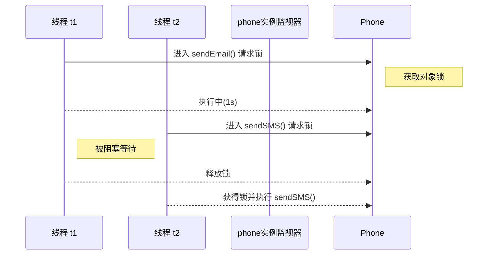
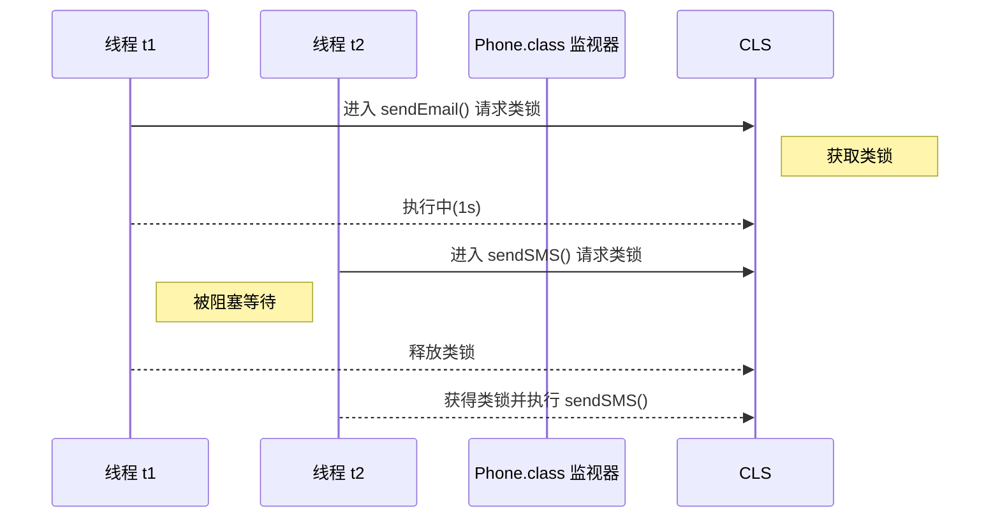
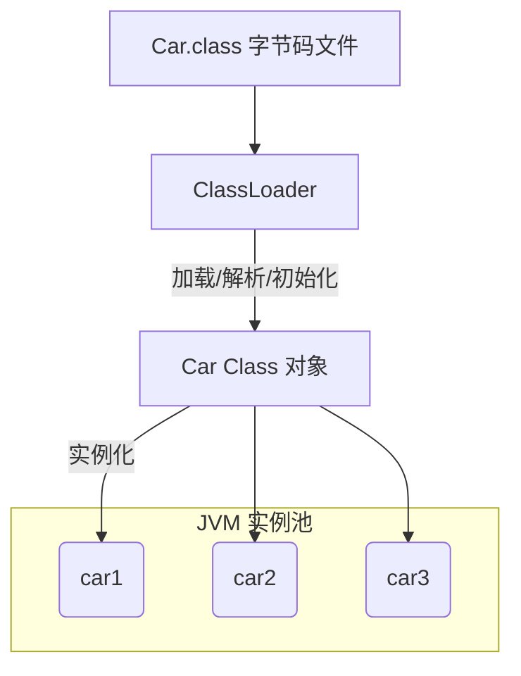

# synchronized 关键字中的对象锁与类锁详解

---

## 1. synchronized 的本质：监视器（信号量）

`synchronized` 并不是"给代码加锁"，而是 **尝试获取一个监视器对象（Monitor）内部的信号量**：

1. **每个 Java 对象天生附带一把监视器信号量**。可以把它想象成内部的"互斥量/信号量"。
2. 当线程进入 `synchronized` 代码时，JVM 会尝试对**指定监视器**进行 `P()` 操作（信号量减 1）。
3. 若信号量已被其他线程占用（值为 0），当前线程会被 **阻塞**，直到信号量被释放（`V()`）。
4. 因此，`synchronized` 本质上实现的是**基于监视器信号量的互斥访问**。

后续所有用法，都只是指定 **监视器对象是谁**：

- 实例方法 / `synchronized(this){}` → 监视器 = `this` 对象。
- `static synchronized` / `synchronized(ClassName.class){}` → 监视器 = `ClassName.class` 类对象。

**注意**：锁只影响 **同一监视器上的线程**，对其它对象/类的监视器没有影响。

## 2. 对象锁（实例锁）

### 2.1 定义（监视器 = `this`）

当 `synchronized` 作用于**实例方法**或使用 `synchronized(this)` 代码块时，JVM 会将当前对象 (`this`) 作为监视器锁（Monitor）。同一时刻只能有一个线程持有该对象锁，其他线程只能等待。

### 2.2 示例

```java
// LockSY.java 片段（对象锁示例）
class Phone {
    // 对象锁：锁的是同一个 Phone 实例
    public synchronized void sendSMS() {
        System.out.println("sendSMS");
    }

    public synchronized void sendEmail() throws InterruptedException {
        Thread.sleep(1000);
        System.out.println("sendEmail");
    }

    // 普通方法：不涉及锁
    public void sendHallow() {
        System.out.println("sendHallow");
    }
}

public class LockSY {
    public static void main(String[] args) {
        Phone phone = new Phone(); // **同一个对象实例**
        new Thread(phone::sendEmail, "t1").start();
        new Thread(phone::sendSMS , "t2").start();
        new Thread(phone::sendHallow, "t3").start();
    }
}
```

#### 执行结果

1. `sendEmail` 与 `sendSMS` 会 **串行** 执行，先 `sendEmail` 后 `sendSMS`（因为 `sendEmail` 先获得对象锁并休眠 1s）。
2. `sendHallow` 不受锁约束，可在任意时间打印。

### 2.3 时序图（对象锁）



### 2.4 结论

- **锁粒度**：单个对象实例。
- 如果两个线程作用于**同一个对象实例**的同步方法/同步代码块，它们必须排队执行。
- 如果作用于**不同实例**，则互不影响，各自拥有独立的对象锁。

### 2.5 `synchronized(this)` 代码块

`public synchronized` 方法与 `synchronized(this) {}` 本质等价，都是以 **当前对象实例** 作为监视器锁。

示例：

```java
public void sendSMS() {
    synchronized (this) { // 临界区开始，锁定当前对象
        // 与 sendEmail() 互斥
        System.out.println("sendSMS");
    }
}
```

要点：

- 进入 `synchronized(this)` 代码块时，线程尝试获取对象锁；若已被其他线程持有，则进入 **阻塞/等待** 状态。
- 与同一对象的其他 `synchronized` 实例方法或 `synchronized(this)` 代码块互斥。
- 可通过锁定更小的代码范围来 **减小锁粒度**、提升并发性能。

使用场景示例：

1. 只需同步方法中部分敏感逻辑，而非整个方法体。
2. 需要在同一方法中对不同资源使用不同锁对象，以实现更细颗粒度同步。

---

## 3. 类锁（静态锁）

### 3.1 定义（监视器 = `ClassName.class`）

当 `synchronized` 作用于**静态方法**或使用 `synchronized(类名.class)` 代码块时，监视器锁变成了 `Class` 对象（例如 `Phone.class`）。无论创建多少实例，整 个类只有一把锁。

### 3.2 示例

```java
// LockSY.java 片段（类锁示例）
class Phone {
    // 类锁：锁的是 Phone.class
    public static synchronized void sendSMS() {
        System.out.println("sendSMS");
    }

    public static synchronized void sendEmail() throws InterruptedException {
        Thread.sleep(1000);
        System.out.println("sendEmail");
    }

    public void sendHallow() {
        System.out.println("sendHallow");
    }
}

public class LockSY {
    public static void main(String[] args) {
        Phone phone = new Phone();
        new Thread(() -> Phone.sendEmail(), "t1").start();
        new Thread(() -> Phone.sendSMS() , "t2").start();
        new Thread(phone::sendHallow      , "t3").start();
    }
}
```

#### 执行结果

1. `sendEmail` 与 `sendSMS` 会 **串行** 执行，因为它们竞争的是同一把 `Phone.class` 锁。
2. `sendHallow` 依旧不受影响，随时执行。
3. 即使 `t1` 和 `t2` 使用的是 **不同的 Phone 实例**，只要调用的是 `static synchronized` 方法，仍然互斥。

### 3.3 时序图（类锁）



### 3.4 结论

- **锁粒度**：整个 `Class` 对象。
- 类锁在 JVM 进程中唯一，与实例数量无关。

## 4. JVM 类加载示意图



---

## 5. 对象锁 vs. 类锁 对比

| 特性       | 对象锁                                         | 类锁                                                         |
| ---------- | ---------------------------------------------- | ------------------------------------------------------------ |
| 监视器     | 每个对象实例 (`this`)                          | `Class` 对象 (`ClassName.class`)                             |
| 作用范围   | 同一实例的同步代码                             | 整个类的静态同步代码                                         |
| 实例间影响 | 不同实例互不影响                               | 所有实例共享一把锁                                           |
| 典型用法   | `synchronized` 实例方法 / `synchronized(this)` | `static synchronized` 方法 / `synchronized(ClassName.class)` |

---

## 6. 小结

- `synchronized` 既可以修饰实例方法，也可以修饰静态方法，表现为**对象锁**与**类锁**。
- 判断线程是否竞争同一把锁的关键是：**它们的监视器对象是否相同**。
- 在实际开发中，根据临界资源的粒度选择合适的锁类型，避免过度同步导致性能下降。

> **提示**：想验证锁粒度时，可打印 `this` 或 `ClassName.class` 的 `hashCode`，或在同步块中调用 `System.identityHashCode()` 观察是否一致。
