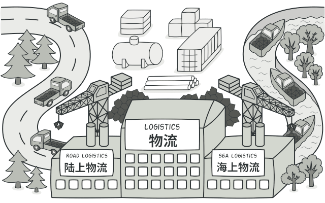
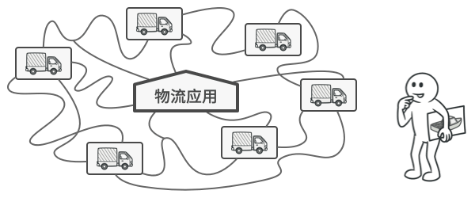
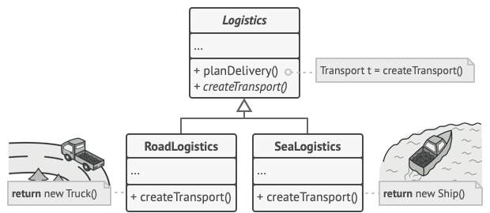
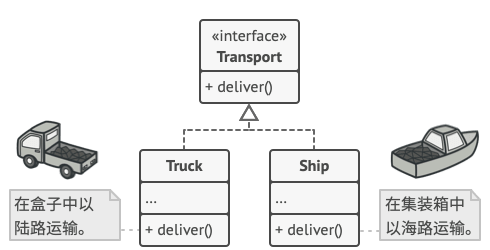
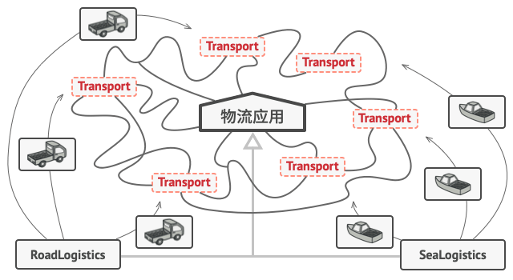
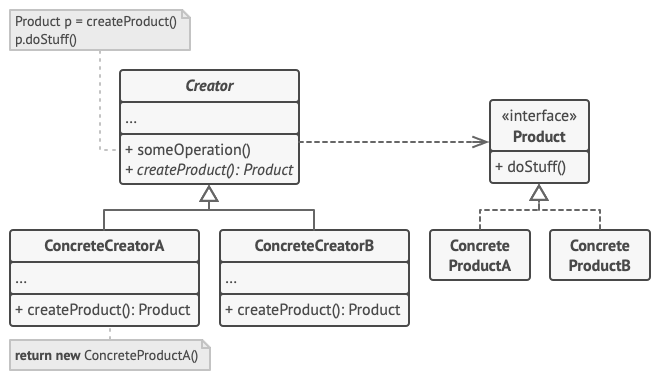
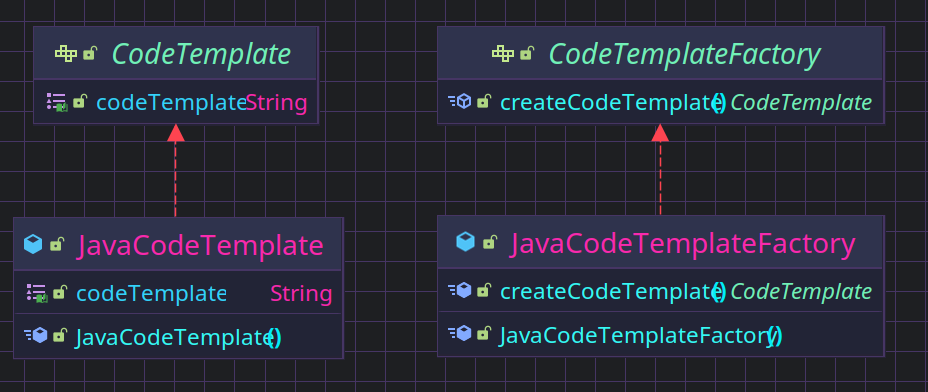

## 创造型模式

### 工厂方法模式

> ![NOTE]
> 
> 工厂方法模式（Factory Method Pattern）是一种创建型设计模式。
> 亦称：虚拟构造函数、Virtual Constructor、Factory Method

#### 设计意图

工厂方法模式是一种创建型设计模式， 其在父类中提供一个创建对象的方法， 允许子类决定实例化对象的类型。



#### 问题引出

假设你正在开发一款物流管理应用。 最初版本只能处理卡车运输， 因此大部分代码都在位于名为 `卡车`的类中。一段时间后，
这款应用变得极受欢迎。 你每天都能收到十几次来自海运公司的请求， 希望应用能够支持海上物流功能。



> 如果代码其余部分与现有类已经存在耦合关系， 那么向程序中添加新类其实并没有那么容易。

这可是个好消息。 但是代码问题该如何处理呢？ 目前， 大部分代码都与 `卡车`类相关。 在程序中添加 `轮船`类需要修改全部代码。
更糟糕的是， 如果你以后需要在程序中支持另外一种运输方式， 很可能需要再次对这些代码进行大幅修改。

最后， 你将不得不编写繁复的代码， 根据不同的运输对象类， 在应用中进行不同的处理。

#### 解决方案

工厂方法模式建议使用特殊的工厂方法代替对于对象构造函数的直接调用 （即使用 `new`运算符）。 不用担心， 对象仍将通过 `new`
运算符创建， 只是该运算符改在工厂方法中调用罢了。 工厂方法返回的对象通常被称作 “产品”。



乍看之下， 这种更改可能毫无意义： 我们只是改变了程序中调用构造函数的位置而已。 但是， 仔细想一下， 现在你可以在子类中重写工厂方法，
从而改变其创建产品的类型。

但有一点需要注意:仅当这些产品具有共同的基类或者接口时， 子类才能返回不同类型的产品， 同时基类中的工厂方法还应将其返回类型声明为这一共有接口。



> 所有产品都必须使用同一接口。

举例来说，  `卡车Truck`和 `轮船Ship`类都必须实现 运输`Transport`接口， 该接口声明了一个名为 `deliver交付`的方法。
每个类都将以不同的方式实现该方法： 卡车走陆路交付货物， 轮船走海路交付货物。  `陆路运输RoadLogistics`类中的工厂方法返回卡车对象，
而 `海路运输SeaLogistics`类则返回轮船对象。



> 只要产品类实现一个共同的接口， 你就可以将其对象传递给客户代码， 而无需提供额外数据。

调用工厂方法的代码 （通常被称为`客户端`代码） 无需了解不同子类返回实际对象之间的差别。 客户端将所有产品视为抽象的
`运输` 。 客户端知道所有运输对象都提供 `交付`方法， 但是并不关心其具体实现方式。

#### 工厂方法模式结构



1. 产品 （Product） 将会对接口进行声明。 对于所有由创建者及其子类构建的对象， 这些接口都是通用的。
2. 具体产品 （Concrete Products） 是产品接口的不同实现。
3. 创建者 （Creator） 类声明返回产品对象的工厂方法。 该方法的返回对象类型必须与产品接口相匹配。 你可以将工厂方法声明为抽象方法，
   强制要求每个子类以不同方式实现该方法。 或者， 你也可以在基础工厂方法中返回默认产品类型。 注意， 尽管它的名字是创建者，
   但它最主要的职责并不是创建产品。 一般来说， 创建者类包含一些与产品相关的核心业务逻辑。 工厂方法将这些逻辑处理从具体产品类中分离出来。
   打个比方， 大型软件开发公司拥有程序员培训部门。 但是， 这些公司的主要工作还是编写代码， 而非生产程序员。
4. 具体创建者 （Concrete Creators） 将会重写基础工厂方法， 使其返回不同类型的产品。 注意， 并不一定每次调用工厂方法都会创建新的实例。
   工厂方法也可以返回缓存、 对象池或其他来源的已有对象。

#### 代码实现



好的，完全没有问题。将您提供的关于工厂方法模式的描述，从“UI对话框”的例子修改为“OJ系统的语言处理模板”，是一个非常贴切的类比。

这是修改后的版本：

---

### 使用工厂方法模式创建语言处理模板

假设我们正在构建一个在线判题（OJ）系统，该系统需要为用户创建不同编程语言的代码模板（例如 Java, C++, Python）。这些模板虽然在具体语法和默认语句上有所不同，但其核心功能（例如，包含一个主函数/入口点，准备好读取输入）是保持一致的。

如果使用**工厂方法**模式，我们就不需要为每一种编程语言重写核心的代码生成和提交流程逻辑。如果我们在一个基础语言处理器（`CodeTemplateFactory`）类中声明一个用于生成代码模板的工厂方法（例如 `createTemplate()`），那么我们就可以创建一个具体的语言处理器子类（例如 `JavaTemplateFactory`），并使其通过重写工厂方法来返回一个包含 Java 特定语法的代码模板。

这个 `JavaTemplateFactory` 子类将继承基础语言处理器的大部分通用代码（例如，接收用户提交、调用编译器/解释器的通用逻辑），同时能够根据 Java 的语法规则，生成一个完整的、可直接使用的初始代码框架。

如需该模式正常工作，基础的**语言处理器**类必须依赖于一个抽象的代码模板（`CodeTemplate`）——可以是一个基类或接口。这个抽象模板之后可以被扩展为各种具体的语言模板（如 `JavaTemplate`, `CppTemplate` 等）。这样一来，无论语言处理器最终生成的是何种具体语言的模板，其核心的调用和处理代码都可以保持一致并正常工作。

你可以运用此方法来开发其他与语言相关的组件，例如不同语言的“标准输入读取器”或“特定数据结构的样例代码”。不过，每当你向语言处理器中添加一个新的工厂方法时（例如，除了 `createTemplate()` 再增加一个 `createInputReader()`），你就离**抽象工厂**模式更近了一步。我们将在稍后谈到这个模式。

```java
/**
 * 代码模板接口
 */
public interface CodeTemplate {
    String getCodeTemplate();
}

/**
 * 代码模板工厂接口
 */
public interface CodeTemplateFactory {
   /**
    * 创建代码模板实例
    *
    * @return 代码模板实例
    */
   CodeTemplate createCodeTemplate();
}

/**
 * Java代码模板实现类
 * 提供标准的Java代码模板，包含必要的包导入和主类结构
 */
public class JavaCodeTemplate implements CodeTemplate {

   /**
    * 获取Java代码模板
    *
    * @return 包含标准Java代码结构的字符串模板
    */
   @Override
   public String getCodeTemplate() {
      return """
              import java.util.*;
              import java.io.*;
              
              public class Main {
              
                  public static void main(String[] args) {
                      Scanner scanner = new Scanner(System.in);
                      // 在此处编写您的代码逻辑
                  }
              }
              """;
   }
}

/**
 * Java代码模板工厂实现类
 */
public class JavaCodeTemplateFactory implements CodeTemplateFactory {

   /**
    * 创建Java代码模板实例
    *
    * @return Java代码模板实例
    */
   @Override
   public CodeTemplate createCodeTemplate() {
      return new JavaCodeTemplate();
   }
}

public class Main {
    public static void main(String[] args) {
        Scanner scanner = new Scanner(System.in);
        String language = scanner.nextLine();
        if (language.equals("Java")){
           CodeTemplateFactory factory = new JavaCodeTemplateFactory();
           CodeTemplate template = factory.createCodeTemplate();
           System.out.println(template.generateCode());
        }else System.out.println("暂不支持该语言的代码模板");
    }
}
```

#### 工厂方法模式适合应用场景

1. :thinking: **当你在编写代码的过程中， 如果无法预知对象确切类别及其依赖关系时， 可使用工厂方法。**

   - 工厂方法将创建产品的代码与实际使用产品的代码分离， 从而能在不影响其他代码的情况下扩展产品创建部分代码。
   - 例如， 如果需要向应用中添加一种新产品， 你只需要开发新的创建者子类， 然后重写其工厂方法即可。

2. :thinking: **如果你希望用户能扩展你软件库或框架的内部组件， 可使用工厂方法。**

   - 继承可能是扩展软件库或框架默认行为的最简单方法。 但是当你使用子类替代标准组件时， 框架如何辨识出该子类？
   - 解决方案是将各框架中构造组件的代码集中到单个工厂方法中， 并在继承该组件之外允许任何人对该方法进行重写。
   - 让我们看看具体是如何实现的。 假设你使用开源 UI 框架编写自己的应用。 你希望在应用中使用圆形按钮， 但是原框架仅支持矩形按钮。 你可以使用 `圆形按钮 RoundButton`子类来继承标准的 `按钮Button`类。 但是， 你需要告诉 UI框架`UIFramework`类使用新的子类按钮代替默认按钮。
   - 为了实现这个功能， 你可以根据基础框架类开发子类 `圆形按钮 UI UIWithRoundButtons` ， 并且重写其 `createButton创建按钮`方法。 基类中的该方法返回 按钮对象， 而你开发的子类返回 圆形按钮对象。 现在， 你就可以使用 `圆形按钮 UI类`代替 `UI框架类`。 就是这么简单！

3. :thinking: **如果你希望复用现有对象来节省系统资源， 而不是每次都重新创建对象， 可使用工厂方法。**

   - 在处理大型资源密集型对象 （比如数据库连接、 文件系统和网络资源） 时， 你会经常碰到这种资源需求。
   - 让我们思考复用现有对象的方法：
     1. 首先， 你需要创建存储空间来存放所有已经创建的对象。
     2. 当他人请求一个对象时， 程序将在对象池中搜索可用对象。
     3. … 然后将其返回给客户端代码。
     4. 如果没有可用对象， 程序则创建一个新对象 （并将其添加到对象池中）。
     
这些代码可不少！ 而且它们必须位于同一处， 这样才能确保重复代码不会污染程序。
可能最显而易见， 也是最方便的方式， 就是将这些代码放置在我们试图重用的对象类的构造函数中。 但是从定义上来讲， 构造函数始终返回的是**新对象**， 其无法返回现有实例。
因此， 你需要有一个既能够创建新对象， 又可以重用现有对象的普通方法。 这听上去和工厂方法非常相像。

#### 实现方式

1. 让所有产品都遵循同一接口。 该接口必须声明对所有产品都有意义的方法。
2. 在创建类中添加一个空的工厂方法。 该方法的返回类型必须遵循通用的产品接口。
3. 在创建者代码中找到对于产品构造函数的所有引用。 将它们依次替换为对于工厂方法的调用， 同时将创建产品的代码移入工厂方法。
   - 你可能需要在工厂方法中添加临时参数来控制返回的产品类型。
   - 工厂方法的代码看上去可能非常糟糕。 其中可能会有复杂的 `switch分支运算符`， 用于选择各种需要实例化的产品类。 但是不要担心， 我们很快就会修复这个问题。
4. 现在， 为工厂方法中的每种产品编写一个创建者子类， 然后在子类中重写工厂方法， 并将基本方法中的相关创建代码移动到工厂方法中。
5. 如果应用中的产品类型太多， 那么为每个产品创建子类并无太大必要， 这时你也可以在子类中复用基类中的控制参数。
   - 例如， 设想你有以下一些层次结构的类。 基类 `邮件`及其子类 `航空邮件`和 `陆路邮件` ；  `运输`及其子类 `飞机`, `卡车`和 `火车` 。  `航空邮件`仅使用 `飞机对象`， 而 `陆路邮件`则会同时使用 `卡车`和 `火车`对象。 你可以编写一个新的子类 （例如 火车邮件 ） 来处理这两种情况， 但是还有其他可选的方案。 客户端代码可以给 陆路邮件类传递一个参数， 用于控制其希望获得的产品。
6. 如果代码经过上述移动后， 基础工厂方法中已经没有任何代码， 你可以将其转变为抽象类。 如果基础工厂方法中还有其他语句， 你可以将其设置为该方法的默认行为。

#### 工厂方法模式优缺点

- **优点**：
  - :heavy_check_mark: **单一职责原则**：你可以将产品创建代码放在程序的单一位置， 从而使得代码更容易维护。
  - :heavy_check_mark: **开闭原则**：无需更改现有客户端代码， 你就可以在程序中引入新的产品类型。
  - :heavy_check_mark: **可复用性**：通过工厂方法，可以重用已有的对象，节省资源。
  - :heavy_check_mark: **解耦**：你可以避免创建者和具体产品之间的紧密耦合。
- **缺点**：
  - :heavy_multiplication_x: **提高代码复杂度**： 应用工厂方法模式需要引入许多新的子类， 代码可能会因此变得更复杂。 最好的情况是将该模式引入创建者类的现有层次结构中。

#### 与其他模式的关系
- 在许多设计工作的初期都会使用`工厂方法模式` （较为简单， 而且可以更方便地通过子类进行定制）， 随后演化为使用`抽象工厂模式`、 `原型模式`或`生成器模式` （更灵活但更加复杂）。
- `抽象工厂模式`通常基于一组`工厂方法`， 但你也可以使用`原型模式`来生成这些类的方法。
- 你可以同时使用`工厂方法`和`迭代器模式`来让子类集合返回不同类型的迭代器， 并使得迭代器与集合相匹配。
- `原型`并不基于继承， 因此没有继承的缺点。 另一方面， 原型需要对被复制对象进行复杂的初始化。 `工厂方法`基于继承， 但是它不需要初始化步骤。
- `工厂方法`是`模板方法模式`的一种特殊形式。 同时， 工厂方法可以作为一个大型模板方法中的一个步骤。
