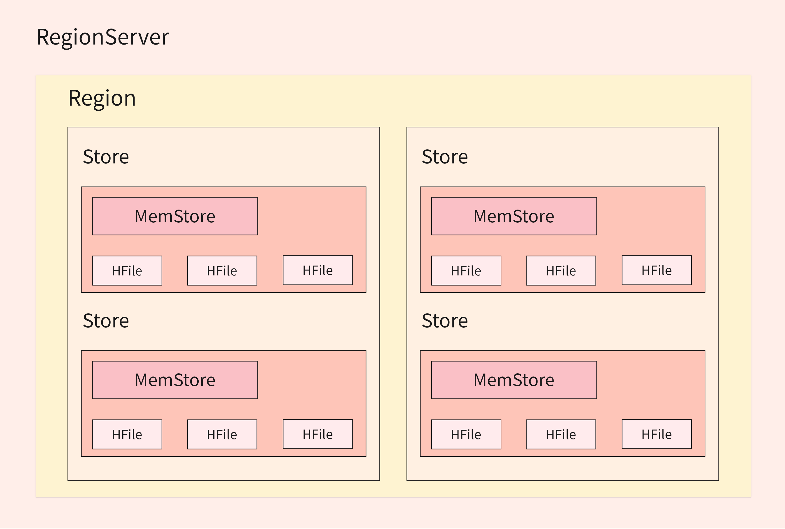
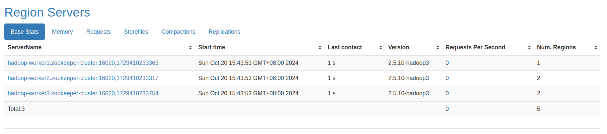
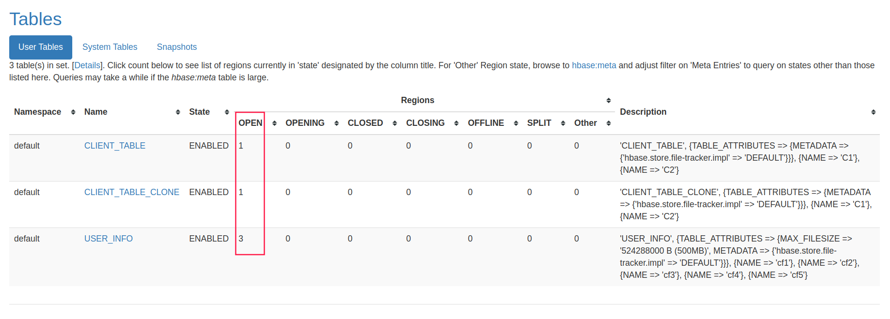
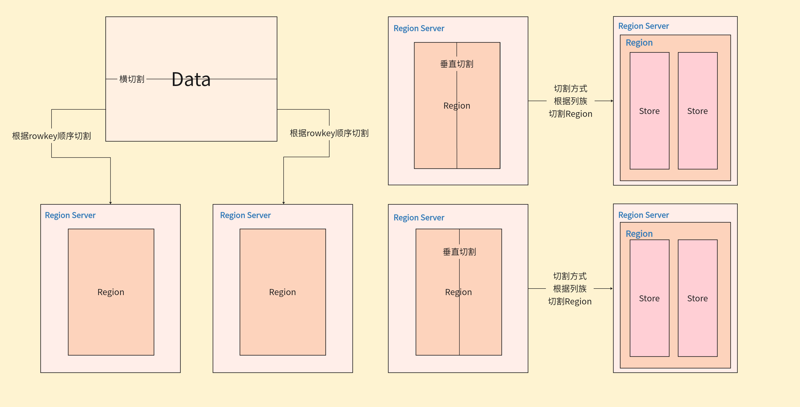

# HBase 逻辑结构模型

## 整体架构概述

HBase 是建立在 Hadoop 之上的分布式、面向列的数据库系统，提供了可靠的数据存储和快速随机访问能力。

### 进程角色

HBase 系统由以下几个关键进程组成：

- **Client**：客户端，包括 Java 应用程序、HBase Shell 等（也可通过 Flink、MapReduce、Spark 等访问）
- **HMaster**：主要负责表的管理操作（创建表、删除表、Region 分配），不负责具体的数据操作
- **HRegionServer**：负责数据的管理、操作（增删改查）及接收客户端请求

### 数据模型层次结构

HBase 的数据模型是层层递进的结构，从宏观到微观依次为：

#### Region

- Region 是 HBase 中数据分布的基本单位
- 一张表被分为多个 Region，每个 Region 保存一定 rowkey 范围的数据
- Region 中的数据按照 rowkey 的字典序排列
- Region 根据 rowkey 进行横向切割

- 每张表的 Region 数量：

#### Store

- 每个 Region 按列族垂直切分为多个 Store
- 每个列族对应一个 Store
- Store 负责存储列族的数据

#### MemStore

- MemStore 是 Store 的内存缓冲组件
- 每个列族(Store)有一个 MemStore
- 所有写入 HBase 的数据首先写入 MemStore
- 当 MemStore 接近满时，数据会被刷写(flush)到磁盘上的 StoreFile 中

#### StoreFile 与 HFile

- StoreFile 是物理存储层面的概念，底层实现是 HFile
- HFile 是 HBase 存储在 HDFS 上的文件格式
- HFile 具有丰富的结构，包括数据块(DataBlock)、索引和布隆过滤器(BloomFilter)
- 写入 HFile 的操作是连续的，速度非常快（flush 操作）

#### WAL(Write Ahead Log)

- WAL 全称为 Write Ahead Log，主要用于故障恢复
- 每个写入操作(PUT/DELETE/INCR)先记录到 WAL，再写入 MemStore
- 服务器崩溃时，可通过回放 WAL 恢复 MemStore 中的数据
- 物理上存储是 Hadoop 的 Sequence File

## 数据读写流程

### 写入流程

1. 客户端发送写请求至 RegionServer
2. 数据首先写入 WAL 日志
3. 然后数据写入对应列族的 MemStore
4. 当 MemStore 达到阈值时，触发 flush 操作，将数据写入新的 HFile
5. 定期进行文件合并(Compaction)，优化读取性能

### 读取流程

1. 客户端发送读请求至 RegionServer
2. 先检查 Block Cache（读缓存）
3. 再检查 MemStore
4. 最后检查 HFile
5. 返回合并后的结果
