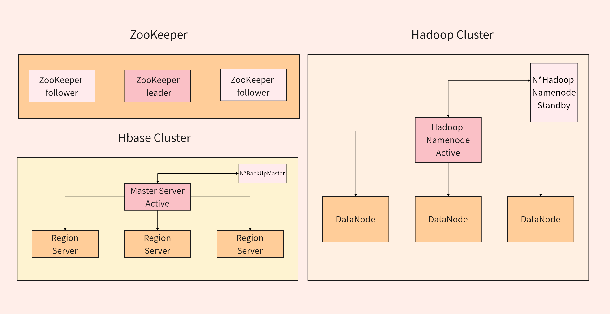
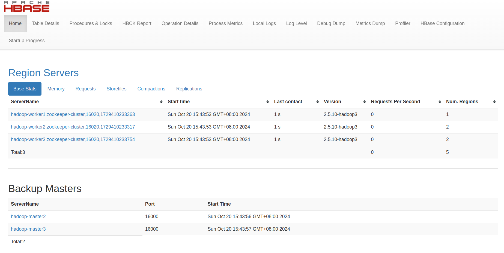

# HBase 系统架构

## 架构概述

HBase 是一个分布式、可扩展的 NoSQL 数据库，建立在 HDFS 之上，提供面向列的实时读写能力。

  
   
HBase系统架构图

HBase 系统主要由以下几个核心组件构成：

- Client：客户端，负责发送请求
- ZooKeeper：协调服务，管理集群状态
- Master：主服务器，负责管理和协调整个集群
- RegionServer：区域服务器，负责数据存储和处理

## 核心组件详解

### Client

客户端是发出 HBase 操作请求的对象，包括但不限于：

- Java API 代码
- HBase Shell 命令行工具
- REST/Thrift API 等接口

客户端主要职责：

- 通过 ZooKeeper 定位 Region 位置
- 直接与 RegionServer 通信进行数据读写
- 与 Master 通信进行 DDL 操作（创建、删除、修改表等）

### ZooKeeper

ZooKeeper 在 HBase 中扮演协调服务的角色，主要职责：

- 存储 HBase 集群的元数据信息
- 监控 RegionServer 的状态
- 提供 Master 选举机制
- 存储 Region 寻址信息
- 协调集群配置信息

### Master

Master 是 HBase 集群的管理者，负责管理和协调整个系统。

  
  
Master Web UI

Master 主要职责：

- 监控所有 RegionServer 的状态
- 处理 RegionServer 故障转移
- 管理元数据的变更（表的创建、删除、修改等）
- 处理 Region 的分配或移除
- 在空闲时进行数据的负载均衡
- 通过 ZooKeeper 发布自己的位置给客户端

> Master 专注于管理功能，不直接参与数据读写操作，主要负责元数据管理和资源分配。

### RegionServer

RegionServer 是实际存储 HBase 数据并处理客户端读写请求的服务器。

  
  
RegionServer结构图

RegionServer 主要职责：

- 处理分配给它的 Region
- 负责存储和管理 HBase 的实际数据
- 刷新内存缓存(MemStore)到 HDFS(HFile)
- 维护预写日志(Write-Ahead Log)
- 执行数据压缩
- 处理 Region 分裂和合并

#### RegionServer 内部组件

RegionServer 内部包含多个关键组件：

1. **Region**：数据的基本存储单元，对应表的一个数据分片
2. **Store**：对应一个列族的存储，每个 Region 包含多个 Store
3. **MemStore**：内存存储，数据写入时首先进入 MemStore
4. **HFile(StoreFile)**：磁盘存储格式，当 MemStore 满时数据刷新到 HFile
5. **Write-Ahead Log(WAL)**：预写日志，保证数据写入的可靠性

## HBase 读写流程

### 写入流程

1. Client 通过 ZooKeeper 找到数据对应的 RegionServer
2. 数据首先写入 WAL 日志
3. 数据写入对应的 MemStore
4. 当 MemStore 达到阈值时，数据刷写到 HFile

### 读取流程

1. Client 通过 ZooKeeper 找到数据对应的 RegionServer
2. 客户端发送读请求到 RegionServer
3. RegionServer 先查找 MemStore，再查找 BlockCache，最后查找 HFile
4. 返回结果给客户端
